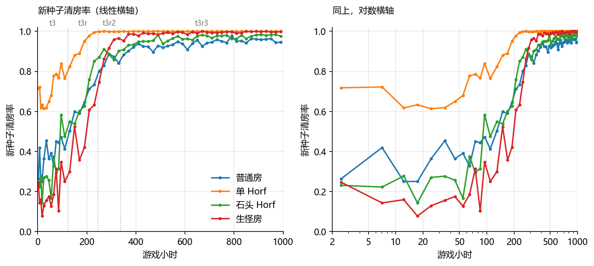
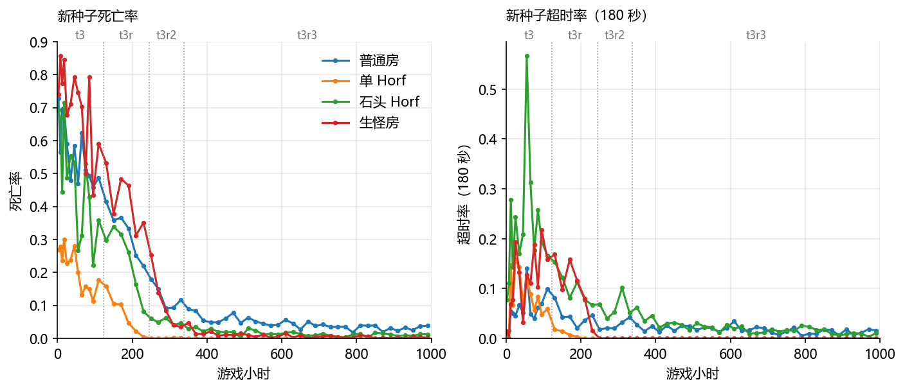
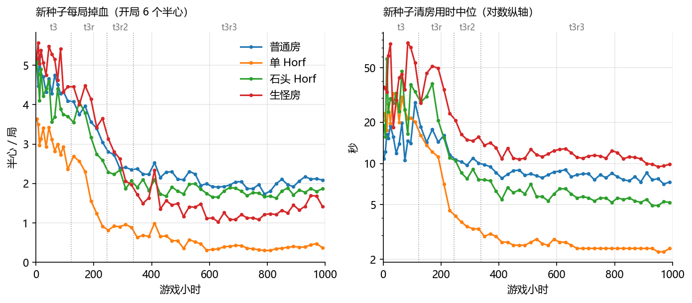
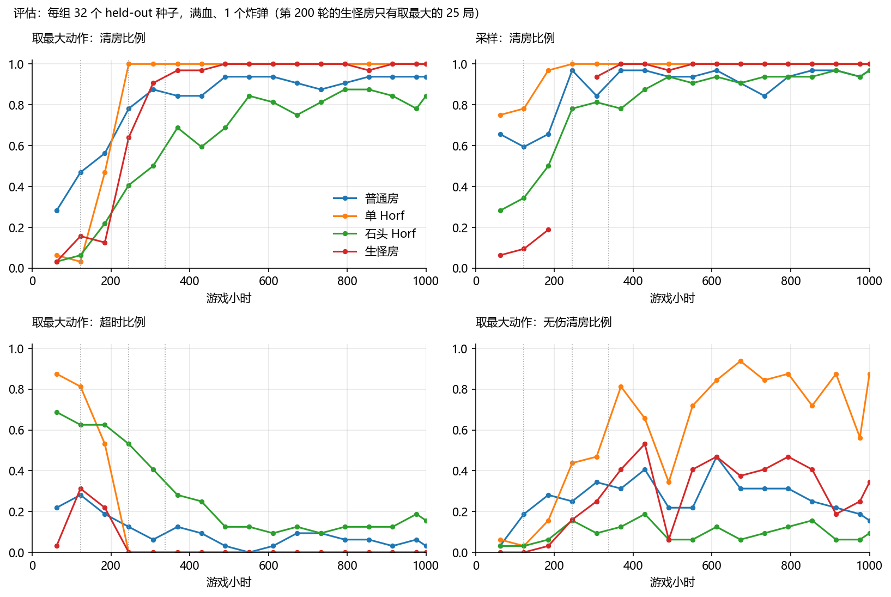
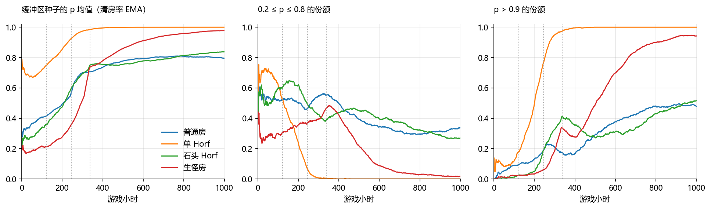
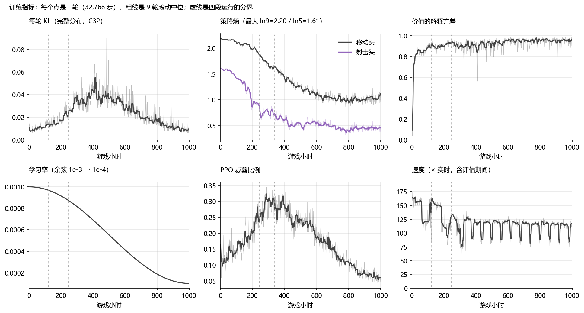

# AB+ 实验记录

本文只记录 AB+ 桥接与战斗训练的实验，每条分三段：**实验目的**（要回答的问题）、**实验方法**（改了什么、怎么做、在哪里跑）、**实验结果**（测到的数字和结论）。管线设计、奖励定义和用法见 [README.md](README.md)；引擎改造层（`abp_turbo`）的实验见 [ABP_LINUX_REVERSE_ENGINEERING.md](../../../analysis/docs/ABP_LINUX_REVERSE_ENGINEERING.md)；模拟器一侧的训练不在本文。新实验按同样格式追加。2026-09-28 精简过一次，精简前的全文在 `rl/runs/doc-backups/EXPERIMENTS-full-20260928.md`。

## 约定

- **时间**：远端时间（CST）。
- **游戏时**：决策数 × 每决策帧数 ÷ 30 帧/秒；相对实时的倍率 = 决策/秒 × 每决策帧数 ÷ 30。每决策帧数到 C38 都是 2，C39 是 4（各次 `config.json` 的 `frames_per_decision`，没有这一项的是 2）。
- **运行目录**：远端 `~/isaac-abplus/train/<运行名>`，含 `config.json`（全部参数）、`progress.csv`（每轮日志）、`episodes.jsonl`（每局记录）、`evaluations*/<checkpoint>/`（评估结果和回放）。
- **统计脚本**：标了远端 `/tmp/asy` 的是临时脚本，没有进仓库；远端重启时 `/tmp` 会清空。09-29 整理时，第一台 `/tmp/asy` 里本文没提到的临时文件和冒烟数据都移进了回收站（`~/.local/share/Trash`），本文提到的留在原处。
- **评估**：混合评估用从 2147490000 起的 64 个 held-out 种子，房间、入口和开局炸弹数都由种子决定，训练时不会抽到，一律满血。"取最大"每步取概率最大的动作（确定性）；"采样"按策略概率采样。
- **结局**：胜 / 死 / 超时，写成 W/D/T 或三个比例。
- **回放页**：远端看板 `/replay?run=…&eval=…`；早期的在本地 `rl/runs/abplus-replays/`（`.claude/launch.json` 的 `abplus-replays`，端口 8791）。
- **代码**：C15 之前的改动在 f25953e、c45654c 里；C16 起的改动都还没提交。
- **沙箱**（A19 起）：都是主工作区的副本（`python/`、`abp_bridge.lua`、`tools/libabp_turbo.so`、`tools/stub_render_g.txt`），结果在各自的 `runs/`；已部署的 `bridge/`、`flr/`、`tools/` 没有改动。
  - 第二台 `~/isaac-abplus/fk`：10-03 的副本（桥 abp-0.2.14），A19、B9、B10、C55、C56、C59。C56b 运行期间只在原处给 `train_tok.py` 补了 `--teach-reuse`、`--micro`，没有同步工作区。
  - 第二台 `~/isaac-abplus/fk2`：之后的副本（abp-0.2.15，精简观测仍由 Lua 打包，`libabp_turbo.so` 与 `fk` 的相同），A20、C57。
  - 第一台 `~/isaac-abplus/fk2`：合并后的副本（abp-0.2.15 + 原生观测 + 新训练器），python 用 `/home/eolc/isaac-rl/.venv/bin/python`，A20、B11、C58；10-04 02:31 换上 B12 修好的 actor 槽，03:27 起是 B12 的整套（C58 续训、C60 的各支）；18:23 换上 B13 的 `CUDA_DEVICE_MAX_CONNECTIONS` 设置和默认在 CPU 上的 `eval_tok.py`（C58 第二次续训起）；10-05 01:08 换成第二台 `mrg` 的整套（B14，C58 从此续训）；13:30 起有 `eval_tok.py --dump-final`（C58 的诊断）；14:14 换成第二台 `dfl` 的整套加 C61 的进展规则（`abp_bridge.lua`、`libabp_turbo.so`、`stub_render_h.txt`、`tok_obs.py` 的文件时间；`train_tok.py`、`tok_sampler.py`、`tok_obs.py`、`eval_tok.py`、`abplus_probe_fast_row.py` 的 md5 与工作区相同，10-05 18:4x 查），C61 起；22:33 换上 `--archive-boss`（`train_tok.py`、`tok_floor.py`、`tok_sampler.py` 的文件时间 22:33:23；不加这个选项时起点库的代码路径与之前相同），C63 起。C64（10-06 09:45 起）用的仍是这一套，没有 B16 的改动（`train_tok.py` md5 `f4df277a…`、`libabp_turbo.so` `3614f9e6…`，10-06 16:33 查）。10-07 02:51:22–23（文件的 ctime），在 C64 练完和它的 256 个楼层评估（02:50:49 结束）之后，换成第二台 `bmb` 的一套加 `--charge` 的补丁：`eval_tok.py`、`tok_obs.py`、`tok_policy.py`、`tok_sampler.py`、`tok_floor.py`、`abplus_lean.py`、`abp_bridge.lua`、`libabp_turbo.so`（`01b6ef1b…`）、`stub_render_h.txt` 的 md5 与 `bmb` 相同，`train_tok.py`（加了 `--charge`）、`abplus.py` 不同（10-07 03:2x 查）。这一套含 A21、A22、B16 的改动；不是工作区（工作区那时在改第二阶段）。C67 起。`~/isaac-abplus/nobs`、`~/isaac-abplus/ovl` 是 B11 两项改动各自的测试副本。
  - 第一台 `~/isaac-abplus/stp`（旧代码对照在 `~/isaac-abplus/stp_base`）：B12 的 step 行、原生 step、地形缓存、FastRow、`fork_many` 的测试副本；`~/isaac-abplus/amp`：B12 的 bf16 和价值错误的测试副本。
  - 第二台 `~/isaac-abplus/fk3`：10-04 13:02 的副本，B12 的整套（`train_tok.py`、`tok_policy.py`、`tok_sampler.py`、`abp_bridge.lua`、`libabp_turbo.so` 的 md5 与第一台 `fk2` 相同，13:12 核对），python 用 `~/isaac-abplus/.venv`，C60 的 e3-bf16。18:23 只换了 `eval_tok.py`（与第一台相同），`train_tok.py`、`tok_policy.py` 还是 13:02 的、没有 B13 的设置（21:18 查）。
  - 第一台 `~/isaac-abplus/ofx`：10-04 13:27 起（第一次压力测试），B13 的 CUDA 崩溃排查（压力测试、吞吐对照）；脚本在 `ofx/scratch`，结果在 `ofx/runs`；`train_tok.py`、`tok_policy.py` 是排查用的版本（md5 与 `fk2` 不同）。
  - 第二台 `~/isaac-abplus/frm`（结果最早 10-04 21:18）：B14 的引擎帧成本（栈采样、H 打桩表、`ABP_FAST`、post-update 闸门）；脚本 `frm/*.sh`，结果 `frm/runs`；`frm/alt` 是跨启动比较用的副本。
  - 第二台 `~/isaac-abplus/trn`（10-04 21:12 的副本）：B14 的训练器循环；`python` 是新代码，`python_base` 是改动前，`python_dev` 是后来的开发版；脚本 `trn/bench.sh`、`trn/seq*.sh`，结果 `trn/runs/b-*`、`trn/seq*.out`。
  - 第二台 `~/isaac-abplus/mrg`（10-05 00:58）：`frm` 和 `trn` 合并，加 `ABP_WATCH_PID` 的修正（B14）；第一台 `fk2` 10-05 01:08 换成同一套（md5 相同）。`mrg/runs/exact`（10-05 11:05）是合并版本的帧探针（B15）。
  - 第二台 `~/isaac-abplus/tch`（10-05 11:14–13:23）：B15 的教师搜索成本和选项（`ABP_FORK_LITE`、teacher-pair / skip-known / slots）；脚本 `tch/*.sh`、`tprof.py`、`summ2.py`、`forkbench.c`，结果 `tch/runs`（`b-*` 训练基准、`*.tprof` 每次搜索的记录、`iso-*`、`tb-*`、`ex-*`）。
  - 第二台 `~/isaac-abplus/dfl`（10-05 13:39–14:12）：B15 的实例新默认、root 卡死的修正和故障注入；结果 `dfl/runs`（`probes/`、`fault*.out`、`e2e.out`、`t-*`）。`train_tok.py`、`tok_sampler.py`、`eval_tok.py` 的 md5 与工作区、第一台 `fk2` 相同，`tok_obs.py` 不同（没有 C61 的进展规则）（10-05 18:4x 查）。
  - 第二台 `~/isaac-abplus/ev`（目录 10-05 22:26 建；`abp_bridge.lua`、`tools/` 的文件时间 22:33:5x，C62 启动前又同步过一次）：工作区的副本，含 C61 的进展规则和 `--archive-boss`，python 用 `~/isaac-abplus/.venv`；256 个楼层的评估（C58 最终、C61 第 600 次，见 C61）和 C62。`train_tok.py`、`eval_tok.py`、`tok_obs.py`、`tok_floor.py`、`tok_sampler.py`、`tok_policy.py`、`abp_bridge.lua`、`libabp_turbo.so`、`stub_render_h.txt` 的 md5 与第一台 `fk2` 相同，6 个 python 文件与工作区相同（10-06 02:02 查）。22:27 评估时的文件是不是已经是这一版没有直接核对；C58 最终在这里通关 41.6%，旧规则下 C58 第 39000 次在 60 秒时限下是 12.5%（C58 的诊断，另一批楼层），所以评估用的是新规则（推断）。10-06 16:24 换成工作区的 B16 一套（`train_tok.py`、`tok_sampler.py`、`tok_floor.py`、`abplus.py`、`abp_bridge.lua`、`libabp_turbo.so`（`26625298…`）、`stub_render_h.txt` 的 md5 与 `mem` 相同，其中前五个也与工作区相同；`eval_tok.py`、`tok_obs.py`、`tok_policy.py` 的文件时间仍是 10-05 / 10-04；16:34 查），C65、C66 起。
  - 第二台 `~/isaac-abplus/mem`（10-06 10:01 起）：B16 的内存和卡死排查；训练和端口测试在 `mem/runs`（`base*`、`fix*`、`smoke*`、`final-smoke*`、`hang/`），探针在 `mem/probe`（自己的一份代码，结果 `mem/probe/runs`）；脚本 `mem/runs/mem_*.sh`、`mem/probe/mem_*.sh`。python 用 `~/isaac-abplus/.venv`。最后（16:20）的文件与 `ev` 相同（上一条）。
  - 第二台 `~/isaac-abplus/itm`（python 10-06 21:54，桥和库 22:20）：A21 的道具和整局模式；脚本 `itm/scripts/*.sh`，结果 `itm/runs`。python 用 `~/isaac-abplus/.venv`（下面三个沙箱也是）。
  - 第二台 `~/isaac-abplus/bmb`（结果 10-07 01:52–02:31）：A22 的炸弹 / `play` 修正和蓄力输入；脚本 `bmb/run.sh`、`variants.sh`、`bench.sh`，结果 `bmb/runs`。`~/isaac-abplus/bmb0`（02:12）是修正前的对照，`abp_bridge.lua`、`libabp_turbo.so`、`abplus.py`、`tok_obs.py` 的 md5 与 `itm` 相同（03:2x 查），结果 `bmb0/runs`。第一台 `fk2` 10-07 02:51 起是 `bmb` 的一套加 `--charge` 补丁（见上面第一台 `fk2` 一条）。
  - 第二台 `~/isaac-abplus/lab`（10-08 05:0x 起）：A23 的构筑实验室；脚本 `lab/runs/lab_survey.sh`、`lab_train.sh`、`lab_mon.py`，结果 `lab/runs`（`tp-*` 移植探针、`panel-a` 面板探针、`labA*`、`labB*` 冻结策略的普查、`labC` 训练、`labD` 模型挑构筑、`smoke-off`、`fastrow`）。`abp_bridge.lua`、`libabp_turbo.so` 与工作区相同（没有改）。
  - 第二台 `~/isaac-abplus/brn`（`train_tok.py`、`abp_bridge.lua` 10-07 02:59）：B17 的分支基础设施；脚本 `brn/brn_run.sh`、`brn_sum.py`、`brn_noise.py`（会话临时目录里也各有一份），结果 `brn/runs`（`probe`、`fastrow`、`smoke1`、`off20`、`on60`、`meas.out`）。`libabp_turbo.so` 与 `bmb` 相同，`abp_bridge.lua`、`tok_obs.py` 不同（分支的改动）。

## 总览

| 编号 | 日期 | 实验 | 结论 |
|---|---|---|---|
| A1 | 09-24 | 竞技场重置的可复现性 | 同种子、同动作可逐帧复现 |
| A2 | 09-24 | u425 迁移评估 | 胜率：模拟器 19.1%，AB+ 0.4%。差距来自模拟器缺少 Monstro 出场阶段 |
| A3 | 09-24 | 桥接 v2 二进制观测 | 与 JSON 路径一致；每步 3.14 → 1.03 ms |
| A4 | 09-24 | 房间目录与混合房间重置 | 495 个普通房、77 个 Boss 房；各 20 局重置全部成功 |
| A5 | 09-28 | 决斗原型：策略控制的 NPC 当第二个以撒 | 可行：NPC 按指令精确移动、发射敌方子弹，双方原生互伤，脚本对打 8 秒分出胜负，重跑逐步相同 |
| A6 | 09-28 | 对战场：决斗 NPC 并进桥，自对弈可训练 | NPC 按玩家实测数值校准，移动、射击、射程、命中半径、无敌帧都对上；两边视角互换后完全相同；256 局自对弈看不出哪边占便宜；冒烟训练跑通，一局约 1 秒，学习端限速约 31× |
| A7 | 09-29/30 | 重放能不能精确回到同一状态（Go-Explore 的"返回"） | 躲子弹场完全精确（128/128，分支 171/171）。普通房原先 20/128 局随前史不同，同一实例再返回约 1/10 失败：新一局的起始种子要到下一帧才从全局 MT 抽，音效冷却跨局保留。abp_turbo 加 `ABP_STARTSEED`、`ABP_SOUND_RESET` 后为 127/128，再返回 178/179（99.4%）；剩下的出在 Mulligan 躲人时的随机取数，原因未找到。第一台已换新库 |
| A8 | 09-30 | Go-Explore 第一阶段：批量重放 `play`、返回核对，首轮 64 个普通房 | `play` 与 `step` 帧级相同，返回比 A7 快约 5.6 倍。核对查出第三处不确定性：游戏按 16 个 OpenAL 音源的状态决定音效播不播，音频按真实时间走，加速后随机器时序变；abp_turbo 加 `ABP_AL_STOPPED`（默认关，只在 Go-Explore 副本里开）后返回对不上从 4.7% 降到 1.1%，只剩 Mulligan、Portal 房（跨局问题，原因未找到）。每房 1000 次探索：95% 的房间找到通关、78% 无伤，最好轨迹 61/61 复核通过；放到现在的训练环境（音源不固定）只有 39/61 原样复现 |
| A9 | 09-30 | 目标条件路线 M0：第二台部署核对、真实楼层的换房探针 | 部署后 C39 最终 128/128 局结局与原评估相同（轨迹 104/128 相同）。用 Lua 的 `StartRoomTransition` 进房等同于走门；换房在两个相邻逻辑帧之间完成，进 B 第一帧就能控制；迷路诅咒会改目的地（1 个楼层实测）；还没被发现的隐藏门会出现在观测里（A 10/40、B 20/40），必须过滤；30% 的 B 房是空房；同种子同动作的链完全可复现 |
| A10 | 09-30 | 目标条件路线 M0：评估校准、C39 迁移逐位核对 | C39 u800 对 u820 每组 256 局：胜负不一致率普通房 5.5%、石头 Horf 7.8%，另两组 0%，合计 3.3%；看出 5 个百分点的下降每组约需 120–320 个种子，合计 3 个百分点约 430 个。相邻 checkpoint 的 KL：u800 对 u820 每个决策 0.07–0.14，u700 对 u820 0.16–0.26。C39 迁移进目标条件网络后，30 局 2,132 个决策在 CPU/CUDA、整窗/逐帧四种组合下逐位相同 |
| A11 | 09-30 | 目标条件路线 M0：桥 abp-0.2.13、端到端训练冒烟 | 桥的 14 项实机检查全部通过（隐藏门过滤、换房/到达时提前结束 step、nav 记录、二进制与 JSON 一致）。C39 迁移后冻结共享参数训 9 轮，四种组模式都跑通，一条完整的两房链走完，worker 错误 0；训练后 COMBAT 帧上仍与 C39 逐位相同（2,211 个决策，CPU/CUDA）。P7：脚本沿 d_geo 走，240/240 个目标到达 |
| A12 | 09-30 | 目标条件路线 M1：链 v0（C39 战斗 + 脚本导航）与 B 房对照 | 256 条真实楼层链：脚本导航的位置和门目标全部成功；整链完成 81.6%（取最大）/ 85.5%（采样）。B 房在链里胜 85.7%，对照（goto 加载同一房间、同血量炸弹）85.2%，配对不一致 10 对 9：连续进房本身不让 C39 变差，B 房输在继承的低血量（进门 2 个半心胜率约 0.6，6 个 0.94）。新发现：真实楼层上门会在战斗中被打开（推测是炸弹），改为战斗结局 exit |
| A13 | 09-30 | COMBAT 途中出门：引擎事实（反编译 + 实机探针） | 炸弹能炸开普通房之间关着的门（variant 8、State 2、Busted），11 帧走出；离开未清的房间，怪不保存，回来按布局重新生成、满血、同位置（精英会重掷），炸开的门恢复关闭；B 有怪时回 A 的门关着；清房延迟内离开，引擎把房间记为已清；goto 加载的单房也能炸门出去，门后是楼层里的真实房间，回不去 −3 号房；A 的门后 2.6% 是观测放不下的大房间。用户决定只修'出门后被误判为清房'，奖励不改；已实现并通过单元测试和实机核对，C43 跑完后部署 |
| A14 | 10-01 | C45 的 A* 专家：算法和训练标签的正确性验证（网格证明、逐步核对、实机按标签走） | 13,685 个距离场与独立 Bellman-Ford 0 处不符，从每格出发都严格下降到目标；145,046 步标签与专家 0 次不同；按训练标签走 1×1 / 大房间 4,096/4,096 到达，卡住 0.55–0.83%（策略 23–35%），SPL 0.98；7 次死亡全是 1–2 个半心碰到 Troll Bomb、带刺箱子、火堆边、残留敌弹（专家不躲动态危险）；战斗卡墙标签几乎不指向被挡方向，接管后顶墙时间 36.6% → 1.3%，胜率不变。结论：专家正确，问题在模仿没学会 |
| A15 | 10-01 | C45 的模仿为什么没学会：回放分层、梯度探针、4 组 12 小时短训练、GPT Token/CNN 编码器设计评审（workflow） | 差异集中在贴障碍处（近最优约 38%，卡住时 99% 专家给别的方向）；系数 ×10、不裁剪、只保留模仿，交叉熵都在约 1.4–1.6；12 小时模仿让卡住比例从 22.6% 变成 42–47%，C45 后来被强化学习拉回到 24.2%；推测（未验证）是表示问题：玩家位置和地形展平后才相遇、actor 没有距离场；GPT 两方案不对准问题，要从头训练，学习端已近瓶颈（update 44 s / collect 46–50 s），不建议实施；下一步候选都待用户批准 |
| A16 | 10-01 | 整层评估器：从开局打完 Basement I 并进入下一层（RL 战斗 + 脚本导航 + 只用可见信息的探索） | 机制全部在真机走通（开局、走门、清房、拾取、道具、Boss、活板门、进第 2 层）；C45 最终 64 个种子：通关确定性 2/64、采样 1/64，到达 Boss 约 50%，到达时约 2.8 个半心，Boss 胜率约 5%，普通房每间掉 1.6 个半心：瓶颈是战斗 |
| A17 | 10-02 | 战斗中的碰撞护盾：预测 9 个移动方向的轨迹和有害实体的直线外推，策略的方向会撞上就换成最好的安全方向（测试时，不训练） | 128 个种子配对：通关 22 → 31/128（24%，只有开护盾通关 15 局、只有不开 6 局），到达 Boss 89 → 102，普通房每间掉血 1.05 → 0.84；只改了 1.5–3.6% 的决定 |
| A18 | 10-03 | 整层通关的最终评估：256 个新种子选组合，另外 512 个新种子报成绩，加两组消融 | 最终：普通房 C50 第 80 次 + Boss 房 C54 第 450 次 + 后备 C46 第 100 次 + 第二版护盾，512 个留出种子通关 163（31.8%，确定性）/ 155（30.3%，采样），去掉护盾 16.8%。此前 Boss 房 C52 第 240 次：26.8% / 26.0%，第一版护盾 23.0% / 23.2%，去掉护盾 13.1%；只用 C47 一个策略 13.7%；回放网页已生成 |
| A19 | 10-03 | 进程级 fork：把运行中的原版引擎克隆成一份完全相同的状态（abp_turbo `ABP_FORK`，桥 abp-0.2.14 的 `fork`；第二台沙箱 `~/isaac-abplus/fk`） | 成立。克隆体与父进程逐帧相同：普通房 128/128、Boss 房 96/96、大房间 64/64 个种子各 800 帧，克隆的克隆也相同，父进程与不 fork 的重放相同；克隆体里换房 24/24 相同。第一版约每 300 个克隆体有 1 个卡死在音频管理器的锁上（fork 的几毫秒里别的线程加过锁），fork 前由主线程拿住游戏的全部互斥锁后 12,000 次 fork 无一卡住。一次 fork 约 4.5 毫秒，克隆体私有内存约 14 MiB，16 个克隆体同时跑 3.6 万帧/秒。条件：软件 OpenGL；克隆体没有画面、声音和 Steam，并带着父进程的全部随机数状态 |
| A20 | 10-03/04 | 整层的精简观测与克隆体探针（桥 abp-0.2.15：房间号 = `SafeGridIndex`、门后房间"去过 / 已清"、小地图块、出口出现时重发地形） | 修正探针的移动编码后，第二台 6/6、第一台 17/17 次走门都进了房；进房那一刻的两个克隆体逐字节相同、走路的父进程不变、`play` 恢复相同、新房间事件都对上；两台同种子的楼层、走门路径、小地图和怪物血量相同。新开一局玩家在 (320, 380)；第一次之后楼层重置 0.04–0.11 秒；root 换到别的楼层后，停着的旧克隆体 Pss 约 25–60 MiB |
| A21 | 10-06/07 | 第一阶段：道具和整局模式（库存块、道具 / 饰品 / 药丸 / 卡牌的嵌入、用道具和药丸 / 卡牌的动作头、`--mode run`；第二台沙箱 `itm`） | 整层模式的旧字段逐字节不变（16 个种子 3,360 条记录）；带道具的整局 FastRow 与 `encode_row` 14/14 个种子相同（跨 14 次换层、到第 3 层）；原生与 Lua 的库存 2,582 次核对 0 处不同；克隆体、`play` 恢复跨换层 4/4；迷失诅咒下地图为空、致盲诅咒下台座编号 1023。从 C63 冒烟 20 游戏小时：423×（整层 436×），0 错误，224 次换层、最深第 3 层，拿道具 21 次、用主动道具 481 次（开局的 D6）、药丸 21 次 |
| A22 | 10-07 | 炸弹局里 `play` 与 step 行的两处不一致和修正；蓄力输入（第二台沙箱 `bmb`、`bmb0`） | 旧代码 24 个种子里普通房 3 个、Boss 房 8 个在某个决策上不同：`play` 遇换房就停下整批（step 行只结束那一步），只改状态的网格变化要等 30 帧的全量才进地形块。修正后 144 个种子、782 次放炸弹：`play` 前缀 = step 行 8,515/8,515，快照恢复 5,635/5,635，8 种开关组合全部相同，带炸弹的教师 307 次搜索标签相同，速度约 −1%。蓄力计数（`Entity_Player+0x2634`）进 ROW；4 帧一决策不丢任何一档离散效果，Brimstone / Tech X / Lung 最多晚 2 帧 |
| A23 | 10-08 | 第三阶段：构筑实验室。把构筑（`AddCollectible`）移植进 36 个停着的目录房间状态，用 C67 最终、共用随机数直接量构筑的强度；构筑模型和按分歧挑构筑；`--lab-share`（第二台沙箱 `lab`） | 移植 = 拾取在队列清空时调用的同一函数，`EvaluateItems` 当场执行，构筑字段 1,056/1,058 与拾取相同（差别只在拾取那一刻）。面板 36 个状态 1.33 GB、开局约 11 毫秒；冻结策略下双胞胎 1,296/1,296 相同，种子噪声 0.10。530 个单件中位增益 −0.095（31 个显著变好、99 个显著变差，蓄力武器最差，主动道具 0 个变好）；前 20 个的 190 对没有协同。模型挑的构筑误差 0.49 对随机 0.21。`--lab-share 0.3` 训练 30 游戏小时 0 错误，约 1.3 个构筑 / 游戏小时 |
| A24 | 10-08 | 激光和眼泪标志进 token 策略的观测（桥 abp-0.2.16：实体记录追加标志字和激光几何，`ENT_F` 33 → 56；第二台沙箱 `aug`） | 新旧代码同种子 36 个、7,462 条记录：原 33 列和其他字段逐字节相同；激光 token 156 个（Brimstone / Technology / Tech X）与 Lua 激光记录误差 ≤ 2.3e-7；Ipecac 眼泪 112/112 爆炸位为 1、普通眼泪全 0；标志字与 Lua 的 `TearFlags` / `ProjectileFlags` 231/231 相同；FastRow 与 `encode_row`、原生与 Lua 观测全部逐字节相同；旧检查点补零加载后输出逐位不变 |
| A25 | 10-08 | 角色随机：楼层起点以随机角色开局（abp_turbo `ABP_PLAYERTYPE`，桥 abp-0.2.17：玩家记录加 `ptype`，ROW 加 `pchar`，`--characters`；第二台沙箱 `chr`） | 控制台 `restart <id>` 在调试局里无效（全是以撒），改由 abp_turbo 换掉 `Game::StartDebug` 里 `PlayerManager::Init` 的角色参数。以撒的记录新旧代码 14 个种子 3,664 条逐字节相同；18 个角色 × 2 个种子 35/36 次重置角色正确（1 次第一个非以撒重置钩子答 nil，原因未查明，此后约 1,050 次 0 失败），各打 60 个决策 0 错误，FastRow 与原生观测全部相同；同一种子的楼层布局与角色无关；采样器 150 秒 982 个楼层起点 0 错误，评估 6/6 角色与种子对应；旧检查点加载后输出逐位不变 |
| B1 | 09-24 | PPO 用 GPU 还是 CPU | GPU，由独占进程对全部环境批量推理 |
| B2 | 09-24 | 吞吐上限与端到端速度 | 环境侧 157×；首次训练实测只有 49–53× |
| B3 | 09-24 | AB+ 进程内存泄漏 | 根因是短路了 `apply_frame_images`；修复后 0 泄漏 |
| B4 | 09-25 | Steam 退出与预警 | 改为按进程检测；实例回收改为先启后停 |
| B5 | 09-25 | CUDA Graph 采样 | 54× → 79× |
| B6 | 09-25 | 训练与采样重叠 | 第一版目标函数发散；解耦 PPO 稳定，79× → 约 106× |
| B7 | 09-28 | 并行分组、在线蒸馏与扩容的冒烟测试 | 功能跑通；每个游戏实例占约 80 MiB 显存，改用 Mesa 软件 OpenGL 后不占、轨迹不变；学生模型下学习端在约 51× 封顶，加环境不再提速 |
| B8 | 09-28 | 第二台远端的环境核对 | 轨迹与第一台逐位相同；现有模型 68–70×（采样限速），学生模型 42–55×（学习端限速） |
| B9 | 10-03 | 一个决策的时间花在哪：单实例分解、游戏进程剖析；桥的精简模式、原生输入、`Hallucinations::RecordPlayer` 打桩 | 单实例走完整条环境路径只要 1.25–1.45 毫秒一个决策，训练里 worker 一步却是 7–18 毫秒：慢在每步的 Python、每局重建房间和锁步。游戏进程里真正的游戏逻辑只占约两成，原桥下一半时间在 Lua（每帧记账、每帧 47 次输入回调）。三项改动后单实例 1.12 → 0.85 毫秒，游戏不变（96 个种子摘要逐段相同，观测逐字段相同）。剩下最大的一块是观测打包（每决策的 37–42%），下沉到 C 还没做 |
| B10 | 10-03 | fork 采样器：每局是一个停好的起始状态的克隆体，worker 每步不做 Python 计算，推理不锁步（第二台，只测吞吐，没有训练） | 环境侧 16 个 worker 24,150 逻辑帧/秒（805× 实时，6,037 决策/秒），是同一台机器旧管线（1.8–4.2 千帧/秒）的 6–13 倍；Boss 房 21,311。带一个 382 万参数的替身网络同步推理时停在 1.1–1.3 万帧/秒：瓶颈移到了单进程即时执行的推理（一次调用 3–7 毫秒，与批大小几乎无关）；动作晚一个决策生效只多 4–20%，多推理线程无效。推理路径要和正式的策略网络一起设计 |
| B11 | 10-03/04 | 性能：观测下沉到 C（abp_turbo `ABP_OBS_INIT`）、训练器重叠采样（`--overlap --decoupled 1`）、第一台上线 | 原生观测与 Lua 的 149,578 个决策逐字节相同；单实例每决策 0.79 → 0.70 毫秒（普通房），fork 采样器环境侧 +13–21%。新训练器同步 353–365×，重叠 459–497×（改动前 331–337×）。第一台环境侧 16 个 worker 最高 2.93 万帧/秒（977×）。合并后在安静的第一台端到端：同步 404×，重叠 546×，带教师同步 300×、重叠 428× |
| B12 | 10-04 | 性能第二轮：文本 step 行和原生 step 循环、地形块缓存、`encode_row` 下沉到 C（FastRow）、教师的 `fork_many`、学习器 bf16；查出两个 actor 槽共用捕获流写坏价值、孤儿游戏实例 | 单实例每决策壁钟 2.147 → 0.834 毫秒（1,863 → 4,797 帧/秒，62× → 160×），游戏 CPU 1.442 → 0.625、worker 0.507 → 0.092；2 个 worker 的采样器单房 1.74 倍、整层 2.0 倍；一次教师搜索 0.31 → 0.22 秒。负载、ROW、摘要、教师标签逐字节相同（约 2 万个决策、20,695 条记录、131 次搜索）。bf16 下比率与 float32 差均值 0.0027、梯度余弦 ≥ 0.9955。价值错误：C58 01:24–02:31 受影响，已修。安静的第一台端到端：单房同步 483×、重叠 585×，采样单独约 895×，限速的是学习器（3 个 epoch）；重叠时 bf16 不提速 |
| B13 | 10-04 | GPU 共用时训练器的 CUDA 非法内存访问（`self.done.synchronize()` 处）：真实运行两次、压力测试复现、缓解办法和代价 | 每次崩溃内核都记一条 Xid 31（FAULT_PDE 读）。要同卡有别的 CUDA 进程且 actor 重放 CUDA Graph：单独 754 次重叠更新不崩，共用时 9 次在 1–69 次更新内崩溃，即时执行的 actor 共用 462 次不崩（速度约一半）。一个 actor 槽、关 cuDNN、关流优先级、不用 foreach 的 Adam 都没治好；`CUDA_DEVICE_MAX_CONNECTIONS=1` 只减少（共用 5 次里仍崩 2 次）。原因未找到。现在的规则：一块 GPU 只跑一个 CUDA 训练器，评估默认在 CPU 上，不用 `--overlap`；8 个 worker 单独占卡时同步 453–465×、重叠 271–305× |
| B14 | 10-04/05 | 性能第三轮：引擎一帧的成本（栈采样、H 打桩表、`ABP_FAST` 的相机 C 实现和共享 PNG 缓存、post-update 闸门）、训练器循环（`--packed`、`--teach-merge`、`--teach-gpu`）；查出 `ABP_WATCH_PID` 让游戏启动时的 cp / rm 崩溃；合并（第二台） | 同次启动的克隆体每决策 CPU 0.654 → 0.469 毫秒（普通房）、整层 0.829 → 0.476；单实例 0.477 → 0.333 毫秒（280× → 400×）；约 12.7 万个决策负载和摘要逐字节相同。训练器单房 + 教师 305–327× → 322–361×、整层 + 教师 427–435× → 491–523×、单房 396–402× → 454–455×，梯度相对误差 ≤ 2.4e-4。合并后（各一次）单房 479× → 516×，带教师反而 347 → 311×、460 → 423×（每游戏小时搜索 115 → 136、87 → 107）。watcher 修正后 20 次 0 崩溃；第二台此前带 watcher 的速度数作废；C58 10-05 01:08 换上合并代码 |
| B15 | 10-05 | 教师搜索的成本（训练里的分解、只做搜索的基准、fork 的并发）、四个选项（`ABP_FORK_LITE`、`--teacher-pair`、`--teacher-skip-known`、`--teacher-slots`）、实例的新默认、root 卡死的修正（建立时限、`PR_SET_PDEATHSIG`）、合并版本的帧探针（第二台） | 训练里一次搜索壁钟 0.56 秒、各进程 CPU 0.55 秒，机器级算上克隆体退出 0.73 秒（B14 的 0.85 没复现）；大头是重放和 fork（16 个搜索同时时一次 `fork()` 约 25 毫秒，单独约 3 毫秒），整台机器从同时 4 次起停在每秒 20–22 次搜索。lite 和 pair 标签完全相同（138/138、179/179、整层恢复 148/148），三项一起每次搜索 CPU −21%；skip-known 的 `lost[]` 134/138，不用；slots 只是在记录数和 × 实时之间换。新默认（H 表、`ABP_FAST=3`、闸门、lite、pair）18,640 个决策、180 次搜索精确；端到端单房 + 教师记录多约 20%，整层 + 教师 × 实时高约 10%。注入的 root 卡死约 30 秒后都恢复，关停不留进程；卡死的原因没找到。合并版本的帧探针 21,159 个决策 0 处不同 |
| B16 | 10-06 | 长时间整层训练的内存增长（按角色测）和 root 卡死的两个原因；共享 PNG 缓存、停着的克隆体 `malloc_trim`、训练器不留教师记录的主机副本、root 回收（默认关）、端口改绑、启动崩溃的快速发现和同种子重建（第二台沙箱 `mem`） | 原来评估以外可用内存每小时降约 0.8 GiB：每个 root 一块 PNG 缓存（2 小时 +1.2 GiB）、训练器里教师记录的主机副本（+0.8 GiB）；起点库约 7.7 GiB 但不涨，停着的克隆体从不超上限。改后同样设置 3.5 小时（1,550 游戏小时）：评估以外 16.0–17.0 GiB、每小时 −0.15，评估时最低 14.2（原来 7.1），441× 对 435×；共享缓存 24,292 张图、trim 14,802 个决策精确。卡死：桥的端口被占（旧代码 1,591 次启动卡 18 次，全是 bind failed；新代码 1,637 次 0 次）和启动时 SIGSEGV（原因没找到，现在 0.5 秒发现、同一种子重建）。没部署到第一台（C64） |
| B17 | 10-07 | 第二阶段：分支基础设施。从记录流里找分支点（拿道具、留下道具离开、门），从房间入口的克隆体分出几支、共用引擎随机数各打一段，存成选择记录（第二台沙箱 `brn`） | 探针 3/3 精确（恢复、拿 / 不拿、同 reseed 同动作逐位相同、门 8/8）；60 游戏小时运行 424×、0 错误，每实际游戏小时 9.4 个分支点、9.3 条选择记录，一支约 2.7 秒墙钟。但同一选项的两次重复（只差 actor 的采样）之差标准差 3.41：门的选项之差只有 24% ± 11% 的方差是信号，道具类样本太少。这一版的标签被策略噪声盖住；B2 后续已完成，默认流程跑通；最新选择头留出准确率 46.3%，未证明泛化（见本节补充） |
| B18 | 10-10 | 学习器快路径（`--learner-fast 1`，`--learner-cpus`）：同一个 PPO 更新，GPU 和主机的工作各减约一半（HPC 节点 H20） | 4,096 行一步：普通 rollout 86.7 → 40.3 毫秒（2.15×），C77 式 rollout（实体宽 56）123.1 → 40.4 毫秒（3.05×；都绑核，不绑核 41–54 毫秒）。第一步损失差 ≤ 7e-7（严格 float32），梯度与 float64 的距离和旧路径同一量级；TF32 下两条路径之差比 TF32 自身的误差小约两个数量级。端到端（48 个 worker、死亡教师）一次更新 2.12 → 1.05 秒，前几次更新 1,136× → 1,561×，之后瓶颈换成教师搜索 |
| C1 | 09-24 | 奖励尺度探测与 combat-v2 | v1 不适合房间混合；v2 按游戏计分校准 |
| C2 | 09-24–25 | abp-mix-01 系列（combat-v2，热启动） | 累计 1,288 游戏小时，越训越被动 |
| C3 | 09-25 | u3900 的超时回放 | 超时是在躲，不是找不到怪 |
| C4 | 09-25 | abp-mix-02（combat-v3 第一版） | 学会开局先打一下，然后躲 |
| C5 | 09-25 | abp-mix-03（20 秒停滞惩罚） | 当时的因果推断后来被 C7 否定 |
| C6 | 09-25 | abp-mix-04（combat-v4，阶段一测试） | 普通房清房率停在约 55%，没达标 |
| C7 | 09-25 | 02/03/04 同游戏时对比 | 三种奖励下躲的比例相同 |
| C8 | 09-25 | PLR 按类别修复 | 各类房间的份额等于配比 |
| C9 | 09-25 | "清不了的房间"核查 | 没有 0 炸弹清不了的房间 |
| C10 | 09-26 | 阶段一的三项检查 | critic 正常；自己的眼泪在观测里；刷怪差分确实为负 |
| C11 | 09-26 | combat-v5 实现核对 | 谱系继承改为"死亡同帧、60 像素内"；59 个测试通过 |
| C12 | 09-26 | 第一轮：熵 0.003 对 0.01 | 射击头熵和瞄准率在变好；取最大动作变差；Monstro 满血 0 胜 |
| C13 | 09-26 | 第一轮主臂的超时回放 | 采样时停在被石头挡住的"对齐"位置 |
| C14 | 09-26 | 第二轮：障碍几何 + 击中翻倍 | 石头房好转，总体不如第一轮主臂 |
| C15 | 09-26 | 第二轮的超时回放 | 取最大动作开局就站定、一直朝右射 |
| C16 | 09-26 | 临时测试：无敌 + 命中率决定时间价格 | 打 Monstro 的命中率 24% → 50%；Horf 房命中率一直 3–4%，石头房 0% 清房 |
| C17 | 09-26 | 全部普通房 + 走路距离的对齐势 | 96% 的局靠乱射清房，这个设置下看不出走路势的作用 |
| C18 | 09-26 | 房间分类、全部小怪计奖励、连续空发惩罚 | 205 个房间要走位或怪不追人；按当时的系数，空发项和时间项一样大 |
| C19 | 09-26 | 202 个走位房 + 空发惩罚封顶 20 | 比 C17 略好，但仍每秒乱射 2.7 发，瞄准和随机一样 |
| C20 | 09-27 | 命中记到发射那一步 | 记账准确、不变慢；瞄准没有变好 |
| C21 | 09-27 | 离线诊断：只用瞄准标签训练网络 | 网络能学会瞄准标签（0.65–0.80），问题在 PPO 里的训练信号 |
| C22 | 09-27 | 瞄准场第一档：Horf | 达标：采样对齐时射对方向 0.90（C19/C20 为 0.23） |
| C23 | 09-27 | 瞄准场第二档：加入游走的怪 | 达标：0.76 |
| C24 | 09-27 | 瞄准场第三档：加入追人的怪 | 达标（余量小）：0.74 |
| C25 | 09-27 | 瞄准课程之后回到 202 个普通房 | 比 C19 快 3 倍、取最大 55 对 38 胜；瞄准只迁移了一部分 |
| C26 | 09-27 | 瞄准场第四档：有障碍物的房间 | 清房略升，但没学会绕路 |
| C27 | 09-27 | 瞄准场第五档：只练绕路 | 绕路种子取最大 4 → 7/12、采样 6 → 10/12；取最大常停在原地 |
| C28 | 09-27 | 瞄准场第六档：三组混合，加死角开局 | 判据全达到：死角 19/24、23/24，第四档混合 64/64 |
| C29 | 09-27 | 瞄准场第七档：低温 actor，每局加 1–2 只怪 | 多只怪学会了（58、59/64）；取最大卡住没解决（19 → 13） |
| C30 | 09-27 | 瞄准场第八档：屏蔽被挡住的方向 | 判据全达到：取最大卡住 19 → 13 → 4；遮罩必须带着训练 |
| C31 | 09-27 | 第八档之后回到 202 个普通房 | 同种子两种模式都 64/64，清房中位 6 秒，命中率 62% |
| C32 | 09-27 | approx_kl 离群值的来源 | 平局翻转造成，不是 bug；改看 `train/kl_full` |
| C33 | 09-27 | 阶段二第一版：去掉无敌 | 死亡 10–11 → 3–4 局，掉血 3.2 → 2.1 个半心，清房 59–61/64；但更慢（约 1.5 倍）、命中率减半 |
| C34 | 09-28 | C33 的死亡局回放 | 掉血变少靠躲追人的怪，不是躲子弹：子弹受伤 37 → 61–79 次；站着的时间是 C31 的 2–3 倍，多半没对齐 |
| C35 | 09-28 | 会受伤的躲子弹场（C22 的房间，1–4 只远程怪） | 判据大多没达到：练习场掉血 2.4 → 1.8 仍靠不靠近，子弹受伤反而变多；回普通房死亡 10–11 → 2–4 局、比 C33 快，但 7 局躲在石头后面超时 |
| C36 | 09-28 | 第七档 500 小时：去掉势和死亡项，命中翻倍，学习率余弦衰减 | 第七档一直在变好（59–60 → 61–64 胜），瞄准 0.50 → 0.76；普通房 31 小时以后不再变好，之后每个 checkpoint 死 2–8 局；躲子弹没变 |
| C37 | 09-28 | 普通房 500 小时：受伤即结束，命中再翻倍 | 无伤清房 9 → 27 局、死亡 5 → 1、掉血 2.44 → 1.14 个半心，没变慢；靠少被碰到，子弹仍不躲；约 150 小时后评估持平。发现 Gaper 变出的 Gusher 不计奖励（桥的 bug，abp-0.2.8 已修），策略学会了去撞它 |
| C38 | 09-29 | 对战场自对弈 200 小时：一中弹就结束，从 C37 出发 | 对战明显变强（对 C37 胜 89%）；回到普通房和躲子弹场，每秒挨打降到 30%–50%，但命中率从 0.7–0.8 降到 0.1–0.3，清房慢 2–6 倍，总挨打不比 C37 少：单独自对弈没有带来提升。C40 的对照表明，挨打变少不用自对弈也能得到 |
| C39 | 09-29 | 从头训练 1000 小时：四类房间 1:1:1:1、Room Buffer 选种子、所有怪掉血计奖励、4 帧一决策（第二台） | 完成（第二台，09-29 22:28）。4 段拼成 1000 游戏小时，训练共 8.8 小时，平均 114×。中间两次内存耗尽，之后加了每实例 400 MiB 的内存上限，并关掉按局数回收。新种子清房率，0–10 → 900–1000 小时：普通房 0.32 → 0.95，单 Horf 0.72 → 1.00，石头 Horf 0.23 → 0.98，生怪房 0.20 → 1.00；400–500 小时以后基本持平。1000 小时评估取最大动作：普通房 30/32，单 Horf 32/32，石头 Horf 27/32（5 局超时），生怪房 32/32。房间只有 Basement I 的 1×1 房 |
| C40 | 09-29 | 对战之后回普通房 50 小时：C38 最终按 C37 的设置再练；对照是 C37 最终按同样设置再练 | 两者几乎一样：普通房无伤清房 43 对 41（C37 27），挨打 43 对 32（69），命中率 0.12 对 0.14（0.68）；躲子弹场对照更准更快（0.42 对 0.22）。挨打少、打得慢都来自这 50 小时的设置（受伤扣剩余时限等），不是自对弈：这一版自对弈没有带来提升 |
| C41 | 09-30 | C39 续训 1000 小时：1×1 普通房、其他形状的普通房、石头 Horf、Boss 房 1:1:1:1，半心 −1，开局血量、炸弹和属性随机（第二台） | 09-30 01:17 被用户停止：69.2 游戏小时，最后存档第 50 次更新（约 60.7 小时），第 50 次的评估只跑了一部分。从 C39 最终的权重和优化器状态接着练，学习率重新从 1e-3 退火；大房间的地形用镜头视野，网络和 C39 相同。桥 abp-0.2.11 加了属性修正。先跑的从头版本是误解，46 小时时停掉 |
| C42 | 09-30 | 目标条件路线 M2：GOTO 第一阶段 100 小时，C39 全部冻结，只练目标编码、三处门控注入、导航残差和 GOTO 价值头；空房 8 个目标、战斗后 4 个目标、真实楼层链 1:1:1；训练房 393 个，留出 98 个（第二台） | 完成（09-30 14:53–15:44，100 游戏小时，平均约 118×）。训练里的到达率 30 h 时 0.33，之后加速，85 h 到 0.95；进门 0.92–0.98。最终存档在留出房上：直线 0.97–1.00，绕路 0.81–0.87，死路 0.50–0.74（样本少），走的路 / 最短路中位 1.04–1.15；整条链完成 0.73 / 0.80，脚本导航是 0.82 / 0.86（A12）。COMBAT 仍与 C39 逐位相同。直线达到门槛，绕路和死路没有 |
| C43 | 09-30 | C42 续训 100 小时：从 C42 最终（含 Adam 状态）接着练，学习率重新从 3e-4 余弦退到 3e-5，训练时的目标按直线 : 绕路 : 死路 = 1 : 2 : 2 抽（第二台） | 完成（16:08–17:04，100 游戏小时，平均约 107×）。留出房上绕路合计 0.85 → 0.91，直线仍是 0.99，死路没变（约 0.62–0.66，只有 50 题左右）；整条链完成 0.80 / 0.78（C42 0.73 / 0.80）。绕路和死路仍没到 0.95 / 0.90 的门槛 |
| C44 | 09-30 | 目标条件路线阶段 2：500 游戏小时，五组 1:1:1:1:1（空房导航、战斗后导航、两房链、大房间空房导航、单房战斗），COMBAT 解冻，加 16×28 全房间分支（零初始化），观测 goal-hp2，Room Buffer 选种子（第二台） | 完成（训练 09-30 18:29 – 10-01 00:06，约 89×）。测试集每组 256 个种子：空房整串完成 0.82 / 0.82（C43 0.71 / 0.74，配对 37 比 8），战斗后 0.80 / 0.78，链 0.79 / 0.79（C43 0.73 / 0.77），大房间 0.77 / 0.73；单房战斗 0.94 / 0.95，与 C43 / C39 相同。绕路只有 1×1 空房过了 0.95，死路 0.58–0.84 |
| C45 | 10-01 | 阶段 2 续训 600 小时：五组（空房导航含大房间、战斗后导航、两房链、Boss 房战斗、单房战斗含大房间），开局炸弹和血量随机，奖励调整（到达 +1.5、半心 −0.15、怪掉血翻倍），A* 专家模仿（GOTO 全程、战斗卡墙 3 秒后），前 50% 退火到 0（第二台） | 10-01 09:01 练完（600 小时，23,903 秒，约 90×）。训练中评估：空房 0.55 → 0.83，战斗后导航 / 两房链在 0.45–0.64 之间波动，单房战斗约 0.69，Boss 房没学会（0.02–0.08）；专家一致率停在约 0.41。收尾 256 种子：C45 开局下空房 0.71 / 0.76 对 C44 0.65 / 0.59（C45 不用炸弹，不会自炸），C44 开局下 1×1 空房 0.77 对 0.82、大房间确定性 0.63 对 0.77（C44 靠炸石头）；战斗保住，Boss 0.07 / 0.05；回放卡墙率没变（23%），回放网页已生成 |
| C46 | 10-01 | 只练战斗：Boss 房和普通房 1:1，开局 2–6 个半心，一半的局 Boss 以 30–100% 血量开局，从 C45 最终接着练（第二台） | 121 小时后停（换 C47）：训练里 Boss 新种子胜率 0.14 → 0.19，评估 Boss 0.06、普通房 0.72–0.86；整层 64 个种子通关 1–4/64，和 C45 的差别在噪声内；禁用自己的炸弹没有帮助；掉血一半以上来自接触 |
| C47 | 10-01 | C46 第 100 次接着练：Boss 房 7 : 普通房 3，70% 的 Boss 局以 15–100% 血量开局，受伤代价从每半心 −0.15 提到 −0.5（第二台） | 823 小时后停（换 C48）：整层 128 个种子确定性通关从 C46 的 1–4/64 升到 16–26/128（约 15%），到达 Boss 时 4 个半心，普通房每间掉 1.1 个半心；Larry Jr.、Turdling、The Duke of Flies、Gurglings 学会了，Monstro、Famine、Dangle、Dingle、Headless Horseman 仍约为 0 |
| C48 | 10-02 | Boss 专家：从 C47 第 680 次接着练，只打 Boss 房（全部 82 个 : 难打的 51 个 = 1:1），其余同 C47；整层评估里普通房用 C47、Boss 房用 C48（第二台） | 145 小时后停（换 C49）：整层 13–14/128，和 C47 第 680 次自己打 Boss（12–13/128）没有可见差别；难打的 Boss 不动 |
| C49 | 10-02 | C48 第 120 次接着练，难打 Boss 的房间开局 6–12 个半心（超过 6 的是魂心），全部 Boss 房仍是 2–6 个（第二台） | 424 小时后停：整层（普通房 C47 第 680 次）确定性 14–22/128，第 160 次最好（22/128，到了 Boss 赢 22/80），之后没再涨；多给血量时难打的 Boss 胜率明显上升，但在真实血量下用不上 |
| C50 | 10-02 | 普通房专家：从 C47 第 680 次接着练，只打普通房，开局 1–6 个半心（第二台） | 230 小时后停：第 80 次让确定性到达 Boss 80 → 89/128，普通房每间掉 1.05 个半心，通关不变（22/128）；第 160 次又回到 81，普通房已平台 |
| C51 | 10-02 | Boss 专家回到真实血量：从 C49 第 350 次接着练，全部 Boss 房 : 难打的 Boss 房 = 1:1，都是 2–6 个半心（第二台） | 254 小时后停：整层和对照一样（确定性 22/128），难打的 Boss 回到满血 0–8%，多给血量学到的东西没留下 |
| C52 | 10-02 | 带护盾训练的 Boss 专家：从 C51 第 210 次接着练，训练时屏蔽护盾判出的危险方向（`ABP_SHIELD_TRAIN=1 --block-moves`），其余同 C51（第二台） | 340 小时后停：测试时开护盾，整层确定性 33–38/128（到了 Boss 赢 32–37%，对照 C49 是 31/102），采样 29–32/128 |
| C53 | 10-02 | 带护盾训练的普通房专家：从 C50 第 80 次接着练，规则同 C52（第二台） | 第 110 次（约 133 小时）后停：整层 37/128，和对照（38/128）一样 |
| C54 | 10-03 | 带第二版护盾训练的 Boss 专家：从 C52 第 240 次接着练，训练时也屏蔽炸弹爆炸和黏液（第二台） | 第 450 次（约 545 小时）停；选组合种子上第 80 次和 C52 第 240 次持平（72 对 70 / 250），第 240、450 次 84、85/256（C52 73）；留出 512 种子 31.8% / 30.3%（C52 26.8% / 26.0%），成为最终 Boss 房策略 |
| C55 | 10-03 | token 策略 + fork 训练器，纯 PPO：普通房、Boss 房、大房间从头练（第二台） | 23:16 停（270.7 游戏小时，平均约 113×）。留出评估（取最大）普通房清房 0.42–0.43、每间掉 2.7–2.9 个半心、无伤 5–10%，Boss 房 0，大房间 0.17；均匀随机动作是 0.42、4.07、2%：清房不比随机多，躲伤没有学到 |
| C56 | 10-03/04 | 事后搜索教师：受伤后用克隆体回到受伤前，试 9 个移动，把"哪些移动安全"作为训练目标；探针、第一版、C56b（第二台） | 探针：76 次受伤里 75 次在受伤前 2–8 个决策有安全的移动。第一版每条教师记录约被用 200 次，每次更新 KL 0.07–0.11，56 小时后停。C56b（`--teach-reuse 8 --teach-weight 8`）同为 182 游戏小时时普通房 0.87 / 0.68 个半心 / 无伤 57%（C55 0.43 / 2.90 / 10%）。10-04 13:02 停在第 4272 次（1,296 游戏小时）：第 4200 次普通房 0.97 / 0.33 / 75%，Boss 房 0.73，大房间 0.88；普通房、大房间约 270 小时后持平，Boss 房 900 小时后在 0.52–0.77 之间波动 |
| C57 | 10-03/04 | 整层从零练：起点库 + 教师，一局从新开一局到下一层，没有脚本（第二台） | 失败，10-04 01:22 停（保留的一支 377.5 游戏小时）：没有一局通关、没有一次清掉 Boss 房；留出 48 层每局清 0.35–0.73 个房间、进 0.85–2.0 个新房间，79–94% 的局超时（随机动作 0.06 / 0.54）。没有学会走门 |
| C58 | 10-04/05 | 整层，权重从 C56b 第 1200 次初始化，再练 3,000 游戏小时（第一台，合并后的代码）；18:24 起再续一个游戏年（8,760 小时）；练完后诊断超时停在哪里 | 一个游戏年 10-05 14:04 练完（40,113 次更新、12,173.5 游戏小时；最后一段 6,157 小时、12.93 小时、约 476×）：B14 代码以后 33 个检查点通关段平均 5–13%（合计 142/1,584），进新房间、清房不再涨，只加训练量没有打完一层。诊断（第 39000 次，96 个新楼层）：60 秒规则下通关 12、死 10、超时 74，超时里 60 局停在有敌人的房间、14 局在找路；时限放到 180 / 480 秒，同一策略通关 38.5% / 49%：卡住的主要是停滞规则把战斗判成超时，不是找路（之前"不知道往哪走"的解释是错的）。新规则下 256 个留出楼层：C58 最终通关 41.6%（10-05 22:27，见 C61）。以下是续训前的结论：10-04 11:03 练完（11,249 次更新、3,413.8 游戏小时，最后一段 7.6 小时、约 395×）。37 个检查点的留出评估：通关一直是 0–4%（48 层里 0–2 层），每局进的新房间 2.15 → 4.88、清的房间 1.06 → 3.15，65–98% 的局停滞超时，Boss 房清掉 0–4%：学会了多走几个房间，没有学会打完一层。01:24–02:31 的 336 小时受 B12 价值错误影响。续训（21:15 读，4,516 游戏小时、约 386×）：学习率按新的 `--game-hours` 从 3e-4 重新开始降，续训后的 6 个检查点每局进新房间 3.48–4.33、清房 2.12–2.77，比续训前最后三个（4.77–5.02、3.12–3.31）低，通关 0–2/48。约 21:27 改为常数 1e-4 再续，之后 8 个检查点进新房间 4.38–5.08、清房 2.69–3.17，通关 18/384（0–6/48）；10-05 01:08（6,016 游戏小时）换上 B14 的合并代码，约 453× |
| C59 | 10-04 | 大网络：384 宽、6 层、8 头，1,248 万参数，C56b 的设置从头练（第二台） | 18:29 练完（4,943 次更新、1,500.1 游戏小时、16.72 小时，平均约 90×）。和 C56b 同次比的 14 个检查点（第 300–4200 次）平均清房：普通房 0.92 对 0.91、Boss 房 0.46 对 0.48、大房间 0.77 对 0.81（14 个里 C56b 高 10 个）；单点差都在 0.22 以内。这个数据量下看不出大网络有好处；学习器每次更新约 2 倍时间 |
| C60 | 10-04 | 学习器设置按每游戏小时学到多少比较：单房 + 教师从头练 185 游戏小时，3 / 1 / 6 个 epoch、bf16（第一台；第二台的 bf16 和第一台的重叠支崩溃，B13） | 3 个 epoch 每游戏小时学得最多（182 小时普通房 0.92、Boss 房 0.32、大房间 0.78）；1 个 epoch 要多约 2.5 倍游戏小时才到同样水平（普通房 0.68），换来的吞吐估计只有约 1.4 倍；6 个 epoch 普通房停在约 0.75；bf16 普通房、大房间四个点都略低，60 个种子分不出，不默认开。默认仍是 3 个 epoch、同步、float32、教师 |
| C61 | 10-05 | 整层，进展规则改正（怪物掉血也重设停滞计时）后从 C58 最终接着练 3,000 游戏小时（第一台，B15 的新默认）；练完后 256 个留出楼层评估 C58 最终、C61 第 600 次和最终 | 19:52 练完（9,885 次更新、3,000.0 游戏小时、5.61 小时，约 534×）。48 个楼层的 16 个检查点通关 0.40–0.65（合计 53.8%），看不出趋势。256 个楼层（新规则，480 秒）：C58 最终 41.6%、C61 第 600 次 43.8%、C61 最终 56.2% ± 3.1：跳升（旧规则 8% → 约 42%）是规则本身，C61 的训练在第 600 次以后又加了约 12 个百分点（独立比例约 2.9 个标准误，按种子配对约 3.7 个），主要是找路超时少了（58 → 29 局）。最终剩下的失败：Boss 房里死 20.3%、别处死 6.6%、找路超时 11.3%、房间没清超时 5.5% |
| C62 | 10-05/06 | Boss 房起点加倍：从 C61 最终 `--init`，`--archive-boss 0.5`（Boss 房入口总是存进起点库、最后被换掉，起点库开局有一半取自它们），其余同 C63（第二台；01:56 因内存停下、从 `last.pt` 续训） | 10-06 05:33 练完（3,000 游戏小时，两段合计 6.97 小时，约 431×）。256 个楼层：255 局通关 152（59.6% ± 3.1），Boss 房里死 19.2%；比 C63 低 4.5 个百分点（独立约 1.0 个标准误，按种子配对 1.4 个）：Boss 房起点加倍没有带来提升，Boss 房里的死亡也没少（C61 20.3%） |
| C63 | 10-05/06 | C62 的对照：从 C61 最终 `--init`，起点库同 C61，3,000 游戏小时（第一台） | 10-06 04:20 练完（5.78 小时，约 519×）。256 个楼层通关 164（64.1% ± 3.0），Boss 房里死 16.0%、找路超时 10.2%；比 C61 最终（56.2%）高 7.8 个百分点（独立约 1.8 个标准误，按种子配对 2.4 个）。系列 41.6 → 56.2 → 64.1% |
| C64 | 10-06/07 | 主线接着练一个游戏年：C63 最终 `--resume`（优化器保留），8,760 游戏小时，每 1,200 次检查点（第一台，B16 之前的代码） | 10-07 02:48 练完（17.05 小时，约 514×，errors 0）。256 个楼层 70.3% ± 2.9（C63 最终 64.1%，按种子配对约 2.1 个标准误），Boss 房里死 10.5%（C63 16.0%）。中途第 19200 次（+2,827 游戏小时）62.1%，同起点换种子的 C66（+3,000）58.2%：一年加了约 6 个百分点，不单调，两次运行之间差约 4 个百分点 |
| C65 | 10-06 | 加宽网络：宽 384 / 4 层 / 8 头（1,015 万参数），用补零的办法从 C63 最终初始化（第二台，停掉） | 失败的尝试，不是规模的结果：补出来的网络从第一次更新起就近似新策略（熵 3.1–3.5、训练局 0 通关、价值 EV 0.35–0.78，父网络约 0.96）；27.6 游戏小时后停。这种加宽不保持函数 |
| C66 | 10-06 | 主线的运行间差异：C63 最终 `--resume`，`--seed 2000`，3,000 游戏小时（第二台，B16 的代码） | 23:18 练完（6.83 小时，约 439×）。256 个楼层 58.2% ± 3.1、Boss 房里死 23.8%、每层掉 3.13 个半心；C64 第 19200 次（+2,827 游戏小时）62.1%、15.2%、2.92：差 3.9 个百分点（配对约 1.1 个标准误），是种子之间的差；两个都低于起点 C63 最终的 64.1% |
| C67 | 10-07 | 整局模式 + 道具 + 蓄力，从 C64 最终初始化，第一台训练已完成 9885 更新 / 3000.1 游戏小时 | 最新已评估 u9600：32 局平均过 1.125 层，最高到第 1/2/3 层分别 7/14/11 局；死 62.5%、超时 37.5%，拿道具 0.03125 次/局。最终 u9885 的 last.pt 未评估；不能称整局通关 |

## A. 桥接与环境

### A1 竞技场重置的可复现性（2026-09-24）

**实验目的**

同一种子下，AB+ 的 Monstro 竞技场要与模拟器 `arena.rs` 的起始局面相同，同一动作序列要能逐帧复现；这样迁移评估才能按种子配对。

**实验方法**

- 6 个诊断脚本各起一个 AB+ 实例，分别查门、goto 之后逐帧生成了什么、冠军、房间种子、固定动作逐帧比对（`abplus_probe_determinism.py`）和重开后的楼层、诅咒、耗时。
- 每发现一处不一致，就到反编译里找原因、改重置流程后重测；为此给 `abp_turbo` 加了 `ABP_RESEED:<n>` 钩子，用来重播全局 MT19937。最终流程见 README"竞技场重置"。

**实验结果**

| 重置步骤 | 不这样做时的实测现象 | 原因（静态依据） |
|---|---|---|
| 重播 MT19937 | 同一种子、同一确定性策略，两次结局不同（第 754 帧死亡 / 打满 3600 帧） | `ai_monstro` 全程用全局 `Random`/`RandomU32`/`RandomUnitVector`；引擎只在启动时 `InitRandomNumbers` 播种一次 |
| `LeaveDoor` | 门随机出现在右、上、下，策略从第一个动作起就不同 | `goto` 从 `LeaveDoor` 对面进入、只生成那一扇门；实测设 L 得到门 (L+2)%4，玩家落点即模拟器入口坐标 |
| 等 8 帧再清场 | 只等 2 帧时，房间自带的 Boss 在清场之后才出现 | 该 Boss 在 goto 后第 3–4 帧才生成 |
| 冠军检查 | Monstro 有时一开局就是冠军：subtype 1 会再分出一只（固定动作 6 局中 3 局，Boss 血量读数超过 100%、伤害比例为负），subtype 2 行为不同 | `Entity_NPC::load_entity_config` 用 `RNG(房间描述符种子, 5)` 掷冠军（本存档解锁状态下概率 0.3，同一房间所有 Boss 结果相同）；该种子取自全局 MT19937，先重播就能确定 |
| `restart 0` | 同一种子重放，眼泪的左右眼交替和下落速度不同，第 1 步就分叉 | 玩家对象跨 goto 保留状态；AB+ 没有 rewind |
| 清诅咒、改石头 | 重开的 run 会掷出黑暗、未知、迷宫等诅咒；石头有时变成染色石、炸弹石或罐子 | 楼层生成和房间装饰的随机化 |

- 全部修好后，同一种子、同一动作序列的所有观测字段在不同实例、不同时间都逐帧一致（实体 id 和帧计数除外）；A2 重跑 48 个种子，48/48 一致。

### A2 u425 迁移评估（2026-09-24）

**实验目的**

检查模拟器训练出的策略在原版引擎上还剩多少能力，并找出两个引擎的差别。

**实验方法**

- 检查点：模拟器运行 `monstro-128k-reward-v1-20260923` 的 update 425（model.zip sha256 `04ddc76d…`，与模拟器审计是同一份）；种子：模拟器审计 E2 的 256 个 held-out 种子，每种布局 64 个。
- 确定性策略、严格等价模式、6 个实例（与模拟器训练同时运行，nice 19）；`abplus_transfer_report.py` 按种子配对比较结局、行为指标和 Monstro 动画时长，另录 64 局回放。结果在 [`runs/abplus-transfer-20260924/u0425-det-e2/`](../../runs/abplus-transfer-20260924/u0425-det-e2/)（`report.txt`、`summary.json`）。

**实验结果**

| 指标（256 个配对种子） | 模拟器 | AB+ | 差（AB+ − 模拟器） |
|---|---|---|---|
| 胜率 [95% CI] | 0.191 [0.148, 0.244] | **0.004** [0.001, 0.022] | −0.188 |
| 死亡率 / 超时率 | 0.715 / 0.094 | 0.910 / 0.086 | +0.195 / −0.008 |
| Boss 伤害比例 | 0.677 | 0.384 | −0.293（约 73 HP） |
| 每分钟命中次数 | 28.1 | 26.4 | −1.7 |
| 受伤次数 / 首次受伤（秒） | 5.13 / 10.9 | 4.82 / 13.1 | −0.31 / +2.2 |
| 与 Monstro 平均距离 / 场上弹幕数 | 190.7 / 3.08 | 191.7 / 3.56 | +1.0 / +0.49 |

- **配对**：只在模拟器赢 49 局，只在 AB+ 赢 1 局，两边都赢 0 局（McNemar p≈0）。分布局胜率（1010/1012/1037/1038）：模拟器 31/23/17/5%，AB+ 0/0/1.6/0%。
- **差距来自开局炸弹**：模拟器里 256 局**全部在第 1 步放炸弹**，**136 局（53%）** 在前 2 秒内被跳过来的 Monstro 踩中（一次掉 100 HP）；炸中时胜率 **48/136 = 35%**，没炸中 **1/120 = 0.8%**，49 场胜利中 48 场靠开局炸弹。AB+ 64 局回放里开局炸弹命中 **0 次**（Monstro 还在出场阶段），胜率 0.4%，与模拟器"没炸中"时的 0.8% 相当。
- **Monstro 动画时长**（64 个种子回放，逻辑帧中位数；采样间隔 2 帧，±2 帧以内算一致）：开局 `Appear` 模拟器 2、AB+ **26**（J460 录像约 26，开局约 31 帧不行动）；`JumpDown` 66 / **74**（J460 65）；`JumpUp` 10 / 12、`Taunt` 68 / 70、`Walk` 46 / 46。
- **可复现性与吞吐**：换一批实例、换一个时间重跑其中 48 个种子，结局、帧数和轨迹哈希 48/48 一致。256 局共 240,875 个决策用时 843 秒，即 286 决策/秒（6 个实例，含启动和每局重置）；单个 worker 中位 48.8 决策/秒、CPU 推理中位 12.0 ms/步。0 局出错；256 局前 3 步增量推理与整窗前向的 logits 最大差 0.0。
- **结论**：u425 在模拟器里的胜率几乎全部来自"模拟器缺少出场阶段"这个缺陷（忏悔+ 里炸弹伤害是 100，这个利用在模拟器里格外值钱）。除此之外两个引擎给出的战斗能力基本一致（命中率只差 6%，受伤次数 5.1 对 4.8，不靠开局炸弹时两边胜率都在 1% 以下）；策略本身还不会打 Monstro。
- 建议修正模拟器的 Monstro 出场阶段（以 J460 录像的约 31 帧为准）后重新评估现有检查点；这会改动训练环境，要由用户决定，至今没有动。

### A3 桥接 v2：二进制观测（2026-09-24）

**实验目的**

找出桥接每步的主要耗时，把观测传输做快，同时保证与 JSON 路径的观测完全一致。

**实验方法**

- 用 `{"cmd":"profile"}` 测 Lua 观测各部分的耗时（`abplus_probe_obs_cost.py`），据此做 v2（abp-0.2.0）：动态数据用 string.pack 打成二进制，地形和网格只在可能变化时发送（见 README"桥接 v2"）。
- `abplus_probe_obs_v2.py` 对同一状态同时发 JSON 和二进制，比较解码后的字典和策略帧；另比较 step 往返加编码和训练 worker 单步的耗时；`test_abplus_frames.py` 把 `VisibleHistory.encode`（只编码最新一帧）与原 `append` 的窗口末帧逐字段比较。

**实验结果**

- **耗时来源**：读字段本身几乎不花时间（实体经 luabridge 读字段 0.01–0.15 ms/步）；贵的是每步重发静态地形（135 格，构建 0.28–0.36、JSON 编码 0.76–0.86 ms/步）和纯 Lua 的 JSON 编码，两者合计约 75%，所以原生读内存推迟。
- **一致性**：1,139 个观测的字典全部一致（相对容差 1e-12），策略帧的地形、动画、实体种类、掩码、时间、动作逐位相同；唯一差别是 JSON 用 `%.14g` 打印位置，近乎静止实体的速度相减后带出舍入噪声（最大 4.5e-13），二进制更精确。
- **速度**：step 往返加编码 3.14 → **1.03 ms**，训练 worker 单步 4.4 → **1.57 ms**；encode 与 append 在 64 局回放、12,434 帧上逐字段相同。

### A4 房间目录、Boss 池与混合房间重置（2026-09-24）

**实验目的**

直接从运行中的 AB+ 引擎取房间数据（不用仓库里的 Repentance+ 房间文件）来搭房间级混合，并确认普通房和 Boss 房也能按种子稳定重置。

**实验方法**

- `abplus_room_catalog.py` 逐个执行 `goto d.<id>` 和 `goto s.boss.<id>`，探测能加载的房间；`abplus_probe_boss_pool.py` 让关卡生成器重开 300 次，统计 Basement I 实际会出现的 Boss。
- 混合写进 `catalog/mixture_basement1.json`：普通房取 1×1、开局未清房、至少一个火堆以外的敌人；Boss 房取 Boss 池里的 1×1 房间。`abplus_probe_rooms.py` 对普通房和 Boss 房各重置 20 局，并用同一种子连续重放。

**实验结果**

- 探测用时 84 秒：Basement I 有 1,022 个普通房（637 个 1×1），特殊房表有 431 个 Boss 房（覆盖全部楼层）；混合含普通房 495 个、Boss 房 77 个。
- Basement I 的 Boss 共 13 种、82 个房间，依次是：Monstro 42、Larry Jr. 40、Little Horn 38、Duke of Flies 38、Famine 35、Ragman 34、Steven 19、Dangle 15、Gemini 14、Gurglings 9、Dingle 8、Headless Horseman 6、Turdling 6。
- 重置各 20 局全部成功，中位耗时普通房 70 ms、Boss 房 87 ms；同一种子连续重放一致（Famine 房连续 8 次相同）。一处未查明的例外：普通房之后第一次进入 Boss 房时，出现过 1 次与后续重放不同；竞技场的可复现性不受影响（48/48 一致）。

### A5 决斗原型：策略控制的 NPC 当第二个以撒（2026-09-28）

**实验目的**

用户想在房间里再放一个由智能体控制的"以撒"，两边能互相打。AB+ 控制台没有 `addplayer`（只有忏悔版有）；引擎自带的 `PlayerManager::SpawnCoPlayer` 按反编译只会生成合作宝宝（玩家实体变体 1），不是完整的以撒。所以用户选了另一条路："第二个以撒"不当玩家，而是一个由策略控制移动、发射敌方子弹的 NPC。本实验看这条路在引擎里能不能做到：NPC 能不能按指令精确移动和射击，双方的攻击能不能原生互伤，结果能不能逐步复现。

**实验方法**

- **NPC**：用 Pacer（11.1）。它只会乱走，不攻击，死后也不留东西。由目标练习场的设置放进 63 个空房之一。
- **控制**：AB+ 没有能跳过 NPC 自带 AI 的回调，只有更新后的 `MC_NPC_UPDATE`。通过桥的 lua 命令注册一个 mod，在这个回调里每帧：
  - 把速度设为指令方向 × 速度（移动指令用玩家移动头的 9 个值）；
  - 有射击指令时（玩家射击头的 4 个方向），每 10 帧用 `FireProjectiles` 射一发敌方子弹，射速和以撒一样。
- **NPC 的数值**：接触伤害设为 0，血量 21（6 发 3.5 的眼泪），不受击退和状态效果。每次受伤后 30 帧不再受伤（`MC_ENTITY_TAKE_DMG`）。
- **玩家**：照常由桥控制。玩家的眼泪原生打 NPC，NPC 的子弹原生打玩家，互伤不用自己写。
- **四段测试**，各一局：
  - A：NPC 按 8 个方向各走 8 步，再往墙上走；
  - B：NPC 用脚本 AI 打站着不动的玩家。脚本 AI 是：没对齐时走过去对齐；对齐后射击；距离超过 200 像素就边靠近边射；
  - C：玩家用同样的脚本 AI 打站着不动的 NPC；
  - D：双方都用这个脚本 AI 对打，同一个种子跑两遍比较。
- **速度校准**：用玩家实测的移动速度校准 NPC 的速度。
- **脚本**：远端 `/tmp/asy/duel_probe.py`（临时，不改已部署的桥）；回放页 `/tmp/asy/duel-probe/replays.html`。

**实验结果**

- **移动**：
  - NPC 严格按指令走：8 个方向的实际速度都是指令速度的 0.75 倍（引擎的摩擦折减），方向完全一致；
  - 松开指令立刻停住，撞墙会停住。
  - 玩家实测每帧 8.4 像素，NPC 的指令速度设为 11.26 后与玩家一样快。
- **子弹**：每帧 10 像素，飞约 250 像素后落地，和以撒的射程接近；打中玩家扣半心。
- **B**：NPC 8.1 秒打死站着的玩家，21 发中 6 发，间隔约 1 秒（玩家受伤后的无敌时间）。
- **C**：玩家 7.8 秒打死站着的 NPC，6 次命中，间隔约 1.1 秒（NPC 的 30 帧无敌加射击间隔）。
- **D**：双方对打 8.0 秒，玩家挨 6 发死亡，NPC 挨 5 发、剩 3.5 血；同一种子重跑 120/120 步完全相同，结局相同。
- **修过的问题**：第一次重跑时第二遍从第 0 步就不同。原因是下一局新生成的 NPC 和上一局那只的 Index、InitSeed 一样，在重新接管之前就执行了上一局最后的射击指令。每局重置前清掉绑定和指令后，重跑逐步相同。
- **要注意的几处**：
  - 桥的 `tear_hits` 把 NPC 无敌期间打中的眼泪也算成命中（C 里 20 次，实际掉血 6 次）；算奖励要用 NPC 的掉血。
  - NPC 在开局设置时就按原血量 10 进了谱系，后改成 21，谱系记的掉血上限还是 10；正式做时要在设置里先定血量再标记谱系。
  - 和真以撒的差别：NPC 的移动没有加速过程，碰撞半径 13（玩家 10），子弹和眼泪的飞行物理不完全一样。
  - 玩家眼泪的速度这次没测到（取数的写法有问题），没影响结论。
- **结论**：这条路可行。正式做还要四件事：
  - 把这段 mod 并进桥，控制指令随每步动作一起发；
  - 给 NPC 一方做以它为中心的观测；
  - 自对弈训练，NPC 一方用同一个策略；
  - 定双方的奖励：打中、被打中、胜负。

### A6 对战场：决斗 NPC 并进桥，做成可训练的自对弈（2026-09-28）

**实验目的**

用户看了 A5 的原型，要求把这段 mod 并进桥，做成可训练、可自对弈的对战场：双方各有以自己为中心的观测，用同一份策略，房间可以切换不同地形，双方奖励相同。本实验要回答三件事：
- 玩家的实际数值是多少，NPC 能不能调成一样；
- 桥接、观测、奖励和训练管线是不是对称、可复现；
- 自对弈能不能训练起来。

**实验方法**

- **测玩家**：用原型 mod，每个逻辑帧记一次（远端 `/tmp/asy/duel_calib.py`、`duel_calib2.py`）。
  - 移动：从静止起步、松开、反向、斜走时的位置和引擎速度。
  - 射击：站着射和边走边射时的出泪间隔、出生位置、速度、高度、存活帧数。
  - 受伤：敌方子弹打站着的玩家时，伤害冷却多长、子弹是被吸收还是穿过。
  - 碰撞半径：改不同的 Size、Scale 后，擦边的眼泪和子弹中不中。
  - NPC 的速度指令：每帧的位移是多少、有没有滞后。
- **实现**：桥接 abp-0.2.9，按测到的规律写 NPC 的移动、射击和受伤；观测、奖励、worker、学习器、评估、回放各自接上（README"对战场"）。
- **检查**：都在测试副本 `/tmp/asy/bridge` 上跑，已部署的桥不动（`duel_check.py`、`duel_check2.py`、`duel_mirror.py`、`duel_hittest2.py`、`duel_sym.py`）。
  - JSON 与二进制观测逐帧比对，一整局脚本对打。
  - NPC 的轨迹对拟合出的移动规律。
  - 两边同时射击，比出生位置、速度、射程。
  - 命中半径：眼泪擦过 NPC、子弹擦过玩家，偏 15–21 像素。
  - 伤害冷却：各自对着站着的对方连射。
  - 同一房间、同一出发点、同一串随机输入，玩家和 NPC 的轨迹逐帧比较：开阔房、石头房各 6 局，每局 3 秒。
  - 单发躲闪试验，眼泪打 NPC、子弹打玩家各跑一遍，每次都重置：
    - 距离 120/200/260，偏移 −8/0/8，目标往上或往下躲、晚 0–8 帧起步，共 90 次。
  - 对打统计：
    - 脚本对手对自己 64 局；
    - C37 最终 checkpoint 自对弈 64 局，再换 256 个新种子；
    - C37 对脚本对手 64 × 2 局。
  - 同种子重跑，比轨迹哈希。
  - 单元测试 `test_duel.py`。
- **冒烟训练**：
  - 从 C37 最终热启动（只要权重）。8 局 16 槽，每轮 256 步，学习率 1e-4。
  - 奖励和 C37 一样，再加 `--hurt-rest-cost`；时限 30 秒；0.5 游戏小时。
  - 再用 16 局 32 槽跑 0.3 游戏小时测速度。

**实验结果**

- **玩家的实测数值**：
  - 移动：每个逻辑帧两个物理子步。每个子步先 pos += v，再更新速度：
    - 沿输入方向的分量乘 0.8803，和输入反向时乘 0.845；
    - 垂直于输入的分量乘 0.78；
    - 再加 0.528 × 输入；
    - 不按方向键时整体乘 0.8803。
    这个拟合在 82 帧里速度误差最大 0.003 像素/帧。
  - 射击：
    - 每 11 帧一发（MaxFireDelay 10）；
    - 眼泪 10 像素/帧，再加上本帧开始时 1.2 倍的自身速度；
    - 出生在前方 10 像素，左右交替偏 3–5 像素（随机）；
    - 飞 27–28 帧、约 280 像素后落地。
  - 受伤：伤害冷却从 60 起每帧减 2，被打后 29 帧不再掉血。这期间子弹照样被吸收、照样把人推开，`MC_ENTITY_TAKE_DMG` 不触发。被子弹推的量约为 0.3 × 子弹速度。
  - 碰撞半径 = 眼泪 8.165 + 目标 Size。
    - Pacer 原本 13，改成 Size = 10 后与玩家相同。
    - 子弹 Size 5，改 Scale 不改半径（Scale 1.633 时伤害还会变成一整颗心），直接改 Size 才有效。
  - 新生成的 NPC：引擎在生成那一帧更新它一次，然后约 20 帧不更新（出场阶段）。A5 的原型没发现，因为开局前空转的那几帧把它掩盖了。
  - 质量：玩家 5，Pacer 3。
- **检查结果**：
  - JSON 与二进制：1824 帧，0 处不一致。
  - 移动：
    - 开阔处 NPC 与规律的误差 60 帧里 0.0003 像素；规律本身对玩家是 0.93 像素。
    - 起步 4 帧的位移，NPC 0.528、2.395、3.841、4.962，玩家 0.528、2.396、3.843、4.965。
  - 同一串随机输入：
    - 开阔房 6 局，最大偏差 0.8–3.3 像素，是规律误差的累积。
    - 石头房 5 局 0.7–3.6 像素；1 局贴着石头角急转后分开，最大 37 像素。
    - 修墙角之前，斜着走进墙角的两局第 4 帧就分开（4.2 像素）：引擎让 NPC 一直钻到墙角那个点，比玩家深 2.9 像素。修法是每帧末把 NPC 的碰撞圆推出挡路的格子，和玩家一样。
    - 改碰撞点数（SetSize 的第三个参数）没有任何作用。
  - 射击：
    - 静止时两边都飞 27 帧，最后都在 280 像素处。
    - 边走边射时的横向速度，玩家 −4.149，NPC −4.147。
    - 眼泪和子弹迎面相遇时互相穿过。
  - 命中半径：两边都是偏 18 像素还中、19 像素不中。
  - 伤害冷却：
    - 两边都是每 33 帧掉一次血（11 帧一发，冷却 29 帧），第 6 下死亡。
    - 修过一处：玩家死后 NPC 打中他还计命中，已改为不计。
  - 单发躲闪试验：眼泪打 NPC 14/90，子弹打玩家 14/90，只有 4 次结果不同，各占 2 次。
    - 第一版每次不重置，目标死后不再躲，结果被带偏（82 对 14），不算数。
  - 对打统计：
    - 脚本对手对自己 64 局：玩家方胜 20、NPC 方胜 18、平 26；命中 277 对 275。
    - C37 自对弈，256 个新种子：
      - 胜：玩家方 117、NPC 方 103，同时死 35；
      - 先命中：玩家方 95、NPC 方 77，同一步 84；
      - z = −0.94 和 −1.37，看不出哪边占便宜。
    - 先前 64 局自对弈里 NPC 方多胜（38 对 26），对脚本时检查点当 NPC 也更好（44 对 33），合起来 NPC 方 58%。256 个新种子上没有复现，判断是波动。
    - C37 对脚本对手，当玩家 / 当 NPC 各 64 局：胜 33/44、死 28/20、超时 3/0。
  - 同种子重跑：两组重复的局，轨迹哈希都相同。
  - 单元测试：
    - `test_duel.py` 8 个都通过，其中一个检查角色互换后两边的编码帧完全相同。
    - 全部 217 个里有 6 个报错，都是环境原因（Windows 专用模块、J460 mod 文件、要参数的脚本），和部署版一样。
- **冒烟训练**：
  - 13 轮更新，没有错误；三种评估都跑通，回放页正常。
  - 一局平均 0.8–1.2 秒：任一方第一次受伤就结束。开局经常对射：
    - 第一轮约 43% 的局两边同一步受伤，13 轮后约 15%。这是按胜率和受伤率推算的，因为 `duel/both_hurt_rate` 当时的配对有错；修好后，32 槽那次记到 0.31–0.36。
    - C37 本身自对弈时，256 局里 84 局两边同一步先中（33%）。
  - 训练中的变化：
    - 玩家方受伤率 0.73 → 0.56，回报 −4.25 → −3.24；
    - 移动熵 0.46 → 1.0，射击熵 0.17 → 0.53；
    - 命中率 0.36 → 0.28；
    - 价值头的解释方差 −0.23 → 0.05：从 180 秒的普通房换到 1 秒的决斗，还在适应。
  - 速度（按局算）：
    - 8 局 21–29 倍实时；
    - 16 局 31–32 倍。更新 8.7 秒，比采样 8.4 秒还长，是学习端限速：每局每步产生两个样本，同样的游戏时长，学习端的工作量是普通训练的两倍。
- **已知差异**：
  - 贴着石头角急转时，滑动方式略有不同。
  - 子弹的高度曲线比眼泪低约 0.2。
  - 玩家被打那一帧有碰撞分离造成的位移，NPC 没有。
  - 身体相撞时的速度冲量只作用于玩家。
  - 边走边射时，玩家的眼泪第一帧在射击方向上少走约 1.8 像素；原因没查。
- **部署**：09-28 23:45 部署到第一台 `~/isaac-abplus/bridge`，旧桥留作 `abp_bridge.lua.abp-0.2.8`。部署后跑了 4 个种子的决斗评估，正常；普通房的评估和训练照旧（8/8 清房，2 轮更新无错误）。

### A7 重放能不能精确回到同一状态：Go-Explore 的"返回"（2026-09-29）

**实验目的**

用户要做 Go-Explore，要能随时回到存档里的某个状态，至少玩家的瞬时状态和房间不变。AB+ 自带的 `Game::SaveState` 不存敌人（MACRO_PLANNING §2.3），能用的办法是"种子 + 动作序列"：按同一种子重置，再照原动作一步步重放。要回答：
- 重放能不能精确回到同一状态，包括看不见的 AI 状态和随机数；
- 结果和实例之前跑过什么有没有关系（C35、C37 查到过重跑不一致）；
- 返回一次要花多少时间。

**实验方法**

- **探针**：`/tmp/asy/goexplore/replay_check.py`，分析用 `compare.py`、`classify.py`。第一台，桥 abp-0.2.9，严格等价模式，环境配置和评估完全相同。
- **局**：
  - 录像：C40 和它的对照最终 checkpoint 的评估回放，普通房、躲子弹场各 64 局（取最大、采样各 32 局），带种子、每步动作和原始观测；
  - 随机动作：种子 2147490000–2147490063，每步从 45 个"移动 × 射击"组合里均匀抽，不放炸弹，最多 450 步（30 秒）。
- **每局**：按种子重置后开环重放，每步记下两样。
  - 原始观测，和录像逐步比较；实体 id、帧计数和按帧记的眼泪账不比，同 A1。
  - 隐藏状态摘要，用桥的 `lua` 命令读，浮点取 17 位有效数字：
    - 房间：帧计数、是否清房、存活敌人数，房间和整局的种子；
    - 玩家：位置、速度、心、射击冷却、受伤冷却、三个方向、动画帧、年龄、种子、眼泪参数；
    - 其他所有实体，按内容排序：类型、种子、位置、速度、血量、年龄、碰撞、动画帧、掉落随机数；怪的 State、StateFrame、ProjectileCooldown/Delay、I1/I2、V1/V2、TargetPosition；眼泪和子弹的高度、下落速度和加速度；特效的计时；
    - 格子：类型、状态、碰撞；
    - 另有三行只作诊断：全局帧计数、实体列表顺序、实体 Index。
- **三种前史**，各用一个实例：a 按顺序重放；b 先随机打 100 局别的种子，再倒序重放；c 每局新开一个实例（录像、随机各取前 8 局）。
- **分支测试**（a、b）：每局录像在 1/4、1/2、3/4 处返回（重放时不取摘要，计时），再接同一段 90 步随机动作，逐步比较。同时检查返回点的状态，是否和"每步都取摘要"的完整重放在同一步相同。
- **修法验证**：普通房，a、b 两种前史，每局截到 450 步。只在客户端改重置流程，已部署的桥不动（`fixtest.py`）。
  - V1：重置里重新播种和 `restart 0`（以及 goto）之前，先移除房里除玩家以外的所有实体；
  - V2：V1，再在房间布置完、最后一次播种前移除全部特效；
  - V3：用控制台 `seed XXXX XXXX`（由重置的播种值换算）代替 `restart 0`。
- **反编译核对**（AB+ 语料）：`Seeds::SetStartSeed`（0x463630）、`Seeds::Restart`（0x4636C0）、`Manager::StartDebugGame`（0x3D74D0）、`Manager::RestartGame`（0x3DA3F0）、`RandomU32`（0x11D8E0）。

**实验结果**

主测试 09-29 22:42–22:53；普通房分支测试 23:12–23:20（每局截到 450 步）；修法验证 23:01–23:08。

- **躲子弹场：完全精确**。
  - 128 局、26,230 步：a 对 b 128/128，a 对 c、b 对 c 各 16/16，隐藏状态每一步都相同；实体列表顺序也从不不同。
  - 录像逐步复现：a、b 各 64/64，c 8/8。
  - 分支测试 171/171 一致；返回点的状态和完整重放相同 171/171，取不取摘要不影响状态。
- **普通房：不能保证**。
  - 128 局、62,065 步：a 对 b 相同 108/128，a 对 c 16/16，b 对 c 13/16；实体列表顺序在 8,849 步上不同。
  - 不同的 20 局里：
    - 7 局差在玩法状态（玩家或非特效实体的位置、速度、血量、计时、AI 状态），其余 13 局只差种子和特效；
    - 19 局在重置后第 0 步就不同：整局起始种子不同，于是玩家的 InitSeed、DropSeed 不同，特效的种子和位置也不同；房间自己的种子（award、decoration、spawn）三种前史都相同；
    - 玩法状态第 0 步就不同的有 4 局（都是随机动作局，涉及 Gusher、火堆、302），另两局在第 1 步和第 13 步；
    - 1 局（种子 2147490006）起始种子相同、前 12 步完全相同，第 13 步起装饰小虫（特效 21）先不同，两步后蝇（18）和 Mulligan（16）跟着不同。
  - 和录像比：a 62/64，b 61/64，c 8/8。
    - 种子 …10 在第 1 步、…11 在第 11 步，眼泪下落速度和录像不同（0.4086 对 0.4104，0.104 对 0.211），a、b 的值相同，是录像那一局的起始种子不同。这就是 C37 查到的"动作相同、眼泪下落速度不同"。
    - b 另有种子 …06 在第 15 步位置不同。
  - 分支测试：返回后接同一段随机动作，a 对 b 一致 172/179；同一实例隔一段时间再返回，和自己先前完整重放的同一步相同只有 162/179；另有 4 次返回在返回点之前这一局就结束了（a、b 都是）。
- **来源**：
  - 新一局的起始种子来自全局 MT19937：`Seeds::SetStartSeed(0)` 调 `RandomU32` → `genrand_int32`。
  - 控制台开局走 `Manager::StartDebugGame`，它只记下参数、置一个"待开局"标志，要等下一帧才开局。重置在同一个回调里先重新播种、再执行 `restart 0`，所以两者之间还隔着这一帧剩下的部分。
  - 实测起始种子只跟"上一局在哪个房间"有关：同样的局顺序得到同样的起始种子，换一个前一局就变。局长和房里剩下的实体都不影响（V1 下起始种子和不改时逐个相同）。推测（未验证）：是这一帧里旧房间的渲染在消耗 MT（桥的注释写过渲染路径从全局 MT 取数）。
- **修法验证**：三种都没用。
  - V1：a 对 b 相同 109/128，起始种子和不改时逐个相同；
  - V2：同样 109/128；
  - V3：4 次重置读回的起始种子和 `restart 0` 时相同，不是指定的字符串，这样用 `seed` 命令没有设上种子。原因没查；推测（未验证）是种子字符串里的空格被当成参数分隔。
- **速度**：按正常的 step 流程重放，每个实例普通房中位 886 逻辑帧/秒（711–1146），躲子弹场 654（579–809）。回到第 30 秒约 1 秒，第 180 秒约 7 秒。
- **结论**：
  - 桥自己清空房间再摆放的场景（躲子弹场），可以直接用"种子 + 动作序列"做 Go-Explore 的返回，精确到隐藏状态。同样先清空房间的瞄准场、对战场推测也一样，没有测。
  - 普通房要先让新一局的开局确定下来。办法是在 abp_turbo 里加原生钩子（仿照 `ABP_RESEED`），让延后的开局用给定种子，不再从 MT 里抽，然后重测，看种子 …06 那种局内分叉是否一并消失。
  - 不修也能用，但要在每个存档格子里记下状态摘要，返回后核对；约 1/10 的返回要作废重来。
  - 返回的耗时主要在每步的观测计算；加一个"批量重放、只在最后返回观测"的命令应能快几倍（推测，未验证）。

**修复与复测**（09-30 00:00–01:37，用户："修引擎改造层"）

- **方法**：同一个探针；普通房、躲子弹场，三种前史，分支测试。
  - 候选修法先在客户端给重置流程打补丁验证（`fixtest.py`），库用测试版（`GX_PRELOAD`）。
  - 最后用主工作区的生产代码原样跑一遍：abp-0.2.11 加本节的重置改动，测试副本在 `/tmp/asy/ws-bridge`，库用最终版。
  - 定位用了两种诊断：摘要里加 MT 的下标和状态哈希（abp_turbo 的 `ABP_MT`）；按实体记录更新追踪（NPC、特效、玩家、眼泪的更新回调里记下当时的 MT 下标）。
- **起始种子**（`ABP_STARTSEED`）：abp_turbo 把 `Seeds::SetStartSeed(0)` 里的 `call RandomU32`（`0x863680`）改到钩子，上膛时先用给定值重播 MT 再抽。重置在 `restart 0` 前上膛，值和重播用的相同。
  - 普通房 a 对 b：108/128 → 126/128；两局剩下的分叉起始种子都已相同。
  - 同时暴露了一个老问题：跳板页原先固定在 0x20000000，偶尔已被占用（这次 18 个新实例里有 1 个），渲染门和新钩子都装不上。改为从 0x20000000 往上找第一块空闲页之后，36 次启动全部装上。
- **音效冷却**（`ABP_SOUND_RESET`）：更新追踪显示，种子 …06 那局第 8 步，一只 Mulligan 的一次更新在 a 从 MT 取了 15 个数，在 b 取了 16 个，此前摘要里的状态完全相同。
  - 原因：`SoundEffects::Play`（`0x465720`）只在音效的时间戳（上次播放时 Manager 的逻辑帧 + 帧延迟）已过或为负时播放，播放时 `Random(变体数)`；时间戳跨局保留。
  - 重置时把所有时间戳写成 -1 以后，这一局在同样的前史下不再分叉。
- **排除的**：
  - 玩家实体的 Index：重开后各实例取值不同（0、-1、576……），但强制成 0 或 1686，6 局结果相同；强制成 0 也不改变 127/128。
  - 渲染路径：两处修复加上跳过渲染，仍是 127/128。
  - 全局循环计数的相位：对齐到 240 的倍数，仍是 127/128。
  - 房间的路径代价（`Room::GetGridPath`）：128 局里每一步两种前史都相同。
- **最终结果**：
  - 生产代码，普通房截到 450 步：
    - a 对 b 127/128，a、b 对 c 各 16/16；
    - 分支测试 176/179 一致；
    - 同一实例再返回、状态与先前的完整重放相同 178/179（修复前 162/179）。
  - 客户端补丁版，普通房全长：a 对 b 126/128，a、b 对 c 各 16/16；分支 170/172；再返回 171/172。
  - 躲子弹场两种都是 128/128，分支 171/171，新开实例 16/16。
- **残留**：随机动作局 …030（和全长时的 …056）在第 14、31 步分叉，都是房里的 Mulligan 某一次更新从 MT 取数的次数不同（…030：15 对 21）。
  - 它躲人时走 `EvadeTarget` / `FindGridPath`，其中的随机取数次数随某个跨局状态变化。
  - 实体 Index、路径代价、渲染、计数相位都已排除，具体是什么没有找到。
  - 再返回的失败都出在有 Mulligan 的房间（种子 …06）。
- **部署**：
  - 第一台 `~/isaac-abplus/tools/libabp_turbo.so` 和 `abp_turbo.c` 已换成新版，旧版留作 `.bak-20260930`。第一台部署的代码（abp-0.2.9）不会上膛：冒烟两局，钩子装上但不触发，旧录像仍逐步复现。
  - 主工作区的重置要求三个钩子都返回 "1"，所以部署到哪台都要带新库；第二台还没换。
- **结论**：
  - 躲子弹场这类场景，"种子 + 动作序列"精确。
  - 普通房修掉两处之后，隐藏状态随前史变化的局从 15.6% 降到 0.8%，同一实例再返回的成功率从 90.5% 升到 99.4%，但还没有保证。
  - 做 Go-Explore 时，存档格子要记状态摘要，返回后核对，对不上的作废。

### A8 Go-Explore 第一阶段：批量重放、返回核对和音源状态（2026-09-30）

**实验目的**

用户："直接开始搭 Go-Explore，返回时带核对，顺便做"批量重放"给返回提速"。要回答：
- 批量重放（桥接新命令 `play`）是不是和逐步 `step` 走出同样的帧，快多少；
- 在训练用的普通房上，返回核对失败多少、出在哪里、能不能消掉；
- Go-Explore 在这些房间里能不能找到通关、无伤通关的轨迹，要多少次探索、多少游戏时。

**实验方法**

- **代码**（主工作区，未提交）：
  - 桥 abp-0.2.12 的 `play`；客户端 `AbplusTrainingEnv.play`、`AbplusTransformerEnv.play`。
  - `isaac_bridge/abplus_goexplore.py`（cell、存档、选择、探索、返回核对、worker）、`goexplore_abplus.py`（驱动）、`goexplore_summary.py`（汇总）。
  - 探针 `abplus_probe_play.py`、`abplus_probe_gxdiverge.py`、`abplus_probe_playstep.py`；单元测试 `test_goexplore.py`（20 项，远端通过）。
  - 设计和参数见 README "Go-Explore"。
- **部署**：第一台 `~/isaac-abplus/gx`，是主工作区的独立副本（09-30 02:06 起，之后的改动逐个同步）。已部署的 `~/isaac-abplus/bridge` 和 `tools` 不动。
- **play 核对**（02:07，3 个实例并行）：
  - 分组文件 scaling2 的 normal 组（1×1 普通房，180 秒），12 个种子，每局最多 300 步；
  - 同组截止改成 25 秒，8 个种子（750 帧，最后一个决策只剩 2 帧）；
  - boss 组，6 个种子，最多 400 步。
  - 每个种子三种走法：探索策略的一局逐步 `step`（A）；从重置起一次 `play`（B）；前一半 `play`、后一半 `step`（C）。比较终点的隐藏状态摘要、观测和停止点（胜、死、超时）。
- **首轮 Go-Explore**：normal 组，种子 2147600000–2147600063（64 个房间），每房 1000 次探索，12 个 worker，同时 8 个房间；满血、1 个炸弹、每决策 4 帧，其余默认。共跑了三遍：
  - 02:10 起第一遍：600 秒时驱动出错（`Archive.summary` 的键冲突）停下；之后又改了排序（按受伤量，捡到心不能掩盖受伤），这一遍不用。
  - 02:33 起第二遍：跑完 16 个房间时停下，留作"修复前"的对照（`runs/a8-normal-0930-0233-noalfix`）。
  - 02:46 起第三遍：加了下文的 `ABP_AL_STOPPED`，64 个房间（`runs/a8-normal-0930-0246`）。
- **对不上的原因**（02:17–02:56，第一台，每次起 2 个新实例）：
  - 返回失败最多的 cell：新实例 X 和先打 20 局别的房间的实例 Y 逐步重放、每步取摘要；再把终点用四种走法各走一遍（逐步每步取摘要、逐步只在末尾取、一次 `play`、一半 `play` 一半 `step`）。
  - 其中 `play` 与 `step` 不同的一条（种子 2147600002 的一个 cell，157 步）：二分找第一处不同。
  - "顺序对照"：同一条轨迹，两个新实例，一个先 `play` 后 `step`，另一个反过来，交替各 3 次，比较 12 个终点。变体：跳过渲染；每步前睡 20 ms；固定 `time()`（`ABP_FIXED_TIME`）；重置后移除装饰小虫（特效 1000.68 Wall Bug、1000.21 Tiny Bug）；OpenAL 用 null 驱动；测试库把 `alGetSourcei` 的 `AL_SOURCE_STATE` 固定为 `AL_STOPPED`。
  - 反编译（AB+ 语料）：`ANM2::ThreadedImageLoader`、`KAGE::Sound::Manager::get_sample_source_buffer`（`0x482C90`）、`SoundSourcePlatformBase::IsPlaying`（`0x483010`）。
  - 修复后剩下的（03:00–03:25）：第三遍里返回失败的 6 个 Portal 房 cell，X 新开，Y 在每个目标前先返回同一房间的 10 个别的 cell；8 个 Mulligan 房 cell，Y 先打 20 局别的房间；1 个 Mulligan 房 cell 的顺序对照。
- **回放**（10:20）：`goexplore_replays.py` 在新实例里把每个房间的最好轨迹逐步重放一遍、录下原始观测，一次带 `ABP_AL_STOPPED`（找到它们的环境），一次不带（现在的训练环境），做成回放页（本地 `rl/runs/abplus-replays/goexplore-a8/index.html`，`.claude/launch.json` 的 `abplus-replays`）。

**实验结果**

- **play 与 step**：
  - 26/26 个种子三种走法的终点摘要、观测和停止点都相同：normal 12（5 局走满 300 步、3 死、4 胜），25 秒 8（5 超时，含最后只剩 2 帧的决策；1 死、2 胜），boss 6（5 死、1 走满）。
  - 坏的 `play` 命令（空动作、`repeats` 长度不对）被拒绝，游戏停在原帧，连接照常可用。
  - 速度（每个实例，逻辑帧/秒，中位数）：normal `step` 3226、`play` 4963；25 秒 2935、4623；boss 2272、3422，约 1.5 倍。A7 按训练环境的 `step`（每决策 2 帧、编码观测）返回，普通房中位 886，所以返回约快 5.6 倍。
- **修复前的首轮**（第二遍，16 个房间，16,867 个任务）：
  - 返回时首次对不上 4.7%：同一实例再返回对上了 471 次，重现同一个错状态 114 次，又不同 203 次；重返后仍失败 349 次（2.1%）。
  - 都出在少数几个房间：变体 655（6 只 Embryo + Ulcer）27.8%，856（Portal）两个种子 8.0% 和 36.6%，911（2 只 Pooter + 2 只 Stoney）6.0%；其余 12 个房间 0–0.2%。
  - 16 个房间里 15 个找到了通关，12 个无伤；最好轨迹都通过了最终核对。
- **对不上的原因**：
  - 失败最多的 6 个 cell：X、Y 每一步都相同，5 个与存档相同。重现同一错状态的 8 个 cell：5 个四种走法彼此相同、都不等于存档（存下它的那次探索才是偏的那次），2 个都等于存档，1 个只有 `play` 不同。
  - 这 1 个（157 步）从第 132 步起不同，最先不同的是 Wall Bug（特效 1000.68）的位置和 1 只 Embryo 的位置、速度；玩家和全局 MT 都相同。
  - 顺序对照（12 次）：严格等价模式 8 种终点，最多的那种 5 次（`play` 4/6，`step` 1/6）。跳过渲染：`step` 6/6 相同，`play` 6 次 5 种。每步前睡 20 ms：`step` 6/6，`play` 6 种。固定 `time()`：`step` 5/6，`play` 6 次 5 种。移除装饰小虫：`step` 5/6，`play` 6 种，而且死亡或清房的帧从 392 到 628 各不相同。OpenAL null 驱动：`step` 6/6，`play` 6 种。**`AL_SOURCE_STATE` 固定为 `AL_STOPPED`：12/12 相同。**
  - 规律是：帧与帧之间停得越久，越一致；连续推进时，结果随机器负载变（同一条轨迹，不同时段"最多的那种终点"也不同）。
  - 反编译：游戏只有 16 个 OpenAL 音源。`get_sample_source_buffer` 逐个查 `AL_SOURCE_STATE`，找一个不在播放或暂停的来用，都在播就返回失败，这个音效不播；`IsPlaying` 也读同一状态。音频线程按真实时间播放，虚拟时钟下游戏快到约百倍，所以哪个音效播成、哪个还在播取决于时序。这一步怎么影响到 Embryo 和 Wall Bug 没有追；推测（未验证）是经由音效有没有播成，例如重放时间戳只在真正播放时才更新。
  - 排除的：`ANM2::ThreadedImageLoader`（每 50 ms 醒一次加载队列里的动画贴图）的队列只在初始化和这个线程里出现，`ANM2::Load(…, true)` 同步加载，看来没人往队列里放东西；玩家实体 `Index` 在 12/12 相同的那些次里照样是乱值（0、1、399、10080176、-1……）；`time()`；装饰小虫。
- **修复**：abp_turbo 加 `ABP_AL_STOPPED=1`（默认关）：游戏代码读 `AL_SOURCE_STATE` 一律得到 `AL_STOPPED`，即每个音效都立刻算播完。只编进 `~/isaac-abplus/gx/tools`。用它顺序对照 12/12 相同，启动日志 `al_stopped=1`。Go-Explore 默认打开，连上实例时检查库是否支持。
- **修复后的首轮**（第三遍，02:46–03:32，64 个房间，64,126 个任务，277.2 游戏小时，367× 实时）：
  - 61/64 个房间找到了通关（95.3%），50/64 无伤通关（78.1%）；最好通关用时中位 8.9 秒。首次通关中位出现在第 16 次探索，首次无伤通关中位在第 130 次（找到的 50 个房间里）。平均每个房间 4.3 游戏小时。
  - 61 条最好通关轨迹第一次最终核对全部通过；回放时在新实例里逐步重放，61/61 通关、终点摘要与存档相同。
  - 1000 次探索没找到通关的 3 个房间：布局 6（6 只 Frowning Gaper + 2 只 Gaper）被两个种子抽到，两次都没有；布局 558（6 只 Dip + 2 只 Squirt）。
  - 返回：首次对不上 713 次（1.1%，修复前 4.7%）：同一实例再返回对上 429 次，重现同一错状态 37 次，又不同 247 次；重返后仍失败 308 次（0.48%），没有 cell 退役。
  - 只出在 4 个房间：两个 Mulligan 房，布局 924（2 只 Mulligan + Mulligoon + 3 只 Stoney）29.6%、布局 60（2 只 Mulligan + 2 只 Attack Fly）35.6%；两个 Portal 房，布局 878（3 个 Portal）4.5%、布局 856（1 个 Portal）1.6%。其余 60 个房间都是 0，包括修复前 27.8% 的布局 655 和 6.0% 的布局 911。
  - 速度：12 个 worker 每秒 23.6 个任务；每次返回的重置 159 ms，`play` 重放每个实例 1976 帧/秒，探索 868 帧/秒（含新 cell 的摘要，每次 2.9 ms）。
- **修复后剩下的**：
  - 首次对不上的多数同一实例再返回就对上，像是跨局带过来的东西，而且只出现在 Mulligan 和 Portal 上。A7 剩下的那一局也是 Mulligan。
  - 诊断里都复现不出来：6 个 Portal 房 cell（Y 先返回同一房间的 10 个别的 cell）和 8 个 Mulligan 房 cell（Y 先打 20 局别的房间），X、Y 每一步都相同，也与存档相同，四种走法也相同；一个 Mulligan 房 cell 在两个新实例里交替 `play`、`step` 各跑 6 次，12/12 相同。
  - 原因未找到。推测（未验证）：Go-Explore 的 worker 常在探索中途（场上还有炸弹、眼泪、刚刷出的怪）直接重置，诊断用的前史里没有这种情况。
- **训练环境里重放**（不带 `ABP_AL_STOPPED`）：61 条最好通关轨迹里 39 条原样复现（通关、终点摘要相同），7 条仍通关但终点状态不同，14 条动作放完时还没清房，1 条死亡。"音效立刻算播完"对游戏的影响不小：在音源固定的环境里找到的轨迹，约三分之一在现在的训练环境里走不到同一个结果。
- **结论**：
  - 批量重放可用：和逐步 `step` 帧级相同，返回比 A7 快约 5.6 倍。Go-Explore 里一次返回主要花在重置上（约 160 ms）。
  - 返回核对是必要的：它查出了音源状态这处不确定性。修复前约 4.7% 的返回对不上，个别房间达三成；修复后只剩 Mulligan、Portal 房里的跨局问题，靠重返、退役和最终核对兜住，这两类房间的探索效率低一些。
  - 随机探索加手定的 cell，1000 次探索内给 95% 的普通房找到了通关、78% 找到了无伤通关，每房 4.3 游戏小时。
  - 这些示范是在"音源固定"的环境里找到的，拿去训练（第二阶段）时训练环境也要打开 `ABP_AL_STOPPED`，否则约三分之一不成立；要么就在训练环境里重新核对或重新找。开不开由用户决定。C35、C37 查到的"重跑不一致"可能也有音源这一处的份（推测，未验证）。

### A9 目标条件路线 M0：第二台部署核对与真实楼层的换房探针（2026-09-30）

**实验目的**

用户 09-30 定下目标条件策略（COMBAT / GOTO option）和两房间链的设计（`rl/docs/GOAL_CONDITIONED_DESIGN.md`），全部在第二台做，两房间链用真实楼层的门。开工前要回答：
- 主工作区（abp-0.2.12）和按当前源码编译的 abp_turbo 部署到第二台以后，C39 最终模型的表现变不变；
- 设计里几条引擎行为只有反编译的静态证据，要在引擎里实测：
  - P2：用 Lua 的 `StartRoomTransition` 进 A 房，是否等同于走门进去；
  - P3：真实穿门时转场占几帧，进 B 房后第一帧是什么状态，玩家从哪一帧起能控制；
  - P5：还没被发现的隐藏门会不会出现在观测里；
  - P6：`restart 0` 之后的楼层类型和诅咒。

**实验方法**

- **部署**（11:10，第二台）：
  - 原来的 `~/isaac-abplus/bridge`（C41 的部署）改名为 `bridge-backup-0930-c41cam`，主工作区整体换上，Lua 和 Python 一起；150 个文件与本机逐个哈希相同。
  - `tools/libabp_turbo.so` 用 `analysis/scripts/abplus/abp_turbo.c`（与本机相同）在第二台上编译（gcc 11.4，`-shared -fPIC -O2 -Wall -ldl`），旧库和旧源码留作 `*.bak-20260930`。`ABP_AL_STOPPED` 不开（用户：全部关闭，因为 C39 训练时没开）。
  - 新实例里查 `ABP_SOUND_RESET`、`ABP_RESEED`、`ABP_STARTSEED` 三个钩子。
- **单元测试**：第二台上跑 15 组；依赖 Rust 模拟器库的几组从 `/tmp/asy` 下的副本跑（`sim_vec` 在 `parents[3]/sim` 找库）。
- **部署核对**：C39 最终（update-820 final）按它自己的评估设置，四组（普通房、单 Horf、石头 Horf、生怪房）、各 32 个 held-out 种子（从 2147490000 起）、取最大、每决策 4 帧、满血、1 个炸弹，8 个实例；逐局和 09-29 22:41 的最终评估比较。脚本在第二台 `/tmp/asy/goal-m0/`（`sanity.sh`、`compare_sanity.py`）。
- **换房探针** `abplus_probe_chain.py`（新文件）：
  - 每个种子三次新开局：`restart 0`，前面照 `reset_monstro` 打开三个钩子。三次的进房方式：
    - lua：`Level.LeaveDoor = slot`，再 `Game():StartRoomTransition(A, slot, 0)`，和引擎自己的门检查用同一组参数；
    - walk：把玩家放到起始房通往 A 的门内 60 px，按住方向走进门；
    - 再来一次 lua，看可复现性。
  - A = 起始房旁边第一个 1×1 普通房（type 1、shape 1、布局有这扇门）；B = A 旁边、不是起始房的 1×1 普通房。
  - 进 A 后：先 30 帧不操作；然后每 2 帧用 Lua 杀掉所有可受伤的活动敌人，直到 A 清房、门都打开；记下引擎的门（`GetDoor`）和桥观测里的门；把玩家放到 A 通往 B 的门内 60 px，每步 1 个逻辑帧走进去；进 B 后先按住原方向 3 帧，再换成垂直方向 20 帧。
  - 每步记下观测的帧计数、房间号，加一份 Lua 快照：速度、`ControlsEnabled`、LeaveDoor/EnterDoor、每扇门的状态和目标。A、B 的第一帧另外记下全部实体（类型、变体、子类型、位置、InitSeed、血量）。
  - 先 3 个种子冒烟（2147600100–102），再 60 个种子（2147600200–259）。数据在第二台 `/tmp/asy/goal-m0/probe/`（`chain_60.jsonl`，汇总 `chain_stats.py`、`chain_report.py`）。

**实验结果**

- **部署**：三个钩子都返回 1，`ABP_AL_STOPPED` 没设。单元测试 214 项通过；唯一的失败是 Rust 模拟器的示例程序 `motion_trace` 没编译，与 AB+ 无关。
- **部署核对**：128/128 局的结局与 09-29 的最终评估逐局相同。

  | 组 | W/D/T（前后相同） | 轨迹相同（帧数和掉血） | 清房用时中位 前 → 后 | 掉的半心 前 → 后 |
  |---|---|---|---|---|
  | 普通房 | 30/1/1 | 17/32 | 8.9 → 9.2 秒 | 53 → 52 |
  | 单 Horf | 32/0/0 | 30/32 | 2.1 → 2.1 秒 | 4 → 3 |
  | 石头 Horf | 27/0/5 | 31/32 | 4.7 → 4.7 秒 | 68 → 68 |
  | 生怪房 | 32/0/0 | 26/32 | 11.5 → 11.2 秒 | 50 → 53 |

  推测（未验证）：轨迹不同的 24 局来自新库修掉的 A7 跨局泄漏（起始种子、音效冷却），旧评估是在没有这两个钩子的库上跑的。
- **P6**：60/60 都是 stage 1、stage_type 0。开局后、任何移除之前的诅咒：51 个没有；黑暗（1）5 个，致盲（64）2 个，迷宫（Labyrinth，2）1 个，迷路（Maze，32）1 个，合计 9/60。
- **能组成链的楼层**：60 个种子里 40 个有上面定义的 A、B。这 40 个的 120 次开局都进了 A，119 次到了 B。
- **P2**：lua 和 walk 进 A 的结果相同：LeaveDoor/EnterDoor、落点（门内 40 px）、房间第 1 帧、门都关着、敌人数；A 第一帧的全部实体 39/40 逐项相同（含 InitSeed、血量）。唯一的差别是走门时移动键还按着，第一帧有 0.99 的速度，lua 进入时是 0。
- **P3**：
  - 换房发生在两个相邻的逻辑帧之间：逻辑帧和游戏帧计数都只加 1（39/39），转场动画不占逻辑帧。
  - B 的第一个观测是房间第 1 帧，玩家在门内 40 px，`ControlsEnabled` 为真。
  - A 最后按住的方向在 B 里继续起作用（第 1–4 帧速度 0.99、1.76、2.36、2.82）；换成垂直方向后，下一帧就开始响应，没有锁输入的帧。
  - 所以按现在的 step，一个 4 帧的决策如果跨过门，会在 B 里用 A 的动作走完剩下的帧。要"引擎可以控制时立即接管"，桥得在换房那一帧结束当前这一步。
- **迷路诅咒**：唯一带 Maze 的楼层（种子 2147600246），从 A 通往 82 号房的门走出去，两次 lua 开局都到了 84 号（起始房），walk 那次到了 82 号（进 A 之前多走了约 10 帧）。这与静态分析一致：`Level::ChangeRoom` 在 `GetCurses()&0x20` 时调用 `Random(10)` 改目的地（`decompiled/03/0033BC00_ChangeRoom.c:54-57`）。
- **P5：隐藏门会暴露**：
  - 40 条链里，A 的第一帧有 10 条、B 有 20 条列出一扇关着的、通往隐藏房或超级隐藏房的门（`GetDoor`：variant 7、State 1、TargetRoomType 7）。
  - 桥观测的 doors 同样列出它（例如种子 2147600102 的 A：`[1, false, 7]`），地形第 7 通道（关着的门）就会标出隐藏房的位置。
  - 以前训练用的 goto 房只有入口一扇门，设置脚本还把所有门都关上、闩住，所以训练里从没出现过。
- **隐藏门被炸开前后**（补测，`abplus_probe_secret_door.py`，60 个种子里 A 挨着隐藏房的 8 个，其中 1 个是超级隐藏房）：
  - 炸开前：`GetDoor` 的 variant 7（DOOR_HIDDEN）、State 1、关着；桥观测的 doors 和 grid（类型 16、变体 7）都列出它。
  - 在门内 30 px 放一个炸弹，45 帧后爆炸，同一帧门变成 variant 8（DOOR_UNLOCKED）、State 2、开着；之后格子的碰撞从 4 变成 5。8/8 相同。
  - 走进去，8/8 都到了那间隐藏房（7 个类型 7、1 个类型 8）。
  - 所以"还没被发现" = variant 7；桥在观测里去掉这种门、把它的格子报成墙即可，被炸开以后照常出现。
- **空的 B 房**：40 个 B 里有 12 个进门时没有活动敌人，门已经开着。
- **可复现性**：
  - 同种子、同动作（两次 lua）：A 的实体 40/40 相同，B 40/40 相同。
  - lua 与 walk（进 A 之前差约 10 帧）：A 39/40 相同，B 的类型和位置 33/40 相同。B 的内容会随之前发生的事变化（推测是 A 里的随机数消耗，未验证），所以不同策略打同一个种子，B 房并不严格配对。
- **耗时**：`restart 0` 约 0.04 秒，lua 进 A 约 0.03 秒，walk 约 0.06 秒（第二台）。

**对设计的影响**

- D2 的方案 (a) 成立：用 `StartRoomTransition` 进 A 等同于走门，链的重置很便宜。
- 链模式还要做的：
  - 带 Labyrinth、Lost、Maze 的楼层换种子，其余诅咒照常移除；
  - 从 obs.doors 和地形第 7 通道里去掉还没被发现的隐藏门（variant 7，见上面的补测）；
  - B 房要有敌人（出题器检查）；
  - 在换房那一帧结束当前的 step。
- 没做的：P1（goto 房的门通向哪里）已经不需要；P4（空房里阻止开门）因为用户选了"门自然开"也不需要；P7（d_geo 与引擎碰撞是否一致）要等 goal_field 写好。

### A10 目标条件路线 M0：评估校准与 C39 迁移的逐位核对（2026-09-30）

**实验目的**

M0 里在动手训练之前要定的两个量，外加一个前提：
- 大评估每组要多少种子：设计文档原来假设"噪声导致的不一致率 5%"，没有来源（审稿第 8 条）。要实测两个相近策略在同一批种子上结局不同的比例。
- 联合训练阶段 KL 门槛的参照：C39 自己在性能持平的后期，相邻 checkpoint 之间差多少（审稿第 7 条）。
- 迁移的前提：C39 最终迁移进目标条件网络以后，COMBAT 帧上的输出在 CPU 和训练 GPU 上都与 C39 逐位相同（设计 §4.0；此前只在 CPU 上、用随机输入验证过）。

**实验方法**

- **校准**（第二台，12:33–13:1x；12 个实例）：
  - 四组即 C39 的四组（普通房、单 Horf、石头 Horf、生怪房），各自的设置（取最大、每决策 4 帧、满血、1 个炸弹、各组期限），每组 256 个新的 held-out 种子：从 2147495000 起，在周期评估块（2147490000 起 64 个）和最终测试块（2147500000 起）之间。
  - C39 u820（最终）打一遍；每一步同时把同一帧、同一遮罩送进 u700、u750、u800，逐头记 KL(其他 ‖ u820) 和取最大动作是否一致（`abplus_eval.py` 新选项 `--compare`）。
  - C39 u800 在同一批种子上再打一遍，比较两者逐局的结局。
  - 样本量按 McNemar 配对检验（单侧 5%、功效 80%），以实测的胜负不一致率为零假设下的不一致率。
  - 脚本在第二台 `/tmp/asy/goal-m0/`（`m0calib.sh`、`calib_report.py`）。
  - 中途发现：评估实例名 `m0c` 带数字，`run_instance.sh` 用名字里的数字算窗口位置，`m0c8`、`m0c9` 拼出的 "08"、"09" 在 bash 里是非法八进制，实例起不来，这两个 worker 空等 600 秒。改名 `mzc` 后重跑（已完成的局按结果文件跳过）。
- **迁移核对**（`check_goal_migration.py`，新文件）：C39 最终按 `training_session.warm_start_model` 迁移进 `goal-hp` 的网络（观测多了目标字段，新增 41 个参数张量）；C39 在普通房组上用取最大动作打 30 局（种子 2147495000 起），观测带目标字段（任务为 COMBAT）；每个决策把同一窗口同时送进 C39 和迁移后的网络，在 CPU 和 CUDA（TF32 关，同训练）上，按整窗编码和逐帧静态编码（CUDA graph 采样用的路径）两种方式，比较 logits 和 value 是否逐位相同。桥用的是测试副本 abp-0.2.13。

**实验结果**

- **结局不一致率（u800 对 u820，每组 256 局）**：

  | 组 | 胜：u820 / u800 | 只 u820 胜 / 只 u800 胜 | 胜负不一致率 | 轨迹完全相同 | 清房用时中位（秒） | 每局掉的半心 |
  |---|---|---|---|---|---|---|
  | 普通房 | 244 / 236 | 11 / 3 | 5.5% | 5 | 6.53 / 6.33 | 1.61 / 2.01 |
  | 单 Horf | 256 / 256 | 0 / 0 | 0% | 22 | 2.13 / 2.13 | 0.31 / 0.42 |
  | 石头 Horf | 249 / 241 | 14 / 6 | 7.8% | 6 | 4.93 / 4.53 | 1.61 / 1.86 |
  | 生怪房 | 256 / 256 | 0 / 0 | 0% | 0 | 9.33 / 8.73 | 1.20 / 1.52 |

  - 四组合计胜负不一致率 3.3%（1024 局）。策略稍有不同，轨迹几乎就完全不同（1024 局里只有 33 局相同）。
  - u820 比 u800 还在进步：普通房多胜 8 局，每局少掉 0.4 个半心。
- **大评估每组需要的种子数**（按上表的不一致率）：

  | 要看出的净下降 | 普通房 | 石头 Horf | 单 Horf、生怪房 | 四组合计 |
  |---|---|---|---|---|
  | 5 个百分点 | 257 | 315 | 122 | 204 |
  | 3 个百分点 | 580 | 741 | 205 | 433 |
  | 2 个百分点 | 1153 | 1515 | 308 | 821 |

- **KL 参照**（u820 自己走到的状态上，每个决策逐头 KL 之和的平均；括号里是移动头 / 射击头的取最大一致率）：

  | 组 | u800 对 u820 | u750 对 u820 | u700 对 u820 |
  |---|---|---|---|
  | 普通房 | 0.095（0.75 / 0.92） | 0.225（0.64 / 0.89） | 0.230（0.68 / 0.90） |
  | 单 Horf | 0.067（0.86 / 0.96） | 0.134（0.79 / 0.94） | 0.157（0.82 / 0.87） |
  | 石头 Horf | 0.102（0.77 / 0.82） | 0.245（0.63 / 0.83） | 0.257（0.62 / 0.80） |
  | 生怪房 | 0.137（0.80 / 0.98） | 0.211（0.84 / 0.96） | 0.226（0.79 / 0.95） |

  - 移动头贡献了大部分 KL；炸弹头 0.002–0.02；道具头恒为 0（一直被遮掉）。单局里最大的单步 KL 可到 12–16（个别近乎确定的状态翻转）。
  - 所以设计文档里联合训练阶段"累计 KL ≤ 0.05"的门槛比 C39 自己最后 20 次更新的漂移（约 0.1）还严；0.1 左右才是"无害漂移"的量级，最后的门槛由用户定。
- **迁移核对**：30 局 2,132 个决策，CPU 整窗、CPU 逐帧、CUDA 整窗、CUDA 逐帧四种组合，logits 和 value **全部逐位相同**（最大差 0.0）。迁移新增的键 41 个，全在白名单里；注入层迁移后为零。

### A11 目标条件路线 M0：桥 abp-0.2.13 与端到端训练冒烟（2026-09-30）

**实验目的**

M0 的代码（设计文档 §4.11，用户决策 1–18）写完以后，确认：
- 桥 abp-0.2.13 的新行为在引擎里都成立，而且不影响原来的单房训练；
- 从 C39 最终迁移、阶段 1 冻结共享参数的训练能在四种组模式（单房战斗、战斗后导航、空房导航、两房间链）下跑通；
- 训练之后（新模块已非零），COMBAT 帧上的输出仍与 C39 逐位相同。

**实验方法**

- **桥 abp-0.2.13**（`abp_bridge.lua`、`abplus.py`、`abplus_obs.py`）：
  - 还没被发现的隐藏门（variant 7）不进观测的 doors，格子报成墙；
  - 换房时在新房第一个逻辑帧结束当前 step（play 批次同样停下，停止原因 "room"）；
  - step 命令可以带 `goal:[x, y, r]`，每个逻辑帧检查距离，到达就结束这一步；
  - 每个观测带 nav（goal_hit、room_changed、LeaveDoor/EnterDoor、到目标的最近距离），二进制观测末尾多一段 `<BBqqd>`；
  - 地形签名加上门的 variant，隐藏门被炸开的那一帧就重发格子列表。
- **实机检查** `abplus_probe_bridge13.py`（新文件）：在测试副本上（`ABP_BRIDGE_LUA`），种子 2147600218，二进制和 JSON 观测逐帧比对（validate 模式），逐项检查上面的行为。
- **目标条件网络和训练**：见设计文档 §4.0、决策 1–18。新文件 `abplus_nav.py`（d_geo 与目标采样）、`test_goal_line.py`、`test_goal_model.py`、`check_goal_migration.py`。
- **冒烟**（第二台测试副本，`/tmp/asy/goal-m0/goal_smoke.sh`）：
  - C39 最终迁移进 `goal-hp`，`--freeze-shared`（阶段 1），`--preserve-coef 1`；
  - 分组文件 `catalog/goal_m0_smoke_groups.json`：四组都用 C39 的 491 个 1×1 普通房，模式依次是 combat、combat_goto（3 个目标）、goto_empty（4 个目标）、chain（A 里 1 个目标）；`--budget slots`，8 个环境，每组 2 个；
  - 每决策 4 帧，满血、1 个炸弹，CUDA graph 采样加异步训练（同生产），学习率 3e-4，0.35 游戏小时（9 次更新），不评估。
- **训练后的逐位核对**：`check_goal_migration.py` 带第 6 个参数，直接加载冒烟最后的 checkpoint，和 C39 在 20 局普通房（种子 2147495100 起）上比较。
- **P7：沿 d_geo 走能不能走到**（`abplus_probe_goto_nav.py`，新文件）：40 个清空的 C39 1×1 普通房（种子 2147496000 起；重置模式 goto_room），每房连续 6 个目标，按直线、绕路、死角轮流采样；脚本每个决策朝距离场下降的方向走（`abplus_nav.descent_move`），桥每个逻辑帧查 20 px 半径，每决策 4 帧，每个目标最多 60 个决策。这个脚本也是 GOTO 评估的参照和链 v0 的导航。

**实验结果**

- **桥**：14/14 项检查通过。
  - 隐藏门不在 doors 和 grid 里；炸开后门和它的格子都出现，门是开着的。
  - 带目标的一步在到达半径那一帧结束（这一步 3 帧，距离 17.5 px）；不带目标时不检查。
  - 跨门的 4 帧决策在新房第 1 帧结束（这一步只走了 1 帧），下一步是正常的 4 帧；play 批次在换房处停下。
  - 二进制与 JSON 观测 70 帧逐帧相同。第一版在隐藏门炸开那一帧不同（二进制的格子列表晚一帧），加上门的 variant 后消失。
- **单元测试**：本机 103 项、第二台 232 项全部通过（含 GPU 测试）。`test_hit_rate` 里一条断言原来要求 OUTCOMES 恰好是 6 个，改成只检查前 6 个（OUTCOMES 只许追加）。
- **冒烟**：9 次更新，worker 错误 0。
  - 冻结 4,073,145 个参数（即 C39 的全部），可训练 174,387 个（目标编码器、三处注入、导航残差、GOTO critic）。
  - 第一轮 18 局就覆盖了全部 option：战斗后接的 GOTO（到达、出门、超时都有）；空房 GOTO；一条完整的链，A 房战斗胜、GOTO 到达、GOTO_DOOR 从目标门进 B、B 房战斗胜。
  - 保护项 KL 约 1e-8（阶段 1 下 COMBAT 的输出不变，应为 0）；整体 kl_full 为 1e-5 到 6e-4。
  - GOTO 的成功率在这 9 轮里没有起色（最后一轮 7 局全部超时）：导航残差从零开始，只训了 0.35 游戏小时，这是预期内的。
- **训练后的逐位核对**：新模块已非零（注入层最大 |w| 约 0.005–0.007，GOTO critic 最后一层 0.06），共享参数 282 个张量与 C39 完全相同；20 局 2,211 个决策，CPU/CUDA、整窗/逐帧四种组合的 logits 和 value 全部逐位相同。阶段 1 在构造上不改变 COMBAT，训练中也确实如此。
- **P7**：240 个目标全部走到（直线 136、绕路 92、死角 12），没有出门、死亡或超时；走的路程是 d_geo 的 0.95–1.0 倍（中位 0.96，进半径就算到达），每个决策约走 27 px。d_geo 与引擎的碰撞一致，8 秒期限约合 1,600 px 的路程，对 1×1 房很宽裕。
- **首轮日志的一个问题**：轮末记奖励分项时把战斗局和 GOTO 局的分项混在一起取平均，缺键报错。已改成按 option 分开记（`reward/combat/*`、`reward/goto/*`、`option/*`）。

### A12 目标条件路线 M1：链 v0（C39 战斗 + 脚本导航）与 B 房对照（2026-09-30）

**实验目的**

设计文档的 M1（用户决策 4、22）：在真实楼层上把两房间链走通。导航用脚本，战斗用 C39，模型不动。要回答：
- 按“B 房继承状态、立即接管”，C39 在 B 房里掉多少；
- 这个下降是连续进房本身带来的，还是继承下来的血量和炸弹带来的。后者用对照组分开：goto 直接加载同一个 B 房，血量和炸弹与进 B 时相同。

结果决定“连续房间适应”（阶段 2）要不要做。

**实验方法**

- **评估工具**（新文件）：
  - `abplus_eval_options.py`：按组模式逐种子跑完整的 option 序列，每个 option 记下结局、决策数、帧数、走的路程、掉的半心、回报和开局状态；`--scripted-goto` 让脚本走 GOTO，`--control-b` 跑对照组。
  - `isaac_bridge/abplus_options.py`：option 序列的逻辑（计划、原地启动下一个 option、结局判定、奖励），从训练 worker 里抽出来，训练和评估共用。
  - 训练的定期评估里，模式不是 combat 的组改用它。
- **M1**（第二台，`/tmp/asy/goal-m0/m1.sh`，汇总 `m1_report.py`）：
  - 组 `catalog/goal_m2_groups.json` 的 chain：真实楼层，A、B 都是 C39 的 1×1 普通房，A 里 1 个位置目标，然后 GOTO_DOOR 到 B；
  - C39 最终打两个房间的战斗，取最大和采样各一遍；GOTO 由脚本沿 d_geo 走；
  - 满血、1 个炸弹开局；B 继承 A 结束时的状态，第一帧起就由策略控制；
  - 256 个种子（2147498000 起），12 个实例。
- **跑了三轮，修了三处问题**：
  - 第一轮：
    - 战斗中玩家走出房间，被当作错误中止，4/256；
    - 脚本进门失败，13/241：到了门内格却没穿过门。
  - 第二轮：
    - 桥的 step 加了 `stop_clear`：战斗 option 在清房那一帧结束，免得清房时打开的门在同一步里被走出去；
    - 脚本进门改成“先对正门的轴线再推”，结果横向来回冲过轴线，失败增加到 54/244。
  - 第三轮：
    - 脚本进门改成走到门内格中心以后只往外推、横向偏差大于 8 px 时斜着修正，门任务 244/244；
    - 剩下的出房诊断出来是战斗中门被打开：右门在还剩 2 只敌人时变成开着（State 2）。推测是 C39 的炸弹把门炸开了，goto 房的门都被闩住所以以前没遇到，这一点未单独验证。
    - 这种情况改成战斗 option 的结局 `exit`（离开房间，失败，整串结束），不再当错误；奖励暂按超时处理（−100，训练单位 −10），待用户确认。

**实验结果**（第三轮；256 条链，出房的 4 条按 `exit` 计）

| | 取最大 | 采样 |
|---|---|---|
| A 房战斗 | 胜 244、死 5、超时 3、出房 4 | 胜 248、死 3、超时 1、出房 4 |
| 位置目标（脚本） | 244/244 | 248/248 |
| 门目标（脚本） | 244/244 | 248/248 |
| B 房战斗（链里） | 209/244 胜（85.7%） | 219/248 胜（88.3%） |
| B 房对照（goto 加载、同血量炸弹） | 208/244 胜（85.2%） | 218/248 胜（87.9%） |
| 只有链里胜 / 只有对照胜 | 10 / 9 | 14 / 13 |
| 整链完成 | 209/256（81.6%） | 219/256（85.5%） |

- **连续进房本身没有让 C39 变差**：B 房在链里和在对照里的胜率、掉血（1.32 对 1.34，1.38 对 1.40 个半心）、清房用时（中位 6.7 对 6.9 秒，6.8 对 6.3 秒）都差不多，配对后的不一致两个方向几乎一样多。
- **B 房输在继承下来的低血量**。进 B 时的半心数与 B 房胜率（取最大，链里 / 对照）：

  | 进 B 时的半心 | 1 | 2 | 3 | 4 | 5 | 6 |
  |---|---|---|---|---|---|---|
  | 局数 | 4 | 15 | 30 | 66 | 75 | 54 |
  | 链里胜率 | 0.25 | 0.67 | 0.70 | 0.82 | 0.96 | 0.94 |
  | 对照胜率 | 0.25 | 0.60 | 0.73 | 0.82 | 0.96 | 0.93 |

  进 B 时有炸弹的 148 局，没有的 96 局（取最大）。
- **脚本导航的用时**：位置目标中位 9 个决策，门目标中位 11–12 个决策。
- **对设计的影响**：按这个量法，“连续房间适应”针对“走门进来”这件事没有可补的差距；要补的是 C39 在低血量开局时本来就弱（C39 训练时一律满血开局）。这个结论只对 C39 的 1×1 普通房、地下室一层成立。

### A13 COMBAT 途中出门：引擎事实（2026-09-30）

**实验目的**

用户决定 COMBAT 途中出门不结束 option："如果AI无法回去原房间完成清理任务那么必定超时很合理，如果他又能自己回去清理完成……不用限制，我们只需要保证整个设计是合理的"。设计之前先确认引擎在这几件事上的实际行为：炸弹能不能炸开战斗中关闭的门；离开未清完的房间再回来，怪和门是什么状态；goto 加载的单房能不能出门；A 的门后都是什么房间。

**实验方法**

- **静态**（AB+ v1.06 反编译，`analysis/abplus-linux/exports/abplus-x64-baseline/all_decompiled.c`）：
  - `GridEntity_Door::CanBlowOpen`（RVA 0x2FC140）：门没开着，目标房型不为 0；当前房和目标房都是普通房（房型 1）时，只要 variant 不是 1、2、4、5（上锁类），就能炸开。
  - `GridEntity_Door::TryBlowOpen`（RVA 0x2FC530）：能炸开时 variant 改为 8，偏移 0xa29 的字节置 1（`IsBusted`，RVA 0x380E60 读的就是它），State 改为 2（打开）。
  - `Room::SaveState`（RVA 0x443F10）：离开房间时每个实体经 `Room::ShouldSaveEntity`（RVA 0x42CC90）决定是否保存，只保存炸弹（4）、拾取物（5）、机器（6）、店主（17）、火堆（33）、TNT（292）、部分特效（1000）和 291，**怪物一律不保存**；离开时如果房间的清房倒计时（Room+0x1598）在 1–8 之间且还没记为已清，就直接记为已清、发清房奖励（`TriggerRoomClear`、`SpawnClearAward`）；当前房是 −3（debug 房）时整个跳过。
- **实机**（第二台，1 个实例，和 C43 同时跑；`abplus_probe_combat_exit.py`、`abplus_probe_neighbours.py`，结果在 `/tmp/asy/goal-m0/probe_exit.jsonl`）：链按训练的方式重置（`_reset_chain`，玩家无敌），种子 2147601000 起 6 条链，第一条跑两遍；炸弹放在通往 B 的门内 30 px，玩家移到房间中央。另测清房延迟、3 个 goto 房，以及 64 条链（种子 2147602000 起）的 A 房隔壁。

**实验结果**

- **炸门**：6/6 条链，炸弹 51 帧后爆炸，门变成 State 2、打开、`IsBusted()` 为真、variant 8；玩家朝门走 11 帧就进了 B。
- **回到 A**：怪按房间布局全部重新生成：种类、数量、位置都和第一次进房时一样，出门前打掉一半血的那只也是满血。有一只 40 HP 的回来后变成 20 HP，说明精英是重掷的。炸开的门回来时恢复成关闭、未炸开（State 1、`IsBusted()` 为假），想再出去得再炸一次（再走 90 帧也出不去）。同一个种子跑两遍，结果完全相同。
- **B 通往 A 的门**：B 有怪时是关着的，要回 A 得先清 B 或者再炸门。
- **清房延迟**：打死最后一只怪后第 0 帧离开，A 不算清房；第 1、3 帧离开，A 被记为已清，而离开时 `Room:IsClear()` 还是 false；第 12 帧时房间已经正常清房。
- **goto 房（单房训练）**：房间编号 −3，门的 `TargetRoomIndex` 指向楼层里的真实房间；炸开以后能走出去，进的是那个真实房间。从那里走对面的门，到的是它自己的邻房，不会回到 −3。`GetRoomByIdx(-3).Clear` 可以读。C39 的 34.4 万个单房局从没出过门，只是没这么做过，并不是做不到。
- **A 的门后**（64 条链，每个 A 有 2–4 扇门，共 195 扇）：1×1 普通房 141，隐藏房 26、超级隐藏房 2（门要炸开才出现），商店 13，宝箱房 6，Boss 房 1（窄形），其他形状的普通房 6。其中 1×2 窄、2×1、2×2、L 形共 5 扇（2.6%）放不下 9×15 的地形图：`transformer_obs.py:99` 会抛 `ValueError`，worker 当作故障截断、重启实例。
- **对现有代码的影响**：
  - `monstro_gym.py:182` 判胜的条件是"当前房间已清"，出门后走进一个本来就清空的房间（例如起始房）会被误判为胜。
  - 伤害奖励统计的是当前房间所有怪的掉血（`abp_bridge.lua` 的 `combat.monster_damage`），出门回来、怪刷新以后可以再拿一遍，形成刷分环路。
  - C42 训练里链的战斗出门 104/7435 次（1.4%），每次都用了 1 个炸弹、扣了约 2 个半心（自己的炸弹）。
- **用户的决定**（看完上面的结果）：只修"出门后被误判为清房"这一个 bug；反复进出拿伤害奖励、在别的房间打怪都算合理玩法，奖励不改；单房出门、大房间也不另做处理。定案见 `rl/docs/GOAL_CONDITIONED_DESIGN.md` 的"COMBAT 途中出门"。
- **实现后的核对**（只改 Python，桥不变；第二台的测试副本 `/tmp/asy/goal-m0/b14`，C43 用的训练代码树没动）：
  - 单元测试 `test_combat_rooms.py` 9 个全过（在自己房间清房判胜；进清空的房间、别的房间被清掉都不算胜；不在 T 时 T 的描述符已清判胜；回 T 清房判胜；在外面死亡；不开开关时换房仍报错；`room_clear` 保留 option 时钟；在 T 外获胜时序列结束）；`test_goal_line`、`test_goal_model`、`test_hit_rate` 仍全过。
  - 实机（`abplus_probe_combat_rooms.py`，C42 最终的观测配置，脚本动作，玩家无敌，种子 2147601000 起 4 条链 × 2 种情形）：
    - 炸开 A 通往 B 的门走进 B：每一步都是 running；历史窗口在换房那一步回到 1 帧，时间特征接着走（2.27 → 2.5 s）。把 B 的怪清掉以后 B 已清，仍然是 running。
    - 走回 A：怪都回来了（3、3、5、2 只）；清掉以后判胜，清房 +100，序列接着进入 A 里的 GOTO_POSITION。
    - 炸开 A 通往起始房的门走进去（起始房本来就是空的）：之后 6 步都是 running，没有误判为胜。

## B. 性能与稳定性

### A14 C45 的 A* 专家：算法和训练标签的正确性验证（2026-10-01）

**实验目的**

C45 的专家模仿没有让策略学会专家的走法：一致率停在约 0.41，回放里卡墙的比例没变。用户问："我很好奇你的专家算法是否正确，证明给我看。"这里要分清两类可能的原因：一类是专家本身有错（算法、编码、标签和动作对不上），另一类是模仿没学会。所以逐层验证：
- 专家在网格模型里是否正确；
- 训练时损失读到的标签，是否就是专家的输出；
- 在真实游戏里按这个标签走，能否到达目标；
- 战斗卡墙的标签是否指向能走的方向。

**实验方法**

- **专家算法**（`isaac_bridge/abplus_nav.py`、`abplus_geometry.walk_grid`）：
  - 网格：房间按 40 px 一格。可走格之间 8 邻接，正向一步 40 px，斜向一步 56.6 px；斜走时如果旁边的正向格被挡住，就不允许切角。进入尖刺 / 伤害格额外加 160 px；火堆所在的格当作被挡住。
  - 距离场 `goal_field`：从目标格出发做 Dijkstra。
  - 每一步 `descent_move`：在目标格里直接朝目标点走；否则在"自己的格 + 相邻的可达格"里，选"到该格中心的直线距离 + 该格的步行距离"最小的格，朝它的中心走，方向量化到 8 个方向；正好站在格中心时，走向步行距离最小的相邻格。
  - 地形或火堆变化（炸弹、烧掉火堆）后，这个 option 的距离场会按新地图重建（`abplus_options` 的 `distance()`，`goal_features` 每帧调用一次，在打标签之前）。
- **评估脚本的改动**（`abplus_eval_options.py`，只影响评估）：
  - `--expert-actions`：GOTO 期间完全按最新一帧的 `expert_move` 行动，也就是模仿损失读的那个数组，不射击、不放炸弹；战斗仍由检查点打。
  - `--check-expert`，每一步检查两件事：
    - 标签的 argmax 和 `descent_move`（用这个 option 的场）是否一致；
    - 和从当前观测从零重建的场上的 `descent_move` 是否一致。
  - `--check-expert`，每个 GOTO_POSITION option 开始时出一份证明：
    - 用独立实现的 Bellman-Ford 在同一张网格上重算距离，逐格和 Dijkstra 的场比较；
    - 从每个可达格的中心按专家走，检查每一步都走到合法的相邻格、距离严格下降，并且最后走到目标。
  - `--expert-unstick`：战斗中卡墙标签触发时，用标签的方向替换策略的移动，射击照旧。
  - 另外每步统计"卡住"：有移动输入，但这一步的位移不到全速一步（21.6 px）的 30%。
- **运行**（`/tmp/asy/goal-m0/expert_proof.sh`，第二台，10-01 13:12–13:32，C45 最终检查点，测试种子 2147500000 起 256 个，确定性）：
  - 5 组"按标签走"：C45 开局的空房（留出 171 房，含大房间）、战斗后导航、两房链；C44 开局的 1×1 空房、大房间空房。
  - 4 组"策略自己走"做对照，同样逐步核对标签：在策略自己走到的状态上，正好是训练时打标签的情形。
  - 2 组单房战斗：C45 策略自己打，以及加 `--expert-unstick`。
  - 死亡的 7 题单独录了回放（`expert_deaths.sh`）。
- **训练中标签和动作对齐的代码核对**（`gpu_ppo.py`）：
  - 第 t 步的动作由第 H−1+t 帧算出：`frame_pos` 从 H−1 开始（第 160 行），每步加 1（第 829 行），动作用 `s.action(old, ...)`（第 785 行）。
  - 模仿损失读的是 `frames['expert_move'][H−1 : H−1+T]`（第 540 行），和动作同一个下标。动作掩码、GOTO / COMBAT 门控也用同一个约定。
  - 移动头是 logits 的前 9 维（`FACTORED_NVEC = (9, 5, 2, 2)`）。`move_code` 的扇区表 `MOVE_CODES` 和 `MOVES` 表逐项一致：1 上、2 右上、3 右、4 右下、5 下、6 左下、7 左、8 左上。

**实验结果**

- **网格模型里的证明**：
  - 11 次运行里共检查了 13,685 个 GOTO_POSITION 距离场、1,488,578 个格子。
  - Dijkstra 和独立的 Bellman-Ford 逐格相同，0 处不符；从每个可达格出发按专家走，0 次失败，每一步都走到合法的相邻格、距离严格下降，最后都到达目标。
  - 理由：所有步长为正，距离场满足 Bellman 方程，所以每个非目标格至少有一个相邻格的距离更小，专家每一步严格下降，有限步内必到目标。
  - 局限：正好站在格中心时，专家选"距离最小的相邻格"，而不是"步长 + 距离最小"，所以路线不保证逐格最短。实测 SPL 0.978–0.983。
- **标签就是专家的输出**：
  - 按标签走的运行里核对了 80,773 步，策略自己走的运行里核对了 64,273 步，共 145,046 步。
  - 标签和 `descent_move`（option 的场）0 次不同，和从零重建的场 0 次不同，每一步都是独热。
  - 后一项说明换地图后的重建也没有用旧场。
- **真实游戏里按训练标签走**（不射击、不放炸弹）：

  | 组（开局） | 按标签走：整串完成 | 目标到达 | 卡住步 | SPL | 策略：C45 最优 | 策略：C44 最优 |
  |---|---|---|---|---|---|---|
  | 1×1 空房（C44 开局） | 256/256 | 2048/2048 | 0.83% | 0.979 | 0.770 | 0.824 |
  | 大房间空房（C44 开局） | 256/256 | 2048/2048 | 0.55% | 0.983 | 0.629（卡住 34.8%） | 0.773（卡住 26.5%） |
  | 空房含大房间（C45 开局） | 253/256 | 2025/2028 | 0.55% | 0.982 | 0.707（卡住 26.4%） | 0.645（卡住 23.8%） |
  | 战斗后导航（C45 开局，战斗由 C45 打） | 174/256 | 699/701 | 0.65% | 0.978 | 0.602 | 0.617 |
  | 两房链（C45 开局，战斗由 C45 打） | 145/256 | 位置 195/197 | 0.74% | 0.978 | 0.531 | 0.469 |

  - 死路题全部到达：127/127、102/102、180/180、28/28、9/9。
  - 按标签走的 GOTO 失败只有 7 次，全是开局只剩 1–2 个半心时被房间里的实体弄死。回放里能看到：
    - 空房 2147500101、2147500176 和战斗后导航 2147500194：Troll Bomb（实体 4.3 / 4.4）在身边爆炸（效果 1000.1）；
    - 空房 2147500086：旁边是带刺箱子 / 宝箱怪（拾取物 5.52 / 5.54）；
    - 战斗后导航 2147500135：贴着火堆（实体 33）走；
    - 两房链 2147500204、2147500222：战斗刚结束 4 帧，空中还剩的敌弹（实体 9）。
  - 推测（未验证）：专家只看地形和火堆所在的格，不躲这些会动或会伤人的实体；火堆的伤害范围比它占的那一格大。这几种情况占按标签走的 GOTO 的 0.24%（7 / 2,926，C45 开局三组合计）。
  - 回放网页（前 32 个种子）：
    - `evaluations-expert-gotoempty/update-00000494-step-000016200000-final/replays.html`：四列，专家标签、C45 最优、C45 采样、C44 最优，C45 开局，专家 256/256 到达；
    - `evaluations-expert-gotobig/...`：三列，专家标签、C45 最优、C44 最优，C44 开局，专家 256/256；C45 最优在这 32 个种子上 177/190，超时 13。
- **战斗卡墙标签**（单房战斗组，C45 开局）：

  | 运行 | 胜率 | 战斗用时（游戏秒） | 标签触发的决策 | 其中标签方向含被挡方向 |
  |---|---|---|---|---|
  | C45 最优自己打 | 173/256 = 0.676 | 4,673 | 12,836 / 35,118 = 36.6% | 20（0.16%） |
  | 标签触发时由专家接管移动 | 169/256 = 0.660 | 3,834 | 364 / 28,823 = 1.3% | 1 |

  - 战斗后导航组里标签含被挡方向的是 8 / 12,355；两房链里是 1,313 / 17,976（7.3%），较高，原因没查。
  - 专家一接管，"顶着地形 3 秒以上"的时间几乎消失（36.6% → 1.3%），战斗用时少 18%；但胜率没有提高（配对 2 比 6，噪声内）。
  - C45 最优在战斗里有 36.6% 的决策是"按着方向键顶着地形不动，已经超过 3 秒"，而训练时（采样）这个比例只有 1–2%（`expert/combat_stuck_share`）。推测（未验证）：确定性策略把"顶着墙"当成站着不动，同时射击。所以这个触发条件也会抓到有意贴墙的情形，训练时它的样本又很少。
- **结论**：
  - 专家算法和标签没有错：网格上可证明必到，训练读到的标签与专家逐步一致，真实游戏里按标签走 1×1 和大房间 4,096/4,096 到达、卡住 0.55–0.83%。
  - 唯一的缺陷是不躲动态的危险物，例如 Troll Bomb、带刺箱子、火堆边缘、残留的敌弹。只剩 1 个半心时，这会导致 0.24% 的死亡。
  - C45 的问题在模仿这一侧：标签正确、量也足（GOTO 帧 100% 有标签），策略却只学到约 41% 的一致率，卡住的比例 23–35%，专家只有 0.5–0.8%。原因还没查（下一步待用户决定）。

### A15 C45 的模仿为什么没学会：回放分层、梯度探针、短训练对照和编码器设计评审（2026-10-01）

**实验目的**

A14 证明专家和训练标签都没有错，问题在模仿这一侧。用户要求"查一下模仿为什么没学会"，随后又给了一份 GPT 写的 Token / CNN 空间编码器设计稿，要求开 workflow 研究讨论。本实验要分清以下几种可能：
- (a) 网络从现有输入里表示不出专家的走法；
- (b) 优化问题：损失配比、梯度裁剪、价值损失的梯度压过了模仿；
- (c) 标签有歧义；
- (d) 其他原因。

同时判断 GPT 的两套编码器方案能不能解决这个问题、代价多大。

**实验方法**

- **回放分层**（`/tmp/asy/goal-m0/imitation_where.py`）：在 C45 的回放里，逐个 GOTO 步按玩家周围 8 格是否全部可走，分成"空旷"和"贴障碍"两类，统计三项：
  - 与专家相同的比例；
  - 近最优比例：朝这个方向走一步 21.6 px，步行距离下降至少达到 8 个方向里最好那个的 80%；
  - 卡住比例。
- **诊断开关**（只用于诊断，默认值不改变训练）：
  - `gpu_ppo.imitation_only` / `train_abplus --expert-only`：只保留专家交叉熵；
  - `grad_probe` / `--grad-probe`：每次更新的第一个 micro-batch 上，分别算每一项损失在两个优化器组上的梯度范数，并记录每一步裁剪前的总范数；
  - `--max-grad-norm`：改梯度裁剪上限。
  - 这些改动只在本地代码和第二台的沙盒副本 `/tmp/asy/goal-m0/b17` 里，没有部署到 `~/isaac-abplus/bridge`。
- **短训练对照**（`/tmp/asy/goal-m0/imit_probe.sh`，第二台，10-01 17:28–18:06）：
  - 4 组都从 C44 最终（含 Adam 状态）出发，各练 12 游戏小时（9 次更新，约 576 步 Adam），其余设置和 C45 相同。
  - 学习率：goal 组 3e-4 常数；共享组前 5 次更新从 1e-5 预热到 1e-4，之后 1e-4。
  - 模仿系数保持常数（`--expert-until 100`）。
  - 4 组分别是：p0 系数 1（和 C45 一样）、p1 只保留模仿、p2 系数 10、p3 系数 1 且不裁剪梯度。
  - 每组练完后，在 C45 空房组的前 64 个测试种子上闭环评估（确定性，C45 开局），统计卡住比例。基线用 A14 里 C44 / C45 最终在同样 64 个种子上的结果，评估脚本相同。
  - 第一次启动时 `--lr-final` 和 `--lr-schedule constant` 不能同时用，4 组都立刻退出；改掉后重跑。
- **编码器设计评审**（workflow，8 个 agent，用户要求）：
  - 6 个并行调查：对照源码核对 GPT 文档的"当前代码基线"；核对观测和几何的说法；诊断这次的拟合失败，包括合成房间上的单帧离线监督探针；分别评审 Token 方案和 CNN 方案；估算学习端成本。
  - 之后 1 个综合、1 个反驳审查。
  - 报告和审查保存在会话 scratchpad 的 `wf_report.md`、`wf_critique.md`、`wf_investigations.json`；agent 的探针脚本在 scratchpad 的 `wf\` 目录。仓库没有改动。

**实验结果**

- **差异集中在障碍物旁边**（C45 空房组和大房间组的回放，前 32 个种子）：

  | 回放 | 空旷：与专家相同 / 近最优 | 贴障碍：与专家相同 / 近最优 / 卡住 | 卡住时专家给的是别的方向 |
  |---|---|---|---|
  | C45 最优（空房） | 52.0% / 82.2% | 24.6% / 38.6% / 31.8% | 819 / 831 |
  | C45 采样（空房） | 53.1% / 80.9% | 26.3% / 39.6% / 20.5% | 518 / 550 |
  | C44 最优（空房） | 55.8% / 76.6% | 16.5% / 27.8% / 32.0% | 822 / 831 |
  | C45 最优（大房间，C44 开局） | 52.3% / 78.6% | 20.0% / 37.2% / 45.3% | 1,378 / 1,379 |

  - 贴障碍的步占所有步的 74–81%。
  - 专家自己走时，空旷 98% 近最优，贴障碍 94% 近最优，卡住 0.1%。
- **短训练对照**（第 9 次更新；第 2 次更新时 4 组的交叉熵都在 2.3–2.8）：

  | 组 | 交叉熵 | 一致率 | 裁剪前总梯度 | 共享组梯度：价值 / 模仿 / 策略梯度 | 闭环：完成 / 卡住 |
  |---|---|---|---|---|---|
  | C44 最终（起点） | — | — | — | — | 44/64，22.6% |
  | C45 最终 | — | — | — | — | 49/64，24.2% |
  | p0 系数 1 | 1.556 | 0.405 | 15–21，每步都被裁 | 4–15 / 0.6–1.7 / 0.3–1.2 | 27/64，42.2% |
  | p1 只保留模仿 | 1.342 | 0.450 | 2–4，每步都被裁 | 不参与 / 0.1–1.1 / 不参与 | 25/64，46.0% |
  | p2 系数 10 | 1.426 | 0.420 | 28–45，每步都被裁 | 1.7–16.7 / 1.5–11.2 / 0.2–1.0 | 27/64，47.4% |
  | p3 不裁剪 | 1.626 | 0.404 | 14–20，不裁 | 1.8–22.8 / 0.5–1.4 / 0.2–1.0 | 21/64，43.7% |
  | 专家标签 | — | — | — | — | 64/64，0.6% |

  - 在 goal 组的参数上，模仿梯度（0.5–1.8）明显大于策略梯度（0.07–0.24）。
  - 4 组都在 2–3 次更新内降到约 1.6，之后在 1.34–1.63 之间。系数乘 10、不裁剪、去掉其他所有损失，都没有让交叉熵明显低于 C45 训练时的 1.45。
  - p1 在第 3–9 次更新之间仍从 1.62 降到 1.34，每次约 0.04。共享组前 5 次有预热，实际步数和学习率都很小，所以"步数不够"这一条不能排除。
  - 4 组练了 12 小时后，卡住比例都从起点 C44 的 22.6% 变成 42–47%，完成数从 44/64 掉到 21–27/64。模仿刚加入时让走法变差；C45 练满 600 小时后回到 24.2%。也就是说，模仿阶段先变差，之后被强化学习拉回来，净效果约为零。推测（未验证）：只学到一部分专家走法时，两种走法混在一起，反而更容易顶墙。
- **结构和输入上的事实**（workflow 核对源码，带行号；已核实的部分）：
  - 局部地形的 7 个通道里没有玩家。玩家的连续位置只进 player MLP，要到融合层把地形展平之后，才和地形在 Linear 736→256 里相遇。全局 room_bits 里的玩家只是 40 px 量化后的格。
  - actor 拿不到步行距离场：`goal_distance` 只走 critic 那条旁路，NavActionNet 读的是 h_pi、z 和 goal14。
  - 专家的每一步可以只用这些局部量重写：周围 3×3 的步行距离差、这 3×3 格能否走到、格内偏移（在目标格里则是朝目标的偏移），在合成房间上与专家 24,000/24,000 相同。这些距离差本身来自全局 Dijkstra。
  - 只知道玩家在哪一格时，最多 77% 与专家相同；位置精度要到 2–5 px 才能到 96–98%。
- **合成离线探针**（workflow，单帧、合成房间、单个随机种子，火堆按可走处理；推测（未验证）它能代表真实状态）：5,000 步监督训练后，现有结构一致率 0.665；只加坐标通道 0.658；加以玩家为中心的 7×7 裁剪 0.883，第 833 步就到 0.80（现有结构这时 0.52）。对齐分支多了约 45% 的参数，所以容量和对齐的作用没有分开。
- **GPT 设计稿的评审**：
  - 对现有模型的描述基本准确：层序、形状、参数表都对，只漏列了 combat 键。用仓库的类加手工补建的 SB3 基础头，复现了总参数 4,410,428。两套新方案的参数量和每帧 MAC 也复现了：Token 4,486,348 个参数、0.46–0.83 G MAC/帧；CNN 4,736,236 个参数、0.95 G MAC/帧。现有模型的空间编码每帧约 3.3 M MAC，约 95% 的计算在时间 Transformer。
  - 主要错漏：
    - 文档写的"新增几何 metadata"大部分已经能从现有观测推出：窗口原点在 room_bits 第 7 位，玩家坐标就是相对窗口的连续值。真正的缺口是上面说的空间不对齐和没有距离场，文档没提。
    - 文档提出的"段编码"现有代码已经这样做了（`gpu_ppo.py` 第 475–501 行）。现有 micro-batch 256 = 8 段 = 最多 760 个带梯度的帧，文档的单段显存探测结果要乘约 8。
    - 文档没有给出 C45 实际用的 4 帧一决策。
    - 地图行数在现有房型里恒为 448，不会到 583；1×1 房里有 313 行在房间外。
  - 是否对准问题：Token 方案给每个地图格加相对玩家的位置，算对准了一半；CNN 方案只靠坐标通道和全局平均，对得很弱。两者都不提供距离场，也没有机制解决躲弹和 Boss。
  - 代价：
    - 两者都不能 strict 加载旧检查点，只能从头训练（丢掉约 2,300 游戏小时：C39 1000、C42/43 200、C44 500、C45 600），或以 C45 为老师蒸馏（会把卡墙一起带过来），或只部分加载。
    - 学习端计算按 workflow 的成本模型约为现在的 5.7–7.4 倍（Token）和 9.5–14 倍（CNN）。
    - 学习端已经接近瓶颈：C45 的 `async/update_s` 约 44 s，每次更新的采集 `collect_s` 约 46–50 s，`join_wait` 0.05–0.6 s。按计算量线性外推（推测，未验证），训练速度会从约 90× 实时降到约 13–17×（Token）或 7–10×（CNN）。workflow 按 14–40% 的 GPU 利用率另算出 12–85×。
    - 显存在 micro-batch 256 时会超过 24 GB，需要缩小 micro-batch 改用梯度累积（推测）。
  - 结论：两套方案现在都不建议实施。
- **结论**：
  - 模仿学不动，不是因为专家或标签有错（A14），也不是因为损失配比或梯度裁剪：系数乘 10、不裁剪、只保留模仿，交叉熵都在约 1.4–1.6。
  - 最可能的原因（推测，未验证）是表示问题。专家的走法要用到亚格精度的位置和局部的步行距离差，而现有网络里玩家位置和地形要到展平后才相遇，actor 也拿不到距离场。"步数不够"还没有排除。
  - 模仿阶段先让走法变差，之后被强化学习拉回来，C45 的模仿净效果约为零。
- **下一步候选**（都需要用户批准；按代价从低到高）：
  1. 在真实帧上做离线监督对照，需要在第二台录制观测窗口和标签，并用 GPU 训练。分四组：
     - (a) 现有模型长训约 2 万步；
     - (b) 加零初始化的、以玩家为中心的局部裁剪分支；
     - (c) 加 3×3 步行距离差输入；
     - (d) b + c。

     按空旷 / 贴障碍 / 卡住分层报一致率：(a) 能学会说明是步数或优化问题；(b) 明显好于 (a) 说明是对齐问题；(c) 按构造就能接近专家，它回答的是"要不要把规划器的结果交给策略"，这是设计选择。
  2. 离线胜出的分支，从 C45 出发练 12 小时做闭环对照，要求卡住比例至少减半、单房战斗胜率降幅不超过 3 个百分点。
  3. 便宜的旁证：
     - 评估时屏蔽直接被挡住的移动方向（C30 的 `block_moves`，目前只有 combat 帧带 `move_block`）；
     - 在已有回放上看卡住时的移动方向是不是直线朝向目标的方向；
     - 对时间 Transformer 输出的 z 做线性探针，看 3×3 可走性和距离差是否已经编码在里面。
  4. 备选设计：
     - 零初始化的辅助头，预测 3×3 阻挡和距离差，只用来塑造表示；
     - 软标签：取所有近最优方向，或给贴障碍的样本加权；
     - GOTO 直接交给脚本专家执行（A14：4,096/4,096 到达）。

### A16 整层评估器：从开局打完 Basement I 并进入下一层（2026-10-01）

**实验目的**

用户在 10-01 晚给了两天时间和第二台的全部权限，目标是"做出至少成功通关一层的 AI 模型"。先要有一个能在真实引擎里完整跑一层、并且判定是否通关的评估器，用它测出现有模型离目标还差多少，再决定往哪里投入算力。通关的定义：从一局新游戏的开局房出发，打掉这一层的 Boss，然后走进活板门，层数从 1 变成 2。

**实验方法**

- **bridge 新增重置模式 `floor`**（`isaac_bridge/abplus.py`，`_reset_floor`）：
  - 按种子开一局新游戏，保留游戏自己的开局：Isaac、3 颗红心、1 颗炸弹、没有道具、基础属性。
  - 楼层带迷宫、迷失、迷途诅咒时换下一个种子，和两房链的做法一样；其他诅咒保留。
- **探针**（`abplus_probe_floor.py`，第二台，C45 最终）：在真机上逐项确认以下环节都能走通：
  - 开局房的门、每扇门通向哪个房间、该房间的类型；
  - 用脚本导航走门进入相邻房间；
  - 进入 Boss 房时不会卡在 VS 画面；
  - Boss 死后出现活板门；
  - 走进活板门后进入第 2 层（下一帧 stage=2），bridge 正常。

  探针里发现一个问题：Boss 掉落的道具底座（拾取物 5.100，取走道具后仍是实心的）挡住了路。所以 `abplus_nav.blocked_cells` 把道具底座和火堆一样算作障碍格。这个改动只在 `~/isaac-abplus/flr` 副本和本地代码里，训练用的目录没改。
- **整层评估器**（`abplus_floor_run.py`；`abplus_options` 允许 GOTO_POSITION 直接给定目标点）：
  - **战斗**：交给检查点的策略（确定性，或 `--stochastic`）。每次战斗前像训练重置那样标记这个房间的战斗名单（`AbpRosterMark`）。一次战斗限时 90 秒、Boss 180 秒，超时就在原地再开一次，最多 3 次。
  - **走路**：全部用 A14 验证过的脚本 A* 导航，包括走向门、走向拾取物、走向宝箱房道具、走向活板门。
  - **探索**：只用玩家能看到的信息，即去过的房间里每扇门通向哪个房间、门后是什么类型的房间（等于门的外观加上小地图上相邻房间的图标）。
    - 上锁的门不进；只进普通房、宝箱房和 Boss 房。
    - 看到 Boss 房的门就直接过去；否则去离开局房最远的未探索房间（按网格距离，生成器会把 Boss 放在远处的死胡同），距离相同时选走得近的。
    - 宝箱房如果最多绕 2 个房间就能到，就先去拿道具。
  - **拾取**：清完房后，受伤时捡红心；魂心、黑心、永恒心、金心、混合心总是捡；炸弹也捡（不捡 Troll Bomb）。
  - **Boss 房**：清完后找活板门走进去。活板门在玩家站得太近时出现会保持关闭，所以走上去没反应时先走开再回来。
- **基线**：C45 最终，种子 5000 起 64 个，6 个实例，确定性和采样各一遍。

**实验结果**

- **冒烟测试**（种子 3000 起 8 个）：修掉"战斗沿用了上一个 GOTO 的 10 秒帧预算"这个错误后，通关 2/8。
- **64 个种子的基线**（C45 最终）：

  | 模式 | 通关 | 到达 Boss | 赢 Boss | 到达时血量（含魂心） | 普通房胜率 | 普通房每间掉血 | 平均进入房间 |
  |---|---|---|---|---|---|---|---|
  | 确定性 | 0/64（修好活板门后应为 2/64） | 29 | 2 | 2.79 | 146/184 = 0.79 | 1.66 | 5.3 |
  | 采样 | 1/64 | 32 | 1 | 2.91 | 159/195 = 0.82 | 1.58 | 5.4 |

  - **死在哪里**（确定性）：Boss 房 27 次；第 1–5 个普通房依次 4、11、12、5、2 次。另外有 1 次是普通房连打 3×90 秒都清不完。
  - **普通房战斗掉血**（只算赢下的）：0 个半心 41 次，1 个 45 次，2 个 29 次，3 个 19 次，4 个及以上 12 次。
  - **Boss**（确定性，局 / 到达 / 赢）：Little Horn 11/8/0、Larry Jr. 11/7/1、Monstro 9/3/1、Ragman 9/2/0、Famine 6/3/0、The Duke of Flies 5/2/0，其余都很少。
  - **2 次"赢了 Boss 没进活板门"**（种子 5022、5032）：活板门已经出现，但处于关闭状态。加了"走开再回来"之后两局都通关。
- **结论**：
  - 整层的机制都没有问题：开局、探索、走门、清房、拾取、拿道具、打 Boss、进活板门全部能在真机上走通。
  - 现在的瓶颈是战斗：一半的局能走到 Boss，但到达时平均只剩约 2.8 个半心，Boss 胜率只有约 5%。普通房每间掉约 1.6 个半心，打两三个房间血就快没了。所以接下来的算力投在战斗训练上（C46）。

### A17 战斗中的碰撞护盾：策略的移动预计会撞上就换成最好的安全方向（2026-10-02）

**实验目的**

C47–C51 都表明，整层通关的上限卡在"躲避"这项技能上：接触伤害占掉血的 46–57%，弹幕占 21–31%；难打的 Boss 都是冲撞或弹幕型；多给血量练（C49）、单独练普通房（C50）和 Boss（C48、C51）都没有把整层通关推过约 17%。这里试一个不用训练的测试时安全层：和 C30 屏蔽撞墙方向（`block_moves`）是同一类做法，也就是安全强化学习里的 shielding。

**实验方法**

- **实现**（`isaac_bridge/abplus_shield.py`；`abplus_floor_run.py --shield`，经 `abplus_eval_options.act` 只作用于 COMBAT）：
  - 每次决定时，对 9 个移动方向分别预测接下来 8 个逻辑帧的玩家轨迹：速度用最近两次的位置差估计，每帧向"全速 5.4 px/帧 × 该方向"靠近 25% 的差距；不动或被地形挡住的方向向静止靠近。
  - 有害实体是带接触伤害的敌人（`cdmg > 0`，有碰撞类别）和所有敌弹（type 9），按两帧位置差得到的速度做直线外推（按 id 匹配；新出现的当作静止），半径是 size × 较大的 SizeMulti。
  - 两者距离小于两个半径加 4 px，就判为危险。
  - 策略选的方向危险、且存在安全方向时，换成策略 logits 最高的安全方向；射击、炸弹、道具都不变。只用观测里有的信息。
- **单元测试**（合成观测）：
  - 右边 80 px 处一颗向左 10 px/帧的子弹：不动、右、右上、右下判为危险，上、下、左及左斜判为安全；策略想向右时改成了向上。
  - 上方一个向下冲撞的敌人：只有往下的三个方向安全。
- **整层对照**（种子 5000 起 128 个，确定性）：普通房 C50 第 80 次，Boss 房 C49 第 160 次，后备 C46 第 100 次；只差开不开护盾。

**实验结果**

- **默认参数**（预测 8 帧，余量 4 px）：

  | | 不开护盾 | 开护盾 |
  |---|---|---|
  | 通关 | 22/128 | 31/128（24.2%） |
  | 到达 Boss | 89 | 102 |
  | 普通房胜 / 每间掉血 | 370/422，1.05 | 390/431，0.84 |
  | 到达 Boss 时血量 | 4.07 | 4.46 |
  | 到了 Boss 赢 | 22/89 | 31/102 |

  - 按种子配对：只有开护盾才通关的 15 局，只有不开才通关的 6 局。
  - 护盾介入不多：普通房 77,107 个决定里改了 1,190 个（1.5%），Boss 房 20,229 个里改了 722 个（3.6%）。
- **参数扫描**（同样的设置）：预测 12 帧、余量 4 px 通关 31/128，到达 Boss 102，普通房每间掉 0.79 个半心，和默认的 8 帧 / 4 px 一样；余量 8 px 那一组和其他评估抢 CPU，没在时限内跑完。之后都用默认参数。
- **第二版**（10-03 03:20–04:14）：
  - **还剩什么在掉血**：开护盾时，最终系统的回放里掉血来源是撞上普通敌人 32–44%、撞上 Boss 17–25%、敌弹 13–21%、炸弹 12–13%（基本是自己放的）、地面效果约 5–8%。
  - **回放里量到的引信**：炸弹从出现到消失，玩家炸弹约 48 帧，Troll Bomb 和大号 Troll Bomb 约 58 帧。地面效果里 22、23 号是敌人的红、绿黏液；45、46 号常在受伤时出现在玩家身上，推测（未验证）是受伤后留下的血迹，这一版不算威胁。
  - **新增两类威胁**（`--shield-bombs --shield-creep`）：
    - 炸弹：剩余引信 ≤ 24 帧时，在预计爆炸的那几帧里，算作半径 80 px 的爆炸，单独往前看 24 帧，因为从爆炸范围里跑出来约需 18 帧；
    - 22、23 号黏液：算作和自身一样大的静止威胁。
  - **单元测试**：炸弹在右边 20 px、还有 22 帧爆炸时，往外跑的方向判为安全，原地不动和往炸弹方向走判为危险；还剩 4 帧时所有方向都来不及，护盾不出手；刚放下的炸弹不算威胁。
  - **对照**（普通房 C50 第 80 次、Boss 房 C52 第 240 次、后备 C46 第 100 次；种子 9000 起 256 个；确定性）：

    | 护盾 | 通关 | 到达 Boss / 赢 | 普通房每间掉血 |
    |---|---|---|---|
    | 第一版 | 63/256 | 181 / 63 | 0.87 |
    | 第二版 | 73/256（28.5%） | 184 / 73 | 0.85 |
    | 第二版，余量 6 px | 68/256 | 181 / 70 | 0.86 |

    第二版对第一版按种子配对 16 比 6；余量 6 px 对第一版 22 比 17，不如余量 4 px。最终系统改用第二版、余量 4 px，在 512 个留出种子上重新报成绩（A18）。
- **带护盾训练**：goal-hp3 的帧本来就有 `move_block` 字段（C30 屏蔽撞墙方向用的）。`ABP_SHIELD_TRAIN=1` 让 worker 往里写护盾判出的危险方向（全部危险时不写），配合 `--block-moves`，采样时就会屏蔽这些方向，掩码和动作一起存下，PPO 仍然是同策略的。见 C52。

### A18 整层通关的最终评估：选组合、报成绩、消融（2026-10-03）

**实验目的**

两天任务的验收：给出一套"从开局打完 Basement I 并进入下一层"的系统，以及可信的通关率和回放。选组合和报成绩用不同的种子，避免在同一批种子上挑最好的再报告，结果偏高。

**实验方法**

- **系统的组成**：
  - 普通房的战斗：一个检查点。
  - Boss 房的战斗：另一个检查点。
  - 一次战斗超时后：后备策略 C46 第 100 次接着打。
  - 战斗中：碰撞护盾（A17）。
  - 走路：A* 脚本（A14）。
  - 探索：只用看得到的门（A16）。
- **选组合**（`/tmp/asy/goal-m0/final_select.sh`）：种子 9000 起 256 个，此前没有用来做过任何决定；确定性，开护盾，13 个实例。
- **报成绩**（`/tmp/asy/goal-m0/final_report.sh` → `floor_final.sh`）：选中的组合在种子 10000 起 512 个上跑，确定性和采样各一遍，前 32 个种子录回放并生成回放网页。
- **两组消融**（同样 512 个种子，确定性）：
  - 去掉护盾；
  - 只用一个 C47 第 680 次的策略打所有房间（没有 Boss 专家、没有后备、没有护盾），相当于"纯强化学习的单一策略 + 脚本走路"。
- **评估器在这一步的两处修复**：
  - 走门连续两次超时（门被石头之类挡住）时，把这扇门标为不可用并重新规划，不再结束整局；
  - 每个宝箱房只拿一件道具，不捡 D6（105）。拿了别的主动道具后，自带的 D6 会掉在底座上，之前会被反复交换。

**实验结果**

- **选组合**（256 个种子，确定性，开护盾）：

  | 组合 | 普通房 | Boss 房 | 通关 | 到达 Boss / 赢 | 普通房每间掉血 |
  |---|---|---|---|---|---|
  | A | C50 第 80 次 | C52 第 160 次 | 61/256 | 185 / 61 | 0.84 |
  | B | C50 第 80 次 | C52 第 240 次 | 65/256（25.4%） | 185 / 65 | 0.84 |
  | C | C53 第 80 次 | C52 第 160 次 | 63/256 | 182 / 63 | 0.94 |
  | D | C50 第 80 次 | C49 第 160 次 | 56/256 | 185 / 57 | 0.84 |
  | E | C47 第 680 次 | C52 第 160 次 | 53/256 | 188 / 54 | 0.87 |

  选 B。B 里有 17 局战斗超时（剩下的多是 Horf，8 局；4 局场上看不到敌人但房间没清；还有火堆、石像类）、6 局走门失败、1 局找不到路。
- **修复和脚本收尾的对照**（B，同样 256 个种子）：
  - 加了上面两处修复，并且把普通房的第 3 次战斗交给脚本收尾（沿 `approach` 走向射击位置、对准后按 `aim_label` 射击、移动也经过护盾）：通关 63/256；按种子配对，只有修复后才通关的 3 局，只有修复前才通关的 5 局。
  - 脚本收尾打了 24 次，赢 5 次、超时 15 次、死 4 次，并不比再给后备策略一次机会好；走门失败从 6 局降到 3 局。
  - 最终系统保留两处修复，不用脚本收尾。
- **报成绩**（种子 10000 起 512 个，10-03 01:45–03:18）：

  | 系统 | 通关 | 到达 Boss | 到了 Boss 赢 | 到达时血量 | 普通房胜 / 每间掉血 | 其他结局 |
  |---|---|---|---|---|---|---|
  | 最终系统，确定性 | 118/512（23.0%） | 363 | 120/365 | 4.44 | 1398/1678，0.84 | 超时 38，找不到路 10，走门失败 1 |
  | 最终系统，采样 | 119/512（23.2%） | 355 | 121/357 | 4.28 | 1374/1612，0.97 | 超时 23，找不到路 14，走门失败 4 |
  | 消融：去掉护盾（确定性） | 67/512（13.1%） | 313 | 69/315 | 4.17 | 1265/1582，1.12 | 超时 29，找不到路 11 |
  | 消融：只用 C47 第 680 次（确定性；没有 Boss 专家、后备、护盾） | 70/512（13.7%） | 305 | 71/307 | 4.07 | 1252/1552，1.14 | 超时 42，走门失败 7，找不到路 7 |

  - 23.0% 的二项标准误约 1.9 个百分点（95% 区间约 19.5–26.9%）。
  - "到了 Boss 赢"比"通关"多出的 2 局，是赢下 Boss 后被残留的东西打死的。
- **第二版护盾重报**（同样 512 个种子，10-03 04:20–05:20；系统其他部分不变，护盾换成第二版：`--shield --shield-bombs --shield-creep`）：

  | 系统 | 通关 | 到达 Boss | 到了 Boss 赢 | 到达时血量 | 普通房胜 / 每间掉血 | 其他结局 |
  |---|---|---|---|---|---|---|
  | 最终系统（第二版护盾），确定性 | 137/512（26.8%） | 358 | 141/360 | 4.53 | 1389/1672，0.81 | 超时 38，找不到路 10，赢 Boss 后死 2，走门失败 1 |
  | 最终系统（第二版护盾），采样 | 133/512（26.0%） | 372 | 134/373 | 4.36 | 1415/1642，0.88 | 超时 24，找不到路 12，走门失败 4 |

  - 26.8% 的二项标准误约 2.0 个百分点（95% 区间约 23–31%）。
  - 回放网页换成第二版：`~/isaac-abplus/train/abp-c52-bossshield/evaluations-floor/final-v2/replays.html`（484 段，11.3 MB），看板地址 `http://10.19.131.132:8790/replay?run=abp-c52-bossshield&eval=evaluations-floor/final-v2`。录了回放的前 32 个种子里：
    - 确定性通关：10001、10004、10007、10010、10014、10015、10018、10019、10020、10022、10026、10029；
    - 采样通关：10001、10004、10007、10008、10012、10014、10015、10019、10022、10024、10025、10029、10031。
- **各 Boss 的护盾消融**（10-03 14:50 补算，`/tmp/asy/goal-m0/boss_tries.py`；512 个留出种子，确定性；到了 Boss 赢 / 到达）：

  | Boss | 不开护盾 | 第一版 | 第二版 | 第二版输掉时的平均存活秒数 |
  |---|---|---|---|---|
  | Larry Jr. | 24/43 | 41/55 | 43/53 | 23.7 |
  | The Duke of Flies | 18/33 | 24/41 | 25/39 | 43.1 |
  | Little Horn | 4/34 | 16/41 | 22/41 | 37.2 |
  | Ragman | 5/43 | 11/52 | 13/50 | 31.8 |
  | Monstro | 1/49 | 8/52 | 12/52 | 20.3 |
  | Famine | 0/33 | 0/31 | 0/34 | 14.5（不开护盾 9.8） |
  | Dangle | 0/12 | 0/15 | 0/15 | 22.8（不开护盾 16.3） |
  | 全部 | 69/313 | 120/363 | 141/358 | — |

  - 第二版的 217 局 Boss 失败全部是第一次 180 秒内死亡，没有一局超时；141 局胜利里 139 局在第一次就赢下。Boss 战是比谁先掉光血，不是时间不够。
  - 护盾在 Boss 房改动 4–10% 的决定。涨得最多的是带弹幕的 Monstro（1 → 12）和 Little Horn（4 → 22）。Famine、Dangle 开了护盾也是 0，只是死得晚一些；推测（未验证）它们的冲撞从静止起步，按两帧位置差直线外推的 8 帧预测提前不了。
  - 不开护盾时这套组合（13.1%）和只用 C47 的单一策略（13.7%）差不多，Boss 房用的是在护盾下练过的 C52：屏蔽危险方向的训练没有让策略自己学会躲。
  - 策略的输入（`transformer_obs.py` 第 312–358 行）本来就有护盾用到的全部量：玩家速度，每个实体相对玩家的位置、两帧速度、大小、SizeMulti、碰撞类别、接触伤害；实体超出容量时报错，不截断。
- **Boss 房换成 C54 第 450 次后重报**（10-03 15:14–16:52，`/tmp/asy/goal-m0/c54_report.sh`；同样 512 个种子，其他部分不变，第二版护盾；C54 是从 3 个检查点里在选组合种子上挑出来的，85/256）：

  | 系统 | 通关 | 到达 Boss | 到了 Boss 赢 | 到达时血量 | 普通房胜 / 每间掉血 | 和 Boss 房 C52 第 240 次逐种子配对 |
  |---|---|---|---|---|---|---|
  | 最终系统（Boss C54 第 450 次），确定性 | 163/512（31.8%） | 359 | 167/363 | 4.55 | 1392/1676，0.81 | 50 比 24（符号检验 p≈0.003） |
  | 同上，采样 | 155/512（30.3%） | 371 | 158/373 | 4.34 | 1414/1642，0.89 | 52 比 30（p≈0.02） |
  | 同上，去掉护盾（确定性） | 86/512（16.8%） | 314 | 88/316 | 4.17 | 1267/1582，1.11 | 对 C52 的去护盾消融 67/512：36 比 17（p≈0.01） |

  - 31.8% 的二项标准误约 2.1 个百分点（95% 区间约 28–36%）；选组合时 33.2%，留出种子上没有明显偏高。
  - 普通房部分和之前一样（C50 第 80 次），差别在 Boss 房：到了 Boss 赢 39% → 46%。各 Boss（确定性，赢 / 到达，括号里是 Boss 房 C52 第 240 次）：Monstro 25/52（12/52），Little Horn 26/42（22/41），Larry Jr. 43/53（43/53），The Duke of Flies 26/39（25/39），Ragman 9/50（13/50），Famine 2/34（0/34），Dangle 2/15（0/15），Headless Horseman 1/5（0/5）。涨得最多的是 Monstro。
  - 去掉护盾也比 C52 好（16.8% 对 13.1%，Boss 赢 88/316 对 69/315；Monstro 7/49 对 1/49）。所以"带护盾训练只学会依赖护盾"说得太绝对：在第二版护盾下多练 545 小时，策略离开护盾时也强了一些，但只有开护盾时的一半左右。去掉护盾时变强，是因为更会躲还是打得更快，这组数据分不开。
  - 回放网页：`~/isaac-abplus/train/abp-c54-bossshield2/evaluations-floor/final/replays.html`（484 段，11.4 MB），看板地址 `http://10.19.131.132:8790/replay?run=abp-c54-bossshield2&eval=evaluations-floor/final`。前 32 个种子里：
    - 确定性通关：10001、10007、10008、10010、10013、10014、10015、10018、10019、10020、10022、10026、10029；
    - 采样通关：10001、10004、10007、10008、10014、10015、10018、10019、10020、10022、10024、10025、10031。
  - 最终系统改为：普通房 C50 第 80 次，Boss 房 C54 第 450 次，后备 C46 第 100 次，第二版护盾。
- **验收报告页**：https://claude.ai/artifact/6puXPnAoyX3Hk3aZCeiena（10-03 05:50 发布，私有；17:00 前后按 C54 重报更新），汇总系统分工、成绩、消融、各 Boss 胜率、训练记录、回放链接和复现命令。
- **第一版护盾的回放**：两种模式各录了前 32 个种子，按房间切成 477 段，放在 `~/isaac-abplus/train/abp-c52-bossshield/evaluations-floor/final/replays.html`（10.7 MB），从看板打开：`http://10.19.131.132:8790/replay?run=abp-c52-bossshield&eval=evaluations-floor/final`。
  - 确定性通关的种子：10001、10004、10010、10014、10018、10019、10020、10022、10026、10029；
  - 采样通关的种子：10001、10004、10007、10008、10014、10015、10018、10019、10022、10024、10029、10030、10031。
- **结论**：
  - 这套系统在从没见过的种子上，约四分之一的局能从开局打完 Basement I 并走进活板门（23.0%、23.2%）。
  - 最大的增益来自碰撞护盾：同样的策略组合去掉护盾只有 13.1%；而去掉护盾后，普通房 / Boss 房分开的专家组合和单一的 C47 策略（13.7%）差不多。
  - 在护盾下训练的 Boss 专家 C52 配合护盾时更好：选组合时 B 是 65/256，用不带护盾训练的 C49 打 Boss 的 D 是 56/256。
  - 剩下的瓶颈：Boss 战（到了 Boss 约三分之二的局输掉，Monstro、Famine、Dangle、Dingle、Headless Horseman 几乎赢不了），以及约 7% 的局卡在 Horf 之类清不掉的房间。

### A19 进程级 fork：把运行中的原版引擎克隆成一份完全相同的状态（2026-10-03）

**实验目的**

用户 10-03 对此前全部结果都不满意，要的是"能随算力扩展的训练架构和最终超过人类玩家的成果"，并同意先做两件事：把真实引擎变成可分支的模拟器，把吞吐提上去（另一件见 B9、B10）。此前的结论是房间内不能分支（[MACRO_PLANNING.md](../../docs/MACRO_PLANNING.md) §2.3）：`Game::SaveState` 不存敌人、弹幕和全局 MT，所以搜索、Go-Explore 的"返回"、带反事实的优势估计都只能靠从头重放。这里试另一条路：对整个游戏进程做 Linux `fork()`，子进程拿到的是全部内存的写时复制副本。要回答：
- 克隆体是不是父进程的精确副本，之后给同样的动作是否走出同样的轨迹；
- fork 会不会改变父进程；
- 一次 fork 多久、克隆体占多少内存、同时跑很多个克隆体有多快；
- 需要什么条件，什么情况下会失败。

**实验方法**

- **进程清点**（第二台，`~/isaac-abplus/fk/probe_census.py`）：一个实例重置后走 40 步，看线程、文件描述符和动态库。
- **引擎层**（`analysis/scripts/abplus/abp_turbo.c` 的 `ABP_FORK`，Lua 用 `os.getenv("ABP_FORK")` 调用）：在主线程上 `fork()`，父进程得到子进程号，子进程得到 `"0"`。子进程里只有调用 fork 的主线程，返回前把和父进程共用的东西全部断开：
  - 每个 socket、管道、eventfd、epoll（X 连接、Steam 管道、桥的 socket）换成自己的空壳；只读文件按原偏移重新打开（fork 后文件偏移是共用的）；写打开的文件指向 `/dev/null`，之后游戏代码的 `fopen` 写模式、`remove`、`rename`、`mkdir` 也都不落盘（克隆体和父进程共用一个存档目录）。
  - 游戏对 OpenAL 的调用全部变成空操作，音源一律读作已停止，和 `ABP_AL_STOPPED=1`（A8）相同，所以父进程也要开它。
  - `SteamAPI_RunCallbacks`、`XPending`、`XFlush`、`XSync` 变成空操作，窗口查询只从 `ABP_X11CACHE` 的缓存回答，不交换缓冲区；引擎里会写 Steam 或走网络的入口（成就、排行榜、UGC，共 15 个函数）在克隆体里直接返回 0。
  - `exit()` 变成 `_exit()`，不跑 atexit（否则会替父进程关掉 Steam、GL 和 X）。
  - 看门狗：`ABP_FORK_ALARM` 秒（默认 120）后结束，设了 `ABP_FORK_HANG_DIR` 时先把主线程的调用栈写进去。
  - 克隆体不绑定父进程：桥在连接断开时结束它，它留在实例的进程组里（`stop_abplus` 会一起杀掉）。
- **桥**（abp-0.2.14）：`fork` 命令。父进程回 `{ok, pid}` 继续等命令；克隆体丢掉继承来的 socket，连到命令里给的地址，发 `hello`（`clone = true`），之后和普通实例一样接受 `step`、`play`、`lua`、`fork`。可选参数：`alarm`（看门狗秒数）、`reseed`（克隆体重设全局 MT，同一状态的多个克隆体随后的随机数不同）、`lean`（见 B9）。Python：`AbplusTrainingEnv.fork()` 返回一个连着克隆体的新客户端。
- **实例环境** `FORK_ENV`：GL 上下文必须整个在进程内，所以用 Mesa 软件 OpenGL（B7：轨迹与显卡驱动的 OpenGL 逐位相同），`LP_NUM_THREADS=0`（不要光栅化线程池），关掉 Mesa 的着色器磁盘缓存，`ALSOFT_DRIVERS=null`，`ABP_AL_STOPPED=1`。
- **精确性**（`abplus_probe_fork.py`）：每个种子重置后先走 20 个决策（粘性随机动作），然后：
  1. 取父进程的隐藏状态摘要（A7 的 `DIGEST_LUA`：玩家、每个实体含 NPC 的 AI 状态、各种种子、网格、全局 MT），fork，克隆体的摘要必须相同；
  2. 克隆体动之前再从克隆体 fork 一个"克隆的克隆"；
  3. 预先抽好 200 个决策，父进程先走，每 10 个决策取一次摘要；克隆体和克隆的克隆各自再走同样的动作，摘要序列、停下的位置和原因、最后一帧观测都必须相同；
  4. 同一实例把这个种子重置一遍，不 fork，重放全部动作：父进程最后的摘要必须和它相同（fork 没有改变父进程）。
- **连续 fork**（`abplus_probe_fork_stress.py`）：一个实例上 fork 4,000 次，每个克隆体走 6 个决策后关掉，看门狗 4 秒；父进程每 5 次 fork 走一个决策，让 fork 落在其他线程的不同时刻。
- **并发**（`abplus_probe_fork_fan.py`）：同一状态一次 fork 出 1–32 个克隆体，各用一个线程同时走 100 个决策；第 0、1 个给相同动作（必须到达相同状态），其余动作不同并重设 MT；记录每个克隆体的私有内存（`smaps_rollup` 的 Private）。
- **换房**（`abplus_probe_fork_rooms.py`）：真实楼层的起始房里 fork，父进程和克隆体各自走"起始房 → A → B → 回 A"（A9 的 `StartRoomTransition`），每间房走 60 个决策，比较每一段后的摘要。
- 种子都是 2147500000 起（最终测试块，这里只测引擎机制）；房间组用 `catalog/scaling2_groups.json` 的 normal、boss、normal_big。

**实验结果**

- **进程清点**：
  - 显卡驱动的 OpenGL：6 个线程；软件 OpenGL 默认 39 个（16 个 llvmpipe 光栅化线程等）；`FORK_ENV` 下 5 个。
  - 重置后走 40 步，除主线程外各线程的 CPU 时间都是 0：游戏逻辑只在主线程上跑。
  - 15 秒里只有两个别的线程有 CPU 时间（各约 1%）：引擎的音频更新线程（`KAGE::Sound::Manager::update_thread`，每 5 毫秒一次）和另一个（没有辨认，推测是 OpenAL 空后端的混音线程）。
- **第一版**（只做描述符隔离和库调用拦截）：
  - 普通房 128 个种子里 127 个完全一致，1 个种子的克隆体和克隆的克隆都没有回应，120 秒后被看门狗结束；大房间 63/63 一致（1 个种子在热身里结束，跳过）。父进程全部与不 fork 的重放一致。
  - 连续 fork 2,000 次，7 个克隆体卡住（0.35%）。7 份调用栈相同：`KAGE::Sound::ManagerBase::Update` → `KAGE::System::Mutex::Lock` → `pthread_mutex_lock`。
- **卡住的原因**：
  - 这把锁是音频管理器的全局互斥锁，音频更新线程每 5 毫秒在锁内更新一次流式音源。
  - 随机时刻它被占用的概率很低：主线程连续试锁 10 万轮（每轮约 42 微秒），只有 2 轮遇到占用。所以不是"fork 恰好落在临界区里"。
  - `fork()` 本身要 4–5 毫秒（复制页表），这段时间其他线程照常运行。音频线程如果在内核处理到那一页之前加锁、之后解锁，克隆体继承到的就是"已加锁"，而持锁的线程在克隆体里不存在。5 毫秒的周期几乎每次都落进 fork 的窗口，卡住的概率约等于临界区时长 / fork 时长，和 0.35% 相符。
- **修复**：游戏可执行文件里初始化的每个 pthread 互斥锁都登记下来（一个实例约 3,380 个）；fork 前主线程把它们全部拿到（`trylock`，每 16 轮整体放开一次以免和别的线程互相等待），fork 后父进程逐个解锁，克隆体里直接复位成未加锁（克隆体的线程号变了，glibc 的递归锁按线程号核对所有者，不能用解锁）。这样 fork 期间没有别的线程处在游戏的临界区里。
  - 连续 fork 三轮各 4,000 次（最后一轮用最终版）：0 个卡住，登记的锁没有一次需要等待。
- **最终版的精确性**（含下面的写文件保护、Steam 入口桩和 B9 的改动；每个种子最多 200 个决策 = 800 逻辑帧，克隆体和克隆的克隆各走一遍）：

  | 房间组 | 种子 | 克隆体起始摘要相同 | 克隆体轨迹相同 | 克隆的克隆相同 | 父进程 = 不 fork 的重放 |
  |---|---:|---:|---:|---:|---:|
  | 普通房（1×1） | 128 | 128 | 128 | 128 | 128 |
  | Boss 房 | 96 | 96 | 96 | 96 | 96 |
  | 大房间 | 64 | 64 | 64 | 64 | 64 |

- **换房**：32 个种子里 24 个有可用的"起始房 → A → B"链（其余是诅咒或没有这样的 1×1 普通房，跳过）。24/24 每一段之后的摘要都相同；20 个走完三段，另外 4 个在中途停下（随机走动走出了房门等），父进程和克隆体停在同一处。克隆体换房时写过文件（继续游戏的存档，计数 1），已被引到 `/dev/null`；15 个 Steam 入口桩都装上了。
- **代价**：
  - `fork()` 本身 4.2–4.6 毫秒（含试锁约 0.07 毫秒）；从发命令到收到克隆体的 `hello` 约 6.5–8 毫秒。
  - 一个克隆体走完 100 个决策后的私有内存约 14 MiB（父进程常驻约 320 MiB，其余与父进程共用）。
  - 同一状态同时跑多个克隆体（批量 `play`，不逐决策取观测），16 线程的 i7-10700K：

    | 克隆体数 | 1 | 2 | 4 | 8 | 16 | 32 |
    |---|---:|---:|---:|---:|---:|---:|
    | 合计逻辑帧/秒 | 4,837 | 9,220 | 16,636 | 25,061 | 36,198 | 38,393 |

  - 相同动作的两个克隆体 20/20 到达相同状态；其余动作不同并重设了 MT 的克隆体全部到达不同状态；24/24 次扇出后父进程的摘要没变。
- **显卡驱动的 OpenGL**：不设软件 OpenGL、其余同 `FORK_ENV`，3 个种子的克隆体也全部一致。严格等价模式下绘制调用都是空操作，很少真正用到驱动。但两个进程共用一个驱动上下文没有任何保证，只测了 3 个种子，所以仍规定用软件 OpenGL。
- **结论**：
  - 真实引擎可以在任意逻辑帧分支：克隆体与父进程逐帧相同，可以再克隆，父进程不受影响。此前"房间内不能分支"的限制不再成立。
  - 用得上的地方：从同一状态试不同动作序列（精确的前瞻和搜索）、Go-Explore 的返回不再需要重放、把停好的克隆体当作起始状态（B10 用它代替每局的房间重置）。
  - 条件和限制：
    - 实例必须用 `FORK_ENV`（软件 OpenGL、无光栅化线程）。
    - 克隆体没有画面、声音和 Steam。
    - 克隆体带着父进程的全部随机数状态：给同样的动作会得到同样的未来。把它当搜索用的模型时，这等于预知随机数；要得到"未来的一个样本"，需要用 `reseed`。全局 MT 之外的随机源（实体自己的 RNG）不会被重设。
    - 只验证了 Basement I 的单房战斗和 1×1 普通房之间的换房；换层、Boss 死亡后的流程、带道具的局还没测。

### B1 PPO 用 GPU 还是 CPU（2026-09-24）

**实验目的**

用户问：远端机器满载时，PPO 放在 GPU 上快还是放在 CPU 上快？答案决定训练管线的结构。

**实验方法**

- 实测每个决策的开销：环境侧（桥接 v1、v2）、CPU 策略推理（`abplus_bench_policy.py`）、CPU PPO 训练（`abplus_bench_train_cpu.py`，整窗路径）；GPU 侧的推理和训练开销由模拟器训练的日志推算。
- 按游戏代码约 9.6 个单线程当量、矩阵运算用 8 个核，推算三种方案的端到端速度（也记在 [ENGINE_REUSE_ASSESSMENT.md §6.5](../../../analysis/docs/ENGINE_REUSE_ASSESSMENT.md)）。

**实验结果**

- **每个决策的开销**：环境侧（2 个逻辑帧 + 观测 + 编码）桥接 v1 4.2 ms、v2 1.0–1.6 ms；策略推理（增量缓存）CPU 单线程 7.3 ms（6 个 worker 负载下 12 ms），GPU 批量推理 ≤0.1 ms（推算）；PPO 训练（每样本 2 个 epoch）CPU **50 ms**（4 线程只有 1.85 倍加速），GPU **0.45 ms**（由训练日志推算：每轮 16,384 样本 8.9 s，其中采样约 1.6 s）。

| 方案 | 端到端（同步 PPO） | 采样与训练重叠 |
|---|---:|---:|
| 推理和训练都在 CPU | 约 130 决策/秒 | — |
| CPU 推理 + GPU 训练 | 约 550 | 约 740 |
| GPU 推理 + GPU 训练（桥接 v1） | 约 1,100 | 约 2,000 |

- 满载时 AB+ 实例会占满全部 16 个线程，瓶颈在 CPU，GPU 除了训练几乎空闲。用户据此决定：PPO 在 GPU 上由一个独占进程完成，所有环境每步拼成一批推理。
- 评估时出现过"CPU 比 GPU 快"（12 ms 对 30 ms），因为每个进程单条推理，而且 GPU 在和模拟器训练按时间片轮换；正式方案里不会出现。

### B2 吞吐上限与端到端速度（2026-09-24）

**实验目的**

开训前测出环境侧最快能跑多快，估计端到端的训练速度；开训后用实测核对。

**实验方法**

- `abplus_bench_workers.py`：12 个 worker、24 个实例、混合任务、随机动作跑 90 秒（与模拟器训练同时运行，nice 19）；端到端冒烟 `smoke4`：4 个环境、混合任务、u425 热启动。
- 开训前按每轮 16,384 个样本估算：采样 1,024 步 ×（16 个环境批量推理约 3–5 ms + 16 个 worker 同步单步约 3–5 ms）≈ 6–10 秒，训练约 5.5–7 秒（模拟器同一批量实测约 7 秒/轮，其中采样约 1.6 秒）；开训后看 abp-mix-01 日志里的 `game/speed_x_realtime`（见 C2）。

**实验结果**

- **环境侧上限**：2,349 决策/秒 = **156.6× 实时**；90 秒内打了 710 局，最大切换等待 0.04 ms，0 错误。
- **冒烟**：约 100 决策/秒（6.5× 实时）；每步约 36 ms 花在推理上（与模拟器训练争用 GPU），环境只占约 2.5 ms，不代表 GPU 独占时的速度。
- **估算**：按上面的分项每轮 12–17 秒，即 60–95× 实时，2,500 游戏小时需要 26–42 小时（中间值约 32 小时）；按 B1 的推算，同步 PPO 约 1,100 决策/秒（约 70× 实时，每天约 1,700 游戏小时），采样和训练重叠时约 2,000 决策/秒。
- **实测**（abp-mix-01，GPU 独占）：49–53× 实时（732–795 决策/秒），低于估计，因为学习器每步的推理加 Python 开销约 9 ms，而不是估计的 3–5 ms；B5、B6 就是为此做的。

### B3 AB+ 进程内存泄漏（2026-09-24）

**实验目的**

abp-mix-01 跑了 5.7 小时后，实例内存和重置耗时一直在涨。用户要求立即停训、改掉泄漏并查明根因，再续训。

**实验方法**

- 在 275 游戏小时、25,689 局时记录实例内存、重置耗时和训练速度；`abplus_probe_leak.py` 用新开的实例分别重复各种操作，测内存增长和耗时变化，并对照三种渲染短路组合预热后每局的内存增长。
- 修复后用同种子、同动作比较轨迹哈希；兜底为 worker 定期回收实例（压力测试每 3 局重启一次，跑 90 秒）。

**实验结果**

- **现象**：每个训练实例的内存从约 270 MiB 涨到 840–920 MiB（32 个实例合计每小时约 +3.5 GB，约 14 小时后会耗尽内存）；备用实例单次重置从 144 ms 线性涨到 540 ms；训练速度从 53× 降到 49×。
- **定位**：竞技场重置每次 0.03 MiB，单独的 restart / goto / Lua 设置和混合房间重置（不打）都是 0，耗时都无变化；只走帧每次 0.002 MiB；随机打（移动、射击、炸弹）：竞技场 **0.20 MiB/局**，混合房间 **0.30 MiB/局**。Python worker（前后都是 8,856 MiB）和 Lua 堆（约 950 KB）稳定。
- **对照组合**（预热后每局增长）：原配置（两处都短路）0.27 MiB，只短路 `apply_data` 0，只短路 `apply_frame_images` 38 MiB。
- **根因**（详见 ABP_LINUX_REVERSE_ENGINEERING.md §15.11）：严格等价模式短路了 `ImageManager::apply_frame_images`，而它除了画，还负责回收透明渲染批次。实体阴影和文字这类渲染路径每帧都开批次，不回收就每帧新分配一个，待处理表只增不减；释放图像时 `remove_image` 要遍历这张表，所以重置越来越慢。
- **修复**：`tools/stub_render_f.txt` 去掉 `apply_frame_images` 一行，09-24 22:18 远端生效；同种子、同动作的轨迹哈希与原配置逐位相同（训练数据不变），每局耗时略短，预热后 0 泄漏；训练中的实例在下一次回收重启时自动换成新配置，不用为此停训。
- **回收压力测试**：90 秒内重启 24 次，0 错误；训练中每个实例 200 局重启一次，预计开销在 1% 以内，根因修复后仍保留作兜底。训练随后从 abp-mix-01 的 u900 续训为 abp-mix-01b（见 C2）。

### B4 Steam 退出与预警（2026-09-25）

**实验目的**

处理 Steam 客户端退出后评估 0 局、实例回收失败的问题；按用户要求，以后 Steam 掉线时要预警，当时正在跑的训练不改；验证预警和新的回收方式。

**实验方法**

- 复盘 09-25 00:11 那次 0 局的定期评估。
- 实现（设计见 README"Steam 预警"）：按进程检测 Steam 客户端（`isaac_bridge/steam_watch.py`）、多种报警渠道、Steam 不在时跳过评估并推迟回收、回收改为先启后停。测试：`test_steam_watch.py` 单元测试；实机每 3 局回收一次跑 90 秒，与原来的先停后启比较。

**实验结果**

- **事件经过**：Steam 在 23:19 到 00:11 之间退出，被拉起的 Steam 停在登录窗口。已在运行的训练实例不受影响，但下一次回收重启会失败，重试期间整批卡住，最后训练会崩溃。当时停掉了卡住的评估和它的 worker；用户在远端桌面重新登录后，回收和评估恢复正常。C2 表格里 u1300 评估 0 局就是这次。
- **检测方式**：`~/.steam/registry.vdf` 里的 `SteamPID` 与实际客户端对不上，所以改为按进程检测（进程名 `steam`，可执行文件 `…/ubuntu12_32/steam`）。
- **测试结果**：6 个单元测试通过；实机 90 秒回收 29 次，0 错误、无残留进程；这种极端设置下吞吐从先停后启的 227 升到 338 决策/秒，最长切换等待从 4.1 秒降到 2.1 秒。从 abp-mix-01c 起生效，abp-mix-01b 仍是旧代码。

### B5 CUDA Graph 采样（2026-09-25）

**实验目的**

用户觉得约 38 小时的剩余训练时间太长，要求研究三种提速方法是否可行。先查学习器每步推理为什么要 9–11 ms。

**实验方法**

- eager 路径的开销：`encode_frames` 用布尔索引压缩实体，还调用 `.item()` 和 `nonzero()`；SB3 的带掩码分布会做参数校验。
- 改法（见 README"采样提速"）：`CombatTransformer.encode_frame_static` 用固定形状、以 padding 掩码代替压缩；采样改用 Gumbel-max；每个 chunk 捕获"编码新帧"和"采样动作"两张 CUDA Graph。
- `abplus_bench_sampler.py`（3080 Ti、16 个环境、真实 checkpoint）比较三种路径的单步耗时，并离线比较特征、对数概率、价值和贪心动作；训练中每 1024 步与 eager 路径自检一次（`sampler/graph_*`）；冒烟 `smoke6-graph`；实测 `abp-mix-01c`（09-25 01:42 从 abp-mix-01b 的 u1550 续训）。

**实验结果**

- **开销与单步耗时**：原路径每步约 37 次主机与设备同步、约 500 次内核启动，GPU 真正在算的只有约 2 ms；单步耗时原路径 10.8 ms，固定形状但不捕获 4.3 ms，CUDA Graph **1.67 ms**。
- **一致性**：离线特征差 ≤9e-6、对数概率与价值差 ≤4e-6、贪心动作相同；训练中自检特征差 2–8e-6、对数概率差 ≤5e-7、价值差 0；差别只来自浮点求和的顺序。
- **abp-mix-01c 实测**：每步 14.7 → 7.6 ms（学习器不再在同步上空转、占着 CPU，环境侧也从 5.6 ms 降到 4.7 ms）；速度从 54× 升到 **79× 实时**（1,187 决策/秒，无评估时）。
- **剩余时间构成**：每轮 13.8 s，其中采样 7.8 s（每步环境 4.7 ms、学习器约 2.9 ms），训练约 6.0 s；CPU 负载只有约 4/16，训练期间和学习器计算时 worker 都在空等。
- **另外两种方法的估计**：训练与下一轮采样并行 +40–60%（做了，见 B6）；各 chunk 各自推进、每步不互相等待约 +20%（没做）；只把 `--chunks` 设成 2 约 5–10%，因为每步仍要等两个 chunk 都完成（没做）。

### B6 训练与采样重叠（2026-09-25）

**实验目的**

用户选了方法 (c)：让 PPO 更新与下一轮采样并行。目标是进一步提速，同时保持训练稳定。

**实验方法**

- 做法（见 README"训练与采样重叠"）：策略复制一份作为采样用的 actor，学习器在后台线程、低优先级的 CUDA 流上训练上一轮的快照；代价是采样用的权重滞后一次更新。与同步训练（abp-mix-01c）比较 approx_kl、clip fraction、滞后 KL、被截断的样本比例、速度和显存；`test_gpu_infra.py` 新增 3 个测试。
- **第一版目标函数**：PPO 比值直接用采样时记录的对数概率（Sample Factory APPO 的做法），相当于把信任域锚在一次更新之前的策略上；运行 `abp-mix-01d`，09-25 02:19 从 abp-mix-01c 的 u1700 续训。
- **第二版目标函数**：解耦 PPO（IMPACT，Luo et al. 2019；Hilton et al. 2021），比值和裁剪都相对训练起点的权重，每个样本的策略损失乘以 π_起点/π_采样、截断在 2；运行 `abp-mix-01e`，02:33 同样从 u1700 续训。

**实验结果**

- **第一版发散**：前 15 轮正常，之后 clip fraction 从 0.03 升到 0.5–0.6、approx_kl 从 0.005 升到 0.03–0.07，policy loss 由负转正（+0.066）且越来越大；02:33 停掉，共 68 轮整段丢弃，包括 u1750 的 checkpoint。

| 项 | 同步（01c） | 重叠（01e，第二版） |
|---|---:|---:|
| approx_kl / clip fraction | 0.005 / 0.03 | 0.004–0.007 / 0.02–0.05 |
| `train/lag_kl`（相邻两次权重之间的 KL）/ `train/lag_weight_truncated`（被截断的样本） | — | 0.005–0.008 / 0–0.03% |
| 每轮：采样 / 训练 | 7.8 s + 6.0 s，串行 | 10.2 s 与 10.0 s，并行 |
| 速度（决策/秒）：无评估时 / 评估进行中 | 1,180（79× 实时）/ 约 1,000（67×） | 约 1,600（约 106× 实时）/ 约 1,380（约 92×） |
| 学习器显存 | 3.5 GB | 5.0 GB |

- **互相拖慢**（采样和训练共用 GPU 和 GIL）：采样每步从 7.6 ms 变成约 10 ms，训练从 6.0 s 变成 8.4–8.9 s（加上起点对数概率约 10 s）；两边现在差不多一样长，再提速就要同时缩短两边。
- **测试**：在快照上训练与在原 buffer 上训练结果相同；没有滞后时新目标与标准 PPO 相同，起点对数概率与采样记录一致；异步 learn 跑 3 轮，每次都在边界 join，actor 不含优化器状态，存档不含 actor。
- **abp-mix-01e 全程**：2,544 轮，平均 95× 实时（含评估）；定期评估每 50 轮约 6 分钟，约占 2/3 的墙钟时间，拖慢约 13%。

### B7 并行分组、在线蒸馏与扩容的冒烟测试（2026-09-28）

**实验目的**

用户在 C37 之后提出最终的训练方式：多组房间同时采样，按环境步数分配预算，学习率固定 1e-4，扩容并在线蒸馏，环境数 16 → 32 → 64，共 4,000 游戏小时。用户要求先补功能，不直接开训。本实验只核对新功能能跑通，并测扩容以后的速度和显存，不是训练。

**实验方法**

- **新功能**（用法见 README"并行任务组、模型规模与在线蒸馏"）：
  - 分组和预算：`--groups-file`、`--budget`（`isaac_bridge/abplus_groups.py`）；
  - 分组日志和分组评估；
  - 模型规模参数；
  - 在线蒸馏：`--distill-*`；
  - 续训时可以换 `--envs`、`--n-steps`。
  - 默认分组 `catalog/parallel_groups.json`：普通房 0.5（180 秒）、第八档 0.25（30 秒）、躲子弹 0.25（30 秒）。
- **设置**：
  - 奖励同 C37：combat-hitrate-miss，不无敌，受伤即结束，命中每 1.25 血 +1，不要势；其余也同 C37，学习率改为固定 1e-4。
  - 老师是 C37 最终。学生 384 宽、6 层、8 个实体查询，11.93M 参数（老师 4.07M）。
- **阶段 a**（`/tmp/asy/smoke-groups-a`；阶段 a–c 的原始数据 09-29 整理时已移进第一台的回收站）：
  - 16 环境，n_steps 256，batch 1024，老师采前 2 轮；
  - 0.38 游戏小时；
  - 每 4 轮按组评估一次，每组 4 个种子。
- **阶段 b、b2、c**：都从阶段 a 续训，n_steps 256，batch 2048。
  - b：32 环境，显存不足崩溃。
  - b2：同 b，加 `--software-gl`。
  - c：64 环境，加 `--software-gl`。
- **软件 OpenGL 核对**：C37 最终在 8 个种子上跑两遍（4 个实例），一遍用显卡驱动的 OpenGL，一遍用 Mesa；比较轨迹哈希和显存。
- **单元测试**：新增 `test_groups.py`，共 126 个。

**实验结果**

- **功能**：
  - 四段都没有 worker 错误；b 是学习端显存不足，见下。
  - 三组都有局在跑；阶段 a 的分组评估自动跑完。
  - 蒸馏 KL 7 轮里 2.9 → 2.1。老师采了 3 轮后切到学生，采样器自动重建了特征缓存和 CUDA graph。
  - 续训时换环境数正常。
- **步数份额**：
  - 阶段 a：已结束的局累计 0.46 / 0.32 / 0.22（目标 0.5 / 0.25 / 0.25），每个槽位约 15 局。
  - b2、c：每个槽位只有约 4 局，看不出来；另外，没结束的长局没有计入。
  - 模拟：用随机长度（均值 6.4 / 6.5 / 2.9 秒）模拟 16 个槽位。按步数分，每槽 50 局后合计 0.494 / 0.264 / 0.241，200 局 0.497 / 0.254 / 0.248，1,000 局 0.500 / 0.251 / 0.250。按开局次数分，同样的份额得到 0.581 / 0.287 / 0.132。
- **显存**：
  - 每个 AB+ 实例用显卡驱动的 OpenGL 时占约 80 MiB（4 个实例实测 78–80 MiB）。
  - CPU 评估的每个 worker 另占 270 MiB，是 CUDA context。
  - 32 环境有 64 个实例，约 5.1 GB，加上学生训练，12 GB 不够，b 因此崩溃。
  - Mesa 软件 OpenGL：8/8 条轨迹与驱动 OpenGL 逐位相同，实例不占显存，速度 85.5 对 82.1 决策/秒。
  - 显存峰值：16 环境（驱动 OpenGL）10.9 GB；32 环境（Mesa）7.1 GB；64 环境（Mesa）9.2 GB。
- **速度**（每轮的数；b2、c 只有 2 轮，仅供参考）：

| 配置 | 每轮样本 | 采样 | 更新 | 限速 |
|---|---:|---:|---:|---|
| C37：现有模型，16 环境，n_steps 1024（对照） | 16,384 | 14.1 秒 | 11.5 秒 | 采样，78× |
| a：学生 + 老师，16 环境 | 4,096 | 3.9–4.5 秒 | 5.5–5.9 秒 | 学习端，约 49× |
| b2：32 环境（Mesa） | 8,192 | 5.6 秒 | 10.6 秒 | 学习端，约 52× |
| c：64 环境（Mesa） | 16,384 | 15.0 秒 | 21.3 秒 | 学习端，约 51×；采样端 73× |

  - 学生加老师，每个样本训练约 1.3–1.4 毫秒；现有模型 0.70 毫秒。
  - 学习端在约 770 样本/秒封顶，环境数从 16 加到 64 不再提速。
  - 采样端：32 环境约 97×；64 环境降到约 73×（16 核上 128 个实例，平均负载 9–10）。
- **结论**：
  - 功能齐了。
  - 64 个环境在显存上可行，但要用 `--software-gl`。
  - 学生模型下学习端是瓶颈。要提速，得先降低每个样本的训练成本（例如每批只训一遍），或换更快的 GPU。
  - 这些都等专家意见，没开训。
  - 已修：评估现在带 `CUDA_VISIBLE_DEVICES=''`；`--software-gl` 训练和评估都有。

### B8 第二台远端的环境核对（2026-09-28）

**实验目的**

用户加了第二台远端（`rhythmo@10.19.131.132`：i7-10700K 8 核 16 线程、31 GB 内存、RTX 3090 24 GB、Ubuntu 22.04，Steam 用另一个账号），以后两台同时做不同的实验。要确认它能和第一台一样训练，结果跨机器可复现，并测速度。

**实验方法**

- **同步**，目录结构和第一台相同：
  - 游戏运行副本：从第一台复制，全部文件哈希一致；没有读新机器的 Steam 目录。
  - 引擎工具、代码（abp-0.2.8）、评估种子、C37 和 C36 的最终 checkpoint。
  - 单独的 venv `~/isaac-abplus/.venv`，44 个包版本与第一台完全一致（torch 2.7.1+cu128，驱动 535）。
  - `run_instance.sh` 的 X 授权改为依次找 GDM 的路径和 `~/.Xauthority`（这台用 LightDM）。
- **单元测试**。
- **可复现**：C37 最终在 8 个种子上跑两遍（显卡驱动的 OpenGL、Mesa 软件 OpenGL），轨迹哈希与第一台 B7 的同一组比较。
- **速度**，不评估：
  - (a) 现有模型、三组并行、按步数分预算、从 C37 最终热启动、学习率 1e-4；16 环境 × 1024 步，1 游戏小时。
  - (b) 在线蒸馏到 384 宽 / 6 层 / 8 查询的学生，老师 C37 最终；16 环境 × 256 步，0.4 游戏小时。

**实验结果**

- 126 个单元测试通过。
- 8/8 条轨迹与第一台逐位相同，两种 OpenGL 都是。
- (a)：68–70× 实时（第一台 C37 是 78×）。采样 15.7–16.2 秒、更新 12.8–13.3 秒，仍是采样限速，CPU 比第一台的 i7-11700K 慢一些。每轮的步数份额 0.48–0.51 / 0.23–0.29 / 0.22–0.26（目标 0.5 / 0.25 / 0.25）。热启动后 `train/kl_full` 0.018–0.027，EV 0.88–0.93。
- (b)：42–55×。更新 5.6–6.4 秒 / 4,096 个样本，学习端限速，和第一台（5.5–5.9 秒）差不多。
- 显存峰值 8.9 GB / 24 GB；0 个 worker 错误，0 次实例启动失败。
- 新机器的 Steam 账号订阅了 Workshop mod；实例的 mods 路径是普通文件，同步照常失败，符合设计。

### B9 一个决策的时间花在哪：单实例分解、游戏进程剖析、精简模式（2026-10-03）

**实验目的**

训练日志里 32 个环境只有 450–1,050 决策/秒（C39 各段 633–1,058，C47 690，C54 448），worker 单步 7–18 毫秒，一轮同步 28–69 毫秒。吞吐要提一个量级，先得知道时间花在哪：引擎、桥的 Lua、Python，还是训练循环的结构。然后把能去掉的去掉，并核对去掉以后游戏本身没有变。

**实验方法**

都在第二台（i7-10700K，8 核 16 线程），实例用 A19 的 `FORK_ENV`，每决策 4 个逻辑帧。
- **单实例四种走法**（`abplus_bench_step.py`）：同一种子、同一串粘性随机动作各走一遍，游戏经过的状态相同：
  - `play`：一次批量重放，只在最后取观测，量的是引擎加桥每帧的 Lua；
  - `raw`：每个决策一条 `step`，二进制观测收下来不解码，多出 Lua 打包和 socket；
  - `decode`：再加 `ObsDecoder.decode`；
  - `env`：`AbplusTransformerEnv.step`，再加 `VisibleHistory.encode` 和掩码，即训练 worker 里不含奖励、几何标签和共享内存拷贝的部分。
- **游戏进程剖析**（`abplus_prof_step.py`，abp_turbo 的 `ABP_PROF`：主线程每毫秒 CPU 时间采一次指令地址）：玩家设为无敌让房间一直在打，跑 25 秒。归类脚本 `analysis/scripts/abplus/prof_report2.py`：静态链接的 Lua 5.3（`lua_checkstack` 到代码段末尾，含没有导出名的虚拟机内部函数）、luabridge 绑定和 `LuaEngine` 记为 Lua；渲染路径和图片解码按符号名归类。（旧的 `prof_report.py` 把没有导出名的地址都算成游戏逻辑，Lua 只显示 7–9%。）
- **去掉三样东西**：
  - **精简模式**（桥 abp-0.2.14 的 `lean` 命令，或 `fork` 带 `lean = true`）：不做每帧的 `update_combat`（各奖励方案用的谱系、记账、眼泪归因）和相关回调里的登记；观测改成定长记录（`pack_lean`，`isaac_bridge/abplus_lean.py` 用 numpy 直接读），地形每步只查上次有东西的格子，每 30 帧全查一次。
  - **原生输入**（abp_turbo `ABP_INPUT`）：引擎问玩家输入时先调 `LuaEngine::PreActionHookB / F`，也就是桥的 `MC_INPUT_ACTION` 回调，每次查询一次 Lua 调用。把 `Manager::IsActionPressed / IsActionTriggered / GetActionValue` 里的三处调用改到 abp_turbo：玩家实体的受控动作直接回答（按住、本帧按下、1.0 / 0.0，和回调返回的值相同），其余查询回答"没有回调处理"，引擎照常去读设备。精简模式下自动打开。
  - **`Hallucinations::RecordPlayer` 打桩**（`stub_render_g.txt`，在 `stub_render_f.txt` 上加一行）：`Entity_Player::Update` 每帧调它，往一个最多 900 项的 `std::list` 里追加玩家位置，并且每次把整条链表走两遍来数长度；这份记录只给 `Hallucinations::Render / InitReplay` 用。
- **等价性**（`abplus_probe_lean.py`）：同一状态 fork 出两个克隆体，一个用原来的桥，一个用精简模式（含原生输入），逐决策走同样的动作；每 10 个决策比较隐藏状态摘要，每个决策比较两种观测里共有的字段。另起一个带 G 桩的实例从头重放同样的种子和动作，摘要必须和不带桩的一致。普通房、Boss 房各 48 个种子，每个种子最多 150 个决策。
- **精简模式下一帧和一次观测各多少**：同一实例里每步 4 帧和每步 40 帧各走约 6,000 帧，解方程。

**实验结果**

- **单实例，原来的桥**（每决策毫秒 / 逻辑帧每秒；各 12 个种子）：

  | 房间组 | 平均实体数 | `play` | `raw` | `decode` | `env` |
  |---|---:|---:|---:|---:|---:|
  | 普通房 | 4.8 | 0.80 / 4,996 | 1.11 / 3,617 | 1.15 / 3,491 | 1.25 / 3,198 |
  | Boss 房 | 9.3 | 0.95 / 4,199 | 1.30 / 3,068 | 1.35 / 2,970 | 1.45 / 2,767 |

  - 游戏、桥、解码和观测编码加起来 1.25–1.45 毫秒一个决策，一个实例能到约 700–800 决策/秒。训练里 worker 一步 7–18 毫秒，多出来的 5–16 毫秒在别处：worker 每步用 Python 算奖励、几何、标签（后来还有护盾）；64 个游戏实例加 32 个 worker 挤在 16 个线程上；每局结束后备用实例要花约 0.36–0.41 秒重建房间，比一局短的战斗本身还贵；所有环境每步等最慢的一个，再等一次批量推理。
- **游戏进程主线程的时间**（普通房，约 7 个实体）：

  | 走法 | Lua | 游戏逻辑及未命名 | 渲染路径 | libc 等 | Hallucinations | 图片解码 |
  |---|---:|---:|---:|---:|---:|---:|
  | 原桥，`play`（不逐决策取观测） | 32.8% | 19.9% | 17.3% | 15.9% | 9.0% | 2.8% |
  | 原桥，逐决策取观测，G 桩 | 49.1% | 16.1% | 12.2% | 18.4% | 0 | 2.1% |
  | 精简模式 + 原生输入 + G 桩 | 38.6% | 21.4% | 16.3% | 18.1% | 0 | 3.1% |

  - 真正的游戏逻辑只占约两成。原来的桥下，一半时间在 Lua 里。
  - 每个逻辑帧引擎问 47 次输入（36 次是玩家的受控动作，11 次是别的），原来每次都进一次 Lua。
  - 精简模式下 Lua 仍占 39%，剩下的几乎都是每个决策一次的观测打包（见下）。
- **精简模式**（单实例，普通房）：
  - 每决策 1.12 → 0.85 毫秒（3,562 → 4,688 帧/秒，逐决策取观测）。
  - 一个逻辑帧 0.12–0.13 毫秒（原桥 `play` 是 0.20）；一次观测（Lua 打包、socket、Python 解码）0.31–0.37 毫秒。每决策 4 帧时观测占 37–42%，每决策 2 帧时占将近六成。
- **等价性**（最终版）：普通房 48/48、Boss 房 48/48 个种子，共 10,276 个决策。精简模式（含原生输入）的克隆体和原桥的克隆体摘要逐段相同；精简观测与格式 2 的观测在每个决策上共有字段全部相同；带 G 桩的实例从头重放，摘要与不带桩的相同。
- **结论**：
  - 训练慢的主要原因不在引擎，在训练循环的结构（每步的 Python、每局重建房间、锁步）和桥里为各奖励方案积累下来的每帧记账。B10 换掉了结构。
  - 精简模式、原生输入和 G 桩不改变游戏：摘要逐段相同。
  - 下一个大头是观测打包。`Entity::GetPosition`、`GetVelocity`、`GetHitPoints`、`IsBoss`、`ANM2::IsPlaying` 等取值函数在二进制里都有导出符号，可以在 abp_turbo 里直接调用它们来填同样的记录，估计一次观测能从约 0.3 毫秒降到 0.05 毫秒以内。这一步还没做，打算和策略输入的重新设计一起做。
  - 渲染路径（约 16%）是严格等价模式必须付的；图片解码（2–3%）是引擎不缓存 PNG。

### B10 fork 采样器：每局是一个停好的起始状态的克隆体（2026-10-03）

**实验目的**

B9 说明训练慢在训练循环的结构上。这里按 A19 的克隆能力重做采样结构，看一台机器能跑到多少逻辑帧每秒，瓶颈移到了哪里。只测采样和推理的吞吐，不训练；策略网络用一个替身。

**实验方法**

- **结构**（`isaac_bridge/fork_sampler.py`，说明见 README 的"fork 采样器"）：
  - 每个 worker 一个 root 实例，只做重置；重置好的起始状态 fork 出一个停着的 template；每一局是 template 的克隆体（重设全局 MT、进精简模式），打完就关。root 在后台线程里建下一个起始状态。一个 template 服务 K 局（`episodes_per_state`）。
  - worker 每个决策只做：解码精简观测，往共享数组写一条定长记录，取动作。不算奖励、几何、标签。
  - 服务端收集就绪的行，批量推理，写回动作；不等还在走帧的 worker。
  - worker 和游戏的优先级低于服务端（nice 10 / 19）。
- **三种动作来源**（`abplus_bench_fork_sampler.py`）：
  - `random`：worker 自己抽动作，量环境侧上限；
  - `uniform`：服务端立刻回随机动作，量 worker 与服务端交接的代价；
  - `model`：服务端在 GPU 上跑替身网络（玩家、地形、实体各成 token，256 宽 4 层 8 头的 Transformer，382 万参数，严格 FP32，PyTorch 即时执行），只取这一批用得到的实体 token 数；动作从未训练的输出里采样；每批记录另存一份到 GPU 环形缓冲。
- **选项**：`--full-bridge`（克隆体用原桥，对照）、`--stub-list`（G 桩）、`--episodes-per-state`、`--frames-per-decision`、`--lag 1`（动作晚一个决策生效：游戏不等这一帧观测的推理结果，只在上一帧的结果还没到时才等）、`--servers N`（N 个推理线程各管一部分 worker）。
- **测量**：全部 worker 都打过一局后再等 5 秒，然后计 40 秒；第二台（i7-10700K 8 核 16 线程，31 GB，RTX 3090），普通房（`scaling2_groups.json` 的 normal）除非注明，每决策 4 帧，随机动作下一局平均约 200 个决策。
- **替身网络单独测**：`abplus_bench_standin_infer.py`（一次批量推理各环节的耗时，批大小 4–64）、`abplus_bench_standin_train.py`（批 1024 的前向加反向加 Adam，每秒多少行）。

**实验结果**

- **环境侧**（`random`）：

  | 桥 | worker | K | 逻辑帧/秒 | × 实时 | 决策/秒 |
  |---|---:|---:|---:|---:|---:|
  | 原桥 | 8 | 4 | 14,674 | 489 | 3,668 |
  | 原桥 | 16 | 4 | 16,381–16,506 | 546–550 | 4,095–4,127 |
  | 原桥 | 24 | 4 | 15,697 | 523 | 3,924 |
  | 原桥 | 32 | 4 | 14,564 | 485 | 3,641 |
  | 精简模式 | 16 | 4 | 18,396 | 613 | 4,599 |
  | 精简模式 + G 桩 | 16 | 4 | 19,095 | 637 | 4,774 |
  | 精简模式 + 原生输入 + G 桩 | 1 | 4 | 3,754 | 125 | 938 |
  | 同上 | 16 | 4 | 21,818 | 727 | 5,455 |
  | 同上 | 12 | 16 | 22,907 | 764 | 5,727 |
  | 同上 | 16 | 16 | **24,150** | **805** | 6,037 |
  | 同上 | 20 | 16 | 22,781 | 759 | 5,695 |
  | 同上，Boss 房 | 16 | 16 | 21,311 | 710 | 5,328 |
  | 同上，每决策 2 帧 | 16 | 16 | 18,187 | 606 | 9,093 |

  - 同一台机器上旧管线是 448–1,058 决策/秒（1.8–4.2 千帧/秒，60–141×；C39 各段 633–1,058，C47 690，C54 448）。环境侧现在是它的 6–13 倍，即每小时约 805 游戏小时。
  - 16 个 worker 就把 16 个线程占满；再加 worker 不会更快。一个 worker 单独跑是 3,754 帧/秒，16 个合计 24,150，是 6.4 倍：8 个物理核，超线程下每个决策的耗时从 0.93 涨到 2.26 毫秒。
  - 重建房间的代价还在：K = 4 时每 4 局重置一次，K = 16 比 K = 4 快 11%。
  - fork 一个克隆体在空闲时约 8 毫秒，16 个 worker 满载时 26–31 毫秒（等 CPU），折到每个决策 0.13 毫秒。
  - 内存：16 个 worker 的全部游戏进程合计约 4.2 GB（Pss），每个 worker 约 260 MiB（root、template 和克隆体共用大部分页）。
  - 40 秒里 worker 错误数都是 0。
- **交接**（`uniform`，16 个 worker，K = 16）：19,903 帧/秒，比 worker 自己抽动作低 18%；每个决策等动作 0.73 毫秒。
- **带替身网络**（`model`，K = 16；括号里是每次推理调用的毫秒数和平均批大小）：

  | worker | 同步 | `--lag 1` | 同步，2 个推理线程 | 4 个推理线程 |
  |---:|---:|---:|---:|---:|
  | 24 | 10,208（3.8 ms，11） | 12,206（4.2 ms，14） | | 9,373（`--lag 1`） |
  | 32 | 11,092–11,522（4.4–4.6 ms，15） | 12,751（5.1 ms，18） | 11,044 | 8,853；`--lag 1` 11,118 |
  | 48 | 12,361（5.7 ms，23） | 12,908（7.3 ms，28） | | |
  | 64 | 10,339 | | | |

  - 带网络时停在约 1.1–1.3 万帧/秒（约 3,000 决策/秒），是环境侧上限的一半。服务端 80–90% 的时间在推理调用里，worker 只有 25–35% 的时间在走帧，其余在等动作。
  - 单独测推理（批内最多 16 个实体 token）：一次调用 2.7–3.4 毫秒，批大小从 4 到 64 几乎不变（前向 2.1–2.5 毫秒，主要是即时执行下逐个算子的启动开销）。也就是每秒约 300 次调用，批越大越划算；采样器里一次调用 4–7 毫秒，因为批大了以后实体多的房间把整批的 token 数拉高。
  - `--lag 1` 只多 4–20%：游戏不再空等，但服务端每秒能回的行数没变。
  - 多个推理线程没有用，4 个线程更慢：线程之间互相等（同一个进程、同一条 CUDA 流），每次调用变成 6–8 毫秒。
  - `torch.compile(mode='reduce-overhead')` 直接套在这个网络上更慢（负载下一次调用约 9 毫秒），没有采用。
- **替身网络的训练速度**（批 1024，每行 98 个 token 全部参与）：严格 FP32 每秒 4,692 行；TF32 加 bfloat16 自动混合精度每秒 11,378 行。环境侧每秒约 6,000 个决策，所以学习端每份数据过一遍大致跟得上，过两遍就要靠混合精度或更少的 token。
- **结论**：
  - 环境侧一台机器约 2.4 万逻辑帧/秒，达到了原定的 2 万；两台合计约 4.5–5 万帧/秒（第一台 CPU 稍快，没有实测）。
  - 瓶颈从环境移到了推理：现在是"单个进程里即时执行的推理"限速，不是游戏，也不是 worker。这一段要和正式的策略网络一起设计。已经知道的做法：固定形状加 CUDA Graph（B5 用过，54× → 79×）、按 token 数分桶、几个独立的推理进程；`--lag 1` 那样让动作晚一个决策生效，能把游戏和推理延迟解开，但它改变了控制问题（133 毫秒的反应时间），要用户定。
  - 观测下沉到 C（B9）之后环境侧还能再快约三成到五成；每决策 2 帧时收益更大。
  - 这套采样器还没有接学习器，`FRAME` 记录也只是替身。

### A20 整层的精简观测与克隆体探针（2026-10-03/04）

**实验目的**

整层环境（README"整层环境"，C57 起）里策略自己走门换房，一局里的克隆体在进房那一刻停下来，作起点库的起点和教师的恢复点。开训之前要确认：
- 桥 abp-0.2.15 给精简观测加的内容与引擎一致；
- 进房那一刻 fork 出的克隆体是不是精确，从停着的状态用一条 `play` 恢复是否和逐步走相同；
- 停着的克隆体占多少内存，楼层重置要多久；
- 两台远端给不给出同样的楼层。

**实验方法**

- **桥 abp-0.2.15**（只改精简观测，见 README 的版本表）：
  - 房间号改为房间的 `SafeGridIndex`（大房间从哪个门进都一样）；
  - 门的第 4 个字节是"门后房间去过 / 已清"；
  - 出口活板门或楼梯出现时重发地形；
  - 新增小地图块（标志位 8）：只含小地图上显示的房间（`RoomDescriptor.DisplayFlags ≠ 0`）。
- **探针** `abplus_probe_floor_lean.py`：一个实例用桥的楼层模式；每个种子把楼层起点停成 template，一个精简模式的克隆体（走路者）从起始房沿直线依次走向每个开着的门（起始房没有怪）。每次走门检查：
  - 小地图块（换房前后）、门的"去过"标志、房间号，以及 `encode_row` 从观测推出的事件（新房间、清房）；
  - 进房那一刻 fork 两个克隆体，给同样的随机动作，两者每步的观测（玩家、实体、累计量）逐字节相同；
  - 从停着的进房状态用一条 `play` 恢复，结果与逐步走同样动作相同；
  - 走路者（父进程）fork 之后状态不变；
  - 实例全部后代进程的 Pss。
- 种子 2147600000 起（最终测试块，只测机制）。第二台在 `~/isaac-abplus/fk2/runs/floor-probe`（10-03 21:07–21:09），第一台在 `~/isaac-abplus/fk2/runs/h1-floorlean`（23:22）；第一台又用含原生观测的库（B11）在 `~/isaac-abplus/nobs/runs/old_floor` 跑了一遍（10-04 00:02）。

**实验结果**

- **第一次运行**（第二台，3 个种子）：只有 3/8 次走门进了房间。问题在探针：移动编码表写错了，桥的移动编码是 0 不动、然后从"上"开始顺时针（1 上、3 右、5 下、7 左）。这次的输出被修正后的运行覆盖了，3/8 这个数未核对。
- **修正后**：

  | 主机 | 种子 | 走门 | 进了房 | 两个克隆体相同 | 走路者不变 | `play` 恢复相同 | 新房间事件 |
  |---|---:|---:|---:|---:|---:|---:|---:|
  | 第二台 | 2 | 6 | 6 | 6 | 6 | 6 | 6 |
  | 第一台 | 6 | 17 | 17 | 17 | 17 | 17 | 17 |
  | 第一台，含原生观测的库 | 4 | 11 | 11 | 11 | 11 | 11 | 11 |

- **两台对比**（10-04 01:52 对两份 `probe.json` 逐项比较，种子 2147600001、2147600002）：楼层布局（每个房间的形状和类型）、起始房的门和小地图、每次走门每一步的坐标、进房后的房间、门、小地图和怪物总血量全部相同；只有引擎的全局帧计数不同（两个实例此前的历史不同）。
- **开局位置**：新开一局时玩家在 (320, 380)，不在房间中心。
- **楼层重置**：实例的第一次 5.14 秒（第二台）/ 3.06 秒（第一台），之后每次 0.11 秒 / 0.04–0.05 秒。
- **内存**：root 换到下一个种子的楼层后，上一层停着的克隆体的 Pss：第二台 57.4 MiB（1 个），48.6、37.6 MiB（2 个）；第一台 6 个种子以后是 24.7–42.8 MiB（6 个）。root 自己 44–105 MiB。Pss 把共用的页按共用的进程数分摊，所以停着的越多，每个显示得越小。
- **结论**：
  - 进房那一刻的克隆体可以作起点库的起点和教师的恢复点；精简观测的新字段和事件与引擎一致；两台机器的楼层相同。
  - 没测：有迷宫、迷失、迷路诅咒的楼层（整层环境跳过它们）；走门以外的换房（炸开的门、掉进活板门以后）；出口出现时的地形重发没有单独核对。

### B11 性能：观测下沉到 C、训练器重叠采样、第一台上线（2026-10-03/04）

**实验目的**

C55 起的训练线（token 策略 + fork 训练器）还剩三处慢：
- 精简观测在 Lua 里打包，B9 测的是每决策的 37–42%；
- 训练器做更新时 worker 停着（第二台每次更新 collect 4–10 秒、update 1–2 秒）；
- 第一台还没有部署这一版。

要的是同一台机器上端到端的训练速度，并且游戏和观测不变。

**实验方法**

- **原生观测**（abp_turbo.c 的 `ABP_OBS_INIT`）：
  - 桥初始化时把精简记录的布局交给 abp_turbo，之后每个决策由 C 直接调引擎的取值函数（B9 列的导出符号）填记录的固定部分（玩家、门、实体、累计量），地形检查（只查上次有东西的格子、每 30 帧全查）也在 C 里做。
  - 仍在 Lua 里的：小地图块、地形 JSON（地形重发）、有激光的房间、取消了一次致命伤的那一帧（交回 Lua）。
  - 环境变量 `ISAAC_RL_NATIVE_OBS`：0 Lua，1 原生（默认），2 两者都算并逐字节比较（检查模式）。
  - 等价性（`abplus_probe_native_obs.py`，第一台 `~/isaac-abplus/nobs/runs`）：同一状态 fork 出两个克隆体，一个用 Lua、一个用原生，逐决策走同样的随机动作，比较每个负载的每个字节，每隔约 20 个决策比较一次隐藏状态摘要；另外跑检查模式。整层用楼层模式随机走门换房（`--legs`）。
  - 速度：`abplus_bench_native_obs.py`（单实例，每决策 4 帧和 2 帧，两种模式交替）；fork 采样器 16 个 worker 随机动作，两种模式各两遍。第一台当时还有别的任务（负载约 10–55）。
- **训练器**（`train_tok.py`、`tok_policy.py`、`tok_sampler.py`）：
  - GraphActor 的输入在 CPU 上打成一块传给 GPU，在 GPU 上拆开；实体超过 32 个的记录走第二张图，不再即时执行；两个 actor 调用同时在飞（`--actor-slots 2`）；每步的记账改成向量运算。
  - `--sort-micro 1`（默认）：小批按实体数排序后再切成 `--micro` 份，补零的实体 token 少；梯度只差求和顺序。
  - `--overlap`：学习器在一个线程里、低优先级的 CUDA 流上用自己的一份权重做更新，actor 同时用上一份权重采下一轮；更新开始时用学习器的权重重算这一轮的价值（`--recompute-values auto`）。
  - `--decoupled 1`：解耦 PPO（Hilton et al. 2021）：比率对"更新开始时的策略"取、并在那里裁剪，行为策略和它之间的差用权重 π_start / π_behaviour 修正，上限 2（`--decoupled-max-weight`）。
  - 开 `--overlap` 时 `--teacher-share` 默认 0.15：worker 不再被更新挡住，教师的搜索要从采样时间里让出一部分。
  - 收到 SIGINT 或 SIGTERM 时先存 `last.pt` 再退出。
  - 测量（第一台 `~/isaac-abplus/ovl`，`ab.sh`）：16 个 worker，房间模式（normal:8,boss:5,normal_big:3），3 个 epoch，`--micro 1024`，每次 5 游戏小时，取第 3 次更新以后的中位数（`summ.py`）；`train_tok_base.py` 是改动前的代码。学习对照：种子 2000，同步、重叠、重叠 + 解耦各练 20 游戏小时（`curve.py`）。GPU 争用：`bench_contention.py`。
- **第一台上线**：`~/isaac-abplus/fk2`（主工作区副本）；跑 `abplus_probe_fork.py`、`abplus_probe_lean.py`、楼层探针（A20），再按 worker 数扫 fork 采样器的随机动作（`h1_bench.sh`，每次 40 秒）。
- **合并后的整套**（第一台 `~/isaac-abplus/fk2/runs/h1_merged_bench.sh`，10-04 01:16–01:22，开始前确认机器上没有别的游戏实例）：16 个 worker，房间模式，3 个 epoch，`--micro 1024`，每次 5 游戏小时，取第 4–17 次更新的中位数；结果 `h1_merged_bench.out`，各次在 `mb-*`。

**实验结果**

- **原生观测的等价性**（种子 / 决策；三轮都在第一台，10-03 23:41 – 10-04 00:02）：

  | 轮次 | 普通房 | Boss 房 | 大房间 | 整层 |
  |---|---:|---:|---:|---:|
  | 第一轮 | 64 / 9,108 | 48 / 6,523 | 48 / 6,067 | 8 / 1,246，10 / 3,223 |
  | 第二轮 | 256 / 34,907 | 160 / 24,595 | 160 / 22,622 | 30 / 9,996 |
  | 最终代码 | 64 / 9,320 | 48 / 7,388 | 48 / 8,008 | 16 / 6,575（换房 99 次，49 个不同房间） |

  - 合计 149,578 个决策，负载每个字节都相同，隐藏状态摘要都相同，原生路径一次也没有退回 Lua。
  - 最终代码的检查模式比较了 62,817 次，0 处不同。
  - 有激光的房间在这些测试里一次也没遇到（`laser_obs` 全是 0）：交回 Lua 的那条路径没有测到。取消致命伤后交回 Lua 的路径跑了 435 次（未核对：结果文件里没有找到这个计数）。
  - B9 的精简模式探针在新库上也通过：普通房、Boss 房各 16/16 个种子（`old_lean_*`）。
- **单实例**（每决策毫秒 / × 实时；第一台，负载约 10–28）：

  | 房间组 | 4 帧，Lua | 4 帧，原生 | 2 帧，Lua | 2 帧，原生 |
  |---|---:|---:|---:|---:|
  | 普通房（16 个种子，5,292 / 8,414 个决策） | 0.789 / 169 | 0.697 / 191 | 0.520 / 128 | 0.418 / 160 |
  | Boss 房（12 个种子，3,990 / 5,004 个决策） | 0.873 / 153 | 0.743 / 179 | 0.590 / 113 | 0.453 / 147 |

  - 游戏进程每决策的 CPU 时间：普通房 0.713 → 0.624 毫秒，Boss 房 0.799 → 0.673 毫秒（4 帧）。
  - 游戏内剖析里观测打包从 0.08–0.15 降到 0.007–0.026 毫秒、地形全查从 0.11–0.26 降到 0.001–0.003 毫秒；剩下的每步开销在 JSON 的 `step` 命令、`apply_action` 和 socket（未核对：剖析的结果文件没有找到）。
- **fork 采样器**（16 个 worker，随机动作，K = 16，逻辑帧/秒，第一台同时有别的任务）：

  | 房间组 | Lua | 原生 | 变化 |
  |---|---:|---:|---:|
  | 普通房，第一遍（10-04 00:03） | 21,697 | 26,251 | +21% |
  | 普通房，第二遍 | 23,668 | 27,143 | +15% |
  | Boss 房 | 22,162 | 25,117 | +13% |

  更早两组在负载 40–55 时测（23:46–00:00）：Lua 11,914–15,411，原生 13,145–17,099，方向相同、波动大。
- **训练器**（第一台，负载约 14–17 的两轮；× 实时为中位数；重叠时 collect 和 update 同时进行，不能相加）：

  | 代码 | 运行 | × 实时 | collect 秒 | update 秒 | actor 一次调用毫秒 | worker 空等占比 | 用上一份权重采的占比 |
  |---|---|---:|---:|---:|---:|---:|---:|
  | 改动前 | `base_c_5` / `base_i_1` | 337 / 331 | 2.00 / 1.96 | 1.27 / 1.26 | 1.31 / 1.32 | — | 0 |
  | 新代码，同步 | `sync1_c_4` / `s1_i_3` | 353 / 365 | 1.90 / 1.94 | 1.30 / 1.02 | 1.03 / 1.04 | 0.47 / 0.40 | 0 |
  | 新代码，重叠 | `ovl1_c_3` / `o1_i_4` | 459 / 497 | 2.39 / 2.23 | 1.82 / 1.85 | 1.56 / 1.60 | 0.23 / 0.18 | 0.76 / 0.81 |
  | 新代码，重叠 + 解耦 | `ovld_i_2` | 483 | 2.21 | 1.84 | 1.62 | 0.18 | 0.78 |
  | 同上，24 个 worker | `w24_i_12`（同步 `w24s_i_11`） | 465（342） | 2.36 | 2.04 | 2.35 | 0.24 | 0.88 |
  | 2 个 epoch：改动前 / 重叠 + 解耦 | `base2e_i_9` / `ovld2e_i_10` | 366 / 504 | 2.07 / 2.19 | 0.91 / 1.31 | 1.33 / 1.38 | — / 0.15 | 0 / 0.53 |
  | 带教师：改动前 / 同步 / 重叠（负载 18–22） | `tbase_e_3` / `tsync_e_1` / `tovl_e_2` | 261 / 280 / 396 | | | | — / 0.50 / 0.16 | |

  - 新代码同步只比改动前快 5–10%；主要的提升来自重叠（比新代码同步快 30–36%）。
  - GPU 争用（`contention.log`）：actor 单独一次调用平均 0.81 毫秒，学习器线程同时在跑（`--micro 1024`）时 1.78–1.80 毫秒；`--micro 512` 1.60 毫秒、256 1.25 毫秒，但学习器每秒的小批步数从 7.2 降到 6.5、4.8；把学习器的优先级调高反而让 actor 变成 3.2 毫秒。
  - 学习对照（种子 2000，各 20 游戏小时，每 22 次更新一段）：普通房胜率最后一段同步 0.34、重叠 0.32、重叠 + 解耦 0.39，曲线相近（每臂一个种子，差别在噪声内；同步那一支 `lsync_g_1` 是两个 actor 槽的同步运行，在 B12 查出的价值错误的影响范围内）；裁剪比例同步 0.041 / 0.029 / 0.026，只重叠 0.104 / 0.062 / 0.056（约两倍），重叠 + 解耦 0.036 / 0.029 / 0.024，回到同步的水平。
  - 以下几项来自改动时的单项测试，结果文件没有找到，未核对：打包后一次 actor 调用 0.7–0.8 毫秒（原来 1.2–1.4），408 个动作的输出逐位相同；超过 32 个实体的记录 7.6 → 1.25 毫秒；向量化记账在一个测试里与原来的循环结果相同；第一台上 `torch.compile` 不可用。
- **第一台上线**（10-03 23:20 起）：
  - torch 两台都是 2.7.1+cu128；"两台的运行库 md5 相同"未核对（现在第一台 `fk2` 的 `libabp_turbo.so` 已含原生观测，和第二台的不同）。
  - `abplus_probe_fork.py`：普通房 48/48、Boss 房 32/32、大房间 32/32 个种子全部相同（克隆体起始、轨迹、观测、克隆的克隆、父进程 = 不 fork 的重放）；一次 fork 中位 6.7 / 6.9 / 7.2 毫秒。`abplus_probe_lean.py`：普通房 24/24、Boss 房 24/24（2,736 + 2,603 个决策，G 桩也相同）。
  - fork 采样器环境侧（普通房，精简模式 + 原生输入 + G 桩，K = 16；同一 worker 数的多次结果随机器上别的任务变化，下表取最高的一次）：

    | worker | 8 | 12 | 16 | 20 | 24 |
    |---|---:|---:|---:|---:|---:|
    | 逻辑帧/秒 | 22,827 | 25,508 | 29,300 | 26,894 | 27,104 |
    | × 实时 | 761 | 850 | 977 | 896 | 903 |
    | 决策/秒 | 5,707 | 6,377 | 7,325 | 6,724 | 6,776 |

    16 个 worker 的另一次是 28,213 帧/秒（940×）。第一台每个 worker 的游戏进程 Pss 约 245–270 MiB（16 个 worker 合计 3.9–4.3 GB）。
- **合并后的整套**（第一台，16 个 worker，房间模式，每次 5 游戏小时）：

  | 设置 | × 实时 | collect 秒 | update 秒 | actor 毫秒 | 5 小时里的教师搜索 |
  |---|---:|---:|---:|---:|---:|
  | 同步，Lua 观测 | 385 | 1.77 | 1.06 | 0.98 | — |
  | 同步，原生观测 | 404 | 1.66 | 1.05 | 0.97 | — |
  | 重叠 + 解耦，原生观测 | 546 | 2.03 | 1.83 | 1.61 | — |
  | 同步 + 教师 | 300 | 2.05 | 1.63 | 1.02 | 720 |
  | 重叠 + 解耦 + 教师（让出 0.15） | 428 | 2.53 | 1.94 | 1.57 | 252 |
  | 同上，让出 0.4 | 280 | 3.80 | 2.68 | 1.53 | 870 |

  - 按游戏时算，教师搜索同步时约 144 次 / 游戏小时，重叠让出 0.15 时约 50 次，让出 0.4 时约 174 次但更慢。
  - 546× 合 16,380 帧/秒，是这台机器环境侧上限的约 56%：现在限速的是 GPU 上 actor 和学习器的争用。
- **内存**（第二台，三个训练器同时跑时查到）：
  - worker 进程是 spawn 出来的，会重新执行主脚本的 `import torch`，每个约 0.3 GiB；把 `import torch` 移进 `main()` 后第二台的可用内存从约 6 GiB 变成约 20 GiB（这两个数未核对；10-04 01:49 C56b、C59 同时在跑时 `free` 报可用 17 GB）。
  - `--micro`（梯度分几份累积，步长不变）让一个训练器的显存从约 9 GiB 降到约 3 GiB。C56b 第一次在 21:21 显存不足时，报错里另一个训练器占 8.78 GiB；约 3 GiB 未核对。
- **结论**：
  - 原生观测不改变观测，环境侧快 13–21%；单实例里观测已不是大头。
  - 训练器的主要提升来自重叠采样；只重叠会让裁剪比例翻倍，加解耦目标后回到同步的水平，20 小时的学习曲线看不出差别。
  - 第一台可以跑这条线：环境侧最高约 2.9 万帧/秒，合并后端到端 404–546×（无教师）、300–428×（有教师）。C58 用的是同步 + 教师（约 380×，整层）。
  - 没做：小地图块、地形 JSON、激光房还在 Lua；学习器没有 CUDA Graph；第二台没有换成合并后的代码（C56b、C59 在 `fk`，C57 在没有原生观测的 `fk2`）；更长的训练里重叠 + 解耦和同步是否学得一样好（只比了 20 小时、各一个种子）。

### B12 性能第二轮：step 行与原生 step、地形块缓存、FastRow、`fork_many`、bf16 学习器（2026-10-04）

**实验目的**

B11 之后，第一台上一个精简克隆体走一个决策（4 帧）仍要约 2 毫秒，其中引擎本身只占 0.6 毫秒；worker 进程每个决策还有约 0.5 毫秒的 Python；带教师时一次搜索约 0.3–0.46 秒。这一轮要：
- 分清剩下的时间花在哪，把能下沉的下沉到 C；
- 保证游戏、观测、记录和教师标签不变（逐字节核对）；
- 在安静的第一台上量合并后的端到端训练速度，找下一个瓶颈；
- 看学习器用 bf16 混合精度会不会改变 PPO 的数值。

**实验方法**

- **分解**（`abplus_bench_lean_breakdown.py`，第一台 `~/isaac-abplus/stp/runs/bd*`、`b6_breakdown`）：一个精简模式的克隆体，普通房 6–8 个种子，同一串动作分别走：
  - `json0`：旧路径（JSON 的 step 命令，worker 里 Python 的 `encode_row`）；
  - `line1`：文本 step 行 + 原生 step 循环；`line1+fast`：再加 FastRow；
  - `raw1`：worker 只收字节、不编码（参考下限）；`play`：一条 `play` 命令走完同样的动作（只有引擎）。
  每决策 4 帧、2 帧各一遍；游戏进程和 worker 的 CPU 时间分开计；游戏内按段计时（`lean_profile_ms`）。当时第一台在跑 C58，负载约 17–29，只看相对值。
- **改动**（abp_turbo.c、abp_bridge.lua、`abplus.py`、`tok_obs.py`、`tok_sampler.py`；桥的 VERSION 仍是 abp-0.2.15）：
  - **step 行**：文本 `S <repeat> <move> <shoot> <bomb> <item>` 代替 JSON 的 step 命令；
  - **原生 step 循环**（abp_turbo.c）：观测在 C 里建好、发出，下一条命令也在 C 里读；
  - **地形块缓存**：房间里有任何东西变过以后，桥原来每 30 个逻辑帧把没变的地形块重建、重发一次，一直到离开这个房间。现在按 C 里算的地形键缓存，键相同就发缓存的那一份，发出的内容不变；
  - **FastRow**：`encode_row` 用 C 写（abp_turbo 的 `abp_row_encode`），worker 通过 ctypes 加载；C 处理不了的记录退回 Python；
  - **`fork_many`**：教师的 9 个子克隆体用一条命令分出，子进程只经管道报告掉血和死亡，第 9 个移动由恢复出来的那个克隆体自己走；
  - **开关**（环境变量，默认都开，设 0 回到旧路径）：`ISAAC_RL_STEP_LINE`、`ISAAC_RL_NATIVE_STEP`、`ISAAC_RL_TERRAIN_CACHE`（2 = 检查模式：照样重建并与缓存比较）、`ISAAC_RL_FAST_ROW`、`ISAAC_RL_FORK_MANY`。
- **等价性**（结果在第一台 `~/isaac-abplus/stp/runs`，10-04 02:04–03:02；探针在 `rl/bridge/python`）：
  - `abplus_probe_native_step.py`：同一状态 fork 出两个克隆体，一个走旧路径、一个走新路径，给同样的随机动作，比较每个负载的每个字节和隐藏状态摘要；地形缓存开检查模式（`ns3_*`、`ns4_*` 是最终代码，`ns_*`、`pr*` 是加缓存之前）；
  - `abplus_probe_fast_row.py`：同一串负载分别用 Python 和 C 编成 ROW，逐字节比较（`fr2_*`、`fr3_*`；`fr_*` 是第一版）；
  - `abplus_probe_cross_version.py`：改动前的副本（`stp_base`）和新副本各跑同样的种子和动作，比较 ROW 流、摘要和原始负载（`cv5_*`）；
  - `abplus_probe_teacher.py`：同一批受伤，旧的搜索（9 个克隆体逐个 fork）和 `fork_many` 各做一遍，比较 9 个移动的标签和耗时（`te3_*`；`te4_normal` 是"第 9 个移动由恢复的克隆体走"之后）。
- **采样器**（`abplus_bench_tok_sampler.py`，`stp_bench6.sh`，10-04 02:36–02:48）：TokSampler 2 个 worker，服务端回随机动作，每次 60 秒（带教师 90 秒，`teacher_share` 0.5），旧副本 `stp_base` 和新副本交替跑。
- **bf16**（`--amp bf16`，第一台 `~/isaac-abplus/amp`）：只有学习器的前向用 bf16；actor（GraphActor）、各项损失和输入的 MLP 仍是 float32。
  - 数值（`amp/runs/num_*.json`）：用 `--dump-rollouts` 存下的两份 rollout（各 8,192 个决策：C56b 第 1200 次权重的单房、C58 第 300 次权重的整层），在不变的权重上比较 bf16 和 float32 学习器的 log-prob、比率、价值和 PPO 梯度（8 个小批）；
  - 端到端冒烟（`e2e.out`、`e2e2.out`，10-04 01:52–02:20）：8 次各约 1 游戏小时、4 个 worker 的短训练，覆盖同步、重叠、教师、整层、384/6/8 的网络。
- **合并后的端到端**（第一台 `~/isaac-abplus/fk2/runs/h1_bench2.sh`，结果 `h1_bench2.out`，各次在 `mc-*`；10-04 03:16–03:26 重跑的那一遍，C58 停着，每次开始时机器上没有游戏实例，负载 17–27）：16 个 worker，3 个 epoch，`--micro 1024`，每次 6 游戏小时（20 次更新），取第 5–20 次更新的中位数。

**实验结果**

- **改动前一个决策的时间**（第一台，4 帧，CPU 毫秒；`bd3` 10-04 02:22，地形块重建的单次耗时取自 `b6_breakdown` 的剖析）：

  | 部分 | 毫秒 |
  |---|---:|
  | 引擎走 4 帧 | 0.596 |
  | Lua 重建地形块 | 平均约 0.5（每次 4.0） |
  | 解析 JSON 的 step 命令 | 0.074–0.085 |
  | `pack_lean` 的胶水 | 0.012–0.034 |
  | `apply_action` | 0.004 |
  | luasocket 和其余 | 约 0.24 |
  | **游戏进程合计** | **1.442** |
  | worker：`encode_row` / JSON + 发送 / 解码 / 管道 | 0.346 / 0.268 / 0.034 / 0.071 |
  | **worker 合计** | **0.507** |
  | 壁钟 | 2.147（1,863 帧/秒，62×） |

  - 地形块"约每 8 个决策重建一次"是报告的数，未核对；探针里旧路径每 6.1–6.2 个决策重建一次（`tc_builds_ref`，含开局）。
- **改动后**（`b6_breakdown`，10-04 02:59，负载 28–29；壁钟 / 游戏 CPU / worker CPU 毫秒，帧/秒，× 实时）：

  | 路径 | 4 帧 | 帧/秒（×） | 2 帧 | 帧/秒（×） |
  |---|---|---:|---|---:|
  | `json0` 旧路径 | 1.405 / 0.861 / 0.424 | 2,846（95） | 0.982 / 0.521 / 0.376 | 2,036（68） |
  | `line1` | 1.115 / 0.661 / 0.352 | 3,589（120） | 0.893 / 0.434 / 0.367 | 2,240（75） |
  | `line1+fast`（全部改动） | 0.834 / 0.625 / 0.092 | 4,797（160） | 0.540 / 0.364 / 0.080 | 3,703（123） |
  | `raw1`（worker 不编码） | 0.778 / 0.629 / 0.063 | 5,143（171） | 0.436 / 0.352 / 0.054 | 4,591（153） |
  | `play`（只有引擎） | 0.615 / 0.586 / — | 6,504（217） | 0.333 / 0.295 / — | 6,010（200） |

  - 全部改动后一个决策：壁钟 2.147 → 0.834 毫秒，1,863 → 4,797 帧/秒（62× → 160×）；游戏 CPU 1.442 → 0.625，worker 0.507 → 0.092。两次的负载不同，只看相对值。
  - 这一遍的 `json0`（游戏 CPU 0.861）比 `bd3` 的（1.442）快，差别应来自已经开着的地形缓存（这一点没有单独测，未核对）。
- **采样器**（TokSampler，2 个 worker，随机动作，逻辑帧/秒；负载 29–32）：

  | | 旧副本 | 新副本 | 倍数 |
  |---|---:|---:|---:|
  | 单房（两遍） | 2,940 / 2,856 | 4,977 / 5,073 | 1.74 |
  | 整层 | 3,068 | 6,162 | 2.0 |
  | 单房 + 教师（让出 0.5） | 1,476 | 2,797 | 1.9 |

  - worker 每步的耗时 2.0 → 1.1–1.2 毫秒，其中编码 0.41 → 0.03–0.04 毫秒。
  - 带教师时一次搜索 0.462 → 0.292 秒（306 次对 194 次）。
- **教师搜索**（`abplus_probe_teacher.py`，同一批受伤，秒 / 次）：

  | | 搜索 | 标签相同 | 旧 | `fork_many` | 其中子克隆体的时间 |
  |---|---:|---:|---:|---:|---|
  | 普通房 | 50 | 50 | 0.310 | 0.219 | 0.227 → 0.137 |
  | Boss 房 | 36 | 36 | 0.356 | 0.235 | 0.276 → 0.159 |
  | 普通房，第 9 个移动由恢复的克隆体走 | 45 | 45 | 0.203 | 0.131 | 0.150 → 0.081 |

  三行在不同时刻测，负载不同，只在行内比。
- **等价性**：
  - 原生 step（最终代码，`ns3_*`、`ns4_*`，02:27–02:31）：

    | 组 | 每决策帧数 | 种子 | 决策 | 负载和摘要相同的种子 | 缓存命中 / 重建 | 检查模式比较 / 不同 |
    |---|---:|---:|---:|---:|---|---|
    | 普通房 | 4 | 56 | 8,040 | 56 | 1,212 / 92 | 1,212 / 0 |
    | 普通房 | 2 | 12 | 2,169 | 12 | 157 / 24 | 157 / 0 |
    | Boss 房 | 4 | 24 | 3,154 | 24 | 458 / 52 | 458 / 0 |
    | 大房间 | 4 | 12 | 1,449 | 12 | 218 / 17 | 218 / 0 |
    | 整层 | 4 | 14 | 5,156 | 14 | 709 / 138 | 709 / 0 |
    | 合计 | | 118 | 19,968 | 118 | 2,754 / 323 | 2,754 / 0 |

    - 新路径从没退回 Lua（`fallbacks` 0）；83–92% 的决策走原生循环，其余走 Lua 的 step（每局开头等，具体是哪些没有查）。
    - 地形缓存在探针里命中 2,754/3,077 = 89.5%（单房 90–93%，整层 81–86%）；报告里的"94% 命中"未核对。
    - 加缓存之前的一轮（`ns_*`，02:13）：58 个种子、9,264 个决策，同样全部相同。
  - FastRow（`fr2_*` 02:17、`fr3_*` 02:29）：普通房、Boss 房、大房间、整层共 20,695 条记录，ROW 全部逐字节相同；退回 Python 的 324 条（1.6%，各组 1.0–2.6%）。第一版（`fr_*`，02:12）退回 13–14%。
  - 跨版本（`cv5_*`，03:02）：普通房 16 + Boss 房 12 个种子、3,947 条记录，ROW 流 28/28、摘要 28/28 相同；原始负载逐字节相同的是 22/28 个种子（15/16、7/12），其余几个种子负载哪里不同、为什么不同没有查（未核对）。
  - 教师：131 次搜索的标签全部相同（上表）。
- **bf16**（数值，`num_room2.json`、`num_floor2.json`，10-04 02:11）：

  | | 单房（C56b 第 1200 次） | 整层（C58 第 300 次） |
  |---|---|---|
  | \|比率 − 1\| 均值 / 最大，float32 学习器 | 0.00028 / 0.015 | 0.00028 / 0.009 |
  | 同上，bf16 | 0.0027 / 0.10 | 0.0027 / 0.13 |
  | 比率出了 0.2 裁剪的记录 | 0 | 0 |
  | PPO 梯度余弦（bf16 对 float32）均值 / 最小 | 0.997 / 0.9955 | 0.998 / 0.9965 |
  | 教师梯度余弦 均值 / 最小 | 0.9994 / 0.9988 | 0.9996 / 0.9989 |
  | 参照：float32 下两个不同小批的梯度余弦 | 0.25 | 0.56 |

  - 02:08 的第一版（`num_room.json`、`num_floor.json`）更差：单房 1/8,192 条出了裁剪、比率差最大 0.26，整层梯度余弦最小 0.932；两版之间改了什么，结果文件里没有，未核对。
  - 384/6/8 的网络（新代码 13,702,426 个参数，新权重先练 60 步）：梯度余弦 0.999999，几乎没有差别。
  - 8 次端到端冒烟全部正常结束（exit 0），不是速度数。
  - 学习器单独的速度（同一块 GPU 上还有一个训练在跑）：192/4/4、`--micro 1024` 每秒 9.26 → 14.20 步，384/6/8、`--micro 512` 3.23 → 5.52 步，显存约少 40%：结果文件没有找到，未核对。
- **查出并修好的错误：两个 actor 槽共用一个捕获流**：
  - B11 以后默认 `--actor-slots 2`；两个 GraphActor 的 CUDA Graph 录在同一个捕获流上，两次重放同时进行时，价值的输出被写坏；动作和 log-prob 没有坏（存下的 log-prob 与重算的只差 0.015 以内，`num_room.json`）。
  - 一份存下的单房 rollout（01:52 的冒烟 `e2e-ampr1`，修之前）里，存的价值与 float32 重算的相差最大 2.83、平均 0.118（`num_room.json`）。8,192 个里 749 个差 > 0.05、直接测试里 6,989 个里 2,763 个、每个 GraphActor 用自己的流以后 0/6,989：这三个计数没有结果文件，未核对（`restart_c58_fixed.sh` 的注释写的是"约 9%"，与 749/8,192 一致）。
  - 02:31 修好（修之前的两个文件在第一台 `fk2/runs/stopped/*.before-slot-fix.py`）。
  - 受影响的是 B11 代码上开两个槽的同步运行（同步时存的价值直接进 GAE）：C58 10-04 01:24–02:31（第 1–1108 次更新，336 游戏小时）；B11 学习对照里同步的那一支（`ovl/runs/lsync_g_1`，`actor_slots` 2）。不受影响：C55、C56b、C57、C59（旧代码，`config.json` 里没有 `actor_slots`）；重叠的运行（更新开始时用学习器的权重重算价值）。
- **孤儿游戏实例**：
  - 采样器的 worker 被终止时停不了自己的 root 游戏实例；实例没有客户端，继续以单核约 85–95% 空转。
  - 第一台 03:16 查到 10 个（6 个来自 bf16 的测试，4 个来自 C58 的重启），第一次合并基准因此偏低（单房同步读到 284×）；那一遍的输出被重跑覆盖，个数和 284× 未核对。其中两个的栈在 `fk2/runs/orphan-stacks.txt`（96.3% 和 9.5% CPU）。
  - 第二台 15 个，从 10-03 23:17 重启起活了 13.8 小时（7 个在空转），整夜拖慢了 C56b、C59：没有留下记录，未核对；13:13 读时第二台没有父进程为 1 的游戏实例。
  - 修正 `ABP_WATCH_PID`：abp_turbo.c 加载时由构造函数起一个线程，每 2 秒查一次这个 pid，进程不在了就 `_exit(0)`；只在 root 里（线程不跟着 fork，克隆体随连接结束）；tok_sampler、tok_floor 的 worker 把自己的 pid 设进去。C58 03:27 续训起用上（`resume_c58.sh` 查了实例的环境变量）。"杀掉 worker 后实例约 2 秒内退出"没有找到测试记录，未核对。
- **合并后的端到端**（第一台，16 个 worker，3 个 epoch，每次 6 游戏小时，第 5–20 次更新的中位数）：

  | 设置 | × 实时 | collect 秒 | update 秒 | 6 小时里的教师搜索 | B11 的同一设置（5 小时） |
  |---|---:|---:|---:|---:|---:|
  | 单房，同步 | 483 | 1.22 | 1.04 | — | 404 |
  | 单房，重叠 + 解耦 | 585 | 1.79 | 1.86 | — | 546 |
  | 同上 + bf16 | 584 | 1.73 | 1.87 | — | |
  | 单房，同步 + 教师 | 284 | 1.63 | 2.20 | 1,093 | 300（720 次搜索） |
  | 同上 + bf16 | 332 | 1.54 | 1.68 | 976 | |
  | 重叠 + 解耦 + 教师（让出 0.15）+ bf16 | 502 | 1.86 | 2.09 | 390 | 428（无 bf16） |
  | 同上，让出 0.4 | 278 | 4.00 | 3.22 | 1,372 | 280（无 bf16） |
  | 整层，同步 + 教师 | 467 | 0.92 | 1.35 | 641 | |
  | 整层，重叠 + 解耦 + 教师 0.4 + bf16 | 527 | 1.94 | 2.06 | 582 | |

  - 同步时 collect 1.22 秒采 8,192 个决策（4 帧），只算采样约 895×；update 1.04 秒（3 个 epoch）和它差不多，学习器成了一半的时间。
  - 重叠时 collect 和 update 都约 1.8 秒：actor 和学习器在同一块 GPU 上互相拖慢，bf16 在重叠时没有收益（584 对 585）。同步 + 教师时 bf16 把 update 从 2.20 降到 1.68 秒（284× → 332×）。
  - 教师搜索每游戏小时：同步 182 次，重叠让出 0.15 时 65 次、让出 0.4 时 229 次；整层同步 107 次。同步 + 教师比 B11 慢（284 对 300×），但每小时的搜索多（182 对 144 次）。
  - 每个设置只跑了一次 16 次更新，负载在 17–27 之间变，几十 × 以内的差别不可靠。
- **结论**：
  - 单实例里游戏 CPU 1.44 → 0.63 毫秒、worker 0.51 → 0.09 毫秒，剩下的大头是引擎本身（约 0.59 毫秒 / 4 帧）；观测、ROW、教师标签和跨版本的轨迹在上面的次数内都不变。
  - 端到端现在限速的是学习器：同步 3 个 epoch 时 update 和 collect 一样长；重叠时卡在 GPU 争用。要再快，得减学习器的工作量（epoch 数，C60 在比）或者让 actor 和学习器不抢同一块 GPU。
  - bf16 在 PPO 的数值上可以用（比率差远小于裁剪范围，梯度方向几乎相同），只在学习器单独占 GPU 时有用。
  - 没做 / 还剩：每帧的 Lua 回调（约一帧的 9%）和 PNG 重复解码（约 6%）——这两个百分比来自报告的剖析（`stp/runs/prof_leanplay.prof`），未核对；worker 的 socket / 管道（约 0.09 毫秒）；教师里的 `fork()`（每个子克隆体约 4.5 毫秒）；在源头去掉地形块的重发（现在只是不重建，照样发）；学习器的 CUDA Graph。

### B13 GPU 共用时训练器的 CUDA 非法内存访问（2026-10-04）

**实验目的**

C60 的两支训练器在等 GraphActor 的结果时（`tok_policy.py` 第 302 行 `self.done.synchronize()`）报 `RuntimeError: CUDA error: an illegal memory access was encountered` 后中止。要查：在什么条件下出现；是不是我们自己的缓冲区越界；存下的数值有没有坏；怎么避免、避免的代价多大。

**实验方法**

- **真实运行**：两次崩溃的日志（第一台 `fk2/runs/stopped/c60-e1-overlap-cuda-crash.log`，第二台 `fk3/runs/c60-e3-bf16.log`）。
- **内核日志**：两台 `journalctl -k` 里 10-04 的 NVRM Xid 行（21:15–21:16 读，两台都可读）。
- **压力测试**（第一台沙箱 `~/isaac-abplus/ofx`，脚本在 `ofx/scratch`，结果在 `ofx/runs`，10-04 13:27–17:15）：
  - `stress.py` 原样调用 `train_tok.main()`，只把 TokSampler 换成按设定节奏回放存下的记录的假采样器（`amp/runs/e2e-ampr1`、`e2e-ampr4` 的 rollout，24,585 条）；actor 循环、GraphActor 槽、学习器线程、换权重、价值重算、教师步都与真实运行相同，没有游戏实例；
  - 设置同 C60 的 e1-overlap（1 个 epoch、`--overlap --decoupled 1`、教师、8 个 worker、`--micro 1024`、两个 actor 槽），学习器显存上限 2.6 GB（`set_per_process_memory_fraction`，让缓存分配器碰到上限、释放缓存块，同和别的训练器共用一张卡时一样）；
  - 变体用环境变量（`STRESS_NO_CUDNN`、`STRESS_NO_FOREACH`、`STRESS_NOPRIO` 等，日志第二行会打印）或训练器参数（记在各次的 `config.json`）选；`st.summary` 记每次的退出码和更新次数（134 = 崩溃，124 = 到时，130 = 被停下）；`watchdog.sh` 在卡上空闲显存低于限值时停掉压力测试，免得别的训练器显存不足（15:48、16:42 各一次）。
- **地址**：`STRESS_MAPS` 打开时，`stress.py` 出异常后把自己的 `/proc/self/maps` 存下（`a2`、`a3`、`a4`、`p1`、`solo1.maps`），与 Xid 报的故障地址比对（`/tmp/xid_maps.py`，21:16）。
- **数值**：`ofx/scratch/test_values.py`：两个 GraphActor 在两条优先级流上同时重放、另一个线程在第三条流上训练一份副本，每次调用的价值和 log-prob 与同一权重即时执行的 `evaluate()` 比较。
- **吞吐**（`tp.sh` 17:15–17:58，`tp2.sh` 17:59–18:22；各次在 `ofx/runs/t*`）：真实训练（`real.sh`），8 个 worker、1 个 epoch、教师，每次 7.3 游戏小时（24 次更新），一次只跑一个（C58 停着、C60 已练完），取第 4–24 次更新，倍率 = 这段的决策数 × 4 帧 ÷ 30 ÷ 壁钟。

**实验结果**

- **真实运行的两次**（回溯都是 `train_tok.py` 的 `finish()` → `slot.result()` → `self.done.synchronize()`）：

  | 运行 | 主机 / 卡 / 驱动 | 设置 | 崩溃 | 同卡的其他 CUDA 进程 | Xid |
  |---|---|---|---|---|---|
  | C60 e1-overlap | 第一台 / 3080 Ti / 580.178.04 | 1 个 epoch，重叠，两个槽 | 13:08，第 16 次更新（4.9 游戏小时） | C60 e1-sync 训练器 | 13:08:14 |
  | C60 e3-bf16 | 第二台 / 3090 / 535.230.02 | 3 个 epoch，同步，bf16，两个槽 | 13:27，第 261 次（79.2 游戏小时） | C59 训练器；第 150 次检查点的评估当时是否在跑未核对 | 13:27:19 |

- **Xid**：第一台 10-04 共 15 条，第二台 1 条，全是 `Xid 31 … MMU Fault: ENGINE GRAPHICS … GPCCLIENT_GCC … FAULT_PDE ACCESS_TYPE_VIRT_READ`，进程名 python。第一台的 15 条：C60 e1-overlap 1 条；11 次压力测试崩溃各 1 条，时间与崩溃一一对应；a2–a4 三个压力测试 14:29 被停下、在 KeyboardInterrupt 之后退出时各 1 条。每一次崩溃都有一条 Xid 31。
- **故障地址**：
  - a2–a4 的三个地址各落在三份 maps 中的一份里，三份各一个，都是 `---p` 的保留区。哪个 pid 写了哪份 maps 没有记录，所以"故障地址在另一个进程的地址空间里、不在崩溃进程自己的 maps 里"从文件上未核对（训练器里的注释写的是对着另一个进程的 `/proc/<pid>/maps` 查过）；
  - 其余 12 个地址不在存下的任何一份 maps 里（只有上面 5 次存了 maps）；
  - 地址有重复：0x7b5d9e13e000（13:47、13:49）、0x735fa73c3000（14:09、14:11）、0x775fd613e000（14:37、14:41、14:45），每组都是不同的崩溃进程。
- **压力测试**（`st.summary` 和各次的 `config.json`、日志；括号里标了"日志"或"config"的变体是从文件读到的，"情形"一列里的其余归类按会话的说法；同卡的另一个进程是同时段的 C60 训练器或别的压力测试）：

  | 情形 | 运行（更新次数） | 结果 |
  |---|---|---|
  | 单独占卡，原样 | solo1（754） | 30 分钟到时，不崩 |
  | 共用，原样或改了一项（缓解之前） | s1（65，显存上限 3.0 GB）、r1（1）、b1（10，cuDNN 关，日志）、c1（42，一个 actor 槽，config）、l1（4）、e1（69）、p2（31，流优先级关，日志）、f1（35，不用 foreach 的 Adam，日志）、v1（14） | 全部崩溃 |
  | 同上 | r2（102）、a1（208） | 到时，不崩 |
  | 同上，中途被停下 | a2–a4（各 102，退出时报 Xid）、p1（14，流优先级关，日志）、x1（15） | — |
  | 共用，即时执行的 actor（`graph_entities` 0，config） | g1（168，到时）、g2、g3（各 47，看门狗停）、g4（200，停下） | 合计 462 次不崩 |
  | 共用，`CUDA_DEVICE_MAX_CONNECTIONS=1` | m1（443，到时）、fx1、fx2（各 15，看门狗停）、fx3（372）、fx4（217） | fx3、fx4 崩溃 |
  | 显存上限 1.2 GB | t1（0） | 显存不足 |

  - 会话的总结是"共用时 10 次里 9 次在 1–70 次更新内崩溃"：上表缓解之前崩溃的正好 9 次（1–69 次更新），到时不崩的 r2、a1 哪一个算作这 10 次之一没有记录。
  - "即时 actor 共用 461 次不崩"：progress.csv 数出来是 462 次。
  - "加载模块不延迟（eager module loading）""在重放流上录图"两项会话报告也崩溃；是 l1、e1、v1、x1 中的哪几次，日志里没有，未核对。
  - `CUDA_DEVICE_MAX_CONNECTIONS=1` 的 5 次合计 1,062 次更新、崩 2 次，与会话报告的"约 1,060 次里 5 次崩 2 次"对得上；环境变量没有进日志，m1、fx1–fx4 属于这一项是按次数推的，未核对。
  - 同一时段同卡的同步训练器没有崩：C60 e3-sync（两个槽，13:20–14:07，与 s1–a1 同时）、第一台的 e3-bf16（一个槽，14:23–15:07）和 e6-sync（一个槽，16:21–17:17）都练完 610 次。同步里唯一的一次是第二台 e3-bf16 的第 261 次。
- **存下的数值**：会话报告两个槽时 26,739 次比较里 0 次差超过 1e-3（TF32 关）；没有找到结果文件，未核对。
- **吞吐**（8 个 worker，单独占卡，`tp.summary`、`tp2.summary`；collect / update 秒、worker 空闲比例是这段的平均）：

  | 设置 | `CUDA_DEVICE_MAX_CONNECTIONS` | × 实时（各次） | collect / update 秒 | worker 空闲 |
  |---|---|---|---|---|
  | 同步，图 | 8 | 360、460、457、463 | 1.87–2.59 / 0.50–0.54 | 0.41–0.47 |
  | 同步，图 | 1 | 453、465 | 1.93、1.90 / 0.50、0.53 | 0.45、0.47 |
  | 重叠，图 | 8 | 327、296 | 3.43、3.78 / 0.81、0.77 | 0.21、0.22 |
  | 重叠，图 | 1 | 305、300、271、294 | 3.69–4.16 / 0.73–0.75 | 0.23–0.26 |
  | 重叠，即时 actor | 8 | 159、157 | 6.89、6.97 / 0.69、0.68 | 0.51 |
  | 同步，即时 actor | 8 | 220、221 | 4.42、4.40 / 0.54 | 0.72–0.73 |

  - 第一个同步（360×）是这一轮的第一次，其余同步 453–465×。`CUDA_DEVICE_MAX_CONNECTIONS=1` 对同步没有可见的影响。
  - 即时执行的 actor 约是图的一半（同步 221 对约 460×，重叠 158 对约 300×）。
  - 8 个 worker 时重叠只有同步的约 0.6 倍（重叠 271–305×），collect 3.4–4.2 秒对 1.9 秒；B12 里 16 个 worker（缓解之前）是重叠 585× 对同步 483×。16 个 worker 下加了这项设置以后没有重测。
- **缓解与规则**：
  - `train_tok.py` 在 `main()` 里、导入 torch 之前，`tok_policy.py` 在导入时，各自 `os.environ.setdefault('CUDA_DEVICE_MAX_CONNECTIONS', '1')`（环境里已有的值优先）。第一台 `fk2` 18:23 起有这项（21:16 查文件）；第二台 `fk3` 没有（21:18 查）。
  - `eval_tok.py` 默认在 CPU 上推理（`TOK_EVAL_DEVICE` 可改），两台 18:23 起相同。C58 的整层评估因此从约 33× 降到 15–17×（一个检查点 147–181 秒 → 314–349 秒）。
  - 一块 GPU 只跑一个 CUDA 训练器；`--overlap` 不用。
  - C60 的 `c60_h1_more.sh` 注释把 `--actor-slots 1` 当作绕开办法（"the two-slot path crashed twice"），不成立：一个槽的 c1 在第 42 次崩溃。
- **结论**：
  - 出现的条件：同一块 GPU 上有另一个 CUDA 进程（训练器或评估），本进程的 actor 在重放 CUDA Graph；重叠时比同步多得多。单独占卡、即时执行的 actor 时，在上面的次数内没有出现。
  - 一个槽、关 cuDNN、关流优先级、不用 foreach 的 Adam 都没治好；`CUDA_DEVICE_MAX_CONNECTIONS=1` 只是减少；8 个 worker 单独占卡时同步看不出代价，重叠 271–305× 对 8 个队列的 296–327×，每种只有 2–4 次，差别不可靠。
  - 原因没有找到：两种卡、两个驱动版本（535 / 3090、580 / 3080 Ti）都出现；驱动里的机制不知道。没试：NVIDIA MPS、新驱动、16 个 worker 下的重测。

### B14 性能第三轮：引擎一帧的成本、训练器循环、`ABP_WATCH_PID` 的崩溃、合并（2026-10-04/05）

**实验目的**

B12 以后，一个精简克隆体的决策里大头是引擎自己走帧（约 0.59 毫秒 / 4 帧）；端到端训练里同步 3 个 epoch 时 update 和 collect 差不多长（B12、C60）。这一轮两条线并行（两个子会话，都在第二台的沙箱里），最后合并：
- 引擎一帧：量清楚时间花在哪些引擎函数上，找能精确去掉或改快的部分（游戏状态和观测逐字节不变）；
- 训练器一个循环：分解 collect / update，减少学习器的工作量，梯度和存下的数值不变；
- 两项合并后在第二台量端到端，再把 C58 换上去。

**实验方法**

- **一帧的剖析**（沙箱 `frm`，`abplus_prof_frame.py`）：abp_turbo 加了栈采样（`ABP_PROF_STACK`：每个 1 kHz 的主线程样本另存最多 40 层返回地址；`ABP_PROF_CLONES`：克隆体各自采样；报告 `analysis/scripts/abplus/prof_stack_report.py`）。会话报告第二台上 perf、gdb 用不了（未核对）。普通房、精简克隆体、4 帧一决策，400 局、71,452 个决策：改动前 `frm/runs/prof_n60`（10-04 21:20，G 打桩表，35,378 个样本），改动后 `prof_after`（22:14，推荐的一套，26,447 个样本）。
- **改动**（`abp_turbo.c`、`abp_bridge.lua`；都默认关，原路径不变）：
  - **H 打桩表**（`stub_render_h.txt` = G 表加 7 个函数）：`ANM2::Render`、`ANM2::AnimationLayer::RenderFrame`、`GridEntity_Wall::Render`、`GridEntity_Door::Render`、`ANM2::BeginBatches`、`Backdrop::RenderWalls`、`Backdrop::RenderFloor`。依据（表里的注释）：它们的静态闭包里没有全局随机数、没有 Update / Spawn / Remove，只产生绘图状态；渲染路径上的 `ANM2::Update` 在调用方，照样执行。
  - **`ABP_FAST`**（启动时 `ABP_FAST=<掩码>`，或游戏里 `getenv("ABP_FAST:<掩码>")`）：值 1，`Camera::smooth_samples`、`smooth_focus_samples` 用 C 重写，按反汇编保留同样的单精度运算和顺序（不合并乘加）；值 2，解码后的 PNG 缓存，放在启动时建的共享内存里，root 和它的克隆体共用；值 16，`access()` 的结果缓存；4 / 8 / 32 是三者的检查模式（用引擎的结果，同时算快速路径并比较）。
  - **post-update 闸门**（`ISAAC_RL_PU_SKIP=1`）：引擎每帧对 `LuaEngine::PostUpdate`（桥的 MC_POST_UPDATE 回调）的那一次调用改走 abp_turbo 的 `pu_gate`；一个 step 的中间几帧由桥事先登记，C 里只做回调在这些帧上做的事（计帧、清掉本帧按下的动作），不进 Lua。只在精简模式、原生输入、有客户端时开。
  - 推荐的一套：`ABP_STUB_LIST=stub_render_h.txt ABP_FAST=3 ISAAC_RL_PU_SKIP=1`（训练器用 `--stub-list …/stub_render_h.txt`）。
- **精确性**（`abplus_probe_frame_exact.py`；`frm/proofs.sh`、`proofs2.sh` 21:51–21:57，`rec_normal`、`rec_boss` 22:13，`final_rt` 23:19）：同一状态 fork 出两个克隆体，一个照旧（ref），一个在运行时打开改动（fast），给同样的随机动作，比较每个决策的负载字节和隐藏状态摘要，并记两边的 CPU 时间。单项各 24 个种子；合并的各组开的是比推荐更多的一套（`ABP_FAST:19`，即另加 `access()` 缓存，再加 Lua 的 GC pause 1000）；`rec_*`、`final_rt` 是推荐的一套本身（`final_rt` 的 PNG 缓存在启动时建）。
- **跨启动**（`frm/cross.sh` 21:51，`proofs2.sh` 末尾）：副本 `frm/alt` 启动时就开改动（H 表、`ABP_FAST=19`、`ISAAC_RL_PU_SKIP=1`、GC pause 1000），与原副本跑同样的种子和动作（`abplus_probe_cross_version.py`），比较 ROW 流、摘要和原始负载；原副本自己启动两次作对照。
- **单实例速度**：`frm/abpar.sh`（`single4` 21:58、`single2` 22:00：改动前后两个配置同时跑，3 轮）；`bdpair`（22:02，`abplus_bench_lean_breakdown.py`，10 个种子；训练路径 = 文本 step 行 + 原生 step + FastRow，`play` = 只有引擎）。
- **训练器循环**（沙箱 `trn`；`trn/bench.sh` 和 `seq1–12.sh`，10-04 21:16 – 10-05 00:56）：
  - 每次 16 个 worker、3 个 epoch、`--micro 1024`、6.4 游戏小时（约 22 次更新），同步，float32；单房组 normal:8、boss:5、normal_big:3，整层 `--teacher-queue 12 --archive-size 10`；都从 `trn/ckpt/room.pt`、`floor.pt` 初始化（来源没有记录，未核对）；取第 5 次更新以后的中位数（`trn/summ.py`）。
  - 改动前 = `python_base`；`ab1–3` 是前后交替的三轮（`seq8.sh`；新代码的三次在 `seq8` 里因代码改到一半报错，`seq10.sh` 重跑，记作 `v2`）；`prof-old-*` 是新代码关掉三个开关（`--packed 0 --teach-merge 0 --teach-gpu 0`）。
  - 改动（`train_tok.py`、`tok_policy.py`，默认开）：`--packed 1`，学习器的 Transformer 里逐 token 的层只算真实 token（不算补齐的门和实体）；`--teach-merge 1`，一步的教师记录并进这一步最后一份 PPO 小批，一次前向和反向；`--teach-gpu 1`，教师记录也放在 GPU 上；小批在 CPU 上事先排好，学习器线程在一个 epoch 里不等 GPU。
  - 数值核对（`seq2.sh`、`seq4.sh`、`seq9.sh`）：用 `--dump-rollouts` 存下的单房、整层 rollout（各 8,192 条，`b-dump-*`）：`test_learn_path.py` 在同样的权重和小批上比较新旧路径的梯度（各 8 次，每次 14–512 条教师记录）；`test_values.py` 两个 actor 槽同时重放，存下的价值与即时执行比；`bench_learn.py` 量一个小批（2,048 条）一步的时间。
  - C60 的做法练一次（`trn/c60_trn.sh`，`trn/runs/c60-e3-trn`）：e3-sync 那一支的设置（8 个 worker、单房 + 教师、从头、种子 1000、185 游戏小时、每 150 次更新评估一次，60 个种子取最大，CPU 上）。
- **合并**（沙箱 `mrg` 10-05 00:58：`frm` 的 C 文件加 watcher 修正、`trn` 的 python；`mrg/runs/h2_bench3.sh`，结果 `h2_bench3.out` 和 `b3-*`，00:58–01:07）：先直接测 watcher 修正，再每种设置帧改动关、开各跑一次：16 个 worker、3 个 epoch、`--micro 1024`、7 游戏小时，从随机权重开始（没有 `--init`），取第 6–24 次更新的中位数，每游戏小时搜索 = 全程搜索数 ÷ 全程游戏小时。卡上只有这一个 CUDA 训练器（B13 的规则）。

**实验结果**

- **一帧的时间花在哪**（普通房，主线程样本的包含比例，改动前 → 改动后；改动后总样本少 25%）：

  | 部分 | 改动前 | 改动后 |
  |---|---:|---:|
  | 渲染路径（`IsaacRender`） | 35.4% | 25.4% |
  | 其中 `ANM2::Render` | 11.2% | 打桩 |
  | 其中 `HUD::Render` | 6.5% | 6.0%（保留） |
  | 其中 `Room::PreRenderShadows` | 3.8% | 4.2%（保留） |
  | `Camera::DoUpdate` | 11.3% | 4.4% |
  | `Game::Spawn` | 11.3%（其中 PNG 解码 `load_png_data` 4.6%） | 12.0%（没有解码） |
  | `LuaEngine::PostUpdate`（桥的 MC_POST_UPDATE） | 14.6% | 20.6% |
  | `EntityList::Update` | 26.5% | 32.9% |
  | libc / libstdc++ / libm 自身 | 16.1% | 21.5% |

  - 比例是各自总数里的份额；改动后总数小了，没改的部分（Lua 回调、实体更新、libc）占比就变大。改动前 `lua_pcallk` 是 14.5%。
- **单项**（`frm/proofs`，普通房 24 个种子、3,050 个决策；克隆体 CPU 毫秒 / 决策，ref → fast；两个克隆体同时跑，只在行内比）：

  | 改动 | ref → fast | 负载 / 摘要相同的种子 |
  |---|---|---|
  | H 打桩表 | 0.711 → 0.616 | 24 |
  | 相机 C 实现（值 1） | 0.693 → 0.637 | 24 |
  | PNG 缓存（值 2） | 0.852 → 0.835 | 24 |
  | post-update 闸门 | 0.528 → 0.522 | 24 |
  | `access()` 缓存（值 16） | 0.630 → 0.634 | 24 |
  | Lua GC pause 1000 | 0.526 → 0.533 | 24 |

  - 检查模式（`ABP_FAST:63`，普通房 24 + Boss 房 16 个种子，各克隆体状态串的合计）：`smooth_samples` 290,544 次、`smooth_focus_samples` 48,424 次，C 与引擎的结果 0 处不同；PNG 缓存 142 次与新解码比较 0 处不同；`access()` 缓存 40,873 次 0 处不同。
  - `access()` 缓存和 GC 暂停看不出收益（另一次 `ex_gc` 把 GC 停掉：0.504 → 0.491），没放进推荐的一套。
- **合并后的精确性和速度**（同一次启动的两个克隆体，CPU 毫秒 / 决策）：

  | 组 | 每决策帧数 | 种子 | 决策 | 负载、摘要相同的种子 | ref → fast |
  |---|---:|---:|---:|---:|---|
  | 普通房（`proofs2`） | 4 | 96 | 16,616 | 96 | 0.654 → 0.469 |
  | Boss 房 | 4 | 64 | 10,400 | 64 | 0.626 → 0.460 |
  | 大房间 | 4 | 48 | 10,092 | 48 | 0.647 → 0.441 |
  | 普通房 | 2 | 48 | 19,203 | 48 | 0.269 → 0.199 |
  | 整层（82 次换房） | 4 | 16 | 7,192 | 16 | 0.829 → 0.476 |
  | 同样五组，种子少（`proofs`） | | 184 | 27,247 | 184 | |
  | 推荐的一套：普通房 / Boss 房（`rec_*`） | 4 | 32 / 32 | 5,819 / 4,646 | 32 / 32 | 0.462 → 0.337 / 0.517 → 0.386 |
  | 推荐的一套，PNG 缓存在启动时建（`final_rt`） | 4 | 16 | 1,525 | 16 | 0.970 → 0.726 |

  - 连同上面的单项和检查模式，合计 127,093 个决策，0 处不同。
  - 跨启动：ROW 流和摘要 28/28 个种子相同（普通房 16、Boss 房 12，3,458 条记录）；原始负载逐字节相同的 22/28（12/16、10/12）。原副本自己启动两次：ROW、摘要 16/16，负载 15/16。会话说不同只在玩家实体的 Index、帧计数和 JSON 键的顺序（`frm/diffpay.py`），没有找到它的输出，未核对。
- **单实例**（4 帧一决策；`single4` 是两个配置同时跑 3 轮的平均，`bdpair` 是同一时刻的一次）：

  | | 改动前 | 改动后 |
  |---|---:|---:|
  | 精简克隆体，壁钟毫秒 / 决策 | 0.477 | 0.333 |
  | 帧 / 秒（× 实时） | 8,382（279×） | 12,008（400×） |
  | 只有引擎（`play`），毫秒 / 帧 | 0.107 | 0.076 |
  | 训练路径（step 行 + 原生 step + FastRow），毫秒 / 决策 | 0.515 | 0.386 |

  - 2 帧一决策（`single2`，三轮平均）：0.344 → 0.254 毫秒。
  - 16 个实例的环境侧吞吐没有量干净：`m16a`、`m16b`、`m16c`（22:25 – 10-05 00:25）期间机器上都有 `trn` 的训练器或别的游戏实例，同一配置两次相差到 2 倍（例如改动后 431× 和 897×），不作数。
- **没用的帧改动**（理由出自 `stub_render_h.txt` 末尾的注释和会话）：
  - `HUD::Render`：它写的 HUD 成员会被 `HUD::Update` 读，而 `HUD::Update` 用全局 MT、会放音效；
  - `FXLayers::RenderForeground / RenderBehind`：闭包里有随机数对象；`Room::PreRenderShadows`：全局 MT；石头和实体的 `Render`：调用 `ANM2::Update`；
  - `ANM2::EndBatches`、输入轮询：会话报告试过、不用，数和理由没有文件，未核对；
  - malloc 参数（`ab_tune`、`abp_tune`，三轮 0.33–0.45 对 0.32–0.44 毫秒）：在噪声内；`access()` 缓存、Lua GC 暂停：量了，没有收益（上表）。
- **训练器循环，改动前的分解**（`prof-old-*`，中位数，秒）：

  | 设置 | collect | update | 其中 PPO / 教师 |
  |---|---:|---:|---|
  | 单房 + 教师 | 1.65 | 1.83 | 1.22 / 0.34 |
  | 整层 + 教师 | 1.29 | 1.39 | 1.08 / 0.08 |
  | 单房 | 1.63 | 1.08 | 1.00 / — |

  - 采样是 CPU 限速：progress.csv 的 `cpu_collect` 0.86–0.96（按会话的说法是采样时 CPU 忙的比例）。
  - 记下的 worker 空闲比例（0.45–0.65）大半是 update 期间 worker 被挡着：`c_wait_learner` 与 update 几乎相同（单房 + 教师 1.82 对 1.83 秒）。
  - 一次搜索约 0.85 CPU 秒、占单房 + 教师全部 CPU 工作的约 45%：会话的估算，没有结果文件，未核对。
- **训练器循环，改动前后**（16 个 worker，同步；各次的 × 实时，collect / update 是这几次的范围）：

  | 设置 | 改动前 | collect / update | 改动后 | collect / update | 每游戏小时搜索（前 → 后） |
  |---|---|---|---|---|---|
  | 单房 + 教师 | 305、327、318（`ab1–3-base`），307（`prof-old`） | 1.62–1.71 / 1.75–1.83 | 339、338、322（`ab1–3-v2`），365（`prof-new`），361、329（`o1/o2-sync`） | 1.72–1.86 / 1.23–1.52 | 100–104 → 83–97 |
  | 整层 + 教师 | 435、427、428，414 | 1.23–1.29 / 1.27–1.39 | 523、506、491，497 | 1.22–1.29 / 0.90–0.97 | 42–54 → 45–50 |
  | 单房 | 396、402，394 | 1.62–1.67 / 1.06–1.11 | 454、455，454 | 1.57–1.63 / 0.76–0.81 | — |

  - 每次只有约 18 次更新，开始时负载 2–29，同一设置两次能差 20–30×。
  - 带教师时每游戏小时的搜索变少：搜索排在 update 期间 worker 空等时跑（README），update 短了，搜索就少。
  - 显存（`gpu_reserved_gb`）：单房 + 教师 3.84 → 3.13 GB、单房 3.83 → 2.40、整层 + 教师 3.40 → 2.87；`--teach-gpu` 单独多占 0.86 GB 是会话的数，未核对。
- **训练器的数值核对**：
  - 梯度（新 vs 旧）：单房最坏相对误差 2.12e-4、整层 2.40e-4，余弦 ≥ 0.99999998，教师损失差 ≤ 1.3e-6。参照：旧路径自己重算一次 ≤ 1.7e-9；旧路径只把 `--micro` 改成 512（只改求和顺序）1.5e-4 / 2.8e-4：新路径的差与改求和顺序同量级。
  - 在 CPU 上排好的 token 位置与 GPU 上算的相比，前向输出 20/20 份逐位相同（两种 rollout）。
  - 存下的价值（两个 actor 槽同时重放）：7,056 + 6,989 = 14,045 条，差 > 0.01 的 0 条，最大 2.0e-4。
  - 小批一步（2,048 条，`--micro 1024`）：单房 100.2 → 63.7 毫秒，整层 71.3 → 51.8；每条记录补齐后 39 个 token、真实的 11.1 个（整层 23 对 8.3）。
  - 30 游戏小时的两次（`long-*`，23:38–23:48）：单房 + 教师 383×、整层 + 教师 475×，errors 0。
  - C60 的做法练一次（10-04 23:58 – 10-05 00:37，185.1 游戏小时、0.65 小时，约 285×；progress 中位 301×，collect 2.49 / update 1.13 秒）。普通房为清房 / 每间掉的半心，参照是 C60 的 e3-sync（第一台、B12 的代码）：

    | 游戏小时 | 普通房 本次 | 普通房 e3-sync | Boss 房 本次 / e3-sync | 大房间 本次 / e3-sync |
    |---:|---|---|---|---|
    | 46 | 0.58 / 1.82 | 0.55 / 1.62 | 0.03 / 0.02 | 0.20 / 0.40 |
    | 91 | 0.75 / 1.02 | 0.83 / 0.68 | 0.03 / 0.13 | 0.45 / 0.48 |
    | 137 | 0.92 / 0.58 | 0.90 / 0.35 | 0.18 / 0.20 | 0.67 / 0.68 |
    | 182 | 0.95 / 0.42 | 0.92 / 0.48 | 0.32 / 0.32 | 0.72 / 0.78 |

    - 一个训练种子对一个，主机和代码都不同；每组 60 个种子时两支之差要到约 0.18 才算明显（C60），只有 46 小时的大房间（−0.20）到了这条线，其余都在以内。第 300、600 次的评估各有 1 局出错（普通房 59 局）。
- **没采用的训练器改动**（单房 + 教师，× 实时中位；括号里的"全程"是整次的平均）：

  | 改动 | × 实时 | 同一段的参照 |
  |---|---|---|
  | 绑核（`ISAAC_RL_TRAINER_CPUS=auto`） | 366、352 | 369、342 |
  | 教师克隆体 nice 19（`ISAAC_RL_TEACHER_NICE=19`） | 335、360 | 349、342 |
  | `--teacher-share 0.03` | 339；加 nice 19 342 | 同上 |
  | 学习器 `torch.compile`（`--learner-compile 1`） | 272（全程 197） | 299、349（`q0`、`q0b`） |
  | actor `torch.compile`（`--actor-compile 1`） | 356 | 同上 |
  | 阻塞等待 actor（`--actor-block 1`） | 266 | 同上 |
  | 三项一起 | 339（全程 284）；不带教师 484（全程 369）对 440 | 同上 |

  - 学习器 compile 单独一步 64 → 55 毫秒：会话的数，没有找到结果文件，未核对；actor compile 单独每次调用 0.70 → 0.60 毫秒（`seq4.out`），与即时执行最大差 3.0e-4。
  - math 注意力后端：没有找到结果，未核对。
  - 重叠 + 解耦 + 教师（让出 0.15），16 个 worker（`o1`、`o2`，00:48–00:56）：360、380（`CUDA_DEVICE_MAX_CONNECTIONS=1`）、413、384（= 8）对同一段的同步 361、329；每游戏小时搜索 47–56 对 83、97。卡上只有它，没崩。没有提议用：搜索少了约四成，B13 的规则不用 `--overlap`。不带教师：重叠 482、539 对同步约 454。
- **`ABP_WATCH_PID` 的崩溃**（B12 加的 watcher，`trn` 的会话查出）：
  - 原来的构造函数在每个预加载了 libabp_turbo 的进程里都起 watcher 线程，包括游戏启动时为 mod 目录跑的 `sh -c "cp …"`、`rm`（它们继承 `LD_PRELOAD` 和这个变量）。会话的直接测试：设着变量 `sh -c "cp a b"` 4 次崩 2 次（SIGSEGV），不设 4 次 0 次；第二台把每次崩溃交给 apport，崩的进程和等它的游戏实例被挡住，16 个 worker 里 10 个几分钟没出决策。这些出自 `tok_sampler.py` 的 WATCH_NOTE 注释，没有结果文件，未核对。
  - 文件上看得到的：第二台 `/var/crash` 里 cp、dash、rm 各一份 10-04 13:18 的报告，正在第二台 C60 e3-bf16（`fk3`，B12 的代码，带 watcher，13:03–13:27）运行的时段；第一台 `/var/crash` 里有 cp 03:28、dash 03:34、rm 03:45 的报告，在 C58 03:27 用上 `ABP_WATCH_PID` 之后。这对 C58、C60 e3-bf16 的速度有多大影响没有查。
  - 修正（10-05，`abp_turbo.c` 的 `watch_pid_init`）：只有 `/proc/self/exe` 的文件名以 `isaac` 开头时才起线程。直接测试（`h2_bench3.out`）：设着变量跑 20 次 `sh -c "cp … && rm …"`，0 次失败。
  - 作废的数：第二台此前带 watcher 量的速度。`trn` 的 `seq1–4`（21:16–21:57：`b-base-*`、`b-ins-*`、`b-prof-room*`、`b-prof-floort`、`b-i-*`、`b-a-*`，输出里没有 `watch=`）不算；`seq5` 起 `bench.sh` 设 `ISAAC_RL_WATCH_PID=0`（worker 不设这个变量），上面的前后比较和 C60 的做法都在这之后。
- **合并后的端到端**（第二台 `mrg`，00:58–01:07，每次 7 游戏小时，帧改动关 → 开）：

  | 设置 | × 实时 | collect 秒 | update 秒 | 每游戏小时搜索 | 开始时负载 |
  |---|---|---|---|---|---|
  | 单房 + 教师 | 347 → 311 | 1.72 → 1.75 | 1.44 → 1.68 | 115 → 136 | 5.0 / 9.7 |
  | 整层 + 教师 | 460 → 423 | 1.23 → 1.12 | 1.19 → 1.39 | 87 → 107 | 27.9 / 21.5 |
  | 单房 | 479 → 516 | 1.51 → 1.34 | 0.78 → 0.77 | — | 18.0 / 14.9 |

  - 每种只有一次，errors 0；从随机权重开始，搜索数和 `trn` 的（从检查点开始、另一种算法）不能直接比。
  - 主会话的解读：带教师时帧便宜了，省下的时间换成了更多的搜索（搜索在 update 期间跑，也把记下的 update 拉长），所以 × 实时不升；不带教师时快 8%。这个解读没有单独测。
  - 合并版本没有重跑帧精确性探针：`h2_bench3.sh` 里只打出了 `abplus_probe_frame_exact.py --help`（脚本写错）。精确性的依据是 `frm` 版本的探针，加上 `mrg` 的 `abp_turbo.c` 与 `frm` 的只差 watcher 修正（diff 8 行），`abp_bridge.lua` 相同。
  - `mrg` 的 `abp_turbo.c`、`stub_render_h.txt`、`abp_bridge.lua`、`train_tok.py`、`tok_policy.py`、`tok_sampler.py` 的 md5 与工作区相同，`libabp_turbo.so` 与第一台 `fk2` 的相同（01:2x 查）。
- **C58 换代码**：10-05 01:08 停在 6,016.4 游戏小时，01:08 在 `fk2`（= `mrg`）上续训，帧改动开（见 C58）。
- **结论**：
  - 引擎一帧：不改变游戏，渲染路径从 35% 降到 25%，相机和 PNG 解码基本去掉；同次启动的克隆体每决策 CPU 少 26–43%（普通房 28%、整层 43%），单实例 279× → 400×；约 12.7 万个决策上负载和摘要逐字节相同，另起一次进程时 ROW 和摘要相同。
  - 训练器循环：学习器的工作量少了约三分之一（单房 + 教师 update 1.83 → 1.23–1.52 秒），× 实时单房约 +14%、整层 + 教师约 +17%、单房 + 教师约 +7%；梯度与旧路径的差和改求和顺序同量级，C60 的做法练 185 小时的成绩与参照在噪声内。
  - 合并后带教师时 × 实时不升反降，省下的时间换成了更多搜索；第二台上采样仍是 CPU 限速。
  - 剩下的：带教师时搜索是最大的 CPU 开销（一次约 0.85 CPU 秒，未核对；B15 没有复现这个数，量到的见 B15）；帧里还有 HUD、阴影、输入轮询；Lua 回调（20.6%）里的小地图块和地形 JSON 还在 Lua。
  - 没测：16 个实例的环境侧吞吐；合并版本的帧精确性探针（10-05 补测，见 B15）；第一台上的前后对比；带教师重叠时每游戏小时学到多少。

### B15 教师搜索的成本、实例的默认设置、root 卡死的修正（2026-10-05）

**实验目的**

B14 合并以后，带教师时的 × 实时不升反降，省下的时间变成了更多搜索；B14 记的"一次搜索约 0.85 CPU 秒"没有结果文件。要回答：
- 训练里一次搜索的壁钟和 CPU 花在哪；
- 能不能在教师标签不变的前提下让它便宜；
- B14 的帧改动和这里的选项能不能变成默认，默认下游戏和标签是否仍然精确；
- 训练中有 worker 一直不出决策（root 实例卡死），原因和修正。
- 另外补上 B14 没做的合并版本帧精确性探针。

**实验方法**

- **沙箱**（都在第二台）：`~/isaac-abplus/tch`（10-05 11:14–13:23，成本分解和选项，结果 `tch/runs`）；`~/isaac-abplus/dfl`（13:39–14:12，默认设置、卡死修正、故障注入，结果 `dfl/runs`）；`~/isaac-abplus/mrg/runs/exact`（11:05–11:06，合并版本的帧探针）。
- **训练里的分解**（`tch/tch_bench.sh`，环境变量 `ISAAC_RL_TEACH_PROF=<目录>` 让每次搜索写一条记录：各阶段壁钟、各进程的 CPU 和等待、克隆体 fork 的时间；`tch/tprof.py` 汇总）：16 个 worker，单房 + 教师（组 normal:8、boss:5、normal_big:3），3 个 epoch，`--micro 1024`，7 游戏小时，同步，float32，帧改动开（H 表、`ABP_FAST=3`、`ISAAC_RL_PU_SKIP=1`），从 `trn/ckpt/room.pt` / `floor.pt` 初始化（同 B14），`ISAAC_RL_WATCH_PID=0`。不加选项的一次是 `b-p0-roomt`（11:14）。
- **训练外**：
  - `tch/iso.sh`（`abplus_probe_teacher_cost.py`）：1 / 4 / 8 / 16 个副本同时搜索，每个 4 个种子（`iso-one`、`iso-c4`、`iso-c8`、`iso-c16`，11:18–11:19）；
  - `tch/tb.sh`（`abplus_bench_teacher.py`）：16 个 worker 只做搜索 60 秒，`--slots` 限制同时搜索的个数；报每秒搜索、机器级 CPU 秒 / 搜索（整台机器的忙碌时间，含克隆体退出）、每层重放的决策数（`tb1–4.out`，11:50–12:38）；
  - fork 微基准（`tch/forkbench.c`、`forkbench.sh`）：不带游戏，250 MB 的进程反复 fork，子进程写 1,200 页后退出，1 / 4 / 8 / 16 个副本同时跑，另试大页。
- **选项**（`tok_sampler.py`；`train_tok.py` 的参数）：
  - `ABP_FORK_LITE=1`（abp_turbo）：单线程、登记的互斥锁都空着的克隆体 fork 时不走 A19 的拿锁协议，内存相同；
  - `--teacher-pair 1`：一局里排队的几次受伤共用一次恢复重放（`hindsight_shared`），记录和 `lost[]` 相同；
  - `--teacher-skip-known 1`：原局自己一直按住到受伤的那个移动不再克隆（已知会受伤），记录相同，这个移动的 `lost[]` 不测；
  - `--teacher-slots N`：所有 worker 同时最多 N 次搜索。
- **标签核对**（`abplus_probe_teacher_exact.py`，`tch/exact.sh`、`exact2.sh`）：同一局、同一次受伤，参照和候选各搜一次，比较教师记录（`records_equal`）、9 个移动的受伤标签 `lost[]`（`equal`），一部分另比克隆体的隐藏状态摘要。
- **端到端**（`tch/final.sh`，12:38–12:56）：单房 + 教师、整层 + 教师，各 7 游戏小时、16 个 worker，改动前与"三项都开"（`ABP_FORK_LITE=1 --teacher-skip-known 1 --teacher-pair 1`）、三项加 `--teacher-slots 6 / 4` 交替两轮。统计（`summ2.py`）从第 6 次更新起：× 实时 = 这段的游戏小时 ÷ `wall_s` 之和；每游戏小时记录 = 新教师记录 ÷ 游戏小时。30 游戏小时各一次：`long-new2`（13:12）、`long-base2`（13:18）。
- **默认设置**（dfl；`tok_sampler.INSTANCE_ENV_DEFAULTS`、`default_stub_list()`）：worker 启动 root 实例时默认 H 打桩表（工具目录里有 `stub_render_h.txt` 时）、`ABP_FAST=3`、`ISAAC_RL_PU_SKIP=1`、`ABP_FORK_LITE=1`，环境里已经设了的不覆盖（设成 0 就关掉那一项）；`train_tok.py --teacher-pair` 默认 1，`--stub-list` 可换回 G 表。`--teacher-skip-known`、`--teacher-slots` 默认关。
  - 精确性（`dfl/runs/probes.sh`，13:42–13:43）：帧探针 `abplus_probe_frame_exact.py`，每个种子同一状态的两个克隆体，每个决策比负载字节，每 25 个决策和最后比摘要。fa-*：实例按 worker 现在的默认启动，参照克隆体在运行时关掉 `ABP_FAST` 和 post-update 闸门；fb-*：实例用 G 表启动，参照全关，候选在运行时换上 H 表（= 默认全开）。教师标签：ta-*，参照关 `ABP_FAST`、闸门、`ABP_FORK_LITE`，每次受伤单独恢复，候选是默认（`--shared` = teacher-pair）；tsnap-normal：整层 worker 的恢复路径（从停着的进房快照恢复，偏移 30 个决策）对模板恢复，两边都是默认。
- **卡死和修正**（`tok_sampler.py`、`abplus.launch_abplus`、`train_tok.py`）：
  - `--build-timeout`（默认 120 秒）：root 的重置放在辅助线程（`StartBuilder`）里，一个起始状态超过时限还没建好就记一次错误（和一次 stall），把实例杀掉（SIGKILL 给它的进程组和同名的游戏进程）、重启，建下一个种子；第一次启动和连接也算在第一次建立里；
  - tok worker 的 root 带 `PR_SET_PDEATHSIG = SIGKILL` 启动（worker 被直接杀掉时 root 跟着死）；worker 收到 SIGTERM 时走正常结束的清理路径；训练器在 worker 的管道关闭时立即回收它（僵尸 worker 会让 `ABP_WATCH_PID` 的检查以为它还活着）。
  - 故障注入 `ISAAC_RL_FAULT_HANG=<worker>:<第几次建立>:<stop|spin>`：让那个 worker 的 root 在第 n 次建立开始时不再回应（stop = SIGSTOP，spin = Lua 死循环）。`dfl/runs/fault.sh`（13:44–13:54）：test 1 单房 + 教师 25 游戏小时，`--build-timeout 30`，四个 root 卡死；test 2 整层 + 教师同样，两个；test 3 关停时有卡死的 root（`--build-timeout 1000`，不恢复）：SIGKILL 一个 worker、SIGTERM 一个、其余正常结束。test 3 在改了 SIGKILL 的处理后重跑一次（`fault3.sh`，13:55，`fault3b`）；test 1 在 e2e 之后又跑一次（`fault1b`，14:08）。
  - 端到端（`dfl/runs/e2e.sh`，13:58–14:08）：新默认（不加参数）对全关（`ABP_FAST=0 ISAAC_RL_PU_SKIP=0 ABP_FORK_LITE=0 --teacher-pair 0 --stub-list G`），单房 + 教师、整层 + 教师，各 7 游戏小时、16 个 worker，交替两轮。
- **合并版本的帧探针**（`mrg/runs/mrg_exact.sh`，11:05–11:06）：B14 的推荐一套（H 表、`ABP_FAST=3`、post-update 闸门，运行时打开）对同一状态的普通克隆体。

**实验结果**（第二台各文件 10-05 18:44–18:55 读）

- **训练里一次搜索**（`b-p0-roomt`，644 次搜索、823 层（每次 1.28 层），用现在的 `tprof.py`）：

  | 部分 | 壁钟秒 / 搜索 |
  |---|---:|
  | 恢复克隆体 fork + 握手 | 0.036 |
  | 重放到受伤前（每层平均 111 个决策） | 0.194 |
  | `fork_many`（分出子克隆体、走完、收结果） | 0.323 |
  | 合计 | 0.561 |

  - 各进程自己的 CPU 合计 0.550 秒 / 搜索：恢复克隆体 0.395（其中重放 0.182），子克隆体 0.126（到报告结果为止，不含退出），fork 时父进程一侧 0.023，worker 0.006。
  - 恢复克隆体每层 fork 8 次，每次 `fork()` 24.9 毫秒（训练外单独一个副本 3.23 毫秒，4 / 8 / 16 个副本同时搜索时 8.62 / 16.49 / 31.41 毫秒，`iso-*`）。A19 量的是 4.5 毫秒。
  - 会话报告的是壁钟 0.526（fork + 握手 0.033、重放 0.182、每层 116 个决策、`fork_many` 0.304）、CPU 0.512 秒、`fork()` 25.1 毫秒；`tprof.py` 12:05 改过（记录是 11:14 的），用现在的脚本重算是上面的数，会话的数对不上（未核对）。
- **训练外，只做搜索**（`tb`，16 个 worker，60 秒；"机器 CPU"含克隆体退出）：

  | 设置 | 同时搜索 | 搜索 / 秒 | 机器 CPU 秒 / 搜索 | / 记录 | 每层重放的决策 |
  |---|---|---:|---:|---:|---:|
  | 改动前 | 2 | 15.6 | 0.292 | 0.224 | 81 |
  | | 4 | 19.9 | 0.440 | 0.339 | 82 |
  | | 6 | 20.7 | 0.614 | 0.468 | 80 |
  | | 8 | 22.6 | 0.674 | 0.520 | 81 |
  | | 不限（16） | 22.1 | 0.725 | 0.563 | 82 |
  | `ABP_FORK_LITE` | 4 / 不限 | 23.2 / 24.4 | 0.374 / 0.655 | 0.288 / 0.506 | 81 |
  | lite + skip-known | 4 / 不限 | 24.8 / 26.7 | 0.341 / 0.599 | 0.261 / 0.463 | 81 |
  | lite + pair | 4 | 24.4 | 0.380 | 0.292 | 59 |
  | 三项 | 2 | 21.5 | 0.221 | 0.171 | 58 |
  | | 4 | 26.6 | 0.344 | 0.264 | 59 |
  | | 6 | 28.2 | 0.464 | 0.354 | 60 |
  | | 8 | 29.5 | 0.525 | 0.406 | 59 |
  | | 不限 | 27.8 | 0.575 | 0.444 | 59 |

  - 改动前的搜索速度从同时 4 次起就停在每秒 20–22 次，同时搜得越多，每次搜索的 CPU 越贵（0.44 → 0.73 秒）：fork 和写时复制随并发变慢（上面的 `fork()` 时间）。
  - 不限并发时子克隆体到报告为止 0.109 秒 / 搜索，算上退出（`wait4`）是 0.332：退出约 0.22 秒，各进程自己的计数里看不到，机器级的看得到。
  - 三项一起：每次搜索的机器 CPU −21%（0.725 → 0.575），每条记录 0.563 → 0.444。
  - fork 微基准：会话报告 1 / 4 / 8 / 16 个副本时一次 fork 1.56 / 4.9 / 11.5 / 18.9 毫秒（不管并发多少，整台机器约每秒 800 次 fork），大页没有帮助；`forkbench.sh` 的输出没有存下，未核对。
- **标签核对**（`ex-*.out`）：

  | 候选（对参照） | 普通房 | Boss 房 | 大房间 | 记录相同 | `lost[]` 相同 | 摘要相同 |
  |---|---:|---:|---:|---|---|---|
  | `ABP_FORK_LITE`（11:39） | 58 | 47 | 33 | — | 138/138 | 138/138 |
  | pair（12:05） | 74 | 62 | 43 | 179/179 | 179/179 | 没比 |
  | skip-known（11:59） | 58 | 47 | 33 | 138/138 | 134/138（Boss 房 43/47） | 没比 |
  | 整层恢复路径：进房快照恢复对模板恢复（12:57） | 65 | 46 | 37 | 148/148 | 148/148 | 没比 |
  | 同上 + pair | 65 | 46 | 37 | 148/148 | 148/148 | 没比 |
  | 三项一起对全关（12:57） | 73 | 61 | 47 | 181/181 | 173/181 | 181/181 |

  - 表里的数是搜索次数。skip-known 记录相同，`lost[]` 有 4 / 138 不同：跳过的那个移动不测，它的受伤是推出来的，不是量出来的。所以 skip-known 不进默认。
- **端到端**（`final.out`，两轮；× 实时 / 每游戏小时教师记录）：

  | 设置 | 改动前 | 三项 | 三项 + slots 6 | 三项 + slots 4 |
  |---|---|---|---|---|
  | 单房 + 教师 | 375、377 / 114.5、110.5 | 394、361 / 119.3、133.9 | 414、395 / 103.4、108.0 | 447、442 / 79.3、80.1 |
  | 整层 + 教师 | 539、544 / 51.7、49.4 | 518、524 / 69.9、61.2 | 527、518 / 66.8、59.8 | — |

  - 单房 + 教师：× 实时在噪声内，每游戏小时的记录多了约 5–20%；整层 + 教师：记录多了约 20–40%，× 实时低约 4%，原因没有查。
  - `--teacher-slots` 只是在"每游戏小时记录"和"× 实时"之间换（slots 2 / 4 / 6 / 8 / 不限：486 / 466 / 432 / 404 / 375×，记录 36 / 67 / 83 / 103 / 115，`slots*.out`、`p0.out`，每种一次），不让两者都变好，不进默认。
  - 30 游戏小时（单房 + 教师，各一次）：改动前 422×、每游戏小时搜索 65.9、记录 81.9；三项 427×、72.5、89.7；errors 都是 0；教师损失 0.716 对 0.708、危险损失 0.491 对 0.463、安全概率 0.619 对 0.623。
- **没采用的**（单房 + 教师，各一次，参照是 `p0` 375×、记录 115）：
  - 绑核（`pin-roomt` 414×、记录 96；加 slots 6 432×、84）：快的部分来自搜索少了。用的 `ISAAC_RL_WORKER_CPUS` / `ISAAC_RL_SEARCH_CPUS` 的值没有写进输出，未核对。
  - slots 加 `--teacher-share`：slots 4 + 0.15 389×、98；slots 4 + 0.3 337×、128.5；slots 6 + 0.2 331×、122。
  - 回放时的 post-update 闸门（`ex-pu1`，3 个种子、12 次搜索，标签 12/12 相同）：一次搜索 0.0601 → 0.0595 秒；会话说约占重放的 2%，未核对。
  - `malloc_trim`、大页：没有结果文件，未核对（abp_turbo 有 `ABP_MALLOC_INFO:TRIM`，forkbench 有大页选项）。
- **新默认的精确性**（`dfl/runs/probes.out`）：

  | 探针 | 组 | 种子 | 决策 | 负载、摘要相同的种子 | 参照 → 默认，CPU 毫秒 / 决策 |
  |---|---|---:|---:|---:|---|
  | fa | 普通房 | 24 | 5,169 | 24 | 0.628 → 0.542 |
  | fa | Boss 房 | 16 | 2,685 | 16 | 0.791 → 0.707 |
  | fa | 整层（24 次换房） | 6 | 2,410 | 6 | 1.374 → 0.985 |
  | fb（G 表全关对默认全开） | 普通房 | 24 | 3,793 | 24 | 0.819 → 0.618 |
  | fb | Boss 房 | 16 | 2,092 | 16 | 0.984 → 0.764 |
  | fb | 整层（23 次换房） | 6 | 2,491 | 6 | 1.458 → 0.979 |

  - 合计 18,640 个决策，0 处不同。教师标签：ta-normal 72/72、ta-boss 57/57（记录、`lost[]`、摘要都相同）；整层的快照恢复路径 51/51。
  - 9 个探针同时跑，CPU 数只在行内比。
- **卡死**：
  - 现象（`tch` 的 `long-new`，12:58–13:04，30 游戏小时，`ISAAC_RL_WATCH_PID=0`）：16 个 worker 里第 7、11、13、15 个从第一次更新到最后一直是 0 个决策（`dec_w`）；运行结束后 4 个游戏进程没有父进程、各占约 97% CPU（`~/isaac-abplus/guard.log` 13:04–13:09 记了 "parent gone, busy"，没有 watcher 变量所以守护不动它们）。紧接着的 `long-base`（13:05，336×）是和这 4 个进程一起跑的，所以 30 小时的两次重跑成了 `long-new2`、`long-base2`。
  - 原因（会话的说明，未核对）：root 在第一次建立里卡住时，worker 的连接重试最长 600 秒，重启只发 SIGTERM，卡住的进程不退出，worker 就一直等。root 为什么卡住没有查到。
  - 故障注入（`fault.out`、`e2e.out`）：

    | 测试 | 注入 | 结果 |
    |---|---|---|
    | test 1，单房 + 教师，`--build-timeout 30` | worker 3 第 1 次 stop、9 第 2 次 stop、6 第 3 次 spin、12 第 4 次 spin | 30.2、31.8、30.3、30.4 秒后判为 stall，杀掉重启；errors 4；最后 3 次更新 16 个 worker 都有决策（每个 224–762） |
    | test 1 重跑（`fault1b`，14:08） | 同上 | 30.5、30.2、30.2、30.4 秒；errors 4；16 个都有决策 |
    | test 2，整层 + 教师 | worker 10 第 1 次 stop、5 第 2 次 spin | 30.2、31.3 秒；errors 2；16 个都有决策 |
    | test 3（13:52），关停 | 2、5 spin，4、7 stop（都在第 2 次） | SIGKILL worker 5：它的 root 10 秒后还在跑（RNsl）；SIGTERM worker 7：root 0.2 秒内没了；正常结束时 root 2、4 没了；最后游戏进程 0 |
    | test 3b（13:55，改了之后） | 再加 9 stop | SIGKILL worker 5（root 在 spin）：0.1 秒内没了；SIGKILL worker 9（root 停着）：0.1 秒；SIGTERM worker 7：0.3 秒，worker 自己还活着；最后游戏进程 0 |

  - test 3 第一次说明，worker 被直接杀掉时 root 原来会留下来；`PR_SET_PDEATHSIG` 是这之后加的（`tok_sampler.py` 13:55）。
- **新默认对全关**（`e2e.out`，7 游戏小时，两轮；× 实时（第 6 次更新起的平均）/ 每次更新的中位 / 每游戏小时教师记录）：

  | 设置 | 新默认 | 全关 |
  |---|---|---|
  | 单房 + 教师 | 372、373 / 366、374 / 129.9、122.3 | 354、355 / 351、369 / 102.8、103.9 |
  | 整层 + 教师 | 515、545 / 528、538 / 64.7、54.3 | 469、478 / 473、485 / 69.4、70.8 |

  - 单房 + 教师：× 实时略高、记录多约 20%；整层 + 教师：× 实时高 8–14%，记录反而少（每游戏小时 54–65 对 69–71），原因没有查。每种两次，errors 0。
- **合并版本的帧探针**（`mrg/runs/exact/log.txt`，推荐的一套对普通克隆体）：

  | 组 | 种子 | 决策 | 负载、摘要相同的种子 | CPU 毫秒 / 决策 |
  |---|---:|---:|---:|---|
  | 普通房 | 48 | 8,592 | 48 | 0.467 → 0.339 |
  | Boss 房 | 32 | 4,846 | 32 | 0.525 → 0.393 |
  | 大房间 | 24 | 4,475 | 24 | 0.591 → 0.411 |
  | 整层（37 次换房） | 8 | 3,246 | 8 | 0.839 → 0.496 |

  这是 C58 01:08 起用的那一版（`mrg` 的库）。
- **库的版本**：`tch`、`dfl` 的 `libabp_turbo.so` md5 相同（`cd2cbb3e…`），与 `mrg`（`90bcc376…`）不同（多了 `ABP_FORK_LITE` 等）；第一台 `fk2` 14:14 换上的库（`3614f9e6…`）又多了 C61 的进展规则。`dfl` 的 `train_tok.py`、`tok_sampler.py`、`eval_tok.py` 与工作区和第一台 `fk2` 的 md5 相同，`tok_obs.py` 不同（C61 的改动在 `dfl` 之后）。
- **结论**：
  - 训练里一次搜索约 0.55 CPU 秒（各进程的计数）、整台机器算上克隆体退出约 0.73 秒；B14 的 0.85 没有复现。大头是恢复克隆体的重放（约 0.18 秒）和分出子克隆体（fork 在 16 个搜索同时进行时约 25 毫秒一次，单独时约 3 毫秒）；整台机器的搜索速度从同时 4 次起就不再涨。
  - `ABP_FORK_LITE` 和 `--teacher-pair` 标签完全相同，成为默认；skip-known 少测一个移动的标签，不用；slots 只是换算。
  - 新默认（H 表、`ABP_FAST=3`、post-update 闸门、lite fork、pair）18,640 个决策和 180 次搜索上精确；端到端单房 + 教师记录多约 20%，整层 + 教师 × 实时高约 10%。
  - root 卡死：加了建立时限、杀进程组、`PR_SET_PDEATHSIG` 和 worker 回收，注入的卡死都在约 30 秒后恢复，关停后不留游戏进程。
  - 合并版本（C58 用的）帧精确：104 个房间种子 + 8 个楼层，21,159 个决策，0 处不同。
  - 没测 / 没解决：root 为什么会卡死；`eval_tok.py` 仍传 G 打桩表（第 70 行），评估实例没有用 H 表；整层 + 教师在三项下 × 实时低约 4%、全关时记录更多的原因；第一台上的前后对比；新默认对学习的影响（只比了损失）。

### B16 长时间整层训练的内存增长和 root 卡死（2026-10-06）

**实验目的**

C62 在第二台（31 GB）跑约 3.4 小时后可用内存降到约 7 GB，只能停下续训（C62）；训练和评估里还不时有一个 worker 的第一次建立卡住 120 秒、丢掉一个种子（C61、C62、C63）。要回答：
- 一次 16 个 worker 的整层训练，内存按角色分在哪里，哪一部分在涨；
- 能不能在游戏不变的前提下让它不涨；
- root 卡住的原因和修正。

**实验方法**

- **沙箱**：第二台 `~/isaac-abplus/mem`（10-06 10:01 起，见"约定"）。最后的代码（16:20 同步）`train_tok.py`、`tok_sampler.py`、`tok_floor.py`、`abplus.py`、`abp_bridge.lua` 的 md5 与工作区、第二台 `ev` 相同（16:34 查）；桥的 VERSION 仍是 abp-0.2.15。
- **测内存**（`abplus_probe_memory.py`，每 120 秒一行到 `runs/<运行>-mem.jsonl`；worker 由 `ISAAC_RL_MEM_LOG` 把自己持有的克隆体写进 `runs/<运行>-memlog/`）：主机的 `/proc/meminfo`；每个游戏进程的 Pss / Rss / Private_Dirty（`smaps_rollup`）；按 worker 的记录把游戏进程分成 root、template、起点库（停着的进房克隆体）、队列（排队受伤的恢复点）、局（正在打的局的克隆体）、其他（恢复点、搜索克隆体、刚停下还没记下的）、僵尸；训练器和评估的进程树；临时端口范围里的 TCP 连接。下面的内存都是 GiB（进程按 Pss，可用 = `MemAvailable`）。汇总用会话的临时脚本 `mem_report.py`（指定分钟的一行、评估以外的首尾）、`mem_teach.py`（第 20 分钟起的教师计数），在本地会话临时目录，没有进仓库。
- **两次对照运行**（`mem/runs/mem_run.sh`）：C62 的设置（`--archive-boss 0.5`、`--teacher-queue 12`、`--archive-size 10`、3 个 epoch、学习率常数 1e-4、16 个 worker、每 600 次检查点、48 个楼层的 CPU 评估守护），从 C62 的最终权重 `--init`（复制成 `mem/runs/init.pt`），种子 1000。两次都在第二台，卡上只有这一个训练器，各一次。
  - base（旧代码，实例名 `mema`）：10:08:47–12:10:56，2,943 次更新、893.2 游戏小时，`wall_s` 之和 2.05 小时，之后用 SIGINT 停（`mem_stop.sh`）。
  - fix（证明运行，新代码的默认，`memb`；`--build-timeout 60`、`--reset-timeout 20`、`--trim-parked 1`、`--root-anon-mib 0`）：12:47:23 起，日志 `finished 5108 updates 1550.3 game hours 3.51 h`（16:18）。
- **改动**（除 root 回收外都默认开，都可以关；在工作区和第二台 `mem`、`ev` 里，第一台没有）：
  - 共享 PNG 缓存：原来每个 root 一块 512 MiB 的共享区域（abp_turbo 的解码 PNG 缓存，B14），各自填着同样的图；现在一个 sampler 的所有实例共用 `/dev/shm` 里一个文件（abp_turbo `ABP_PNG_CACHE_FILE`，`tok_sampler` 设、关闭时删），`ISAAC_RL_PNG_SHARED=0` 回到每个 root 一块。探针 `abplus_probe_png_shared.py`（10:27）：每张从缓存取出的图另外解码一次比较。
  - 停着的克隆体（template、起点库）停下时 `malloc_trim(0)`（abp_turbo 的 `ABP_MALLOC_INFO:TRIM`，`--trim-parked 1`）。探针 `abplus_probe_trim.py`（`mem_probes1.sh` 10:18；`mem_probes2.sh` 10:21–10:23 分别在 template、第 1 间、第 3 间房 trim）：trim 过的克隆体和不动的克隆体走同样的动作，比每个决策的负载和隐藏状态摘要。
  - 训练器：`--teach-gpu 1` 时教师记录只放在 GPU 上，主机只留计数（之前另有一份主机副本，`--teach-buffer` 60,000 条）。
  - root 回收 `--root-anon-mib`（默认 0 = 关）：root 的 RssAnon 超过这个值时，在一个起始状态建好、新 template 已经 fork 出来以后换成新进程（`tok_sampler.recycle_root`）。探针 `abplus_probe_recycle.py`（`mem_probes2.sh`，10:20）：一个先建过 6 个楼层的 root 对每个种子新起的 root，同一楼层先比摘要，再各让一个克隆体走同样的动作（走门、粘滞随机动作朝最近的怪射），比原始负载（去掉帧计数）、解码后的观测、ROW 记录（策略的输入）和摘要。冒烟 `mem_smoke.sh`（12:44–12:47）：4 个 worker、12 游戏小时、`--root-anon-mib 200`（每个起始状态都换 root）。
- **卡死**：
  - 端口：`abplus_probe_launch_hang.py --mode hold`（`mem_hold.sh`，10:02–10:03）先占住端口再启动游戏，旧行为（`--no-port-file`）2 次、新行为 3 次；`--mode loop`（`mem/probe/mem_hangloop.sh`，12:13–12:43）16 个实例同时反复"启动 + 第一次建立 + 2 次重置"，旧、新各 15 分钟，另外开着 480 个连接（约是训练里的连接数），端口 40100–40115（在临时端口范围里），第一次建立的时限 30 秒。
  - 端口的修正：桥绑定失败时改绑一个空闲端口并写进 `ISAAC_RL_PORT_FILE`，客户端从这个文件读（`abp_bridge.lua` 的 `try_bind`、`abplus.py`；记进 `port_moves`）。之前桥绑不上就关掉自己（`Bridge disabled`），游戏没有客户端地一直跑。
  - 启动时崩溃：客户端连接时一看到游戏进程已经退出就放弃（`AbplusTrainingEnv.process_exit`），不再等到时限；abp_turbo 启动时先往 stdout.log 写一行 `ABP_TURBO start-up`（之后再空着就说明崩在 abp_turbo 之前）。
  - 恢复：一个起始状态建立失败或超时，杀掉实例、重启，同一个种子再建一次，还不行才建下一个；杀掉之前把进程状态存进 `instances/<名字>/stalls/`；第一次建立的时限 120 → 60 秒（`--build-timeout`），之后的重置另设 20 秒（`--reset-timeout`）。故障注入加了 `crash`（SIGSEGV）；`mem/probe/mem_fault.sh`（16:19–16:20）：`eval_tok.py` 6 个种子、2 个 worker，worker 0 第 1 次建立 crash、worker 1 第 2 次 crash、worker 0 第 3 次 stop。
  - `progress.csv` 新列：`stalls`、`build_retries`、`port_moves`、`root_recycles`、`parked_trims`。
- **最后的冒烟**（`mem_final_smoke.sh`，16:21–16:22）：最后的代码不加参数，4 个 worker、6 游戏小时。

**实验结果**（第二台各文件 10-06 16:3x 读）

- **base 的内存按角色**（`mem_report.py`；"局 + 其他"含局、搜索克隆体、恢复点）：

  | 分钟 | 可用 | 共享内存（Shmem） | 训练器 | 16 个 root | template | 起点库（个数） | 局 + 其他 | 评估 | 僵尸（个） |
  |---:|---:|---:|---:|---:|---:|---:|---:|---:|---:|
  | 2 | 12.09 | 1.46 | 1.82 | 1.70 | 0.63 | 7.89（142） | 1.47 | — | 109 |
  | 30 | 8.47 | 3.04 | 1.95 | 1.75 | 0.62 | 8.45（147） | 0.73 | 2.15 | 96 |
  | 60 | 9.71 | 2.83 | 2.25 | 1.73 | 0.62 | 7.66（131） | 2.66 | — | 89 |
  | 120 | 9.21 | 3.02 | 2.66 | 1.76 | 0.60 | 7.68（136） | 2.04 | — | 114 |

  - 停着的克隆体守住上限：任何一次采样里，worker 停着的克隆体超过"起点库 + 队列里不同的恢复点 + template"的次数都是 0；单个 worker 最多 16 个（base）/ 14 个（fix），教师队列最多 4，丢掉的教师任务 0。
  - root 自己几乎不涨：16 个 root 的平均 RSS 374 → 379 MiB（2 小时）。
  - 僵尸 78–117 个（两次运行都是）：局的克隆体结束后没有被停着的父进程回收（会话的说明，未核对），不占内存。
  - 评估（48 个楼层、4 个 worker）运行时它的进程树约 2.0–2.2 GiB。
  - 评估以外（第 6–122 分钟）：可用 11.12 → 9.68，共享内存 1.87 → 3.03，训练器 1.87 → 2.66。按第 2 分钟起评估以外的 48 个点线性回归是 −0.86 GiB / 小时，首尾算 −0.75；会话报的 −0.77 用的是哪种算法没有记下（未核对）。
- **涨的两处**：
  - 共享内存 2 小时 +1.16 GiB：每个 root 一块 512 MiB 的 PNG 缓存区，各自慢慢填着同样的图。这个归因是会话的，支持它的是 fix：共用一个文件后评估以外的共享内存停在 0.33–0.37，那个文件到 229 MiB。
  - 训练器 +0.79 GiB：主机上的教师记录副本；fix 里训练器 1.85 → 1.89（评估以外的首尾）。
  - 起点库约 7.7 GiB、130–150 个（每个约 58 MiB）是最大的一块，但不涨。
- **改动的精确性**：
  - PNG 共享（`png-shared.out`）：32 局 9,165 个决策，从缓存取出的图 24,292 次（worker 21,314 次、root 2,978 次）与重新解码比较，0 处不同；探针里文件 514 MiB、常驻 103 MiB。
  - trim（`probes1.out`、`probes2.out`）：56 个种子里能测的 48 个（其余没有第 2 间房或走不到第 3 间），14,802 个决策，trim 过的克隆体与不动的负载全部相同、摘要 616 次全部相同；一次 trim 1.0–4.1 毫秒（各组平均 2.5–3.1）。一个克隆体 Pss 约 87–89 → 76–77 MiB（不 trim 的 95–100），Private_Dirty 不 trim 的 12–20 MiB、trim 的 1–2 MiB。
  - root 回收（`probes2.out`，`recycle2`）：12 个种子两种 root 建出的楼层摘要 12/12 相同；之后 3,754 个决策，ROW 记录 12/12 个种子全部相同，摘要 155 次全部相同。但解码后的观测只有 5/12 个种子完全相同，另外 7 个在第一个决策的 `players` 块就有字节不同（去掉帧计数后的原始负载 1,108 / 3,766 相同）；这些字节没有进 ROW，是哪个字段、为什么随进程的历史变，没有查。第一版（`recycle`，10:18）比的是带帧计数的原始负载，8/8 个种子都不同，之后改了比较方法。
  - 冒烟（`smoke.out`）：40 次更新、12.1 游戏小时，root 回收 36 次、trim 1,728 次，errors 0，257×（4 个 worker）。
- **证明运行 fix 对 base**（评估以外的可用内存从第 2 分钟起；× 实时 = 游戏小时 ÷ `wall_s` 之和；受伤和教师记录从第 20 分钟起，`mem_teach.py`）：

  | | base | fix |
  |---|---|---|
  | 长度 | 2.05 小时、893 游戏小时 | 3.51 小时、1,550 游戏小时 |
  | 评估以外的可用内存 | 12.09 → 9.68（均值 10.15），回归 −0.86 / 小时 | 16.01–16.96（均值 16.47），回归 −0.15 / 小时 |
  | 评估时最低 | 7.12 | 14.22 |
  | 共享内存（评估以外，首尾） | 1.87 → 3.03 | 0.33 → 0.37 |
  | 训练器（评估以外，首尾） | 1.87 → 2.66 | 1.85 → 1.89 |
  | 16 个 root | 1.70–1.76 | 1.22–1.31 |
  | 起点库 | 6.92–8.49（每个约 58 MiB） | 3.85–5.28（每个约 35 MiB） |
  | × 实时 | 435 | 441 |
  | 每游戏小时受伤 / 教师记录；每次受伤的记录 | 85.7 / 69.3；0.81 | 78.6 / 65.5；0.83 |
  | errors | 0 | 1 |

  - 会话报的 × 实时是 433 / 440（算法没记下），这里按 `wall_s` 之和重算。
  - 每游戏小时的教师记录少约 5%，与受伤少一致（每次受伤的记录几乎一样）；两边各一次运行，受伤少是不是来自改动分不开。
  - fix 的 1 个 error：worker 12 第一次建立（种子 1012）在 60.1 秒时判为卡住，杀掉重启、同一种子重建成功（`fix.log` 第 10 行）。存下的状态（`instances/memb12/stalls/1006-124823-w12-b1`）：进程 1177113 已是僵尸、stdout.log 0 字节；apport.log 12:47:23 记了同一个 pid 的 SIGSEGV。那时还没有 `process_exit` 的改动，所以等到了时限。
  - fix 里端口改绑 2 次（worker 1、11），trim 187,972 次，root 回收 0（关着）。
  - 两次运行的 48 个楼层评估（从 C62 最终接着练，只是工程测试的副产品）：base 第 600–2400 次 0.60–0.73，fix 第 600–4800 次 0.71–0.77。
- **端口冲突**：
  - hold：旧行为 2/2 次 40 秒超时，游戏日志 `bind failed on 127.0.0.1:40010 (address already in use). Bridge disabled.`，游戏进程占满一个核（`cpu_share` 1.0）；新行为 3/3 次约 3 秒连上，桥改绑到 37203 / 44331 / 41337。
  - loop：旧行为 1,591 次启动里第一次建立卡住 18 次（1.1%），18 次的游戏日志都是 bind failed；之后的重置 3,114 次 0 次失败。新行为 1,637 次启动 0 次卡住，38 次启动改绑了端口（`hangloop.out` 的 `port_moves` 114 是按建立算的：每次启动 3 次建立各记一次）。
  - 第一次建立成功的用时（旧 / 新）：中位 8.1 / 8.5 秒，p99 13.1 / 11.8，最长 14.1 / 17.2；之后的重置中位 0.04 秒、p99 0.16、最长 2.1 / 1.4 秒。时限因此改成第一次 60 秒、之后 20 秒。
  - 训练里不在 TIME_WAIT 的连接占着临时端口范围（32768–60999，28,232 个）里的 443–495 个（base、fix 一样）。第二台的训练和评估端口（C62 的 39000 / 39300 起、这里的 40000 / 40500 起）都在这个范围里；被占的端口是哪个连接用掉的，没有逐个核对（会话：多半是停着的克隆体的连接）。第一台的 30600 / 30900 起在范围以外（两台的范围相同，16:3x 查），所以第一台的卡住不会是这个原因（推断）。
- **启动时的 SIGSEGV**（apport.log 里 isaac.x64 signal 11 的记录）：
  - 第二台：10-05 22:26:54（C58 最终的 256 个楼层评估开始时，丢掉的种子 2147492002）、10-06 09:42:26（C62 最终的 256 个楼层评估开始时，丢掉的种子 2147492008）、12:47:23（fix 的 worker 12，pid 对得上）、16:19:55 / 16:19:58（故障测试注入的两次）。
  - 第一台：10-05 22:34:01（C63 开始，训练里种子 1007 卡住）、23:15:31（C63 第 1200 次的评估，种子 2147490001）、10-06 12:22:14（C64 第 14400 次的评估，种子 2147490002）。除 fix 那次外都只是时间对得上（推断，pid 没有核对）。
  - 第二台 C62 的 48 个楼层评估另有 8 次卡住（第 1200、5400、7800、9600 次各 1、1、4、2 次，7 次是 worker 3，端口应是 39303），10-05 22:26 到 10-06 09:42 之间第二台的 apport.log 没有崩溃记录，端口又在临时范围里，像是端口冲突（推断，没有看那几次的游戏日志）。
  - 原因没找到。崩溃的进程 stdout.log 是空的（上面那次），游戏还没开始输出就崩了。
  - 故障测试（`fault.out`）：注入的启动崩溃 0.5 秒就发现（`the game process ended (exit status -11) before its bridge answered`），第 2 次建立时的崩溃 4.8 秒（连接被重置），停住的 root 20.0 秒（重置时限）；三次都杀掉重启、同一种子重建，6 个种子都打了（6 局），errors 3，最后游戏进程 0。
- **最后的冒烟**（`final-smoke`）：20 次更新、6.1 游戏小时，errors、stalls、重建、改绑都是 0，trim 756 次，278×（4 个 worker）。
- **结论**：
  - 第二台整层训练评估以外的可用内存原来每小时降约 0.8 GiB，主要是每个 root 自己的 PNG 缓存区（2 小时 +1.2 GiB）和训练器里教师记录的主机副本（+0.8 GiB）；停着的克隆体守住上限，root 自己几乎不涨。最大的一块是起点库（约 140 个、7.7 GiB），不涨，trim 后约 4.6 GiB。
  - 改动后同样的设置跑 3.5 小时：评估以外可用 16.0–17.0 GiB、每小时 −0.15，评估时最低 14.2（原来 7.1），速度不变（441× 对 435×）。共享缓存、trim 在探针上精确；root 回收的 ROW 和摘要相同（解码观测有字段不同，没查），默认关。
  - root 卡死有两个原因：一是桥的端口在游戏绑定时已被占（游戏没有客户端、空转占满一个核），改绑空闲端口后 1,637 次启动 0 次卡住；二是启动时 SIGSEGV，原因没找到，现在 0.5 秒内发现、同一种子重建，不再丢种子。
  - 没测 / 没解决：启动时 SIGSEGV 的原因；评估每次仍约 2.1 GiB；第一台没有用过这些改动（C64 是之前的代码）；root 回收后解码观测里不同的字段；两边各一次运行。

### A21 第一阶段：道具和整局模式（2026-10-06/07）

**实验目的**

到 C66 为止策略只打 Basement I，观测里没有道具栏，也没有用主动道具、药丸、卡牌的动作（"没做的工程"）。第一阶段让环境能从第一层一路往下打（整局模式），策略看得到自己拿了什么、能用主动道具和药丸 / 卡牌。要回答：
- 加了这些以后，原来的整层模式是不是逐字节不变（旧的检查点能接着用）；
- 新的观测在原生路径（FastRow）和 `encode_row` 上是否一致，克隆体和 `play` 跨换层是否还精确；
- 诅咒下观测是不是只给玩家看得到的；
- 训练能不能跑起来、多快。

**实验方法**

- **沙箱**：第二台 `~/isaac-abplus/itm`（见"约定"）。桥的 VERSION 仍是 abp-0.2.15。
- **观测**：
  - 库存块（精简观测的标志位 16）：持有的道具从新到旧、带个数，主动道具和它的最大充能，饰品，药丸颜色和已知的效果，卡牌，当前诅咒。原生观测和 Lua 两条路径都由 Lua 建这个块。
  - 嵌入表（用户 10-06 的决定：按 Repentance(+) 的编号留余量）：道具 1024、饰品 256、药丸效果 256、卡牌 256、药丸颜色 16（`tok_obs.N_*`）。地上台座的道具编号也进嵌入；致盲诅咒下台座给 1023（未知，`ITEM_UNKNOWN`）。
  - 库存在玩家 token 里是嵌入的加和（multi-hot）。
  - ROW 在末尾追加字段（`ent_item`、`inv`、`pitem`、`pinv`、`stage`），14,288 → 14,672 字节（`tok_obs.ROW.itemsize`，`ev` 对 `itm`），原有字段的偏移不变；FastRow 第 3 版。
- **动作**（`--items`）：加两个头，用主动道具（2）、用药丸 / 卡牌（2），初始偏置 −4，用不了时屏蔽；step 行多第 6 个字段，`play` 的动作码加 180 × 药丸位。
- **整局模式**（`--mode run --run-seconds 1800`）：一局从新开一局起，掉进活板门后接着打下一层，死亡或 30 游戏分钟结束（没有"通关"）。
- **旧检查点**：`--init` 经 `tok_policy.load_compatible`，`entity.0`、`player.0` 新增的输入列为 0，`pi` 新增的头新初始化（日志里的 "(padded)"）。参数 3,389,530 → 3,433,630。
- **探针**（脚本 `itm/scripts`）：
  - 新旧对照（`ref.sh`，22:19）：`ev` 的代码（第一阶段之前）对 `itm` 的代码，整层模式、道具关，同样的种子和动作，16 个种子（2147601000 起），比 ROW（`encode_row` 和 FastRow 两条路径）。
  - FastRow 对 `encode_row`（`fr1.sh`，`abplus_probe_fast_row.py --floor --items --run`）：`fr-items-run-a`（22:00，2 个种子，2147600000 起）、`fr-items-run-b`（22:19，12 个种子，2147601000 起）。
  - 脚本场景（`fl1.sh`，`abplus_probe_floor_lean.py --items`，22:06，4 个种子 2147600000 起）：拿台座道具、用主动道具、捡并吃药丸、捡卡牌，走进活板门到第 2 层；比原生与 Lua 的库存块、缓存的库存与重新扫描的、跨换层的克隆体、跨换层的 `play` 恢复、迷失和致盲诅咒。
  - 整局评估（`ev1.sh`，22:08）：C63 最终，`eval_tok.py --mode run --items`，4 个种子。
  - 冒烟（`smoke.sh`，23:20:56–23:27:06，第二台上没有别的训练器）：从 C63 最终 `--init`，16 个 worker，C64 的设置（教师、学习率常数 1e-4、3 个 epoch），先 20 游戏小时 `--mode run --items`，再 20 游戏小时 `--mode floor` 作吞吐对照。
- **编号的稳定性**：会话的静态比对（本地临时脚本 `cmp_ids.py`，读 `analysis/` 下 AB+ 和 J460 的 `items.xml` / `items_2.xml`、`pocketitems.xml`）。

**实验结果**（第二台 `itm/runs` 各文件 10-07 03:1x 读）

- **新旧对照**（`ref16.out`）：16 个种子 3,360 条记录，原有字段两条路径全部相同；原始负载全不同（新代码多了库存块，预期之中）。会话报的"22 个种子 4,614 条记录"在文件里找不到（`ref/` 里只有最后一次的 16 个种子），未核对。
- **FastRow**：run-a 2 个种子 1,630 条、run-b 12 个种子 5,960 条，14/14 个种子逐条相同（FastRow 自己编 7,408 条，交回 `encode_row` 182 条）；跨了 14 次换层，到第 1–3 层。会话报的"6,663 条、13 次换层"与现在的文件对不上（run-a 的日志可能是重跑后的），这里按文件。
- **脚本场景**（`floor-items-a/items.json`，4/4 个种子；开局持有 The D6，编号 105）：
  - FastRow 1,292 条记录相同；原生与 Lua 的库存块 2,582 次核对 0 处不同；缓存的库存与重新扫描 1,104 次相同；
  - 走进活板门以后克隆体 4/4、`play` 恢复 4/4（换层处和结束时的摘要都相同），脚本走路与重放相同；
  - 迷失诅咒（2 个种子）：小地图块为空；致盲诅咒（2 个种子）：台座编号 1023；
  - 恢复出来的克隆体第一条观测：开道具时含库存块和地图块。
- **整局评估**（`eval-run-a`）：C63 最终 4 局，到第 1 / 2 / 3 层 1 / 2 / 1 局，4 局都死，平均过 1.0 层，用主动道具 1.5 次，没有拿道具。
- **冒烟**（`smoke-run-items`、`smoke-floor`；× 实时 = 游戏小时 ÷ `wall_s` 之和）：

  | | 整局 + 道具 | 整层（对照） |
  |---|---|---|
  | 更新 / 游戏小时 | 66 / 20.0 | 66 / 20.0 |
  | × 实时：去掉第一次更新（启动约 14 秒）/ 含启动 | 423 / 394 | 436 / 409 |
  | errors | 0 | 0 |
  | 局数 | 647（死 554、超时 93） | 780（通关 490、死 220、超时 70） |
  | 换层 | 224 | — |
  | 结束时在第 1 / 2 / 3 层 | 250 / 298 / 99 | — |
  | 拿道具 / 用主动道具 / 用药丸 | 21 / 481 / 21 | — |

  - 用主动道具的 481 次：开局就有的 D6，新初始化的道具头在按它（会话的解释）。
  - 整局模式的训练日志里 "run win 0.00" 是因为整局没有"通关"这一结局。
- **编号**（会话的静态比对；道具、饰品、卡牌、药丸效果的范围本次重跑 `cmp_ids.py` 核对过，药丸颜色和两个标志位没有核对）：
  - 道具：AB+ 最大 552，Repentance(+) 732；AB+ 的编号在 J460 里除 474 外都是同一个道具（474 在 AB+ 是 Tonsil，在 Repentance+ 是 Broken Glass Cannon）；AB+ 空着的 59、263 在 Repentance 里有道具。
  - 饰品：127 个全部相同，最大 128 → 189；金饰品的标志位 32768 屏蔽掉。
  - 药丸颜色 1–13 不变（Repentance 加 14 金药丸，大药丸标志位 2048）；药丸效果 0–46 不变（+47–49）；卡牌 1–54 不变（+55–97）。
- **结论**：
  - 加了道具和整局以后，整层模式的旧字段逐字节不变，旧检查点经补零就能用；带道具的观测在两条路径上一致，克隆体和 `play` 跨换层精确，两种诅咒下只给看得到的信息。
  - 训练跑得起来，整局 + 道具比整层慢约 3%（一次冒烟）。
  - 编号按 Repentance(+) 留了余量；只有道具 474 在两个版本之间意义不同。
  - 没测：从整层模式练好的策略在整局里能走多远（C67 在测）；Repentance 的编号在 Repentance 的引擎上（没有那个版本的环境）。

### A22 炸弹局里 `play` 与 step 行的两处不一致、蓄力输入（2026-10-07）

**实验目的**

教师（受伤后从恢复点重放）和第二阶段的分支（B17）都要求"`play` 重放 = 原局"。要回答：
- 带炸弹的局里，`play` 的重放和快照恢复是否与 step 行逐决策相同；不同的话原因是什么、怎么修、修了以后慢多少；
- 策略看不到按住射击键的蓄力（Brimstone、Mom's Knife 等），把蓄力计数加进观测；4 帧一决策会不会丢掉蓄力的档位。

**实验方法**

- **沙箱**：第二台 `~/isaac-abplus/bmb`（新代码）、`~/isaac-abplus/bmb0`（`itm` 的代码，修正前；见"约定"）。
- **探针** `abplus_probe_bomb_play.py`：每个种子 60 个决策，随机动作里带放炸弹；参照是 step 行逐决策走的负载和隐藏状态摘要；比较 JSON 的 step、一次一个动作的 `play`、整段 `play` 的每个前缀（负载、固定部分、摘要），再在第 20 个决策停一个快照、恢复 40 次比较。
  - 旧代码（`bmb0/runs/B_*_0`，02:14）：普通房、Boss 房各 24 个种子（2147540000 起）。
  - 修正后（`bmb/runs/P_*`，02:11）：普通房、Boss 房、大房间各 48 个种子（2147540000 起，分两批 24 个），共 144 个。
  - 开关组合（`variants.sh`，02:31）：`ISAAC_RL_PU_PLAY=1`、不用实例默认、2 帧一决策、Lua 观测、不用原生 step、不用地形缓存、`ISAAC_RL_LEAN_ITEMS=1`、核对模式（`ISAAC_RL_NATIVE_OBS=2`、`ISAAC_RL_TERRAIN_CACHE=2`）8 种，各普通房、Boss 房 8 个种子（2147560000 起）。
  - 带炸弹的教师（`abplus_probe_teacher_bomb.py`，`T_*`，02:12）：3 组各 12 个种子（2147550000 起），受伤前放过炸弹的搜索，比恢复出的观测、标签（用不用 `fork_many`）和摘要。
  - 原生 step（`NS_*`）、FastRow（`FR_*`）探针（02:15），新旧各跑一次。
  - 吞吐（`bench.sh`，02:18–02:29，期间 load 约 3.4–4.4）：`abplus_bench_tok_sampler.py`，2 个 worker、60 秒，单房、整层，新旧交替各两轮。
- **修正**：
  - `play` 和 `fork_many` 把换房当成一步的结束（step 行一直是这样）；`stop_room` 恢复旧行为（`abp_bridge.lua` 第 2081 行）。
  - 地形块在任何一格碰撞变化，或网格实体的类型 / 变体 / 状态变化时就重发（原来只有碰撞变化，别的要等 30 帧一次的全量）。
- **蓄力**：
  - `Entity_Player+0x2634` 是蓄力条显示的计数（`render_chargebar`，RVA 0x2564B0），`+0x2628` 起是武器类型的字节（`HasWeaponType`，RVA 0x3819A0）（`abp_turbo.c` 第 1305–1307 行）。
  - 精简观测的玩家记录 36 → 38 个 double（288 → 304 字节）；ROW 追加 `pcharge` 12 个 float（14,672 → 14,720 字节）；FastRow 第 4 版。
  - `train_tok.py --charge 1`（默认开；`--resume` 的检查点保持它原来的设置）。
  - 探针 `abplus_probe_charge.py`（`ch*`，02:08–02:16）：Brimstone、Mom's Knife、Chocolate Milk、Monstro's Lung、Cursed Eye、Tech X、Dr. Fetus、Epic Fetus，以撒站在 (160, 280)、靶子在 (320, 280)，按住射击 1–80 帧后松开，1 / 2 / 4 帧一决策；`ch6c` 是核对模式，`ch7` 加 FastRow。`abplus_probe_charge_compat.py`（`compat.json`）：C64 第 19200 次 256 条记录，加载到带蓄力 / 道具的网络后比输出。

**实验结果**（第二台 `bmb/runs`、`bmb0/runs` 10-07 03:1x 读）

- **旧代码**：普通房 21/24、Boss 房 16/24 个种子在每个决策上 `play` 前缀与 step 行相同（Boss 房 1,414 个前缀里负载相同 1,343、摘要全部相同；普通房 1,432 个里负载 1,418、摘要 1,425）；快照恢复普通房 945/952、Boss 房 934/934。
- **两个原因**：
  - A：`play` 在换房处停下整批动作，step 行只结束那一步。第一个不同的帧是种子 2147530002 第 48 个决策的第 1 帧（`r6.out`），走出一个清完的房间之后（会话的判读）。
  - B：只改网格实体状态、不改碰撞的变化（被打坏的便便、蜘蛛网、活板门）要等 30 帧的全量才进地形块，所以恢复出的克隆体第一条观测与原局不同（会话的判读）。
- **修正后**：
  - 144 个种子 × 60 个决策、放炸弹 782 次：`play` 前缀 = step 行 8,515/8,515（负载和摘要），JSON 和一次一个动作的 `play` 144/144 个种子，快照恢复 5,635/5,635。
  - 8 种开关组合 × 16 个种子全部相同；核对模式里观测 37,961 次、地形缓存 14,157 次核对，0 处不同。
  - 带炸弹的教师 307 次搜索：恢复出的观测 = 原局 506/506，标签用不用 `fork_many` 都相同 307/307，摘要 306/306（Boss 房有 1 次没有摘要）。
  - 原生 step 探针 54 个种子（修正前 42 个）、FastRow 探针 46 个种子，全部相同。
  - 吞吐（帧 / 秒，两轮）：单房 14,940 / 14,856 → 14,819 / 14,655，整层 17,758 / 17,581 → 17,615 / 17,433，约 −1%。
- **蓄力**：
  - 核对模式（`ch6c`）229,744 次比较 0 处不同；FastRow 第 4 版（`ch7`）85,680 条记录 0 处不同。
  - `compat.json`：C64 第 19200 次加载到带蓄力的网络（只有 `player.0` 补零）后 logits、价值、危险头逐位相同；带道具（+ 蓄力）的网络差最多 2.1e-5（道具头和补零的列，未查是哪一项）。
  - 计数每按住一帧 +1，松开归 0（会话的说明；表里每帧的计数与按住的帧数相同）：

    | 武器 | 1 帧一决策 | 4 帧一决策 |
    |---|---|---|
    | Brimstone（MaxFireDelay 30） | 计数 ≥ 30 才发射：30 帧 | 8 个决策 = 32 帧 |
    | Tech X（10） | 10 帧 | 12 帧 |
    | Monstro's Lung（43） | 43 帧 | 44 帧 |
    | Mom's Knife | 任何计数都会扔：38.6 像素起、每帧约 +6.3，40 帧时最远 283 像素 | 同样的距离，每 4 帧一档：10 档（1 帧一决策 40 档） |
    | Chocolate Milk | 伤害 0.56 × 计数，25 帧满（14.0） | 7 档（2 帧一决策 13 档） |
    | Cursed Eye | floor(计数 / 5) 发眼泪，最多 4 发 | 1–4 发都能按出来 |
    | Dr. Fetus、Epic Fetus | 计数一直是 0 | — |

- **结论**：
  - 旧代码在带炸弹的局里 `play` 与 step 行不一致，原因有两个（换房时停整批、只改状态的网格变化进地形块晚）；修正后各种组合、教师都逐决策相同，代价约 1%。
  - 4 帧一决策不丢任何一档离散的蓄力效果；Brimstone、Tech X、Lung 最多晚 2 帧发射；只有连续的效果（刀的距离、Chocolate Milk 的伤害）变粗。
  - 没测 / 遗留：整层模式的教师克隆体如果走出房间，现在会接着打下一个房间（以前停下），标签可能与以前不同，没有量；这之前存下的 ROW 记录用新的布局读不了。

### B17 第二阶段：分支基础设施（2026-10-07）

**实验目的**

整局里有些决定的后果要很久以后才看得出（拿不拿一个道具、走哪扇门）。克隆体可以在这些决定处分出几支、共用引擎的随机数各打一段，比较结果，给出"这个选项比那个好多少"的标签。这一条搭这套基础设施，回答：
- 分支点能不能只从记录流里找出来（不用道具的知识）；
- 分支能不能精确回到那个时刻、按选项走出去；
- 每实际游戏小时能产生多少比较、要多少算力；
- 两支之差里有多少是选项本身、多少是噪声。

**实验方法**

- **沙箱**：第二台 `~/isaac-abplus/brn`（见"约定"）；代码 `isaac_bridge/tok_branch.py`（模块说明是完整的设计）、桥的 `pickup_block`、`train_tok.py` 的 `--branch-*` 选项。
- **分支点**（只看记录流）：
  - item：库存多了道具 X，而这个房间更早的记录里 X 在玩家 100 像素以内的台座上；库存在碰到台座后约 10 个决策才显示 X，所以决策点是"最后一条显示 X 在玩家旁边的记录"的前一条；
  - item_left：换房（不是换层）时上一条记录里还有台座放着道具；
  - door：换房时这个房间还有别的开着、没锁、门后没去过的门；
  - exit：只计数，不分支。
- **一支分支**：fork 这个房间停着的入口克隆体，重放到分支点，再走一段前缀：
  - 原来的选项：自己的动作；
  - 不拿（item）：桥的 `pickup_block` 让引擎对这个台座的拾取碰撞回调回答 false，再重放同样的动作；
  - 拿（item_left）/ 别的门（door）：脚本按最短路走到台座或那扇门，最多 10 秒；
  然后所有分支共用同一个就地 reseed，由 actor 正常打（ROW 里标 `point`、`branch`），到死亡、出层、清掉 Boss、`--branch-seconds`（180 秒）或停滞为止；`done = 4` 的截断用价值自举。
- **选择记录**（每个 worker 64 条的环形缓冲，训练器 `--choice-buffer` 5000 条，写 `choices.jsonl`）：决策时的 ROW、16 个表头字段、每支的原始分量（exit、boss、room、explore、damage、hurt、death、timeout、items、decisions、prefix、end、took、option、replicate、valid）；一支的结果 = 加权和（`--branch-weights`，默认与整层奖励的各项相同）。
- **PPO** 默认也用分支的数据（`--branch-ppo 0` 关）。
- **调度**：每个 worker 排队 4 个点（`--branch-queue`），优先级 = 新奇度 1/√(1 + 次数) + 不确定性（现在是占位）；`--branch-share` 是分支占采样的份额；逐步加宽（先 2 个选项，|Δ| < 0.5 时再加一个，最多 `--branch-max`）；`--branch-noise p` 以概率 p 加一支同选项的重复（只差 actor 的采样）。
- **探针** `abplus_probe_branch.py`（`runs/probe`，3 个种子 2147600000 起，最后一次 03:13）、FastRow（`runs/fastrow`，4 个种子 2147500000 起，03:12）。
- **运行**（`brn_run.sh`）：16 个 worker，`--mode run --items`，`--init` C64 第 19200 次（`ev/runs/c64-u19200.pt`），蓄力输入开着（3,435,934 个参数），其余同 A21 的冒烟（教师、学习率常数 1e-4、3 个 epoch）。
  - off20（02:59:35–03:02:48）：分支关，20 游戏小时；
  - on60（03:02:53–03:11:40）：`--branch-share 0.3 --branch-noise 0.5`，`--branch-kinds item,item_left,door`、`--branch-max 3`、`--branch-queue 4`，60 游戏小时（实际局 + 分支）。
- **汇总**：`brn_sum.py`、`brn_noise.py`（只读这些文件，本次 03:19 在第二台重跑）。

**实验结果**（第二台 `brn/runs` 10-07 03:19 读）

- **探针**（`probe_branch.json`，3/3 个种子）：
  - 恢复到决策点的观测 = 原局那条记录（道具 3/3、门 3/3）；
  - 拿（重放自己的动作）3/3 拿到；不拿 3/3 没拿到：推着台座 40 个决策后道具还在，出房再回来的 2/3 次回到了房间、仍没拿（1 次走回去失败）；
  - 同一 reseed 的两支"拿"动作和隐藏状态摘要逐位相同（3/3），换一个 reseed 第 1–2 步就不同；
  - 门：8/8 次脚本走路进了目标房间。
- **FastRow**（`fastrow.log`）：4 个种子 1,600 条记录相同（第 1–2 层）。
- **吞吐**（第 4 次更新起的决策 ÷ `wall_s`）：off20 408×、on60 424×，errors 0。on60 的 60.1 游戏小时里实际局 40.5、分支 19.4。
- **分支点**（on60，每实际游戏小时）：门 58.9、留下道具离开 7.3、拿道具 0.74、出口 11.4；处理了 382 个点（9.4 / 实际游戏小时），丢掉 2,254 个（队列满）。
- **选择记录** 377 条（9.3 / 实际游戏小时；on60 墙钟约 0.15 小时，约 2,500 条 / 墙钟小时），其中有效的对 317 个（7.8 / 实际游戏小时）。
- **成本**：每支 75 游戏秒，克隆体 0.92 CPU 秒 + worker 0.23 CPU 秒，墙钟 2.7 秒（恢复 + 前缀 0.11 秒）；每个点 2.4 支、墙钟 6.6 秒。
- **分支怎么结束**：跑起来的 931 支里死 512（55%）；`choices.jsonl` 的结束码：清掉 Boss 246、到 180 秒 60、停滞 104、出层 6、前缀里死 14、无效 48（都是 item_left 的"拿"走不到台座）。按 931 支算 Boss 26%、180 秒 6%、停滞 11%。
- **噪声**（同选项的重复对原支，n = 200）：差的标准差 3.41，|Δ| 中位 0.89、p90 6.70，死不死不同的 21.5%。
- **选项之差**（另一选项 − 原选项；信号份额 = (方差 − 噪声方差) / 方差，± 是两者方差的抽样误差合成）：

  | 类别 | 对数 | 差的标准差 | \|Δ\| 超过噪声 p90 的比例 | 信号份额 |
  |---|---:|---:|---:|---|
  | 门 | 297 | 3.92 | 9.8% | 24% ± 11% |
  | 留下道具离开 | 40 | 4.46 | 17.5% | 41% ± 23% |
  | 拿道具 | 13 | 5.61 | 23.1% | 63% ± 41% |

  - 门的选项超过噪声 p90 的比例（9.8%）就是噪声本身该有的 10%。
- **解读**（主会话的）：引擎的随机数各支共用，actor 的采样噪声不共用，所以一对分支的差主要是策略噪声。第二阶段 B2 的实际结果已于 10-07 22:35 核对，见下方补充；不再只按会话说明判断。

#### B17 后续：第二阶段 B2 的真实结果（10-07 22:35 核对）

这里的 B2 指第二阶段分支方案，不是上文 09-24 的吞吐实验编号 B2。结果在第二台 `~/isaac-abplus/brn2/`，不是第一台 C67 的主线训练。

- `r3_default` 默认流程完成 99 更新、约 30 记账游戏小时；末行实际记录条件重复 88 次、归档 107 次，证明这两个路径跑到，不等于选择策略有效。
- 最新 `m3_nocrn`（无 CRN、无权重快照）于 04:52:55 exit0，264 更新 / 80.1 记账游戏小时，其中实际游戏 64.56h、分支 15.27h，墙钟 0.207h。父模型为 C64 u19200，不是 C67 最终。
- 标签：item 29 条、item_left 213 条。score 信号方差占比分别 0.860 ± 0.047、0.282 ± 0.146（汇总脚本估计值及标准误），后者噪声仍大。
- 选择头训练准确率 **84.5%**，留出 **46.34%（41 例）**，留出相关系数 **−0.198**。拟合训练数据不等于泛化，当前不把选择头升级为有效的主线策略。
- `m0_before` / `m1_snap` / `m2_after` 的 item 信号占比分别约 0.825 / 0.467 / 0.318，样本误差较大；没有证据将 CRN/快照宣布为优势方案。
- 本地完整保存 `runs/sync-20261007/host3090/{brn2,brn,bmb}/`，包含原始 choices、progress、配置、checkpoint、统计脚本和源码。当前工作区与 brn2 的运行代码一致，仅两份说明注释更完整，因此保留工作区而不反向覆盖为旧注释。3080 较旧代码单独归档。
- 可公开核对的精简数据：`docs/goal_conditioned/remote_results_20261007.json`。未启动新实验、未修改任何远端代码或进程。

- **结论**：
  - 基础设施成立：分支点只靠记录流就找得到，恢复、拿 / 不拿、走门都精确，同 reseed 同动作逐位相同；开着 30% 的分支份额速度不降（424× 对 408×）。
  - 这一版的标签不能用：门的选项之差基本是噪声，道具类太少（拿道具 0.74 个点 / 实际游戏小时，策略还很少拿道具）。
  - 没测：分支数据进 PPO 对训练的影响（on60 只有 60 游戏小时，没有评估）；item_left 的"拿"有 48 次走不到台座，原因没查。

### A23 第三阶段：构筑实验室（移植、面板、基准任务、构筑模型；2026-10-08）

**实验目的**

C67 / C68 的策略几乎不拿道具（每局 0.03–0.09 次），分支（B17）里关于道具的标签每游戏小时约 0.5 个，道具价值学不出来。用户 10-06 的设计（已同意）：构筑可以搬到任何状态上，所以把一个构筑移植进一组固定的、停着的房间状态，用当前策略、共用随机数直接量它有多强；用结果训练构筑模型，挑模型拿不准的构筑去量；移植了构筑的局也是策略练习用道具的局。先搭基础设施，每一步都量。要回答：
- 移植是不是引擎拾取给的同一个构筑（`EvaluateItems` 是否当场执行；和从台座拾取再走同样的动作相比，哪里不同）；
- 面板怎么建最省、最有代表性（停着还是每次按种子重建）；
- 一个构筑的基准要多少游戏时间、CPU、墙钟；噪声底多大（同构筑同种子是否相同、换种子差多少）；
- 当前策略下哪些单件道具有帮助、哪些有害，哪些"加了属性却用不好"；前 20 个单件两两组合有没有超过单件之和的；
- 构筑模型和按分歧选构筑这条路能不能跑通；`--lab-share 0.3` 时每游戏小时能量多少个构筑，训练 30 游戏小时有没有错误。

**实验方法**

- **沙箱**：第二台 `~/isaac-abplus/lab`（10-08 05:0x 起，会话的 `sync_to.sh lab`；实例名 `lab*`，端口 44000–44399）。python 用 `~/isaac-abplus/.venv`。脚本 `lab/runs/lab_survey.sh`（冻结策略的普查）、`lab_train.sh`（训练）、`lab_mon.py`（进度），结果在 `lab/runs`。初始权重都是 C67 最终（`ev/runs/c67-last.pt`，`--init`）。
- **代码**（工作区，未提交）：新的 `isaac_bridge/tok_lab.py`；`tok_floor.py`（worker 的面板、任务循环和实验室的局）、`tok_sampler.py`（配置、`STATS` 末尾追加的 `lab_*` 计数、共享块、`lab_records`）、`tok_obs.py`（ROW 末尾追加 `lab`、`lab_s`）、`train_tok.py`（`--lab-*`、`Episodes` 把实验室的局分开、`lab.jsonl`、构筑模型在学习器线程里）；`abplus/catalog/lab_items.json`；探针 `abplus_probe_transplant.py`、`abplus_probe_lab_panel.py`，汇总 `abplus_lab_report.py`。设计见 README"构筑实验室"。
- **移植的静态证据**：反编译 `Entity_Player::FlushQueueItem`（RVA 0x2A7130）在队列里是道具时调用 `AddCollectible(this, id, 台座的充能, 没碰过)`；调用表里 `AddCollectible`（RVA 0x2A1810）调用 `EvaluateItems`、`AddMaxHearts`、`AddHearts`、`AddSoulHearts`、`AddBombs`、`AddCoins`、`Spawn`、`FindFreePickupSpawnPosition`、`Random` 等。所以移植用 Lua `AddCollectible(id, MaxCharges 或 0, true)`。
- **移植探针**（`tp-all`，05:2x）：floor 模式的 root，楼层起点停成 S；每个道具两个同 reseed 的克隆体：P 在玩家下方 80 像素生成该道具的台座，朝它走直到库存出现它，再站到道具队列空、举起动画结束（稳定）；T 生成同一个台座（同一段 Lua，同样的随机数和位置）并 `pickup_block`，每个决策走 P 的动作，在 P 稳定的那个决策执行移植。比较：移植的 Lua 当场返回的属性和下一条观测；稳定后（再站 1 个决策）玩家的构筑字段（各种心、消耗品、伤害、射速、弹速、射程、速度、运气、飞行、主动道具和充能、武器类型、体型）、库存块、房间里的跟班和掉落物；然后两边删掉台座和全部特效（类型 1000），T 的玩家放到 P 的位置和速度，同一个值 reseed，再走同样的 60 个决策（粘滞随机移动和射击），逐决策比精简观测（玩家全部字段、去掉 id 排序后的实体），最后比 `ABPGX_DIGEST` 的每一行。530 个道具 × 2 个种子（2147600000 起）。之前不删特效的一版（`tp-b`、`tp-c`）作对照。
- **面板探针**（`panel-a`，05:2x）：一个 root 建默认面板的 36 个状态，各计时、取摘要；root 再建 3 个楼层后读每个停着的克隆体的 Pss / Private_Dirty；每个状态按种子再建一次比摘要；每个状态做一次实验室的开局（fork、移植 Brimstone + Inner Eye、reseed、第一条观测）计时。
- **运行**（16 个 worker，`--mode run --items`，同步，3 个 epoch 的训练只有 C；普查用 `--lr 0 --lr-final 0`，即冻结的 C67 最终策略、1 个 epoch、不开教师，`--lab-share 1 --lab-inflight 48 --lab-noise 0.1`）：
  - labA（05:30–05:32，按 k mod 16 分状态）：各 worker 每个构筑的负载 15–97 游戏秒，完成速度由最慢的 worker 决定，停掉改用按组的 LPT（`assign_panel`）；
  - labA2（05:33:06–06:13:07）：单件普查，`--lab-mix base=0.05,…` 其余是单件；
  - labB1（06:14–06:17）：labA2 没轮到的 39 个单件（`--lab-builds`）；从这次起 `--lab-costs labA2/lab.jsonl`（按实测的每状态时长做 LPT）；
  - labB2（06:17:47–06:28:13）：空构筑 + 前 20 个单件的 190 个两两组合（前 20 里没有主动道具）；
  - labC（06:28:30–06:33:20）：训练 30 游戏小时：`--lr 1e-4`、3 个 epoch、教师（`--teacher-queue 12`）、`--archive-size 12 --micro 1024 --episodes-per-state 8`、`--lab-share 0.3 --lab-noise 0.1`、默认 `--lab-mix`；
  - labD（06:33:41–06:40:10）：冻结策略、`--lab-mix base=0.05,model=0.5,random=0.25`，看按模型分歧挑的构筑和随机构筑的区别；
  - 关掉实验室的对照冒烟 `smoke-off`（4 个 worker、2 游戏小时）和 FastRow 探针（`fastrow`，整局 + 道具 4 个种子）。
- **汇总**：`abplus_lab_report.py`（本地对 labA2 + labB1 + labB2 的 `lab.jsonl`；`--model-check` 按任务号顺序重放构筑模型：每个构筑先预测再加入，每 4 个构筑训练 50 步）；log 时间的协同和按选法分的模型误差是会话的临时计算（本地会话目录），没有进仓库。

**实验结果**（第二台 `lab/runs` 各文件 10-08 06:4x 读）

- **移植**（`tp-all/summary.json`；1,060 个道具 × 种子，比较了 1,058 个：The D6 两次"没拿到"，以撒开局就拿着 D6，碰台座是 D6 换 D6，库存不变）：
  - `EvaluateItems` 在 `AddCollectible` 里当场执行：1,058/1,058 移植的 Lua 返回的属性等于下一条观测（其中 205 个改了属性）。
  - 稳定后构筑字段相同 1,056/1,058：不同的 2 个都是 Missing No.（拾取时随机掷属性）；库存块相同 1,058/1,058；掉落物种类相同 1,058/1,058；跟班相同 1,049/1,058：Sissy Longlegs、Punching Bag、Spider Mod、Buddy in a Box 两个种子上拾取得到的跟班 subtype 是 1、移植是 0；7 Seals 一个种子上拾取多 2 只蝗虫。主动道具：拾取把手里的 D6 换到台座上，移植直接顶掉 D6（面板里没有 D6）。拾取在台座生成后第 15 个决策进库存、第 16 个决策稳定（16–18）。
  - 同一个 reseed 之后 60 个决策：精简观测逐决策相同 799/1,058（被动 561/630 = 89%，主动 234/234，跟班 4/194），结束时隐藏状态摘要相同 831/1,058。reseed 那一刻摘要就不同的 264 个，不同的是：跟班实体（它的 InitSeed 是在生成时从全局 MT 取的：拾取在队列清空那一帧，移植在 Lua 那一刻）、消耗品道具掉出来的心 / 硬币 / 钥匙 / 炸弹 / 卡 / 药丸 / 饰品（位置和种子）、Mom's Knife 的刀和激光实体、14 次是玩家那一行（举起动画的帧）；Tech.5 随机放激光。不删特效的对照里纯属性道具约 15 个决策后也分开：环境特效（灰尘等）在拾取时就已不同（拾取抽了随机数，被挡住的碰撞没抽），reseed 不改它们的状态。
  - 结论：移植给的是引擎同一条路上的同一个构筑（属性、心、消耗品、库存、武器、跟班种类）；不逐字节相同的是拾取那一刻本身（多抽的随机数、举起动画、生成的实体从哪一刻的 MT 取种子）。
- **面板**（`panel-a/panel.json`）：36 个状态（30 个普通房含 6 个大房间、6 个 Boss 房）；每个 0.041–0.089 秒（中位 0.049，不含 root 第一次连接）；按种子重建摘要相同 36/36；root 建过 3 个楼层后每个停着的克隆体 Pss 34.1–42.1 MiB（中位 36.7），合计 1.33 GB（Private_Dirty 1.11 GB）；开局 fork 4.1 毫秒、移植 2 件 4.4 毫秒、reseed + 第一条观测 2.5 毫秒（中位）。选停着：16 个 worker 各 2–3 个状态约 75–110 MiB；每次重建要用 root，而 root 在建立线程里建下一个起始状态。训练里 worker 的第一次面板建立含启动和连接（labA2 16 个 worker 合计 195 秒，`lab_panel_s`）。labA2 里 worker 3 的游戏进程在建面板时启动崩溃（SIGSEGV，B16 的那种），杀掉重启、同种子重建，面板状态在下一个起始状态处重建（`errors` 2、`build_retries` 1，之后 0）。
- **噪声底**（冻结策略，labA2 + labB1 + labB2）：
  - 同构筑同 rep 的双胞胎：1,296/1,296 个状态的轨迹摘要相同（36 个构筑）；空构筑 rep 0 在三次运行里 29 次，每状态的结果只有 1 种（跨进程、跨运行相同）；单件在 rep 0 量过不止一次的结果都相同。
  - 换 rep（种子噪声）29 对：一个构筑的面板平均回报的标准差 0.101（每个状态 0.80；|差| 中位 0.097）。单件增益（两个构筑平均之差）的门槛取 2√2 × 0.101 = 0.285，两件协同（四个构筑平均）取 4 × 0.101 = 0.40。
- **基线**（空构筑）：清房 97.2%（35/36）、死 0、每间掉 0.58 个半心、每间 25.9 游戏秒、打掉的怪物血量占比 1.02、回报 1.497（训练器的奖励单位，不折扣）。
- **单件道具**（530 个；增益 = 构筑的面板平均回报 − 基线，按状态配对、同 rep）：分位 5 / 25 / 50 / 75 / 95%：−0.53 / −0.23 / −0.095 / +0.05 / +0.30；平均 −0.123；179 个 > 0，31 个 > +0.285，99 个 < −0.285。按类：被动 315 个平均 −0.136（18 个高于门槛、66 个低于），主动 118 个 −0.149（0 / 17），跟班 97 个 −0.05（14 / 16）。当前策略下多数道具让它变差，主动道具没有一个变好。
  - 最好的 15 个（增益；状态间标准误；清房 / 死 / 每间掉的半心 / 每间秒数之差）：

    | 道具 | 增益 | 标准误 | 清房 | 死 | 半心 | 秒 |
    |---|---:|---:|---:|---:|---:|---:|
    | 417 Succubus（跟班） | +0.471 | 0.123 | +0.03 | 0 | −0.28 | −15.9 |
    | 544 Pointy Rib（跟班） | +0.458 | 0.151 | +0.03 | 0 | −0.31 | −10.0 |
    | 209 Butt Bombs | +0.454 | 0.152 | +0.03 | 0 | −0.25 | −16.9 |
    | 230 Abaddon | +0.431 | 0.104 | +0.03 | 0 | −0.39 | −8.3 |
    | 170 Daddy Longlegs（跟班） | +0.417 | 0.137 | +0.03 | 0 | −0.25 | −15.3 |
    | 359 8 Inch Nails | +0.402 | 0.101 | +0.03 | 0 | −0.33 | −9.0 |
    | 395 Tech X | +0.390 | 0.148 | +0.03 | 0 | −0.14 | −16.6 |
    | 268 Rotten Baby（跟班） | +0.381 | 0.135 | +0.03 | 0 | −0.19 | −13.0 |
    | 261 Proptosis | +0.374 | 0.127 | +0.03 | 0 | −0.25 | −8.8 |
    | 245 20/20 | +0.373 | 0.132 | +0.03 | 0 | −0.22 | −9.8 |
    | 526 7 Seals（跟班） | +0.371 | 0.105 | +0.03 | 0 | −0.17 | −14.9 |
    | 167 Harlequin Baby（跟班） | +0.364 | 0.146 | +0.03 | 0 | −0.28 | −7.5 |
    | 415 Crown Of Light | +0.361 | 0.150 | +0.03 | 0 | −0.25 | −8.7 |
    | 322 Mongo Baby（跟班） | +0.358 | 0.130 | +0.03 | 0 | −0.19 | −10.6 |
    | 259 Dark Matter | +0.354 | 0.131 | +0.03 | 0 | −0.28 | −7.4 |

  - 最差的 15 个：

    | 道具 | 增益 | 标准误 | 清房 | 死 | 半心 | 秒 |
    |---|---:|---:|---:|---:|---:|---:|
    | 329 The Ludovico Technique | −4.432 | 0.432 | −0.75 | +0.33 | +2.08 | +40.9 |
    | 168 Epic Fetus | −3.240 | 0.479 | −0.47 | +0.25 | +2.00 | +19.4 |
    | 276 Isaac's Heart（跟班） | −2.812 | 0.448 | −0.25 | +0.22 | +2.31 | −4.2 |
    | 229 Monstro's Lung | −2.719 | 0.417 | −0.42 | +0.17 | +1.39 | +24.1 |
    | 137 Remote Detonator（主动） | −2.211 | 0.426 | −0.25 | +0.19 | +1.64 | +6.3 |
    | 118 Brimstone | −1.652 | 0.365 | −0.17 | +0.08 | +1.06 | +9.6 |
    | 69 Chocolate Milk | −1.232 | 0.319 | −0.14 | +0.06 | +0.83 | +7.2 |
    | 316 Cursed Eye | −1.129 | 0.234 | −0.47 | +0.03 | +0.47 | −8.0 |
    | 81 Dead Cat（跟班） | −1.049 | 0.354 | −0.25 | +0.22 | 0 | −6.8 |
    | 358 The Wiz | −0.945 | 0.264 | −0.14 | +0.03 | +0.42 | +10.3 |
    | 233 Tiny Planet | −0.844 | 0.288 | −0.06 | +0.03 | +0.78 | +2.4 |
    | 258 Missing No. | −0.818 | 0.273 | −0.08 | +0.03 | +0.58 | +2.6 |
    | 314 Thunder Thighs | −0.779 | 0.256 | −0.03 | +0.03 | +0.86 | −0.2 |
    | 416 Deep Pockets | −0.728 | 0.287 | −0.08 | +0.06 | +0.58 | −2.3 |
    | 394 Marked | −0.713 | 0.255 | −0.03 | +0.03 | +0.69 | +0.6 |

  - "用不了"的候选（移植后属性比基线好或换了武器、增益低于 −0.285，12 个）：Ludovico、Epic Fetus、Monstro's Lung、Brimstone、Technology（换了武器）；Marked（射速、射程；自动瞄准、按射击键改方向）、Ipecac（伤害；清房快 19 秒但每间多掉 1.06 个半心）、Stem Cells、Speed Ball、Magic 8 Ball（弹速）、Eve's Mascara（伤害）、Soy Milk（射速）。前五个都是要蓄力或换了射击方式的武器，与 A22 的蓄力观测有关：C67 的策略没练过这些武器。
- **两件组合**（labB2，前 20 个单件的 190 对，都在 rep 0）：协同 = 增益(A+B) − 增益(A) − 增益(B)，平均 −0.27、标准差 0.10，190 对里 0 对 > 0，0 对超过门槛 0.40。最好的一对 20/20 + Godhead +0.689（单件 +0.373、+0.342，协同 −0.026）。用乘法（log 清房时间）看：平均 +0.19（比单件时间之积慢），19 对比积快、没有一对超过 2 个标准误。解读（推断）：基线已清 97%、每间 26 秒、掉 0.58 个半心，前 20 个单件的增益主要是快 8–17 秒、少掉 0.14–0.39 个半心，两件叠加碰到时间和掉血的下限，这个面板和这个策略下量不出协同。
- **构筑模型**（`--model-check`，879 个构筑按任务号顺序样本外预测回报）：平均绝对误差 0.166（同期用之前构筑的平均当预测 0.286），相关 0.67；后一半 0.107 对 0.340、相关 0.86（后一半多是两件组合，单件已量过）。各头的标准差与误差的相关 0.48。labA2 运行时模型的前约 250 次预测发散（某些属性在已有构筑里是常数，标准化的尺度是 1e-6）：之后的代码给尺度设了 0.25 的下限并截断输入，labC、labD 用的是修过的。
- **按分歧挑构筑**（labD，114 个构筑：随机 66、模型 26、单件 10、复制 9、基线 3；第一个模型构筑是第 58 个任务）：同一段时间里模型挑的 26 个对随机的 21 个，完成时各头的标准差 0.31 对 0.11，预测误差 0.49 对 0.21，回报平均 0.64（标准差 1.59）对 1.49（0.34）：分歧大的构筑确实是模型错得多的，多含 Ludovico 之类有害的武器道具。
- **吞吐和成本**：
  - labA2（冻结、`--lab-share 1`、按组 LPT）：40.0 分钟 567 个完整构筑（约 850 个 / 小时），1,055 次更新、319.4 游戏小时（实验室 143.4、普通局 175.5：快的 worker 等最慢的 worker 时去打普通局）；labB1 起按实测时长 LPT：56 个 / 3.4 分钟（约 990 个 / 小时，实验室占游戏时间 89%）；labB2 264 个 / 10.4 分钟。
  - 一个构筑（36 局）：labA2 平均 846 游戏秒（0.235 游戏小时），worker 墙钟 29.5 秒，worker 线程 CPU 2.6 秒，游戏克隆体 CPU 10.3 秒；每局开局（fork + 移植 + reseed）约 11 毫秒。
  - labC（训练，`--lab-share 0.3`）：99 次更新、30.0 游戏小时、errors 0、stalls 0；实验室 8.45 游戏小时（28%），PPO 的 809,909 个决策里实验室的 228,045 个（28%）；1,410 个实验室的局、567 个普通局；完成 22 个构筑，另有 24 个在途（已跑 1,410 个状态 = 39.2 个构筑的量），稳态约 1.3 个构筑 / 游戏小时（这次只有 0.73：30 游戏小时太短，管道没排空）；每个构筑 776 游戏秒、worker 墙钟 34 秒、CPU 2.9 + 10.2 秒。× 实时中位 399（同一台 B17 off20 408×、A21 冒烟 423×）。
- **不开实验室**（`smoke-off`）：`progress.csv` 的表头与 B17 的 off20（分支关）逐列相同（112 列），没有 `lab.jsonl`，errors 0；FastRow 探针在新的 ROW 上 4/4 个种子、2,241 条记录相同。
- **结论**：
  - 移植成立：`AddCollectible(id, 充能, true)` 就是拾取在队列清空时调用的那个函数，`EvaluateItems` 当场执行，构筑字段、库存、掉落物 1,056–1,058/1,058 与拾取相同；差别只在拾取那一刻（多抽的随机数、举起动画、跟班和掉落物从哪一刻的 MT 取种子、4 个跟班道具的 subtype、7 Seals 多出的蝗虫）。
  - 面板停着最省：36 个状态合计 1.33 GB，开局约 11 毫秒，按种子重建得到同一个状态；冻结策略下同构筑同种子的局逐局相同，构筑平均的种子噪声 0.10。
  - 当前策略（C67 最终）下多数道具让它变差（中位增益 −0.095），蓄力和换射击方式的武器最差，主动道具没有一个变好；前 20 个单件两两组合没有协同。这是"策略不会用道具"的直接度量，也是实验室的局进 PPO 要练的东西。
  - 基础设施跑通：任务、结果、构筑模型、按分歧挑构筑、实验室的局进 PPO；`--lab-share 0.3` 训练 30 游戏小时 0 错误，稳态约 1.3 个构筑 / 游戏小时（道具类分支点约 0.5 个 / 游戏小时，见本条的目的；而且一个构筑是 36 个状态上共用随机数的比较）。
  - 没测 / 遗留：实验室的局进 PPO 以后策略用道具会不会变好（30 游戏小时太短，没有评估）；构筑模型用于选道具（拿 / 不拿）；面板只有 Basement I 的目录房间、满 3 颗心、没有 D6；完成速度由最慢的 worker 决定（Boss 房、个别慢的房间）；协同在天花板附近量不出来，要更难的面板（更后的层、少血开局）；移植进整层 / 整局的起点（让普通局也带构筑）还没做。

### A24 激光和眼泪标志进 token 策略的观测（桥 abp-0.2.16；2026-10-08）

**实验目的**

用户问 Brimstone 的光束、Ipecac 会爆炸的眼泪等，模型看不看得到。之前看不到：
- 激光（EntityType 7：Brimstone、Technology、Tech X、敌人的激光）在实体 token 里只是"原点处的一个激光实体"，精简观测末尾的激光块（角度、长度、端点、采样点）`encode_row` 和 `abp_row_encode` 都不读；
- 眼泪、敌弹只有高度、下落速度、缩放，没有 `TearFlags` / `ProjectileFlags`（爆炸、穿透、追踪、幽灵……）。

要回答：把这两样加进实体 token 后，两个编码器（Python `encode_row`、C `abp_row_encode`）和两条观测路径（Lua、原生 C）是否一致、与游戏里的值是否一致；不涉及新列的局面里原来的 33 列和 ROW 的其他字段是否逐字节不变；旧检查点能否原样加载、输出不变。

**实验方法**

- **沙箱**：第二台 `~/isaac-abplus/aug`（与 `abplus_probe_stat_aug.py` 同一个沙箱；只用 CPU，GPU 上的训练没碰），结果在 `aug/runs/obs_*`（10-08 16:05–16:15）。
- **位号的依据**：
  - 游戏自带的 `resources/scripts/enums.lua`（第二台安装目录，只读；md5 `7dbaf3aa…`）的 `TearFlags`（`TEAR_EXPLOSIVE = 1 << 12` 等）和 `ProjectileFlags`（`SMART = 1`、`EXPLODE = 1 << 1` 等）；
  - 反编译（`analysis/abplus-linux/exports/abplus-x64-baseline`）：`Entity_Tear::GetTearFlags`（VA 0x780a10）读 `+0x758` 的 8 字节，`Entity_Projectile::GetProjectileFlags`（0x781da0）读 `+0x760`，`Entity_Laser::GetTearFlags` 读 `+0x758`；luabridge 的 `CallConstMember<unsigned long (…)>::f` 用 `lua_pushinteger` 交给 Lua，所以 Lua 里是整数、64 位原样；
  - 游戏里核对（`runs/obs_api_check.py`）：Ipecac 的眼泪 `TearFlags = 4112` = EXPLOSIVE（1 << 12）+ POISON（1 << 4），`math.type` 为 integer；Brimstone 激光 `LaserLength = 0`、端点在墙上；Tech X 是圆形激光、`Radius = 80`、`GetEndPoint` 为 (0, 0)。
- **改动**：
  - 桥 abp-0.2.16（`abp_bridge.lua` 的 `lean_entities`）：实体记录 108 → 144 字节，追加 `<i8ffffffi4>`：标志字（眼泪、激光的 `TearFlags`，敌弹的 `ProjectileFlags`），激光的 cos、sin（Lua 里算好再存，两个编码器只拷贝，免得 libm 差一位）、`LaserLength`、端点（圆形激光用自己的位置）、`Radius`、是否圆形。激光块不变；
  - 原生观测（`abp_turbo.c` 的 `obs_entities`）：两个 getter 加进按符号核对地址的函数表，写同样的 144 字节（激光仍交给 Lua）；
  - `abplus_lean.ENTITY`、`abplus.BRIDGE_VERSION = "abp-0.2.16"`；
  - `tok_obs`：`ENT_F` 33 → 56（第 33–48 列 16 个标志位、第 49–55 列 7 个激光几何，含义见 README 的"token 策略与 fork 训练器"），FastRow 第 5 版，ROW 14,760 → 20,648 字节；
  - `TokPolicy(ent_ext=True)`：新列接在实体 token 输入的最后；`train_tok.py --ent-ext 1`（默认开，`--resume` 保持检查点自己的设置）。
- **探针**：
  - 旧代码先跑 `abplus_probe_fast_row.py --dump`（新加的选项：每条参照记录存成 `rows_<种子>.npz`），同步新代码后在同样的种子上再跑一次，`abplus_probe_laser_flags.py --compare` 逐字段比较（旧记录的 `ent` 33 列对新记录的前 33 列）。四组：单房 normal 6 个种子（2147500000 起）、单房 24 个（2147500100 起）、整层 4 个（2147600000 起）、整局 + 道具 2 个种子 2 层（2147600600 起）；
  - `abplus_probe_laser_flags.py`（新）：楼层起点停一个 template，每个构筑一个精简克隆体（`transplant_lua`：无、Ipecac 149、Brimstone 118、Technology 68、Tech X 395），向右按住射击 10 个决策、松开 4 个，循环 120 个决策，每 20 个决策在玩家上 / 下 200 像素处生成一颗 `ProjectileFlags = SMART | EXPLODE` 的敌弹。每条记录过 `encode_row` 和 `abp_row_encode`（逐字节比较），检查激光 token 的 7 列与同一实体的 Lua 激光记录、每个眼泪 / 敌弹 / 激光的 16 个标志列与标志字，每 3 个决策用 Lua 命令在同一状态上读 `TearFlags` / `ProjectileFlags` 与标志字比较；Ipecac 构筑再由三个克隆体按原生观测模式 lua / native / check 同步走（`abplus_probe_native_obs.Trio`）。2 个种子（2147600000 起）；
  - `abplus_probe_native_obs.py`：单房 16 个种子、整层 4 个种子；
  - `abplus_probe_charge_compat.py`（加了 ent_ext 的两种组合）：`dp/runs/c71-deep/checkpoints/from-c67-last.pt`（C67 最终，items + charge），256 条随机记录，CPU。

**实验结果**

- **原有的列不变**：四组 36/36 个种子、7,462 条记录，新旧两次的局逐记录相同（记录数一样），除 `ent` 外的 ROW 字段全部逐字节相同，`ent` 的前 33 列逐字节相同；新列里非零的格子只有 97 个，都在 24 个种子那组的 2 个种子里，是敌弹的爆炸位（第 44 列，`EXPLODE`），没有激光。FastRow 在新代码下 36/36 个种子与 `encode_row` 相同（快路径 7,281 条、交回 181 条）。
- **激光**（`obs_laser_flags`，10 局 980 条记录，FastRow 10/10 相同）：激光 token 156 个（Brimstone 52、Technology 30、Tech X 74 个圆形），7 列与 Lua 激光记录的最大误差 2.3e-7（float32 舍入），全部非零。例：Brimstone 向右，cos 1、sin 0、长度 0、端点 (593.85, 380) 相对玩家 2.62 × 200 像素；Technology 角度 −1.58° 时 sin −0.0275；Tech X 圆形、半径 80。非激光实体的激光列 0 次非零。
- **标志**：标志列与标志字 0 处不一致；Lua 读的 `TearFlags` / `ProjectileFlags` 与标志字 231 次比较 0 处不同，都是 integer。Ipecac 的眼泪 112/112 个爆炸位为 1，无道具的眼泪 233 个标志全 0；生成的敌弹 208/208 个追踪位和爆炸位都是 1。
- **原生观测**：Ipecac 的三克隆体 182 个负载逐字节相同、check 模式 363 次核对 0 处不同、回退 0 次、摘要相同，其中 153 条实体记录带非零标志字。`abplus_probe_native_obs.py` 单房 16/16（2,113 个负载，4,217 次核对 0 处不同）、整层 4/4（1,330 个负载，2,659 次核对 0 处不同），回退 0。
- **旧检查点**：不读新列的模型把新列清零前后输出逐位相同；`ent_ext` 的模型 `load_compatible` 后（只有 `entity.0.weight` 补零）与原检查点的 16 个 logits、价值、危险头在 CPU 上逐位相同（最大差 0），新列权重设为 0.01 后 logits 最多变 0.64（新列确实被读）。
- **结论**：激光的方向、长度、端点、圆形和半径，眼泪 / 敌弹的 16 类标志现在都在实体 token 里，两个编码器、两条观测路径与游戏一致；不涉及新列的局面里原来的记录逐字节不变，旧检查点加载后输出不变。
- **没测 / 遗留**：敌人的激光（没有在探针里造出来；Boss 的 Brimstone 之类走同一段代码）；炸弹的标志（Dr. Fetus 的炸弹有 `TearFlags`，这次没加）；`LaserLength` 在 AB+ 玩家激光上总是 0，这一列只对有限长的激光有用；ROW 大 40%，采样器和学习器的吞吐没有量；还没有用新列训练过。

### A25 角色随机：楼层起点以随机角色开局（桥 abp-0.2.17；2026-10-08）

**实验目的**

用户的论点（`rl/docs/SCALING_THESIS.md` §4）：经验多样性是最大的缺口。AB+ 有十几个角色，属性、起始道具、机制都不同，引擎全都现成。要回答：能不能让整层 / 整局训练的楼层起点以随机角色开局，策略看得到是哪个角色；角色 0（以撒）的局与改动前是否逐字节相同；各角色开局的属性、起始道具是什么，能不能正常打；角色会不会改变同一种子的楼层；哪些角色不该用。

**实验方法**

- **沙箱**：第二台 `~/isaac-abplus/chr`（只用 CPU，GPU 上的训练没碰），结果在 `chr/runs/`（10-08 17:00–17:30）。
- **角色编号**：游戏自带的 `resources/scripts/enums.lua`（第二台安装目录，只读；md5 `7dbaf3aa4209…`）的 `PlayerType`：0 ISAAC、1 MAGDALENA、2 CAIN、3 JUDAS、4 XXX（???）、5 EVE、6 SAMSON、7 AZAZEL、8 LAZARUS、9 EDEN、10 THELOST、11 LAZARUS2、12 BLACKJUDAS、13 LILITH、14 KEEPER、15 APOLLYON、16 THEFORGOTTEN、17 THESOUL，`NUM_PLAYER_TYPES = 18`。
- **第一次尝试与原因**：先按控制台 `restart <id>` 做，探针里所有角色都以以撒开局（Lua `GetPlayerType()` = 0、`GetName()` = Isaac）。反编译（`analysis/abplus-linux/exports/abplus-x64-baseline`）：实例以 `--set-stage=1` 启动（`Manager::StartDebugGame` 置调试标志 `Manager+0x8f9ec`，`RestartGame` 不清它），`Manager::execute_start_game` 于是每次都走 `Game::StartDebug`（VA 0x6dfdd0），它在 0x6dff3f 调 `PlayerManager::Init(players, ePlayerType, …)` 时角色是 `xor esi, esi` = 0；新游戏的角色字段 `Manager+0x8f95c` 只有 `Game::Start` 读。
- **改动**：
  - `abp_turbo.c`：用已有的 `redirect_call` 把 0x6dff3f 的调用改到 `start_debug_player_init`（核对原字节是调用 `PlayerManager::Init` 0x8271d0 才装），`getenv("ABP_PLAYERTYPE:<n>")` 装填 n，下一次这个调用用 n 并清掉装填（一次性），没装填时照旧传 0；`ABP_TURBO_COUNTERS` 加 `ptype_patched`、`ptype_overrides`。原生观测的玩家记录 38 → 39 个 double（`Entity_Player::GetPlayerType`，0x781930，按导出名核对），注册全局 `abp_native_player_f = 39`；`abp_row_encode` 第 6 版（玩家记录 39 个 double，写 `pchar`）。
  - 桥 abp-0.2.17：`lean_players` 加 `p:GetPlayerType()`；库的 `abp_native_player_f` 不等于 39 时不用原生观测。`abplus_lean.PLAYER_FIELDS` 加 `ptype`（304 → 312 字节）。
  - `abplus.py`：`AbplusTrainingEnv.character`（默认 0）；`_restart_floor` 在原来的重设随机数那条 Lua 里加 `ABP_PLAYERTYPE:<character>`（非 0 角色要求答 "1"），命令仍是 `restart 0`；`_reset_floor` 核对开局玩家的 `ptype`。
  - `tok_obs`：ROW 追加 int16 `pchar`（填进 `lab_s` 之后原有的对齐空位，ROW 仍 20,648 字节，原字段偏移不变）。`tok_policy`：`TokPolicy(pchar=True)`，32 × 宽度的角色表（初值 0）加在玩家 MLP 第一层输出上，注册在所有参数之后。
  - `tok_floor`：`parse_characters`、`CHARACTERS_UNSUPPORTED`、`character_of_seed`；训练时 `prepare` 用自己的随机数（`[seed, worker, 17]`）抽，评估时由种子决定；计数 `char_starts`。`train_tok.py --characters --pchar`，`eval_tok.py --characters`（用法见 README"整局模式、道具、蓄力和分支"）。
- **探针**：
  - 以撒逐字节：旧代码先跑 `abplus_probe_fast_row.py --dump`，同步新代码（含钩子）后同样的种子再跑，逐字段比较全部 ROW 字段：整局 + 道具 3 个种子（2147600000 起，`--floor --items --run --legs 4`）、单房 normal 3 个（2147500000 起）、整层 8 个（2147600010 起）；`abplus_probe_native_obs.py --floor` 3 个种子。
  - `abplus_probe_characters.py`（新）：每个种子、每个角色 0–17：root 以该角色做楼层重置，楼层布局（格子号 → 类型 / 变体 / 形状 / 门）取哈希；停一个 template，精简克隆体（库存块开）读第一条观测的玩家字段、库存块、ROW；Lua 读名字和主动道具的最大充能；原生观测切到 check 模式，随机移动加瞄准射击 60 个决策，每条记录过 `encode_row` 和 `abp_row_encode`；Lazarus 另开一个克隆体用 Lua `Kill()` 后空走 60 个决策。2 个种子（2147600000 起），最后再以以撒重置第一个种子比较布局。另外 4 + 12 次全新启动各做 以撒 / Magdalene / 以撒 / Azazel 四次重置，探针本身再跑 3 次（角色 0、1、2）。
  - `abplus_probe_characters_sampler.py`（新）：`TokSampler` + `tok_floor` 的 2 个 worker、`--characters "0,4,7,9,13"`、均匀随机动作（没有策略、不用 GPU），训练模式跑 150 秒墙钟（每个起点 2 局、起点库概率 0.3、停滞 10 秒），再用评估模式跑 6 个种子。
  - `abplus_probe_charge_compat.py`（加了 `pchar` 的两种组合）：`lab/runs/labE69/checkpoints/last.pt`（items + charge，复制到 `chr/runs/`），256 条随机记录、`pchar` 随机 0–17，CPU。

**实验结果**

- **以撒的局不变**：14/14 个种子、3,664 条记录（整局 + 道具 978、单房 413、整层 2,273），新旧两次记录数相同，旧有的 ROW 字段全部逐字节相同，新字段 `pchar` 全是 0；FastRow 与 `encode_row` 14/14 相同（快路径 3,589 条、交回 75 条）。原生观测整层 3/3：1,095 个负载逐字节相同、2,189 次核对 0 处不同、回退 0（`abp_native_player_f` = 39 被认出）。
- **各角色开局**（种子 2147600000；第二个种子除 Eden 外相同，Magdalene 只有第二个种子的数）：

| id | 角色 | 红心 / 容器 | 魂心 | 其他资源 | 伤害 | MaxFireDelay | 弹速 | 射程 | 移速 | 运气 | 起始道具（主动 / 被动 / 饰品 / 口袋） | 支持 |
|---|---|---|---|---|---|---|---|---|---|---|---|---|
| 0 | Isaac | 6 / 6 | 0 | 炸弹 1 | 3.5 | 10 | 1.0 | 260 | 1.0 | 0 | D6（105，充能 6） | 是 |
| 1 | Magdalene | 8 / 8 | 0 | | 3.5 | 10 | 1.0 | 260 | 0.85 | 0 | Yum Heart（45，4）；药丸 | 是 |
| 2 | Cain | 4 / 4 | 0 | 钥匙 1 | 4.2 | 10 | 1.0 | 194.3 | 1.3 | 1 | 46；饰品 19 | 是 |
| 3 | Judas | 2 / 2 | 0 | 硬币 3 | 4.725 | 10 | 1.0 | 260 | 1.0 | 0 | Book of Belial（34，3） | 是 |
| 4 | ??? | 0 / 0 | 6 | | 3.675 | 10 | 1.0 | 260 | 1.1 | 0 | The Poop（36，1） | 是 |
| 5 | Eve | 4 / 4 | 0 | | 2.625 | 10 | 1.0 | 260 | 1.23 | 0 | Razor Blade（126）；117、122 | 是 |
| 6 | Samson | 6 / 6 | 0 | | 3.5 | 11 | 1.31 | 205.3 | 1.1 | 0 | 157；饰品 34 | 是 |
| 7 | Azazel | 0 / 0 | 6（全黑） | 飞行 | 5.25 | 31 | 1.0 | 188.8 | 1.25 | 0 | 卡牌 1；武器位 = Brimstone | 是 |
| 8 | Lazarus | 6 / 6 | 0 | 额外生命 1 | 3.5 | 10 | 1.0 | 249.1 | 1.0 | −1 | 214；药丸 | 是 |
| 9 | Eden | 4 / 4（种子 2：6 / 6） | 0 | | 4.19（3.32） | 7（11） | 1.41（1.07） | 224.4（271.5） | 0.91（1.14） | 0.44（−0.73） | 296 + 255、饰品 55（种子 2：290 + 373）：随种子变 | 是 |
| 10 | The Lost | 0 / 0 | 1 | 硬币 1、飞行 | 3.5 | 10 | 1.0 | 260 | 1.0 | 0 | D4（284）、313 | 否 |
| 11 | Lazarus II | 2 / 2 | 0 | | 4.2 | 10 | 1.0 | 314.7 | 1.25 | 0 | 214 | 否 |
| 12 | Black Judas | 0 / 0 | 4（全黑） | | 7.0 | 10 | 1.0 | 260 | 1.1 | 0 | 无 | 否 |
| 13 | Lilith | 2 / 2 | 4（黑） | | 3.5 | 10 | 1.0 | 260 | 1.0 | 0 | Box of Friends（357，4）；360、412 | 是 |
| 14 | Keeper | 4 / 4 | 0 | 硬币 1、炸弹 1 | 4.2 | 28 | 1.0 | 260 | 0.85 | −2 | Wooden Nickel（349，1）；饰品 83 | 是 |
| 15 | Apollyon | 4 / 4 | 0 | | 3.5 | 10 | 1.0 | 260 | 1.0 | 0 | Void（477，6） | 是 |
| 16 | The Forgotten | 4（骨心 2）/ 0 | 0 | | 5.25 | 20 | 1.0 | 260 | 1.0 | 0 | 武器位 = 骨棒 | 否 |
| 17 | The Soul | 0 / 0 | 2 | 飞行 | 3.5 | 10 | 1.0 | 260 | 1.3 | 0 | 无 | 否 |

  名字和最大充能与 Lua（`GetName()`、`ItemConfig`）一致；ROW 的 `pchar` = 角色号，玩家 token 的心的列与上表一致（Keeper 的红心列 4/12，不是 0）。
- **重置与对局**：36 次重置 35 次角色正确（引擎 `ptype`、Lua、ROW 三处一致）。失败的 1 次是这次运行的第一个非以撒重置（种子 2147600000 的 Magdalene）：`ABP_PLAYERTYPE` 答 nil，重启实例后同一流程都正常；此后 16 次全新启动 × 4 次重置、探针再跑 3 次、采样器 982 次楼层起点都没有再出现，原因没查明（训练 worker 遇到时按已有的重启并重试同一种子处理）。35 局各 60 个决策 0 错误（The Soul 一局在第 53 个决策死亡）；FastRow 0 处不同；原生观测 check 模式 4,257 次核对 0 处不同。
- **楼层与角色无关**：两个种子上 18 个角色的楼层布局哈希都与以撒相同，都是第 1 次尝试就用上（没有因诅咒重抽）；最后再以以撒重置第一个种子，布局仍相同。Eden 的道具和属性随种子变（同一种子相同）。
- **Lazarus 的复活**：`Kill()` 后两个种子都是第 0–14 条记录（15 条）`dead` 为真，然后以 Lazarus II（`ptype` 11）复活，红心 2、额外生命 0。训练里第一条 dead 记录就结束这一局（`done = 2`），复活后的部分不进训练。
- **采样器**：训练模式 150 秒 982 个楼层起点，其中 800 个非以撒（81.5%，期望 80%），1,962 局第一条记录的 `pchar`：0 有 348、4 有 348、7 有 397、9 有 450、13 有 419（含起点库开的 579 局），不在列表里的 0 个，错误 0；评估模式 6 个种子 6/6 的角色等于 `character_of_seed`。
- **旧检查点**：`pchar` 的模型 `load_compatible` 后（只多出 `char_emb`，保持 0）与原检查点的 logits、价值、危险头在 CPU 上逐位相同（最大差 0），items + charge + ent_ext + pchar 的组合也是；角色表设成非零后 logits 最多变 0.42 / 1.20（确实被读）。先试的"32 个独热输入列补零"只到 3.4e-5（矩阵乘法的求和顺序），所以改成加在第一层输出上的表。`decode_rows`（学习器 / `GraphActor` 的路径）与 `to_batch` 在 CPU 上输出逐位相同。
- **结论**：楼层起点可以以 0–9、13–15 号角色开局，引擎给出各自的属性、心、起始道具和武器，策略通过 `pchar` 知道角色；以撒的局逐字节不变，旧检查点加载后输出不变；角色不改变同一种子的楼层。不支持 10、11、12、16、17（理由见 README）。
- **没测 / 遗留**：还没有用角色随机训练过；换层（活板门）后各角色的局没有测（不在这次范围）；那 1 次钩子答 nil 的原因；Keeper 捡硬币回血、Azazel 的短 Brimstone、Lilith 靠 Incubus 射击等机制只看了开局字段和 60 个随机决策，没有专门测；初始属性增强的偏移按以撒的基础值算，叠在其他角色上倍率只是近似；起始道具取决于该机存档的解锁（第一台没有测）；`GraphActor` 的 CUDA 路径没有跑（规定不在主机上用 GPU）。

### B18 学习器快路径：同一个 PPO 更新，一步的时间减半（2026-10-10）

**实验目的**

HPC 节点（H20、160 核配额）上要练 10 个游戏年。同步 PPO 时限速的是学习器：64 个 worker、`--rollout 32768 --minibatch 4096 --micro 4096 --epochs 3` 时一次更新 2.1–3.2 秒，每个 4,096 行的小批步约 110 毫秒（约 3 万样本 / 秒）；`--micro 8192` 每样本不更快，`--amp bf16` 不帮忙。目标：小批 4,096 时每步 ≤ 55 毫秒（≥ 2 倍），数学不变：同一小批上损失和梯度与原代码在 float32 容差内相同，PPO 的语义（epoch、小批、裁剪、教师并入）不变；改动放在开关后面，旧路径保留。

**实验方法**

- **基准**（新脚本 `rl/bridge/python/abplus_bench_learner.py`，`train_tok.py` 里两个小钩子）：在 `train_tok.py` 自己的 `main()` 里跑真正的 `learn()`。带引擎跑一次时前几个 rollout 照常训练，第 `ISAAC_RL_LEARNER_AT`（8）个连同学习器此前的状态（权重、Adam、教师环）存成一个 job 文件；以后用同一个文件就不起引擎（替身采样器，跳过采集）。每条路径从同一个起点（权重、优化器、教师环、numpy / torch 随机数都恢复）跑若干次更新，两条路径交替，取中位数；`--profile` 是 torch.profiler（GPU / CPU 时间表），`ISAAC_RL_LEARNER_CPROFILE=1` 是 cProfile。
- **两个 rollout**（HPC 节点沙箱 `/101063/AIsaac/ws1/runs/b18`；C67 最终 `--resume`，run 模式 + 道具 + 教师 + 死亡回溯教师 `2,4,8,16,32`，48 个 worker，`--minibatch 4096 --micro 4096 --epochs 3`）：
  - `job-w48.pkl`：`--rollout 32768` 的第 8 次更新，32,828 条，一次更新 24 步；小批的实体 token 宽 40–48（t = 3 + 8 个门 + 实体宽 ≤ 59），教师每步 13 条；
  - `job-w48-wide.pkl`：`--rollout 49152`，从第 6 次起第一个有 ≥ 49 个实体的记录的 rollout（`ISAAC_RL_LEARNER_MIN_ENT=49`，是第 8 次），49,202 条，36 步；小批宽 56（t = 67），和 C77 进度里多数更新一样（`ent_tokens` 56、`update_s` 约 4.9 秒）。
- **核对**：
  - `--check`：两条路径从同一起点各跑一次更新，记下每步的损失和（pg、vf、熵、kl、裁剪比例、教师、危险头、安全质量）和第一步的梯度（裁剪和优化器之前：同一个小批、同一组权重），比较最大绝对差和相对范数；训练用的 TF32 和严格 float32 各一遍；"旧对旧""新对新"是同一路径两次之间的差。以后各步的差没有意义：Adam 把 1e-8 的差在 24 步内放大到 0.1 量级，旧对旧也一样。
  - `abplus_check_learner_fp64.py`：从 rollout 随机抽 4,096 条（种子 0–5），PPO 形状的损失（存下的动作的 log 概率 × 固定的随机优势 + 价值误差 + 熵）的梯度，用旧路径、快路径、快路径的每一项单独、权重各挪约一个 float32 舍入步（相对 2^-24）的旧路径分别算，和 float64 的旧路径比 |g − g64| / |g64|。
- **端到端**：`hpc_bench.sh 48 15 --rollout 32768 --minibatch 4096 --micro 4096 --teacher-death-depths 2,4,8,16,32`，`--learner-fast 0`、`1`、`1 --learner-cpus 56-59,168-171` 各一次（`runs/bench-w48-b18-old`、`-b18-fast`、`-b18-fastcpu`）。
- 代码：`train_tok.py`（`learn()` 里的快路径、`--learner-fast`、`--learner-cpus`、基准的钩子）、`isaac_bridge/tok_policy.py`（`_MathAttention`、`_BucketAttention`、`_LayerNorm`、`learner_plan`、`plan_tokens`、`distinct_ids`、`first_of`、`log_prob_fast`、`forward` 的快路径）、`abplus_bench_learner.py`、`abplus_check_learner_fp64.py`；日志和 job 文件在节点的 `runs/b18`。

**实验结果**

- **旧路径的时间花在哪**（`job-w48`，一次更新）：GPU 忙 1.86 秒 / 墙钟 2.09 秒，是 GPU 限速。float32 带掩码的注意力走 PyTorch 的 memory-efficient kernel（CUTLASS float32），前向 + 反向占 GPU 时间 25%；卷积和 cuDNN 的 NCHW↔NHWC 转换 17%；embedding 反向 8.5%；其余是拷贝、拼接、填零和小算子。注意力在 t 超过 64 时多算一个 64 的块：一层前向 + 反向 t = 64 是 7.4 毫秒，t = 67 是 19.3 毫秒（4,100 条、4 个头，单独测）；C77 的小批多数是 t = 67，所以一步约 118 毫秒。`u_teach_build`（约 1.1 秒）是每步一次的阻塞拷贝（教师的 meta）在等 GPU，不是建教师批本身。小批里不同的房间格子和小地图只有约 380 / 4,096 个，玩家周围的格子约 2,140 个；实体数中位数 5，90% 分位 10，最多 46。
- **改动**（`--learner-fast 1`，默认 0；`train_tok.py` 的 `learn()`、`tok_policy.py`；`ISAAC_RL_LEARNER_PARTS` 可以只开一部分，测量用）：
  - 注意力在 float32 下用矩阵乘和 softmax（`_MathAttention`；cuBLAS 关 TF32，和原 kernel 一样是 float32），按记录的真实 token 数分桶（最多 3 个桶，`learner_plan` 按 Σ 记录数 × 宽² 选分界），每条记录只算自己的真实 token，一层的几个桶一个 autograd 节点（`_BucketAttention`）；
  - 实体、门的输入 MLP 和 embedding 只算真实 token，打包后的 token 直接从这些行排出来（`xperm`）；各种位置按记录在主机上排好、在 GPU 上展开（`plan_tokens`，输出大小主机已知，不等 GPU）；
  - 房间、小地图、玩家周围格子的 CNN 只算小批里不同的格子：每次更新在 GPU 上给 rollout 的格子精确编号一次（`distinct_ids`：两个 float64 整数哈希分组，再逐字节核对，碰撞时退回不去重），每步主机上查表；
  - 卷积输入 channels-last；层归一化（打包的 token 上）的权重 / 偏置梯度用列和（`_LayerNorm`，PyTorch 的 GammaBeta kernel 每步约 3 毫秒）；各动作头的 log-softmax 并排一次算（`log_prob_fast`，补的位置是 −inf）；
  - 小批按记录字节整行取（`decode_rows` 的视图），教师记录在字节层面并入；rollout 经常驻的锁页缓冲区上传；教师的 meta 在 GPU 上留一份，每步不再阻塞；
  - 同时用 fused Adam（`--learner-fast 1` 时优化器建成 fused）。
- **速度**（每个进程 3–5 次更新的中位数；`--learner-fast 0` 是原代码、foreach Adam；"绑核"是整个基准进程 `taskset -c 56-59,168-171`，GPU 所在 NUMA 节点的 4 个核连同超线程）：

  | rollout | 路径 | 每步毫秒（各次进程） | 行 / 秒 | 一次更新 |
  |---|---|---|---:|---:|
  | `job-w48`（24 步，宽 ≤ 48） | 旧 | 89.3、87.7、87.4、86.6；绑核 86.7 | 47,238 | 2.08 秒 |
  | | 快 | 41.3、40.8、49.1；绑核 40.3 | 101,791 | 0.97 秒 |
  | `job-w48-wide`（36 步，宽 56） | 旧 | 118.2、122.0、123.1；绑核 123.1 | 33,281 | 4.43 秒 |
  | | 快 | 47.3、50.4、53.6；绑核 40.4 | 101,318 | 1.46 秒 |

  行 / 秒和一次更新是绑核那次。快路径受主机线程限速，不绑核时各次进程之间差到 20%（落在哪个核、超线程的另一半在不在忙）；旧路径受 GPU 限速，几乎不变。绑核时 2.15× / 3.05×；不绑核 1.8–2.1× / 2.3–2.6×。另一次对照：100 个空转进程（nice 19）随便占核时快路径 48.5 毫秒，空转进程避开 0–3、112–115 且基准绑在那里 40.3 毫秒。

  - 快路径一次更新（`job-w48`，剖析时）GPU 忙 0.83 秒、主机 CPU 0.85 秒（旧路径 GPU 1.86 秒、CPU 1.84 秒，其中 0.69 秒是阻塞等待）：两边差不多，主机略多；`tail`（最后等 GPU）只剩 0.001–0.016 秒。
  - 大致的贡献（`job-w48`，每步毫秒，不绑核；每项都带上"每步不阻塞 + 锁页上传"）：单加注意力矩阵乘 80.1，单加分桶（仍用 SDPA）72.6，单加实体打包 73.5；三项一起 56.2；加 channels-last 56.0，fused Adam 54.2；再加去重、log-softmax 并排、整行取、GPU 上展开位置、一层一个注意力节点 41.3。
- **端到端**（`hpc_bench.sh 48 15 --rollout 32768 --minibatch 4096 --micro 4096 --teacher-death-depths 2,4,8,16,32`，每次 13 次更新，`runs/bench-w48-b18-old`、`-b18-fast`、`-b18-fastcpu`；第 2–6 次 / 第 6 次以后的中位数）：

  | 设置 | 一次更新（秒） | 采集（秒） | × 实时 | 结束时教师队列 |
  |---|---|---|---|---:|
  | 旧 | 2.07 / 2.12 | 1.79 / 1.74 | 1,136 / 1,133 | 71 |
  | 快 | 1.65 / 1.49 | 1.78 / 4.94 | 1,266 / 681 | 140 |
  | 快 + `--learner-cpus 56-59,168-171` | 1.04 / 1.05 | 1.78 / 6.42 | 1,561 / 587 | 185 |

  - 真实运行里学习器也减半（2.12 → 1.05 秒），但要绑核：不绑核是 1.49 秒，主机线程和 worker、游戏抢核（上面的空转进程对照是同一个原因）。`--learner-cpus` 是这次加的选项：学习器线程独占这些 CPU，训练器的其他线程、worker 和游戏在启动 worker 之前就挪到其余的 CPU 上。
  - 前几次更新 × 实时 1,136 → 1,561（+37%）。之后采集变慢：事后搜索教师（这里开着死亡回溯）的搜索原来大多在更新时 worker 被挡住的那 2 秒里跑；更新变短后它们排进了采集（`q_teach` 到 140 / 185，`w_teach` 每轮 150–315 worker 秒，旧的是 5–45），15 游戏小时里 × 实时反而低（587–681）。旧的最后一次更新队列也到了 71、采集 4.6 秒。所以带死亡教师、48 个 worker 时瓶颈已经从学习器移到了教师搜索；旧代码的约 1,135× 里有一部分是"学习器慢、给搜索让出了时间"。不开教师或开更多 worker 的情况没有测。
- **核对**：
  - `--check`，第一步（严格 float32，最终代码）：

    | rollout | 比较 | 第一步损失最大绝对差 | 第一步梯度：相对范数差 | 余弦 |
    |---|---|---:|---:|---:|
    | `job-w48` | 快对旧 | 7.2e-7 | 6.4e-3 | 0.999984 |
    | | 旧对旧 | 0 | 9.4e-8 | 1.0 |
    | | 快对快 | 0 | 6.5e-8 | 1.0 |
    | `job-w48-wide` | 快对旧 | 7.0e-7 | 5.4e-2 | 0.99975 |
    | | 旧对旧 | 0 | 8.8e-8 | 1.0 |
    | | 快对快 | 0 | 8.3e-8 | 1.0 |

    TF32（训练的设置）下快对旧：`job-w48` 损失差最大 1.4e-4、梯度相对差 8.1e-3，`job-w48-wide` 1.3e-4（教师损失 0.94214 对 0.94227）、3.0e-2；旧对旧 0，快对快 6.5e-8 / 4.9e-7。
  - 梯度的相对差集中在实体的 embedding、实体 MLP 和第一层：这一批的梯度对 float32 舍入本身就很敏感。`abplus_check_learner_fp64.py`（|g − g64| / |g64|，每行一个种子）：

    | rollout、精度 | 旧路径 | 快路径 | 旧路径、权重挪 1 个舍入步 |
    |---|---|---|---|
    | `job-w48`，严格 float32（种子 0–5） | 7.7e-3、2.0e-3、5.3e-4、1.5e-4、5.7e-5、3.4e-3 | 2.4e-2、8.5e-4、3.9e-4、4.1e-4、6.1e-5、1.1e-2 | 1.0e-2、3.0e-3、8.1e-4、9.2e-5、6.0e-5、4.5e-3 |
    | `job-w48-wide`，严格 float32（种子 0–5） | 1.3e-2、1.2e-3、5.1e-4、2.1e-3、8.4e-4、6.3e-4 | 1.9e-2、7.2e-4、4.7e-4、3.1e-3、2.0e-4、2.6e-4 | 2.4e-3、9.3e-5、4.6e-4、3.0e-3、7.3e-4、1.6e-3 |
    | `job-w48`，TF32（种子 0–2） | 1.76、0.36、0.12 | 1.77、0.35、0.12（快对旧 8.7e-3、3.2e-3、1.2e-3） | 1.78、0.36、0.11 |
    | `job-w48-wide`，TF32（种子 0–2） | 0.90、0.032、0.51 | 0.90、0.032、0.51（快对旧 7.1e-4、2.0e-3、6.6e-4） | 0.90、0.032、0.51 |

    严格 float32 下快路径和旧路径与 float64 的距离同一量级（有的种子快的近、有的远），也和"权重挪一个舍入步"的旧路径同一量级；分开看，分桶、实体打包、去重各自与旧路径的差在 1e-5 以下（`buckets only`、`ekeep only`、`dedup only` 与旧路径的距离几乎相同），差来自注意力的求和次序（`math+ln+nhwc only`）。注意力的分数在这些权重下到 600–1,700（几乎是硬选择），所以 1e-7 级的差会被放大。TF32 下两条路径与 float64 的距离都是 0.1–1.8（qkv 投影的 TF32 舍入乘到 1,000 以上的分数上），两条路径之间只差 1e-3–9e-3：比 TF32 自身的误差小约两个数量级。
  - 快路径不是逐位可复现的：去重和聚集的反向是原子加，同一路径两次之间第一步梯度差约 1e-7（旧路径同样的比较是 0（TF32）或 1e-7（严格 float32））。
- **没用上的**：`cudnn.benchmark`（56.3 对 56.0 毫秒）；1 个桶（69.8，补齐太多）；2 个桶和 3 个一样（56.2）；当时主机限速，层归一化的列和、channels-last 单独看墙钟不变（GPU 各省约 2–3 毫秒，后来主机快了才体现）。CUDA Graph 和 `torch.compile` 没做：每步的形状（行数、实体宽、真实 token 数、桶）都在变，而改完后 GPU 和主机各约 35 毫秒一步，单省主机已经不够。每次更新还剩 Python 的 GAE（0.06–0.09 秒）和上传（0.03–0.13 秒）。
- **结论**：`--learner-fast 1` 每个 4,096 行的步 40 毫秒左右（绑核 40.3 / 40.4，原来 86.7 / 123.1；不绑核 41–54），目标 ≤ 55 毫秒达到，两种 rollout 上 2.15× / 3.05×；算的是同一个更新：第一步损失差 7e-7，梯度与 float64 的距离和原代码同一量级，TF32 下两条路径之差比 TF32 自身的误差小两个数量级。默认仍是 0（不是逐位相同，也不再逐位可复现）；长跑建议 `--learner-fast 1 --learner-cpus <GPU 所在 NUMA 节点的几个整核>`。端到端在带死亡教师、48 个 worker 时下一个瓶颈是教师搜索。另外看到：TF32 下这个模型的梯度与 float64 相差 3%–180%（注意力分数到 600–1,700，qkv 的 TF32 舍入被放大），是否影响学习没有测。

## C. 奖励与训练

### C1 奖励尺度探测与 combat-v2（2026-09-24）

**实验目的**

检查模拟器的 combat-v1 能否直接用于房间混合；不能的话，按游戏自身的计分设计多房间通用的奖励，并验证实现。

**实验方法**

- `abplus_probe_reward_scale.py`：用朴素的瞄准射击脚本把混合里的 573 个房间各打一局，统计 v1 的各项奖励。
- 按游戏自带的每日挑战计分校准：公式取自 huijiwiki，在 AB+ 1.06 反编译里逐项核对（ABP_LINUX_REVERSE_ENGINEERING.md §15.10）。
- 用户的决定（09-24）：受伤按曲线计（第一个半心 −1，最后一个约 −4，自伤不算）；死亡额外 −5；时间和炸弹按分数口径；Boss 房的清房奖励高于普通房。定义见 README"奖励 combat-v2"。桥接 abp-0.2.1 在 combat 块加了 `blocking_hp`、`blocking_points`。
- 验证：`test_abplus_reward.py`（9 个单元测试）；`abplus_probe_obs_v2.py`（JSON 与二进制对比）；`abplus_probe_reward_v2.py`（30 局，竞技场、普通房、Boss 房各 10 局，半数从 3 个半心开局）；`abplus_bench_workers.py`（2 个 worker、随机动作、90 秒）；冒烟 `smoke5-v2`。

**实验结果**

- **v1 不适合房间混合**：它按敌人个数计分，每个 `IsEnemy` 实体打死记 1.0，刷出来的怪、回血和火堆也算。伤害+命中项中位：普通房 4.65，Boss 房 11.3，竞技场 4.6；Duke of Flies 的 9 间房一间没打赢，中位却有 47.3；没打赢的 Boss 房中位 12.3，比打赢的（6.0）还高。
- **计分公式与反编译一致**：击杀分 ⌈5·MaxHP^0.2⌉（只在首次进房、且敌人有刷新点时计入）；伤害惩罚和时间惩罚的形式；房间分普通房 40、Boss 房 100、过层 500。按一次完整通关折算：1 个半心 ≈ 200 分 ≈ 130–220 秒；1 个炸弹 ≈ 0.08 个半心；在地下室 I 死亡 ≈ 170 个半心。
- **验证全部通过**：9 个单元测试；658 个观测 JSON 与二进制 0 处不一致；30 局的开局计数（与独立的 Lua 枚举一致）、进度守恒（总和等于开局势能）、受伤总和（未死亡时等于血量价值之差）0 失败；293 局 0 错误，逐步奖励之和等于分项总和；smoke5-v2 跑完 40 局、49 轮，评估正常。

### C2 abp-mix-01 系列：combat-v2 热启动训练（2026-09-24 ~ 09-25）

**实验目的**

从模拟器的最终 checkpoint 热启动，在 AB+ 房间混合上用 combat-v2 训练，看战斗能力能否在原版引擎上继续提升。预算 2,500 游戏小时（约 8,240 轮），与模拟器那次训练（约 2,580 游戏小时）同量级。

**实验方法**

- 热启动自模拟器运行 `monstro-128k-seg1024-20260923` 的 u8110。用户要求"模拟器结束就自动开训"：用 `train_abplus.sh --wait-for-sim` 挂上，模拟器结束后 15:48 开训。
- 16 个环境（32 个实例），每轮 16,384 样本，batch 1024，2 epoch，熵 0.01，γ 0.999；`mixture_basement1.json` 按配比随机选房（竞技场 0.2、普通房 0.45、Boss 房 0.35）；50% 的局 Boss 血量为 10–100%，25% 的局玩家为 3–5 个半心；每 50 轮存 checkpoint 并用 64 个种子评估（只跑取最大）。
- 中途变更都用 `--resume` 续训、总预算不变（01b 用 `--game-hours 2226.9`）；01 在 u900 之后的 46 轮被 01b 取代：

| 运行 | 时间 | 起点 | 变更 | 轮次 | 累计游戏小时 | 速度 |
|---|---|---|---|---|---:|---|
| abp-mix-01 | 09-24 15:48–21:44 | 模拟器 u8110 | — | 1–946 | 287.0 | 49–53× |
| abp-mix-01b | 21:49–01:40 | 01 的 u900（273.1 h） | 内存泄漏修复（B3），实例每 200 局回收 | 901–1553 | 471.2 | 平均 52× |
| abp-mix-01c | 09-25 01:42–02:19 | 01b 的 u1550 | CUDA Graph 采样（B5） | 1551–1701 | 516.1 | 79×（无评估时） |
| abp-mix-01d | 02:19–02:33 | 01c 的 u1700 | 异步训练第一版，发散后丢弃（B6） | 1701–1768 | — | — |
| abp-mix-01e | 02:33–10:42 | 01c 的 u1700 | 异步训练 + 解耦 PPO（B6） | 1701–4244 | 1,287.7 | 平均 95× |

**实验结果**

- **训练局**（最前 → 最后各 16,000 局）：普通房胜/死/超时 0.56/0.37/0.07 → 0.60/0.25/0.15；Boss 房胜 0.09 → 0.14；竞技场胜 0.14 → 0.15，超时 0.14 → 0.22。
- **评估**（取最大、满血，普通房每次 27 局、Boss 房 23 局、竞技场 14 局），按区间 u50–900 / u950–1550 / u1600–2650 / u2700–3900 / u3950–4200 平均：普通房胜率 0.54 / 0.62 / 0.59 / 0.51 / 0.59，超时率 0.27 / 0.24 / 0.29 / 0.34 / 0.30；Boss 房胜场 5/414、9/253、13/506、8/575、4/138；竞技场胜场 5/252、6/154、1/308、0/350、0/84。u1300（Steam 退出，B4）、u1550（只跑完 11 局）和 01d 的 u1750 不计。
- **结论**：训练里减少的死亡大多变成了超时。评估在 u2700–3900 降到 51%、超时升到 34%，决定停训时看到的就是这一段（停前最后 6 次回到 59%）。这个趋势在同步训练（01、01b）里就已出现，不是异步引起的。
- 当时推测的原因：清房只值 0.24–0.59，加上免于超时的 −1 和最多约 0.7 的时间代价；而每个半心扣 1–4，死亡扣 −5；进度势能按设计与策略无关，推不动它去打怪。
- 用户看完 u3900 的回放（C3）后，09-25 10:42 停训（最后一个 checkpoint 是 u4200），决定改奖励、从头训练。

### C3 u3900 的超时回放（2026-09-25）

**实验目的**

用户要求先看几局超时回放，确认普通房的超时是"在躲"还是"找不到怪"。

**实验方法**

- 用 abp-mix-01e 的 u3900 按评估种子重跑普通房的超时局并录回放（取最大一遍、采样两遍），逐局看剩下的敌人是否可见、可打，玩家停在哪里、重复什么动作、离敌人多远，以及 Boss 房和竞技场打掉多少血。
- 为此做了本地回放播放器（`abplus_replay_view.py` + `isaac_bridge/abplus_replay.html`）；页面 `rl/runs/abplus-replays/abp-mix-01e-u3900/abp-mix-01e-u3900-replays.html`，共 51 局，逐局注释在 `notes.json`。

**实验结果**

- 普通房的超时是躲在角落，不是找不到怪：剩下的敌人都可见、可打；策略约 30 秒内停下，之后重复同一个动作。13 个房间里：
  - 6 个是取最大动作的退化定点：同样的种子按概率采样，能在 26–98 秒通关；
  - 7 个即使采样也真在躲：面对原地不动的 Horf 和会逃开的 Mulligan，保持 240–450 像素的距离，只走过 5–20 格。
- Boss 房和竞技场的超时是真在打、时间不够：Monstro 被打掉 60–77% 的血。
- 27 局重跑里有 2 局与定期评估不是逐位一致：轨迹与实例之前打过的局有关。
- 用户的判断："大部分都是站在原地超时，通关那几个只是依靠炸弹和一种固定的绕房间设计的模式"。于是决定停训、从头训练并重新设计奖励（C4）。

### C4 abp-mix-02：combat-v3 第一版（2026-09-25）

**实验目的**

按用户 09-25 的决定从头训练，看能否消除挂机和对炸弹的依赖。用户的要求：
- 超时重罚，因为"游戏无法继续是一个非常严重恶劣的事情"；死亡也算失败；清房和杀怪奖励提高，只要击中就有奖励；
- 炸弹每个 −0.1，开局炸弹数随机，一半的局 0 个；时间惩罚改成曲线并按存活怪数放大，一分钟后还没打中就重罚；房间按 PLR 选。

**实验方法**

- combat-v3（定义见 README"奖励 combat-v3"）：超时 −20；死亡 −25 并补扣剩余代价；时间代价按曲线；击中每 20 血 +1；杀怪 +1；清房 +3 / +6；炸弹 −0.1；训练时整体乘 0.25。第一版的停滞规则只看"开局一分钟内有没有打中"。
- 桥接 abp-0.2.2 加了 `combat.blocking_count`，观测加了 `combat` 字段；`--start-bombs 0.5:3`；PLR 选房（当时把 573 个房间放在同一个分布里，有问题，见 C8）；新增行为日志，每次评估跑取最大和采样两遍并生成回放页。
- 核对：48 个单元测试；`test_abplus_frames.py` 在新桥接录的 8 局回放上逐位检查 6,923 帧；4 个环境冒烟 13 轮。
- 运行 `abp-mix-02`：09-25 12:06 从随机初始化开始，16 个环境，异步训练 + CUDA Graph，熵 0.01，γ 0.999，预算 2,500 游戏小时，每 100 轮评估；13:44 停止：511 轮、155.0 游戏小时，平均 97× 实时。

**实验结果**

- 约 109 游戏小时时，策略学会开局约 2 秒先打一下，然后躲起来：在一处停留 ≥20 秒的局从 4% 升到 26%；超时局平均回报 −34.7，死亡局 −50.6，躲仍比冒险"便宜"。开局有炸弹的局里用了炸弹的比例，从前 10 游戏小时的 100% 降到最后 10 游戏小时的 2%。
- 评估：普通房 27 局的胜场（取最大 / 采样）u100 11 / 13，u200 8 / 8，u300 10 / 10，u400 10 / 14；Boss 房 23 局最多 1 胜，竞技场 14 局全输。回放页 `rl/runs/abplus-replays/abp-mix-02/u00000{1,2,3}00-replays.html`。
- 训练局的房间分布是普通房 17,713 局、Boss 房 1,932 局、竞技场 36 局，而配比是 45% / 35% / 20%：PLR 的问题（C8）。
- 用户随后决定：停滞规则改为"任何时候连续 20 秒没打中都罚"，停掉 02，从头重跑（C5）。

### C5 abp-mix-03：combat-v3 + 20 秒停滞惩罚（2026-09-25）

**实验目的**

检验把停滞惩罚改成"任何时候连续 20 秒没打中"（死亡时同样补扣）之后，挂机能否消失。

**实验方法**

- 停滞项从开局或上次打中算起：连续 20 秒没打掉挡门怪的血，到 20 秒时 −10，之后每秒再 −1/6，直到下次打中；死亡时补扣。其余同 C4。
- 运行 `abp-mix-03`：09-25 13:46 从头开始，14:25 停止，207 轮、62.8 游戏小时。按房间的清房率分组，统计"躲"的局（在一处停留 ≥20 秒且 ≥20 秒没打中）。

**实验结果**

- 清房率低于 10% 的房间里 17.7% 的局在躲，高于 70% 的房间只有 2.8%。评估 u100：普通房胜场取最大 3 / 27，采样 16 / 27。开局有炸弹的局 100% 用了炸弹（最前和最后 10 游戏小时都是）。
- **当时的推断**：v3 为了防自杀，让死亡始终比超时更亏（约差 16），所以只要清房几率不高，躲到超时就比冒险划算；停滞惩罚改变不了这一点，因为死亡时同样补扣。
- **用户的质疑**："才开始训练你是怎么得出这个结论的？"这个推断只根据 63 游戏小时里的相关性，没有对照实验；之后的同游戏时对比（C7）否定了它。用户随后给出两阶段方案（C6），03 停掉。

### C6 abp-mix-04：combat-v4 阶段一测试（2026-09-25）

**实验目的**

按用户的两阶段方案（阶段一以奖励为主，学会进攻清房；阶段二以保命为主，学会躲避），先做约 200 游戏小时的阶段一测试。进入阶段二的门槛：大多数房间的清房率超过 90%。

**实验方法**

- combat-v4（按用户贴的设计，定义见 README"combat-v4"）：击中每 20 血 +1、杀怪 +0.25，都按差分计，新刷的怪先扣后还；每次受伤 −0.1；死亡 −0.5；清房 +30 − 0.5 × 掉的半心数 − 0.5 × 用掉的炸弹数；超时按截断处理、用价值函数自举；删掉时间代价、停滞惩罚及其观测，去掉 `remaining_time`；γ 0.999 → 0.9995，训练缩放 0.1。
- 核对：52 个单元测试；`test_abplus_frames.py` 在真实回放上逐位一致；4 个环境冒烟（超时不扣分、清房结算正确、评估正常）；训练中 104/104 个超时都记为截断。
- 运行 `abp-mix-04`：09-25 19:46–21:51，从随机初始化开始，659 轮、27,508 局、199.9 游戏小时，平均 98× 实时；其余同 C4。
- 诊断最终 checkpoint：重跑评估里的超时局并录回放（远端 `abp-mix-04/diag-u659`，与评估逐帧一致；本地页 `rl/runs/abplus-replays/abp-mix-04/u659-diag-replays.html`），按敌人类型统计超时率，从回放测敌人的移动速度和逃离速度。

**实验结果**

- **训练**：普通房的清房率在 60 游戏小时后停在约 55%，死亡约 36%，超时约 8%（逐段见 C7）。
- **评估**（每 100 轮；普通房 27 局、Boss 房 23 局、竞技场 14 局）：采样的胜场从 u200 起一直在 12–15；取最大越训越差（7 → 3，最终 u659 的 W/D/T 为 3/14/10），它会顶着墙一直朝下射，是退化定点。Boss 房每次 0 或 1 胜，竞技场全输。
- **回放**：先打掉冲过来的怪，然后去角落（多为右上）乱射；原地不动的 Horf、玩家一靠近就跑开的 Mulligan 系以及 Nest，它一直不去打。移动速度（像素/步）/ 玩家在 160 像素内时每步远离的距离：Mulligan 2.31 / +2.35（几乎全速逃开），Mulligoon 2.36 / +1.79，Nest 2.30 / +0.81（只有 56 步样本），Horf 0；Gaper 会靠近玩家。
- **按敌人类型的超时率**：有 Nest 的房 77%，有 Mulligan 系（类型 16，含 Mulligoon 等变种）的 35%，有 Horf 的 33%，有 Gaper、Attack Fly 的只有 6%。
- **从没通关的房间**：训练 02–04 里至少打过 15 局却从没通关的有 46 个（普通房 30、Boss 房 16），普通房主要是 Horf 房（多为超时）和 Baby Long Legs、Fatty 房（多为死亡）；C9 证明这是技能问题，不是地形问题。
- **Boss 房和竞技场**几乎全输，主要原因是训练中几乎抽不到：竞技场只有 38 局（0.14%），Boss 房 2,595 局（9.4%），而配比是 20% 和 35%（C8）。
- **结论**：阶段一没达到目标。

### C7 02/03/04 同游戏时对比（2026-09-25）

**实验目的**

检验 C5 的推断，即惩罚结构让躲到超时更划算：在相同的游戏时下，比较三种奖励下的躲藏率和普通房结局。

**实验方法**

- `compare3.py`（远端 `/tmp/asy`）：把 02（v3 第一版）、03（v3 + 20 秒停滞惩罚）、04（没有惩罚的 v4）的训练局按每 20 游戏小时切段比较；03、02 分别在 62.8、155.0 游戏小时停止。"躲"指一局里 `longest_stationary_s` 和 `longest_no_hit_s` 都 ≥ 20；另统计 04 每段里 ≥30 秒没打中的局所占的比例。

**实验结果**

| 游戏小时 | 02 躲 | 02 普通房 W/D/T | 03 躲 | 03 普通房 W/D/T | 04 躲 | 04 普通房 W/D/T |
|---|---:|---|---:|---|---:|---|
| 0–20 | 0.045 | 0.44/0.50/0.06 | 0.033 | 0.45/0.49/0.06 | 0.007 | 0.42/0.54/0.04 |
| 20–40 | 0.048 | 0.47/0.45/0.09 | 0.074 | 0.48/0.44/0.08 | 0.058 | 0.47/0.45/0.08 |
| 40–60 | 0.120 | 0.52/0.38/0.10 | 0.144 | 0.53/0.37/0.11 | 0.145 | 0.53/0.38/0.10 |

- 60 游戏小时以后（03 已停）：02 的"躲"在 0.121–0.197，普通房胜率 0.51–0.53；04 的"躲"从 60–80 h 的 0.154 降到之后的 0.066–0.100（到 200 h），普通房胜率 0.54–0.56。
- 40–60 游戏小时三次躲的比例分别是 12.0%、14.4%、14.5%，普通房胜/死/超时都约为 0.53/0.38/0.10。去掉所有惩罚之后，躲藏率和结局几乎不变，所以惩罚结构不是躲藏的主因，C5 的推断不成立。
- 04 在 100 游戏小时以后"躲"降到 7–10%，但超时仍约 8%；≥30 秒没打中的局在 20 游戏小时以后一直是 12–16%。回放里它是在角落附近来回抖动，不是完全站着，所以"躲"这个指标偏低。

### C8 PLR 按类别修复（2026-09-25）

**实验目的**

C6 里发现 PLR 让竞技场和 Boss 房几乎抽不到，用户要求先修这个。目标是让各类房间的份额等于混合配比。

**实验方法**

- **原因**：最初的实现把 573 个房间放在同一个分布里排序，竞技场只是其中 1 个，`--tasks-file` 里的配比没有生效。
- **改动**（`isaac_bridge/plr.py`）：P(房间) = 该类的权重 × 类内概率；排名、久未玩过的程度、没玩过的先试、保底都只在同类房间之间计算；`from_state` 要传入配比（修正前的状态里没有存）；vec 环境的初始共享内存分布改为配比，原来是均匀的 1/573。
- **核对**：单元测试（任意分数下各类份额都精确等于配比）；用 abp-mix-04 最终的 PLR 状态重算份额；16 个环境冒烟 2 游戏小时（`smoke-plr-kinds`）。

**实验结果**

- **份额**（按 abp-mix-04 最终的 PLR 状态，竞技场 / 普通房 / Boss 房）：修正前 0.04% / 91.9% / 8.0%，修正后 20% / 45% / 35%。修正前 PLR 还让清房率低于 20% 的房间比均匀抽样抽得少（0.81×）。
- **冒烟**：461 局，除去开局的 32 局，竞技场 20.3%、普通房 46.9%、Boss 房 32.9%。45 个测试通过（`test_plr`、`test_abplus_reward`、`test_gpu_infra`）。
- abp-mix-02、03、04 都受这个问题影响；C12 起的训练都用修正后的 PLR。

### C9 "清不了的房间"核查（2026-09-25）

**实验目的**

我第一次看 abp-mix-04 的回放时，说房间 3 的 Gaper 被石头整圈封住，0 炸弹清不了。用户问"哪个房间是清理不了的？"，需要核实是否真有这样的房间。

**实验方法**

- 查房间 3 的网格类型（`room3_grid.py`），并对照训练里 0 炸弹局的结局。
- 引擎几何探测（`probe_room_geometry.py`）：495 个普通房和 77 个 Boss 房各以 0 炸弹加载 2 次，共 1,144 次；逐格检查开局那一帧有没有地面怪被永久挡眼泪的格子封住（石头、铁块、墙永久挡眼泪；便便、TNT 能被眼泪打掉；坑只挡走路，不挡眼泪）。被封住的房间再对照训练 02–04 里 0 炸弹的通关记录；另统计从没通关过的房间。

**实验结果**

- 房间 3 没有封死，是我看错了：圈的右边一整列（3 格）和左边内侧 2 格是便便，眼泪能打掉；训练里 0 炸弹的 34 局也通关过 1 次。
- 1,144 次加载 0 错误。只有 19 个房间在开局那一帧有地面怪被封住，而且都是会跳的 Hopper、Ministro，或会钻地的 Round Worm；这 19 个房间在训练里 0 炸弹时都通关过，例如房间 40 在 58 局里赢了 38 局。
- **结论**：没有 0 炸弹清不了的房间，原先提议的"排除 0 炸弹房间"撤回。从没通关的 46 个房间（C6）是技能问题。

### C10 阶段一的三项检查（2026-09-26）

**实验目的**

用户在改奖励之前，要求先查三件事：
1. critic 的 explained variance 和熵的曲线。EV 长期低于 0.5 就先修 critic，别动别的。
2. 自己的眼泪在不在观测里。不在的话，命中奖励比开火晚 5–25 步，瞄准的信用分配会被大幅削弱。
3. Nest / Mulligan 的刷怪差分。刷出来的怪按差分记负：打中 Nest 本身会不会触发刷怪，击杀 Mulligan 那一步是不是负的。

**实验方法**

1. `ev_entropy.py`：取 abp-mix-02、03、04 每轮的 EV、熵和价值损失，按游戏时分段。
2. 读桥接的输出和 `VisibleHistory` 的编码；在房间 551 的一局里逐帧统计能看到自己眼泪的帧和眼泪出现的时机（`tears_in_obs.py`）。
3. 在回放里找刷怪那一步的 v4 原始奖励（`spawn_reward.py`）；引擎对照实验（`spawn_probe.py`，3 个种子）：每 0.53 秒用 Lua 给 Nest 一次眼泪伤害（3.5），共打 5 下，观察 45 秒；另设一组完全不打的对照。

**实验结果**

1. **critic 不是瓶颈**：EV 低于 0.5 的只有最初几轮（04 是 658 轮里的 7 轮，02、03 各 4 轮；04 在 0–2 游戏小时为 0.27，2–5 h 为 0.68），之后稳定在 0.87–0.95；熵从 3.80 降到约 3.25，60 游戏小时后不再下降。注意：EV 高主要说明 critic 分得清"会不会清房"这类大的价值差别，不能证明它对瞄准这类细节的信用分配也准确。
2. **自己的眼泪在观测里**：桥接输出所有 `ENTITY_TEAR`（带高度、下落速度和大小），`VisibleHistory` 不按类型过滤，编码成 kind = (2, 0, 0) 的实体行（带相对位置、速度和高度）。房间 551 那一局 1,801 帧里有 1,496 帧能看到自己的眼泪，按下射击后 1–5 步出现。
3. **刷怪差分确实会让打这些怪的那一步拿到负奖励**：
   - 新刷出一只蜘蛛（6.5 血）当步 −0.575；打死 Nest（20 血）后它变成一只 Big Spider（20 血）或 Trite（10 血），只数不变，那一步 −0.86 / −0.375，3 个种子都是负的；打死普通 Mulligan（16.0）会放出 4 只苍蝇，那一步 −0.12 / −0.88；Mulligoon（16.1）的 13 次击杀都没放苍蝇，那一步 +0.33 到 +1.8。
   - 但打中 Nest 本身不会刷怪：打 5 下、观察 45 秒、3 个种子，一只都没刷，不打的对照组也没刷；回放里蜘蛛出生的那几步都没有命中，有的在第一次命中之前，所以刷怪由别的条件触发。我之前说"Nest 被打会生蜘蛛"，是错的。
   - Horf 不会刷怪，所以 Horf 房的超时与此无关。
- 用户据此定了 combat-v5（C11）。

### C11 combat-v5 与分解动作头的实现核对（2026-09-26）

**实验目的**

按用户的 combat-v5 规格，实现新的奖励、roster 谱系、对齐势、分解动作头和几何辅助头；开训前确认谱系规则与引擎行为一致、实现正确。规格的原则不变："躲 = 0，同房内任何清房 > 任何不清房，没有按步扣分，超时截断"。
- 奖励改三处：去掉刷怪和变身的负项；给"移动到能打中的位置"一个势函数；击中奖励翻倍，从每 20 血 +1 改为每 10 血 +1。
- 模型头部改两处：动作头分解；加一个几何辅助头。

**实验方法**

- **改动**（定义见 README"combat-v5"）：
  - 桥接 abp-0.2.3：`AbpRosterMark(mode)` 和每只谱系怪的血量预算；`combat.lineage_damage`、`lineage_kills`、`lineage_count`、`lineage_hp`；实体行加"是否谱系""是否挡门"两位。
  - `isaac_bridge/abplus_geometry.py`（d_fire、射击方向标签、趋近标签）；`CombatV5` 和新增的观测项。
  - `GeometryPolicy`：动作空间 MultiDiscrete [9, 5, 2, 2]；fire_distance 只进价值分支（`SplitMlpExtractor`）；几何辅助头。新日志：分头熵、辅助头、模式瞄准率、模式趋近率、命中步优势差距。默认熵 0.003，γ 0.9995。
- **引擎探测**：用户规定的继承规则是"死亡同帧、SpawnerEntity 指向它的新实体继承谱系"。`spawner_debug.py` 查 Nest、Mulligan 死亡时新实体的 SpawnerEntity 和生成帧；`lineage_probe.py` 做 Nest、Mulligan、Mulligoon、Big Spider 的对照实验；`lineage_stats.py` 在 571 个房间的开局核对 roster 数、挡门怪数和谱系数，并比较两种 lineage_mode 在第一轮房间上的差别；JSON 与二进制观测逐帧比对。
- **测试**：新增 `test_abplus_geometry.py` 等，共 59 个单元测试；v3、v4 的帧编码在回放上逐位比较；16 个环境冒烟 1.5 游戏小时（`smoke-v5`）。

**实验结果**

- **继承规则**：用户的 SpawnerEntity 规则在 AB+ 里区分不了。Nest 死后变成的 Big Spider / Trite 和 Mulligan 死时放出的苍蝇，都在死亡那一帧生成，SpawnerEntity 都为空。所以改为：死亡那一帧、在死亡位置 60 像素内生成的挡门怪算继任者；并提供 `lineage_mode` 0 / 1 / 2 三种模式。
- **实现时查到并修掉两个引擎细节**：`IsDead()` 比死亡回调早一帧，改为看谱系表里有没有这个实体；EntityNPC 的 `CanShutDoors` 是字段，不是方法。
- **引擎核对**：571 个房间开局都满足 roster = 挡门怪数 = 谱系数；Nest、Mulligan、Mulligoon、Big Spider 的对照实验都符合规则；JSON 与二进制观测逐帧一致。
- **lineage_mode**：模式 1 与模式 2 在第一轮的 55 个房间里，只在 Boss 房 1016 的 2 只 Mulligan 上有差别。用户 09-26 02:03 选了模式 1；这时第一轮主臂已按模式 2 在跑，为了让两臂可比，02:14 开始的对照臂也保持模式 2；模式 1 从第二轮起成为默认。
- **测试**：59 个单元测试通过，覆盖几何、v5 奖励（势函数的折扣求和等于 γ^T Φ_T − Φ_0、终止步、同房间排序）、帧格式，以及 fire_distance 只影响价值输出；GPU 训练测试和 CUDA Graph 采样器测试照旧通过；v3、v4 的帧编码逐位不变。smoke-v5 日志齐全，graph 自检差异约 1e-6，评估和回放页正常。

### C12 第一轮：combat-v5 + 分解动作头，熵 0.003 对 0.01（2026-09-26）

**实验目的**

用户的第一轮计划：只上 v5 和头部改动，在 Monstro 和含 Horf 的房间上各跑 50 游戏小时，然后按分岔判据决定下一步：
- 射击头熵下降、模式瞄准率上升、Horf 房超时率下降 → 方向对，继续加时长，并换成全房间池；
- 辅助头 > 90%，但射击头熵不降、瞄准率 < 50% → 表征有了，策略梯度没用上，上起始状态课程或 BC 热启动（两者先试一个）；
- 辅助头到不了 90% → 编码器有问题，先不动奖励和课程；
- 命中步优势差距小于 1 个标准差 → 击中奖励再翻倍，改成每 5 血 +1。

具体目标：射击头熵在 50 游戏小时内降到 1.0 nat 以下；模式瞄准率 > 70%；Horf 房的超时率从 33%（v4）往下降；采样与取最大的胜场差缩小。熵 0.01 的对照臂用来比较熵系数。

**实验方法**

- **房间**：`catalog/mixture_round1_monstro_horf.json`，竞技场 0.25；13 个 Monstro Boss 房 0.25（1010–1018、1037、1038、1039、1045）；42 个含 Horf 的普通房 0.5；按类别用 PLR 选房（C8）。
- **两个臂依次运行**（`round1.sh`）：主臂 `abp-v5-r1-ent003`，熵 0.003，09-26 01:33–02:09；对照臂 `abp-v5-r1-ent010`，熵 0.01，02:14–02:51。
- **共同设置**：从随机初始化开始跑 50 游戏小时（164 轮）；16 个环境，每轮 16,384 样本，batch 1024，2 epoch，γ 0.9995；击中每 10 血 +1，对齐势系数 0.2，辅助头损失权重 0.2，lineage_mode 2；开局炸弹 0.5:3，开局随机化同前；异步训练 + CUDA Graph；每 50 轮用 64 个种子评估两种模式（竞技场 18 局、Boss 房 17 局、Horf 房 29 局）。
- **统计**：指标按 10 游戏小时分段（`round1_report.py`）；Monstro 的训练胜局按 Boss 的开局血量拆开统计（`monstro_wins.py`）。

**实验结果**

逐段指标，每格为主臂（熵 0.003）/ 对照臂（熵 0.01）：

| 游戏小时 | 射击头熵 | 移动头熵 | 模式瞄准率 | 模式趋近率 | 辅助头准确率（有对齐目标时） | 辅助头 d_fire MSE | 命中步优势差距 | EV |
|---|---:|---:|---:|---:|---:|---:|---:|---:|
| 0–10 | 1.59 / 1.60 | 2.14 / 2.17 | 0.20 / 0.27 | 0.44 / 0.36 | 0.16 / 0.13 | 0.78 / 0.99 | 0.56 / 0.52 | 0.55 / 0.45 |
| 10–20 | 1.53 / 1.56 | 1.98 / 2.09 | 0.64 / 0.44 | 0.81 / 0.50 | 0.75 / 0.70 | 0.15 / 0.28 | 0.82 / 0.68 | 0.86 / 0.71 |
| 20–30 | 1.44 / 1.50 | 1.90 / 2.00 | 0.74 / 0.68 | 0.74 / 0.38 | 0.87 / 0.86 | 0.08 / 0.13 | 0.79 / 0.76 | 0.96 / 0.92 |
| 30–40 | 1.30 / 1.41 | 1.89 / 2.00 | 0.68 / 0.75 | 0.79 / 0.38 | 0.89 / 0.89 | 0.07 / 0.10 | 0.57 / 0.77 | 0.94 / 0.94 |
| 40–50 | 0.88 / 1.34 | 1.84 / 1.98 | 0.66 / 0.72 | 0.63 / 0.65 | 0.91 / 0.89 | 0.07 / 0.09 | 0.61 / 0.66 | 0.96 / 0.93 |

- **训练局**（每臂每 10 游戏小时约 630–840 局 Horf 房、290–420 局 Monstro 房），0–10 → 40–50 游戏小时：Horf 房 W/D/T 主臂 0.23/0.61/0.16 → 0.59/0.18/0.23，对照臂 0.16/0.70/0.14 → 0.43/0.35/0.23；Monstro 胜率（竞技场 / Boss 房）主臂 0.03 / 0.04 → 0.10 / 0.13，对照臂 0.02 / 0.02 → 0.06 / 0.08。
- **评估**（Horf 房 29 局的胜场，括号里是超时局数），u50 / u100 / u150 / u164（最终）：主臂取最大 13 (8) / 11 (13) / 7 (17) / 8 (15)，采样 11 (5) / 9 (6) / 16 (10) / 16 (7)；对照臂取最大 7 (18) / 4 (19) / 11 (14) / 3 (13)，采样 9 (5) / 9 (7) / 16 (6) / 14 (4)。
- **Monstro**：两个臂的每次评估里，35 局（满血）全部死亡。训练中的胜局几乎都来自 Boss 开局血量不满的局：主臂 239 胜中 238 局 Boss 开局血量低于 100%（中位 21%，最高 75%），满血的局里只有 1/1,827 胜；对照臂 144 胜中 143 局是这样，满血 1/1,702 胜。
- **对照分岔判据**：
  - 射击头熵：主臂从 1.59 降到 0.88，达到了 < 1.0；对照臂停在 1.34。模式瞄准率：主臂在 20–30 游戏小时最高（0.74），最后回落到 0.66；对照臂最后 0.72。
  - Horf 房超时率：比 v4 的 33% 低（两臂最后都是 0.23），但在这一轮里是上升的（主臂 0.16 → 0.23，对照臂 0.14 → 0.23）；评估中主臂取最大有 15/29 局超时。
  - 辅助头准确率（有对齐目标时）0.91 / 0.89，表征基本具备。命中步优势差距一直在 0.52–0.82，小于 1，按判据击中奖励应翻倍。
  - 采样与取最大的胜场差变大了：主臂从 u50 的 11 对 13 变成最终的 16 对 8；对照臂最终是 14 对 3。
- **结论**：射击头熵和瞄准率在往对的方向走，但取最大动作越训越差，这一轮里 Horf 房的超时在上升，Monstro 满血 0 胜，不满足"方向对"的全部条件。

### C13 第一轮主臂的超时回放（2026-09-26）

**实验目的**

用户要求看主臂超时局的回放，找出 Horf 房超时的原因。要验证的猜测：d_fire 不看石头，所以站到"对齐但射不到"的位置也能拿满对齐势。

**实验方法**

- 取主臂 u164 在最终评估里的全部超时局（取最大 15 局、采样 7 局），按原种子重跑并录回放（`diag_r1.sh`，远端 `abp-v5-r1-ent003/diag-u164`），再与评估记录逐字段比较；本地回放页 `rl/runs/abplus-replays/abp-v5-r1-ent003/u164-timeouts-replays.html`。
- `replay_diag_v5.py`：取每局最长的停留段（停在半径 48 像素内的最长一段），在其中点计算 d_fire、玩家是否在某只谱系怪的射击带里（两者都不看石头）、到那只怪的直线上有没有石头或便便；统计停留期间朝那个方向射击的比例和谱系怪掉的血。
- `geometry_check_r1.py`：在全部 22 局的每一帧上，比较不看石头的旧几何与考虑石头的新几何判定的"对齐"。

**实验结果**

- 22 局重跑与评估记录的所有字段一致（计时字段除外），包括轨迹。
- **采样的 7 局**：4 局停在"与 Horf 对齐（按旧几何）、但射击线上有石头"的位置，停留期间朝那只 Horf 射击的比例分别是 78%、10%、24%、89%；另外 3 局没有对齐任何怪。最典型的是房间 81 的 …044：两只 Horf 在同一行、被石头隔开，它就站在这一行，从第 4 秒起停了 116 秒，89% 的眼泪朝左射，全打在石头上。
- **取最大的 15 局**：开局 0.3–17.3 秒停下（中位 3.3 秒，14 局在 6 秒内）；14 局从头到尾朝左射，1 局（房间 538）几乎不射；4 局停在对齐但被石头挡住的位置，其余 11 局没有对齐任何怪（9 局离射击带 3–46 像素，另 2 局是 108 和 210 像素）。
- **全部帧**：旧几何判为对齐的 14,527 帧中，有 13,741 帧（95%）其实被石头挡着。
- **原因**：d_fire 和射击方向标签都不看石头，在这种位置对齐势已经拿满，辅助头的标签也说"朝那边射"。取最大动作的问题不是石头造成的，而是没对齐时一律退回"站着朝一个方向射"，对应判据里的"采样与取最大的胜场差不缩小，说明 logits 还是偏置主导"。
- **下一步**：我提议几何考虑障碍，并按判据把击中奖励翻倍。用户同意，这就是第二轮（C14）。

### C14 第二轮：障碍几何 + 击中翻倍（2026-09-26）

**实验目的**

用户在 C13 之后决定："按你说的改，几何考虑障碍，击中翻倍，也训练 50h 游戏时，监控进度，结束后对比并报告"。要检验：射击带考虑石头以后，还会不会停在被石头挡住的对齐位置；击中改成每 5 血 +1 以后，命中步优势差距能否超过 1 个标准差；其余仍按第一轮的判据看。

**实验方法**

- **射击几何**：射击带沿目标所在的行和列延伸，截断在第一格永久挡眼泪的格子处，即未炸碎的石头、铁块、锁块、雕像（GridEntityType 2、3、4、5、6、11、21、22；石头状态为 2 时是碎石，不截断）；便便、TNT、坑不截断。对齐势、射击方向标签、趋近标签一起改；新几何在第一轮的 22 局超时回放上核对（结果见 C13）。
- **其余改动**：击中每 5 血 +1（`hit_hp` 5，一发眼泪 +0.7）；lineage_mode 1（用户选的）；两者现在都是默认值。其余同第一轮主臂：熵 0.003、同一组房间、50 游戏小时、从随机初始化开始。运行 `abp-v5-r2` 由 `round2.sh` 在对照臂结束后启动，09-26 02:56–03:34。
- **比较**：三次运行 40–50 游戏小时的训练指标；最后 20 游戏小时（≥ 30 h）的结局，5 个石头多的 Horf 房（81、119、538、893、117，按第一轮超时回放挑的）和其余 37 个 Horf 房分开统计；最终评估。

**实验结果**

- **逐段指标**（模式趋近率和辅助头的标签都改成考虑石头了，不能与第一轮直接比），0–10 → 40–50 游戏小时：射击头熵 1.59 → 1.21，移动头熵 2.18 → 1.81，模式瞄准率 0.18 → 0.78，模式趋近率 0.42 → 0.32（30–40 h 为 0.25），辅助头准确率 0.12 → 0.75，d_fire MSE 1.72 → 0.40，命中步优势差距 0.64–0.79，EV 0.51 → 0.95；Horf 房 W/D/T 0.14/0.71/0.15 → 0.52/0.27/0.20；Monstro 胜率（竞技场 / Boss 房）0.03 / 0.02 → 0.09 / 0.10。
- **评估**（Horf 房 29 局的胜场，括号里是超时局数），u50 / u100 / u150 / u164（最终）：取最大 2 (18) / 3 (15) / 2 (22) / 3 (17)，采样 5 (5) / 12 (7) / 12 (9) / 13 (10)。

| | 第一轮主臂（熵 0.003） | 第一轮对照臂（熵 0.01） | 第二轮（障碍几何 + 击中翻倍） |
|---|---:|---:|---:|
| 射击头熵（40–50 h） | 0.88 | 1.34 | 1.21 |
| 模式瞄准率（40–50 h） | 0.66 | 0.72 | 0.78 |
| 辅助头准确率（有对齐目标时，40–50 h） | 0.91 | 0.89 | 0.75（标签考虑石头） |
| 命中步优势差距（40–50 h，标准差） | 0.61 | 0.66 | 0.65 |
| Horf 房 W/D/T（训练，40–50 h） | 0.59 / 0.18 / 0.23 | 0.43 / 0.35 / 0.23 | 0.52 / 0.27 / 0.20 |
| 5 个石头房 W/D/T（最后 20 h，94–113 局） | 0.03 / 0.47 / 0.50 | 0.05 / 0.49 / 0.46 | 0.15 / 0.36 / 0.49 |
| 其余 37 个 Horf 房 W/D/T（最后 20 h，1,239–1,415 局） | 0.56 / 0.27 / 0.17 | 0.48 / 0.32 / 0.20 | 0.54 / 0.28 / 0.18 |
| 最终评估 Horf 房胜场（29 局）：采样 / 取最大 | 16 / 8 | 14 / 3 | 13 / 3 |
| 最终评估 Horf 房超时局：采样 / 取最大 | 7 / 15 | 4 / 13 | 10 / 17 |
| 最终评估 Monstro 胜场（35 局，满血） | 0 | 0 | 0 |

- **Monstro**：训练中的 196 胜里，195 局 Boss 开局血量低于 100%（中位 21%，最高 81%）；满血的局里只有 1/1,765 胜，最后 20 游戏小时是 0/680。
- **对照判据**：
  - 射击头熵 1.21，没降到 1.0 以下（第一轮主臂是 0.88）；模式瞄准率 0.78，三次里最高，超过 70%；命中步优势差距 0.64–0.79，击中翻倍后仍小于 1。
  - 辅助头准确率 0.75，低于 90%。按判据，"到不了 90%"指向编码器问题；但这次的标签要从地形里判断石头，难度不同，而且它还在上升（30–40 h 0.70，40–50 h 0.75），所以是否真指向编码器，还要单独确认。
  - 石头房的胜率从 3% 升到 15%，但超时仍约 49%；其余 Horf 房与第一轮主臂相近。采样与取最大的差距比第一轮主臂更大：13 对 3，取最大有 17 局超时。
- **结论**：石头房和瞄准率有改善，但总体没有比第一轮主臂好。评估胜场更少，取最大动作的退化定点仍在，Monstro 满血仍是 0 胜。

### C15 第二轮的超时回放（2026-09-26）

**实验目的**

看第二轮最终评估里的超时局，确认"停在被石头挡住的位置、朝石头射"是否消失，以及还剩下什么问题。

**实验方法**

- 同 C13：取 u164 的全部超时局（取最大 17 局、采样 10 局）重跑录回放（`diag_run.sh abp-v5-r2`，远端 `abp-v5-r2/diag-final`），用 `replay_diag_v5.py` 分析；本地回放页 `rl/runs/abplus-replays/abp-v5-r2/u164-timeouts-replays.html`。"对齐"仍按不看石头的旧几何判断，以便与第一轮比较；d_fire 用的是新几何。

**实验结果**

- 27 局重跑与评估记录的所有字段一致（计时字段除外）。
- **取最大的 17 局**：开局 0–6.9 秒停下（中位 1.7 秒）；停留期间每局都有 96% 以上的步在朝右射，第一轮是朝左；14 局停在不与任何怪对齐的位置，离最近的有效射击带 9–228 像素；另外 3 局停在按旧几何对齐、但被石头挡住的位置，朝那只怪射的比例是 0–2%。
- **采样的 10 局**：3 局在一处停了 100 秒以上（房间 926、235、663），其余 7 局最长只停 4–19 秒，一直在走动，但没打死剩下的 Horf；3 局的停留位置按旧几何对齐、但被石头挡住，朝那只怪射的比例是 1%、4%、50%。
- **与第一轮比**，"停在被挡位置、朝石头射"少了：
  - 停在被挡位置的局：采样 3/10、取最大 3/17；第一轮是 4/7、4/15。
  - 停在这种位置时朝被挡目标射击的比例，6 局里有 5 局是 0–4%；第一轮采样是 10–89%，第一轮取最大是 0% 或 100%（它一直朝左射，目标恰好在左边时就是 100%）。第二轮取最大的比例低，也可能只是因为它一直朝右射，而那 3 只目标在左边或上边。样本很少，只能算方向性的结果。
- **推测与验证**：
  - 现象：采样局的停留点离最近的有效射击带 2–229 像素。当时的推测：有效射击位置在石头的另一侧，按直线距离算的对齐势在石头前面形成局部极小，所以它停在石头前面。
  - 验证（09-26 补做，`/tmp/asy/walk_potential_check.py`，全部 27 个停留点）：停留点本身都不是局部极小，每个点都有一个不撞墙、又能让直线距离变小的走法；但顺着直线势一直往下走，有 8 个点在 10–160 像素后卡在石头前，卡住时离射击带还有 39–122 像素，按走路算还要走 85–246 像素。改用走路距离（在房间的可走格子上求最短路，8 个方向，不能斜穿石头的拐角），27 个点顺着它都能走到射击带。例如房间 663：直线距离 53–59 像素、方向往下；走路距离 210 像素、方向往右绕。
  - 结论：推测只对了一半。直线势的局部极小在停留点附近而不是停留点上，走路距离没有这个问题。
- **更正**：我上一次报告里的两处说法不准确。
  - "停在被挡位置时朝那只怪射的比例只有 1–4%，第一轮是 89%"：89% 只是第一轮其中一局；第二轮的 1–4% 里也有一局例外（50%）。
  - "17 局全部开局一秒左右就站定"：实际是 0–6.9 秒，中位 1.7 秒。

### C16 临时测试：无敌 + 命中率决定时间价格（2026-09-26）

**实验目的**

用户定的临时测试：去掉生存因素，只看"打得准、打得快"能否学起来。要求：
- 玩家无敌，不给任何炸弹；
- 只保留线性时间惩罚（每秒）和有效命中、击杀奖励，超时改为 180 秒；
- 加一个命中率参数：命中率接近 1 时每秒的时间惩罚趋近 0.5，接近 0 时趋近 2；不发射眼泪时命中率为 0；
- 所有奖励和惩罚都是即时的，不在最后结算。

**实验方法**

- **奖励 combat-hitrate**（定义见 README"临时测试"）：击中每 5 血 +1，杀怪每只 +0.25（同 combat-v5 的谱系口径）；时间每游戏秒 −(2 − 1.5 × 命中率)，每步按帧数计；没有清房奖励、对齐势、受伤、死亡和炸弹项；训练时 × 0.1。
- **命中率**：最近 3 秒内"有效命中的眼泪数 / 发射的眼泪数"，上限 1，这 3 秒里没射过就是 0；同时作为观测输入。两端之间取线性、窗口 3 秒，这两点是我定的。
- **桥接 abp-0.2.4**：`AbpSetInvincible(on)`（对玩家的伤害在 `MC_ENTITY_TAKE_DMG` 里返回 false）；`combat.tear_hits`（玩家眼泪对谱系怪造成伤害的次数，每颗眼泪最多一次）；`combat.blocked_hits`（被无敌挡掉的伤害次数）。
- **引擎探测**（临时 probe mod）：伤害回调里读 `EntityRef.Type` 会触发 LuaBridge 断言（`Userdata.h:376`），游戏直接退出，`pcall` 拦不住，所以只读 `source.Entity` 再读它的 `.Type`；玩家眼泪的 `SpawnerEntity` 为空；前一个回调返回 false 时后面的回调不再被调用，所以无敌写在桥接自己的回调里。
- **核对**：单元测试 69 个（新增 `test_hit_rate.py` 9 个）；引擎检查 `/tmp/asy/hitrate_check.py`（脚本瞄准或站着不动，竞技场和 Horf 房）；冒烟 `smoke-hitrate`（16 个环境，1.5 游戏小时）。
- **正式运行** `abp-hitrate-t1`：同第一轮的房间（竞技场、13 个 Monstro Boss 房、42 个 Horf 房），从头训练 50 游戏小时，熵 0.003，γ 0.9995，其余同第二轮。评估同样无敌、0 炸弹、180 秒；因为每局最长 180 秒，评估实例从 3 个加到 6 个。

**实验结果**

- **探测**（脚本瞄准，30 秒）：开无敌时 29 次和 53 次伤害全部取消，心不掉；怪受的伤害全部来自眼泪（62 颗眼泪对应 62 次伤害，伤害总和等于谱系伤害，217 对 217）；`MC_POST_FIRE_TEAR` 计 82 发（每秒 2.73 发），观测里只看到 71–82 颗，所以发射数不能从观测里数。
- **引擎检查**：
  - JSON 与二进制逐帧一致，唯一例外是房间 10 清房那一帧 1 处 `grid` 不同（已知限制，见文末）；无敌时心始终不变，`blocked_hits` 计到 63、447、1 次，关掉无敌的对照局照常掉血、死亡；观测与奖励的命中率 5 局逐步 0 差异；站着不打的一局在 5400 帧按截断结束，时间项正好 −360。
  - 每局结束时命中数与谱系伤害对得上（竞技场 72 次对 250 血，最后一发被预算截到 1.5；房间 76 为 6 次对 20 血；房间 10 为 3 次对 10 血）；约一半的命中计数比掉血早一步（差值正好一发 3.5），只是一帧的时差。
- **冒烟**：41 局 0 死亡，开局炸弹全是 0，超时局在 5400 帧结束并标为截断；随机初始策略命中率 7–14%，每秒约 2.7 发；worker 0 错误，graph 自检差约 5e-7，约 107 倍实时。
- **训练**：50 游戏小时，164 轮，2,326 局，09-26 16:42–17:32，平均约 76× 实时（180 秒的评估同时占用 CPU，评估没有被跳过）。

| 游戏小时 | 命中率 | 每秒发射 | 射击头熵 | 移动头熵 | 模式瞄准率 | 辅助头准确率（对齐时） | EV | 每局时间项 |
|---|---:|---:|---:|---:|---:|---:|---:|---:|
| 0–10 | 0.12 | 2.69 | 1.58 | 2.15 | 0.42 | 0.33 | 0.85 | −191 |
| 10–20 | 0.14 | 2.70 | 1.33 | 2.05 | 0.60 | 0.49 | 0.96 | −151 |
| 20–30 | 0.16 | 2.72 | 1.07 | 1.89 | 0.60 | 0.48 | 0.98 | −136 |
| 30–40 | 0.19 | 2.72 | 0.92 | 1.76 | 0.63 | 0.50 | 0.98 | −119 |
| 40–50 | 0.20 | 2.73 | 0.67 | 1.39 | 0.57 | 0.48 | 0.99 | −116 |

- **训练局，按房型**（依次为 0–10 / 20–30 / 40–50 游戏小时）：
  - Horf 房：清房 / 超时 0.51 / 0.49、0.65 / 0.35、0.75 / 0.25，清房用时 61、55、55 秒，命中率 0.03、0.03、0.04；
  - 竞技场：用时 85、42、42 秒，命中率 0.24、0.47、0.49；竞技场在各段都是 100% 清房，满血开局的 Monstro 也几乎全赢；
  - Monstro Boss 房：清房 0.94、0.94、0.99，用时 80、49、49 秒，命中率 0.25、0.38、0.46。
- **评估**（满血，64 个种子：竞技场 18 局、Boss 房 17 局、Horf 房 29 局；依次为 u50 / u100 / u150 / u164）：
  - 取最大：竞技场都是 18 胜（清房平均用时 68、66、54、54 秒），Boss 房 15、15、17、16 胜，Horf 房 0、3、2、7 胜；
  - 采样：竞技场都是 18 胜（57、53、51、52 秒），Boss 房 17、16、15、17 胜，Horf 房 13、11、12、16 胜。评估里的命中率：Monstro 房 45–51%；Horf 房取最大 1%，采样 2–3%。
- **按房间看**（最后 20 游戏小时的训练局）：石头多的 81、119、120、663 清房 0%、命中率约 1%，538（60 血）清房 17%、命中率 3%；简单的 116、78、698、555 清房 95–97%、命中率 11–16%、20–35 秒清完；所有房间每秒都射约 2.7 发，没有一个房间射得更少。
- **结论**：
  - 打 Monstro 的命中率从 24% 升到 50%，清房时间从 85 秒缩到 42 秒；胜率本身说明不了什么，因为无敌时随机策略也能磨死它。
  - Horf 房清房率从 51% 升到 75%，但命中率一直是 3–4%、射速不变：靠持续乱射清房，没有学会走位。取最大动作在 Horf 房只赢 7/29。
- **奖励和价值的形状**（估算，按上面的实测量）：
  - 房间 538 折扣后的起点价值：躲着不射约 −267，现在的乱射约 −205，走位后对准再射约 −7，排序对，差距也大。价值几乎全由时间项决定：约等于 −1.9 × 预计剩余秒数，在 −260 附近饱和。
  - 已对准时朝对的方向射，一次命中约值 +12（主要来自剩余时间变短），1–13 步内就能拿到，信号强。
  - 走位没有即时差别，只能靠：打中的价值经 GAE 按 0.95^步数 传回（走 1 秒约传回 27%，3 秒约 6%）；或价值函数学出位置上的坡度（每走对一步约值 +0.13，而 critic 的均方根误差约 8.5，是它的 60 多倍）。
  - 命中率低时"不射"和"射空"价格一样，乱射没有代价。

### C17 全部普通房 + 走路距离的对齐势（2026-09-26）

**实验目的**

C16 的估算显示，现在的奖励教不会"走到能打中的位置"：走对一步只值约 +0.13，比 critic 的误差（约 8.5）小 60 倍以上；打中的功劳经 GAE 传回时按 0.95^步数 衰减。用户决定下一版只用普通房，并先加一个直接奖励走位的势函数（"先按这个势训练一版"）。要看：
- 有了当场给的走位信号，策略会不会走到射击位置；
- Horf 房、石头多的房间的清房率和命中率会不会上升；
- 命中率仍用 C16 的定义，新定义放到下一版。

**实验方法**

- **奖励 combat-hitrate-walk**（定义见 README"走路距离的对齐势"）：combat-hitrate 的三项，加势函数项 γΦ(s′) − Φ(s)，Φ = −0.2 × d_walk / 40；d_walk 是在可走格子上求最短路得到的、走到最近射击位置的距离。观测里 critic 的 `fire_distance` 和辅助头的趋近标签也改用 d_walk。
- **房间**：`catalog/mixture_normal_rooms.json`，495 个普通房，按类内 PLR 选房；其余同 C16：无敌、0 炸弹、180 秒截断，熵 0.003，γ 0.9995，λ 0.95，从头训练 50 游戏小时。
- **核对**：单元测试 75 个（新增 6 个，含绕墙、不切角、封死的目标取上限，以及势函数的折扣求和等于 γ^T Φ_T − Φ_0、清房时 Φ 取 0）；在第二轮 27 个停留点上比较两种势顺着往下走能否走到射击位置（`/tmp/asy/walk_potential_check.py`，见 C15）；引擎里随机重置 79 个普通房，在开局那一帧做同样的比较并计时（`/tmp/asy/walk_sweep.py`）。
- **运行**：冒烟 `smoke-walk`，之后正式运行 `abp-walk-t1`。

**实验结果**

- **势函数检查**：
  - 第二轮 27 个停留点：顺着直线势走，8 个卡在石头前；顺着走路势走，27 个都能走到。
  - 79 个普通房的开局帧：71 个房间里射击位置走得到，顺着走路势 71/71 能走到，顺着直线势只有 64/71；有 6 个房间走路距离比直线距离长一格以上。另 8 个房间开局一个射击位置都走不到（飞虫、Hopper 等会飞会跳的怪待在石头围住的隔间里，射击带也困在隔间里），势函数是平的，等怪出来才有变化。每次计算中位 0.29 ms，最多 0.74 ms。
- **冒烟**（`smoke-walk`，1.5 游戏小时）：102 局覆盖 99 个房间，94 局清房、8 局超时并标为截断，0 死亡，炸弹全是 0；对齐势每局的总和为正（清房时等于开局那一刻的 −Φ）；worker 0 错误，约 100 倍实时，评估两种模式都正常。
- **Portal 房**（冒烟时发现，`/tmp/asy/portal_probe.py`，房间 865）：
  - 495 个普通房里 32 个有 Portal（类型 306），其中 21 个只有 Portal。Portal 能打死（14 血，可受伤；Lua 造成的伤害过一帧才生效），每隔几秒召唤小怪（这次是 Gaper 和 Attack Fly），还有一种类型 244 的实体约每 2.5 秒出现又消失。召唤出来的怪都不在谱系里：打中不给击中奖励、不算命中，只有清房时时间惩罚停下这一个好处。
  - 冒烟评估里有 3 局这类房间清房了，击中和击杀却都是 0，说明 Portal 可能会自己消失，未查实。这是谱系规则本来的行为，这次没改；重新定义命中率时可考虑：只算谱系的击中奖励，但命中率改为统计打中任何可受伤的挡门怪；时间价格始终是负的，这样改不会产生刷怪的动机。
- **训练**（`abp-walk-t1`）：09-26 18:43–19:29，164 轮，4,841 局，平均 79× 实时；worker 0 错误，评估没有被跳过；495 个房间都打到了。

| 游戏小时 | 命中率 | 每秒发射 | 射击头熵 | 移动头熵 | 模式瞄准率 | 模式趋近率 | 辅助头准确率（对齐时） | EV | 每局：时间 / 击中 / 对齐势 |
|---|---:|---:|---:|---:|---:|---:|---:|---:|---|
| 0–10 | 0.086 | 2.69 | 1.55 | 2.15 | 0.25 | 0.36 | 0.01 | 0.62 | −93 / 7.4 / 0.54 |
| 10–20 | 0.090 | 2.72 | 1.46 | 2.11 | 0.28 | 0.09 | 0.04 | 0.71 | −71 / 6.2 / 0.49 |
| 20–30 | 0.097 | 2.71 | 1.49 | 2.11 | 0.34 | 0.29 | 0.07 | 0.88 | −67 / 6.2 / 0.48 |
| 30–40 | 0.092 | 2.70 | 1.51 | 2.03 | 0.30 | 0.24 | 0.09 | 0.94 | −68 / 5.9 / 0.48 |
| 40–50 | 0.099 | 2.69 | 1.51 | 2.00 | 0.33 | 0.16 | 0.13 | 0.96 | −64 / 6.4 / 0.41 |

- **训练局的结局**：
  - 全部普通房：清房率从 0.91 升到 0.96，清房用时从 34 秒缩到 29 秒，命中率 8–10%；最后 20 游戏小时只有 3% 的局超时；打过 ≥3 局的 293 个房间里，清房率低于一半的只有 4 个（Horf 房 13、145，Nest 房 196、259）。其中 C16 的 42 个 Horf 房：清房 0.65 → 0.74–0.85（每 10 小时约 50–70 局），命中率 3–4%，和 C16 相同。
  - 石头多的 7 个房间（81、117、119、120、538、663、893），全部 50 游戏小时：C17 清房 4/27（15%），C16 是 17/125（14%）；C17 的样本太少，看不出差别。
- **评估**（64 个普通房种子，满血；依次为 u50 / u100 / u150 / u164）：取最大 42、38、32、30 胜（清房用时 49、41、35、59 秒，命中率 0.029、0.029、0.024、0.019）；采样 62、61、60、60 胜（42、43、40、39 秒，命中率 0.072、0.070、0.071、0.074）；其中 Horf 房 8 局，取最大都是 0 胜，采样 7、6、5、6 胜。
- **和 C16 对比**（最后 10 游戏小时；房间集不同，只能看大方向）：模式趋近率 C17 0.16、C16 0.49；辅助头准确率 C17 0.13、C16 0.48；射击头熵 C17 1.51、C16 0.67（上限是 1.61）。
- **最终评估的回放**（普通房，每 5 步取一帧）：取最大动作有 48% 的帧站在射击带里，走路距离中位 6 像素，但命中率只有 2%；采样有 32% 的帧在射击带里。取最大动作常常站着不动，站在射击带里可能只是因为怪飞到了它的射击线上。
- **结论**：
  - 在"无敌 + 180 秒 + 全部普通房"的设置下，大多数房间不需要走位和瞄准：飞虫、Gaper 这类怪会自己靠过来，朝随机方向乱射，平均 29 秒就能清房。所以射击头始终接近均匀分布，命中率约 9%，辅助头也几乎没学会判断对齐。
  - 对齐势每局的总和只有约 +0.4–0.5（上限就是开局那一刻的距离），和每局约 −64 的时间项、+6 的击中项相比太小，改变不了已经够用的乱射。
  - 需要走位的石头房只占 495 个里的 7 个，50 游戏小时里只有 27 局，测不出效果。这一轮既没有证实、也没有否定走路势的作用；要检验它，房间里必须有需要走位才能打到的情况，或者乱射必须有代价。
  - 取最大动作从 42/64 降到 30/64，仍是退化定点的问题；采样策略一直是 60–62/64。

### C18 房间分类、全部小怪计奖励与连续空发惩罚（2026-09-26）

**实验目的**

用户在 C17 之后提出三点：
- 召唤出来的小怪也要算奖励，所有小怪都要有奖励；
- 找出必须走位才能打、或者怪本身不追击的房间；
- 空发加一个小惩罚：每次空发的惩罚按连续空发的次数线性增长，下一次命中后计数器归零。

要回答：能不能用脚本找出这两类房间，C17 在其中表现如何；三处改动在引擎里是否按定义生效；新奖励会不会让刷怪变得合算，空发项实际有多大。

**实验方法**

- **房间扫描**（`/tmp/asy_sweep/room_sweep.py`）：无敌、0 炸弹，495 个普通房各跑一局，6 个实例并行。每个房间跑三个脚本：
  - 站桩：站在入口不动，朝瞄准方向射击（没有瞄准方向时朝最近目标所在的轴），限时 60 秒；
  - 走位：顺着走路距离下降，走到射击位置再射，限时 60 秒；
  - 不动：15 秒不输入；开局怪进到玩家 60 像素内、或者和玩家的距离缩短了 80 像素，就算追击；同时记下这 15 秒里召唤出来的怪数和血量。
- **分类**（`catalog/room_classes.json`）：turret = 站桩能清；needs_positioning = 站桩清不了、走位能清；neither = 两个都清不了；不追击 = 开局至少有一只怪，而且没有一只追击。needs_positioning 和"不追击"的并集写在 `catalog/mixture_positioning_rooms.json`。
- **桥接 abp-0.2.5**：
  - 谱系模式 3：所有挡门的 NPC 在第一次出现的那一帧加入谱系，召唤出来的怪也一样；击中奖励、击杀奖励和命中数都按谱系算，所以所有小怪都有奖励。
  - 空发：`MC_POST_FIRE_TEAR` 登记每一颗眼泪，眼泪消失时如果没打中过谱系里的怪，就记一次空发。`miss_streak` 是当前的连续空发数，`miss_units` 是 streak 的累加（第 k 次连续空发加 k），命中时 streak 清零。二进制观测的 combat 块从 14 个 double 增加到 17 个。
- **奖励 combat-hitrate-miss**：combat-hitrate-walk 的四项加一个空发项，第 k 次连续空发 −0.01 × k（系数 0.01 是我定的）；训练时 × 0.1；观测里加入 `miss_streak`（除以 20，上限 100）；谱系模式默认 3。
- **核对**：单元测试 77 个；引擎检查 `/tmp/asy/miss_check.py`（JSON 与二进制逐帧比较）：房间 10（一只 Horf，先朝反方向射 3 秒，再朝 Horf 射），房间 865（Portal，谱系模式 3，先不动 12 秒，再用走位脚本打 20 秒）；冒烟 `smoke-miss`（1.5 游戏小时，16 个环境；当时用的是 209 个房间，含后来剔除的 4 个陷阱房）。

**实验结果**

- **扫描**（495 个房间都跑完了）：
  - turret 326 个，needs_positioning 163 个（走位脚本清房用时中位 9.7 秒，p90 17.1 秒），neither 6 个；不追击 116 个，其中 74 个也属于 needs_positioning；15 秒内会召唤小怪的 55 个；并集 205 个。
  - neither 的 6 个：3、6 是石头很多的 Gaper 房，C17 里分别清了 6/7、1/5 局，能清，只是两个脚本在 60 秒内都没清掉；748、764、765、770 房名叫 trap room，开局只有 Movable TNT（类型 292，AB+ 的 `entities2.xml` 里标着 `shutdoors="false"`），地上有压力板（网格类型 20），C17 里 24 局清了 14 局，击中和击杀都是 0。推测要踩压力板才开门，未查实。第一版分类把 0 只怪的房间也算作"不追击"，这 4 个陷阱房因此进了并集，并集成了 209 个；现已改成至少要有一只怪。
- **C17 在各类房间里的表现**（C17 的全部训练局）：

| 类别 | 房间数 | C17 局数 | 清房率 | 清房用时中位 | 命中率 |
|---|---:|---:|---:|---:|---:|
| turret | 326 | 3,681 | 0.99 | 14 秒 | 0.141 |
| needs_positioning | 163 | 1,124 | 0.85 | 56 秒 | 0.047 |
| neither | 6 | 36 | 0.58 | 37 秒 | 0.016 |
| 不追击 | 116 | 962 | 0.87 | 41 秒 | 0.027 |
| needs_positioning 且不追击 | 74 | 507 | 0.81 | 62 秒 | 0.025 |

- **怪的运动**（不动脚本，按类型统计开局怪）：追击的 Attack Fly、Ring of Flies、Swarm、Pooter、Fatty、Fly、Cyclopia、Fly L2、Skinny、Dart Fly、Moter 都在 0.96 以上，Gaper 0.89；不动的 Horf 0.99，Portal 1.00；游走（会动，但不靠近；数为游走的比例）的 Gusher/Pacer 0.75，Mulligan 0.84，Round Worm 0.78，Clotty 0.66，Embryo 0.80；两种都有（数为追击的比例）的 Hopper 0.68，Ministro 0.78，Spider 0.65，Spider L2 0.63，Dip 0.40。
- **刷怪的收益**（召唤出来的怪也算奖励之后，留着召唤源刷怪可能比清房合算）：
  - 收益上限：召唤怪每秒最多能给 (召唤血量 / 5 + 0.25 × 召唤只数) / 秒，按不动脚本测的召唤速度算，未乘 0.1。刷怪合算的条件：收益高于当时的时间价格 2 − 1.5 × 命中率，也就是命中率高于 (2 − 收益) / 1.5（没算空发项）。
  - 收益超过最低时间价格 0.5/秒 的房间有 7 个，都在并集里（括号内依次为召唤出来的怪；收益/秒；命中率高于多少时刷怪合算）：878（Gaper、Mulligan、Attack Fly、Spider；1.04；0.64），318（Sack，Boil 的一种，30.2；0.87；0.76），881（Gaper、Mulligan、Hopper、Dip、Round Worm；0.67；0.88），197、198、200、260（Spider；0.52；0.99）。
  - C16 里打 Monstro 的命中率练到了约 50%，召唤出来的怪多是追击型的，所以 878 的 64% 并不遥远。召唤速度是站着不动 15 秒测的，玩家移动或攻击时可能不一样，这些数只是估计。
- **引擎检查**：
  - 房间 10：朝反方向射 3 秒后 9 发、8 次空发（还有 1 颗在飞），streak 8，units 36 = 1 + 2 + … + 8；结束时 15 发、3 次命中、9 次空发，units 45（第 9 次空发时 streak 是 9），streak 已归零；命中之前每一步都有 units = streak × (streak + 1) / 2。Horf 被打死，谱系伤害 10，清房。JSON 与二进制 82 帧里只有清房那一帧 `grid` 1 处不同（已知限制）。
  - 房间 865（Portal，谱系模式 3）：开局谱系只有 1 只（Portal）；不动 12 秒后谱系 4 只、挡门 4 只，召唤出来的 3 只都进了谱系；之后走位脚本打 20 秒，28 发、15 次命中、13 次空发，谱系伤害 43，击杀 7，结束时谱系 1 只、挡门 1 只。481 步里谱系数始终等于挡门数；JSON 与二进制 483 帧 0 处不同；32 秒内没有清房。
- **冒烟**（`smoke-miss`，81,008 步，61 局）：56 局清房、5 局超时、0 死亡，开局炸弹全是 0；61 局每局回报都等于各项之和 × 0.1（误差在 1e-3 以内，因为各项只记到 4 位小数）；速度和 C17 的冒烟一样（第 4 轮 1,239 决策/秒，C17 是 1,225）；worker 0 错误；评估两种模式各 8 局，正常，结果里有 `reward_hitrate_miss`；召唤怪的击杀都计上了（687 开局 3 只怪，清房时共击杀 33 只；260、258 超时，分别击杀 29、17 只）。
- **空发项的大小**（冒烟的 61 局，未乘 0.1）：
  - 每局空发项中位 −31、平均 −83、最差 −739；对照：时间项中位 −111、平均 −135，击中加击杀中位 +6.8。空发项占全部惩罚的 38%，最差的 6 局（10%）占了空发项总和的 49%；每局回报的方差不含空发项 7,771，含空发项 42,786，是 5.5 倍。最差的一局在房间 79：180 秒射了 482 发，只中 10 发，最长 140 秒没有命中。每次空发时的 streak 中位 24，四分位 13 和 39，p90 72。
  - 原因：连续 n 次空发的总惩罚是 0.01 × n(n+1)/2，随 n 按平方增长。以每秒 2.7 发计，连续 27 秒不中之后，空发每秒的代价就超过时间价格的上限 2/秒；180 秒一直不中，一局的空发项是 −1,160，是时间项上限 −360 的 3 倍。
- **结论**：
  - 在 needs_positioning 的 163 个房间里，走位脚本中位 10 秒就能清完；C17 的策略要 56 秒，命中率不到 5%。走位的收益是实打实的，C17 没学到的正是这一部分。
  - 三处改动在引擎里都按定义生效。
  - 还有两个问题要定：3 个房间（878、318、881）在命中率足够高时刷召唤怪比清房合算；系数 0.01 下，没训练的策略的空发项和时间项一样大，而且集中在少数长时间打不中的局里，不是"小惩罚"。

### C19 需要走位的房间 + 全部小怪计奖励 + 连续空发惩罚封顶 20（2026-09-26）

**实验目的**

用户按 C18 的建议定下（"同意，开跑"）：剔除可以刷怪的 3 个房间（878、318、881）；连续空发的计数封顶 20；在剩下的房间上从头训练 50 游戏小时。要看：
- 在要走位或怪不追击的房间里，乱射有了代价以后，策略会不会少射、先走到射击位置再打；
- 清房用时能不能向走位脚本（中位 10 秒）靠近，命中率能不能超过 C17 在这些房间的 4.7%。

**实验方法**

- **桥接 abp-0.2.6**：设置脚本每局调用 `AbpSetMissCap(k)`，reset 时关掉；k > 0 时，每次空发给 `miss_units` 加 min(streak, k)，`miss_streak` 本身不封顶。
- **奖励 combat-hitrate-miss**：第 k 次连续空发 −0.01 × min(k, 20)，其余同 C18（谱系模式 3，走路势 0.2，命中率决定时间价格；无敌、0 炸弹、180 秒截断，训练时 × 0.1）。封顶以后每次空发最多扣 0.2，约合 0.3 次命中的奖励；以每秒 2.7 发一直打不中，每秒最多多扣 0.54。
- **房间**：`catalog/mixture_positioning_rooms.json`，202 个，即 C18 的 205 个去掉 878、318、881；按类内 PLR 选房。
- **其余**同 C17（16 个环境，熵 0.003，γ 0.9995，λ 0.95）；每 50 轮存 checkpoint 并评估（64 个种子，6 个实例，取最大和采样两种模式，各录 8 局回放）。
- **核对**：单元测试 78 个（新增的一个检查两个设置脚本都把上限传给了 `AbpSetMissCap`，而且 "reseeded=" 仍在返回值的最后）；引擎检查 `/tmp/asy/cap_check.py`（房间 10，先朝反方向射 10 秒，再朝 Horf 射，上限取 5、0、20 各跑一局）。
- **运行**：`abp-miss-t1`，驱动 `train/miss.sh`，09-26 22:15 开始。

**实验结果**

- **引擎检查**：连续 28 次空发后，上限 5、0、20 的 units 分别是 130、406、370，都等于 Σ min(k, 上限)（不设上限时是 406 = 28 × 29 / 2）；每一步的增量都符合这条规则，命中后 streak 归零；三局都清房，设置脚本的返回值里报告了上限；JSON 与二进制 187 帧 0 处不同。
- **训练**（`abp-miss-t1`）：09-26 22:15–23:00，164 轮，2,690 局，平均 82× 实时；worker 0 错误；202 个房间都打到了。前 22 局核对过：没有一局的空发项超过每次 0.2，只抽到这 202 个房间。u100 的评估被跳过，因为 u50 的评估还没结束（u50 时取最大动作 61 局超时，每局都跑满 180 秒）。
- **训练曲线**（0–10 → 40–50 游戏小时）：命中率 0.058 → 0.080；每秒发射 2.65–2.69；空发占比 0.94 → 0.91；射击头熵 1.59 → 1.18；移动头熵 2.18 → 2.08；模式瞄准率 0.16 → 0.30（30–40 小时）→ 0.23；模式趋近率 0.41 → 0.50（20–30 小时）→ 0.38；辅助头准确率（对齐时）0.004 → 0.092；EV 0.60 → 0.92；每局时间 / 击中 / 空发 / 对齐势 −169 / 8.9 / −33 / 0.62 → −110 / 8.7 / −20 / 0.46。
- **训练局，按房间类别**（每格依次是清房率、清房用时中位、命中率；对照是 C17 落在这 202 个房间里的局，C17 的 50 游戏小时里有 30.4 小时、1,562 局在这些房间；各类房间每秒都射 2.65–2.69 发；参照：走位脚本在 needs_positioning 房间里清房用时中位 9.7 秒，见 C18）：

| 类别（房间数） | C19 0–10 小时 | C19 40–50 小时 | C17 全部 | C17 最后 20% |
|---|---|---|---|---|
| 全部（202） | 0.79，51 秒，5.5% | 0.92，37 秒，7.9% | 0.88，47 秒，4.5% | 0.92，39 秒，5.4% |
| needs_positioning（160） | 0.75，58 秒，5.5% | 0.91，44 秒，7.9% | 0.86，56 秒，4.8% | 0.89，50 秒，5.6% |
| 不追击（114） | 0.77，47 秒，4.4% | 0.90，33 秒，6.8% | 0.87，41 秒，2.8% | 0.92，35 秒，3.2% |
| 两者都是（72） | 0.65，74 秒，3.9% | 0.86，46 秒，6.2% | 0.81，61 秒，2.5% | 0.86，56 秒，2.7% |
| 会召唤小怪（44） | 0.71，54 秒，7.4% | 0.88，36 秒，11.1% | 0.85，52 秒，1.4% | 0.97，51 秒，2.3% |

- **评估**（64 个种子，房间从这 202 个里抽，不能和 C17 自己的评估直接比；依次为 u50 / u150 / u164）：取最大 3、38、38 胜（清房用时中位 5、33、31 秒，命中率 0.9%、3.0%、3.2%）；采样 56、60、59 胜（54、34、34 秒，6.5%、10.6%、8.2%）；其中 needs_positioning 51 局，取最大 1、28、26 胜，采样 43、48、46 胜。
- **同种子对照**（C17 的最终 checkpoint 按它自己的 config，即谱系模式 1、没有空发项，在同样这 64 个种子上评估，输出在 `abp-walk-t1/evaluations-c19-rooms/final`；两边抽到的房间完全相同）：
  - 取最大：胜场 C17 30、C19 38；清房用时中位 46 / 31 秒；命中率 1.4% / 3.2%；needs_positioning 51 局中 21 / 26 胜；每秒都射 2.73 发。逐个种子配对：两边都赢 25 个，其中 C19 更快的 16 个，用时比中位 0.67；只有 C17 赢的 5 个，只有 C19 赢的 13 个。
  - 采样：胜场 C17 61、C19 59；37 / 34 秒；5.8% / 8.2%；48 / 46 胜；每秒 2.67 / 2.70 发。逐个种子配对：两边都赢 58 个，其中 C19 更快的 34 个，用时比中位 0.74；只有 C17 赢的 3 个，只有 C19 赢的 1 个。
- **最终评估的回放**（`/tmp/asy/c19_replays.py`；每种模式 8 局，只看普通房，逐步取做决定的那一帧和所选动作；C17 两行是它自己的评估种子，房间不同，只能看大方向；射击方向均匀随机时，"已对齐时朝对的方向射"约为 0.2，5 个选项）：

| | 在射击带里 | 已对齐时朝对的方向射 | 射击的步数占比 | 射出的眼泪里瞄准了的 | 不在射击带时，移动让走路距离变短 | 走路距离中位 |
|---|---:|---:|---:|---:|---:|---:|
| C19 取最大 | 0.26 | 0.03 | 1.00 | 0.01 | 0.24 | 67 像素 |
| C19 采样 | 0.28 | 0.23 | 0.85 | 0.07 | 0.41 | 50 像素 |
| C17 取最大 | 0.48 | 0.01 | 1.00 | 0.00 | 0.00 | 7 像素 |
| C17 采样 | 0.32 | 0.24 | 0.77 | 0.10 | 0.34 | 32 像素 |

- **会召唤小怪的房间**（最后 20 游戏小时，44 个，清房率 0.91）：超时集中在 Baby Long Legs 房（197、198、260、319）和 258（两个 Nest）；这些超时局每局打死 37–51 只召唤出来的怪，但每局的回报仍是负的，时间项约 −300。所以这不是刷怪合算，而是清不掉召唤源；C17 在这几个房间的清房率也只有 0–0.5。
- **结论**：
  - 同一批房间、同样 50 游戏小时，C19 比 C17 略好，离走位脚本还差得远。训练局：清房用时 37 秒对 39 秒，命中率 7.9% 对 5.4%；needs_positioning 房间 44 秒对 50 秒，走位脚本是 10 秒。同种子评估：采样胜场持平（59 对 61），用时比中位 0.74，命中率 8.2% 对 5.8%；取最大 38 对 30。
  - 射速始终是每秒 2.7 发，空发惩罚没把乱射压下来。按最后 10 小时的量估算：每秒命中 0.21 次，所以一次命中约让清房提前 4.7 秒；时间价格 1.88/秒，再加命中奖励 0.7，一次命中约值 +9.6。命中率 7.9% 时，随手一发的期望约 +0.76，而封顶后一次空发最多扣 0.2，乱射仍然合算；要让乱射不合算，一次空发要扣约 0.8，不封顶时相当于连续空发 80 次以上。
  - 瞄准没有学起来：采样策略在已对齐时朝对的方向射的比例是 0.23，和随机一样；取最大动作几乎从不朝对的方向射；辅助头在对齐时的准确率，到最后 10 小时才升到 0.09。
    - 推测的原因（未验证）：眼泪发出后 1–13 步才落地，而策略每一步都在射，命中的功劳经 GAE 摊到了这之间的每一步上，"朝哪个方向射"这个选择拿不到清楚的信号。另外，对齐的步只占 26–28%。
  - 惩罚只能让"不瞄准"的选项变差，教不会瞄准。

### C20 命中记到发射那一步（2026-09-27）

**实验目的**

C19 之后我提了两个办法，用户选了第二个："做第二个，我觉得这个有机会，但会不会导致速度变慢？"C19 推测瞄准学不起来的原因是：眼泪发出后要过好几步才落地，命中的功劳经 GAE 摊到了这之间的每一步上。所以这次把每颗眼泪的命中、击杀和空发直接记到它发射的那一步。要看："朝哪个方向射"这个选择能不能学起来；会不会让训练变慢。

**实验方法**

- **桥接 abp-0.2.7**：
  - 每颗眼泪记下发射帧：取 `MC_POST_FIRE_TEAR` 时的 `logic_frames + 1`，因为 `MC_POST_UPDATE` 在同一帧的实体更新之后才计数。每个 step 观测带上这一步新记的 `combat.credits`（每条是发射帧、伤害、击杀、空发单位），原来的累计计数器不变。
  - 谱系怪每一帧结算的掉血，记到打中它的眼泪上（按命中先后扣，每颗最多扣它自己的伤害）；谱系怪死亡，记到 6 帧以内最后打中它的那颗眼泪上；空发记到那颗空发的眼泪上；找不到眼泪的，记到当前帧。
- **奖励 combat-hitrate-fire**：各项和 C19 完全一样，每一步的奖励也不变；另外算出这一步的奖励里属于 j 步之前发射的眼泪的那部分（j = 1–32），随帧一起交给学习器。
- **学习器**：每步把这部分存下来；一轮采完、算 GAE 之前，统一挪到发射的那一步；发射的那一步在这一轮之前的，留在原处；每局的总回报不变。
- **核对**：引擎检查 `/tmp/asy/credit_check.py`（房间 10、865、76，脚本每 3 步换一次射击方向，边走边射，60 秒）；单元测试 81 个（新增 3 个：发射帧对应到哪一步、帧记录的读写、缓冲区里挪动奖励时总和不变）；速度对照：同样 202 个房间、同样种子、同一个桥接，C19 的奖励和这次的奖励各跑一次 1.5 游戏小时的冒烟。
- **运行**：`abp-fire-t1`，驱动 `train/fire.sh`，09-27 00:47 开始；其余同 C19（202 个房间，空发上限 20，从头训练 50 游戏小时）。

**实验结果**

- **引擎检查**（三个房间）：每条 credit 的发射帧都落在 `events.tears` 增加的那一步里，+1 帧的规则是对的；整局的 credit 之和等于累计计数器（伤害 10 / 55 / 40，击杀 1 / 8 / 4，空发单位 29 / 314 / 162），没有一点伤害或击杀找不到对应的眼泪；从发射到结算，命中 0–12 步（多数 8–12 步），空发 0–14 步，那次击杀 9 步；新眼泪的飞行方向 138 颗全部等于它发射那一步的射击动作，没有输入延迟；JSON 与二进制每局只有清房那一帧 1 处 `grid` 不同（已知限制）。
- **速度**（第 4 轮，决策/秒；对照是 C19 的奖励：1,233）：第一版每步直接改缓冲区（布尔下标取"留在原处"的部分，每步和主机同步一次）1,179，慢 4.4%，worker 和桥接一侧每步用时不变（交换都是 5.9 ms），慢的全在学习器，每步多 0.57 ms；第二版换成乘掩码、去掉同步，1,202，慢 2.5%（剩下的是每步二十来个小内核）；最终版每步只存一次、一轮结束时统一挪，1,234，和对照没有差别。桥接这一侧的记账测不出开销。
- **冒烟**（最终版）：每轮挪回去的奖励 −24 到 −40（乘 0.1 之后），负的为主，因为空发多；因为发射在上一轮而留在原处的只有 −0.24 到 +0.04，约 1%；worker 0 错误，评估正常。
- **训练**（`abp-fire-t1`）：09-27 00:47–01:37，164 轮，2,502 局，平均 74× 实时；比 C19 慢，是因为 4 次评估都跑了、和训练抢 CPU（C19 跳过了一次评估）；worker 0 错误。每轮挪回发射那一步的奖励平均 −26.3（乘 0.1 之后；前 10 轮 −30.8，后 10 轮 −18.6），因发射在上一轮而留在原处的平均 −0.18。
- **训练曲线**（0–10 → 40–50 游戏小时）：命中率 0.055 → 0.078（中间三段 0.060–0.064）；每秒发射 2.66–2.71；空发占比 0.92–0.94；射击头熵 1.56–1.60；移动头熵 2.18 → 2.09；模式瞄准率 0.09 → 0.30；模式趋近率 0.38–0.44；辅助头准确率（对齐时）0.001 → 0.048；EV 0.58 → 0.95；每局时间 / 击中 / 空发 / 对齐势 −165 / 8.3 / −33 / 0.62 → −117 / 9.2 / −21 / 0.47（30–40 小时时间项 −153）。
- **训练局**（40–50 小时，C20 对 C19；每格是清房率、清房用时中位、命中率）：全部（202）0.92，41 秒，7.7% 对 0.92，37 秒，7.9%；needs_positioning（160）0.90，47 秒，8.1% 对 0.91，44 秒，7.9%；不追击（114）0.91，39 秒，6.5% 对 0.90，33 秒，6.8%；两者都是（72）0.86，61 秒，6.5% 对 0.86，46 秒，6.2%；会召唤小怪（44）0.92，55 秒，11.6% 对 0.88，36 秒，11.1%。30–40 小时有一段退步：全部房间清房率 0.82，超时 0.18，之后恢复。
- **评估**（64 个种子，和 C19 完全相同；依次为 u50 / u100 / u150 / u164）：取最大 16、27、27、30 胜（清房用时中位 47、54、82、64 秒，命中率 1.6%、2.0%、2.9%、2.7%）；采样 53、53、60、60 胜（41、44、40、41 秒，6.2%、6.6%、8.2%、8.3%）。
- **和 C19 的最终 checkpoint 按种子配对**（`/tmp/asy/pair_eval.py`，64 个种子的房间两边相同）：
  - 取最大：C20 30 胜，C19 38 胜。两边都赢 26 个，其中 C20 更快的只有 5 个，用时比中位 2.40；只有 C19 赢的 12 个，只有 C20 赢的 4 个。
  - 采样：C20 60 胜，C19 59 胜。两边都赢 58 个，其中 C20 更快的 19 个，用时比中位 1.42；只有 C19 赢的 1 个，只有 C20 赢的 2 个。命中率 8.3% 对 8.2%。
- **最终评估的回放**（`/tmp/asy/c19_replays.py`，每种模式 8 局）：
  - 取最大：在射击带里 0.69，已对齐时朝对的方向射 0.01，移动让走路距离变短 0.01，走路距离中位 0 像素。也就是站在射击带里不动，却朝错的方向一直射。
  - 采样：在射击带里 0.30，已对齐时朝对的方向射 0.23，射出的眼泪里瞄准了的 0.08，移动让走路距离变短 0.37，走路距离中位 51 像素；和 C19 的采样（0.28、0.23、0.07、0.41、50 像素）几乎一样。
- **辅助头和房间的关系**（各运行最后 10 游戏小时）：

| 运行 | 房间 | 对齐步占比 | 辅助头准确率（对齐时） | 模式瞄准率 | 射击头熵 |
|---|---|---:|---:|---:|---:|
| 第一轮主臂 | 竞技场 + Monstro + Horf | 0.65 | 0.91 | 0.66 | 0.88 |
| 第二轮 | 同上 | 0.29 | 0.75 | 0.78 | 1.21 |
| C16 | 同上，无敌 | 0.34 | 0.48 | 0.57 | 0.67 |
| C17 | 495 个普通房 | 0.31 | 0.13 | 0.33 | 1.51 |
| C19 | 202 个普通房 | 0.26 | 0.09 | 0.23 | 1.18 |
| C20 | 202 个普通房 | 0.26 | 0.05 | 0.30 | 1.56 |

- **结论**：
  - 把命中、击杀、空发记到发射那一步，50 游戏小时里没有让瞄准变好：采样策略已对齐时朝对的方向射的比例仍是随机水平（0.23），射击头熵一直在 1.56 以上；同种子比较，清房比 C19 慢（用时比 1.42），取最大动作也更差（30 对 38）。
  - 推测（未验证）：挪回去的只有命中 +0.7、击杀 +0.25 和空发扣分；一次命中最大的价值是让清房提前、少扣时间（C19 估算约 +9），仍要等价值函数在落地时体现。所以发射那一步拿到的直接信号平均是负的（每轮 −26），正的大头照旧来得晚。
  - 更重要的是辅助头：辅助头是用监督信号直接学瞄准标签的，标签完全由当前一帧的位置决定。第二轮对齐步占比 0.29，和 C17–C20 差不多，辅助头准确率却有 0.75；到普通房只剩 0.05–0.13。所以普通房里的瓶颈，很可能是网络没有从观测里提取出"对齐"这个特征，而不是奖励记在哪一步。原因未查明。

### C21 离线诊断：网络能不能单靠监督学会瞄准标签（2026-09-27）

**实验目的**

C20 发现，在普通房里跑 PPO 时，辅助头几乎学不会瞄准标签，对齐时准确率只有 0.05–0.13，而第二轮能到 0.75。用户同意先做离线诊断，并提出可能要从最简单的单个敌人瞄准开始学。要回答的是：
- 同一个网络不跑 PPO、只用瞄准标签训练，在普通房的帧上能不能学会；
- 辅助头里的距离回归会不会拖累瞄准；
- 只有一个目标的帧是不是更容易学。

**实验方法**

- **数据**（`/tmp/asy/aim_probe.py encode`）：用训练时的 `VisibleHistory` 选项，把评估回放重新编码成网络看到的帧，每一帧记下瞄准标签、`fire_distance` 和目标数；每隔一步取一帧，只要有目标的帧；按局分训练集和测试集，五分之一的局做测试。
  - 普通房：C17、C19、C20 的全部评估回放，192 局，13.3 万帧；对齐帧占 35%，单目标帧占 49%，单目标帧里对齐的占 21%。
  - 对照组：第一、二轮的评估回放（竞技场 + Monstro + Horf），128 局，1.8 万帧；对齐帧占 43%，单目标帧占 81%。
- **训练**（`aim_probe.py train`）：策略网络的 `CombatTransformer` 加辅助头，每个样本只给当前这一帧（历史长度 1）；普通房这一侧的网络结构取自 C20 的 checkpoint，对照组房间取自第二轮的，两者只差观测里 combat 的字段。Adam，学习率 3e-4，batch 256，6,000 步，每 1,000 步在测试局上评估一次，每组约 77 秒；默认从随机初始化开始，"从 C20 开始"是用 C20 最终 checkpoint 的网络。
  - 损失只有瞄准标签的交叉熵；加 `--mse` 时再加上 `fire_distance` 的平方误差，权重 1:1，和 PPO 里的辅助损失相同。

**实验结果**

| 组别（对齐帧的准确率，每 1,000 步一次） | 1k | 2k | 3k | 4k | 5k | 6k | 最后三次平均 | 其中单目标 / 多目标（最后三次平均） |
|---|---:|---:|---:|---:|---:|---:|---:|---|
| 普通房，只学瞄准 | 0.66 | 0.78 | 0.83 | 0.67 | 0.69 | 0.68 | 0.68 | 0.52 / 0.78 |
| 普通房，瞄准 + 距离回归 | 0.64 | 0.58 | 0.61 | 0.64 | 0.70 | 0.61 | 0.65 | 0.51 / 0.74 |
| 普通房，只用单目标帧 | 0.38 | 0.42 | 0.31 | 0.77 | 0.62 | 0.75 | 0.71 | 0.71 / — |
| 普通房，从 C20 开始，只学瞄准 | 0.66 | 0.77 | 0.70 | 0.78 | 0.80 | 0.83 | 0.80 | 0.87 / 0.76 |
| 普通房，从 C20 开始，瞄准 + 距离回归 | 0.63 | 0.67 | 0.62 | 0.67 | 0.71 | 0.69 | 0.69 | 0.69 / 0.69 |
| 对照组房间，只学瞄准 | 0.75 | 0.82 | 0.80 | 0.81 | 0.82 | 0.79 | 0.81 | 0.83 / 0.73 |
| 对照组房间，瞄准 + 距离回归 | 0.75 | 0.85 | 0.74 | 0.82 | 0.82 | 0.79 | 0.81 | 0.83 / 0.74 |

- 未对齐帧的准确率，各组都在 0.91–0.99。测试集只有 38 局（对照组 25 局），而且帧之间相关，所以相邻两次评估的读数可以差 0.1–0.4。
- **结论**：
  - 单靠监督，普通房的帧 1,000 步就到 0.66，最后是 0.65–0.80；PPO 训练时同一个辅助头只有 0.05–0.13。所以网络有能力从普通房的观测里学出"对齐"，C17–C20 的问题出在训练信号上，不在表示能力。
  - 距离回归会拖累瞄准，但只在普通房：从 C20 开始时 0.80 → 0.69，随机初始化时 0.68 → 0.65；对照组房间两种都是 0.81。这和 PPO 里走路距离的均方误差大是一致的：普通房 2.0–2.5，第一、二轮 0.07–0.40。
  - 光靠距离回归，解释不了 PPO 里低到 0.05 的准确率：离线加上距离回归也还有 0.61–0.69。推测（未验证）：PPO 训练时辅助损失只占 0.2 的权重，走路距离的均方误差又占了其中大半，瞄准的交叉熵分到的梯度太少；第一、二轮均方误差小，所以学得会。
  - 对表示学习来说，只有一个目标的帧并不更容易：0.51–0.87，而且波动大，因为这种帧里对齐的更少。至于单个敌人的场景能不能帮 RL 学会"对齐了就朝那边射"，这个诊断回答不了。
  - C20 的网络从 PPO 学到的特征对学瞄准标签有用：从它开始学得最快、最好（0.80）。

### C22 单个敌人的瞄准场，第一档：Horf（2026-09-27）

**实验目的**

C21 说明网络学得会瞄准，问题出在 PPO 里的训练信号。用户同意按我的方案做，"先从 Horf 开始"：
- 改辅助损失：去掉距离回归，瞄准项权重从 0.2 提到 1.0；
- 从单个敌人开始学瞄准，分三档，达标再加下一档：不动的 Horf → 慢慢游走的 Clotty、Mulligan、Gusher → 追人的 Gaper、Attack Fly；
- 每局 30 秒；达标线：采样策略在已对齐时朝对的方向射的比例 ≥ 0.7（C19 和 C20 都是 0.23）。

第一档要看：只有一个不动的目标时，策略能否学会走到射击线上、朝对的方向射；辅助头能否学会瞄准标签；清房用时能否接近走位脚本。

**实验方法**

- **瞄准场**（`abplus.TARGET_LUA`、`target_cells`；房间表 `catalog/mixture_target_horf.json`，其 `target` 字段一路传到 worker 和评估：`config.json` 的 `target` 项、`AbplusTrainingEnv.target`）：
  - 63 个没有任何障碍物的 1×1 普通房。照常进房，清掉除玩家以外的所有实体；门都封上，房间设为未清；按种子均匀选房，不用 PLR（房间几乎一样，难度取决于位置）。
  - 玩家和 Horf（类型 12）各放在一个内部格子上，至少隔 3 格（切比雪夫距离），由种子决定。Horf 在重置随机数之后才刷出，同一个种子复现同一局；刷出精英就重刷，最多 8 次。第一次引擎检查发现 Horf 前 4 帧不可见，所以设置完先空跑 6 帧。
- **奖励**：C19 的 combat-hitrate-miss 不变：击中每 5 血 +1，击杀 +0.25，时间价格 2 − 1.5 × 命中率，走路势 0.2；空发 −0.01 × min(k, 20)，谱系模式 3；无敌、0 炸弹，30 秒截断，训练时 × 0.1。
- **辅助损失**（`gpu_ppo`）：`--aux-coef 1.0 --aux-distance-coef 0 --aux-balance`。类别平衡是冒烟时加的：这里对齐帧只占 7–9%，辅助头学成一律预测"不对齐"（总准确率 92%，对齐时 0）；平衡后每个 micro-batch 里对齐帧和不对齐帧的交叉熵各占一半权重。
- **其余**：16 个环境，熵 0.003，γ 0.9995，从头训练 40 游戏小时。每 20 轮存 checkpoint 并评估：64 个种子，6 个实例，两种模式，各录 8 局回放。
- **核对**：单元测试 85 个（新增 4 个：格子由种子决定、在墙圈以内、间隔 ≥ 3 格；设置脚本格式；辅助损失写法；平衡权重均值为 1）；引擎检查 `/tmp/asy/target_check.py`（40 个种子，重置后逐项检查，再用走位脚本打，限时 30 秒）；冒烟 `smoke-target`，加平衡后再跑 `smoke-target2`。
- **运行**：`abp-target-horf-t1`，驱动 `train/target.sh`，09-27 02:48 开始。

**实验结果**

- **引擎检查**（40 个种子）：每局都只有一只 Horf、在选定的格子上，玩家也在选定的格子上，房间没清，谱系里 1 只，没有一次刷出精英。走位脚本 40 局全胜，清房用时中位 3.1 秒，p90 5.3 秒。JSON 与二进制 2,174 帧里 19 处不同，都是清房那一帧 `grid` 字段的已知限制。
- **冒烟**：随机初始策略 211 局赢 79 局，清房中位 16 秒，63 个房间打到 62 个；worker 0 错误，速度和以前一样。前 4 轮辅助头对齐时的准确率：不平衡 0.00–0.006，平衡后 0.00–0.02；作为参照，第一轮（C12）第 2–4 轮也接近 0，第 20 / 40 / 60 轮是 0.16 / 0.61 / 0.87。
- **训练**（`abp-target-horf-t1`）：09-27 02:48–03:30，131 轮，39.7 游戏小时，5.6 万局，worker 0 错误；平均 65× 实时，比普通房慢（每局只有 2 秒左右，重置很频繁）；7 次评估也都跑了。
  - 0–10 → 30–40 游戏小时：清房率 0.79 → 1.00，命中率 0.13 → 0.55，空发占比 0.82 → 0.35，模式瞄准率 0.50 → 0.89 → 0.95 → 0.92，模式趋近率 0.64 → 1.00，辅助头准确率（对齐时）0.51 → 0.91 → 0.94 → 0.96，对齐帧占比 0.29 → 0.50，射击头熵 1.55 → 0.51。
  - 训练局清房用时中位 4.7 → 2.3 → 1.9 → 1.9 秒，p90 10.7 → 3.4 → 2.6 → 2.6 秒；走位脚本在同样场景里中位 3.1 秒、p90 5.3 秒。
- **评估**（64 个种子）：每个检查点两种模式都是 64/64 胜。u20 → u131，清房用时中位取最大 2.5 → 1.8 秒、采样 4.7 → 1.9 秒；命中率取最大 44% → 68%、采样 21% → 62%。评估回放（`/tmp/asy/c19_replays.py`，每种模式 8 局）：

| checkpoint | 模式 | 在射击带里 | 已对齐时朝对的方向射 | 射击的步数占比 | 射出的眼泪里瞄准了的 | 不在射击带时，移动让走路距离变短 |
|---|---|---:|---:|---:|---:|---:|
| u20 | 采样 | 0.38 | 0.30 | 0.78 | 0.15 | 0.55 |
| u20 | 取最大 | 0.49 | 0.77 | 0.80 | 0.46 | 0.77 |
| u60 | 采样 | 0.56 | 0.86 | 0.89 | 0.54 | 0.86 |
| u60 | 取最大 | 0.54 | 0.99 | 1.00 | 0.53 | 0.89 |
| u131 | 采样 | 0.60 | 0.90 | 0.83 | 0.64 | 0.99 |
| u131 | 取最大 | 0.62 | 0.99 | 0.90 | 0.67 | 0.99 |

  - 最终评估每局只有约 23 步，采样共 184 步，约 110 步对齐。样本不大，但和训练日志的模式瞄准率（0.92–0.95）、辅助头准确率（0.96）一致。
- **结论**：
  - 第一档达标：采样策略已对齐时朝对的方向射 0.90（达标线 0.7；C19、C20 是 0.23）。取最大也不再是退化的定点：0.99 朝对的方向射，不在射击带时 99% 的移动在缩短走路距离，清房比走位脚本还快。
  - 辅助头学会了瞄准标签：10 游戏小时内到 0.91，最后 0.96。三处改动（去掉距离回归、瞄准权重 0.2 → 1、类别平衡）各自的作用没有单独拆开测。
  - 场景简单（Horf 不动，没有障碍物），只说明"对齐了就朝那边射、没对齐就走过去"已经学会；移动的目标、障碍物和多个目标要靠后面两档和回到普通房来检验。

### C23 单个敌人的瞄准场，第二档：加入慢慢游走的怪（2026-09-27）

**实验目的**

第一档（C22）已达标：采样策略已对齐时朝对的方向射 0.90。按用户批准的方案"达标再加下一档"，这一档加入慢慢游走的 Clotty、Mulligan、Gusher。要看：目标会动以后，瞄准和走位还能否保持；清房用时能否接近走位脚本。达标线不变：采样策略已对齐时朝对的方向射 ≥ 0.7。

**实验方法**

- **场景**：同 C22 的瞄准场（63 个没有障碍物的 1×1 普通房）。每局按种子从四种敌人里均匀选一种（`abplus.target_kind`；类型、变体和血量取自 AB+ 的 `entities2.xml`；房间表 `catalog/mixture_target_tier2.json`，`target.types` 列出这四种）：
  - Horf（12.0，10 血），保留第一档的敌人，免得忘掉；Clotty（15.0，15 血）；Gusher（11.0，10 血）；
  - Mulligan（16.0，13 血）：死后放出苍蝇；谱系模式 3 下苍蝇也挡门，要一起打死才清房。
- **训练**：奖励和辅助损失同 C22；从 C22 的最终 checkpoint（u131）热启动，只载入权重，优化器从头开始；40 游戏小时，每 20 轮评估一次。
- **核对**：单元测试 86 个（新增 1 个：同一个种子总选同一种敌人，4,000 个种子里四种各约四分之一）；引擎检查 `/tmp/asy/target_check.py`（60 个种子，走位脚本限时 30 秒）。
- **运行**：`abp-target-tier2-t1`，驱动 `train/target2.sh`，09-27 13:38 开始。

**实验结果**

- **引擎检查**（60 个种子）：逐项检查同 C22，全部通过。走位脚本 60 局全胜，中位 5.8 秒，p90 10.2 秒（分敌人的中位见下表）。JSON 与二进制 5,519 帧里 19 处不同，同 C22 的已知限制。
- **开局**：热启动后前 36 局赢 22 局、超时 14 局，清房中位 3.7 秒。
- **训练**（`abp-target-tier2-t1`）：09-27 13:38–14:17，131 轮，39.7 游戏小时，平均 68× 实时，worker 0 错误。0–10 → 30–40 游戏小时：清房率 0.93 → 1.00，命中率 0.38 → 0.72，模式瞄准率 0.49 → 0.78（10 小时起 0.77–0.78），模式趋近率 0.75 → 1.00，辅助头准确率（对齐时）0.84 → 0.91。
- **训练局，按敌人分**（每格是清房率、清房用时中位、p90、命中率）：

| 敌人 | 0–10 小时 | 30–40 小时 | 走位脚本（中位） |
|---|---|---|---:|
| Horf | 1.00，1.9 秒，3.1 秒，50% | 1.00，1.8 秒，2.4 秒，71% | 2.9 秒 |
| Gusher | 0.99，2.5 秒，4.6 秒，34% | 1.00，1.9 秒，2.7 秒，64% | 3.8 秒 |
| Clotty | 0.97，3.5 秒，6.6 秒，37% | 1.00，2.8 秒，3.7 秒，70% | 6.3 秒 |
| Mulligan（含苍蝇） | 0.96，6.5 秒，12.1 秒，41% | 1.00，4.9 秒，6.1 秒，77% | 7.0 秒 |

- **评估**（64 个种子：Horf 21、Clotty 18、Mulligan 13、Gusher 12）：采样每个检查点都是 64/64；取最大在 Mulligan 上偶尔失手（u20 9/13，u60 12/13，u80 11/13，u100 12/13），从 u120 起 13/13。最终 u131 两种模式都是 64/64，清房中位 2.3 秒，命中率取最大 80%、采样 75%；分敌人中位（取最大 / 采样）Horf 1.8 / 1.8，Gusher 2.1 / 2.1，Clotty 2.6 / 2.6，Mulligan 4.3 / 4.6 秒。
- **评估回放**（每种模式 8 局；u20 → u131，采样 / 取最大）：已对齐时朝对的方向射 0.66 → 0.76 / 0.35 → 0.87；射出的眼泪里瞄准了的 0.60 → 0.67 / 0.34 → 0.70；在射击带里 0.72 → 0.67 / 0.85 → 0.67；不在射击带时移动让走路距离变短 0.77 → 0.82 / 0.95 → 0.88。
- **结论**：
  - 第二档达标：采样策略已对齐时朝对的方向射 0.76（达标线 0.7），取最大 0.87。
  - 四种敌人都 100% 清房，都比走位脚本快，命中率 64–77%。
  - 比第一档低：模式瞄准率 0.78 对 0.92–0.95，回放 0.76 对 0.90。推测（未验证）：瞄准标签只看当前一帧是否对齐，而目标在动；Mulligan 死后还有好几只苍蝇，策略射的未必是标签里最近的那一个。实际命中率 72–75% 说明射出去的大多打中了。
  - 热启动之后，取最大先退步了一段（u20 对齐时只有 0.35 射对方向，Mulligan 13 局输 4 局），之后恢复。

### C24 单个敌人的瞄准场，第三档：加入追人的怪（2026-09-27）

**实验目的**

第二档（C23）达标：采样策略已对齐时朝对的方向射 0.76。按用户批准的方案，第三档加入追人的 Gaper 和 Attack Fly。要看：目标会追上来时，瞄准能否保持，还是退回到"等怪靠近再乱射"（C17 的问题）；前两档学会的敌人会不会忘掉。达标线不变（≥ 0.7）。

**实验方法**

- **场景**：同 C22、C23 的瞄准场。每局从六种敌人里均匀选一种：前两档的 Horf、Clotty、Mulligan、Gusher，加上 Gaper 10.1（10 血；AB+ 的 `entities2.xml` 里 10.0 是 Frowning Gaper，10.1 才是 Gaper）和 Attack Fly 18.0（5 血）。房间表 `catalog/mixture_target_tier3.json`。
- **训练**：奖励和辅助损失同 C22；从 C23 的最终 checkpoint（u131）热启动；40 游戏小时。
- **核对**：引擎检查 `/tmp/asy/target_check.py`（72 个种子）。
- **运行**：`abp-target-tier3-t1`，驱动 `train/target3.sh`，09-27 14:21 开始。

**实验结果**

- **引擎检查**（72 个种子）：逐项检查全部通过。走位脚本 72 局全胜，中位 3.5 秒，p90 8.1 秒（分敌人的中位见下表）。JSON 与二进制 5,000 帧里 35 处不同，都是清房那一帧 `grid` 字段的已知限制。
- **训练**（`abp-target-tier3-t1`）：09-27 14:21–15:01，131 轮，39.7 游戏小时，平均 65× 实时，worker 0 错误。0–10 → 30–40 游戏小时：清房率 0.99 → 1.00，命中率 0.50 → 0.72，模式瞄准率 0.53 → 0.74 → 0.86 → 0.80，模式趋近率 0.95 → 1.00，辅助头准确率（对齐时）0.87 → 0.93。
- **训练局，按敌人分**（每格是清房率、清房用时中位、p90、命中率）：

| 敌人 | 0–10 小时 | 30–40 小时 | 走位脚本（中位） | 上一档 30–40 小时的中位 |
|---|---|---|---:|---:|
| Horf | 1.00，1.8 秒，2.3 秒，75% | 1.00，1.7 秒，2.3 秒，79% | 2.6 秒 | 1.8 秒 |
| Gusher | 1.00，1.9 秒，2.6 秒，68% | 1.00，1.9 秒，2.5 秒，73% | 3.7 秒 | 1.9 秒 |
| Clotty | 1.00，2.7 秒，3.6 秒，74% | 1.00，2.7 秒，3.4 秒，79% | 6.5 秒 | 2.8 秒 |
| Mulligan（含苍蝇） | 1.00，4.7 秒，5.9 秒，81% | 1.00，4.6 秒，5.7 秒，85% | 9.2 秒 | 4.9 秒 |
| Gaper | 0.94，6.1 秒，13.3 秒，13% | 1.00，2.6 秒，4.1 秒，44% | 3.4 秒 | — |
| Attack Fly | 1.00，1.5 秒，2.0 秒，64% | 1.00，1.5 秒，1.9 秒，67% | 2.3 秒 | — |

- **评估**（64 个种子：Horf 11、Clotty 14、Mulligan 14、Gusher 9、Gaper 7、Attack Fly 9）：只有 u20 的取最大在 Gaper 上输了 1 局（6/7），其余每个检查点两种模式都是 64/64。最终 u131 清房中位两种模式都是 2.3 秒，命中率取最大 83%、采样 77%。
- **评估回放**（每种模式 8 局；u20 → u131，采样 / 取最大）：已对齐时朝对的方向射 0.36 → 0.74 / 0.52 → 0.77；射出的眼泪里瞄准了的 0.36 → 0.67 / 0.47 → 0.70；在射击带里 0.80 → 0.67 / 0.77 → 0.72；不在射击带时移动让走路距离变短 0.82 → 0.82 / 0.76 → 0.86。
- **结论**：
  - 第三档达标，但余量很小：采样策略已对齐时朝对的方向射 0.74（达标线 0.7），取最大 0.77。
  - 六种敌人都 100% 清房，都比走位脚本快。前两档的敌人没有忘：Horf、Gusher、Clotty、Mulligan 的用时和上一档相同或更快，命中率更高。
  - Gaper 最难：头 10 游戏小时命中率只有 13%，清房率 94%，p90 13 秒；到最后命中率 44%，仍是六种里最低，但清房中位 2.6 秒，比走位脚本（3.4 秒）快。
  - 热启动之后射击方向先退步（u20 采样对齐时只有 0.36 射对方向），20 个游戏小时内恢复。
  - 三档都过了，按方案用这里的权重回到 202 个普通房（C25）。

### C25 瞄准课程之后回到普通房（2026-09-27）

**实验目的**

瞄准场三档都已达标（C22–C24）。按用户批准的方案，用第三档的权重回到 C19 的 202 个普通房，看课程学到的"对齐了就朝那边射、没对齐就走过去"能不能带回普通房：
- 采样策略已对齐时射对方向的比例能否高于 C19 的 0.23；
- 清房是否比 C19 快、命中率是否更高；
- 取最大动作能否避开原地乱射的退化定点。

**实验方法**

- **和 C19 相同**：奖励 combat-hitrate-miss（空发上限 20，谱系模式 3，走路势 0.2）；202 个房间（`mixture_positioning_rooms.json`），类内 PLR 选房；无敌、0 炸弹、180 秒截断；50 游戏小时，每 50 轮评估一次，用和 C19、C20 相同的 64 个种子。
- **和 C19 不同**：从第三档的最终 checkpoint（C24，u131）热启动，只载入权重；辅助头只学瞄准标签（`--aux-coef 1.0 --aux-distance-coef 0 --aux-balance`，同 C22–C24）。因此和 C19 的差别同时来自课程和辅助头，两者没有分开测。
- **运行**：`abp-rooms-warm-t1`，驱动 `train/rooms_warm.sh`，09-27 15:05 开始。

**实验结果**

- **训练**（`abp-rooms-warm-t1`）：09-27 15:05–15:41，164 轮，49.8 游戏小时，7,832 局，平均 87× 实时，worker 0 错误。各 10 小时段：命中率 0.18–0.21，空发占比 0.78–0.81，模式瞄准率 0.32 → 0.44，模式趋近率 0.21–0.28（40–50 小时 0.13），辅助头准确率（对齐时）0.57 → 0.83。
- **训练局，和 C19 比**（同样 202 个房间；每格是清房率、清房用时中位、命中率）：

| 类别（房间数） | C25 0–10 小时 | C25 40–50 小时 | C19 最后 20% |
|---|---|---|---|
| 全部（202） | 0.94，11.9 秒，17.9% | 0.95，9.9 秒，18.7% | 0.92，37.3 秒，8.0% |
| needs_positioning（160） | 0.93，14.9 秒，17.3% | 0.95，11.3 秒，19.0% | 0.91，44.5 秒，7.9% |
| 不追击（114） | 0.93，7.9 秒，14.4% | 0.93，8.5 秒，14.8% | 0.90，33.4 秒，6.8% |
| 两者都是（72） | 0.87，13.3 秒，12.0% | 0.91，10.7 秒，13.8% | 0.85，45.6 秒，6.1% |
| 会召唤小怪（44） | 0.99，12.6 秒，29.5% | 0.99，10.0 秒，26.8% | 0.89，35.7 秒，11.8% |

  - 进步几乎都在开头：0–10 游戏小时就已经是这个水平，之后 40 小时没有再变好，30–40 小时还略有退步。
  - 最后 20 游戏小时一次都没清掉的房间：6、13、79、80、81、119、663；120 的清房率 0.07，117 是 0.25，501 是 0.38。多数是石头多的房间（C16、C17 里就是这几个）。
- **评估**（同样 64 个种子，u50、u100、u150、u164）：取最大 55–56 胜，清房中位 8–11 秒，命中率 8.4–11.4%；采样 61–63 胜，8–11 秒，19.8–25.2%。最终 u164：取最大 55 胜、11 秒、8.8%，采样 61 胜、10 秒、19.8%。和 C19 的最终 checkpoint 按种子配对（房间相同）：
  - 取最大：C25 55 胜，C19 38 胜。两边都赢的 36 个里 C25 更快的 27 个，用时比中位 0.48；只有 C19 赢的 2 个，只有 C25 赢的 19 个。
  - 采样：C25 61 胜，C19 59 胜。两边都赢的 59 个里 C25 更快的 53 个，用时比中位 0.33；只有 C19 赢的 0 个，只有 C25 赢的 2 个。
- **最终评估的回放**（每种模式 8 局）：新增一种算法，射向任意一个已对齐目标都算对（`/tmp/asy/aim_any.py`）；原来的只认最近的那一个。

| 运行 | 模式 | 对齐的步数占比 | 其中同时对齐多个方向 | 对齐时射向最近目标 | 对齐时射向任意已对齐目标 | 射出的眼泪里瞄准了的 |
|---|---|---:|---:|---:|---:|---:|
| C25 | 采样 | 0.56 | 0.23 | 0.27 | 0.36 | 0.21 |
| C25 | 取最大 | 0.20 | 0.28 | 0.35 | 0.42 | 0.09 |
| C19 | 采样 | 0.27 | 0.10 | 0.23 | 0.27 | 0.09 |
| C19 | 取最大 | 0.26 | 0.06 | 0.03 | 0.05 | 0.01 |
| C24 瞄准场 | 采样 | 0.58 | 0.10 | 0.74 | 0.79 | 0.71 |
| C24 瞄准场 | 取最大 | 0.62 | 0.13 | 0.77 | 0.87 | 0.79 |

  - C25 取最大的 8 局里，不在射击带时只有 6% 的移动在缩短走路距离，走路距离中位 109 像素：站着不动一直射。但 64 局里它赢了 55 局。
- **结论**：
  - 课程加上新的辅助头，让普通房的表现大幅提升：同种子比较，采样清房用时只有 C19 的三分之一，取最大多赢 17 局，命中率 20% 对 8%。需要走位的房间（needs_positioning）清房中位 11–15 秒，接近走位脚本的 9.7 秒（C18）。
  - 提升主要来自站位：采样策略站在射击带里的步数是 C19 的两倍（0.56 对 0.27）。瞄准只好了一些：对齐时射向任意已对齐目标 0.36，C19 是 0.27，瞄准场里是 0.79。
  - 在普通房训练的 50 小时里，瞄准没有继续变好：采样射向最近目标的比例从 u50 的 0.38 降到 0.27，训练局的清房用时和命中率也没有提升。推测（未验证）：普通房里乱射也能清房，瞄准场学到的"对齐了才射准"在这里被慢慢冲淡了。
  - 石头多的房间还是清不掉。

### C26 单个敌人的瞄准场，第四档：有障碍物的房间（2026-09-27）

**实验目的**

用户看了 C25 的回放，判断最大的问题是"不太会绕石头等障碍物"，决定加第四档："在有障碍物的房间里只打一只怪，从第三档的 checkpoint 继续"。要看：只有一个目标、但路上有石头时，策略能否学会绕过去、走到射击线上；第三档学会的瞄准能否保持。

**实验方法**

- **房间**（`catalog/mixture_target_tier4.json`，428 个）：从能用的 495 个 1×1 普通房里挑有障碍物的（网格类型含石头、铁块、有色石头、炸弹石、异色石、坑、锁块、TNT、便便、雕像、超级隐藏石之一），去掉带压力板（20）、活板门或楼梯（17、18）的房间。C25 里清不掉的 6、13、79、80、81、117、119、120、501、663 都在其中。
- **场景**：房间布局保留，清掉除玩家以外的所有实体，敌人同第三档的六种。`target.obstacles = true` 时，格子由 `abplus.target_cells_walkable` 决定：两个可走的内部格子，间隔至少 3 格，并且玩家要能走到一个眼泪打得到目标的位置（走路距离 < 600 像素）；按种子最多试 64 次，都不行就换房间。前三档不设这个字段，格子选法不变，旧种子照样复现。
- **训练**：奖励和辅助损失同 C22–C24，每局 30 秒；按用户的决定，从第三档的最终 checkpoint（C24，u131）热启动；40 游戏小时，每 20 轮评估一次。
- **核对**：单元测试 87 个（新增：石头围死的格子两边都不会选；一整堵墙隔开的两半，玩家和目标总在同一边）；引擎检查 `/tmp/asy/target_check.py`（72 个种子，走位脚本限时 60 秒）；JSON 与二进制不一致的逐帧分析 `/tmp/asy/grid_mismatch.py`（24 个种子）。
- **运行**：`abp-target-tier4-t1`，驱动 `train/target4.sh`，09-27 15:56 开始。

**实验结果**

- **引擎检查**（72 个种子）：逐项检查全部通过（怪在选定的可走格子上）。走位脚本 72 局全胜，中位 3.6 秒，p90 7.8 秒，p99 10.4 秒，所以 30 秒的上限够用（分敌人的中位见下表）。
- **JSON 与二进制**：引擎检查 4,856 帧里 280 处不同，比前几档多。逐帧分析 1,584 帧里 142 帧不同，全部只在 `grid` 列表上：便便（类型 14，129 处）和门（16，14 处）。原因是眼泪打便便只改它的状态、不改碰撞类型，而二进制观测只在碰撞类型变化时重发网格列表。这是已知限制；便便不在挡眼泪的判定里，策略的地形通道也不受影响。
- **训练**（`abp-target-tier4-t1`）：09-27 15:56–16:32，131 轮，39.7 游戏小时，平均 70× 实时，worker 0 错误。0–10 → 30–40 游戏小时：清房率 0.96 → 0.98，超时率 0.036 → 0.022，命中率 0.41–0.46，模式瞄准率 0.76 → 0.81，模式趋近率一直是 0.31–0.35，辅助头准确率（对齐时）0.87–0.88，每局走路势 0.55–0.56。
- **训练局，按敌人分**（每格是清房率、清房用时中位、p90、命中率）：

| 敌人 | 0–10 小时 | 30–40 小时 | 走位脚本（中位） |
|---|---|---|---:|
| Horf | 0.90，1.9 秒，4.1 秒，22% | 0.95，2.3 秒，4.6 秒，28% | 4.2 秒 |
| Gusher | 0.97，2.1 秒，4.1 秒，36% | 0.98，2.3 秒，5.2 秒，32% | 3.8 秒 |
| Clotty | 0.97，3.0 秒，5.2 秒，46% | 0.97，3.1 秒，5.2 秒，43% | 6.5 秒 |
| Mulligan | 0.96，5.5 秒，8.5 秒，56% | 0.97，5.5 秒，9.1 秒，54% | 5.9 秒 |
| Gaper | 1.00，2.8 秒，4.5 秒，41% | 1.00，2.9 秒，4.5 秒，38% | 3.5 秒 |
| Attack Fly | 1.00，1.7 秒，3.6 秒，43% | 1.00，1.9 秒，4.1 秒，35% | 2.3 秒 |
| C25 里清不掉的 10 个石头房 | 0.84，2.8 秒，8.9 秒，18% | 0.90，3.3 秒，10.0 秒，20% | — |

- **评估**（64 个种子）：采样在各检查点都是 63–64/64；取最大 60–62/64，输掉的多是 Horf、Mulligan、Clotty。最终 u131：取最大 62/64（输 Mulligan、Horf 各 1 局），采样 64/64；清房用时中位 2.6 / 2.9 秒。
- **评估回放**（每种模式 8 局；u20 / u60 / u131）：已对齐时朝对的方向射，采样 0.71 / 0.75 / 0.68，取最大 0.79 / 0.90 / 0.67；不在射击带时移动让走路距离变短，采样 0.78 / 0.54 / 0.71，取最大 0.84 / 0.62 / 0.61；在射击带里 0.60–0.69，射出的眼泪里瞄准了的 0.48–0.66。这 8 局大多开局就离射击线很近（开局走路距离 0–235 像素，要绕路的只有 1–2 局），样本小。
- **专门的绕路测试**（用户要看回放之后加的；`/tmp/asy/detour_seeds.py`，输出在 `abp-target-tier4-t1/evaluations-detour/`）：
  - 从评估用的种子里挑目标是 Horf、开局走路距离比直线距离至少长 60 像素的，也就是中间隔着石头、必须绕路的开局。这种开局很少：两次扫描共约 270 个 Horf 开局，只有 17 个符合（约 6%）；Horf 只占六分之一，所以第四档训练里需要这样绕路的局大约只有 1%。
  - 取其中 12 个，用最终 checkpoint 两种模式各跑一次（都录了回放）：取最大清房 4/12，8 局超时（30 秒）里 7 局一发没中；采样 6/12，6 局超时里 3 局一发没中。对照：第四档训练局里 Horf 总体清房 95%，走位脚本在引擎检查里 72 局全胜。
  - 超时的局常见两种样子：朝挡在中间的石头一直射（比如 …1621、…2284 的取最大，射了 78–82 发，0 命中）；或者站着不动、几乎不射（…1699 的取最大，0 发）。
- **走路势有没有考虑障碍物**（用户怀疑没有；`/tmp/asy/potential_map.py`）：
  - 代码：走路距离在可走格子上做多源 Dijkstra（A* 求出的距离相同，只是算得更快）。可走格子取桥接地形的"在房内"和"可走"两个标志；"可走"要求碰撞类型为无（会飞时坑和实心格也算可走），所以石头、铁块、便便、坑都不可走。起点是射击带经过的格子，射击带在第一块挡眼泪的格子处截断。
  - 实测：在 3 个绕路开局（…1699、…2284、…1621）的第一帧画出走路距离，顺着距离往下走的路线都绕开石头、进到了射击带；而两种策略的轨迹大多朝目标的直线方向走，停在石头前面或上方打不到的位置，只有 …2284 的采样走出了一条能到射击带的路。
  - 所以势本身绕开了障碍物，问题是策略没有照着走。
- **结论**：
  - 石头房有一点进步：Horf 的清房率 0.90 → 0.95，C25 清不掉的 10 个房间里只打一只怪 0.84 → 0.90。
  - 但"绕过去"这件事本身没有明显学会：训练中的模式趋近率一直是 0.31–0.35（第三档接近 1.0）；回放里不在射击带时朝射击位置走的比例在 0.54–0.84 之间来回，没有上升趋势。
  - 采样策略已对齐时射对方向 0.68，略低于达标线 0.7（u20 0.71、u60 0.75），按回放的样本量看算持平；训练中的模式瞄准率 0.76 → 0.81。
  - 需要绕路的开局才是这一档要练的，而策略在这种开局只清掉 4–6 / 12。总体清房率高，是因为这种开局只占约 1%。
  - 推测（未验证）：这一档里不绕路也基本能赢，策略没有被逼着学绕路。一是走路势太弱：每格 0.2 时每一步约 0.05、每局总共约 0.56（都未乘 0.1），每步只有时间项的一半，和一次命中（+0.7，再加上清房提前的价值）比更小；二是需要绕路的开局很少（约 1%），六种怪里又只有 Horf 不动，其余会自己过来。

### C27 单个敌人的瞄准场，第五档：只练绕路（2026-09-27）

**实验目的**

C26 的结论是：势本身绕开了障碍物，但策略没有照着走；推测的原因是势太弱（每格 0.2）、需要绕路的开局太少（约 1%）。用户同意按这个改："可以，按这个改，从第四档继续跑50h游戏时"。要看：每局都必须绕路、势加强到每格 1.0 之后，策略能否学会绕过障碍物走到射击线上；瞄准能否保持。

判据：
- 在第四档的 12 个绕路种子上，清房数超过第四档（取最大 4/12，采样 6/12）；
- 回放里不在射击带时，移动让走路距离变短的比例到 0.8 以上；
- 采样策略已对齐时射对方向保持在 0.7 左右。

**实验方法**

- **房间**（`catalog/mixture_target_tier5.json`，207 个）：扫描（`/tmp/asy/scan_detour_rooms.py`）在引擎里逐个进入第四档的 428 个房间，按 `target_cells_walkable` 的抽法随机抽 300 对玩家、目标格子，数有多少对能走到射击位置、而且走路距离比直线距离至少长 60 像素（"绕路比例"）。428 个房间的绕路比例中位 2.7%，p75 10.7%，最高 54%；保留 ≥ 3% 的 207 个房间（中位 11%）。C25 清不掉的 10 个石头房里有 9 个在其中（501 不在）。
- **目标和开局**：只用 Horf（Horf 站着不动；其余五种怪会自己走过来，逼不出绕路）。`target_cells_walkable` 加了 `detour_min` 参数：抽法同第四档，再要求走路距离比直线距离至少长 `detour_min` 像素（这里是 60），最多试 600 次；任务文件的 `target` 里写 `detour_min: 60`、`attempts: 600`。默认 `detour_min = 0`，前四档的抽法和种子不变（单元测试核对了这一点）。
- **奖励**：同 C26，只把走路势的系数从每格 0.2 提到 1.0（`--align-coef 1.0`）。按 C26 的估计，每步约 0.25（未乘 0.1），约是零命中率时时间项（每步约 0.13）的两倍。
- **训练**：按用户的决定，从第四档的最终 checkpoint（C26，u131）热启动，只取权重；50 游戏小时，每 20 轮评估一次（64 个种子，都是第五档的开局），其余同 C26。
- **绕路测试**：训练结束后用最终 checkpoint 跑 C26 的 12 个绕路种子（存进 `catalog/eval_detour_seeds_tier4.json`），两种模式，都录回放。评估加了 `--target-from-tasks`：用任务文件里的 `target` 而不是 checkpoint 里的，这样第五档的 checkpoint 在第四档的任务文件下能原样重建第四档的开局。
- **核对**：单元测试 88 个（新增：一根竖条挡在中间时，找到的开局都满足"走路比直线至少长 60 像素"，200 个种子里超过 150 个能找到；默认参数和原来的调用结果相同）；引擎检查 `/tmp/asy/target_check.py`（72 个种子，走位脚本限时 60 秒），同时记录重置和选格子的用时。
- **运行**：`abp-target-tier5-t1`，驱动 `train/target5.sh`，09-27 17:17 开始。

**实验结果**

- **引擎检查**（72 个种子）：
  - 逐项检查全部通过（只有一只 Horf）。开局的走路距离比直线距离长：最少 60.5 像素，中位 73.1 像素。选格子用时中位 1.2 毫秒，p90 5.0 毫秒，最长 15 毫秒；重置中位 80 毫秒（第四档 79 毫秒），没有变慢。
  - 走位脚本 60 秒内清掉 69/72，中位 5.5 秒，p90 8.8 秒，p99 10.4 秒（第四档里 Horf 的中位是 4.2 秒）。3 局超时都是脚本卡住，不是开局不能清：…1018（房间 865）和 …1041（房间 311）顶在角上（脚本只按"走路距离变短"选方向，不会贴着障碍物滑）；…1001（房间 15）停在射击带下方 5.6 像素处一直不射：正上方那一格是便便（类型 14），便便挡路但不在挡眼泪的判定里，射击带穿过它；脚下这一格离射击带不到半格，被当成"射击带经过的格子"，距离记为 18.8 像素，实际要先往左一格再往上。
  - 由此发现走路距离的一个小误差：射击带的起点格子只看离射击带多近，没看通往射击带的那一侧能不能走，这样的格子会被低估（这个例子少算了不到一格）。对走位脚本这是一块平地，它就停住了；对势只是少给了一小段奖励，不是陷阱。这次训练没有改它。
- **JSON 与二进制**（逐帧分析 `/tmp/asy/grid_mismatch5.py`，24 个种子，3,160 帧）：32 帧不同，全部只在 `grid` 列表上（便便 23 处、门 10 处），与 C26 的已知限制相同。
- **训练**（`abp-target-tier5-t1`）：09-27 17:17–17:57，164 轮，50.0 游戏小时，19,339 局，平均 74× 实时，worker 0 错误。
  - 0–10 → 40–50 游戏小时：清房率 0.81 → 0.92，超时率 0.19 → 0.09，命中率 0.10 → 0.19，模式瞄准率 0.86 → 0.91，模式趋近率 0.24 → 0.43，辅助头准确率（对齐时）0.93–0.94，对齐帧占比 0.07 → 0.12，每局走路势 6.1 → 6.6（按每格 1.0 计，不能直接和 C26 比）。
  - 训练局都是要绕路的 Horf 开局：清房用时中位 5.9 → 4.1 秒，p90 12.7 → 9.3 秒（走位脚本中位 5.5 秒）。50 小时时还没到平台：最后 10 小时清房率还在涨（0.89 → 0.92）。
- **评估**（64 个种子，第五档的开局）：取最大的清房局数从 u20 的 24 升到 u160、u164 的 48；采样 46–54（u164 是 49）。清房用时中位取最大 3.7–4.8 秒，采样 4.1–6.6 秒。
- **绕路测试**（12 个种子，输出在 `evaluations-detour/`；24 局的开局都与第四档的绕路测试逐一相同：房间、玩家位置、目标的类型和位置）：
  - 清房：取最大 4/12（第四档 C26 u131）→ 7/12（第五档 u164），采样 6/12 → 10/12。取最大新赢 5 个，但第四档赢的 …2528、…2626 这次输了；采样第四档赢的都还赢，另外多赢 4 个；…1621 两种模式都是新赢的；…1699 和 …1726 两种模式都还输。
  - 回放（12 局的全部步数，`/tmp/asy/detour_report.py`）：

| checkpoint | 模式 | 在射击带里 | 已对齐时朝对的方向射 | 射出的眼泪里瞄准了的 | 每步开火 | 不在射击带时，移动让走路距离变短 |
|---|---|---:|---:|---:|---:|---:|
| 第四档 u131 | 取最大 | 0.01 | 0.94 | 0.02 | 0.57 | 0.05 |
| 第四档 u131 | 采样 | 0.02 | 0.83 | 0.03 | 0.58 | 0.27 |
| 第五档 u164 | 取最大 | 0.04 | 0.95 | 0.09 | 0.41 | 0.15 |
| 第五档 u164 | 采样 | 0.07 | 0.87 | 0.16 | 0.37 | 0.42 |

  - 最后一列被超时局拉低了：每局超时都有 450 步，大多站着不动；只看赢的局，逐局是 0.34–0.90。
- **走路势图**（`/tmp/asy/potential_map.py`，…1621、…1699、…1726，图在 `/tmp/asy/potential_map_tier5.png`）：
  - …1621：顺着势往下走的路线沿最下面一行绕；两种模式都走了上面那条，也绕过石头进到射击带，分别用了 4.6、6.7 秒。第四档这一局两种模式都超时。
  - …1699、…1726：顺着势走的路线一开始是背着目标走的（…1699 要先往下，再从右边绕上去；…1726 要先往左上，再下到射击带那一行）。两种策略都直接朝目标走，然后停在石头前面；…1726 停在目标旁边的小角落里：射击带的格子就在斜对角，但两边都是石头，斜着过不去。
- **卡住的样子**（周期评估 u164 录的前 8 个种子，加上绕路测试；`/tmp/asy/stuck_spot.py`）：
  - 取最大动作大多整局站在一个格子里不动，分两种：一直朝目标的方向射、打在中间的石头上（如 …0000 374 步都在向右射，中间隔着一排 5 块石头；还有 …0001、…1699、…2528，其中 …2528 离竖直射击带只差 28.8 像素，旁边那格就是射击带经过的可走格子，它也不过去）；或者不射（如 …0002、…0005、…1726、…2626）。
  - …0003（房间 689）是便便挡在射击线上：Horf 在一个被石头和两个便便封住的小区域里，玩家站在它正下方 130 像素、一个便便的下面。几何模型有意不把便便算作挡眼泪（便便能被眼泪打碎，见 C9、C14），所以这个位置算在射击带里、走路距离为 0，但眼泪要先打碎便便。取最大 25 秒里只射了 10 发；采样一直射，第 105 步打碎了便便，走进去，8.3 秒清房。
- **第四档混合**（遗忘检查：第四档评估的同一批 64 个种子，六种怪，`--target-from-tasks`，输出在 `evaluations-tier4mix/`）：第四档 u131 → 第五档 u164，取最大 62/64（中位 2.6 秒）→ 60/64（3.7 秒），采样 64/64（2.9 秒）→ 64/64（4.0 秒）。
  - 分敌人（取最大）：Horf 10/11 → 11/11（1.9 → 2.3 秒），Mulligan 13/14 → 10/14（4.8 → 14.7 秒），Gaper 2.3 → 5.3 秒，Attack Fly 1.6 → 2.5 秒，Clotty 3.2 → 3.9 秒，Gusher 1.9 → 2.6 秒。采样仍然 64/64，但也都变慢了，比如 Mulligan 6.0 → 9.0 秒，Attack Fly 1.5 → 2.7 秒。
- **结论**：
  - 判据 1 达到：绕路种子上取最大 4 → 7/12，采样 6 → 10/12。训练里也看得到进步：清房率 0.81 → 0.92，模式趋近率 0.24 → 0.43，而第四档一直在 0.31–0.35。
  - 判据 2 没达到：不在射击带时移动让走路距离变短的比例，取最大 0.15、采样 0.42（第四档 0.05、0.27），离 0.8 很远。赢的局里是 0.34–0.90；拖低它的是整局卡住不动的局。
  - 判据 3 保持住了：采样策略已对齐时朝对的方向射，在绕路种子上是 0.87（第四档 0.83）；训练中模式瞄准率 0.86 → 0.91，辅助头 0.93–0.94；周期评估的 8 局回放里是 0.66（C26 u131 为 0.68），但对齐的步数很少。
  - 还剩三种失败：
    1. 要先背着目标走的绕路（…1699、…1726）：两种模式都朝目标走，卡在石头前面；
    2. 取最大动作停在原地：或者朝石头一直射，或者干脆不射。这就是以前见过的取最大退化定点，还没处理；
    3. 便便挡在射击线上时，取最大不去打碎它。
  - 副作用：只练 Horf 以后，其他五种怪都变慢了（第四档混合的中位用时 2.6 → 3.7 秒），取最大输了 4 局 Mulligan（第四档只输 1 局）。
  - 推测（未验证）：第 1 种是因为这种开局在训练里仍然少，第五档只要求走路比直线长 60 像素，大多数绕路是往侧面绕，不用先往回走。

### C28 单个敌人的瞄准场，第六档：混合练，加上死角开局（2026-09-27）

**实验目的**

C27 之后用户选了："可以，从最新的checkpoint继续训练50游戏时，不过额外做 3 加 2"。即从第五档的最终 checkpoint 接着训练 50 游戏小时，同时：
- 第 3 条：第五档和第四档混着练，免得其他五种怪变慢；
- 第 2 条：专门加"要先背着目标走"的开局。

判据（我定的）：
- 死角测试集（24 个种子）清房数超过第五档（取最大 17/24，采样 16/24）；
- 第四档混合（64 个种子）取最大的清房用时中位回到 3 秒以内（第四档 2.6 秒，第五档 3.7 秒），Mulligan 不再多输；
- 12 个绕路种子不低于第五档（取最大 7/12，采样 10/12）。

**实验方法**

- **死角深度**（`abplus_geometry.trap_depth`，在 12 个绕路开局上离线试过，`/tmp/asy/backtrack_probe.py`）：
  - 先试的"每条到射击带的路都要比开局时离目标更远多少"，…1726 是 0（它不用先离开目标，问题是朝目标走会走进死角），所以改用死角深度。
  - 定义：从开局每步走到离目标直线距离最近的相邻可走格，直到不再变近；停下处在射击带上则为 0，否则为从停下处走到射击带、途中离目标最远处比停下处远多少，取所有路线里最小的（瓶颈搜索）。
  - 12 个开局上：两种模式都输的 …1699、…1726 是 115、37 像素，只有取最大输的 …2528、…2626 是 40、96，…2073（取最大输）和 …1621（都赢）是 33，其余 0–19，都赢。门槛定 30 像素，满足的叫"死角开局"。
- **死角房间**（`/tmp/asy/scan_trap_rooms.py`，同 C27 的扫描）：死角开局比例 ≥ 2% 的房间有 111 个（108 个在第五档的 207 个里）。再要求走路比直线长 60 像素只剩 62 个，所以死角组不加这个条件。
- **三组开局**（`catalog/mixture_target_tier6.json`，比例是我定的）：每局先按种子抽组（`abplus_tasks.target_arm`），再从组里抽房间，重抽房间时组不变；`target` 里写 `arms` 列表，没有 `arms` 时抽法和以前完全一样。

| 组 | 比例 | 目标 | 房间 | 开局 |
|---|---:|---|---:|---|
| 第四档 | 40% | 六种怪 | 428 | 同 C26 |
| 绕路 | 30% | Horf | 207 | 同 C27：走路比直线长 ≥ 60 像素 |
| 死角 | 30% | Horf | 111 | 死角深度 ≥ 30 像素，最多试 1500 次 |

- **训练**：按用户的决定，从第五档的最终 checkpoint（C27，u164）热启动，只取权重；50 游戏小时，奖励和其余设置同 C27（走路势每格 1.0）；每 20 轮用第六档的开局评估 64 个种子。
- **训练后的测试**（两种模式，录回放）：12 个绕路种子（第四档的开局）；第四档混合 64 个种子（遗忘检查）；死角测试集 `catalog/mixture_target_trap.json`（只有死角组），从 2147493000 起的 24 个种子。
- **核对**：单元测试 94 个（新增 6 个）；引擎检查（`/tmp/asy/target_check.py`，72 个种子）；JSON 与二进制逐帧分析（`/tmp/asy/grid_mismatch6.py`）；看板"目标"一栏能正确显示三组。
- **运行**：`abp-target-tier6-t1`，驱动 `train/target6.sh`，09-27 18:28 开始。

**实验结果**

- **引擎检查**（72 个种子）：每局只有一只选中的怪，怪和玩家都在选定的格子上，房间没清，谱系 1 只，没有精英；三组 32、17、23 局，组和房间都对。走位脚本（限时 60 秒）清房：第四档 32/32，绕路 16/17，死角 22/23。死角组的死角深度最少 31.1 像素，绕路组的走路比直线最少多 60.5 像素。
- **JSON 与二进制**：2,229 帧里 170 帧不同，全部只在 `grid` 列表上（便便 158 处，门 14 处），同 C26 的已知限制。
- **训练**（`abp-target-tier6-t1`）：09-27 18:28–19:10，164 轮，约 50 游戏小时，28,042 局，平均 72× 实时，worker 0 错误。
  - 0–10 → 40–50 小时：清房率 0.91 → 0.97，模式瞄准率 0.73 → 0.87，辅助头准确率（对齐时）0.89 → 0.93；EV 0.94 → 0.89，移动头熵 1.12 → 0.83。
  - 分组清房率（0–10 → 40–50 小时，`/tmp/asy/tier_report.py`）：第四档 0.99 → 0.995，绕路 0.91 → 0.97（好于 C27 同一段只练绕路时的 0.92），死角 0.81 → 0.93。
  - 周期评估（64 个种子，第六档的开局）：取最大 48–55，采样 55–61。
- **训练后的三项测试**（每格是清房局数；第四档混合另给清房用时中位）：

| 测试 | 模式 | 第四档 u131 | 第五档 u164 | 第六档 u164 |
|---|---|---:|---:|---:|
| 12 个绕路种子 | 取最大 | 4 | 7 | 8 |
| 12 个绕路种子 | 采样 | 6 | 10 | 10 |
| 24 个死角种子 | 取最大 | 5 | 17 | 19 |
| 24 个死角种子 | 采样 | 9 | 16 | 23 |
| 64 个第四档混合种子 | 取最大 | 62，2.6 秒 | 60，3.7 秒 | 64，3.0 秒 |
| 64 个第四档混合种子 | 采样 | 64，2.9 秒 | 64，4.0 秒 | 64，3.3 秒 |

  - 第四档混合按敌人分（取最大，第四档 → 第五档 → 第六档）：Mulligan 13/14 → 10/14 → 14/14，用时 4.8 → 14.7 → 5.0 秒；Gaper 2.3 → 5.3 → 2.3 秒。
  - 绕路种子：…1726 两种模式都第一次清掉了；…1699 两种模式都还输；取最大仍输 …2073、…2528、…2626；采样这次输了 …2073（第五档采样 22.2 秒赢了）。
  - 死角测试集回放（每种模式前 12 局，`/tmp/asy/compare_evals.py`；第五档 → 第六档）：采样在射击带里 0.04 → 0.14，不在射击带时移动让走路距离变短 0.29 → 0.43；取最大这两项 0.07 → 0.05、0.26 → 0.18。
- **输掉的局**（`/tmp/asy/replay_episodes.py`）：
  - 死角测试集：取最大输 5 局，录了回放的前四局最后 5 秒都一步没动；采样只输 …3003（房间 1034），最后 5 秒只动了 11 像素。
  - 绕路种子：取最大的 …1699、…2528 一直向右射石头，…2073 站着不射，…2626 在动但没走到射击带；采样的 …1699、…2073 在房间里转，没找到路。
- **走路势图**（`/tmp/asy/potential_map_tier6.png`）：…1726 两种模式都先走进目标旁边的死角，再退出来从上面绕过石头（C27 卡在这个死角里）；…1699 两种模式都先往上走到顶行的死路，然后往左，一直没去下面、从右边绕上去；…2073 两种模式都在开局附近打转。
- **结论**：
  - 三条判据都达到了：死角测试集取最大 17 → 19/24、采样 16 → 23/24；第四档混合取最大 64/64、中位 3.0 秒，Mulligan 14/14、5.0 秒；绕路种子取最大 7 → 8/12，采样 10/12 持平。
  - 混合练把其他五种怪的速度拉了回来，只有 Gusher、Horf、Attack Fly 仍比第四档慢 0.4–0.7 秒。
  - 采样策略在死角开局上基本会了（23/24）。取最大剩下的输局几乎都是站着不动（或者朝石头一直射，或者干脆不射），这是还没处理的取最大退化定点，现在是最主要的失败原因。
  - 还没解决的一类（…1699）：最先走的方向本身是另一条死路，要走到房间另一头再绕回来。

### C29 瞄准场第七档：处理取最大停在原地，加 1–2 只怪（2026-09-27）

**实验目的**

用户看了 C28 的结果："这一版看上去没有问题，先处理取最大停在原地的问题，并且随机加入一个到两个怪物（包含定点或移动怪），继续跑50h游戏时"。"随机加入一个到两个怪物"按"在原来那只目标之外，每局再加 1 或 2 只"来做，所以每局 2–3 只怪。要看取最大是否不再整局停在原地，多了怪以后能否清房，单个目标的本事是否退步。

判据（我定的）：
- 取最大的"卡住超时"（超时，且玩家在 48 像素内停了至少 10 秒，即 `longest_stationary_s ≥ 10`）减半：第七档混合、死角、绕路、第四档混合四个测试合计，第六档是 11 + 5 + 3 + 0 = 19 局，要降到 9 局以下；
- 第七档混合（64 个种子）清房数超过第六档：取最大 50/64，采样 52/64；
- 死角、绕路、第四档混合不比第六档差 1 局以上。

**实验方法**

- **诊断**（`/tmp/asy/greedy_probe.py`，用评估的取最大流程重跑第六档输掉的和几个赢的种子，逐步记下两个头的概率和价值）：
  - 卡住时几乎从不选"停"（P(停) ≈ 0），而是每一步都选同一个斜方向，顶在障碍物的内角上；位置不变，输入和动作也就几乎不变。分布很平（最大概率平均 0.38–0.62，赢的局 0.68–0.83）：多数卡住的位置有能让走路距离变短的方向，策略在上面放了 0.24–0.44 的概率，但分散在几个方向上，比不过顶墙的那个方向。
  - 采样策略靠随机性能走出去，所以训练数据里很少有这些局面。…1699 卡在走路距离被封顶（600 像素）、势是平的地方。
- **低温 actor**（`graph_sampler.tempered_sample`，`--greedy-actors 4 --greedy-temperature 0.25`）：16 个环境里前 4 个按 softmax(logits / 0.25) 采样，行为接近取最大，会走到取最大卡住的地方，在那里走出来的少数步优势为正、顶墙为负。记下的是加温度后的行为 log-prob，由解耦 PPO 本来就有的 π_proximal / π_behaviour 权重（截断在 2）纠偏；温度为 1 时和原来逐位相同。
  - 没选直接屏蔽被挡住的方向：要改帧格式，GPU 采样和 CPU 评估两边要各算一遍并保持一致，风险大；而且只能消掉"不动"，消不掉在两格之间来回。
- **额外的怪**（`abplus.target_extras`，`target.extras`，`catalog/mixture_target_tier7.json`）：第六档的三组开局不变，每局另加 1 或 2 只（均匀），种类从六种里均匀选（Horf 不动，其余会动）；离玩家至少 3 格、离其他怪至少 2 格，玩家能走到打得到它的位置，放不下就换房间；谱系模式 3 下都计奖励，全部打死才清房。
- **训练**：从第六档的最终 checkpoint（C28，u164）热启动，只取权重；50 游戏小时；每局仍 30 秒，便于和前几档直接比；其余同 C28。
- **训练后的测试**（两种模式）：第七档混合 64 个种子，死角 24 个、绕路 12 个、第四档混合 64 个（同 C28）；每项都数卡住超时（`/tmp/asy/stuck_count.py`）。
- **核对**：单元测试 96 个（新增 2 个：加温度的 Gumbel-max，额外的怪的放置）；引擎检查（`/tmp/asy/target_check.py`，72 个种子，另用 48 个种子核对组和房间）；JSON 与二进制逐帧分析（`/tmp/asy/grid_mismatch7.py`）。
- **运行**：`abp-target-tier7-t1`，驱动 `train/target7.sh`，09-27 19:48 开始。

**实验结果**

- **引擎检查**（72 个种子，2 只怪 31 局、3 只怪 41 局）：每只怪都在选定的格子上、种类对，额外的怪按种子复现，谱系只数等于怪数，没有精英；另 48 个种子的组和房间都对。走位脚本（60 秒）清掉 70/72，3 只怪中位 12.9 秒、p99 31.2 秒；按以前各档，策略比走位脚本快 2–3 倍，所以每局 30 秒仍够。
- **JSON 与二进制**：4,582 帧里 779 帧不同，全部只在 `grid` 列表上（怪多、射得多，打到便便也多），同一个已知限制。
- **训练**（`abp-target-tier7-t1`）：09-27 19:48–20:28，164 轮，约 50 游戏小时，16,437 局，平均 76× 实时，worker 0 错误；采样器自检的 log-prob 误差 6e-8，加温度后记下的 log-prob 和逐步重算的一致。
  - 0–10 → 40–50 小时：清房率 0.90 → 0.93，命中率 0.34 → 0.40，模式瞄准率 0.76 → 0.89，移动头熵 1.05 → 0.77；分组清房率第四档 0.97 → 0.98，绕路 0.89 → 0.94，死角 0.81 → 0.84。
  - 卡住（静止 ≥ 10 秒）的比例：低温 actor（worker 0–3）9.2% → 4.8%，普通 actor 一直在 4.7%–5.0%。
- **训练后的测试**（第六档 u164 → 第七档 u164；每格是清房局数，括号里是卡住超时）：

| 测试 | 取最大 | 采样 |
|---|---|---|
| 第七档混合 64 个 | 50（11）→ **58（5）** | 52（5）→ **59（3）** |
| 死角 24 个 | 19（5）→ 18（5） | 23（1）→ 22（0） |
| 绕路 12 个 | 8（3）→ 8（3） | 10（1）→ 9（1） |
| 第四档混合 64 个 | 64（0）→ 63（0） | 64（0）→ 64（0） |

  - 第七档混合的清房用时中位：取最大 8.6 → 7.4 秒，采样 9.9 → 8.5 秒；采样已对齐时朝对的方向射 0.58 → 0.84。
  - 第四档混合：取最大中位 3.3 秒（第六档 3.0 秒），输的是 Mulligan …0041（第四档也输过这一局）。
- **取最大还卡在哪里**（`/tmp/asy/greedy_probe.py`，重跑死角测试集 4 个、第七档混合 2 个种子）：机制和第六档一样，每一步顶同一个斜方向，位置 0 像素变化，P(停) ≈ 0；分布更平（最大概率 0.27–0.64）。
- **"顶墙"能不能从观测里判断出来**（`/tmp/asy/blocked_check2.py`，312 局回放、63,067 个带移动的步；真值是"在所选方向上没有前进"）：
  - 规则：正交方向，玩家碰撞圆（半径取 `players[0].size`，10 像素）外 1 像素处的前沿三个点（正中和两侧 ±0.7 r）都落在不可走的格子上才算挡住；斜方向要两个正交分量都挡住。精确率正交 0.988、斜向 0.986，召回率 0.796、0.785（召回率被低估了：转身时的惯性也会让"没前进"成立）。
- **KL 为什么变大**：
  - 训练开头 lag_kl 从第六档的 0.04 升到约 0.2；每轮 approx_kl 中位数 2.5–70（第六档 0.06–0.08），最大 14 万。approx_kl 是按样本求 (r − 1) − log r 的平均，被少数几个 r 极大的样本主导。
  - 对照 `abp-probe-tier7-nogreedy`（第七档的任务、不开低温 actor、从第六档热启动、5 游戏小时）：approx_kl 中位数 3.4、最大 95，所以变大主要不是低温 actor 引起的。以前：第三到第五档中位数 0.04–0.05，C25（回到多只怪的普通房）0.35、最大 3079。
  - 推测（未验证）：只要一局里有多只怪，就会出现少数概率比极大的样本。原因还没查。
- **结论**：
  - 判据 2、3 达到：第七档混合取最大 50 → 58/64、采样 52 → 59/64；死角、绕路、第四档混合都只差 0–1 局。
  - 判据 1 没达到：取最大的卡住超时合计 19 → 13（要求 ≤ 9），只有第七档混合降了（11 → 5），死角、绕路没变。这部分下降也不能都算在低温 actor 头上：这一档本来就在练多只怪，没有"不开低温 actor"的完整对照。
  - 低温 actor 自己的卡住比例降了一半（9.2% → 4.8%），但真正的取最大还是卡住。推测（未验证）：温度 0.25 在这么平的分布上仍然很随机，低温 actor 几步就能走出去，受不到"卡住"的惩罚，所以取最大那一个动作没被改掉。
  - 死角、绕路两个测试是单个目标，而第七档每局都有 2–3 只怪，这些局面已经不在训练分布里了。
  - 顶墙的方向可以从观测判断出来（精确率约 0.99）。下一步如果要真正消掉这种卡住，屏蔽被挡住的方向是有依据的。

### C30 瞄准场第八档：屏蔽被挡住的方向，留一部分单目标局（2026-09-27）

**实验目的**

用户在 C29 之后选了："可以，按1加2做，继续跑50h游戏时"。第 1 条：屏蔽被挡住的移动方向，训练和评估用同一份遮罩，低温 actor 的温度再降低一些；第 2 条：混合里留一部分不加额外怪的单目标局。要看取最大是否不再顶墙、卡住，单目标的死角、绕路局面回到训练分布后是否不退步，多只怪的清房是否不退步。

判据（我定的，沿用 C29）：
- 取最大的卡住超时（静止 ≥ 10 秒）：第七档混合、死角、绕路、第四档混合四个测试合计，要从第六档的 19 局降到 9 局以下（第七档是 13 局）；
- 第七档混合 64 个种子不低于第七档：取最大 58/64，采样 59/64；
- 死角、绕路、第四档混合不比第七档差 1 局以上。

**实验方法**

- **遮罩**（`abplus_geometry.blocked_moves`，`--block-moves`）：
  - 规则同 C29 验证过的那条：斜方向要两个正交分量都挡住，只在内角里才会这样，贴着直墙时能滑过去；"停"永远不挡。
  - worker 每一步从观测算出 9 个标志，写进帧里的 `move_block` 字段（不是网络的输入）；学习端的采样器按环境存当前的标志，取动作时并进遮罩，遮罩随样本存进 buffer，学习时用同一份（CUDA 图和逐步重算两条路都一样）。
  - 评估：checkpoint 的 config 里有 `block_moves` 时自动用同一个遮罩，`abplus_eval.py --block-moves` 可以对以前的 checkpoint 强制打开。训练日志新增 `behavior/move_blocked_share`：至少有一个方向被挡掉的步数占比。
- **低温 actor**：仍是 4 个，温度从 0.25 降到 0.1。
- **单目标局**（`catalog/mixture_target_tier8.json`）：额外的怪从 1–2 只改成 0、1、2 只各三分之一，其余同第七档。
- **训练**：从第七档的最终 checkpoint（C29，u164）热启动，只取权重；50 游戏小时；其余同 C29。
- **训练后的测试**（两种模式，都带遮罩）：第八档混合 64 个，第七档混合 64 个，死角 24 个，绕路 12 个，第四档混合 64 个；每项都数卡住超时。
- **核对**：单元测试 100 个（新增 4 个：空地、贴墙、内角、石头只挡住前沿一部分时的遮罩；帧里的标志和观测算出的一致；学习端的遮罩去掉了被挡的方向，全不挡时和原来相同）；放置核对（`/tmp/asy/target_check.py`，60 个种子）60 局全对。
- **运行**：`abp-target-tier8-t1`，驱动 `train/target8.sh`，09-27 20:55 开始。

**实验结果**

- **只在评估时加遮罩**（开训前，第七档的最终 checkpoint 加 `--block-moves`；清房局数，括号里是卡住超时）：死角取最大 18（5）→ 19（4），采样 22（0）→ 22（0）；第七档混合取最大 58（5）→ 57（7），采样 59（3）→ 56（3）。
  - 只加遮罩不够：…3000 变成右下、上两个动作交替，7 像素内来回，就是预料中的"在两格之间来回"；…3001、…3007 能在房间里走开了；…3005 还是不动。这个策略从没在遮罩下练过，所以要带着遮罩训练。
- **训练**（`abp-target-tier8-t1`）：09-27 20:55–21:35，164 轮，约 50 游戏小时，21,685 局，平均 75× 实时，worker 0 错误；采样器自检的 log-prob 误差 2.4e-7，说明 CUDA 图和逐步重算用的遮罩一致。
  - 0–10 → 40–50 小时：清房率 0.94 → 0.96，命中率 0.40 → 0.43，移动头熵 0.72 → 0.60；模式趋近率 0.46–0.51，第七档是 0.38–0.41：顶墙的方向被屏蔽，取最大的方向就不会是它。
  - 分组清房率：第四档 0.99 → 0.99，绕路 0.94 → 0.95，死角 0.86 → 0.91。
  - 卡住比例：单目标 4.5% → 2.0%，加 1 只 4.2% → 1.6%，加 2 只 5.8% → 2.6%；低温 actor 7.6% → 4.1%，普通 actor 3.9% → 1.5%。
  - `move_blocked_share` 0.31–0.39；最后一轮 lag_kl 0.40（温度 0.1 的低温 actor 离策略更远），approx_kl 仍有多只怪带来的大离群值。
  - 周期评估（64 个种子，第八档的开局，带遮罩），u20 → u164：取最大 55 → 59（卡住 9 → 3 局），采样 57 → 63（5 → 1 局）。
- **训练后的测试**（第六档 → 第七档 → 第八档；每格是清房局数，括号里是卡住超时）：

| 测试 | 取最大 | 采样 |
|---|---|---|
| 第七档混合 64 个 | 50（11）→ 58（5）→ **61（1）** | 52（5）→ 59（3）→ **64（0）** |
| 死角 24 个 | 19（5）→ 18（5）→ **22（1）** | 23（1）→ 22（0）→ **24（0）** |
| 绕路 12 个 | 8（3）→ 8（3）→ **9（2）** | 10（1）→ 9（1）→ 10（2） |
| 第四档混合 64 个 | 64（0）→ 63（0）→ 64（0） | 64（0）→ 64（0）→ 64（0） |

  - 取最大的卡住超时合计：第六档 19，第七档 13，第八档 **4**。
  - 第四档混合：取最大中位 2.9 秒（第四档 2.6 秒、第六档 3.0 秒、第七档 3.3 秒），六种怪全清，Mulligan 14/14。
  - 回放里（取最大）：不在射击带时移动让走路距离变短的比例，第七档混合 0.26 → 0.46，死角测试集 0.19 → 0.48；第七档混合已对齐时朝对的方向射 0.72 → 0.88。
- **取最大剩下输掉的 8 局**（`/tmp/asy/replay_episodes.py`）：真正卡住（静止 ≥ 10 秒）的 4 局：第七档混合 …0047、绕路 …2073 都在房间 132，整局几乎不动；死角 …3002（房间 79）停在原地一直朝障碍物射；绕路 …1699 最后 5 秒在走路距离封顶（600 像素）的平地上来回；另 4 局都在动，只是没清完。
- **结论**：
  - 三条判据都达到了：取最大的卡住超时 19 → 13 → 4（要求 ≤ 9）；第七档混合取最大 61/64、采样 64/64，都高于第七档的 58、59；死角、绕路、第四档混合都不比第七档差，死角还升到 22/24、24/24。
  - 遮罩必须带着训练：只在评估时加遮罩几乎没用，训练 50 小时后卡住才大幅减少。
  - 留下单目标局以后，死角、绕路两项回升，而多只怪没有退步。
  - 还没解决：房间 132 里取最大仍会整局不动；…1699 那种先走进走路距离封顶区域的，两种模式都还不会。
  - 多只怪训练时 approx_kl 的大离群值仍在（C29 的已知问题），这次没处理。

### C31 第八档之后回到普通房（2026-09-27）

**实验目的**

用户在 C30 之后选了："可以，按1做，回到普通房跑50h游戏时"。要看第八档学到的绕障碍物、多只怪清房和不顶墙，能不能用到真正的普通房里。对照是 C19（没有课程）和 C25（第三档之后回普通房），用同一批种子。

**实验方法**

- **设置同 C25**：奖励 combat-hitrate-miss，每局 180 秒截断，无敌，0 炸弹，空发惩罚封顶 20，谱系模式 3；202 个走位房（`catalog/mixture_positioning_rooms.json`），PLR 选房；辅助头只学瞄准标签（权重 1，平衡）；50 游戏小时，每 50 轮用 C19 的 64 个种子评估一次。
- **与 C25 的不同**：
  - 从第八档的最终 checkpoint（C30，u164）热启动，只取权重；
  - 保留第八档新加的遮罩（训练和评估都用）和 4 个温度 0.1 的低温 actor；
  - 走路势每格 1.0（C25 是 0.2）：价值网络是按 1.0 练出来的，这种势函数形式的塑形不改变最优策略。
- **运行**：`abp-rooms-tier8-t1`，驱动 `train/rooms8.sh`，09-27 21:59 开始。

**实验结果**

- **训练**：09-27 21:59–22:34，164 轮，约 50 游戏小时，12,172 局，平均 88× 实时，worker 0 错误。0–10 → 40–50 小时：模式瞄准率 0.76 → 0.87，辅助头准确率（对齐时）0.83 → 0.89，EV 0.94 → 0.98；命中率各段 0.37–0.41。
  - 按房间类别（`/tmp/asy/miss_report.py`；C31 最后 10 小时 / C25 最后 20%）：全部 202 个清房率 0.99 / 0.95，用时中位 8.8 / 9.9 秒，命中率 38% / 19%；要走位的 160 个用时中位 9.4 / 11.3 秒，C31 已经和走位脚本（9.7 秒）一样快。
- **C25 清不掉的石头房**（训练局的后 40%）：解决了 8 个（13、119、501、120、663、79、117、81），清房率 C31 0.87–1.00，C25 0.00–0.38，C19 0.00–0.67。
  - 还没解决：房间 6（0.12）有 8 只不追人的怪，C18 扫描时走位脚本和原地转着射的脚本都清不掉，C31 每局命中中位 16 次，但 180 秒内打不完；房间 80（0.08）只有 2 只不追人的怪，走位脚本 8.3 秒就清掉，C31 每局命中中位只有 3 次，第一次命中要到 15.8 秒，原因还没查。
- **评估**（C19 的 64 个种子，同样的房间；每格是清房局数、清房用时中位、命中率；`/tmp/asy/pair_eval.py`）：

| 模式 | C19 | C25 | C31 |
|---|---|---|---|
| 取最大 | 38/64，31 秒，3% | 55/64，11 秒，9% | **64/64，6 秒，62%** |
| 采样 | 59/64，34 秒，8% | 61/64，10 秒，20% | **64/64，6 秒，63%** |

  - 逐个种子的用时比（取中位）：对 C19 取最大 0.25、采样 0.16，对 C25 0.46、0.64。C31 赢了 C19 输掉的 26 局（取最大）和 5 局（采样），比 C25 多赢 9 局和 3 局，都没有反过来的。
  - 要走位的 51 个种子：C31 两种模式都是 51/51（C25 42、48，C19 26、46）。卡住超时（取最大）：C19 25 局，C25 7 局，C31 0 局。
- **回放里的瞄准**（`/tmp/asy/aim_any.py`；已对齐时朝最近目标的方向射 / 朝任一对齐目标射 / 射出的眼泪里对准了的）：

| 运行 | 取最大 | 采样 |
|---|---|---|
| C19 | 0.03 / 0.05 / 0.01 | 0.23 / 0.27 / 0.09 |
| C25 | 0.35 / 0.42 / 0.09 | 0.27 / 0.36 / 0.21 |
| C31 | **0.92 / 0.94 / 0.59** | **0.85 / 0.87 / 0.59** |

  - C24 瞄准场（第三档）的采样策略是 0.79，普通房里现在已经超过了它；C25 那时瞄准只迁移过来一部分，这次迁移得很完整。
- **KL**：approx_kl 中位数 4414、p90 约 37 万（C25 是 0.35 和 11）。这是 C29 发现的多只怪离群问题，这次严重得多（普通房里怪更多）；训练结果没有受影响，但说明有少数样本的概率比极端地大，原因还没查。
- **结论**：
  - 课程的效果在普通房里完整地体现出来了：同一批种子上两种模式都是 64/64；清房用时是 C25 的一半左右，C19 的四分之一到六分之一；命中率 62%，C25 是 9–20%。
  - 取最大不再卡住，C25 清不掉的 10 个石头房解决了 8 个。
  - 剩下的问题：房间 6（怪太多、耗时太长）和房间 80（原因待查）；approx_kl 的离群值需要尽快查清。

### C32 approx_kl 离群值的来源（2026-09-27）

**实验目的**

用户在 C31 之后说："可以，先查KL离群，然后做阶段二"。C29 发现只要一局里有多只怪，approx_kl 就有极大的离群值；C31 回到普通房后中位数到了 4414。要弄清是实现错误、训练不稳，还是指标本身的问题。

**实验方法**

- **诊断开关** `--kl-probe`（`gpu_ppo._probe_samples`）：每轮更新记下 log(π_new / π_proximal) 最大的样本（每个 micro-batch 前 3 个，每轮存前 20 个），写进 `kl_probe.jsonl`；记各动作头的近端、新、行为 log-prob，所选动作在存下的遮罩里是否允许，两个策略各自首选的动作，以及优势、瞄准标签、走路距离等局面信息。
- **诊断运行**：从 C31 的最终 checkpoint 出发，设置同 C31，各跑 5 游戏小时、16 轮（`abp-probe-kl-rooms`、`abp-probe-kl-rooms2`）。

**实验结果**

- 两次运行都复现了离群（每轮 approx_kl 从 0.08 涨到 5×10⁵）。**没有实现上的不一致**：320 个离群样本，所选动作在存下的遮罩里全部允许。
- **离群样本的样子**（16 轮每轮的第一名）：行为 log-prob ≈ 0，近端策略给它每个头 −7 到 −15，更新几步后新策略又回到 ≈ 0。移动头和射击头一起翻，都是"往某方向走并朝同一方向射"的组合（比如上走上射和左走左射互换）；近端策略首选的也是这种组合，只是方向不同。
- **都在已对齐的局面里**：走路距离几乎全是 0，瞄准标签不为空；所选的射击方向等于瞄准标签的 177 个，近端策略首选的等于瞄准标签的 103 个，两者都不是的 40 个。这类局面里往哪个方向射都能打中一只怪，两个选择差不多一样好。
- **解释**：策略每一轮都极其确信地选一个方向，但选哪个方向每轮都在变；approx_kl 只看被采到的那个动作，一翻转概率比就到 10⁷–10⁹，平均值被这 0.2%–0.5% 的样本拉爆。这是估计量的问题，不是训练发散：这些样本的解耦权重 π_proximal / π_behaviour ≈ e⁻¹⁵，对梯度几乎没有贡献。
- **新增两个指标**（`gpu_ppo.full_kl`）：`train/kl_full`（用完整分布算的 KL(π_proximal ‖ π_new)，各动作头求和）和 `train/ratio_outlier_share`（|log r| > 5 的样本占比）。第三次诊断运行（`abp-probe-klfull-rooms`，5 小时）里，approx_kl 在 0.13 到 3.9×10⁵ 之间乱跳，kl_full 稳定在 0.06–0.12，ratio_outlier_share 0.2%–0.5%。
- **核对**：单元测试 101 个（新增 1 个：带遮罩的分头 KL 等于手算值，两个近乎确定的选择互换时约 20，是有限值）。
- **结论**：
  - approx_kl 的离群值来自多只怪对齐时的平局：多个方向都能打中，策略每轮极其确信地换一个方向。没有实现错误，也不是训练发散。
  - 以后看 `train/kl_full`：每轮 0.06–0.12，对 PPO 来说偏大，但很稳定。
  - 可以考虑但还没做：让平局时的选择更稳定，比如给射击头稍大一点的熵系数，或者让瞄准标签在平局时固定选最近的目标。

### C33 阶段二第一版：去掉无敌（2026-09-27）

**实验目的**

用户在 C31 之后说："先查KL离群，然后做阶段二"。阶段二第一版的四个选择都由用户定，四项都选了推荐项：同样 202 个房间，只去掉无敌；每掉半颗心按 combat-v2 的血量曲线扣分；死亡时扣掉剩余时间成本再加 5；一半的局开局随机 3–5 个半心。要看策略在会受伤、会死以后，能不能学会少挨打、不死，同时仍然清房。

判据（我定的，都在 C19 的 64 个种子上，满血开局）：
- 两种模式的死亡都不超过 3 局（C31 在会受伤时是 10、11 局）；
- 每局平均掉血不超过 1.5 个半心（C31 是 3.2）；
- 清房至少 60/64。

**实验方法**

- **奖励 combat-hitrate-hurt**（`abplus_reward.CombatHitRateHurt`）= combat-hitrate-miss，再加：
  - **受伤**：combat-v2 的血量曲线，从 h 个半心掉 n 个扣 V(h) − V(h − n)：满血时第一个半心扣 1.00，越残越贵，最后一个半心扣 4.09；按游戏的 GetTotalDamageTaken 计数（桥接的 `combat.player_damage`）。
  - **死亡**：终局，扣掉剩到截断时间（180 秒）的时间成本（按不命中时的价格每秒 2），再扣 5。这样死亡永远不比拖到超时便宜（拖 60 秒就是 120，而只扣掉血和 5 的话满血一共只有约 17），不会学成"在难房间里早点死"；combat-v3 当初扣剩余时间也是这个原因。
  - **死亡时走路势不结清**（Φ 保持当前值；清房时仍结清，Φ = 0），否则死在离目标远的地方会一次性拿回最多 +15。命中、击杀、空发、时间价格、走路势都不变；180 秒仍是截断。
- **玩家**：不再无敌，0 炸弹；一半的局开局 3、4 或 5 个半心（满血 6 个），用已有的 `--player-hp-prob 0.5 --player-hp-min 3`；评估一律满血。
- **其余设置同 C31**：202 个走位房、PLR 选房、每局 180 秒、屏蔽被挡住的方向、4 个温度 0.1 的低温 actor、走路势每格 1.0、辅助头只学瞄准（平衡）。
- **训练**：从 C31 的最终 checkpoint 热启动，只取权重；50 游戏小时；每 50 轮评估一次。
- **评估**：`abplus_eval.py --mortal` 让在无敌下练出来的 checkpoint 也按会受伤来评估，用来给 C31 做基线。
- **核对**：单元测试 104 个（新增 3 个：掉血按曲线扣分；60 秒时死亡扣 2 × 120 + 5，死亡时走路势不结清；观测和帧格式与 combat-hitrate-miss 相同）。引擎检查（`/tmp/asy/stage2_check.py`，24 个走位房，开局 3 个半心，站着不动也不射，最长 60 秒）：19 局死亡，受伤和死亡奖励都和预期一致；桥接在致命那一下就结束这一局，那一帧的心还没更新，所以扣分按游戏的受伤计数器算（正好记满 3 个半心）。
- **运行**：`abp-rooms-stage2-t1`，驱动 `train/rooms_stage2.sh`，09-27 23:48 开始。

**实验结果**

- **基线**（C31 的最终 checkpoint 按会受伤评估，C19 的 64 个种子，满血，输出在 `abp-rooms-tier8-t1/evaluations-mortal/`）：

| 模式 | 清房 | 死亡 | 超时 | 清房用时中位 | 每局掉血（半心） | 死亡时间中位 |
|---|---:|---:|---:|---:|---:|---:|
| 取最大 | 54 | 10 | 0 | 5.9 秒 | 3.2 | 9.1 秒 |
| 采样 | 53 | 11 | 0 | 5.1 秒 | 3.3 | 8.6 秒 |

- **训练开头**：90 秒 6 轮，没有报错；训练局清房率 0.58，死亡率 0.39（一半的局开局只有 3–5 个半心）；kl_full 0.16。
- **训练**（`abp-rooms-stage2-t1`）：09-27 23:48 – 09-28 00:25，164 轮，约 50 游戏小时，10,040 局，平均 82× 实时，worker 0 错误。

| 游戏小时 | 清房率 | 死亡率 | 超时率 | 每局受伤扣分 | 每局死亡扣分 | 命中率 | kl_full | EV |
|---|---:|---:|---:|---:|---:|---:|---:|---:|
| 0–10 | 0.64 | 0.34 | 0.02 | −5.9 | −116 | 0.34 | 0.11 | 0.68 |
| 10–20 | 0.73 | 0.25 | 0.02 | −4.8 | −82 | 0.26 | 0.07 | 0.90 |
| 20–30 | 0.78 | 0.19 | 0.03 | −4.1 | −61 | 0.25 | 0.07 | 0.93 |
| 30–40 | 0.79 | 0.17 | 0.04 | −3.5 | −55 | 0.21 | 0.06 | 0.95 |
| 40–50 | 0.80 | 0.17 | 0.04 | −3.9 | −53 | 0.27 | 0.05 | 0.95 |

  - 按开局血量（最后 10 小时，清房 / 死亡）：3 个半心 0.58 / 0.39，4 个 0.71 / 0.24，5 个 0.83 / 0.15，满血 0.88 / 0.09。满血开局的死亡率在前 10 小时是 0.21。
- **评估**（C19 的 64 个种子，满血；每格是 胜 / 死 / 超时，以及每局平均掉的半心数）：

| checkpoint | 取最大 | 采样 | 每局掉血（取最大 / 采样） |
|---|---|---|---|
| C31，按会受伤评估（基线） | 54 / 10 / 0 | 53 / 11 / 0 | 3.19 / 3.25 |
| u50 | 59 / 5 / 0 | 56 / 8 / 0 | 2.39 / 2.70 |
| u100 | 55 / 3 / 6 | 59 / 4 / 1 | 1.97 / 2.22 |
| u150 | 56 / 3 / 5 | 60 / 4 / 0 | 2.03 / 2.09 |
| u164 | 59 / 4 / 1 | 61 / 3 / 0 | 2.05 / 2.12 |

  - 逐个种子比 C31（`/tmp/asy/pair_eval.py`）：
    - 取最大：两者都赢 52 局，只有 C33 赢的 7 局，只有 C31 赢的 2 局；
    - 采样：只有 C33 赢的 8 局，没有反过来的。
    - 要走位的 51 个种子：C33 46、48，C31 41、41。
  - 更慢：清房用时中位 8.6 / 9.9 秒，C31 是 5.9 / 5.1 秒；两者都赢的种子逐个比，用时比的中位是 1.45 / 1.50（中位数之比是另一回事，采样约 1.9）。
  - 命中率：取最大 0.29、采样 0.35，C31 按会受伤评估是 0.60、0.63；训练中从 0.34 降到 0.27。
  - 最终 checkpoint 死亡的局：取最大 4 局（房间 893、694、537、297），采样 3 局（893、130、125）。房间 893 两种模式都死。
- **结论**：
  - 判据只达到一部分：
    - 采样死亡 3 局、清房 61/64，达到；取最大死亡 4 局、清房 59/64，差一点；
    - 每局掉血 2.05 / 2.12 个半心，没达到 1.5。
  - 和基线比：死亡从 10–11 局降到 3–4 局，掉血少了约三分之一，清房多了 5–8 局。
  - 代价是更慢（1.45–1.5 倍），命中率减半。
  - 评估的死亡数从 u100 起停在 3–4 局；训练的死亡率最后 20 小时基本不动（0.17）。
  - 推测（未验证）：命中率下降是因为边躲边射，要看回放确认。→ C34 看了回放，不支持这个推测：多出来的是没对齐时站着射。

### C34 C33 的死亡局回放（2026-09-28）

**实验目的**

用户在 C33 之后说："先看死亡局的回放"。C33 最终 checkpoint 在 C19 的 64 个种子上取最大死 4 局、超时 1 局，采样死 3 局；定期评估只录前 8 个种子，这些局都没有回放。要弄清死在哪里、被什么打死，以及命中率为什么减半（C33 结论里推测是边躲边射）。

**实验方法**

- **死亡局**：用 C33 的最终 checkpoint（u164），在 6 个死亡或超时的种子（…016、018、025、026、049、053）上重跑两种模式并录下全部回放（`abp-rooms-stage2-t1/evaluations-deaths/`）。
- **全部 64 个种子**：看是不是普遍现象，两种模式都录下全部回放：
  - C33：`abp-rooms-stage2-t1/evaluations-replays64/`；
  - C31 按会受伤评估：`abp-rooms-tier8-t1/evaluations-mortal-replays64/`。
  - 三次重跑的胜 / 死 / 超时都和原评估逐局一致；逐局轨迹在取最大的 6–7 个种子上不同（C35 查到，见"已知问题"）。
- **统计脚本**（远端 `/tmp/asy`）：
  - `death_analysis.py`：每次受伤的时刻、原因、此前 0.5 秒的位移和动作。
  - `hurt_summary.py`：受伤来源。
    - 桥接的受伤事件只有计数（读伤害来源会让 AB+ 崩溃），所以按距离推断：受伤前一步 50 像素内有敌方子弹，算"子弹"，并追溯到子弹第一次出现时离它最近的怪（射手）；否则 40 像素内有怪，算"接触"。
    - "站着"：此前 8 步（约 0.5 秒）位移不到 20 像素。
    - "来袭"：进过玩家 60 像素内的敌方子弹。"来袭命中比例" = 子弹受伤次数 / 来袭数，用来衡量躲子弹，不受房间里射手多少的影响。
  - `aim_still.py`：每步是否对齐（沿用 `aim_any.py` 的判定）、是否站着、站着时是否朝没有对齐目标的方向射。超时局不计（一局 180 秒会压过十几局清房）。

**实验结果**

- **死亡局**（取最大 = G，采样 = S）：

| 种子 | 房间（怪） | 模式 | 结局 | 经过 |
|---|---|---|---|---|
| …016 | 893（6 只 Horf） | G、S | 死，9.5 / 10.2 秒 | 走到上墙边，站在一只 Horf 正上方朝下射，把它打死；之后原地继续朝下射（下面已经没有怪），其余 Horf 约每 1.1 秒打中一次；挪到另一只 Horf 上方时偏了约 27 像素，站着射不中。6 次全是 Horf 的子弹；G 有 5 次是站着挨的，143 步里 95 步是"不动 + 朝下射" |
| …049 | 537（4 只 Round Worm） | G | 死，19.3 秒 | 站着朝下射，2.7、5.5、8.3 秒各挨一发（Round Worm 钻出来射一发的周期）；6 次全是子弹，都是站着挨的。S 赢了（13.2 秒，挨 3 下） |
| …053 | 297（5 只 Round Worm） | G | 死，13.9 秒 | 开局走动时两次撞上 Round Worm（0.5、2.1 秒），之后挨了 4 发子弹；这局走动较多。S 赢了（14.3 秒，挨 5 下） |
| …026 | 694（4 只 Dip、1 只 Roundy） | G | 死，8.9 秒 | Roundy 的子弹每下扣 2 个半心（第 1 层也是），3 下就死。S 赢了（9.3 秒，挨 1 下） |
| …018 | 130（3 只 Mulligan、1 只 Mulligoon、2 只 Attack Fly） | S | 死，34.1 秒 | 27 秒前没受伤；之后 7 秒内被 Pooter 的子弹打中 6 次，5 次是站着挨的。G 赢了（32.7 秒，也挨了 3 发 Pooter） |
| …025 | 125（4 只 Frowning Gaper、2 只 Gaper、2 只 Gusher） | G | 超时 | 怪被一圈石头围在房间中间，缺口是便便和炸弹石。玩家整局贴着右墙，约 2/3 的步往右顶墙，一直朝左射，眼泪全打在石头上：491 发 0 命中，也 0 受伤 |
| …025 | 同上 | S | 死，18.4 秒 | 怪从围栏里出来后，玩家被逼在上墙边，6 次里 5 次是接触 |

- **全部 64 个种子**（取最大 / 采样；"站着"和"对齐"两行不计超时局）：

| | C31（按会受伤评估） | C33 |
|---|---|---|
| 每局掉血（半心） | 3.27 / 3.27 | 2.00 / 2.16 |
| 接触受伤（次） | 167 / 168 | 62 / 54 |
| 子弹受伤（次） | 37 / 35 | 61 / 79 |
| 其中站着挨的 | 2 / 2 | 32 / 33 |
| 来袭子弹命中比例 | 0.26 / 0.27 | 0.36 / 0.40 |
| 站着的步数比例 | 0.17 / 0.17 | 0.49 / 0.33 |
| 站着的步里已对齐的 | 0.46 / 0.50 | 0.25 / 0.33 |
| 站着的步里朝没有对齐目标的方向射的 | 0.48 / 0.46 | 0.67 / 0.57 |
| 对齐的步数比例 | 0.59 / 0.60 | 0.34 / 0.35 |
| 射出的眼泪里对准了的 | 0.61 / 0.61 | 0.36 / 0.38 |

  - 子弹伤害的射手：两个运行都是 Horf 最多（C33 27、36 次，C31 17、17 次），其次是 Round Worm 和 Pooter。C31 的接触伤害主要来自 Attack Fly、Round Worm、Hopper。
- **结论**：
  - C33 掉血变少，靠的是躲开追人的怪（接触受伤 167 → 62 次），不是躲子弹：子弹受伤反而从 37 次涨到 61–79 次，来袭子弹的命中比例从 0.26 升到 0.36–0.40。
  - C33 站着的时间是 C31 的 2–3 倍，多出来的大多没对齐：站着时 57%–67% 的步在朝没有对齐目标的方向射，对齐的时间从约六成降到三成多。命中率减半与此一致；C33 结论里推测的"边躲边射"没有得到支持。
  - 7 局死亡：5 局主要死于子弹（Horf、Round Worm、Pooter、Roundy），多是站着挨的；1 局（125 采样）被追人的怪逼在墙边；1 局（297 取最大）是接触加子弹。取最大的那局超时（125）是怪被石头围住时，贴墙朝石头射了 180 秒。
  - 推测（未验证）：C22–C31 这约 408 游戏小时都是无敌的，站着射不受罚。C33 满血时掉半颗心只扣 1.00，相当于 0.5–2 秒的时间价格，所以站着和射手对射大致不亏，躲子弹一直没学到。可以这样验证：
    - 在只有射手的房间里（Horf、Round Worm 等，会受伤）单独练躲子弹，看来袭命中比例能不能降下来；
    - 把满血时的受伤价格调高，看站着的比例会不会下降。

### C35 会受伤的躲子弹场（2026-09-28）

**实验目的**

用户在 C34 之后说："可以，按1做，依旧从C31的final checkpoint开始，只保留C22的房间，但是保持受伤的惩罚，跑50h游戏时"。C34 看到躲子弹没学到：C33 少挨的是接触伤，子弹受伤反而多了，站着的时间多了 2–3 倍。要看在只有远程怪的简单房间里、会受伤的时候，策略能不能学会躲子弹，以及躲子弹能不能带回普通房。

判据（我定的；练习场用 2147490000 起的 64 个 held-out 种子，满血）：
- 练习场：每局掉血不超过 C31 基线的一半（取最大 / 采样 ≤ 1.2 / 1.3 个半心），来袭子弹命中比例 ≤ 0.2，死亡 ≤ 1 局，清房用时中位 ≤ 7 秒。
- 普通房（C19 的 64 个种子，180 秒）：子弹受伤次数不多于 C31 按会受伤评估的（37 / 35 次），来袭子弹命中比例低于它的 0.26 / 0.27。

**实验方法**

- **房间表** `catalog/mixture_target_dodge.json`：
  - 房间：C22 的 63 个没有任何障碍物的 1×1 普通房，清空后使用。
  - 怪：每局 1 只目标怪，再加 0–3 只额外的怪（均匀），所以一共 1–4 只。每只从 Horf、Round Worm、Pooter 里均匀抽；这三种是 C34 里 C33 子弹伤害的主要来源。
  - 位置：每只都在离玩家至少 3 格的内部格子上，额外的怪彼此至少隔 2 格（第七档的 `target.extras`）。
- **奖励**：同 C33 的 combat-hitrate-hurt。每局 30 秒截断，所以死亡扣的是剩到 30 秒的时间成本（每秒 2）再加 5。玩家不无敌，0 炸弹；一半的局开局 3–5 个半心。
- **其余设置同第八档和 C33**：屏蔽被挡住的方向，4 个温度 0.1 的低温 actor，走路势每格 1.0，辅助头只学瞄准（平衡），空发惩罚封顶 20，谱系模式 3，房间按种子均匀选。
- **训练**：从 C31 的最终 checkpoint 热启动，只取权重；50 游戏小时。每 50 轮在练习场的 64 个种子上评估两种模式，回放全录。
- **训练后**：最终 checkpoint 在 C19 的 64 个普通房种子上评估两种模式，180 秒，回放全录；用 C34 的 `hurt_summary.py`、`aim_still.py` 与 C31、C33 对比。
- **评估的新参数** `abplus_eval.py --episode-seconds`：用它代替 checkpoint 自己的每局时长，死亡扣分的截止时间也跟着换。用途有两个：
  - C31、C33 的 checkpoint 按 30 秒在练习场里评估；
  - 本次的 checkpoint 按 180 秒回普通房评估。普通房评估还要加 `--target-from-tasks`，不然会沿用 config 里的练习场设置。
- **引擎核对**（`/tmp/asy/target_check.py`，48 个种子，脚本玩家无敌、走位并在对齐时射击，最长 30 秒）：
  - 开局的怪的种类、位置、数量、谱系全部正确，没有抽到精英；
  - 脚本玩家 48 局全清，用时中位 6.8 秒，p99 18.7 秒；4 只怪的局中位 9.7 秒；
  - JSON 和二进制观测有 20 帧不一致，都在网格列表里，是已知的网格重发滞后。
- **基线**（练习场，64 个种子，满血，30 秒，会受伤；每格是 取最大 / 采样）：

| checkpoint | 胜 / 死 / 超时 | 清房用时中位 | 每局掉血（半心） | 子弹受伤（次，其中站着挨的） | 近身受伤（次） | 来袭子弹命中比例 | 站着的步数比例 |
|---|---|---|---|---|---|---|---|
| C31 | 63/1/0、63/1/0 | 4.3 / 4.7 秒 | 2.41 / 2.61 | 61（1）/ 72（0） | 92 / 95 | 0.33 / 0.38 | 0.05 / 0.05 |
| C33 | 57/7/0、64/0/0 | 5.3 / 5.7 秒 | 2.58 / 2.05 | 132（79）/ 112（21） | 33 / 19 | 0.49 / 0.43 | 0.31 / 0.14 |

  - "近身"：受伤前一步 50 像素内没有敌方子弹、40 像素内有怪，按距离分不清是接触伤还是贴脸射出的子弹。C31 的近身受伤大多来自 Round Worm 和 Horf（47、39 次），子弹伤害 Pooter 最多（32、46 次）。
  - 练习场里也是 C34 的样子：C33 近身受伤少，但挨子弹更多、站着更多，取最大还死了 7 局。
- **运行**：`abp-target-dodge-t1`，驱动 `train/target_dodge.sh`，09-28 01:18 开始。基线在 `abp-rooms-tier8-t1/evaluations-dodge/`、`abp-rooms-stage2-t1/evaluations-dodge/`。

**实验结果**

- **训练开头**：7 轮、106 秒没有报错；训练局清房率 0.83、死亡率 0.17（一半的局开局只有 3–5 个半心）；kl_full 0.074；约 1,070 决策/秒，72× 实时。
- **训练**（`/tmp/asy/stage_blocks.py`）：09-28 01:18–02:01，164 轮，约 50 游戏小时，36,766 局，平均 73× 实时，worker 0 错误。

| 游戏小时 | 局数 | 清房率 | 死亡率 | 超时率 | 清房用时中位 | 每局受伤扣分 | 每局死亡扣分 | 命中率 | kl_full | EV |
|---|---:|---:|---:|---:|---:|---:|---:|---:|---:|---:|
| 0–10 | 7238 | 0.87 | 0.12 | 0.00 | 4.4 秒 | −3.84 | −6.4 | 0.59 | 0.065 | 0.70 |
| 10–20 | 7061 | 0.93 | 0.07 | 0.00 | 4.5 秒 | −3.40 | −3.5 | 0.58 | 0.052 | 0.87 |
| 20–30 | 7363 | 0.95 | 0.05 | 0.00 | 4.3 秒 | −2.91 | −2.4 | 0.59 | 0.047 | 0.83 |
| 30–40 | 7641 | 0.95 | 0.05 | 0.00 | 4.3 秒 | −2.88 | −2.5 | 0.62 | 0.047 | 0.83 |
| 40–50 | 7463 | 0.96 | 0.04 | 0.00 | 4.4 秒 | −2.42 | −1.8 | 0.58 | 0.051 | 0.81 |

  - 按开局血量（最后 10 小时，清房 / 死亡）：3 个半心 0.85 / 0.15，4 个 0.94 / 0.06，5 个 0.99 / 0.01，满血 1.00 / 0.00。
- **练习场评估**（64 个种子，满血，回放全录；每格是 取最大 / 采样）：

| checkpoint | 胜 / 死 / 超时 | 清房用时中位 | 每局掉血（半心） | 近身受伤（次） | 子弹受伤（次） | 来袭子弹命中比例 | 站着的步数比例 |
|---|---|---|---|---|---|---|---|
| C31（基线） | 63/1/0、63/1/0 | 4.3 / 4.7 秒 | 2.41 / 2.61 | 92 / 95 | 61 / 72 | 0.33 / 0.38 | 0.05 / 0.05 |
| u50 | 64/0/0、64/0/0 | 4.8 / 4.7 秒 | 2.30 / 2.33 | 82 / 77 | 65 / 71 | 0.39 / 0.42 | 0.04 / 0.05 |
| u100 | 64/0/0、64/0/0 | 4.0 / 4.5 秒 | 1.91 / 2.16 | 53 / 47 | 69 / 91 | 0.42 / 0.47 | 0.06 / 0.08 |
| u150 | 64/0/0、64/0/0 | 4.1 / 4.8 秒 | 1.72 / 1.72 | 32 / 25 | 78 / 85 | 0.41 / 0.42 | 0.10 / 0.09 |
| u164 | 64/0/0、64/0/0 | 4.1 / 4.4 秒 | 1.81 / 1.86 | 32 / 34 | 83 / 85 | 0.44 / 0.42 | 0.10 / 0.09 |

  - 最终 checkpoint 的瞄准（`aim_still.py`）：对齐的步数比例 0.67 / 0.63，射出的眼泪里对准了的 0.72 / 0.65（C31 是 0.66 / 0.64）。
  - 子弹伤害的射手（最终）：Pooter 52 / 41 次，Horf 16 / 22 次，Round Worm 15 / 20 次。
- **回到普通房**：C19 的 64 个种子，180 秒，满血。C31、C33 用 C34 的重跑；清房用时和每局掉血按 `results.jsonl` 统一重算，所以和 C33 表里的数略有出入，见"已知问题"里的评估复现性。

| | C31（按会受伤评估） | C33 | C35 |
|---|---|---|---|
| 胜 / 死 / 超时 | 54/10/0、53/11/0 | 59/4/1、61/3/0 | 57/2/5、58/4/2 |
| 清房用时中位 | 6.2 / 5.1 秒 | 9.1 / 9.9 秒 | 6.7 / 6.8 秒 |
| 每局掉血（半心） | 3.25 / 3.25 | 2.00 / 2.12 | 1.81 / 2.09 |
| 接触受伤（次） | 167 / 168 | 62 / 54 | 64 / 81 |
| 子弹受伤（次） | 37 / 35 | 61 / 79 | 43 / 46 |
| 来袭子弹命中比例 | 0.26 / 0.27 | 0.36 / 0.40 | 0.35 / 0.32 |
| 站着的步数比例 | 0.17 / 0.17 | 0.49 / 0.33 | 0.38 / 0.32 |
| 对齐的步数比例 | 0.59 / 0.60 | 0.34 / 0.35 | 0.35 / 0.47 |
| 射出的眼泪里对准了的 | 0.61 / 0.61 | 0.36 / 0.38 | 0.34 / 0.45 |

  - **超时 7 局**（取最大 5、采样 2）全在 Horf 房（926、663 的两个种子、893、920）。经过都一样：打死一只 Horf 以后，在一个格子里站到 180 秒（99% 的时间在同一格），射了 491 发只中 0–5 发，几乎不受伤。看了两局：
    - 房间 663：3 只 Horf 各在一条被石头隔开的走廊里。打死最下面那只后，它站在原地朝上射，眼泪全打在石头上。
    - 房间 926：它站在被打死的 Horf 的位置上，朝正下方 70 像素外的另一只 Horf 射，中间隔着一块石头。
    - 要打到剩下的 Horf，得绕进对方的射击线。C31、C33 在 926、663、920 这几个种子上都清了房；893 上 C31、C33 都死了。
- **结论**：
  - 判据大多没达到：
    - 练习场：死亡 0 局、清房用时中位 4.1 / 4.4 秒，达到；每局掉血 1.81 / 1.86（判据 ≤ 1.2 / 1.3）、来袭子弹命中比例 0.44 / 0.42（判据 ≤ 0.2），没达到。
    - 普通房：子弹受伤 43 / 46 次（判据 ≤ 37 / 35），来袭子弹命中比例 0.35 / 0.32（判据 < 0.26 / 0.27），没达到。
  - 练习场里掉血少了约 1/4–1/3，靠的仍然是不靠近：近身受伤 92 → 32 次，随训练一路下降。躲子弹没学到：子弹受伤 61 → 83 次，来袭子弹命中比例 50 小时里一直在 0.39–0.47，比 C31 还高。瞄准和速度保住了。
  - 回到普通房，死亡从 10–11 局降到 2–4 局，掉血和 C33 差不多，清房比 C33 快约 30%；但新出现 7 局超时，都是在 Horf 房里躲在石头后面不出来。
  - 推测（未验证）：这里的 1–4 只远程怪都死得很快（每局约 4 秒），少挨打最省事的办法是别靠近、快点打死，躲子弹带来的好处太小。可以这样验证：
    - 做打不死（或很难打死）的远程怪、固定时长的生存局，只剩躲子弹一种办法能少挨打，看来袭子弹命中比例能不能降；
    - 或者调高满血时的受伤价格，看子弹受伤会不会减少。

### C36 第七档 500 小时：去掉势和死亡项，命中翻倍（2026-09-28）

**实验目的**

用户在 C35 之后说："我感觉也许现在也不需要这个势来引导了，命中的奖励再提高一倍，死亡的直接舍弃，然后直接把C35的checkpoint丢到C29设计的房型怪物中，这次直接训练500h游戏时看看scaling有没有效果，记得调学习率"。要回答两个问题：
- 去掉走路势和死亡项、命中翻倍以后，策略在第七档的房间里还能不能清房、少挨打；
- 训练量从 50 游戏小时加到 500 小时，指标会不会继续变好。

判据（我定的）：
- 第七档练习场（64 个 held-out 种子，满血）：最终 checkpoint 比 u200（约 61 小时，最接近以前的 50 小时）两种模式都多清至少 3 局，或清房用时中位快至少 0.5 秒。
- 普通房（C19 的 64 个种子，180 秒）：最终比 u200 在死亡（少 ≥ 2 局）、每局掉血（少 ≥ 0.3 个半心）、清房用时中位（快 ≥ 0.5 秒）里至少两项更好，而且超时不增加。
- 门槛按重跑的波动定：清房用时中位约差 0.3–0.5 秒，胜负差一两局。

**实验方法**

- **房间和怪**：C29 的第七档（`catalog/mixture_target_tier7.json`）：第六档的三组房间（第四档混合 40%、绕路 30%、死角 30%），每局再加 1–2 只六种之一的怪；每局 30 秒截断。
- **奖励**：combat-hitrate-hurt，改了三处：
  - 去掉走路势（`--align-coef 0`）；
  - 命中翻倍：怪每掉 2.5 血 +1（`--hit-hp 2.5`；原来每 5 血 +1）；
  - 去掉死亡项（新参数 `--no-death-cost`）：致命那一下仍结束这一局，掉的半心照血量曲线扣（最后一个半心 4.09），但不再扣剩余时间成本和 5。
  - 其余不变：击杀 +0.25，时间价格每秒 −(2 − 1.5 × 命中率)，空发 −0.01 × min(k, 20)，受伤按 combat-v2 血量曲线。
  - 没有死亡项以后，死亡也会让时间价格停下。满血死一次共扣 11.94，所以只有预计还要卡住 6 秒以上又打不中时，死才比耗着便宜（时间价格每秒最多 2）。训练中要看死亡率有没有反常上升。
- **学习率**（新参数 `--lr-schedule`、`--lr-final`，`gpu_ppo.LearningRateSchedule`）：余弦，从 3e-4 降到 3e-5，跨这次运行的 500 游戏小时（按 SB3 的 progress_remaining）。61 小时时还有 2.9e-4，所以 u200 可以当作以前 50 小时运行的对照。
- **其余同 C35**：不无敌，0 炸弹，一半的局开局 3–5 个半心；屏蔽被挡住的方向，4 个温度 0.1 的低温 actor，辅助头只学瞄准（平衡），谱系模式 3，房间按种子选。
- **热启动**：C35 的最终 checkpoint，只取权重。
- **评估**：
  - 每 100 轮（约 30 游戏小时）存一个 checkpoint，并在第七档的 64 个 held-out 种子上评估两种模式，回放全录。
  - `train/rooms_watch.sh` 在每个 checkpoint 出来后，把它放到 C19 的 64 个普通房种子上评估（180 秒，两种模式，回放全录，端口 27300 起），看随训练量的变化和迁移。
  - 结束后，最终 checkpoint 再跑一遍 C35 的躲子弹场。
- **核对**：
  - 单元测试 106 个，新增 2 个：去掉死亡项后死亡那一步只扣血量曲线；学习率调度在起点、中点、终点的值。
  - 不带 `--train` 打印的配置：命中每 2.5 血 +1，势的系数 0，死亡为"none"，学习率余弦 3e-4 → 3e-5。
  - 训练开头的 349 局里，8 局死亡的死亡项都是 0，走路势都是 0；打死一只 Horf（10 血）得 +4。
- **起点**：C35 的最终 checkpoint 在第七档练习场里（`abp-target-dodge-t1/evaluations-tier7/`）：
  - 取最大 41/0/23（第四档 23/25、绕路 8/17、死角 10/22），清房用时中位 7.1 秒，每局掉血 1.48 个半心；
  - 采样 46/1/17（24/25、11/17、11/22），8.3 秒，1.80 个半心。
  - 对照：C29 在这一档是 58、59/64，C30 是 61、64/64。C35 在无障碍的房间里练了 50 小时，绕路和死角退化了不少。
- **运行**：`abp-tier7-scale-t2`，驱动 `train/tier7_scale.sh`，09-28 02:39 开始。第一次运行 `abp-tier7-scale-t1`（02:28 开始）在第 19 轮崩溃，见下。

**实验结果**

- **第一次运行崩溃：开局放在了尖刺上**。`abp-tier7-scale-t1` 在 02:33 崩溃（19 轮，5.8 游戏小时）。
  - 经过：种子 1711（房间 1037，第四档混合组）把玩家放在一个尖刺格上（网格类型 8，旁边还有两格）。空跑 6 帧时玩家被扎掉 2 个半心，重置检查失败。同一个种子每次重试都一样，worker 放弃，训练退出。
  - 为什么以前没出现：第四到八档都是无敌的，尖刺不掉血。
  - 修复：
    - 放置玩家时跳过尖刺格（`abplus.HAZARD_GRID_TYPES`：类型 8、9），抽到就重抽。只有原来会抽到尖刺格的种子受影响，其他种子的开局不变。
    - 练习场空跑时玩家要是还受了伤，就当作这个房间不能用，换下一个候选房间，不再报错。
  - 核对：新增单元测试 1 个（共 107 个）。按会受伤的设置扫了 602 个训练种子，全部正常开局，没有一个在空跑时受伤。C35 起点评估的 64 个种子当时都正常完成（没抽到尖刺格），所以不受影响。
- **训练开头**（t1，崩溃前）：4 轮没有报错；EV 0.91，kl_full 0.05–0.06，学习率 3e-4。前 400 局按组：第四档混合清房 0.94，绕路 0.70（超时 0.29），死角 0.46（超时 0.49）。
- **训练**（`abp-tier7-scale-t2`，`/tmp/asy/stage_blocks.py`）：09-28 02:39–09:10，1,647 轮，500 游戏小时，218,059 局，平均 79× 实时，worker 0 错误；学习率按计划从 3e-4 降到 3e-5。

| 游戏小时 | 局数 | 清房率 | 死亡率 | 超时率 | 清房用时中位 | 每局受伤扣分 | 命中率 | kl_full | EV |
|---|---:|---:|---:|---:|---:|---:|---:|---:|---:|
| 0–50 | 17528 | 0.86 | 0.07 | 0.07 | 7.5 秒 | −2.88 | 0.34 | 0.055 | 0.93 |
| 50–100 | 18830 | 0.87 | 0.09 | 0.04 | 7.5 秒 | −3.12 | 0.38 | 0.074 | 0.93 |
| 100–150 | 20651 | 0.89 | 0.08 | 0.03 | 7.1 秒 | −3.06 | 0.42 | 0.058 | 0.92 |
| 150–200 | 21334 | 0.89 | 0.08 | 0.03 | 6.9 秒 | −3.09 | 0.44 | 0.050 | 0.92 |
| 200–250 | 21718 | 0.90 | 0.08 | 0.02 | 6.9 秒 | −2.99 | 0.46 | 0.044 | 0.92 |
| 250–300 | 22677 | 0.91 | 0.08 | 0.01 | 6.7 秒 | −2.97 | 0.49 | 0.031 | 0.92 |
| 300–350 | 23820 | 0.91 | 0.08 | 0.01 | 6.6 秒 | −3.06 | 0.55 | 0.022 | 0.91 |
| 350–400 | 23560 | 0.93 | 0.06 | 0.01 | 6.7 秒 | −2.74 | 0.61 | 0.015 | 0.91 |
| 400–450 | 23792 | 0.93 | 0.06 | 0.01 | 6.6 秒 | −2.69 | 0.65 | 0.010 | 0.92 |
| 450–500 | 24149 | 0.94 | 0.05 | 0.01 | 6.5 秒 | −2.58 | 0.68 | 0.007 | 0.91 |

  - 按开局血量（最后 50 小时，清房 / 死亡）：3 个半心 0.76 / 0.23，4 个 0.92 / 0.07，5 个 0.98 / 0.02，满血 0.99 / 0.00。
  - 死亡项在所有局里都是 0。
- **两套评估随训练量的变化**：第七档是 64 个 held-out 种子；普通房是 C19 的 64 个种子，180 秒。每格是 胜/死/超时、清房用时中位（秒）、每局掉血（半心）；第七档另列三组各赢的局数（第四档 / 绕路 / 死角，满分 25 / 17 / 22）。

| checkpoint | 游戏小时 | 第七档 取最大 | 第七档 采样 | 普通房 取最大 | 普通房 采样 |
|---|---:|---|---|---|---|
| C35（起点） | 0 | 41/0/23、7.1、1.48（23/8/10） | 46/1/17、8.3、1.80（24/11/11） | 57/2/5、6.7、1.81 | 58/4/2、6.8、2.09 |
| u100 | 31 | 57/0/7、7.3、1.83（25/14/18） | 58/0/6、8.8、1.91（25/15/18） | 61/1/2、6.1、2.06 | 61/3/0、7.1、2.16 |
| u200 | 61 | 59/0/5、7.7、1.69（25/16/18） | 60/0/4、8.3、2.16（25/15/20） | 57/6/1、7.1、2.70 | 59/5/0、6.7、2.53 |
| u300 | 91 | 62/0/2、8.5、2.09（25/15/22） | 59/2/3、7.9、2.36（24/15/20） | 58/5/1、6.3、2.22 | 57/7/0、7.2、2.48 |
| u400 | 122 | 60/0/4、7.3、1.72（25/15/20） | 60/0/4、8.2、1.97（25/14/21） | 62/2/0、6.5、2.27 | 60/4/0、6.8、2.23 |
| u500 | 152 | 60/0/4、6.8、1.94（25/16/19） | 59/0/5、7.6、2.05（25/16/18） | 60/4/0、6.8、2.58 | 60/4/0、6.7、2.45 |
| u600 | 182 | 59/0/5、7.3、2.00（25/16/18） | 60/0/4、8.3、2.17（25/15/20） | 57/7/0、6.8、2.77 | 60/4/0、7.8、2.77 |
| u700 | 213 | 61/1/2、7.7、2.19（24/17/20） | 60/1/3、7.5、2.11（25/15/20） | 62/2/0、7.2、2.55 | 60/4/0、7.0、2.36 |
| u800 | 243 | 63/1/0、7.1、2.06（25/17/21） | 62/0/2、7.5、2.02（25/15/22） | 57/7/0、6.5、2.73 | 61/3/0、7.7、2.62 |
| u900 | 273 | 63/1/0、7.3、2.19（25/16/22） | 63/1/0、6.9、2.16（24/17/22） | 58/6/0、6.3、2.56 | 57/7/0、7.1、2.56 |
| u1000 | 304 | 62/0/2、6.9、2.12（25/15/22） | 62/1/1、6.7、1.94（25/16/21） | 60/4/0、6.3、2.62 | 57/7/0、6.5、2.61 |
| u1100 | 334 | 61/1/2、7.3、2.08（25/15/21） | 62/1/1、7.0、1.88（25/16/21） | 56/8/0、7.5、2.94 | 59/5/0、7.3、2.64 |
| u1200 | 364 | 62/2/0、7.6、2.19（25/17/20） | 63/0/1、7.4、1.94（25/16/22） | 58/6/0、5.9、2.33 | 59/5/0、6.3、2.41 |
| u1300 | 395 | 62/1/1、7.1、1.94（25/16/21） | 63/1/0、7.5、2.05（25/17/21） | 57/7/0、7.1、2.44 | 58/6/0、7.1、2.42 |
| u1400 | 425 | 63/0/1、6.9、1.91（25/17/21） | 62/1/1、7.3、1.91（25/17/20） | 60/4/0、7.0、2.00 | 58/6/0、7.2、2.34 |
| u1500 | 455 | 63/0/1、6.9、1.86（25/16/22） | 63/0/1、7.3、1.92（25/16/22） | 57/7/0、7.0、2.50 | 58/6/0、6.5、2.34 |
| u1600 | 486 | 64/0/0、6.7、1.78（25/17/22） | 63/0/1、6.9、1.59（25/17/21） | 59/5/0、7.3、2.42 | 57/7/0、6.3、2.47 |
| u1647（最终） | 500 | 63/1/0、6.5、1.81（25/17/21） | 61/2/1、6.9、1.92（25/16/20） | 59/5/0、7.7、2.44 | 61/3/0、6.5、2.36 |

- **普通房里的受伤来源和瞄准**（`hurt_summary.py`、`aim_still.py`；取最大 / 采样；"对齐""对准"两行不计超时局）：

| | C31 | C33 | C35 | C36 u100 | C36 u200 | C36 最终 |
|---|---|---|---|---|---|---|
| 每局掉血（半心） | 3.25 / 3.25 | 2.00 / 2.12 | 1.81 / 2.09 | 2.06 / 2.16 | 2.70 / 2.53 | 2.44 / 2.36 |
| 接触受伤（次） | 167 / 168 | 62 / 54 | 64 / 81 | 78 / 88 | 96 / 100 | 86 / 85 |
| 子弹受伤（次） | 37 / 35 | 61 / 79 | 43 / 46 | 48 / 45 | 70 / 57 | 61 / 56 |
| 来袭子弹命中比例 | 0.26 / 0.27 | 0.36 / 0.40 | 0.35 / 0.32 | 0.32 / 0.35 | 0.43 / 0.30 | 0.39 / 0.32 |
| 对齐的步数比例 | 0.59 / 0.60 | 0.34 / 0.35 | 0.35 / 0.47 | 0.53 / 0.54 | 0.47 / 0.52 | 0.59 / 0.59 |
| 射出的眼泪里对准了的 | 0.61 / 0.61 | 0.36 / 0.38 | 0.34 / 0.45 | 0.53 / 0.52 | 0.50 / 0.52 | **0.76 / 0.75** |

- **躲子弹场**（最终 checkpoint，64 个种子，满血；对照 C35 的最终）：两种模式都是 64/0/0，清房用时中位 4.4 / 4.3 秒（C35 4.1 / 4.4）；每局掉血 1.81 / 1.75 个半心（C35 1.81 / 1.86）；子弹受伤 84 / 86 次（83 / 85），来袭子弹命中比例 0.43 / 0.46（0.44 / 0.42）；射出的眼泪里对准了的 0.89 / 0.88（0.72 / 0.65）。
- **结论**：
  - 判据：
    - 第七档达到：最终比 u200 清房用时中位快 1.2 / 1.4 秒，胜局多 4 / 1 局。
    - 普通房没达到：最终比 u200 死亡少 1 / 2 局、掉血少 0.26 / 0.17 个半心，清房用时中位慢 0.6 秒 / 快 0.2 秒。
  - 训练量有作用的：
    - 训练局清房率 0.86 → 0.94，命中率 0.34 → 0.68，一直涨到最后。
    - 第七档评估 61 小时时 59 / 60 胜，243 小时以后 61–64 胜，清房也快了 1 秒多。
    - 瞄准明显变好，而且带到了别处：普通房里射出的眼泪中对准的 0.50（u200）→ 0.76（最终），是历次最高（C31 是 0.61）；躲子弹场里 0.72 / 0.65 → 0.89 / 0.88。
    - 去掉走路势以后，绕路和死角在 61 小时内基本练回来了，最后几个 checkpoint 绕路 16–17/17、死角 20–22/22。
  - 没有作用的：
    - 普通房的存活和掉血从 u100（31 小时）以后就不再变好：u100 死 1 / 3 局、掉血 2.06 / 2.16 个半心，之后每个 checkpoint 死 2–8 局、掉血 2.0–2.9 个半心。
    - 躲子弹一点没变（躲子弹场的来袭子弹命中比例和 C35 一样）。
    - 有一项变好了：C35 在 Horf 房里躲在石头后面超时的问题没有了，普通房超时 0 局。
  - 推测（未验证）：
    - 命中率涨得最快是在最后 250 小时（0.49 → 0.68），正好是学习率降下来的阶段，分不清是训练量还是退火的作用；要分清，得做一个常数学习率的对照。
    - 普通房死得更多，可能是去掉死亡项造成的：死一次只多扣最后几个半心。第七档每局只有 2–3 只怪，满血开局几乎不死（最后 50 小时满血死亡率 0.00），学不到普通房里怪多时要小心。

### C37 普通房 500 小时：受伤即结束，命中再翻倍（2026-09-28）

**实验目的**

用户在 C36 之后说："可以，按1做，从C36的final回202个普通房跑500h游戏时"。用户提了两个想法：
- 受伤扣分改成线性，每个半心都扣 4；
- "在选择采样时，只要受伤了的就不选，这样前期会慢一些，但是也就不用考虑受伤惩罚的事情了"。

第二个想法在 PPO 里有两个问题：
- 直接丢掉受伤的局，丢掉的正好是"哪一步导致受伤"的样本；
- 一局没结束时，不知道它之后会不会受伤。

所以我提议了等价的做法："第一次受伤就结束这一局"，并列出几种选项。用户选了"受伤即结束，不额外扣分"，之后又补了一句"相应的，命中奖励再翻一倍"。

要看的是：只奖励命中和速度、受伤就算失败的时候，策略能不能学会在普通房里无伤清房，以及 500 小时的训练量有没有作用。

判据（我定的；C19 的 64 个种子，按游戏规则评估：满血、受伤不结束）：
- 无伤清房（胜且没掉血）至少翻倍：起点 C36 最终是 9 / 10 局，要求 ≥ 18 / 20。
- 死亡不多于起点（5 / 3 局），每局掉血 ≤ 1.5 个半心（起点 2.44 / 2.36）。
- 训练量：最终比 u200（约 61 小时）两种模式的无伤清房都多至少 5 局。

以前各 checkpoint 的无伤清房（取最大 / 采样）：C31 3 / 2，C33 9 / 11，C35 11 / 8，C36 u100 9 / 8、u200 6 / 8、最终 9 / 10。

**实验方法**

- **受伤即结束**（新参数 `--hurt-ends-episode`，`abplus_worker` 的配置 `hurt_ends`）：每局开始时记下 `combat.player_damage`，之后只要它变大，这一步就记为新的结局 `hurt`，作为终止（不自举），这一局后面的奖励都拿不到，其他什么也不扣。
  - `OUTCOMES` 只在末尾追加 `hurt`，已有结局的编号不变。
  - 评估（`abplus_eval`）不经过 worker，仍按游戏规则算胜 / 死 / 超时。
  - 训练日志加 `task/<类型>/hurt_rate`。
- **奖励**：combat-hitrate-miss 加 `--no-invincible`，没有受伤项和死亡项。
  - 命中再翻倍：怪每掉 1.25 血 +1（`--hit-hp 1.25`；C36 是 2.5，最早是 5）。
  - 不要走路势（`--align-coef 0`）。
  - 其余不变：击杀 +0.25，时间价格每秒 −(2 − 1.5 × 命中率)，空发 −0.01 × min(k, 20)。
- **学习率**：余弦，从 3e-4 降到 3e-5，跨 500 游戏小时（同 C36）。
- **房间和其他设置**：
  - 202 个走位房（`catalog/mixture_positioning_rooms.json`），PLR 选房，每局 180 秒截断。
  - 一律满血开局（`--player-hp-prob 0`）：受伤就结束，开局血量不影响训练，满血也和评估一致。
  - 0 炸弹；屏蔽被挡住的方向；4 个温度 0.1 的低温 actor；辅助头只学瞄准（平衡）；谱系模式 3。
- **热启动**：C36 的最终 checkpoint，只取权重。
- **评估**：每 100 轮（约 30 游戏小时）存 checkpoint，并在 C19 的 64 个种子上评估两种模式，回放全录。结束后最终 checkpoint 再跑一遍 C35 的躲子弹场。
- **核对**：
  - 单元测试 108 个，新增 1 个：`hurt` 只追加在 `OUTCOMES` 末尾。
  - 引擎检查（`/tmp/asy/hurt_end_check.py`）：用真的 `Worker` 和两个 AB+ 实例，在 202 个房间里随机动作跑了 10 局，逐步记录受伤计数。10 局都恰好在第一次受伤那一步以 `hurt` 结束（受伤计数 0 → 1），没有一步在受伤后还继续。
  - 不带 `--train` 打印的配置：命中每 1.25 血 +1、势的系数 0、不无敌、"第一次受伤就结束"、学习率余弦 3e-4 → 3e-5、开局满血。
- **要盯的风险**：一局结束时时间价格也停了，所以卡住时故意挨打可能比耗着便宜。要看以受伤结束的局里，拖得很久才受伤的占多少，以及超时率。
- **运行**：`abp-rooms-hurtend-t1`，驱动 `train/rooms_hurtend.sh`，09-28 09:54 开始。

**实验结果**

- **训练开头**：5 轮没有报错；1,641 局里 87% 以受伤结束、13% 清房，受伤局中位 1.9 秒就挨打（p90 6.3 秒），清房局中位 5.4 秒；EV 0.80，kl_full 0.108，学习率 3e-4，70× 实时。
- **训练**（`/tmp/asy/c37_status.py`）：09-28 09:54–16:57，1,647 轮，500 游戏小时，299,026 局，平均 71× 实时；worker 0 错误，实例启动失败 0；学习率按计划从 3e-4 降到 3e-5。训练里赢的局都是无伤的（受伤就结束），没有一局死亡。

| 游戏小时 | 局数 | 无伤清房率 | 受伤结束率 | 超时率 | 清房用时中位 | 首次受伤时间中位 | 60 秒后才受伤 | 命中率 | kl_full | EV |
|---|---:|---:|---:|---:|---:|---:|---:|---:|---:|---:|
| 0–50 | 39519 | 0.18 | 0.82 | 0.05% | 6.0 秒 | 2.6 秒 | 0.06% | 0.60 | 0.089 | 0.86 |
| 50–100 | 36735 | 0.19 | 0.81 | 0.03% | 5.9 秒 | 2.9 秒 | 0.08% | 0.55 | 0.064 | 0.87 |
| 100–150 | 29009 | 0.30 | 0.70 | 0.07% | 7.3 秒 | 3.4 秒 | 0.06% | 0.50 | 0.052 | 0.90 |
| 150–200 | 27252 | 0.33 | 0.67 | 0.04% | 7.7 秒 | 3.7 秒 | 0.09% | 0.51 | 0.044 | 0.92 |
| 200–250 | 27450 | 0.34 | 0.66 | 0.06% | 7.4 秒 | 3.8 秒 | 0.07% | 0.55 | 0.034 | 0.92 |
| 250–300 | 28420 | 0.33 | 0.67 | 0.05% | 7.1 秒 | 3.7 秒 | 0.07% | 0.61 | 0.024 | 0.92 |
| 300–350 | 28025 | 0.35 | 0.65 | 0.04% | 7.1 秒 | 3.9 秒 | 0.04% | 0.62 | 0.019 | 0.92 |
| 350–400 | 27257 | 0.38 | 0.63 | 0.01% | 7.5 秒 | 3.9 秒 | 0.03% | 0.63 | 0.012 | 0.92 |
| 400–450 | 27438 | 0.38 | 0.62 | 0.01% | 7.3 秒 | 3.9 秒 | 0.03% | 0.64 | 0.007 | 0.92 |
| 450–500 | 27921 | 0.39 | 0.61 | 0.00% | 7.1 秒 | 3.8 秒 | 0.02% | 0.66 | 0.005 | 0.93 |

- **评估随训练量的变化**（C19 的 64 个种子，按游戏规则：满血、受伤不结束、180 秒）：每格是 胜/死/超时、无伤清房局数、每局掉血（半心）、清房用时中位（秒）。

| checkpoint | 游戏小时 | 取最大 | 采样 |
|---|---:|---|---|
| 起点（C36 最终） | 0 | 59/5/0、9、2.44、7.7 | 61/3/0、10、2.36、6.5 |
| u100 | 30 | 59/5/0、14、1.91、7.0 | 61/3/0、21、1.78、7.0 |
| u200 | 61 | 61/2/1、24、1.28、6.3 | 63/1/0、21、1.67、8.4 |
| u300 | 91 | 61/3/0、24、1.47、7.1 | 63/1/0、21、1.58、7.1 |
| u400 | 121 | 63/1/0、26、1.41、6.8 | 62/2/0、26、1.27、6.9 |
| u500 | 152 | 62/2/0、31、1.19、6.8 | 62/2/0、24、1.44、7.1 |
| u600 | 182 | 62/1/1、29、1.33、6.9 | 63/1/0、27、1.30、7.8 |
| u700 | 212 | 60/1/3、21、1.50、6.6 | 64/0/0、24、1.39、7.4 |
| u800 | 243 | 58/3/3、22、1.48、6.9 | 63/1/0、26、1.16、7.3 |
| u900 | 273 | 58/4/2、29、1.19、6.2 | 62/2/0、22、1.42、6.8 |
| u1000 | 303 | 59/4/1、27、1.38、6.1 | 64/0/0、27、1.19、7.0 |
| u1100 | 334 | 63/1/0、37、0.92、6.8 | 63/0/1、26、1.19、6.7 |
| u1200 | 364 | 62/2/0、32、1.17、6.6 | 62/2/0、31、1.19、7.1 |
| u1300 | 394 | 63/1/0、31、1.12、6.5 | 62/2/0、30、1.17、6.8 |
| u1400 | 425 | 61/3/0、27、1.25、6.3 | 62/2/0、31、1.20、6.7 |
| u1500 | 455 | 62/2/0、29、1.05、6.6 | 63/1/0、30、1.22、6.4 |
| u1600 | 485 | 62/2/0、36、0.94、6.1 | 63/1/0、30、1.20、6.3 |
| u1647（最终） | 500 | 63/1/0、27、1.14、6.1 | 62/2/0、26、1.33、6.1 |

  - 死亡集中在几个房间：125（怪被石头围住）、884、868（传送门）、893（6 只 Horf）、310、860。
  - 超时：取最大在 u700–u900 于房间 663（3 只 Horf，种子 13、52）连续超时，房间 76（4 只 Horf）在 u200、u700 超时，都是 C35 那种躲在石头后面；u1000 起没再出现（u1400 在 663 用 7.3 秒清完，吃 2 发）。房间 125 在 u600、u800、u1000 和 u1100 采样各超时一次。
- **受伤来源**（`hurt_summary.py`；取最大 / 采样）：

| | 起点（C36 最终） | u1400 | 最终 |
|---|---|---|---|
| 每局掉血（半心） | 2.44 / 2.36 | 1.25 / 1.20 | 1.14 / 1.33 |
| 接触受伤（次） | 86 / 85 | 24 / 13 | 18 / 28 |
| 子弹受伤（次） | 61 / 56 | 52 / 61 | 50 / 51 |
| 来袭子弹命中比例 | 0.39 / 0.32 | 0.34 / 0.37 | 0.31 / 0.32 |
| 站着不动的决策比例 | 20% / 22% | 17% / 19% | 16% / 17% |

  - 起点的接触伤主要来自 Hopper（16 / 19 次）、Round Worm、Dip；最终只剩零星的 Pacer、Fireplace。
- **躲子弹场**（最终 checkpoint，64 个种子，满血，30 秒；括号里是 C36 的最终）：两种模式都 64/0/0；无伤清房 15 / 13 局（6 / 8）；每局掉血 1.50 / 1.55 个半心（1.81 / 1.75）；清房用时中位 4.7 / 4.7 秒（4.4 / 4.3）；接触受伤 0 / 0 次（32 / 26），子弹受伤 95 / 99 次（84 / 86），来袭子弹命中比例 0.45 / 0.47（0.43 / 0.46）。
- **Gaper 死后变出的 Gusher（桥的 bug，回放数据确认）**：
  - 现象：u1400 取最大在种子 11（房间 310）和 25（房间 125）死亡。最后剩下的是 Gaper 变来的 Gusher / Pacer，策略不再开火，径直走过去贴着它，每秒被撞一次直到死（`evaluations-picks/u1400-picks/replays.html` 有这两局）。
  - 原因：Gaper 掉头时，游戏先触发死亡回调，再让同一个实体（Index、InitSeed 不变）变成 Gusher 或 Pacer 继续活着。桥（abp-0.2.7）在死亡那一帧把这个键记为离开，之后再也不加入谱系：打它没有命中奖励，打中它的眼泪还算空发。观测里它的 `lineage` 标志是 0，策略分得出来。
  - C37 里受伤即结束且不扣分，只剩这种怪时，撞上去结束这一局比花时间打它划算。推测（未验证）：策略就是这样学会停火、撞上去的。下表是只剩这种怪的阶段（`combat.lineage_count` = 0 < `blocking_count`，`/tmp/asy/orphan_check.py`；取最大 / 采样），开火比例随训练一路下降：

| checkpoint | 出现的局数 | 这一阶段开火的决策比例 | 这一阶段受伤次数 | 这些局里死亡 |
|---|---|---|---|---|
| 起点 | 2 / 3 | 1.00 / 0.98 | 0 / 0 | 0 / 0 |
| u100 | 2 / 3 | 0.43 / 0.77 | 1 / 1 | 1 / 0 |
| u400 | 3 / 3 | 0.55 / 0.34 | 3 / 2 | 1 / 0 |
| u700 | 3 / 2 | 0.23 / 0.43 | 2 / 2 | 0 / 0 |
| u1000 | 4 / 5 | 0.04 / 0.13 | 16 / 3 | 3（另 1 局超时）/ 0 |
| u1400 | 4 / 2 | 0.12 / 0.41 | 13 / 3 | 2 / 0 |
| 最终 | 2 / 3 | 0.15 / 0.39 | 6 / 5 | 1 / 2 |

  - 最终 checkpoint 的 3 局死亡（取最大种子 50；采样种子 25、50）全在这一阶段。
  - 修复（用户："两个都做，先修桥"）：桥 abp-0.2.8。死后以同一实体继续活着的谱系成员，从死亡后的下一帧重新加入谱系，预算为当时的血量，之后它再死算另一次击杀（模式 1–3）；Python 端 `BRIDGE_VERSION` 同步升级。核对：
    - u1400 在出过问题的 5 个种子（11、25、43、50、63）上用新桥重跑，取最大 5 局全部无伤清房（旧桥 3 死、2 胜但受伤）。变出的 Gusher 带着 lineage 标志，策略一直开火把它打死；动作恰好在第一次变身后的下一步开始不同；没有变身的种子 50 前后完全一样。
    - 17:00 部署到 `~/isaac-abplus/bridge`，旧版留作 `abp_bridge.lua.abp-0.2.7`；最终 checkpoint 用部署后的新桥跑种子 11，无伤清房。
    - 以前的评估都是旧桥上跑的。新桥下，有变身怪的房间里观测会变，旧 checkpoint 的轨迹不再能逐局对比。
  - 用户同意的第二项（受伤结束时扣剩余时间的时间成本，`--hurt-rest-cost`，见 README）已实现、已测，还没用在任何运行里。
- **评估重跑不一致的来源**（顺带发现）：同一个 checkpoint、同一个种子重跑时，种子 25 从第 1 步起就是动作相同、眼泪的下落速度和 Gusher 的走位却不同；种子 43 里 Gaper 死时一次变了身、一次没变。至少这两局是引擎状态不同，不是取最大时的浮点平局。推测（未验证）：有一路随机数没有随每局重设，结果和实例之前跑过什么有关。
- **结论**：
  - 判据：
    - 无伤清房 ≥ 18 / 20：达到，最终 27 / 26（起点 9 / 10），u200 时已有 24 / 21。
    - 死亡 ≤ 5 / 3：达到，最终 1 / 2。
    - 每局掉血 ≤ 1.5 个半心：达到，1.14 / 1.33（起点 2.44 / 2.36）。
    - 最终比 u200 多 ≥ 5 局无伤清房：没达到。取最大 +3（24 → 27），在重跑波动之内；采样 +5（21 → 26）。
  - 受伤即结束有用：无伤清房约 3 倍，死亡 5 → 1，每局掉血减半，而且没有变慢（清房用时中位 6.1 秒，起点 7.7 秒，C33 是 8.6 秒）。这是历次普通房存活最好的一次：按会受伤评估，C31 死 10 局、C33 4 局、C36 5 局。
  - 少掉的血几乎全来自少被碰到（接触受伤 86 → 18）。子弹还是不躲：普通房和躲子弹场里，来袭子弹的命中比例都没变。
  - 训练量：训练局的无伤清房率一直在慢慢涨（150–300 小时 0.33，最后 50 小时 0.39），命中率从 0.50 回到 0.66；评估从约 150 小时起基本持平：u500 以后取最大 21–37 局、采样 22–31 局无伤清房，checkpoint 之间的起伏比趋势大。后半程学习率降到 1e-4 以下，和 C36 一样分不清上涨里有多少是退火的作用（推测，未验证）。
  - 新问题：受伤即结束又不扣分，让撞上不给奖励的怪成了结束一局的捷径。桥的 bug 已修，受伤扣剩余时间已准备好。

### C38 对战场自对弈 200 小时：一中弹就结束，从 C37 出发（2026-09-29）

**实验目的**

用户的问题：自对弈能不能让策略变强，尤其是 C33–C37 一直没学会的躲子弹。做法是只把训练环境换成 A6 的对战场，其余全部同 C37。然后回到 C37 自己的评估（普通房、躲子弹场）上看三件事：挨打是不是变少，无伤清房是不是变多，清房数和用时有没有变差。

**实验方法**

- **运行**：`abp-duel-selfplay-t1`，第一台，脚本 `~/isaac-abplus/train/duel_selfplay.sh`（MODE=hurt）；09-29 00:01 开始，200 游戏小时。
- **环境**：A6 的对战场（桥接 abp-0.2.9），`catalog/duel_rooms.json`。
  - 空房和石头房各占一半。
  - 双方开局不在同一行或同一列（用户 09-28 的决定），出生位置以 1/2 概率互换。
  - 16 局 32 槽，同一个策略用当前权重控制双方。
- **规则和奖励**：和 C37 一样（用户 09-29 选定）。
  - combat-hitrate-miss：命中每 1.25 血 +1；不用势；连续空发罚 0.01 × 连空数，最多算 20 次。
  - 任一方第一次受伤，这一局就结束。受伤的一方扣掉剩余时限的时间价格（`--hurt-rest-cost`，C37 之后加的），另一方记为 win。
  - 时限 30 秒。
  - 双方都有受伤后 29 帧的无敌，但一中弹就结束，所以训练里用不到；评估按游戏规则打满 6 下，用得到。
- **其余设置**，同 C37：
  - 从 C37 最终的权重开始，只加载权重；
  - 每次更新 16,384 个样本（32 槽 × 512 步），batch 1024，2 epoch；
  - 25% 的槽位低温采样，温度 0.1；
  - 屏蔽被挡住的方向；
  - 辅助头只练瞄准，并做类别平衡；
  - 学习率固定 1e-4（用户 09-28 的方案）。
- **评估**：每 120 次更新（约 18 游戏小时）一次，都用 64 个 held-out 种子。
  - 对战四种：自对弈（取最大、采样）；对脚本对手；对起点（C37 最终）。后两种里被评估的 checkpoint 各当一次玩家、一次 NPC。
  - 回到 C37 的任务：普通房（202 个走位房，180 秒）和躲子弹场（30 秒），取最大、采样两种，设置和 C37 自己的评估完全一样。
- **对照**：C37 最终在同一套评估上的成绩：

  | 评估 | 胜 / 死 / 超时 | 无伤清房 | 挨打次数 |
  |---|---|---|---|
  | 普通房，取最大 | 63 / 1 / 0 | 27 | 69 |
  | 普通房，采样 | 62 / 2 / 0 | 26 | 82 |
  | 躲子弹场，取最大 | 64 / 0 / 0 | 15 | 96 |
  | 躲子弹场，采样 | 64 / 0 / 0 | 13 | 99 |

**实验结果**

09-29 05:47 跑完：1318 次更新，199.9 游戏小时，没有 worker 错误。评估 11 次（每 120 次更新一次，外加最终）。统计脚本在远端 `/tmp/asy/c38_trend.py`、`c38_rate.py`。

- **对战**：几十个小时里就明显变强，之后基本持平。

  | 游戏小时 | 对起点 C37（128 局，胜/死/超时） | 对脚本对手（128 局） | 自对弈：一局时长 / 命中率 |
  |---|---|---|---|
  | 18 | 98/30/0 | 118/2/8 | 13.7 秒 / 0.15 |
  | 36 | 121/7/0 | 114/0/14 | 21.5 秒 / 0.10 |
  | 55 | 121/7/0 | 110/3/15 | 16.7 秒 / 0.14 |
  | 91 | 109/17/2 | 96/13/19 | 20.2 秒 / 0.11 |
  | 146 | 105/22/1 | 115/2/11 | 11.6 秒 / 0.20 |
  | 200 | 114/14/0 | 114/0/14 | 18.5 秒 / 0.12 |

  C37 自己对脚本对手是 77/48/3；C37 自对弈一局 6.8 秒、命中率 0.31。训练日志里：
  - 一局从 0.9 秒变成约 4 秒；
  - 对战里的命中率从 0.37 降到 0.05；
  - 两边同一步中弹从 28% 降到 3–7%。
- **回到 C37 的任务**，64 个种子、取最大；"每 10 秒挨打" = 挨打次数 ÷ 游戏时间：

  | 游戏小时 | 普通房 胜/死/超时 | 无伤清房 | 挨打 | 平均用时 | 命中率 | 每 10 秒挨打 | 躲子弹场 胜/死/超时 | 无伤清房 | 挨打 | 平均用时 | 命中率 | 每 10 秒挨打 |
  |---|---|---|---|---|---|---|---|---|---|---|---|---|
  | C37 | 63/1/0 | 27 | 69 | 8.4 秒 | 0.68 | 1.28 | 64/0/0 | 15 | 96 | 4.8 秒 | 0.80 | 3.12 |
  | 18 | 62/1/1 | 32 | 72 | 19.2 秒 | 0.28 | 0.59 | 59/5/0 | 19 | 121 | 10.3 秒 | 0.32 | 1.83 |
  | 36 | 62/0/2 | 33 | 68 | 33.6 秒 | 0.19 | 0.32 | 54/4/6 | 15 | 107 | 14.4 秒 | 0.25 | 1.16 |
  | 55 | 50/8/6 | 22 | 107 | 43.2 秒 | 0.20 | 0.39 | 43/16/5 | 10 | 189 | 15.5 秒 | 0.23 | 1.91 |
  | 73 | 51/8/5 | 21 | 112 | 40.4 秒 | 0.12 | 0.43 | 44/12/8 | 13 | 166 | 18.2 秒 | 0.17 | 1.43 |
  | 91 | 47/6/11 | 21 | 97 | 51.1 秒 | 0.08 | 0.30 | 40/17/7 | 11 | 171 | 14.6 秒 | 0.19 | 1.83 |
  | 109 | 52/4/8 | 21 | 93 | 39.1 秒 | 0.14 | 0.37 | 40/19/5 | 7 | 207 | 13.9 秒 | 0.23 | 2.32 |
  | 127 | 50/5/9 | 24 | 82 | 47.4 秒 | 0.09 | 0.27 | 40/14/10 | 12 | 154 | 15.1 秒 | 0.18 | 1.59 |
  | 146 | 51/4/9 | 16 | 108 | 47.9 秒 | 0.12 | 0.35 | 52/6/6 | 11 | 147 | 13.2 秒 | 0.29 | 1.74 |
  | 164 | 53/2/9 | 27 | 79 | 47.4 秒 | 0.17 | 0.26 | 47/5/12 | 17 | 118 | 17.3 秒 | 0.19 | 1.06 |
  | 182 | 54/2/8 | 25 | 77 | 44.8 秒 | 0.10 | 0.27 | 55/3/6 | 17 | 102 | 14.6 秒 | 0.21 | 1.09 |
  | 200 | 59/2/3 | 24 | 80 | 27.3 秒 | 0.16 | 0.46 | 60/1/3 | 22 | 102 | 12.0 秒 | 0.26 | 1.33 |

  采样评估的走势相同。最终 checkpoint 采样时（括号里是 C37）：
  - 普通房 57/4/3（62/2/0），无伤清房 22（26），挨打 92（82）；
  - 躲子弹场 61/2/1（64/0/0），无伤清房 20（13），挨打 104（99）。
- **行为**：
  - 每 10 秒挨打：普通房 1.28 → 0.26–0.59，11 次评估平均约为 C37 的 30%；躲子弹场 3.12 → 1.06–2.32，平均约为一半。
  - 每 10 秒打中的次数降得更多：普通房 13.4 → 1.8–6.1，躲子弹场 15.8 → 3.7–7.1。清房因此慢了 2–6 倍。
  - 命中率 0.68–0.80 降到 0.08–0.32；走过的格子普通房 24 → 25–44 个，躲子弹场 19 → 20–31 个。
  - 例子：最终 checkpoint 在种子 2147490013（房间 663，石头后面 3 只 Horf）里走遍了大半个房间，180 秒只打死 1 只，超时；C37 能清这个房间。
  - 中途（55–146 小时）普通房最多 11 局超时、8 局死亡，躲子弹场最多 19 局死亡；最后 40 小时有所恢复，但没回到 C37 的水平。
- **结论**：
  - 单独的自对弈没有让策略在 C37 的任务上变好。
    - 它确实更难被打中了：每秒挨打普通房降到约 30%，躲子弹场降到约一半，说明躲的本事有一部分迁移过去了。
    - 但瞄准退化得更多：打得慢，被打的时间就长，总的挨打次数和 C37 相当或更多，清房数和用时都更差。
    - 无伤清房：躲子弹场多了（22 对 15），普通房略少（24 对 27）。
  - 原因（推测，未验证）：对战里的对手和它一样会躲，训练中的命中率只有 5%，瞄准准不准得不到回报，决定胜负的是自己别被打中。于是它学成了一直移动、边走边射，眼泪带着横向速度打偏。这种打法搬到不会躲的普通怪面前就吃亏：打得慢，暴露时间也长。
  - 能用的部分是"更难被打中"。要保住瞄准，就不能只练对战：要么和普通房、躲子弹场一起练，要么在对战之后再回普通房练一段。
- **补充（C40 的对照之后）**："更难被打中"不用自对弈也能得到。
  - C37 最终不经过对战，直接按 C40 的设置在普通房练 18 小时。每 10 秒挨打：普通房 0.18，躲子弹场 1.29。C38 最终是 0.46 和 1.33，对照已经不比它差。
  - C38 在对战里也用了受伤扣剩余时限（C37 没有），所以它挨打变少，有多少来自对战、多少来自这项扣分，分不开。
  - 详见 C40。

### C39 从头训练 1000 小时：四类房间、Room Buffer 选种子、所有怪掉血计奖励、4 帧一决策（2026-09-29）

**实验目的**

用户在 B8 之后要在第二台上"从头随机初始化权重，做一次 scaling 验证"，scaling 指训练步数，直接跑 600 游戏小时；开跑后看速度够快，用户改成 1000 小时，好在起床时正好跑完。用户定下的要求：
- 奖励："不要管什么挡门的怪物，只要是房间的怪物，不管是后生成的还是原有的"，每掉 3.5 血 +1；每掉半颗心 −0.5；清房 +100，超过 180 秒 −100。
- 死亡直接终止。我列了几种做法：只终止不另罚、当截断、整局作废、记 −100。用户选了记 −100，和超时一样算失败。
- 四类房间按步数 1:1:1:1：真实普通房；单个 Horf 的无障碍房；1–3 个 Horf 的有石头房；无障碍的生怪房。生怪房里至少一只 Portal / Mulligan / Nest / Baby Long Legs（"棉花怪"指 Mulligan），其余怪不超过 3 只。
- 4 帧一决策；学习率从 1e-3 退火；不带挡路遮罩（C30）；刷怪不另外处理（用户："比例不是很高"，而且在不停生怪的房间里能不死地清怪，也算学会了）。
- 选房：用户先要"基于真实每个房间时长的 PLR"。看过实现以后，改成"让 room 的选择来扮演对抗的角色"：维护一个种子缓冲区，不断加入新种子、跑一遍、按学习价值重放（UED 的思路，接近 Robust PLR、ACCEL 和按 p(1−p) 采样的 SFL）。
  - 用户定的细节："成功"只算清房，死亡、超时都是 0，这个定义长期不变；掉血单独记。
  - 重放优先分 P = 4p(1−p) + λ·p·clip(d/d₀, 0, 1) + η·S + ε，p 是清房率的 EMA，d 是清房局掉血的 EMA。
  - 用户说明：第二项用来留住"能清但掉血多"的种子，d₀ 只是归一化常数，不是失败线。期望的过程是"完全打不过 → 偶尔能过 → 经常能过但掉血 → 稳定无伤或低伤 → 降低采样权重"。
  - 新种子 30%，每组缓冲区 2,000 个。

要看的：各组新种子的清房率（不受选房偏向影响的能力曲线）和 held-out 评估，随训练游戏小时怎么变。

**实验方法**

- **运行**：`abp-c39-buffer-t3`，第二台，09-29 02:08 开始，1000 游戏小时。
  - 03:06 跑到第 101 轮（122.6 游戏小时）时因内存耗尽被系统杀掉，见实验结果。
  - 13:40 从它第 100 轮的 checkpoint（122.58 游戏小时）续训，运行名 `abp-c39-buffer-t3r`，脚本 `~/isaac-abplus/train/c39.sh`，再跑 877.42 小时，合计 1000。
  - SB3 续训时把 checkpoint 已有的步数算进总预算，所以余弦学习率接着 t3 的 1000 小时曲线往下走：续训后第一轮 0.000954，和原曲线在约 143 小时处的值一致。
  - t3r 在 14:40 以后内存耗尽（见实验结果），15:20 在第 214 轮（260.9 游戏小时）停掉。
    - 15:33 从它第 200 轮的 checkpoint（245.15 游戏小时）续训，运行名 `abp-c39-buffer-t3r2`，再跑 754.85 小时，多加了 `--recycle-rss-mib 400`。
    - 脚本仍是 `c39.sh`，t3r 的脚本和输出改名为 `c39.sh.t3r`、`c39.out.t3r`。
    - 续训后第二轮的学习率是 0.000872，和 1000 小时余弦曲线在 248 小时处的值一致。
  - 16:27 t3r2 写完第 275 轮的 checkpoint（337.39 游戏小时）后停掉。16:28 从它续训，运行名 `abp-c39-buffer-t3r3`，再跑 662.61 小时，多加了 `--recycle-episodes 0`，即不再按局数换进程，只按 400 MiB 的内存上限换，原因见实验结果。t3r2 的脚本和输出改名为 `c39.sh.t3r2`、`c39.out.t3r2`。续训后第 4 轮的学习率是 0.000766，和余弦曲线在 342 小时处的值一致。
  - t3r3 在 22:28 跑完第 820 轮：27,000,032 步，即 1000.0 游戏小时，学习率退到 1e-4。最终 checkpoint 是 `update-00000820-step-000027000032-final`，最终评估 22:28–22:41。
  - 几段拼成一条曲线：t3 取到第 100 轮，t3r 取第 100–200 轮，t3r2 取第 200–275 轮，t3r3 从第 275 轮开始。t3r 第 200–214 轮的数据还在目录里，但不计入。拼接脚本：第二台 `/tmp/asy/c39_results2.py 运行目录:起始小时:结束小时 ...`。
  - 前两次都停掉了，数据都留着：
  - `abp-c39-buffer-t1`（600 游戏小时，CPU 评估，每 25 轮一次）：01:25 开始，到第 44 轮（53.4 游戏小时）停掉。用户看速度够快，要改用 GPU 评估、拉到 1000 小时。
  - `abp-c39-buffer-t2`（1000 游戏小时，GPU 评估）：01:49 开始，到第 30 轮（36.4 游戏小时）停掉。GPU 被训练占到 91%，评估每秒只有 17–18 步（CPU 约 90 步），还把训练从 155× 拖到 115–130×。
- **代码**：做的时候另一个会话正在同一批文件里做决斗（A6，abp-0.2.9），所以这次在 B8 部署版（abp-0.2.8）的独立副本里改，桥版本记作 abp-0.2.8-hp，只部署在第二台。
  - 之后合并进主工作区，桥为 abp-0.2.10，即决斗加掉血计数。
  - 部署前的第二台代码备份在 `~/isaac-abplus/bridge-abp-0.2.8`。
  - 实验编号定下来之前，代码里把这次写成了 C38，所以第二台上的注释和本次 `config.json` 里的 `reward.stage` 写的是 C38；主工作区里已经统一改成 C39。
- **桥 abp-0.2.8-hp**：新计数 `combat.monster_damage`，统计房间里所有怪物掉的血。
  - "怪物"用引擎 `Entity::IsActiveEnemy` 的口径（反编译 RVA 0x13E0E0）：类型 10–999，去掉店主 17、火堆 33、便便 245、可移动 TNT 292。
  - 原有的和后生成的都算，不管挡不挡门。
  - 只算真实掉血：每帧比较每只怪的 HitPoints（最低算 0），没受伤就死掉的（自爆、Portal 自己消失）不算；血长回去以后再掉，会再算一次。
  - 死亡回调那一帧已经离开房间的怪，按这一帧 `MC_ENTITY_TAKE_DMG` 报给它的伤害算，最多算到它的剩余血量。
  - 旧的 `enemy_damage` 口径不同，不能用：它把火堆、店主、TNT、便便也算在内，而且怪一死就把剩余血量全算成掉血。
  - 二进制 combat 块从 17 个 double 变成 18 个。
- **奖励 combat-hp**（`abplus_reward.CombatHp`）：
  - 怪物掉血每 3.5 +1；玩家每掉半颗心 −0.5（按 `GetTotalDamageTaken`，桥拦下的致死一击按它的伤害计入）；
  - 清房 +100，180 秒 −100，死亡 −100；超时和死亡都是终止，不 bootstrap；
  - 训练时 × 0.1。没有时间价格、势、空发项和命中率。
- **观测**：沿用 combat-v5 的几何观测、四个动作头和瞄准辅助头。
  - 房间状态只留挡门怪数和它们的血量比例，谱系模式 3。
  - 新加剩余时间 1 − t / 期限：以前的 hit-rate 系列在 180 秒处截断，所以不用看已过时间；这次 −100 是终止，必须看得到。
  - 剩余时间存进帧记录，学习端直接读，不再按写死的 1 − t/120 推算。
- **4 帧一决策**（`--frames-per-decision`）：每秒 7.5 次决策，180 秒 1,350 步，64 步的记忆窗口覆盖 8.5 秒。
  - γ 0.999，和原来 0.9995（2 帧）的时间尺度一样。
  - 游戏时、看板、评估、回放页都按配置里的帧数换算。
  - 决斗按 2 帧标定（A6），所以带 `--duel-file` 时只允许 2。
- **四组**（`catalog/scaling_groups.json`），按采集步数各 25%，每局 180 秒：
  - `normal`：491 个 Basement I 普通房，即 `mixture_normal_rooms.json` 去掉 4 个只有 TNT 的陷阱房（按新口径没有怪）；房间自带的怪，玩家从种子选的门进。
  - `horf`：C22 的 63 个空房，一只 Horf，和玩家相距至少 3 格。
  - `horf_rocks`：第四档 428 个障碍房里有普通石头的 365 个，1、2、3 只 Horf 三个分支。
    - 第一只 Horf 保证玩家能走到打得中它的位置；其余的离玩家至少 3 格、彼此至少 2 格，也都走得到；
    - 玩家不落在尖刺上。
  - `spawners`：63 个空房，Portal / Mulligan / Nest / Baby Long Legs 各一个分支，离玩家至少 3 格。
    - 另加 0–3 只（均匀）其他怪，从 Basement I 最常见的 10 种不生怪的怪里抽：Attack Fly、Gaper、Horf、Fatty、Frowning Gaper、Pooter、Dip、Ministro、Hopper、Round Worm。
  - 冠军怪重掷（最多 8 次），满血 3 颗心、1 个炸弹，不无敌。
- **Room Buffer**（`isaac_bridge/room_buffer.py`，`--room-sampling buffer`），每组一个：
  - 一个关卡就是一个种子：种子定死房间、入口、敌人和站位、玩家位置和游戏随机数，重放时开局逐帧相同（A1）。
  - 每个种子记 p（清房率 EMA）、d（清房局掉血 EMA，只在清房局更新）和局长 L，EMA 权重都是 0.25。
  - 新种子的初值取它所在"家族"当前的统计：家族是房间，有分支的组是"房间 × 分支"。
  - 优先分 P = 4p(1−p) + 0.5·p·clip(d/2, 0, 1) + 0.1·S + 0.02。S = min(1, 本组隔了多少局没玩它 ÷ 2,000)。λ、η、ε 和 EMA 权重是我定的；d₀ = 2 个半心是用户给的例子。
  - 重放开局概率 ∝ P / L′。L′ 是种子的局长向家族局长收缩后的值 (nL + 4·L家族) / (n + 4)，n 是它玩过的局数。
  - 新种子打完就进缓冲区；满了就替换 4p(1−p) + λ·p·clip(d/d₀) 最低的那个，前提是新种子更高。所有局都用来训练。
  - 新种子和重放的比例由每个槽位在每组里按步数记账，新种子 30%；缓冲区还空、只能玩新种子的那些局不计入。这和四组 1:1:1:1 用的是同一个调度器（`GroupScheduler`）。
  - 日志：`buffer/<组>/*`；`group/<组>/fresh_win_rate`、`replay_win_rate`、`fresh_step_share`。checkpoint 里存 `room_buffer.json`。
- **其余**：
  - 随机初始化，默认模型 256/4/8/4/128/256；
  - 32 个环境 × 1024 步，每次更新 32,768 个样本，约 1.2 游戏小时；batch 1024，2 epoch；
  - 学习率 1e-3 余弦退火到 1e-4（按这次的 1000 游戏小时）；熵 0.003；辅助头 1.0，只练瞄准并做类别平衡；
  - 异步训练、CUDA 图采样、4 个低温 actor（0.1）。
- **评估**：每 25 次更新（约 30 游戏小时）存 checkpoint 并按组评估。每组 32 个 held-out 种子，取最大、采样两种模式，各录 8 局回放。
  - t3 用 CPU，每 50 轮评估一次，约每 60 游戏小时一次，1000 小时下来约 16 次加最终那次。checkpoint 仍每 25 轮存一次。
  - t1 也用 CPU，但每 25 轮一次：4 个实例每秒约 90 步，一次评估 20 多分钟，而 checkpoint 每 11 分钟就出一个，大约每隔一次就会被跳过。
  - t2 试了在 GPU 上推理（新参数 `--eval-device cuda`）：一个评估 worker 占主机内存 791 MB、显存约 300 MB，但和训练抢 GPU，比 CPU 慢 5 倍，见上。
- **核对**：
  - 单元测试：新增 `test_c39.py` 18 个（其中内存上限 3 个）、`test_room_buffer.py` 11 个；
  - 内存上限的冒烟：第二台 `/tmp/asy/c39mem.smoke`；
  - 引擎核对：`/tmp/asy/c38/c38_check.py`，第二台；
  - 冒烟：第二台 `/tmp/asy/c38`、`/tmp/asy/c39`；
  - 合并树的全套测试：`/tmp/asy/merge-test`。

**实验结果**

- **引擎核对**：
  - 掉血计数：每一帧拿桥的 info 命令读每只怪的血量，独立算一遍掉血，和 `monster_damage` 的增量比。六个房间都是 0 处不一致：
    - 857 房（Portal + 6 个火堆，先打火堆）：`enemy_damage` 53，`monster_damage` 49，差的 4 点正是火堆；
    - Gaper 房：30 点，包括 Gaper 变成 Gusher 之后那一段；
    - 四种生怪房：召唤出来的怪都算上了。
  - JSON 和二进制逐帧一致，只有清房那一帧 grid 差一处（已知限制）。
  - 4 帧：无敌玩家站着不动，180 秒整好 1,350 步、5,400 帧，每步都是 4 帧；剩余时间从 1 降到 0，每一帧都对；结局是超时。
  - 四组摆放：各 12 个种子，48 局全对，0 次换房。1、2、3 只 Horf 的分支分别摆出 1、2、3 只；生怪房的怪种对、其他怪不超过 3 只；都是满血、1 个炸弹。
  - 死亡：Portal 房里站着不动，3 局都在 7–20 秒死掉；致死那一步记 −0.5 和 −100，一局合计 −103。
- **内存**：
  - 第一次冒烟（32 个环境）时第二台只剩 1.7 GB 可用。原因是 worker 进程每个 360 MB：spawn 出的子进程会把训练脚本当 `__mp_main__` 重新 import，顶层的 `import torch` 让每个 worker 多了约 300 MB（`/proc/<pid>/maps` 里有 libtorch_cpu/cuda）。
  - 改成用到时才 import 以后，每个 worker 79 MB。32 个环境加上评估，最少还剩 7.2–7.6 GB。
- **速度**（第二台，4 帧）：
  - 32 个环境 161–177×，评估同时跑时 129–137×。采样约 25 秒、更新约 27 秒一轮，两者差不多。
  - 16 个环境 146–153×，采样限速。
  - 所以用 32 个环境，每轮的新鲜样本也多一倍。按 32 个环境算，600 游戏小时约 4 小时（评估时会慢一些）。
- **按时长折算的 PLR**（先实现的版本，冒烟一次）：
  - 组间步数份额 4 轮平均 0.23 / 0.23 / 0.27 / 0.27，单轮 0.16–0.34；
  - 1,901 个关卡（491 + 63 + 1,095 + 252）；
  - 两个空房组清空后 63 个房间完全一样，按房间做 PLR 挑不出东西。这是后来改成 Room Buffer 的原因之一。
- **Room Buffer 的冒烟**（各 32 个环境、6 游戏小时）：
  - 组间步数份额 0.23–0.28；
  - 被重放的 144–162 个种子，每次开局的房间和起点都完全相同；
  - 0 个 worker 错误。
  - 新种子的份额改了三版：
    - 第一版：按"已经结束的局"估局长，据此算新种子的开局概率。后半段只占 12%–25%，因为开局概率除以的是一两局估出来、噪声很大的局长。
    - 第二版：局长向家族收缩，并改用实际结束的重放局长。更低了，6%–26%，因为前几轮能结束的重放局都是短的。
    - 第三版：改成每个槽位按步数记账（就是现在的做法）。第一轮缓冲区为空、只能玩新种子，这些局如果计入，下一轮几乎全是重放，所以不计入。
  - 最后一次冒烟里，按每一步统计的新种子份额：第 2–4 轮 0.54–0.77、0.35–0.56、0.40–0.61。这时每个槽位在每组才打了几局，记账还粗；长跑下会像组间份额那样收敛。
- **停不掉 t1**：`kill -INT` 对后台启动的训练没有作用。
  - `setsid nohup ... &` 启动的后台进程会继承"忽略 SIGINT"，Python 于是不装 KeyboardInterrupt 处理（`/proc/<pid>/status` 的 SigIgn 里有 SIGINT）。t1 最后是用 SIGTERM 停的：worker 发现管道断开，自己关掉了游戏实例，没有残留。
  - `train_abplus.py` 现在开头把 SIGINT 恢复成默认处理，t2 的 SigCgt 里已经有它。
  - 停一次训练的顺序：先停评估链的 bash，再停评估进程，最后 `kill -INT` 训练进程。
- **t3 被 OOM 杀掉**（09-29 03:05–03:06，内核日志）：
  - 系统先杀了 6 个 Steam 网页助手进程（`steamwebhelper`，oom_score_adj 200–300），内存还是不够，03:06:32 杀了训练进程（anon-rss 1.1 GB）。Steam 主程序没事；worker 发现管道断开，自己关掉了游戏实例。
  - 原因：
    - 最后三轮速度 169× → 120× → 85×，实例回收次数 6 → 8 → 14。
    - 所有槽位同时开始，打满 200 局就换进程，结果十几个实例在同一轮里一起换；换的时候新进程先起、旧进程后停，内存短暂翻倍。
    - 第 100 轮的评估（4 个实例和 4 个 CPU worker，约 3.6 GB）又正好在跑。
  - 平时的内存：只训练 21.5 GB，加上评估约 25.7 GB，一共 31 GB。
  - 修法（t3r 用）：
    - 每个槽位的回收门槛错开到 200–393 局（`abplus_worker.recycle_threshold`）；
    - 杀进程的顺序：评估进程 oom_score_adj 1000，最先被杀；游戏实例 500，杀了由 worker 重启；训练进程保持 0。
    - 启动实例时用 `sh -c 'echo 500 > /proc/self/oom_score_adj; exec ...'`，进程号仍是游戏本身，引擎核对过；
    - 内存每 30 秒记一次，在 `abp-c39-buffer-t3r.mem/mem.log`。
- **t3r 又把内存用光**（09-29 14:40–15:20）：
  - 时间线（mem.log，已用内存）：
    - 13:43–14:04 只训练，一直是 21.2–21.6 GB，实例没有增长；
    - 14:07 第 150 轮的评估开始，多了约 3 GB；之后只训练的那部分也开始涨，14:31–14:37 去掉评估约 26 GB；
    - 14:40 第 200 轮的评估开始。14:46 可用内存只剩 768 MB，2 GB swap 用满，负载 150，SSH 连不上。
  - 系统按设定的顺序杀进程：14:59–15:19 一共杀了 21 个，先是评估的 3 个 worker（adj 1000），然后是 18 个游戏实例（adj 500，472–816 MB，由 worker 重启）。训练进程没被杀。
  - 我停掉了评估链，杀了它留下的 4 个孤儿实例 ev0–ev3（已涨到 185–644 MB）。15:20 训练仍在换页里慢慢走（78–93×），怕备用实例连续 3 次起不来让 worker 报错退出，就停了训练。训练进程收到中断不存 checkpoint，所以丢了第 200–214 轮。
  - 第 200 轮的评估被杀之前大部分已经跑完，只缺生怪房的采样模式，取最大模式跑了 25/32 局。
  - 增长的特点：
    - 涨的是匿名内存（堆），文件映射那部分一直约 112 MB；
    - 同一个 worker 的两个实例几乎一样大（447/445、419/415 MB）；
    - 按启动后的时间分：12–20 分钟的实例平均 484 MB，40 分钟以上的 4 个只有 290 MB；14:41 最老的两个（tr19a、tr29a，13:40 启动）到了 1.2 GB；
    - 同一分钟里，有的实例涨 220 MB，有的只涨 2 MB；
    - 评估实例也在涨：一次评估约 25 分钟，从约 270 MB 涨到 500–640 MB。
  - 原因还不知道。已排除两种：
    - C39 新加的 Lua 表：每帧整体替换，不会累积；
    - X 事件堆积：游戏每帧都照常取走 X 事件，turbo 库对 `XPending` 只计数。这一条是读代码的结论，没有单独做实验。
    - 推测（未验证）：和 C39 新加的房间内容有关，比如生怪房。
  - 修法（t3r2 用），新参数 `--recycle-rss-mib 400`：
    - 训练实例：每局结束时读打完这局的实例的常驻内存，到 400 MiB 就在后台准备线程里换进程。这和按局数回收是同一条路径；换不成或 Steam 不在时，隔 10 局再试。
    - 评估实例：两局之间超过上限就重启。
    - 400 MiB 的来由：31 GB 减去只训练时的 21.5 GB、评估最多约 5 GB、1.5 GB 余量，64 个实例平均每个只能涨约 60 MB。
    - 新记录：每局记下打完时实例的常驻内存、是 a/b 哪个实例、这个进程打了几局（`episodes.jsonl` 的 `rss_mib`、`instance`、`instance_episodes`），用来找原因；日志新增 `abplus/memory_recycles`、`abplus/instance_rss_max_mib`；mem.log 加上实例个数、RSS 合计和最大值、Xorg 的内存。
  - 冒烟：4 个环境，上限 200 MiB，所以每局都换进程。3 轮里 17 次内存回收，0 个 worker 错误，评估正常出结果。
- **t3 的结果（0–122 游戏小时）**：
  - 组间步数份额累计 0.250 / 0.249 / 0.251 / 0.250；新种子占各组步数 0.316–0.322，目标 0.30。
  - 解释方差 0.05 → 0.93。移动头的熵只从 2.19 降到 2.06（最大值 ln 9 = 2.20），射击头 1.60 → 1.40（最大值 1.61）：策略仍接近随机。
  - 新种子的结局（清房 / 死亡 / 超时），不受选房偏向影响：

    | 组 | 0–10 小时 | 50–75 小时 | 100–122 小时 | 每局掉血（半心），0–10 → 100–122 小时 |
    |---|---|---|---|---|
    | 普通房 | 0.32 / 0.67 / 0.01 | 0.37 / 0.55 / 0.08 | 0.44 / 0.47 / 0.09 | 4.90 → 3.99 |
    | 单 Horf | 0.72 / 0.27 / 0.01 | 0.73 / 0.17 / 0.10 | 0.77 / 0.18 / 0.05 | 3.60 → 2.37 |
    | 石头 Horf | 0.23 / 0.68 / 0.09 | 0.28 / 0.38 / 0.35 | 0.45 / 0.34 / 0.20 | 4.98 → 3.53 |
    | 生怪房 | 0.20 / 0.79 / 0.01 | 0.16 / 0.70 / 0.14 | 0.25 / 0.60 / 0.15 | 5.33 → 4.49 |

  - 缓冲区（122 小时）：

    | 组 | 种子数 | p 均值 | 0.2 ≤ p ≤ 0.8 | p < 0.1 |
    |---|---:|---:|---:|---:|
    | 普通房 | 1,052 | 0.42 | 52% | 21% |
    | 单 Horf | 768 | 0.75 | 53% | 0% |
    | 石头 Horf | 523 | 0.36 | 61% | 16% |
    | 生怪房 | 697 | 0.21 | 31% | 50% |

    生怪房一半的种子还几乎清不掉。
  - 评估（每组 32 个 held-out 种子，胜 / 死 / 超时）：

    | 组 | 第 50 轮（60.7 小时）取最大 | 采样 | 第 100 轮（121.4 小时）取最大 | 采样 |
    |---|---|---|---|---|
    | 普通房 | 9 / 16 / 7 | 21 / 10 / 1 | 15 / 8 / 9 | 19 / 9 / 4 |
    | 单 Horf | 2 / 2 / 28 | 24 / 4 / 4 | 1 / 5 / 26 | 25 / 7 / 0 |
    | 石头 Horf | 1 / 9 / 22 | 9 / 19 / 4 | 2 / 10 / 20 | 11 / 21 / 0 |
    | 生怪房 | 1 / 30 / 1 | 2 / 25 / 5 | 5 / 17 / 10 | 3 / 22 / 7 |

  - 取最大动作在摆怪的组里大多超时，单 Horf 32 局里超时 26 局：动作分布还很平，取最大动作近乎卡住。
- **t3r 的结果（122–245 游戏小时）**：
  - 组间步数份额（0–245 小时累计）0.250 / 0.249 / 0.251 / 0.250；新种子占各组步数 0.309–0.315。
  - 解释方差 0.93。移动头的熵 2.06 → 1.86，射击头 1.36 → 0.88，策略开始变尖。approx_kl 中位 0.019、最后 0.023，裁剪比例 0.15 → 0.24。学习率 0.00095 → 0.00087。速度中位 138×。
  - 新种子的结局（清房 / 死亡 / 超时）；225–245 那一栏只到 245 小时：

    | 组 | 100–125 小时 | 150–175 小时 | 200–225 小时 | 225–245 小时 | 每局掉血（半心） | 清房用时中位 |
    |---|---|---|---|---|---|---|
    | 普通房 | 0.46 / 0.45 / 0.09 | 0.61 / 0.36 / 0.03 | 0.72 / 0.25 / 0.03 | 0.76 / 0.19 / 0.04 | 3.99 → 2.96 | 17.3 → 10.7 秒 |
    | 单 Horf | 0.77 / 0.18 / 0.05 | 0.87 / 0.11 / 0.01 | 0.98 / 0.02 / 0.00 | 1.00 / 0.00 / 0.00 | 2.31 → 0.89 | 20.0 → 4.4 秒 |
    | 石头 Horf | 0.44 / 0.37 / 0.19 | 0.57 / 0.34 / 0.08 | 0.76 / 0.15 / 0.09 | 0.89 / 0.05 / 0.05 | 3.72 → 2.45 | 31.2 → 10.8 秒 |
    | 生怪房 | 0.25 / 0.60 / 0.15 | 0.45 / 0.47 / 0.08 | 0.55 / 0.37 / 0.07 | 0.69 / 0.31 / 0.01 | 4.53 → 3.42 | 54.5 → 21.1 秒 |

    掉血和用时两列是 100–125 → 225–245 小时。
  - 缓冲区（245 小时）：

    | 组 | 种子数 | p 均值 | 0.2 ≤ p ≤ 0.8 | p < 0.1 | p > 0.9 |
    |---|---:|---:|---:|---:|---:|
    | 普通房 | 2,000 | 0.57 | 46% | 13% | 19% |
    | 单 Horf | 2,000 | 0.93 | 7% | 0% | 77% |
    | 石头 Horf | 1,222 | 0.60 | 49% | 9% | 19% |
    | 生怪房 | 1,286 | 0.36 | 36% | 41% | 6% |

    单 Horf 基本学会了：新种子全清，清房中位 4.4 秒，缓冲区 77% 的种子 p > 0.9。按 1:1:1:1 它仍占四分之一的步数。
  - 评估（每组 32 个 held-out 种子，胜 / 死 / 超时）：

    | 组 | 第 150 轮（184.5 小时）取最大 | 采样 | 第 200 轮（245.2 小时）取最大 | 采样 |
    |---|---|---|---|---|
    | 普通房 | 18 / 8 / 6 | 21 / 8 / 3 | 25 / 3 / 4 | 31 / 1 / 0 |
    | 单 Horf | 15 / 0 / 17 | 31 / 1 / 0 | 32 / 0 / 0 | 32 / 0 / 0 |
    | 石头 Horf | 7 / 5 / 20 | 16 / 14 / 2 | 13 / 2 / 17 | 25 / 3 / 4 |
    | 生怪房 | 4 / 21 / 7 | 6 / 21 / 5 | 16 / 9 / 0（只跑了 25 局） | 被杀，没有结果 |

  - 第 200 轮时，取最大动作在单 Horf 上不再卡住（32 局全清，中位 3.3 秒，14 局无伤），在石头 Horf 上还有 17 局超时。
- **t3r2 的内存记录**（第 200–275 轮，每局记下打完时实例的常驻内存）：
  - 27,643 局。同一个进程相邻两局的内存差，算作后一局（它的重置加上打的过程）的增长。
  - 绝大多数局一点不涨：四组的中位数和 90 分位都是 0。
  - 总增长 10.4 GB，其中 86% 来自 107 次大于 5 MiB 的跳涨：中位 95 MiB，90 分位 136 MiB，最大 322 MiB。
    - 最大的 25 次：跳之前都在 294–303 MiB，21 次跳到 414–447 MiB，4 次跳到约 622 MiB。
    - 四组都有（普通房 21、单 Horf 45、石头 Horf 22、生怪房 19），结局多是清房，新种子和重放都有，跟房间和种子对不上。
  - 跳涨几乎都出在进程的前 75 局：99 次在前 75 局，每局约 1% 的概率，所以约一半的新进程会跳一次。之后 75–324 局只有 8 次。
  - 按进程已打局数分，打完时的平均内存一直是 268–301 MiB，没有越打越多。
  - 结论：不是稳定的泄漏，是新进程早期的一次性增长，原因未查。推测（未验证）：某块缓冲区在第一次用到时才分配。
  - 于是按局数回收（每 200–393 局换一次进程）反而有害：单 Horf 一局只要约 1 秒，一个进程约 20 分钟就打满 200 局，换上来的新进程又进入容易跳涨的阶段，跳过 400 MiB 就再被换掉。t3r2 开跑 43 分钟（到第 261 轮）换了 119 次进程，其中内存触发的 50 次。t3r3 因此关掉了按局数回收。
- **t3r2 的速度**：前 25 轮 121–143×，之后多在 70–130×，最低 53×。变慢的是采样：每轮采样从 32 秒涨到 50–62 秒，更新一直是 26–34 秒。
  - 掉得最多的几轮，要么正在评估（第 250 轮的评估期间 53–86×），要么 3 轮里换了 12 次以上进程（81–94×）。
  - 每步的周期从 27 毫秒涨到 40 毫秒，涨的主要是学习端和 32 个 worker 一轮收发的时间（`exchange_ms` 19 → 29 毫秒）；worker 内部每步的时间（均值约 10 毫秒）没变。t3r 里同样从 16 涨到 31 毫秒，续训后又回到 19 毫秒，所以是运行里累积的，原因未查。
  - 排除的：worker 主线程只占 6.7% CPU，线程池不忙；训练进程、worker 和游戏实例都不在 swap 里，15 秒内没有主缺页；Xorg 实测 8%、Steam 29% 的单核。
  - 局越来越短，重置也越来越多：单 Horf 占 25% 的步数，却占了 58% 的局；每次重置要占游戏进程 160–230 毫秒。这部分是学会以后自然多出来的。
- **t3r2 的结果（245–337 游戏小时）**：
  - 新种子的结局（清房 / 死亡 / 超时），300–400 那一栏只到 337 小时：

    | 组 | 225–250 小时 | 250–300 小时 | 300–337 小时 | 每局掉血（半心） | 清房用时中位 |
    |---|---|---|---|---|---|
    | 普通房 | 0.77 / 0.19 / 0.04 | 0.84 / 0.13 / 0.02 | 0.86 / 0.10 / 0.04 | 2.91 → 2.33 | 10.9 → 10.5 秒 |
    | 单 Horf | 1.00 / 0 / 0 | 1.00 / 0 / 0 | 1.00 / 0 / 0 | 0.86 → 0.93 | 4.4 → 3.3 秒 |
    | 石头 Horf | 0.87 / 0.07 / 0.06 | 0.89 / 0.05 / 0.05 | 0.88 / 0.04 / 0.08 | 2.44 → 2.02 | 10.8 → 8.5 秒 |
    | 生怪房 | 0.68 / 0.31 / 0.01 | 0.89 / 0.11 / 0.00 | 0.96 / 0.04 / 0.00 | 3.41 → 2.04 | 20.9 → 15.2 秒 |

  - 缓冲区（336 小时），p 均值 / p > 0.9 的份额：普通房 0.71 / 18%，单 Horf 0.98 / 97%，石头 Horf 0.75 / 41%，生怪房 0.74 / 34%。四组 p < 0.1 的种子都已接近 0。
  - 第 250 轮（307.0 小时）的评估（胜 / 死 / 超时）：

    | 组 | 取最大 | 无伤清房 | 采样 | 无伤清房 |
    |---|---|---:|---|---:|
    | 普通房 | 28 / 2 / 2 | 11 | 27 / 4 / 1 | 5 |
    | 单 Horf | 32 / 0 / 0 | 15 | 32 / 0 / 0 | 7 |
    | 石头 Horf | 16 / 3 / 13 | 3 | 26 / 3 / 3 | 4 |
    | 生怪房 | 29 / 3 / 0 | 8 | 30 / 2 / 0 | 8 |

  - 训练指标：
    - 每轮的 `train/kl_full`（完整分布的 KL，C32）逐段上升，中位数 t3 0.011、t3r 0.018、t3r2 0.031、t3r3 前 83 轮 0.039，最大 0.067，仍低于 C32 见过的 0.06–0.12。
    - `approx_kl` 不作参考：t3r2 中位 0.041，t3r3 里在 0.035–28 之间乱跳，是 C32 说的平局翻转；`ratio_outlier_share` 随之从 0 升到 0.03%–0.2%。策略越尖，这种样本越多。
    - 裁剪比例中位 0.30。学习率 0.00087 → 0.00077。移动头的熵 1.86 → 1.68，射击头 0.78 → 0.73。解释方差 0.90。
- **t3r3 的前 83 轮**（337–438 游戏小时，16:28–17:22）：
  - 0 次换进程，实例内存最大 308 MiB，64 个实例合计 18.4–19.9 GB：关掉按局数回收以后，没有一个进程跳涨。t3r2 的跳涨因此很可能出在回收换上来的新进程上，但 t3r 里不回收的进程也涨过，原因仍未查清。
  - 速度：评估之外 114–131×，评估时 86–91×。`exchange_ms` 20.5 → 25 毫秒，第 43 轮以后持平；t3r2 里一直涨到 29 毫秒，所以频繁换进程也在拖慢收发。
  - 新种子清房率（400–438 小时）：普通房 0.93，单 Horf 1.00，石头 Horf 0.95，生怪房 0.98。
  - 第 300 轮（368.9 小时）评估，取最大动作：普通房 27 / 1 / 4，单 Horf 32 / 0 / 0（26 局无伤），石头 Horf 22 / 1 / 9，生怪房 31 / 1 / 0（13 局无伤）；采样：31 / 1 / 0、32 / 0 / 0、25 / 5 / 2、32 / 0 / 0。
- **全程结果（0–1000 游戏小时，t3 + t3r + t3r2 + t3r3）**：
  - 用时：四段训练共 8.77 小时，平均 114×；分段是 t3 136×、t3r 125×、t3r2 104×、t3r3 110×。
    - 02:08 开跑，22:28 结束；中间因为第一次 OOM 停了 10.5 小时。
    - 共 415,215 局。组间步数份额累计 0.250 / 0.249 / 0.250 / 0.250，新种子占各组步数 0.302–0.305。
  - 新种子的结局（清房 / 死亡 / 超时）：

    | 组 | 0–10 小时 | 100–125 | 200–225 | 300–400 | 500–600 | 700–800 | 900–1000 |
    |---|---|---|---|---|---|---|---|
    | 普通房 | 0.32 / 0.67 / 0.01 | 0.46 / 0.45 / 0.09 | 0.72 / 0.25 / 0.03 | 0.89 / 0.09 / 0.03 | 0.93 / 0.05 / 0.02 | 0.96 / 0.03 / 0.01 | 0.95 / 0.03 / 0.01 |
    | 单 Horf | 0.72 / 0.27 / 0.01 | 0.77 / 0.18 / 0.05 | 0.98 / 0.02 / 0.00 | 1.00 / 0 / 0 | 1.00 / 0 / 0 | 1.00 / 0 / 0 | 1.00 / 0 / 0 |
    | 石头 Horf | 0.23 / 0.68 / 0.09 | 0.44 / 0.37 / 0.19 | 0.76 / 0.15 / 0.09 | 0.91 / 0.03 / 0.05 | 0.96 / 0.02 / 0.02 | 0.97 / 0.01 / 0.02 | 0.98 / 0.01 / 0.01 |
    | 生怪房 | 0.20 / 0.79 / 0.01 | 0.25 / 0.60 / 0.15 | 0.55 / 0.37 / 0.07 | 0.97 / 0.03 / 0.00 | 0.99 / 0.01 / 0.00 | 1.00 / 0 / 0 | 1.00 / 0 / 0 |

    

    

  - 新种子每局掉血（半心）和清房用时中位：

    | 组 | 0–10 小时 | 300–400 | 700–800 | 900–1000 |
    |---|---|---|---|---|
    | 普通房 | 4.90，11.1 秒 | 2.31，9.6 秒 | 1.89，8.1 秒 | 2.11，7.6 秒 |
    | 单 Horf | 3.60，21.1 秒 | 0.75，3.1 秒 | 0.35，2.4 秒 | 0.41，2.4 秒 |
    | 石头 Horf | 4.98，17.9 秒 | 1.96，7.2 秒 | 1.73，5.5 秒 | 1.83，5.2 秒 |
    | 生怪房 | 5.33，35.2 秒 | 1.77，14.0 秒 | 1.15，11.5 秒 | 1.51，9.7 秒 |

    

    - 最后约 300 小时掉血回升了一些（生怪房 1.12 → 1.51，普通房 1.89 → 2.11），同时清房更快。
    - 推测（未验证）：γ 0.999 下早 1 秒（7.5 步）清房，+100 少打的折扣约 0.75，比多挨半颗心扣的 0.5 多，所以这个奖励本身就鼓励拿半颗心换 1 秒。
  - 评估（每组 32 个 held-out 种子，取最大 / 采样的胜局数；括号里是石头 Horf 取最大的超时局数）：

    | 轮次 | 游戏小时 | 普通房 | 单 Horf | 石头 Horf | 生怪房 |
    |---:|---:|---|---|---|---|
    | 50 | 61.9 | 9 / 21 | 2 / 24 | 1 / 9（22） | 1 / 2 |
    | 100 | 122.6 | 15 / 19 | 1 / 25 | 2 / 11（20） | 5 / 3 |
    | 150 | 184.5 | 18 / 21 | 15 / 31 | 7 / 16（20） | 4 / 6 |
    | 200 | 245.2 | 25 / 31 | 32 / 32 | 13 / 25（17） | 16/25 / 无（被杀） |
    | 250 | 307.0 | 28 / 27 | 32 / 32 | 16 / 26（13） | 29 / 30 |
    | 300 | 368.9 | 27 / 31 | 32 / 32 | 22 / 25（9） | 31 / 32 |
    | 400 | 490.3 | 30 / 30 | 32 / 32 | 22 / 30（4） | 32 / 31 |
    | 500 | 611.7 | 30 / 31 | 32 / 32 | 26 / 30（3） | 32 / 32 |
    | 600 | 733.0 | 28 / 27 | 32 / 32 | 26 / 30（3） | 32 / 32 |
    | 700 | 854.4 | 30 / 31 | 32 / 32 | 28 / 30（4） | 31 / 32 |
    | 800 | 975.8 | 30 / 30 | 32 / 32 | 25 / 30（6） | 32 / 32 |
    | 820 | 1000.0 | 30 / 31 | 32 / 32 | 27 / 31（5） | 32 / 32 |

    

  - 最终评估（第 820 轮），胜 / 死 / 超时，清房用时中位，每局掉血，无伤清房：
    - 普通房：取最大 30 / 1 / 1，8.9 秒，1.66 个半心，5 局无伤；采样 31 / 1 / 0。
      - 893 号房两种模式都死（6 个半心全掉，取最大 8 秒）；118 号房取最大超时。
    - 单 Horf：两种都是 32 / 0 / 0，2.1 秒，取最大 28 局无伤。
    - 石头 Horf：取最大 27 / 0 / 5，5 局超时分在 509、683、1037、668、135 号房；采样 31 / 0 / 1（41 号房超时）。
    - 生怪房：两种都是 32 / 0 / 0，11.5 秒，取最大 11 局无伤。
    - 无伤清房比第 500 轮少：普通房 15 → 5，生怪房 15 → 11，和训练里后期掉血回升一致。
  - 缓冲区（1000 小时），p 均值 / p > 0.9 的份额：普通房 0.80 / 48%，单 Horf 1.00 / 100%，石头 Horf 0.84 / 52%，生怪房 0.98 / 94%。

    

  - 训练指标（t3r3）：
    - `kl_full` 中位在 376–411 小时最高（0.043），之后跟着学习率降，630–666 小时是 0.025；
    - 解释方差 0.82 → 0.97，裁剪比例 0.27 → 0.06；
    - 移动头的熵 1.64 → 1.09，射击头 0.73 → 0.46。

    

  - 图的来源（`figures/c39/`）：
    - 数据 `c39_curves.json` 由 `c39_curves.py` 在第二台从四段运行导出，`plot_c39.py` 在本地画图，不需要第二台就能重画。
    - 新种子的曲线按游戏小时分箱：前 20 小时每 5 小时，20–100 小时每 10 小时，之后每 20 小时。
    - 虚线是四段运行的分界（122.6、245.2、337.4 小时）。
  - t3r3 的 6 小时里：0 次换进程，0 个 worker 错误，实例内存最大从 308 慢慢涨到 352 MiB，速度中位 117×。
  - 结论（scaling 指训练步数）：
    - 100–300 小时涨得最快，400–500 小时以后清房率和评估基本持平。
    - 单 Horf 约 225 小时学会。生怪房从 125 小时的 0.25 涨到 300–400 小时的 0.97。普通房到 0.95 左右不再涨，剩下的失败集中在个别房间。
    - 取最大动作在石头 Horf 上仍有 3–6 局超时，采样只有 0–1 局。
    - 适用范围：
      - 房间只有 Basement I 的 1×1 房。491 个普通房来自 `mixture_normal_rooms.json`。
      - Basement I 一共 1,022 个普通房：637 个 1×1，其中 146 个没有怪、开局已清或只有 TNT，不在池子里；另外 385 个是别的形状，也都不在池子里。这 385 个里，82 个是 IH/IV 窄房，网格仍是 15×9；303 个跨屏，是竖长、横宽、2×2 和 L 形房。
      - 开局满血 3 颗心、1 个炸弹。
      - 评估种子没见过，但房间布局和训练共用。
- **t1 的前两轮**（2.4 游戏小时）：
  - 173× 实时，0 错误，KL 0.013，裁剪比例 0.20；
  - 各组缓冲区 41–72 个种子；
  - 新种子的清房率：普通房 0.29、单 Horf 0.70、石头 Horf 0.14、生怪房 0.26。

### C40 对战之后回普通房 50 小时：C38 最终按 C37 的设置再练（2026-09-29）

**实验目的**

C38 的自对弈让策略更难被打中（每秒挨打普通房降到约 30%，躲子弹场约一半），但瞄准退化，清房慢了 2–6 倍。用户决定先试最便宜的办法：拿 C38 最终回到 C37 的普通房、按 C37 的设置再练 50 小时。要看的是：
- 瞄准能不能练回来；
- "更难被打中"能不能留下来；
- 两者合起来，是否比 C37 好（挨打更少、无伤清房更多，清房数和用时不比 C37 差）。

结果出来后发现，C40 和 C37 之间除了自对弈，还差着设置（受伤扣剩余时限、学习率）。于是补了一个对照（用户 09-29 同意）：C37 最终按 C40 完全相同的设置再练 50 小时。C40 和对照只差起点，比较两者，就能看出 C38 的 200 小时自对弈本身起了什么作用。

**实验方法**

- **运行**：`abp-rooms-after-duel-t1`，第一台，脚本 `~/isaac-abplus/train/rooms_after_duel.sh`；09-29 13:41 开始，50 游戏小时。桥接用第一台部署的 abp-0.2.9。
- **起点**：C38 最终（`abp-duel-selfplay-t1` 第 1318 次更新），只加载权重。
- **设置**：和 C37 一样。
  - 202 个走位房，按 PLR 选；时限 180 秒。
  - combat-hitrate-miss：命中每 1.25 血 +1；不用势；连续空发罚 0.01 × 连空数，最多算 20 次。
  - 第一次受伤就结束这一局，另外扣掉剩余时限的时间价格（和 C38 一样）。
  - 16 个环境 × 1024 步，batch 1024，2 epoch；4 个低温采样的环境，温度 0.1；屏蔽被挡住的方向；辅助头只练瞄准、类别平衡。
  - 学习率固定 1e-4（和 C38 一样；C37 是余弦从 3e-4 降到 3e-5）。
- **评估**：
  - 每 30 次更新（约 9 游戏小时）评估一次普通房：C37 的 64 个 held-out 种子，取最大和采样两种。
  - 跑完后，每个 checkpoint 再在躲子弹场评估一次（64 个种子，30 秒，两种），和 C37 最终的做法一样。
- **对照**：
  - C37 最终和 C38 最终在同一套评估上的成绩（C38 一节的表）。
  - 开跑时没有另跑"C37 再练 50 小时"的对照，理由是 C37 在约 150 小时后评估就已经持平。这个理由不成立：C37 训练时没有受伤扣剩余时限，学习率也不同（见结果）。
  - C40 跑完后补了这个对照：`abp-rooms-control-t1`，第一台，脚本 `~/isaac-abplus/train/rooms_control.sh`，09-29 16:12 开始。
    - 起点是 C37 最终（`abp-rooms-hurtend-t1` 第 1647 次更新），只加载权重。
    - 脚本和 `rooms_after_duel.sh` 只差起点和运行名；设置、训练量、评估完全相同。

**实验结果**

09-29 14:28 训练跑完（164 次更新，49.8 游戏小时，没有 worker 错误），14:41 评估全部跑完。普通房每 30 次更新评估一次，躲子弹场在训练结束后补评了每个 checkpoint。统计脚本在远端 `/tmp/asy/c40_trend.py`。

- **最终 checkpoint**（第 164 次更新），和 C37 最终、C38 最终比，64 个种子：

  | 评估 | 胜/死/超时 C37 · C38 · C40 | 无伤清房 | 挨打 | 平均用时 | 命中率 | 每 10 秒挨打 |
  |---|---|---|---|---|---|---|
  | 普通房，取最大 | 63/1/0 · 59/2/3 · 57/3/4 | 27 · 24 · 43 | 69 · 80 · 43 | 8.4 · 27.3 · 33.9 秒 | 0.68 · 0.16 · 0.12 | 1.28 · 0.46 · 0.20 |
  | 普通房，采样 | 62/2/0 · 57/4/3 · 58/4/2 | 26 · 22 · 37 | 82 · 92 · 56 | 8.0 · 26.8 · 38.0 秒 | 0.67 · 0.18 · 0.12 | 1.60 · 0.54 · 0.23 |
  | 躲子弹场，取最大 | 64/0/0 · 60/1/3 · 60/1/3 | 15 · 22 · 33 | 96 · 102 · 50 | 4.8 · 12.0 · 12.9 秒 | 0.80 · 0.26 · 0.22 | 3.12 · 1.33 · 0.61 |
  | 躲子弹场，采样 | 64/0/0 · 61/2/1 · 60/1/3 | 13 · 20 · 32 | 99 · 104 · 62 | 4.8 · 12.4 · 12.8 秒 | 0.79 · 0.25 · 0.22 | 3.19 · 1.31 · 0.76 |

- **过程**：普通房取最大，从第 30 次到第 164 次更新：
  - 无伤清房 33 → 43，挨打 60 → 43，用时 50 → 34 秒；
  - 命中率一直在 0.08–0.12；
  - 胜/死/超时在 54–58 / 2–5 / 3–6 之间。
  躲子弹场取最大，无伤清房 22 → 33，挨打 82 → 50。训练日志里价值头的解释方差 0.17 → 0.90。
- **两个问题的答案**：
  - 更难被打中留下来了，还更进一步：每 10 秒挨打，普通房是 C37 的 1/6，躲子弹场约 1/5。
    - 无伤清房：普通房 43 对 27，躲子弹场 33 对 15。
    - 总挨打：普通房少 38%，躲子弹场少 48%。
    - 这是目前为止最少挨打的一个 checkpoint。
  - 瞄准没有练回来：命中率 0.12 对 0.68，普通房清房慢 4 倍，清房数少 6 局（57 对 63）。
- **当时还不能归功于自对弈**：C37 训练时没有"受伤扣剩余时限"（`--hurt-rest-cost` 是 C37 之后加的），C38 和 C40 都有。学习率也不同：C37 是余弦 3e-4 → 3e-5，C40 是固定 1e-4。
  - 在 180 秒的房间里，这一项让早受伤代价极大（最多 −360 × 0.1），本身就会把策略推向求稳、打得慢。
  - 所以 C40 比 C37 更稳、更慢，有多少来自对战、多少来自这项扣分，当时分不开，于是跑了下面的对照。

**对照组结果**（`abp-rooms-control-t1`：C37 最终按 C40 完全相同的设置再练 50 小时）

09-29 16:58 训练跑完：164 次更新，49.8 游戏小时，墙钟 44.7 分钟，约 67 倍实时，没有 worker 错误。17:09 两种评估全部跑完。统计脚本在远端 `/tmp/asy/ctl_trend.py`。

- **最终 checkpoint**（第 164 次更新），64 个种子：

  | 评估 | 胜/死/超时 C37 · C40 · 对照 | 无伤清房 | 挨打 | 平均用时 | 命中率 | 每 10 秒挨打 |
  |---|---|---|---|---|---|---|
  | 普通房，取最大 | 63/1/0 · 57/3/4 · 56/0/8 | 27 · 43 · 41 | 69 · 43 · 32 | 8.4 · 33.9 · 35.3 秒 | 0.68 · 0.12 · 0.14 | 1.28 · 0.20 · 0.14 |
  | 普通房，采样 | 62/2/0 · 58/4/2 · 60/2/2 | 26 · 37 · 38 | 82 · 56 · 52 | 8.0 · 38.0 · 25.2 秒 | 0.67 · 0.12 · 0.17 | 1.60 · 0.23 · 0.32 |
  | 躲子弹场，取最大 | 64/0/0 · 60/1/3 · 64/0/0 | 15 · 33 · 32 | 96 · 50 · 55 | 4.8 · 12.9 · 7.8 秒 | 0.80 · 0.22 · 0.42 | 3.12 · 0.61 · 1.11 |
  | 躲子弹场，采样 | 64/0/0 · 60/1/3 · 63/1/0 | 13 · 32 · 24 | 99 · 62 · 82 | 4.8 · 12.8 · 8.3 秒 | 0.79 · 0.22 · 0.37 | 3.19 · 0.76 · 1.55 |

- **过程**：
  - 对照练到 9 小时（第 30 次更新），打法就已经和 C40 一样了。普通房取最大：命中率 0.68 → 0.19，用时 8.4 → 31.8 秒，无伤清房 27 → 33，挨打 69 → 58。
  - 之后在普通房，两者一直在同一范围：
    - 无伤清房：对照 31–41，C40 33–43；
    - 命中率：0.12–0.19 对 0.08–0.12；
    - 用时：32–46 对 33–50 秒。
  - 躲子弹场，每个 checkpoint 都是对照更准、更快：
    - 取最大命中率 0.37–0.42 对 0.16–0.24；
    - 用时 7.8–9.3 对 11.6–16.3 秒；
    - 无伤清房差不多，19–32 对 20–33。
  - 训练日志最后 30 小时，对照清房率 0.55–0.57、受伤率 0.39–0.42；C40 是 0.52–0.54、0.42–0.45。这是所有环境的统计，包括 4 个低温环境。PLR 选房，两边选到的房间不完全一样。
- **最后三个 checkpoint**（第 120、150、164 次更新）合起来，每种 192 局：

  | 评估 | 胜/死/超时 C40 · 对照 | 无伤清房 | 挨打 |
  |---|---|---|---|
  | 普通房，取最大 | 169/11/12 · 166/1/25 | 124 · 109 | 143 · 105 |
  | 普通房，采样 | 174/11/7 · 177/5/10 | 110 · 113 | 176 · 154 |
  | 躲子弹场，取最大 | 182/7/3 · 190/2/0 | 92 · 89 | 196 · 176 |
  | 躲子弹场，采样 | 180/9/3 · 188/4/0 | 91 · 71 | 218 · 232 |

  两者互有高低，没有一致的方向：
  - 无伤清房，C40 在两项上明显多（普通房取最大 124 对 109，躲子弹场采样 91 对 71），另两项相差 3 局以内；
  - 对照的死亡在四项上都少，挨打在三项上少，超时在普通房多。
- **波动**：
  - 64 个种子上，无伤清房这类计数的二项标准差约 4 局。
  - 同一个运行，相邻两个 checkpoint 的无伤清房最多差 13 局（对照躲子弹场采样 17 → 30）。
  - "每 10 秒挨打"对慢的策略有利：C40 在躲子弹场每局多待 5 秒，总挨打却差不多。比较这两个运行时，看每局的数更公平。
- **结论**：
  - C40 相对 C37 的变化，好的坏的对照都有：无伤清房多、挨打少，也一样慢、一样不准。这些变化来自这 50 小时的设置，不是来自 C38 的自对弈。
  - 自对弈本身的作用：
    - 普通房看不出作用，差别都在波动之内。
    - 躲子弹场留下了代价：瞄准回不来（命中率 0.22 对 0.42），每局用时 12.9 对 7.8 秒，无伤清房和挨打差不多。
    - 训练日志也是对照略好。
  - 所以这一版自对弈（一中弹就结束、只和当前的自己打）没有带来提升。C38 的"更难被打中"不用自对弈也能得到，见 C38 结论后的补充。
  - 设置本身的作用：几个小时就把 C37 从"快、准"推到"慢、稳"。
    - 普通房取最大：无伤清房 27 → 41，挨打 69 → 32，死亡 1 → 0。
    - 代价是清房慢 4 倍、命中率 0.68 → 0.14、超时 0 → 8 局。
    - 这里混着三样：受伤扣剩余时限；学习率（固定 1e-4，C37 最后是 3e-5）；优化器和 PLR 状态重置。
    - 推测（未验证）：主要是受伤扣剩余时限。有了它，受伤和超时一样贵，慢而稳就划算；没有它，受伤结束这一局，反而省下后面的时间价格。
    - 要确认，可以再跑一个对照：C37 最终，不加 `--hurt-rest-cost`，其余相同，练 50 小时。训练约 45 分钟，评估另约 11 分钟。

### C41 C39 续训 1000 小时：所有房型、Boss 房、半心 −1、开局随机（2026-09-30）

**实验目的**

C39 在 Basement I 的 1×1 房里 400–500 小时以后就到顶了。用户在看完 C39 的结果后，要"开始第二个 1000h 游戏时"：从 C39 的最终模型接着练 1000 游戏小时，改这些设置：
- 去掉单 Horf 和生怪房，换成同样比例的"非 1×1 普通房间"和"1 层的 Boss 房间"。普通房（1×1）和石头 Horf 保留，四组 1:1:1:1。
- 半心惩罚提高到 1。
- 新的随机噪音：移速、射速、攻击力、弹速、射程随机浮动，范围 (−1, +1)，移速是 (−0.5, 0.5)。炸弹初始随机取 [0, 3]，初始血量随机取 [1, 6]（半心）。
- 学习率仍从 1e-3 开始退火。

先定下的几处：
- 属性噪声的单位（用户选了推荐项）：
  - 弹速改为 ±0.5，因为基础 1.0 减 1 会接近 0；
  - 射速按每秒发数 ±1；
  - 射程按 Repentance 的显示单位 ±1。
- 评估用固定开局（用户选了推荐项）：基础属性、满血、1 个炸弹，和 C39 直接可比。
- 非 1×1 房的观测，先后改过一次：
  - 当时的观测只收 15×9 的房间，网络的地形 CNN 也按 9×15 写死。我给的推荐项是"先做跨屏房支持"，它的说明里写了"只能从头训练"，用户选了它。
  - 我于是把"第二个 1000h"做成了从头训练（`abp-c41`，见下）。用户看到后指出，本意是续训："我之前想的是续训才让你改那些设置参数的，现在从头再来的话，就不对了！"
  - 那次运行已经停掉。为了让 C39 的网络原样接上，给了两种做法：镜头视野（大房间只给玩家周围一屏的地形，网络不变），或者整房画布（把权重移植进更大的网络）。用户选了镜头视野。

要看的：C39 的策略换到更难、更杂的房间分布以后，各组的清房率怎么随续训的游戏小时变化；开局属性和血量随机以后，策略是否仍然稳。

**实验方法**

- **运行**：`abp-c41-cont`，第二台，09-30 00:40 开始，续训 1000 游戏小时，加上 C39 共 2000 小时。脚本 `~/isaac-abplus/train/c41c.sh`。
  - 起点：C39 最终（t3r3 第 820 轮）的权重和 Adam 状态。用 `--warm-start`，加新参数 `--warm-start-optimizer`，把 `model.zip` 里的优化器状态也载进来（101 项）。
  - 学习率按这次的 1000 小时重新做余弦，1e-3 → 1e-4。Room Buffer 从空开始：开局随机以后，同一个种子对应的关卡变了。训练种子用 `--seed 41`。
  - 0 小时的点：用 C41 的配置评估 C39 最终模型（`/tmp/asy/c41/baseline_eval.py`，命令同训练里的分组评估），结果放在 `evaluations-<组>/update-00000000-step-000000000000-c39final`。
- **观测（`combat-hp2-camera`）**：奖励同 `combat-hp2`（下文）；地形用镜头视野。
  - 1×1 房：地形就是整个 15×9 网格，位置按 520 × 280 像素换算，和 C39 逐位相同（单元测试逐项比较过）。
  - 大房间：地形是以玩家所在格子为中心的 15×9 窗口，到房边就停住，和游戏镜头一样；位置照样按 520 × 280 换算，所以大房间的坐标最大到约 2。
  - 观测空间、帧布局和网络都和 C39 相同，所以权重原样载入，没有补零的列。
  - 屏幕外的地形看不到；怪物仍然全部可见，走路距离、瞄准标签等几何量按整个房间算。
- **停掉的从头版本**：`abp-c41`，09-29 23:59–09-30 00:22，46 游戏小时，脚本 `c41.sh`。数据留着。
  - 它用 16×28 的画布观测（`combat-hp2`，下文"观测（`combat-hp2`）"），其余设置同续训。
  - 引擎核对和冒烟在两种观测下都做了，见实验结果。
- **部署**：这次第一次把主工作区的代码部署到第二台，版本是 abp-0.2.11（含决斗代码，不用时不起作用）。C39 用的独立副本 abp-0.2.8-hp 整个改名为 `~/isaac-abplus/bridge-abp-0.2.8-hp`。
  - 部署前按约定跑了 fork 2 的决斗检查（`/tmp/asy/c41/duel_check_c41.py`，由第一台的 `duel_check.py` 改路径得到）：
    - V：整场脚本对决 1800 步、1824 帧，JSON 和二进制观测 0 处不一致；
    - D：同种子两次运行的轨迹哈希相同；
    - M/S/R/I 都正常跑完。
  - 142 个代码和目录文件和本地主工作区逐个哈希相同。看板改从新目录启动。
  - 部署的是 09-29 23:46 的主工作区。之后另一个会话为 A7 在 `abplus.py` 的重开流程里加了三个钩子，第二台都没有，也没有配套的新 `libabp_turbo.so`：
    - `ABP_STARTSEED`：新一局的起始种子；
    - `ABP_SOUND_RESET`：音效的重放冷却跨局保留，会多取或少取一次全局随机数；
    - 跳板页改为找空闲页：原先固定地址偶尔被占，渲染开关和钩子会装不上，18 次启动见过 1 次。
  - A7 查到：新一局的起始种子受上一局房间影响，约 15% 的普通房局的隐藏状态随实例前史不同。所以 C39、C41 的 Room Buffer 里"同一个种子重放同一关"只是近似成立。本节的确定性核对在同一实例里连跑两次，两次之前的房间不同，但只有 3 个房间，看不出 15% 这个量级。
- **桥 abp-0.2.11**：房间设置里调用 `AbpSetStats(speed, damage, shot_speed, tears, range)`，位置在本局的随机数重设之前。它在 `MC_EVALUATE_CACHE` 里，在游戏算出的属性上加修正：
  - MoveSpeed、Damage、ShotSpeed 直接相加。ShotSpeed 的下限是 0.6：引擎自己就这样，写入更小的值读回来也是 0.6。
  - 射速改的是每秒发数 30 / (MaxFireDelay + 1)，再取整回 MaxFireDelay，因为 AB+ 里它是整数。基础是 10 帧，修正后在 7–16 帧之间。
  - 射程按 Repentance 单位，每单位 40 像素：TearHeight 乘 (6.5 + 修正) / 6.5，桥报告的射程 260 × TearHeight / −23.75 随之变化。
  - 每次重置清掉修正。修正全为 0、上一局也没有修正时，不触发重算，所以旧的运行和评估逐位不变。
  - 客户端在重置后核对玩家的五项属性，和期望值不符就报错。
- **观测（`combat-hp2`，只用于停掉的从头版本）**：
  - 地形放到 16×28 的画布上，这是 Basement 最大的网格（2×2 房）。小房间放在左上角，其余格子记为房外。
  - 位置、速度、大小、射程按 1×1 房的内部尺寸（520 × 280 像素）换算。1×1 房的数值和 C39 完全一样（单元测试逐项比较过），大房间最大到约 2。
  - 地形 CNN 的全连接层按画布大小决定，从 32×5×8 变为 32×8×14 → 128。所以只能从头训练，C39 的 checkpoint 接不上。
  - 分组现在可以含 Boss 房（`abplus_groups`，只排除模拟器的 Monstro 竞技场）。
- **奖励 `combat-hp2`**：同 combat-hp，只是每掉半颗心 −1（`--hurt-cost` 可改）。
  - 规则：怪物每掉 3.5 血 +1，清房 +100，180 秒超时和死亡都是 −100 并终止。
  - γ 0.999 下早 1 秒清房约值 +0.75，比多挨半颗心扣的 1 少，所以不再划算拿血换时间。C39 后期正是这样换的。
- **四组**（`catalog/scaling2_groups.json`），按步数各 25%，每局 180 秒：
  - `normal`：491 个 Basement I 1×1 普通房，同 C39。
  - `normal_big`：358 个 Basement I 其他形状的普通房（`scaling2_normal_big_rooms.json`）。
    - 条件：开局没清，至少有一只怪（桥的口径）。
    - 形状：竖长 88、横宽 78、2×2 42、窄房 IH 29 / IV 32、长窄 IIV 19 / IIH 19、L 形 51。
    - 另有 27 个开局已清或没怪，没收进来。
  - `horf_rocks`：石头房里 1–3 只 Horf，同 C39。
  - `boss`：Basement I Boss 池的 82 个房间（`scaling2_boss_rooms.json`），77 个 1×1、5 个窄房。13 个 Boss：
    - Monstro 15、Larry Jr. 13、Duke of Flies 9、Rag Man 6；
    - Famine、Dangle、Dingle、Gurglings 各 5；
    - Little Horn、Steven、Gemini、Turdling 各 4；
    - Headless Horseman 3。
- **开局随机**（都由种子决定，重放的种子开局相同）：
  - 血量：1–6 个半心，等概率（`--player-hp-prob 0.8333333 --player-hp-min 1`：5/6 的概率取 1–5，否则满血）。
  - 炸弹：0–3 个，等概率（`--start-bombs 0.25:3`）。
  - 属性（`--stat-noise speed=0.5,damage=1,shot_speed=0.5,tears=1,range=1`，各自 U(−a, a)）：
    - 移速 0.5–1.5，攻击力 2.5–4.5，弹速 0.6–1.5；
    - 射速 1.73–3.73 发/秒，射击间隔 7–16 帧；
    - 射程 220–300 像素。
  - 每局记录的 `start.stats` 记下这一局的修正。
- **其余同 C39**：
  - Room Buffer（新种子 30%，每组 2,000 个，用户的优先分公式）；
  - 4 帧一决策，γ 0.999；32 个环境 × 1024 步，batch 1024，2 epoch；
  - 学习率 1e-3 余弦退火到 1e-4，按这次的 1000 小时算；熵 0.003；辅助头；
  - 异步训练、CUDA 图采样、4 个低温 actor。
  - 内存：每个进程 400 MiB 的上限，不按局数回收（C39 t3r3）。
- **评估**：每 50 轮，每组 32 个 held-out 种子，取最大和采样，各录 8 局回放。开局固定：满血、1 个炸弹（新参数 `--eval-bombs 1`；以前的运行评估时用训练的开局炸弹抽签）、基础属性。
- **核对**：
  - 单元测试 `test_c41.py` 12 个，其中 3 个测镜头视野：1×1 房和 combat-hp 逐位相同，窗口跟着玩家走、到房边停住，观测空间和帧布局与 combat-hp 相同。
  - 全套测试 254 个，30 个错误都是部署版原有的；部署版 237 个里有 71 个错误，缺文件所致。没有新增失败。
  - 引擎核对 `/tmp/asy/c41/c41_check.py`，冒烟 `/tmp/asy/c41/smoke`。

**实验结果**

- **引擎核对**：
  - 房间（R）：每个房间一个种子，开局随机，C41 的观测，随机策略走 40 步。
    - 358 个非 1×1 房和 82 个 Boss 房全部能用。
    - 网格：15×16 有 107 个，28×9 有 97 个，28×16 有 93 个，15×9 有 61 个（Boss 房都是 15×9）。
    - 每个房间都有怪（Boss 房都有 Boss），玩家都在房内，开局血量、炸弹和属性都对。
    - 入口一次成功的 239 个，其余的要换 2–4 个门。
  - 属性在实战里的效果（S），单 Horf 空房，无敌，每步 1 帧：

    | 修正 | 读回的属性 | 实测 |
    |---|---|---|
    | 无 | 移速 1.0，攻击 3.5，弹速 1.0，间隔 10，射程 260 | 30 帧移动 228 像素；90 帧 9 发；眼泪 10 像素/帧，飞 270 像素；每发 3.5 |
    | 移速 ±0.5 | 1.5 / 0.5 | 30 帧移动 310 / 173 像素 |
    | 射速 ±1 | 间隔 7 / 16 帧 | 90 帧 12 / 6 发 |
    | 弹速 +0.5 / −0.5 | 1.5 / 0.6（下限） | 15 / 6 像素/帧，飞 360 / 162 像素 |
    | 射程 ±1 | 300 / 220 | 飞 300 / 230 像素 |
    | 攻击力 ±1 | 4.5 / 2.5 | 每发 4.5 / 2.5 |
    | 之后不带修正 | 回到基础值 | 同第一行 |

  - 确定性（D）：两个非 1×1 房和一个 Boss 房，同种子、同修正、同动作两次，轨迹逐步相同。
  - 第一次核对时，33 个房间报"属性不符"：都是弹速修正低于 −0.4。原因就是引擎的 0.6 下限，改了期望值后全部通过。
- **冒烟**（32 个环境，3.64 游戏小时，每 2 轮评估一次）：
  - 第 3 轮 144×，0 个 worker 错误，没有换过进程，实例内存最大 318 MiB。
  - 第一轮 602 局：死亡 535、清房 65、超时 2。随机策略加上开局最少 1 个半心、Boss 一下就打掉一颗心。每局记录的属性修正和 −1 的半心惩罚都对。
  - 四组评估都出了结果和回放页。
- **镜头视野的核对**（`combat-hp2-camera`，用第二台部署的代码）：358 个非 1×1 房和 82 个 Boss 房全部能用，地形都是 7×9×15 的窗口。随机策略走 40 步的结局和画布版本完全一样，因为观测不影响脚本策略。
- **从头版本停掉前**（`abp-c41`，46 游戏小时，125×）：
  - 前 10 小时新种子的清房率：普通房 0.19、非 1×1 房 0.14、石头 Horf 0.18、Boss 房 0.01；死亡率 0.79–0.99。
  - 同期 C39 的普通房是 0.32；这次开局血量平均只有 3.5 个半心，属性也在变。
- **续训的冒烟**（32 个环境，3 游戏小时，每 2 轮评估一次）：
  - `migration.json`：权重没有补零的列，优化器状态恢复了 101 项。
  - 第一次更新的 kl_full 是 0.34，裁剪比例 0.43；C39 平时的 kl_full 是 0.01–0.04。射击头的熵 0.46 → 0.25。冒烟的日程只有 3 小时，这次更新时学习率是 6.8e-4。
  - 第一轮新种子的清房率：普通房 0.58、非 1×1 房 0.45、石头 Horf 0.71、Boss 房 0.06。
  - 第 2 轮后固定开局评估，每组 4 个种子：普通房 4/4，非 1×1 房 3/4，石头 Horf 3/4，Boss 房 0/4。
- **续训的开头几轮**（学习率 0.00099）：
  - 第 1–4 次更新的 kl_full 依次是 0.34、0.22、0.16、0.13，裁剪比例 0.42–0.47；解释方差 0.79 → 0.91。
  - 策略先被大幅改写，再慢慢稳住；已经会的房型在冒烟评估里没有退化。
  - 速度 94–102×，这时 0 小时评估在同时跑。
- **停止**（09-30 01:17）：我指出镜头模式下玩家位置仍按整个房间的左上角计算、大房间里位置和地形窗口对不上以后，用户叫停（"先停止吧，其他别动"）。
  - 训练到第 57 次更新，续训共 69.2 游戏小时（00:40–01:17，约 110× 实时）；最后的存档是第 50 次更新（约 60.7 游戏小时），第 51–57 次没有存。
  - 0 小时起点评估（C39 最终按 C41 的设置）完整：四组，确定性和采样各 32 局。
  - 第 50 次更新的评估被打断：普通房完整；非 1×1 房确定性 32/32、采样 17/32；石头 Horf 和 Boss 房没开始。
  - 之后用户转向目标条件路线（`rl/docs/GOAL_CONDITIONED_DESIGN.md`，A9 起），C41 不再续跑；运行目录 `abp-c41-cont` 保留。

### C42 目标条件路线 M2：GOTO 第一阶段（2026-09-30）

**实验目的**

`rl/docs/GOAL_CONDITIONED_DESIGN.md` 的第一个训练阶段（用户决策 18–22）：在不改动 C39 战斗行为的前提下，让策略学会"走到房间里指定的位置 / 指定的门"。M1（A12）已经说明，连续进房本身不让 C39 变差，所以先只练 GOTO，战斗完全冻结。

要看的：
- 三组各自的 GOTO 到达率、SPL、按路线分层（直线 / 绕路 / 死路）的到达率随游戏小时怎么变；
- 链的整条完成率能不能从脚本导航的 81.6%（A12，取最大）附近起步、接近它；
- 战斗是否确实一点没变：冻结以后 COMBAT 的输出应与 C39 逐位相同（A11 已在训练冒烟后核对过一次）。

30 游戏小时做一次 go/no-go（用户决策），上限 100 游戏小时。

**实验方法**

- **运行**：`abp-c42-goto-s1`，第二台，09-30 14:53 开始，脚本 `~/isaac-abplus/train/c42.sh`，桥 abp-0.2.13，ABP_AL_STOPPED 关（与 C39 相同）。
  - 14:41 先启动过一次，约 3.6 游戏小时后我停掉了：设计文档 M2 要求按 variant 留出约 20% 的房间，E-GOTO 的门槛也按留出房判，那次三组用的是全部 491 个房间。那次的运行目录改名为 `abp-c42-goto-s1-noholdout`，保留着。
- **起点与冻结**：C39 最终（t3r3 第 820 轮）迁移进 `goal-hp` 画像，`--freeze-shared` 冻结 C39 的全部权重（冻结清单写在 `freeze.json`）。只训练：目标编码器、三处门控的零初始化注入（实体注意力查询、地形目标图、融合层）、导航动作残差 Δℓ_nav、GOTO 价值头。损失只在 GOTO 样本上取平均（`loss_tasks='goto'`），辅助损失对 GOTO 样本遮掉，优势按任务分别归一。
- **留出房**（`rl/docs/goal_conditioned/room_holdout.py`）：C39 的 491 个 1×1 普通房按 `room_classes.json` 的 solve 类别分层，每类留出 20%，numpy `default_rng(20260930)`。结果：训练房 393 个（`catalog/goal_rooms_train.json`），留出房 98 个（`catalog/goal_rooms_holdout.json`：需要走位的房 33 个，站桩房 65 个）。三组都只在训练房里训练。评估时两个 GOTO 组用留出房；链组用全部 491 个房间，因为 A、B 都在留出房里的链太少，这样也能和 M1（A12）直接比。组文件新增的 `eval_tasks` 字段就是评估用的房间表，`abplus_eval_options.py --rooms train` 可以改回训练房。C39 自己的战斗是在全部 491 个房间里练的，所以留出只对 GOTO 有意义。
- **组**（`catalog/goal_m2_groups.json`，训练房，按步数 1:1:1）：
  - `gotoempty`：房间清空后连续 8 个 GOTO_POSITION 目标；
  - `combatgoto`：先打一场 C39 战斗，赢了再给 4 个目标；
  - `chain`：真实楼层上 A 房战斗 → A 房里 1 个位置目标 → 去 B 房的门 → B 房战斗（A9 的换房方式）。
  - 目标按直线 / 绕路 / 死路分层抽样（`abplus_nav.sample_goal`）。
- **GOTO 奖励**（训练单位，用户决策 4、13–15）：到达 +1；每决策 −0.01；势 Φ = −0.02·d_geo/40，F = γΦ(s′) − Φ(s)，γ = 0.999，真正终止时 Φ = 0，炸开新路时用新图算 Φ(s′)、旧 Φ(s) 不重算；每半心 −0.1；提前失败补付剩余时间成本 −c·γ(1−γ^N)/(1−γ)。每个 GOTO option 限时 8 秒，到达半径 20 px（按实际移动轨迹判）。位置任务走出房间、门任务进错门都算失败。
- **战斗 option 走出房间**：真实楼层的门会在战斗中被打开（推测是炸弹炸开，未验证），这种情况记为结局 `exit`。奖励暂按超时算（待用户确认）；战斗被冻结，这一项不进训练。
- **训练参数**：32 个环境，n_steps 1024，batch 1024，2 个 epoch，4 帧一决策；学习率 3e-4 余弦降到 3e-5；满血、1 个炸弹、基础属性；道具头按引擎可用性遮罩，但不给道具。
- **评估**：每组 64 个种子（验证块 2147490000 起），确定性和采样各一遍（`abplus_eval_options.py`）。训练每 5 次更新（约 6 游戏小时）存一次档，训练内只评估最终存档：一轮完整评估约 25 分钟，而 12 游戏小时的训练只要约 5 分钟，前一轮没跑完时新一轮会被跳过，评估会落在哪些存档上说不准。30 小时的 go/no-go 用 `/tmp/asy/goal-m0/c42_eval.sh` 单独评估第 25 次更新（30.3 h），4 个实例，和训练同时跑。
- **预检**（`/tmp/asy/goal-m0/c42-smoke`，与正式运行相同的配置，4 游戏小时，每 2 次更新评估，每组 4 个种子）：
  - 第一次在第 2 次更新时崩溃：训练种子 903 的 12 张楼层里只有 1 张有可用的链，而那张带 Lost 诅咒被跳过，worker 放弃后训练退出。约一半的楼层有链，每次重置撞上的概率在万分之几，100 小时要重置几万次。改法：`MAX_CHAIN_ATTEMPTS` 12 → 64；原来在 12 次以内成功的种子仍落在同一张楼层上（903 在第 13 张找到链）。
  - 重跑：3 次更新，worker 错误 0，速度 133–135× 实时；三组的训练中评估都写出了 `results.jsonl` / `summary.json`，没有错误。
  - 最低可用内存 8.7 GB（评估同时在跑），显存峰值 13.8 GB。
  - 1822 个 option 的结局：GOTO 到达率约 0.11，超时约 0.75；位置任务走出房间的比例不低（空房 79/660），这是 C39 自己的走法（残差从零开始）。链里的战斗 299/310 胜，6 次 `exit`（1.9%，与 A12 的约 1.6% 一致）。
  - 加上留出房以后又跑了一次 3 游戏小时的预检（`/tmp/asy/goal-m0/c42-smoke2`）：训练的 1349 局都落在训练房里；两个 GOTO 组的评估 8/8 局在留出房，链评估用全部房间；worker 错误 0，速度 132×。这次确定性和采样的汇总恰好相同，逐局对比确认采样确实在采样（战斗后组 4 个种子全不同，链组 3/4 不同）。

**实验结果**

- **规模与速度**：09-30 14:53–15:44，100 游戏小时（第 82 次更新，270 万个决策，58,602 个 option），墙钟约 50 分钟，平均约 118× 实时。第 25 次的单独评估和训练同时跑的那段降到 88–98×，其余时间 122–136×。worker 错误 0；最低可用内存 7.0 GB，显存峰值 14.4 GB。
- **训练里的曲线**（训练房、采样策略、每次更新的新局）：

  | 更新 / 游戏小时 | 1 / 1.2 | 10 / 12.1 | 20 / 24.3 | 25 / 30.3 | 30 / 36.4 | 40 / 48.5 | 50 / 60.7 | 60 / 72.8 | 70 / 85.0 | 82 / 99.5 |
  |---|---|---|---|---|---|---|---|---|---|---|
  | GOTO_POSITION 到达率 | 0.119 | 0.114 | 0.232 | 0.328 | 0.337 | 0.460 | 0.562 | 0.862 | 0.950 | 0.954 |
  | 进门率（每次更新只有 10–60 次，噪声大） | 0 | 0.27 | 0.17 | 0.36 | 0.23 | 0.44 | 0.41 | 0.83 | 0.92 | 0.98 |
  | 位置任务走出房间 | 0.148 | 0.219 | 0.162 | 0.104 | 0.069 | 0.039 | 0.033 | 0.020 | 0.006 | 0.003 |

  - 走错门：始终在 0–0.025，最后十几次更新为 0。
  - 每次更新的 kl_full 始终只有 0.002–0.005，裁剪比例 0.02–0.06；学习率按余弦从 3e-4 降到 3e-5，最后 5 次更新的到达率 0.935–0.956，基本不再涨。
- **30 小时的 go/no-go**（第 25 次更新，留出房，64 个种子）：
  - 空房组到达率 0.27 / 0.26（确定性 / 采样），战斗后组 0.32 / 0.30，链里的位置目标 0.41 / 0.42、进门 0.44 / 0.37；整条链完成 0.16 / 0.14。
  - 失败以超时为主。失败的直线题目标只在 170–230 px 外，8 秒里却走了 700–800 px，最后离目标反而更远（净进展中位 −0.1 到 −0.3）；成功的题几乎是直奔过去，走的路约等于起始距离，8–11 个决策。策略要么直奔目标，要么照 C39 原来的习惯乱逛。推测（未验证）：导航残差在一部分状态里还压不过 C39 原来的移动 logits，C39 没在清空的房间里待过。
  - 按设计文档的规则，30 小时低于 0.7 就是 no-go。实际曲线是 S 形，30 小时以后才加速，这条规则在这里会误判。我没有停训，按上限跑到 100 小时。
- **最终存档**（第 82 次更新，100 h；GOTO 两组在留出房上，链在全部房间上；每组 64 个种子）：

  | 组 | 模式 | 直线 | 绕路 | 死路 | 走的路 / 最短路（成功题中位） | 整串完成 |
  |---|---|---|---|---|---|---|
  | 空房 | 确定性 | 203/209 = 0.97 | 103/120 = 0.86 | 14/19 = 0.74 | 0.97–1.09 | 0.56 |
  | 空房 | 采样 | 231/232 = 1.00 | 124/142 = 0.87 | 11/15 = 0.73 | 0.97–1.15 | 0.64 |
  | 战斗后 | 确定性 | 118/120 = 0.98 | 61/72 = 0.85 | 4/8 = 0.50 | 1.04–1.31 | 0.66 |
  | 战斗后 | 采样 | 128/128 = 1.00 | 55/68 = 0.81 | 4/8 = 0.50 | 1.08–1.21 | 0.66 |
  | 链 | 确定性 | 41/41 = 1.00 | 15/18 = 0.83 | 1/2 | 1.09–1.10 | 0.73 |
  | 链 | 采样 | 45/47 = 0.96 | 12/12 = 1.00 | 1/3 | 1.15–1.25 | 0.80 |

  - 失败几乎全是超时（空房 28 / 22 次），走出房间只剩 1 次。空房和战斗后两组要连续 8 个 / 4 个目标全到才算整串完成，所以整串完成率比单个目标低。
  - 链里的进门 55/57、57/58；战斗胜率：链 0.91 / 0.94，战斗后组 0.92 / 0.92（冻结的 C39，和 M1 在同一水平）。
  - 整条链完成 0.73 / 0.80，A12 的脚本导航是 0.816 / 0.855。差距主要来自 A、B 两房的战斗（链里战斗死 8 / 5 次），GOTO 段只超时 4 次。
  - 对照设计文档 M2 的门槛（E-GOTO，留出房）：直线 ≥0.95 达到；绕路 ≥0.95 和死路 ≥0.90 没达到，死路的样本只有 8–19 题；走的路 / 最短路 ≤1.3 达到。卡住率这次的评估没有记录。
- **COMBAT 逐位核对**（`check_goal_migration.py`，第 6 个参数为最终存档）：普通房 20 局（种子 2147495200 起）共 2,857 个决策，CPU / CUDA × 整窗 / 逐帧四条路径，logits 和 value 与 C39 全部逐位相同。冻结在 100 小时后仍然成立。
- **结论**：冻结主干加门控注入学得会 GOTO，直线目标已经达标。慢的是前 30 小时：每次更新 KL 只有约 0.003，曲线却一直单调往上，没有平台，看起来是步子小，不是容量不够（推测）。100 小时时学习率已经退到 3e-5，最后几次更新不再涨；绕路和死路离门槛还差 0.08–0.4。下一步由用户决定。

### C43 GOTO 第一阶段续训 100 小时：偏向绕路和死路（2026-09-30）

**实验目的**

C42 最终存档的直线目标达标（0.97–1.00），但绕路（0.81–0.87）和死路（0.50–0.74）没到门槛，而且学习率退到 3e-5 以后曲线停了。用户同意"再训100h"：从 C42 最终接着练，学习率重新退火，训练时多给绕路和死路。要看的：留出房上绕路、死路的成功率能否到 0.95 / 0.90，直线会不会退步。

**实验方法**

- **运行**：`abp-c43-goto-s1b`，第二台，09-30 16:08 开始，脚本 `~/isaac-abplus/train/c43.sh`（由 c42.sh 改出），桥 abp-0.2.13，训练种子 `--seed 43`。
- **起点**：C42 最终（第 82 次更新，100 h），`--warm-start` 加 `--warm-start-optimizer`。
  - `warm_start_model` 原来只支持"从没有目标模块的存档迁移"：迁移完会断言三处注入仍然为零，从 C42 这种练过的存档热启动会直接报错。现在从目标存档热启动时按严格模式载入，并核对每个目标模块张量与存档完全相同；零注入的断言只在从旧存档迁移时做。
  - `migration.json`：没有新增或补零的参数，Adam 状态恢复 19 项（冻结后仍在训练的 19 个参数张量，41 个键里 pi/vf 共用同一个特征提取器）。
- **与 C42 相同**：C39 全部冻结（COMBAT 与 C39 逐位相同）、三组 1:1:1、393 个训练房、GOTO 奖励、32 个环境、4 帧一决策；学习率 3e-4 余弦退到 3e-5，共 100 游戏小时。
- **目标分层**（新，`catalog/goal_m2b_groups.json` 的 `goal_strata`，`abplus_nav.sample_goal(weights=...)`）：训练时在当前房间确实存在的分层之间按直线 : 绕路 : 死路 = 1 : 2 : 2 抽；不给权重时抽样和随机数的消耗与原来完全一样（单元测试核对）。评估一律不用权重，和 C42 的数直接可比；`abplus_eval_options.py --training-strata` 可以保留权重。
  - 实际抽到的比例（C42 最终在训练房的空房组，24 个种子）：均匀抽样时直线 69%、绕路 30%、死路 1.5%；加权后直线 42%、绕路 55%、死路 3%。死路在 1×1 房里本来就少：按这两组比例反推，只有约 5–8% 的抽样位置有死路候选（样本少，粗估），所以权重只能把它翻一倍左右。
- **预检**（`/tmp/asy/goal-m0/c43-smoke`，3 游戏小时）：worker 错误 0；第 1、2 次更新的到达率 0.941、0.933，进门 0.97–0.98，接上了 C42 的结尾；三组评估都用对了房间表。
- **评估**：训练内只评估最终存档；第 25、50 次更新用 `c42_eval.sh`（加了 `RUN_NAME`）单独评估，每组 64 个种子，确定性和采样各一遍。

**实验结果**

- **规模与速度**：09-30 16:08–17:04，99.5 游戏小时（第 82 次更新），3,356 秒，平均约 107× 实时。同时跑了第 25、50 次评估和 A13 的探针，那几段降到 87–100×，其余时间 120–124×。worker 错误 0；最低可用内存 6.0 GB，显存峰值 14.3 GB。
- **训练里的曲线**（训练房、采样策略；目标分布比 C42 难）：到达率第 1 次更新 0.939，第 25 次 0.947，第 50 次 0.953，第 70 次 0.957，第 82 次 0.966；进门率 0.92–1.00；位置任务走出房间 0.001–0.006。
- **留出房上的分层成绩**（GOTO 两组合计，确定性 + 采样；每组 64 个种子，评估用均匀抽样，和 C42 同种子）：

  | 分层 | C42 最终 | C43 第 25 次 | C43 第 50 次 | C43 最终 | 门槛 |
  |---|---|---|---|---|---|
  | 直线 | 680/689 = 0.987 | 671/677 = 0.991 | 686/692 = 0.991 | 699/708 = 0.987 | ≥0.95 |
  | 绕路 | 343/402 = 0.853 | 353/411 = 0.859 | 359/411 = 0.873 | 400/441 = 0.907 | ≥0.95 |
  | 死路 | 33/50 = 0.66 | 42/61 = 0.69 | 42/65 = 0.65 | 32/52 = 0.62 | ≥0.90 |

  - 绕路的提高（0.853 → 0.907）约为 2.4 个标准误（按两个独立比例粗算；种子相同，实际上部分配对）。死路的题太少，看不出变化。
  - 最终存档各组：空房组到达率 0.935 / 0.957（C42 0.920 / 0.941），整串 8 个目标全到 0.625 / 0.719（C42 0.563 / 0.641）；战斗后组到达率 0.926 / 0.939（C42 0.915 / 0.917），整串完成 0.688 / 0.719（C42 0.656 / 0.656）。
  - 链（全部房间）：进门 0.983 / 0.983；整条链完成 0.797 / 0.781（C42 0.734 / 0.797；A12 的脚本导航 0.816 / 0.855）。链里战斗胜率 0.93 / 0.94，冻结的 C39，和之前一样。
  - 失败仍然几乎全是超时。
- **结论**：直线保持在 0.99；多练绕路以后，绕路从 0.85 提到 0.91，仍差门槛 4 个百分点；死路在 1×1 房里太少（训练中约 3%，评估每次约 50 题），加权以后也没有起色。整条链的完成率已经接近脚本导航。下一步由用户决定。
- **COMBAT 途中出门的修复**（A13）在 C43 跑完、所有评估结束以后（17:10）部署到第二台的训练代码树，训练代码树里的测试全过；C43 本身是在旧代码上跑的。

### C44 目标条件路线阶段 2：五组、COMBAT 解冻、全房间分支、Room Buffer（2026-09-30）

**实验目的**

C42 + C43 两轮共 200 小时的 GOTO 第一阶段已经学会了基本寻路（留出房上直线 0.99、绕路 0.91）。用户决定进入大规模训练：500 游戏小时，五组 1:1:1:1:1。在原有三组之外，加入大房间 / L 形房的空房寻路和单房 COMBAT，并把 COMBAT 解冻。用户确认的细节：
- 大房间每个目标 15 秒；
- Room Buffer 的成功定义：单房战斗算清房，其余四组算整串 option 全部成功，d 是成功那一串掉的半心；
- 单房战斗组只用 1×1 普通房；
- 窄形房（IH / IV）也放进大房间组；
- 设计文档 2.2 第 5 项的 16×28 全房间 CNN 这次一起实现（"我靠那赶紧加啊，开始吧"）。

要看的：
- 五组各自的成功率随游戏小时的变化；
- 大房间组能不能学起来，全房间分支有没有被用上（它从零开始）；
- COMBAT 解冻以后，单房战斗和 C39 相比会不会退步（保护项 KL 和报警线）；
- 链的整条完成率。

**实验方法**

- **运行**：`abp-c44-stage2`，第二台，09-30 18:29 开始，脚本 `~/isaac-abplus/train/c44.sh`，训练种子 `--seed 44`，500 游戏小时，32 个环境，4 帧一决策，γ 0.999。桥仍是 abp-0.2.13；A13 的出门新规则（出门不结束 COMBAT，只算原房间清房）已经部署。
- **五组**（`catalog/goal_c44_groups.json`，按步数 1:1:1:1:1）：

  | 组 | 内容 | 训练房 / 评估房 |
  |---|---|---|
  | `gotoempty` | 清空的 1×1 房，连续 8 个位置目标，每个 8 秒 | 393 / 留出 98 |
  | `combatgoto` | 单房战斗，赢了再走 4 个目标 | 393 / 留出 98 |
  | `chain` | 真实楼层两房链 | 393 / 全部 491 |
  | `gotobig` | 清空的其他形状房，连续 8 个目标，每个 15 秒 | 285 / 留出 73（`goal_big_rooms_*.json`，每种形状留出 20%，`room_holdout.py`） |
  | `combat` | 单房战斗（C39 的清房任务） | 393 / 全部 491（和 C39 可比） |

  - 大房间组共 358 个房间：IH 29、IV 32、1×2 88、IIV 19、2×1 78、IIH 19、2×2 42、L 形 51。
  - 训练时目标按直线 : 绕路 : 死路 = 1 : 2 : 2 抽，评估时均匀抽。
  - 开局满血、1 个炸弹、基础属性。
- **观测 `goal-hp2`**：
  - 在 goal-hp 的基础上，玩家坐标改为相对镜头窗口（`window_position`）；
  - 新增 `room_bits`：整个房间放在 16×28 画布的左上角，每格一个数，8 位依次是房内、可走、危险、可破坏、门、玩家、目标、镜头窗口（`transformer_obs.room_bits_frame`）；
  - 1×1 房间里其余字段和 goal-hp 完全相同。
- **全房间分支**（`CombatTransformer.room_cnn` / `room_fusion`）：
  - 3 层卷积（16×28 → 8×14 → 4×7），接全连接 896→128；
  - 再经零初始化的 Linear(128→256) 加到融合层激活前，对所有帧都生效；
  - 共 163k 参数；SB3 初始化以后再清零一次。
- **起点**：C43 最终（第 82 次更新）。`warm_start_model` 支持"从目标存档加全房间分支"：只允许全房间分支的键是新的，而且它必须为零；其余目标模块必须与存档逐位相同。
- **开跑前的逐位核对**（`check_c44_migration.py`）：
  - C43 用 goal-hp 观测玩链、空房和单房战斗，同一份原始观测同时编码成 goal-hp2，option 边界、目标和换房都同步；
  - 3 组 12 串 option 共 1,124 个决策：两份帧在 goal-hp 的每个字段上完全相同，`room_bits` 的玩家位每帧恰好一格；
  - C43（goal-hp 窗口）和迁移后的网络（goal-hp2 窗口）的 logits、value，在 CPU / CUDA × 整窗 / 逐帧四条路径上全部逐位相同。
- **COMBAT 解冻与优化器**（设计文档 4.8）：
  - 所有参数都训练；优势按任务分别归一；共享 critic 用真实回报训练。
  - 优化器分两组（`GeometryPolicy(lr_groups=True)`，存档里也是两组，续训能直接载入）：
    - 共享参数：前 5 次更新从 1e-5 线性升到 1e-4，再余弦退到 1e-5，Adam 状态从 C39 最终接（101 项）；
    - 目标模块和全房间分支：3e-4 余弦退到 3e-5，Adam 状态从 C43 接（19 项）；全房间分支的 10 个张量从零开始。
- **保护项**：
  - KL(开跑时的网络 ‖ 新网络)，只算单房来源的 COMBAT 样本（单房战斗组和战斗后组里的战斗；链里的战斗不算）；
  - 系数初值 1.0，目标每次更新 0.1，高于 1.5 倍就 ×1.5、低于 1/1.5 就 ÷1.5，范围 [0.1, 30]（决策 19）。
- **奖励**：goal-hp，不变。
- **Room Buffer**（C39 的公式和参数：每组 2000 个种子，新种子占 30% 的步数，α 0.25，λ 0.5，d₀ 2，η 0.1，ε 0.02）：
  - 对目标路线，worker 在一串 option 结束时报告整串是否全部成功、掉的半心、决策数（META 新增 `seq_end`、`seq_ok`、`seq_hurt`、`seq_steps`）；
  - 如果只是因为抽不到目标而提前结束，算成功；引擎故障不计入。
- **评估**：
  - 每 40 次更新（约 48 游戏小时）一次，每组 64 个验证种子，确定性和采样各一遍。目标路线的单房战斗组也用 `abplus_eval_options.py` 评估。
  - 结束时每组 256 个种子，用最终测试块。
  - 报警线沿用设计文档 M4b：前 5 次更新里 COMBAT 的单次 kl_full > 0.1；保护系数顶到上限以后，累计 KL 连续 3 次 > 0.1；单房战斗胜率比 C39 低 5 个百分点以上；命中率降幅 > 0.05，或用时增加 > 25%。触发时只报告，不自动停。
- **预检**（`/tmp/asy/goal-m0/c44-smoke`，测试副本 b15 的代码，4 游戏小时）：
  - 3 次更新，worker 错误 0；五组的 Room Buffer 都在收数据；
  - 保护项 KL 0.0006–0.0014，系数从 1.0 降到 0.67；
  - 五组的训练中评估都跑通（每组 4 个种子），大房间组 GOTO 成功率 0.85，单房战斗 4/4；
  - 最低可用内存 6.7 GB，显存峰值 15.8 GB。
  - 训练日志里的 `game/speed_x_realtime` 在预检中显示 213–344×，但按 `time_elapsed` 算是约 110×：这个指标是两次 rollout 结束之间的瞬时速率，异步训练下会扎堆。
- **单元测试**：`test_c44.py` 8 个（迁移只新增全房间分支且为零、两条路径逐位相同、分支确实接上并有梯度、优化器两组、分组学习率、帧格式、1×1 和 L 形房的 room_bits）全过；`test_combat_rooms`、`test_goal_line`、`test_goal_model`、`test_hit_rate` 仍全过。`test_gpu_infra` 在第二台上有 11 个报错，原来的代码树里也一样，原因是缺少 Rust 模拟器的库文件，和这次无关。

**实验结果**

- **规模与速度**：
  - 训练 09-30 18:29 – 10-01 00:06（最终存档等第 400 次评估跑完后写出，约 00:15），500 游戏小时（第 411 次更新，1,350 万个决策，440,534 个 option），用时 20,170 秒（5.6 小时），平均约 89× 实时，包括同时运行的评估。
  - 全程 worker 错误 0；每次更新的 kl_full 最大 0.017；最低可用内存 5.1 GB，显存峰值 17.3 GB。
  - 保护项系数第 6 次更新就降到下限 0.1，之后 KL 一直在 0.03–0.07，低于目标 0.1。
- **收尾大评估**（最终测试块 2147500000 起，每组 256 个种子；C44 最终与 C43 最终在同一批种子上比较；`abplus_eval_options.py`，12 个实例，`bigeval/`）：

  | 组 | 模式 | C44 整串完成 | C43 整串完成 | 配对：只有 C44 / 只有 C43 | C44 GOTO：直线 / 绕路 / 死路 |
  |---|---|---|---|---|---|
  | 空房（留出房） | 确定性 | 211/256 = 0.824 | 0.711 | 37 / 8 | 1.00 / 0.96 / 0.78 |
  | 空房（留出房） | 采样 | 0.816 | 0.742 | 27 / 8 | 1.00 / 0.96 / 0.61 |
  | 战斗后（留出房） | 确定性 | 0.801 | 0.727 | 27 / 8 | 1.00 / 0.93 / 0.68 |
  | 战斗后（留出房） | 采样 | 0.777 | 0.770 | 22 / 20 | 0.99 / 0.92 / 0.58 |
  | 两房链（全部房间） | 确定性 | 0.789 | 0.734 | 35 / 21 | 0.99 / 0.95 / 0.79 |
  | 两房链（全部房间） | 采样 | 0.793 | 0.766 | 29 / 22 | 1.00 / 0.92 / 0.64 |
  | 大房间（留出房） | 确定性 | 198/256 = 0.773 | — | — | 1.00 / 0.94 / 0.84 |
  | 大房间（留出房） | 采样 | 0.727 | — | — | 0.99 / 0.93 / 0.83 |
  | 单房战斗（491 个房间） | 确定性 | 胜 241/256 = 0.941 | 0.953 | 2 / 5 | — |
  | 单房战斗（491 个房间） | 采样 | 胜 0.945 | 0.938 | 10 / 8 | — |

  - GOTO 到达率（C44，确定性 / 采样）：空房 0.976 / 0.975，战斗后 0.964 / 0.953，链 0.960 / 0.948，大房间 0.968 / 0.960。链里进门 232/241、227/237。
  - 战斗：战斗后组 0.926 / 0.941（C43 0.914 / 0.945），链里的战斗 0.928 / 0.938（C43 0.918 / 0.939），单房战斗平均掉血 1.64 / 1.95 个半心（C43 1.88 / 1.95）。
  - 配对检验（按种子，只看结局不同的种子）：空房确定性 37 比 8、采样 27 比 8，战斗后确定性 27 比 8，都明显偏向 C44；其余的差距在噪声内；单房战斗 2 比 5、10 比 8，看不出差别。
  - 对照 M2 的门槛（E-GOTO，留出房）：直线 ≥0.95 全部达到；绕路 ≥0.95 只有 1×1 空房达到（0.96 / 0.96），战斗后 0.93 / 0.92、大房间 0.94 / 0.93 还差一点；死路 ≥0.90 都没达到（0.58–0.84，每组 30–110 题）。
- **结论**：
  - COMBAT 解冻 500 小时没有伤到单房战斗：胜率和 C39 相同，掉血略少。
  - 导航比 C43 进一步提高，1×1 空房的提高在配对检验上很明显。
  - 大房间组从零开始，在留出房上整串完成 0.77 / 0.73，到达率 0.97 / 0.96。
  - 仍然没解决的是死路。
- **回放**（用户要求）：
  - C44 最终在每组测试集的前 32 个种子上，确定性和采样各录一遍；四个 1×1 组另录 C43 最终在同样种子上的确定性回放作对照（`/tmp/asy/goal-m0/c44_replays.sh`）。
  - 每组一个网页，放在 `evaluations-<组>/update-00000411-step-000013500000-final/replays.html`，从看板的 `/replay` 打开。
  - 大房间页包含 15×9、15×16、28×9、28×16 四种网格，目标圈和 option 分段都画对了。

中途结果：

- **0 小时基线**（开跑后补做：开跑前计划要做，但漏了）：C43 最终在单房战斗组的 64 个验证种子上，胜 60/64、死 2、超时 2（确定性），胜 62/64、死 2（采样），平均掉血 1.45 / 1.78 个半心。C43 的 COMBAT 与 C39 逐位相同，也与 C44 的起点相同。
- **前 40 次更新**（约 50 游戏小时，1,788 秒，约 100× 实时，包括启动和同时运行的评估）：
  - worker 错误 0；共享参数的学习率按计划在第 5 次更新升到 1e-4；
  - 保护项系数第 6 次更新就降到下限 0.1，KL 在 0.03–0.06 之间，低于目标 0.1；
  - COMBAT 的单次 kl_full 约 0.01，远低于报警线 0.1；
  - Room Buffer 的平均 p：大房间组 0.57 → 0.67，1×1 空房组 0.62 → 0.73，链约 0.68–0.72，单房战斗约 0.96。
- **第 40 次更新的评估**（约 48 游戏小时，每组 64 个种子，确定性 / 采样）：

  | 组 | GOTO 到达率 | 直线 / 绕路 / 死路（确定性） | 整串完成 | C43 最终 |
  |---|---|---|---|---|
  | 空房（留出房） | 0.95 / 0.97 | 1.00 / 0.91 / 0.63 | 0.67 / 0.81 | 0.63 / 0.72 |
  | 战斗后（留出房） | 0.92 / 0.97 | 0.99 / 0.86 / 0.64 | 0.69 / 0.80 | 0.69 / 0.72 |
  | 两房链（全部房间） | 位置 0.95 / 0.95，进门 0.97 / 1.00 | — | 0.78 / 0.75 | 0.80 / 0.78 |
  | 大房间（留出房） | 0.92 / 0.94 | 0.99 / 0.90 / 0.67 | 0.52 / 0.61 | —（新组） |
  | 单房战斗（491 个房间） | — | — | 胜 61 / 62（共 64） | 基线 60 / 62 |

  单房战斗平均掉血 1.56 / 1.56 个半心，基线 1.45 / 1.78，没有触发报警线。
- **第 80 次更新的评估**（约 97 游戏小时；训练到 116.5 小时时共用 4,712 秒，约 89× 实时，包括评估）：
  - 空房：到达率 0.95 / 0.97，整串完成 0.69 / 0.77；直线 0.99，绕路 0.91，死路 0.79（确定性）。
  - 战斗后：战斗 0.95 / 0.91，整串完成 0.72 / 0.75。
  - 两房链：整串完成 0.77 / 0.88，进门 0.98 / 0.98，链里的战斗 0.93 / 0.96。
  - 大房间：到达率 0.93 / 0.93，整串完成 0.56 / 0.53；死路 0.88 / 0.75。
  - 单房战斗：胜率 0.95 / 0.95（61 / 61，共 64），掉血 1.44 / 1.66。
  - 和第 40 次相比各组大体持平，都在 64 个种子的噪声范围内；kl_full 约 0.01，保护项 KL 约 0.06、系数在下限 0.1；没有触发报警线。
- **第 120 次更新的评估**（约 145 游戏小时；训练到 165.1 小时时共用 6,698 秒，约 89× 实时，包括评估）：
  - 空房：到达率 0.97 / 0.97，整串完成 0.80 / 0.78；直线 1.00，绕路 0.94 / 0.95，死路 0.91 / 0.73。
  - 战斗后：到达率 0.96 / 0.96，整串完成 0.78 / 0.80；战斗 0.91 / 0.95。
  - 两房链：整串完成 0.81 / 0.84，进门 1.00 / 0.98，链里的战斗 0.94 / 0.95。
  - 大房间：到达率 0.94 / 0.96，整串完成 0.59 / 0.72；绕路 0.91 / 0.94，死路 0.84 / 0.84。
  - 单房战斗：胜率 0.95 / 0.94，掉血 1.44 / 1.72（基线 0.94 / 0.97、1.45 / 1.78）。
  - 五组都比第 80 次好一些：1×1 空房的整串完成 0.69 → 0.80，大房间 0.56 → 0.59（采样 0.53 → 0.72）；单房战斗持平；没有触发报警线。
- **第 160 次更新的评估**（约 194 游戏小时；训练到 213.6 小时时共用 8,667 秒，约 89× 实时）：
  - 空房：到达率 0.97 / 0.97，整串完成 0.77 / 0.77；绕路 0.92 / 0.96。
  - 战斗后：到达率 0.96 / 0.96，整串完成 0.83 / 0.78；战斗 0.95 / 0.92。
  - 两房链：整串完成 0.83 / 0.89，进门 0.95 / 1.00，链里的战斗 0.95 / 0.97。
  - 大房间：到达率 0.95 / 0.95，整串完成 0.66 / 0.69；绕路 0.91 / 0.94，死路 0.85 / 0.81。
  - 单房战斗：胜率 0.94 / 0.97，掉血 1.44 / 1.66，和基线相同。
  - 链和大房间继续上升；1×1 空房持平；没有触发报警线。
- **第 200 次更新的评估**（约 243 游戏小时；训练到 262.1 小时时共用 10,626 秒，约 89× 实时）：
  - 空房：到达率 0.97 / 0.98，整串完成 0.78 / 0.84；绕路 0.93 / 0.97，死路 0.87 / 0.83。
  - 战斗后：到达率 0.96 / 0.96，整串完成 0.81 / 0.78；战斗 0.95 / 0.92。
  - 两房链：整串完成 0.84 / 0.81，进门 0.98 / 0.98，链里的战斗 0.96 / 0.94。
  - 大房间：到达率 0.95 / 0.95，整串完成 0.66 / 0.67；绕路 0.94 / 0.93，死路 0.83 / 0.86。
  - 单房战斗：胜率 0.95 / 0.94，掉血 1.34 / 1.78。
  - 各组和第 160 次持平；没有触发报警线。
- **第 240 次更新的评估**（约 291 游戏小时；训练到 310.7 小时时共用 12,605 秒，约 89× 实时）：
  - 空房：到达率 0.97 / 0.97，整串完成 0.77 / 0.80；绕路 0.93 / 0.94，死路 0.87 / 0.87。
  - 战斗后：到达率 0.95 / 0.96，整串完成 0.77 / 0.80；战斗 0.95 / 0.92。
  - 两房链：整串完成 0.81 / 0.83，进门 1.00 / 0.98，链里的战斗 0.90 / 0.94。
  - 大房间：到达率 0.96 / 0.95，整串完成 0.70 / 0.67；绕路 0.95 / 0.95，死路 0.85 / 0.78。
  - 单房战斗：胜率 59/64 = 0.92 / 0.92，掉血 1.53 / 1.64（基线 60 / 62）。
  - 单房战斗的核对：训练里新种子（不经 Room Buffer 挑选）的胜率，每 20 次更新平均一次，依次是 0.946、0.950、0.967、0.953、0.967、0.959、0.962、0.981、0.951、0.942、0.932、0.957、0.957，没有下降。含重放的总胜率从 0.958 降到 0.923，同时缓冲区里单房种子的平均 p 从 0.968 降到 0.912：这是 Room Buffer 把难种子留下来多练，不是能力退步。评估差 1–3 局在 64 个种子的噪声内（二项标准差约 3 个百分点）。没有触发报警线。
- **第 280 次更新的评估**（约 340 游戏小时；训练到 360.4 小时时共用 14,624 秒，约 89× 实时）：
  - 空房：到达率 0.97 / 0.97，整串完成 0.81 / 0.81；绕路 0.95 / 0.94，死路 0.91 / 0.90。
  - 战斗后：到达率 0.96 / 0.96，整串完成 0.81 / 0.78；战斗 0.94 / 0.92。
  - 两房链：整串完成 0.86 / 0.91，进门 1.00 / 1.00，链里的战斗 0.94 / 0.97。
  - 大房间：到达率 0.95 / 0.95，整串完成 0.69 / 0.69；绕路 0.93 / 0.94，死路 0.83 / 0.82。
  - 单房战斗：胜率 0.94 / 0.97（60 / 62，和基线相同），掉血 1.39 / 1.78；训练里最近 20 次更新的新种子胜率 0.958。
  - 链的整串完成是目前最好（0.86 / 0.91，脚本导航 0.82 / 0.86）；没有触发报警线。
- **第 320 次更新的评估**（约 388 游戏小时；训练到 406.6 小时时共用 16,491 秒，约 89× 实时）：
  - 空房：到达率 0.98 / 0.98，整串完成 0.83 / 0.84；直线 0.99 / 1.00，绕路 0.97 / 0.97，死路 0.89 / 0.83。
  - 战斗后：到达率 0.95 / 0.96，整串完成 0.77 / 0.77；战斗 0.94 / 0.92。
  - 两房链：整串完成 0.83 / 0.88，进门 1.00 / 1.00，链里的战斗 0.94 / 0.96。
  - 大房间：到达率 0.96 / 0.95，整串完成 0.69 / 0.64；绕路 0.94 / 0.92，死路 0.82 / 0.80。
  - 单房战斗：胜率 0.95 / 0.94，掉血 1.33 / 1.63；训练里最近 20 次更新的新种子胜率 0.974。
  - 1×1 空房的绕路第一次在两种模式下都超过 0.95 的门槛；kl_full 已降到约 0.002；没有触发报警线。
- **第 360 次更新的评估**（约 437 游戏小时；训练到 455.1 小时时共用 18,448 秒，约 89× 实时）：
  - 空房：到达率 0.98 / 0.98，整串完成 0.83 / 0.83；绕路 0.96 / 0.96，死路 0.88 / 0.83。
  - 战斗后：到达率 0.97 / 0.96，整串完成 0.84 / 0.80；战斗 0.97 / 0.92。
  - 两房链：整串完成 0.78 / 0.80，进门 0.97 / 0.98，链里的战斗 0.93 / 0.92。
  - 大房间：到达率 0.94 / 0.96，整串完成 0.61 / 0.75；绕路 0.94 / 0.95，死路 0.81 / 0.87。
  - 单房战斗：胜率 0.95 / 0.95，掉血 1.30 / 1.63；训练里最近 20 次更新的新种子胜率 0.951。
  - 各组在第 280–360 次之间基本持平（64 个种子的波动约 ±5 个百分点）；没有触发报警线。

### C45 阶段 2 续训：A* 专家模仿、随机开局、Boss 房和大房间战斗（2026-10-01）

**实验目的**

用户看了 C44 的回放，认为战斗和寻路最大的问题是卡墙：斜着走、目标在斜上方或斜下方、需要绕远路时，容易撞墙；成功率有一部分来自炸弹，宁可炸伤自己也要到达。用户的决定：
- 势能不改；
- 在 GOTO 里引入脚本专家做模仿：把专家这一步的移动方向转成移动头的目标分布，计算 loss；
- 战斗里，如果连续超过 3 秒一直按着移动键却没动，而且确定是被石头这类地形挡住，也引入专家；
- 两种模仿的系数都在训练的前 50% 线性降到 0；
- 空房导航并入大房间，和战斗后导航、两房链、Boss 房战斗、单房战斗（含大房间）五组各 20%；
- 炸弹 50% 为 0 颗，50% 在 1–3 颗之间均匀取；
- 空房导航 50% 的概率只有 1 个半心（用来压住"拿炸弹开路"），另外 50% 和其他任务一样在 1–6 个半心之间均匀取；
- 奖励：到达目标 +1.5，每半心 −0.15，怪每掉 3.5 HP +0.2；
- 训练 600 游戏小时。

要看的：
- 卡墙率（卡住的步数占比、战斗里的 `expert/combat_stuck_share`）和专家一致率怎么变，模仿系数退到 0 以后能不能保住；
- 各组的成功率，特别是 Boss 房和大房间战斗这两个新任务；
- 低血量、没有炸弹时的导航成功率。

**实验方法**

- **开跑前的诊断**（C44 最终，测试集前 32 个种子的回放，确定性）：
  - 失败的 GOTO 里，"按着移动键但这一步移动不到正常一步的 30%"占 60–74%，而且斜向输入为主：大房间组失败的题里有 1,052 次斜向输入、48 次正向输入，其中 74% 卡住。成功的题里也有 13–20% 的步卡住。
  - 脚本导航（A* 最短路，逐格走到格子中心）在同样种子上：大房间和 1×1 空房各 256 个目标全部到达（死路也是），SPL 0.98，卡住率 0.3–0.6%；它多用正向移动（大房间 1,991 次正向对 1,191 次斜向），C44 的成功题里是斜向为主（2,629 对 923）。
  - 炸弹（评估里每串只有 1 个）：绕路题里约每 6–7 次用一次，用了炸弹的那几次成功率反而更低（空房 8/10、大房间 10/14），不用炸弹的是 67/70、53/56；所以评估的成功多数不靠炸弹，炸弹多是卡住以后才用。
  - 现在的势能已经是网格上的 A* / Dijkstra 最短步行距离（8 邻接，不斜穿被挡的拐角），换成 A* 不会改变数值；势能只给标量，不改变最优策略，蒸馏走法要靠模仿。
- **运行**：`abp-c45-stage2b`，第二台，10-01 02:15 开始，脚本 `~/isaac-abplus/train/c45.sh`，训练种子 `--seed 45`，600 游戏小时，从 C44 最终接着练（两个优化器组的 Adam 状态都从 C44 接，共 130 项；没有新参数）。学习率、保护项、Room Buffer 与 C44 相同。
- **五组**（`catalog/goal_c45_groups.json`，按步数 1:1:1:1:1）：

  | 组 | 内容 | 训练房 / 评估房 | 开局血量 |
  |---|---|---|---|
  | `gotoempty` | 清空的 1×1 房和其他形状的房，连续 8 个目标；房间网格大于 15×9 时每个目标 15 秒，否则 8 秒 | 678（`goal_rooms_all_train.json`）/ 留出 171 | 50% 为 1 个半心，否则 1–6 均匀 |
  | `combatgoto` | 1×1 房，战斗后 4 个目标 | 393 / 留出 98 | 1–6 均匀 |
  | `chain` | 真实楼层两房链 | 393 / 全部 491 | 1–6 均匀 |
  | `boss` | 第一层 Boss 房（C41 的 82 个） | 82 / 82（验证种子） | 1–6 均匀 |
  | `combat` | 单房战斗，1×1 和其他形状的普通房 | 678 / 全部 849（`goal_rooms_all.json`） | 1–6 均匀 |

  炸弹都是 `--start-bombs 0.5:3`；按组的血量用组文件里新增的 `start_hp` 字段（`abplus_groups.sample_group_hp`，由种子决定）。
- **奖励**（训练单位）：到达 +1.5（`--goal-reward 15`）；每半心 −0.15，战斗和 GOTO 都是（`--hurt-cost 1.5`，目标路线下同时作用于 GOTO）；怪每掉 3.5 HP +0.2（`--damage-hp 1.75`）；其余与 C44 相同。
- **专家模仿**（观测 `goal-hp3` = goal-hp2 加 `expert_move`，它不输入网络，C44 迁移过来不新增参数；`transformer_obs.expert_label`，`gpu_ppo.expert_coef`）：
  - GOTO 帧：用这个 option 的步行距离场，按脚本导航（`abplus_nav.descent_move`）算出这一步的移动方向，设为独热目标分布；
  - COMBAT 帧：连续 90 帧（3 秒）每一步都有移动输入，但位移不到 0.3 × 5.4 px/帧，而且输入方向上有不可走的格（石头、铁块、坑、便便、墙）时，目标分布取"朝最近射击位置的步行距离变短"的那些方向（`approach`），均匀分布；动起来就清零；
  - 损失是目标分布对移动头的交叉熵，按带标签的样本数归一，系数 1.0，在训练的前 50%（300 游戏小时）线性降到 0（`--expert-coef 1 --expert-until 0.5`）；
  - 标签打在策略自己走到的状态上（DAgger 式），专家本身不去玩。
- **评估**：每 40 次更新，每组 64 个验证种子，确定性和采样各一遍。炸弹和血量按种子从训练分布里抽（`abplus_eval_options.py`，C43、C44 仍是 1 颗、满血）。结果额外按开局炸弹（0 / ≥1）和房间大小（1×1 / 更大）分开统计。
- **预检**（`/tmp/asy/goal-m0/c45-smoke`，测试副本 b16，4 游戏小时）：
  - 3 次更新，worker 错误 0，没有报错；大房间 GOTO 的超时是 450 帧（15 秒），1×1 是 240 帧；各组的开局血量和炸弹分布与设定一致。
  - 专家标签：GOTO 帧 100% 有标签，战斗帧里 0.4% 触发了卡墙标签；C44 的最优动作和专家一致的只有 33%，交叉熵 3.4（均匀分布是 2.2），说明 C44 的走法和专家差得多。
  - 战斗胜率变低，是开局变难造成的：5–6 个半心时 1×1 房 1.00、大房间 0.89；1–2 个半心时是 0.43 和 0.16；Boss 房只有 0.08（5–6 个半心时 0.17），C39 / C44 都没在 Boss 房练过。
  - 五组的训练中评估都跑通；最低可用内存 8.6 GB，显存峰值 15.9 GB。
- **单元测试**：`test_c45.py` 6 个（地形阻挡判定、卡住 3 秒才打标签且动起来就清零、不被地形挡住时不打标签、GOTO 标签等于脚本导航的方向、goal-hp3 与 goal-hp2 的参数和输出完全相同、帧格式）全过；之前的测试仍全过。

**实验结果**

- **运行**：10-01 09:01 练满 600 游戏小时（第 494 次更新，1,620 万步，398,638 局）。训练本身用了 23,903 秒，约 90× 实时。worker 错误一直是 0。最低可用内存 4.5 GB，出现在训练中评估同时运行的时候；显存峰值 17.7 GB。最终检查点 `checkpoints/update-00000494-step-000016200000-final`。
- **专家模仿**（`progress.csv`，每 25 次更新平均一次）：
  - 系数从 1.0 线性降到 0，在第 247 次更新（300 小时）到 0，之后不再记录 `expert/*`。
  - 最优动作与专家方向一致的比例：0.39（前 25 次）→ 0.41（第 100–175 次）→ 0.40（第 225–247 次）。交叉熵 1.61 → 1.45 → 1.53，一直没有往 0 收敛。
  - 战斗帧里触发卡墙标签的比例为 1.1–2.0%。
  - 已核对：动作头是分开的（移动 9 / 射击 5 / 炸弹 2 / 道具 2，`FACTORED_NVEC`），损失取 logits 的前 9 维正好是移动头；`expert` 只能和 `factored_actions` 一起打开（`VisibleHistory` 会检查）。
  - 对照：用 C44 最终的旧回放离线算（`/tmp/asy/goal-m0/c45_stuck.py`，空房组前 32 个种子，确定性，C44 开局）。成功的题里只有 33.2% 的步与专家同方向，但 71.8% 的步是同方向或相邻方向（45° 以内）；失败的题里分别是 11.7% 和 35.9%。推测（未验证）：专家每步只给一个方向（走向下一格中心），很多时候斜走和正走一样好，所以按方向一致率衡量的上限本来就不高。
- **训练中的成功率**（`progress.csv`，开头 25 次 → 最后 20 次的平均）：
  - GOTO 到达率 0.908 → 0.954，进门 0.928 → 0.972；
  - 单房战斗胜率 0.467 → 0.541，链里的战斗 0.722 → 0.760。
  - `task/normal/win_rate*` 在目标路线下把导航局也算作普通房的局，所以不能拿来看战斗胜率，这里不用。
- **Room Buffer**（前 20 次 → 最后 20 次）：
  - 四个普通组的平均 p 在 0.43–0.63 → 0.57–0.61 之间，缓冲区都满到 2000。
  - Boss 组的平均 p 0.02 → 0.22，"从没赢过"的种子占比 0.95 → 0.40。
  - Boss 房训练时的胜率 0.069 → 0.202，但其中重放的种子 0.083 → 0.278，新种子（不经 Room Buffer 挑选）一直在 0.04–0.09。Room Buffer 把能赢的种子留下来反复练：种子同时决定 Boss、开局血量和炸弹。所以训练胜率的上升不代表新种子上变强，新种子的胜率和评估一致。
- **训练中的评估**：每 40 次更新，每组 64 个验证种子，按 C45 的开局（炸弹 50% 为 0 颗；空房组血量 50% 为 1 个半心，其余在 1–6 之间均匀）。表中是整串完成率，确定性 / 采样：

  | 更新（游戏小时） | 空房（含大房间） | 战斗后导航 | 两房链 | Boss 房 | 单房战斗（含大房间） |
  |---|---|---|---|---|---|
  | 40（49） | 0.55 / 0.77 | 0.50 / 0.52 | 0.45 / 0.55 | 0.06 / 0.02 | 0.70 / 0.66 |
  | 80（97） | 0.66 / 0.73 | 0.44 / 0.45 | 0.45 / 0.55 | 0.02 / 0.03 | 0.64 / 0.67 |
  | 120（146） | 0.66 / 0.78 | 0.45 / 0.52 | 0.53 / 0.50 | 0.05 / 0.03 | 0.69 / 0.70 |
  | 160（194） | 0.66 / 0.89 | 0.50 / 0.53 | 0.56 / 0.53 | 0.08 / 0.05 | 0.69 / 0.64 |
  | 200（243） | 0.67 / 0.86 | 0.41 / 0.48 | 0.48 / 0.47 | 0.03 / 0.02 | 0.64 / 0.69 |
  | 240（291） | 0.73 / 0.81 | 0.44 / 0.41 | 0.58 / 0.45 | 0.08 / 0.06 | 0.67 / 0.69 |
  | 280（340） | 0.80 / 0.84 | 0.53 / 0.50 | 0.48 / 0.50 | 0.02 / 0.08 | 0.69 / 0.66 |
  | 320（389） | 0.80 / 0.83 | 0.55 / 0.50 | 0.58 / 0.52 | 0.02 / 0.03 | 0.67 / 0.70 |
  | 360（437） | 0.84 / 0.84 | 0.52 / 0.48 | 0.59 / 0.52 | 0.05 / 0.08 | 0.67 / 0.77 |
  | 400（486） | 0.83 / 0.89 | 0.59 / 0.50 | 0.58 / 0.58 | 0.02 / 0.02 | 0.66 / 0.70 |
  | 440（534） | 0.83 / 0.84 | 0.63 / 0.55 | 0.64 / 0.52 | 0.06 / 0.06 | 0.69 / 0.72 |
  | 480（583） | 0.83 / 0.81 | 0.61 / 0.47 | 0.55 / 0.47 | 0.03 / 0.05 | 0.67 / 0.72 |
  | 494（600，最终） | 0.83 / 0.83 | 0.53 / 0.52 | 0.53 / 0.53 | 0.03 / 0.05 | 0.69 / 0.64 |

  最终检查点（确定性）的细节：
  - 空房：GOTO 到达率 0.976，SPL 0.93；直线 1.00，绕路 0.97，死路 0.75；0 颗炸弹 205/209，有炸弹 237/244；1×1 304/308，大房间 138/145。
  - 战斗后导航：战斗胜率 0.66，平均掉血 0.83 个半心；GOTO 到达率 0.948（0 颗炸弹 70/76，有炸弹 76/78）。
  - 两房链：位置 0.98，进门 50/50，链里的战斗 0.75。
  - Boss 房：2/64，平均掉血 2.09 个半心。
  - 单房战斗：44/64，1×1 27/41，大房间 17/23；输的 20 局全是死亡，平均掉血 1.09。
  - 64 个种子的二项标准差约 6 个百分点，相邻两次评估的差别多数在噪声内。
  - 开局变难以后 C44 还没在这套开局下评估过，所以这些数不能和 C44 的训练中评估直接比；能直接比的配对数字在下面的收尾评估里。
- **训练中能看到的趋势**：
  - 空房导航明显上升，0.55 → 0.83，确定性在 360 小时以后持平；
  - 战斗后导航和两房链只是小幅波动，峰值 0.63 / 0.64，最后 0.53；
  - 单房战斗持平在 0.64–0.77；
  - Boss 房 600 小时没有学会，新种子和评估都在 0.02–0.08。
- **收尾评估**（10-01 10:31–11:40，`/tmp/asy/goal-m0/c45_bigeval.sh`，报告 `c45_report.py`、`c45_bombs.py`、`c45_bomb_seeds.py`；测试种子 2147500000 起 256 个，确定性和采样各一遍；31 次运行，没有出错的种子）：
  - 两种比较：
    - (A) C45 开局下，C45 最终和 C44 最终在五个 C45 组上按种子配对；
    - (B) C44 开局（1 颗炸弹、满血）下，C45 最终在五个 C44 组上跑，和 C44 自己的收尾评估（同样的种子）比。
  - 为此 `abplus_eval_options.py` 加了 `--start-bombs`（none / 0 / 零的概率:最多几颗），用来覆盖检查点自己的开局炸弹设置；血量仍由组文件的 `start_hp` 决定（C44 组文件没有这个字段，所以是满血）。
  - 配对一栏是只有 C45 完成 / 只有 C44 完成的种子数，p 是双侧符号检验。

  (A) C45 开局：

  | 组 | 模式 | C45 | C44 | 配对（p） | 备注（C45 · C44） |
  |---|---|---|---|---|---|
  | 空房（留出 171 房，含大房间） | 确定性 | 0.707 | 0.645 | 30 / 14（0.02） | 1×1 0.77 · 0.73，大房间 0.60 · 0.49 |
  | | 采样 | 0.758 | 0.594 | 49 / 7（<0.001） | 1×1 0.81 · 0.66，大房间 0.66 · 0.47 |
  | 战斗后导航（留出房） | 确定性 | 0.602 | 0.617 | 23 / 27（0.67） | 战斗 0.688 · 0.727 |
  | | 采样 | 0.629 | 0.590 | 27 / 17（0.17） | 战斗 0.727 · 0.719 |
  | 两房链（全部房间） | 确定性 | 0.531 | 0.469 | 43 / 27（0.07） | 链里的战斗 0.755 · 0.727 |
  | | 采样 | 0.453 | 0.488 | 26 / 35（0.31） | 0.704 · 0.740 |
  | Boss 房（82 房） | 确定性 | 0.066 | 0.059 | 12 / 10（0.83） | 掉血 2.27 · 2.30 |
  | | 采样 | 0.047 | 0.023 | 9 / 3（0.15） | |
  | 单房战斗（849 房，含大房间） | 确定性 | 0.676 | 0.648 | 21 / 14（0.31） | 1×1 0.80 · 0.77，大房间 0.45 · 0.42 |
  | | 采样 | 0.664 | 0.680 | 15 / 19（0.61） | 1×1 0.79 · 0.78，大房间 0.43 · 0.49 |

  - **按开局血量**（确定性 / 采样）：
    - 单房战斗：1 个半心 C45 0.29 / 0.25、C44 0.25 / 0.29；2–3 个 0.64 / 0.64、0.64 / 0.67；4–6 个 0.84 / 0.84、0.81 / 0.84。
    - 两房链：1 个半心 0.18 / 0.14、0.14 / 0.10；4–6 个 0.73 / 0.62、0.68 / 0.67。
    - 空房：1 个半心（166 个种子）C45 0.72 / 0.75，C44 0.61 / 0.55；4–6 个 0.68 / 0.82、0.76 / 0.76。
  - **按开局炸弹**：空房组 0 颗炸弹的种子（121 个）C45 0.64 / 0.74、C44 0.64 / 0.66；有炸弹的种子 C45 0.76 / 0.77、C44 0.65 / 0.53。
  - **GOTO 里的炸弹和死亡**（`c45_bombs.py`；"用炸弹"指这个目标开始到下一个目标开始之间炸弹数变少，每串最后一个目标看不到，所以是下限；"到达"只能在下一个目标存在时统计，因此恒为 1，不能用）：
    - C45 确定性在空房和战斗后导航里一次也没用炸弹（1,422 和 489 个可统计的目标），采样也是 0 次；C44 用了 47 / 141 次和 16 / 54 次。
    - 空房 GOTO 里的死亡：C44 41 / 48 次，C45 2 / 9 次。推测（未验证）：多数是 1 个半心时被自己的炸弹炸死，空房里没有怪。
  - **Boss**（确定性和采样合计，每个 Boss 的局数）：
    - C45：Larry Jr. 17/76、Gurglings 4/28、Turdling 4/30、The Duke of Flies 3/48、Steven 1/16；
    - C44：Larry Jr. 17/76、The Duke of Flies 3/48、Little Horn 1/26；
    - 两者都一局没赢的：Monstro（0/122）、Gemini、Dingle、Dangle、Ragman、Famine、Headless Horseman；另外 C45 在 Little Horn 上、C44 在 Turdling / Gurglings / Steven 上也是 0。
    - 1 个半心开局 0/51，4–6 个半心 C45 0.12 / 0.08、C44 0.10 / 0.04。

  (B) C44 开局（1 颗炸弹、满血）：

  | 组 | 模式 | C45 | C44 | 配对（p） | 备注 |
  |---|---|---|---|---|---|
  | 1×1 空房（留出 98 房） | 确定性 | 0.770 | 0.824 | 9 / 23（0.02） | GOTO 超时 C45 57 · C44 36 |
  | | 采样 | 0.793 | 0.816 | 12 / 18（0.36） | 53 · 42 |
  | 战斗后导航（留出房） | 确定性 | 0.777 | 0.801 | 17 / 23（0.43） | 战斗 0.930 · 0.926 |
  | | 采样 | 0.797 | 0.777 | 24 / 19（0.54） | 0.949 · 0.941 |
  | 两房链（全部房间） | 确定性 | 0.789 | 0.789 | 26 / 26（1.0） | |
  | | 采样 | 0.766 | 0.793 | 22 / 29（0.40） | |
  | 大房间空房（留出 73 房） | 确定性 | 0.629 | 0.773 | 12 / 49（<0.001） | GOTO 超时 88 · 48 |
  | | 采样 | 0.730 | 0.727 | 20 / 19（1.0） | 57 · 61 |
  | 单房战斗（1×1，491 房） | 确定性 | 0.949 | 0.941 | 4 / 2（0.69） | 掉血 1.62 · 1.64 |
  | | 采样 | 0.961 | 0.945 | 8 / 4（0.39） | 1.88 · 1.95 |

  - **炸弹**（`c45_bomb_seeds.py`）：
    - C45 在 1×1 空房里用了 0 / 5 次炸弹（确定性 / 采样），大房间 0 / 18 次；C44 分别用了 73 / 215 次和 124 / 240 次。
    - 只有 C44 完成的种子里，C44 用过炸弹的占 16/23、18/18（1×1，确定性 / 采样）和 38/49、19/19（大房间）。C45 在这些种子上几乎都是超时：22/23、18/18、46/49、15/19。
    - 作为对比，两者都完成的种子里，C44 确定性用过炸弹的只占 32/188（1×1）和 46/149（大房间）。
- **结论**（收尾评估）：
  - **C45 学会了导航时不用炸弹**，确定性一次都不用。C45 开局下有一半的空房局只有 1 个半心，C44 在这种开局里会用炸弹把自己炸死，C45 不会，所以 C45 在空房组明显更好（确定性 30 比 14，采样 49 比 7）。
  - **不用炸弹的导航本身没有明显变好**：C45 开局 0 颗炸弹的种子上，确定性两者都是 0.64，采样 0.74 对 0.66。C44 开局（1 颗炸弹、满血）下，C44 靠炸开石头完成了 C45 超时的那些题：1×1 确定性 9 比 23、大房间确定性 12 比 49，采样两者持平。也就是说，专家模仿没有让绕路和卡墙的问题好到能代替炸弹；卡墙率另见下面的回放统计。
  - **战斗保住了**：C44 开局的单房战斗 0.949 / 0.961，C44 是 0.941 / 0.945，掉血相同。C45 开局下两者没有差别，胜率主要由开局血量决定：1 个半心 0.25–0.29，4–6 个 0.81–0.84。练了 600 小时，大房间战斗也没有提高（0.45 / 0.43，C44 0.42 / 0.49）。
  - **Boss 房没有学会**：C45 0.066 / 0.047，C44 0.059 / 0.023，差别在噪声内。真正能赢的只有 Larry Jr.（两者都是 17/76）；Monstro 122 局一局没赢。
  - 战斗后导航和两房链在两种开局下都看不出差别。
- **回放**（用户要求，10-01 11:40–11:49，`/tmp/asy/goal-m0/c45_replays.sh`）：
  - 每组测试集的前 32 个种子，C45 开局，三列并排：C45 最终确定性、C45 最终采样、C44 最终确定性，共 15 次录制，没有出错的种子。
  - 每组一个网页：`evaluations-<组>/update-00000494-step-000016200000-final/replays.html`，从看板 `http://10.19.131.132:8790/replay?run=abp-c45-stage2b&eval=evaluations-<组>/update-00000494-step-000016200000-final` 打开。五个页面都返回 200，大小 1.1–2.9 MB。
  - Boss 组前 32 个种子三列全是死亡。
- **卡墙和专家一致率**（回放里的 GOTO_POSITION 步，`/tmp/asy/goal-m0/c45_stuck.py`）：
  - "卡住"指这一步有移动输入，但位移不到全速一步（21.6 px / 4 帧）的 30%。
  - "同向 / 相邻"指移动方向等于脚本专家（`goal_field` + `descent_move`）的方向，或者在它两侧 45° 以内。
  - 下表"成功 / 失败"指这一步所属的目标最后到达了还是没到达；32 个种子，样本小。

  | 组 | 回放 | 成功题：正向卡住 / 斜向卡住（步数） | 失败题：正向 / 斜向卡住（步数） | 全部步卡住 | 成功题与专家同向 / 相邻 |
  |---|---|---|---|---|---|
  | 空房 | C45 确定性 | 21.0% / 6.3%（1,023 / 1,976） | 84.0% / 76.5%（257 / 383） | 23.3% | 35.8% / 75.6% |
  | 空房 | C45 采样 | 12.7% / 9.6%（1,261 / 2,003） | 40.3% / 38.6%（226 / 337） | 15.0% | 35.6% / 75.0% |
  | 空房 | C44 确定性 | 14.3% / 11.8%（435 / 2,415） | 72.0% / 65.0%（75 / 703） | 23.6% | 32.0% / 75.2% |
  | 战斗后导航 | C45 确定性 | 12.8% / 2.8%（376 / 395） | 33.3% / 34.9%（6 / 63） | 9.9% | 45.0% / 79.9% |
  | 战斗后导航 | C45 采样 | 7.0% / 4.8%（359 / 463） | 没有失败的题 | 5.7% | 43.9% / 82.5% |
  | 战斗后导航 | C44 确定性 | 6.4% / 11.7%（267 / 677） | 47.1% / 68.5%（17 / 219） | 21.5% | 41.3% / 79.1% |

  - C45 的走法从斜向为主变成正斜各半：空房成功的题里，正向步占 34%，C44 只占 15%。斜向卡住少了（11.8% → 6.3%），但正向卡住多了（14.3% → 21.0%）。
  - 空房组里，全部步的卡住比例 C45 确定性 23.3%，C44 23.6%，没有变化；失败的题里 C45 卡住的比例反而更高（约 80%，C44 约 66%）。
  - 与专家方向一致的比例只提高了 2–4 个百分点；相邻一致率在 75–83%，C44 已经是这个水平。
  - 战斗后导航组 C45 卡住少（9.9%，C44 21.5%），但只有 32 个种子，失败的题也少。
- **专家本身的正确性**：另见 A14（专家和训练标签都没有错，问题在模仿这一侧）。
- **总结**：
  - 专家模仿在 300 小时内把 C45 的移动风格拉向了正向走，但没有解决卡墙：空房组卡住的比例和 C44 一样，失败的题仍然是"顶着障碍物不动直到超时"。
  - C45 在 C45 开局下的提高，主要来自"不用炸弹，所以低血量时不会炸死自己"。
  - C44 开局下（有炸弹、满血），确定性策略反而输给会炸石头的 C44。
  - 战斗能力保住了。Boss 房和大房间战斗没有学会。

### C46 只练战斗 1000 小时：Boss 房和普通房 1:1，血量 2–6，Boss 血量随机（2026-10-01）

**实验目的**

A16 表明整层通关的瓶颈是战斗：Boss 胜率约 5%，普通房掉血太多。导航已经交给脚本，所以这一轮只练战斗，Boss 房占一半，开局血量取一层里进房时常见的 2–6 个半心。

**实验方法**

- **运行**：`abp-c46-combat`，第二台，10-01 20:23 开始，脚本 `~/isaac-abplus/train/c46.sh`，训练种子 `--seed 46`，1000 游戏小时。从 C45 最终接着练，权重和两组 Adam 状态都继承。
- **两组**，按步数 1:1（`catalog/goal_c46_groups.json`）：
  - Basement I 的 82 个 Boss 房；
  - 普通房：1×1 和其他形状，训练房 678 个，评估用全部 849 个。
- **开局**：血量在 2–6 个半心之间均匀取；炸弹 50% 为 0 颗，其余 1–3 颗。一半的局里 Boss 以 30–100% 的血量开局（`--boss-hp-prob 0.5 --boss-hp-min 0.3`），评估时 Boss 满血。
- **奖励**：和 C45 相同。清房 +1，死亡或超时 −1，每半心 −0.15，怪每掉 3.5 HP +0.2。
- **其他**：不做模仿；不用保护项 KL，因为这一轮就是要改战斗。学习率、Room Buffer 和 C45 相同。每 40 次更新评估一次，每组 64 个种子。

**实验结果**

- **运行**：10-01 21:43 在第 100 次更新（约 121 游戏小时，约 4,400 秒，约 100× 实时）写完检查点后停掉，换成 C47（理由见下）。worker 错误一直是 0。
- **训练中**（每 20 次更新平均一次）：
  - Boss 新种子胜率 0.139 → 0.136 → 0.164 → 0.177 → 0.188（含一半调低了 Boss 血量的局），慢慢上升；
  - 普通房新种子胜率 0.72–0.75，持平。
- **训练中评估**（64 个种子，开局 2–6 个半心，Boss 满血，确定性 / 采样）：

  | 更新 | Boss 房 | 普通房 |
  |---|---|---|
  | 40 | 0.05 / 0.09 | 0.77 / 0.72 |
  | 80 | 0.06 / 0.06 | 0.86 / 0.72 |

- **整层**（A16 的评估器，种子 5000 起 64 个）：

  | 检查点 | 模式 | 通关 | 到达 Boss / 赢 | 到达时血量 | 普通房每间掉血 |
  |---|---|---|---|---|---|
  | C45 最终 | 确定性 | 2/64 | 29 / 2 | 2.79 | 1.66 |
  | C45 最终 | 采样 | 1/64 | 32 / 1 | 2.91 | 1.58 |
  | C46 第 80 次 | 确定性 | 3/64 | 28 / 3 | 3.46 | 1.56 |
  | C46 第 80 次 | 采样 | 4/64 | 30 / 4 | 2.80 | 1.55 |
  | C46 第 100 次 | 确定性，拿道具 | 1/64 | 25 / 1 | 3.04 | 1.56 |
  | C46 第 100 次 | 确定性，不拿道具 | 2/64 | 29 / 2 | 2.97 | 1.70 |

  - 通关率只有 2–5%，64 个种子的标准差约 2 局，这些差别都在噪声内，之后的比较要用 128–256 个种子。
  - 128 个种子（种子 5000 起，C46 第 100 次，采样）：通关 1/128，到达 Boss 63、赢 1，到达时 2.83 个半心，普通房 287/352 胜、每间掉 1.73 个半心。这是 C47 整层评估的对照。
  - 战斗超时（3×90 秒清不完）剩下的都是 Horf（12.0）或攻击苍蝇（18.0），和早先 C35 看到的"Horf 房耗到超时"是同一个问题，每 64 层约 1–3 次。
  - 每局最后都有道具 105，即 AB+ 里 Isaac 自带的 D6；约三分之一的局另外拿到了宝箱房道具。
- **禁用策略自己的炸弹**（C45 最终，同样 64 个种子）：
  - 回放统计显示炸弹伤害全是普通炸弹（variant 0），基本是自己放的，占 Boss 房掉血的 24%、普通房的 27%。
  - 但禁用以后，整层通关是确定性 2 → 1、采样 1 → 1，普通房掉血也没减少（1.66 → 1.57、1.58 → 1.84）。策略打怪也靠炸弹，所以不禁用。
- **掉血来源**（C45 最终在 Boss 房和单房战斗组的回放，各 32 个种子）：

  | 来源 | Boss 房（共 68 个半心） | 普通房（共 37 个半心） |
  |---|---|---|
  | 撞上 Boss 本体 | 46% | — |
  | 撞上其他敌人 | 12% | 57% |
  | 炸弹 | 22% | 22% |
  | 敌弹 | 21% | 22% |

  接触伤害是最大头。这是改受伤代价（C47）的依据。

### C47 战斗第二阶段：偏重 Boss、Boss 血量课程、受伤代价每半心 −0.5（2026-10-01）

**实验目的**

C46 和 A16 显示整层通关缺两样东西：
- **血量**：到达 Boss 时只剩约 2.8 个半心；每个普通房掉约 1.6 个半心；掉血一半以上来自接触敌人或 Boss。早先 C33–C37 的经验是，提高受伤代价能教会策略避免接触。
- **Boss**：C46 训练里各个 Boss 的新种子胜率（满血 Boss）：Monstro 0/417（它是最常见的 Boss，82 个房间里占 15 个）；Larry Jr. 约 35–39%；The Duke of Flies 约 11–17%；Gurglings、Turdling 约 10–25%；Ragman、Famine、Dingle、Dangle、Gemini、Steven、Headless Horseman 只有 0–4%。Room Buffer 又会压低"从没赢过"的种子的权重，所以最难的 Boss 很少被反复练。

所以这一轮让 Boss 房占大头，并且更多地让 Boss 以较低血量开局，先在弱化的 Boss 上赢，再逐步过渡到满血；同时提高受伤代价。

**实验方法**

- **运行**：`abp-c47-careful`，第二台，10-01 22:05 开始，脚本 `~/isaac-abplus/train/c47.sh`，`--seed 47`，1500 游戏小时。从 C46 第 100 次更新接着练，权重和两组 Adam 状态都继承。
  - 21:45 先启动过一版，只改了受伤代价；约 10 分钟后停掉，改成下面的配置重开。那一版的目录移到了回收站（`~/.local/share/Trash/files/abp-c47-careful-firstlaunch-*`）。
- **组**（`catalog/goal_c47_groups.json`）：Boss 房 7 : 普通房 3，按步数；开局血量 2–6 个半心。
- **Boss 血量课程**：70% 的 Boss 局以 15–100% 的血量开局（`--boss-hp-prob 0.7 --boss-hp-min 0.15`；C46 是 50% 的局以 30–100% 开局）。评估时 Boss 满血。
- **受伤代价**：从每半心 −0.15 提到 −0.5（`--hurt-cost 5`，未缩放单位）。清房 +1、死亡 / 超时 −1、怪每掉 3.5 HP +0.2 不变。
- **整层评估**：用 A16 的评估器在第 40、80、120…… 次更新的检查点上跑，种子 5000 起 128 个，确定性和采样各一遍（`/tmp/asy/goal-m0/floor_watch.sh`）。

**实验结果**

- **第 40 次更新**（约 48 游戏小时；10-01 22:37）：
  - **整层**（128 个种子，采样）：通关 7/128。同样的种子上 C46 第 100 次只有 1/128。到达 Boss 58、赢 7；到达时 3.26 个半心（C46 2.83）；普通房 297/371 胜，每间掉 1.61 个半心（C46 1.73）。
  - **训练里的 Boss 胜率**（新种子，括号里是满血 Boss）：Larry Jr. 245/463（65/171），The Duke of Flies 115/317（19/126），Gurglings 66/179（12/67），Turdling 59/136（13/62），Monstro 46/524（0/211），其余在 0–20%。
  - **Monstro 诊断**（`/tmp/asy/goal-m0/monstro-diag`，只放 15 个 Monstro 房，满血开局，64 个种子，采样）：只赢 1/64。掉血时 Monstro 的动作：
    - Taunt（喷一圈弹幕）31%，被判为敌弹；另有 19% 也在 Taunt 时、离 Monstro 约 160 px，多半也是弹幕。合计约一半。
    - JumpDown（落地砸中）21%；Walk（小跳时撞上）20%。

    Monstro 的动画名和帧号都正常进入观测（Walk / Taunt / JumpDown / JumpUp / Appear），跳起和影子特征没坏，问题在于躲不开弹幕。这和 C34、C35 的结论（躲子弹没学会）一致。

- **第 80 次更新**（约 97 游戏小时；10-01 23:19）：
  - **整层**（128 个种子）：

    | 模式 | 通关 | 到达 Boss / 赢 | 普通房胜 / 每间掉血 | 平均进入房间 |
    |---|---|---|---|---|
    | 采样 | 6/128 | 77 / 6 | 332/389，1.47 | 5.66 |
    | 确定性 | 10/128 | 71 / 10 | 319/396，1.33 | 5.56 |

    和第 40 次（采样 7/128，到达 58）相比，普通房更安全，到达 Boss 的局多了约三分之一，但到了 Boss 赢的比例没涨。
  - **训练里的 Boss 胜率**（后半，新种子，括号里是满血 Boss）：Turdling 80/144（26/44），Larry Jr. 248/424（71/166），The Duke of Flies 122/305（22/110），Gurglings 66/170（14/66），Monstro 83/526（2/187），其余满血都在 0–13%。
  - **拿完道具立刻死**：2 局拿的分别是 Mom's Knife（114，场上出现 8.0 飞刀实体）和 Monstro's Lung（229），之后几帧就死了。推测（未验证）是这类改变攻击方式的道具和策略没练过的情况冲突。
- **评估器的两处改动**（从第 160 次的评估起生效）：
  - **道具黑名单**：会把眼泪换掉的几种道具留在底座上不拿（Dr. Fetus 52、Mom's Knife 114、Brimstone 118、Ipecac 149、Epic Fetus 168、Monstro's Lung 229）。
  - **拿不拿道具的对照**（第 80 次，确定性，同样 128 个种子）：拿道具通关 10、不拿 8，按种子配对 3 比 1。67 局拿到了道具，其中拿道具时通关 3 局，同样种子不拿只有 1 局。所以保留拿道具。
  - 整层评估从每 40 次改为每 80 次跑一次，少占训练的 CPU。
- **第 160 次更新**（约 194 游戏小时；10-02 00:23）：
  - **整层**（128 个种子）：

    | 模式 | 通关 | 到达 Boss / 赢 | 到达时血量 | 普通房胜 / 每间掉血 |
    |---|---|---|---|---|
    | 采样 | 10/128 | 72 / 10 | 3.26 | 305/368，1.53 |
    | 确定性 | 13/128 | 75 / 13 | 3.45 | 317/397，1.36 |

  - **训练里的满血 Boss 胜率**（后半，新种子）：Larry Jr. 138/295，Turdling 37/91，The Duke of Flies 51/197，Gurglings 25/98，Little Horn 7/98，Steven 5/83，Gemini 3/91，Ragman 3/137，Monstro 5/332，Dingle 1/111，Famine 0/113，Dangle 0/126，Headless Horseman 0/77。
- **第 240 次更新**（约 291 游戏小时；10-02 01:26）：
  - **整层**（128 个种子）：

    | 模式 | 通关 | 到达 Boss / 赢 | 到达时血量 | 普通房胜 / 每间掉血 | 战斗超时 |
    |---|---|---|---|---|---|
    | 采样 | 10/128 | 73 / 10 | 3.67 | 327/391，1.34 | 5 |
    | 确定性 | 13/128 | 77 / 13 | 3.90 | 336/419，1.12 | 9 |

  - 到达 Boss 时的血量和普通房的掉血继续改善，通关和第 160 次持平。
  - **超时变多**：普通房 3×90 秒清不完的局从第 80 次的 6 局升到 9 局。剩下的敌人多是 Horf（12.0），也有 Mulligan（16.0）、Gusher（11.0）、Clotty（15.0）、248.0。推测（未验证）：受伤代价提高后，策略不愿意和站桩射手对枪。
  - **评估器和训练不一致**：训练里一局战斗限时 180 秒，策略的输入里有剩余时间；而评估器给普通房的一次战斗只有 90 秒，策略看到的时间流逝快了一倍。从第 320 次的评估起，普通房的一次战斗改为 180 秒（最多 3 次），一层的上限从 900 秒改为 1800 秒。
  - **训练里的满血 Boss 胜率**（后半，新种子）：Larry Jr. 200/395，Turdling 47/117，The Duke of Flies 108/310，Gurglings 38/135，Little Horn 11/142，Steven 7/107，Ragman 5/175，Gemini 4/123，Monstro 6/485，Dingle 2/165，Famine 1/167，Dangle 0/168，Headless Horseman 0/103。
- **第 240 次的两组对照**（确定性，同样 128 个种子）：
  - **一次战斗限时 180 秒**（和训练一致）：通关 11/128，超时 13 局；按种子配对，只有 90 秒时通关的 6 局、只有 180 秒时通关的 4 局，差别在噪声内。时间给够了，策略仍然不去打那些站桩射手。
  - **180 秒 + 后备策略**（`--fallback-checkpoint`：一次战斗超时后，用更激进的 C46 第 100 次接着打这个房间）：超时 13 → 6 局，到达 Boss 79 → 83 局。后备策略打了 25 次，赢 10 次，超时 13 次，死 2 次。通关仍是 11/128，和不用后备策略时逐种子相同：被救回来的局后来死在了后面。
  - 结论：超时不是卡脖子的环节，瓶颈是 Boss 战（到了 Boss 只能赢约 14%）。最终评估用"180 秒 + 后备策略"。
- **第 320 次更新**（约 388 游戏小时；10-02 02:47；评估器已改为 180 秒一次、带道具黑名单，没用后备策略）：
  - **整层**（128 个种子）：

    | 模式 | 通关 | 到达 Boss / 赢 | 到达时血量 | 普通房胜 / 每间掉血 | 战斗超时 |
    |---|---|---|---|---|---|
    | 采样 | 12/128 | 85 / 12 | 3.26 | 355/411，1.27 | 4 |
    | 确定性 | 20/128 | 77 / 20 | 3.96 | 328/409，1.12 | 14 |

    确定性在到了 Boss 的局里赢了 26%，此前约 14–17%。
  - **训练里的满血 Boss 胜率**（后半，新种子）：Larry Jr. 295/515，Turdling 80/161，The Duke of Flies 147/395，Gurglings 59/200，Little Horn 16/173，Ragman 10/267，Gemini 8/175，Steven 8/155，Monstro 7/609，Dingle 2/195，Famine 2/209，Dangle 0/198，Headless Horseman 0/119。
  - Boss 和普通房都还在进步，所以 C47 练满 1500 小时，之后再从它的最终检查点分出只练 Boss 的 C48（脚本 `~/isaac-abplus/train/c48.sh` 已写好）。
- **第 400 次更新**（约 485 游戏小时；10-02 03:48）：
  - **整层**（128 个种子）：

    | 模式 | 通关 | 到达 Boss / 赢 | 到达时血量 | 普通房胜 / 每间掉血 |
    |---|---|---|---|---|
    | 采样 | 16/128 | 75 / 16 | 3.67 | 337/405，1.28 |
    | 确定性 | 26/128（20.3%） | 87 / 26 | 4.03 | 370/432，1.04 |

  - **训练里的满血 Boss 胜率**（后半，新种子）：Larry Jr. 366/627，Turdling 103/194，The Duke of Flies 183/464，Gurglings 77/235，Little Horn 20/207，Steven 14/201，Ragman 13/333，Gemini 9/219，Monstro 7/739，Headless Horseman 2/128，Dingle 1/243，Famine 1/238，Dangle 1/241。
- **第 480 次更新**（约 582 游戏小时；10-02 04:49）：
  - **整层**：采样 18/128，确定性 19/128；到达 Boss 76 / 82；到达时 3.67 / 4.09 个半心；普通房每间掉 1.30 / 1.11 个半心。
  - 128 个种子上，通关的二项标准差约 4–5 局。第 320–480 次之间确定性平均约 22/128（约 17%），各次之间的起伏多半是噪声。最终的检查点要在 256 个没用过的种子上挑。
  - **训练里的满血 Boss 胜率**（后半，新种子）：Larry Jr. 432/720，Turdling 120/223，The Duke of Flies 230/557，Gurglings 84/286，Little Horn 27/239，Ragman 17/396，Gemini 15/253，Steven 15/245，Monstro 7/854，其余 0–2 局。
- **第 560、640 次更新**：确定性 16/128、18/128，采样 16/128、14/128。第 320–640 次之间，确定性在 16–26/128 之间起伏，整层通关率平台在约 15%。普通房的掉血也停在每间约 1.1 个半心。
- **第 640 次时训练里的满血 Boss 胜率**（后半，新种子）：Larry Jr. 558/963，Turdling 171/306，The Duke of Flies 293/698，Gurglings 117/381，Little Horn 39/320，Steven 18/310，Ragman 20/487，Gemini 15/312，Monstro 7/1116，Dingle 4/382，Headless Horseman 3/219，Dangle 1/379，Famine 0/362。能学会的 Boss 还在慢慢涨，难打的那几个停在 0 附近。
- **停止**：10-02 07:05 在第 680 次更新（约 823 游戏小时，约 26,000 秒，约 91× 实时）后停掉，改练只打 Boss 的 C48。普通房的策略就用 C47 第 680 次。停的时候 C47 训练中评估还剩的子进程（端口 27200–27203 的 4 个实例，以及父进程退出后又自己重启实例的 4 个多进程 worker）也一并结束了。

### C48 Boss 专家：只练 Boss 房，难打的 Boss 加倍（2026-10-02）

**实验目的**

C47 练到 800 小时后，普通房已经平了（胜约 83%，每间掉约 1.1 个半心），整层通关平台在约 15%，瓶颈仍是 Boss：到了 Boss 只能赢约 20%。Monstro、Famine、Dangle、Dingle、Headless Horseman 满血几乎赢不了，Ragman、Gemini、Steven、Little Horn 只有 4–12%；这些 Boss 房占了 82 个里的 51 个。所以剩下的时间全部用来练 Boss，并且让难打的 Boss 出现得更多。整层评估里普通房仍由 C47 来打。

**实验方法**

- **运行**：`abp-c48-boss`，第二台，10-02 07:10 开始，脚本 `~/isaac-abplus/train/c48.sh`（参数是起点检查点），`--seed 48`，上限 2500 游戏小时，到验收前会停下。从 C47 第 680 次接着练，权重和两组 Adam 状态都继承。
- **两组**，按步数 1:1（`catalog/goal_c48_groups.json`）：
  - `boss`：全部 82 个 Boss 房；
  - `hard`：C47 很少能赢的 9 个 Boss 的 51 个房间（`hard_boss_rooms.json`：Monstro、Famine、Dangle、Dingle、Headless Horseman、Ragman、Gemini、Steven、Little Horn）。这些 Boss 的出现次数大约翻倍。
  - 开局血量 2–6 个半心。
- **其余和 C47 相同**：70% 的局 Boss 以 15–100% 血量开局；受伤每半心 −0.5；清房 +1；死亡 / 超时 −1；怪每掉 3.5 HP +0.2。
- **整层评估**（`/tmp/asy/goal-m0/floor_watch_boss.sh`）：每 80 次更新，种子 5000 起 128 个，确定性和采样各一遍。普通房用 C47 第 680 次，Boss 房用 C48 的检查点，一次战斗超时后用 C46 第 100 次接着打。对照是 C47 第 680 次在同样设置下自己打 Boss。

**实验结果**

- **运行**：10-02 08:50 在第 120 次更新（约 145 游戏小时，约 49 秒一次更新）后停掉，换成 C49，加上玩家血量课程。
- **对照**（C47 第 680 次自己打 Boss，加后备策略，128 个种子）：确定性 12/128，采样 13/128；到达 Boss 75 / 74，赢 12 / 13。
- **第 80 次更新**（约 97 游戏小时）：普通房 C47、Boss 房 C48，确定性 13/128，采样 14/128；到了 Boss 赢 13/75、15/74。和对照没有可见的差别。
- **训练里的满血 Boss 胜率**（新种子，前半 → 后半）：Gemini 15/141 → 12/140，Little Horn 13/141 → 15/127，Ragman 14/190 → 12/199，Steven 11/151 → 8/130，Monstro 3/485 → 7/483，Famine 2/170 → 0/178，Dangle 0/170 → 0/181，Dingle 0/173 → 3/163，Headless Horseman 1/105 → 2/102。难打的 Boss 没有动。
- **魂心开局探针**：bridge 客户端允许开局给到 12 个半心，超过 6 的部分是魂心（`ROOM_LUA` 的 `AddSoulHearts`，开局检查也一起核对魂心）。在 hard 组的 12 个种子上：开局 7–12 个半心都对；只赢 1 局，那一局 12 个半心开局，丢了 10 个半心。

### C49 Boss 专家加玩家血量课程：难打的 Boss 开局 6–12 个半心（2026-10-02）

**实验目的**

C48 练了 145 小时，难打的 Boss（Monstro、Famine、Dangle、Dingle、Headless Horseman，满血时 0–2%）没有任何起色。这几场战斗往往在策略还没见全攻击模式时就结束了。多给血量，能活得更久，同一局里就能看到更多冲撞和弹幕，可学的东西更多；受伤代价不变，所以仍然要学会躲。

**实验方法**

- **运行**：`abp-c49-bosshp`，第二台，10-02 08:55 开始，脚本 `~/isaac-abplus/train/c49.sh`（参数是起点检查点），`--seed 49`，从 C48 第 120 次接着练，权重和 Adam 状态都继承。
- **运行的代码目录**：用 `~/isaac-abplus/flr` 这份副本。它的 bridge 客户端允许开局超过 6 个半心，超过的部分是魂心。正式目录没改。
- **两组**，按步数 1:1（`flr/abplus/catalog/goal_c49_groups.json`）：
  - `boss`：全部 82 个 Boss 房，开局 2–6 个半心；
  - `hard`：难打的 9 个 Boss 的 51 个房间，开局 6–12 个半心。
- **其余同 C48**：70% 的局 Boss 以 15–100% 血量开局；受伤每半心 −0.5；清房 +1；死亡 / 超时 −1；怪每掉 3.5 HP +0.2。
- **整层评估**：同 C48 的设置（普通房 C47 第 680 次，Boss 房 C49，后备策略 C46 第 100 次），每 80 次更新，128 个种子。

**实验结果**

- **第 80 次更新**（约 97 游戏小时，5,007 秒，约 87× 实时；10-02 10:01）：
  - **整层**（普通房 C47 第 680 次，Boss 房 C49，128 个种子）：采样 18/128，确定性 18/128；到了 Boss 赢 18/74、18/80。C48 第 80 次是 14 / 13，对照（C47 第 680 次自己打 Boss）是 13 / 12。
  - **训练里的满血 Boss 胜率**（新种子，后半）：Monstro 37/337，Little Horn 32/82，Gemini 21/94，Steven 21/95，Dingle 17/110，Ragman 13/143，Famine 4/115，Headless Horseman 4/56，Dangle 0/97。这些难打的 Boss 是在 6–12 个半心下打的，不能直接和以前比。

- **第 160 次更新**（约 194 游戏小时，8,632 秒，约 81× 实时；10-02 11:03）：
  - **整层**（128 个种子）：采样 18/128，确定性 22/128（17.2%）；到了 Boss 赢 18/80、22/80。普通房仍由 C47 打，到达 Boss 的局数没变，涨的是 Boss 胜率。
  - **训练里的满血 Boss 胜率**（后半，新种子）：Larry Jr. 121/204，Little Horn 52/146，The Duke of Flies 57/148，Turdling 23/54，Gurglings 23/76，Gemini 23/136，Ragman 34/248，Dingle 25/172，Steven 17/125，Monstro 45/527，Famine 8/186，Dangle 3/207，Headless Horseman 2/122。
- **第 240、320 次更新**：采样 17/128、19/128；确定性 17/128、14/128。
  - 确定性模式下普通房是同一个确定性策略（C47 第 680 次），所以每次都是同一批约 80 局走到 Boss，可以逐局配对比较。到了 Boss 赢的局数：第 80 次 18、第 160 次 22、第 240 次 17、第 320 次 14，第 160 次以后没有继续涨。
  - 训练里在 6–12 个半心下，难打的 Boss 涨得明显（满血 Boss：Monstro 98/1030，Dingle 74/341，Little Horn 139/306，Gemini 56/289，Steven 44/255，Ragman 41/419；Famine 9/329、Dangle 5/349、Headless Horseman 10/217 仍很低）。推测（未验证）：这些多给血量时学到的打法，到了整层里约 4 个半心的真实血量时用不上。
- **停止**：10-02 13:10 在第 350 次更新（约 424 游戏小时，约 16,500 秒，约 92× 实时）后停掉。Boss 房先用第 160 次。

### C50 普通房专家：只练普通房，开局 1–6 个半心（2026-10-02）

**实验目的**

普通房用 C47 第 680 次、Boss 房用 C49 时，约 38% 的局死在走到 Boss 之前（每间掉约 1.1 个半心），而走到 Boss 的局能赢约 25%，两头的分量差不多。C47 只有 30% 的步数在练普通房，却把每间掉血从 1.6 降到了 1.1 个半心，所以单独再练普通房。开局血量放宽到 1–6 个半心，因为一层的后几个房间常常是低血量进去的。

**实验方法**

- **运行**：`abp-c50-normal`，第二台，10-02 13:15 开始，脚本 `~/isaac-abplus/train/c50.sh`（参数是起点检查点），`--seed 50`，从 C47 第 680 次接着练，权重和 Adam 状态都继承。代码目录是 `~/isaac-abplus/flr`。
- **组**：只有普通房（`flr/abplus/catalog/goal_c50_groups.json`；1×1 和其他形状，训练房 678 个），开局 1–6 个半心。
- **其余同 C47**：受伤每半心 −0.5；清房 +1；死亡 / 超时 −1；怪每掉 3.5 HP +0.2。
- **整层评估**（`/tmp/asy/goal-m0/floor_watch_normal.sh`）：每 80 次更新，128 个种子；普通房用 C50 的检查点，Boss 房用 C49 第 160 次，一次战斗超时后用 C46 第 100 次。

**实验结果**

- **对照**：普通房 C47 第 680 次、Boss 房 C49 第 160 次，即 C49 第 160 次的那次评估。确定性 22/128，到达 Boss 80，普通房每间掉 1.11 个半心；采样 18/128，到达 80。
- **第 80 次更新**（约 97 游戏小时，4,999 秒，约 87× 实时；10-02 14:32）：确定性 22/128，到达 Boss 89，到达时 4.07 个半心，普通房 370/422 胜、每间掉 1.05 个半心；采样 13/128，到达 85。普通房专家让更多局走到了 Boss（+9 / +5），但通关没涨，被 Boss 战的随机性盖住了。

- **第 160 次更新**（约 194 游戏小时，8,531 秒；10-02 15:31）：确定性 19/128，到达 Boss 81，普通房每间掉 1.20 个半心；采样 15/128，到达 77。比第 80 次差，差别在噪声内，普通房也到平台了。
- **停止**：10-02 15:40 在第 190 次更新（约 230 游戏小时）后停掉，换成 C51。第 80 次留作普通房的候选（它的确定性到达 Boss 最多，89/128）。

### C51 Boss 专家回到真实血量：难打的 Boss 也在 2–6 个半心下练（2026-10-02）

**实验目的**

C49 在难打的 Boss 上给 6–12 个半心，这些 Boss 在训练里的胜率明显上升（例如 Monstro 满血从约 1% 到约 10%，Dingle 到约 22%），但整层里遇到 Boss 时只有约 4 个半心，那些打法用不上。这一轮从 C49 的最后一个检查点接着练，把难打的 Boss 也放回 2–6 个半心，看已经学到的东西能不能带到真实血量下。

**实验方法**

- **运行**：`abp-c51-bossreal`，第二台，10-02 15:45 开始，脚本 `~/isaac-abplus/train/c51.sh`（参数是起点检查点），`--seed 51`，从 C49 第 350 次接着练，权重和 Adam 状态都继承。代码目录是 `~/isaac-abplus/flr`。
- **组**：C48 的两组（`flr/abplus/catalog/goal_c48_groups.json`）：全部 82 个 Boss 房 : 难打 Boss 的 51 个房间 = 1:1，开局都是 2–6 个半心。
- **其余同 C49**：70% 的局 Boss 以 15–100% 血量开局；受伤每半心 −0.5；清房 +1；死亡 / 超时 −1；怪每掉 3.5 HP +0.2。
- **整层评估**：每 80 次更新，128 个种子；普通房用 C50 第 80 次，Boss 房用 C51 的检查点，一次战斗超时后用 C46 第 100 次。对照是同样的普通房配 C49 第 160 次（确定性 22/128，采样 13/128）。

**实验结果**

- **第 80 次更新**（约 97 游戏小时，5,210 秒；10-02 16:59）：确定性 22/128，到了 Boss 赢 23/88；采样 11/128。和对照（22 / 13）没有差别。
- **训练里的满血 Boss 胜率**（后半，新种子，都是 2–6 个半心）：Monstro 11/477，Little Horn 25/124，Gemini 11/139，Ragman 9/207，Steven 6/134，Dingle 2/167，Famine 2/155，Headless Horseman 2/85，Dangle 0/168。C49 在多给血量时学到的东西，回到真实血量后基本没有留下来。
- **停止**：10-02 18:40 在第 210 次更新（约 254 游戏小时）后停掉，换成带护盾训练的 C52。

### C52 带护盾训练的 Boss 专家（2026-10-02）

**实验目的**

A17 的测试时护盾把整层通关从 22/128 提到 31/128：开了护盾后 80% 的局能走到 Boss，大多数局现在死在 Boss 战里（到了 Boss 约 30% 能赢）。策略从没在护盾生效的情况下练过；让它在训练时就带着同样的规则，它可以学会和护盾配合，比如不把希望押在会被换掉的方向上。

**实验方法**

- **运行**：`abp-c52-bossshield`，第二台，10-02 18:45 开始，脚本 `~/isaac-abplus/train/c52.sh`（参数是起点检查点），`--seed 52`，从 C51 第 210 次接着练。代码目录是 `~/isaac-abplus/flr`。
- **和 C51 的唯一区别**：`ABP_SHIELD_TRAIN=1` 加 `--block-moves`。worker 把护盾（预测 8 帧、余量 4 px）判为危险的方向写进帧的 `move_block`（全部危险时不写），采样时屏蔽这些方向。第一次更新里有 16% 的决定至少屏蔽了一个方向。
- **组、开局、奖励同 C51**：全部 Boss 房 : 难打 Boss 房 = 1:1，开局 2–6 个半心；70% 的局 Boss 以 15–100% 血量开局；受伤每半心 −0.5。
- **整层评估**：每 80 次更新，128 个种子，开护盾；普通房用 C50 第 80 次，Boss 房用 C52 的检查点，后备用 C46 第 100 次。对照是 A17 里 Boss 房用 C49 第 160 次时的 31/128。

**实验结果**

- **第 80 次更新**（约 97 游戏小时，5,368 秒，约 81× 实时；10-02 20:08；测试时开护盾）：
  - 确定性 33/128（25.8%），到达 Boss 102，到了 Boss 赢 33/102；对照（Boss 房 C49 第 160 次）是 31/102。普通房的结果和对照完全相同，因为确定性模式下普通房是同一个确定性策略。
  - 采样 29/128（22.7%），到达 95，赢 29/95。不开护盾时采样是 13–18/128。

- **第 160 次更新**（约 194 游戏小时，9,013 秒；10-02 21:10）：确定性 38/128（29.7%），到了 Boss 赢 38/102；采样 32/128（25%），到达 95，赢 33。
- **评估器修正**：采样那局"赢了 Boss 没进活板门"（种子 5055），实际情况是赢下 Boss 时只剩 1 个半心，随后被场上残留的东西打死，走向活板门那一步返回的是 `death`。之后这种情况记为 `death_after_boss`。另外，活板门"走开再回来"的距离从 120–200 px 加大到 180–280 px，并且多等 8 个决定。
- **第 240 次更新**（约 291 游戏小时，12,630 秒；10-02 22:12）：确定性 34/128，到了 Boss 赢 34/102；采样 29/128。第 80–240 次之间确定性在 33–38/128 之间起伏，到了 Boss 赢 32–37%，已经平了。
- **停止**：10-02 22:15 在第 280 次更新（约 340 游戏小时）后停掉，换成带护盾训练的普通房专家 C53。

### C53 带护盾训练的普通房专家（2026-10-02）

**实验目的**

C52 在 Boss 上已经平了。最终评估前剩下的几个小时，用来让普通房策略也在护盾生效的情况下练一练。开护盾时 80% 的局能走到 Boss。

**实验方法**

- **运行**：`abp-c53-normalshield`，第二台，10-02 22:20 开始，脚本 `~/isaac-abplus/train/c53.sh`（参数是起点检查点），`--seed 53`，从 C50 第 80 次接着练。代码目录是 `~/isaac-abplus/flr`。
- **设置**：同 C50（只有普通房，开局 1–6 个半心，受伤每半心 −0.5），加 `ABP_SHIELD_TRAIN=1 --block-moves`。第一次更新里有 9.4% 的决定至少屏蔽了一个方向。
- **整层评估**：每 80 次更新，128 个种子，开护盾；普通房用 C53 的检查点，Boss 房用 C52 第 160 次，后备 C46 第 100 次。对照是普通房 C50 第 80 次时的 38/128。

**实验结果**

- **第 80 次更新**（约 97 游戏小时，5,077 秒；10-02 23:37）：确定性 37/128，到达 Boss 100，赢 37；采样 29/128。对照（普通房 C50 第 80 次）是 38/128（到达 102）和 32/128，没有提高。
- **停止**：10-02 23:45 在第 110 次更新后停掉，把整台机器留给最终评估。

### C54 带第二版护盾训练的 Boss 专家（2026-10-03）

**实验目的**

第二版护盾（A17：加了炸弹爆炸和敌人黏液）把留出种子上的通关率从 23% 提到 27%。C52 是在第一版护盾下练的。验收前剩下的时间，让 Boss 专家在第二版护盾下继续练，看能否再提高。

**实验方法**

- **运行**：`abp-c54-bossshield2`，第二台，10-03 05:25 开始，脚本 `~/isaac-abplus/train/c54.sh`（参数是起点检查点），`--seed 54`，从 C52 第 240 次接着练。
- **和 C52 的唯一区别**：`ABP_SHIELD_BOMBS=1 ABP_SHIELD_CREEP=1`，训练时屏蔽的方向和第二版护盾一致。第一次更新里 19.5% 的决定至少屏蔽了一个方向（C52 是 16%）。
- **整层评估**：每 80 次更新，128 个种子，第二版护盾；普通房 C50 第 80 次，后备 C46 第 100 次。

**实验结果**

- **第 80 次更新**（约 97 游戏小时）：
  - 128 个种子（种子 5000 起）：确定性 39/128，采样 38/128；同样设置下 C52 第 240 次是 34/128。
  - 选组合的种子（9000 起，确定性，第二版护盾）：只跑完 250 个，和最终系统的 Boss 房 C52 第 240 次（S2-v2）在同样的 250 个种子上比，72 对 70，按种子配对 24 比 22，没有差别。
- **评估卡死**：10-03 07:16 起，第 80 次的选组合评估和第 160 次的看守评估与训练同时跑。约 09:08 内存和交换区用满，两个评估的 worker 进程没了，留下十几个父进程为 1 的游戏实例空转，评估一直等到 14:35 才发现。之后不要在 32 实例训练的同时再开两个整层评估。
- **停止**：10-03 14:36 在第 450 次更新（约 545 游戏小时，约 33,000 秒，约 59× 实时，期间和评估抢 CPU）后停掉，清掉孤儿实例。在空机器上用选组合的种子测第 450、240 次（`/tmp/asy/goal-m0/c54_select2.sh`，13 个实例）。
- **选组合的种子**（9000 起 256 个，确定性，第二版护盾；普通房 C50 第 80 次，后备 C46 第 100 次）：

  | Boss 房 | 通关 | 到达 Boss / 赢 | 和 C52 第 240 次（73/256）按种子配对 |
  |---|---|---|---|
  | C54 第 240 次 | 84/256 | 184 / 84 | 21 比 10 |
  | C54 第 450 次 | 85/256（33.2%） | 184 / 86 | 28 比 16 |

  - 普通房的结果和 S2-v2 完全相同（832 次战斗，694 胜，每间掉 0.85 个半心），差别全在 Boss 房：到了 Boss 赢从 40% 升到 46–47%。
  - 第 80 次时还和 C52 持平，第 240 次以后才拉开。在第二版护盾下继续练 Boss，还有收益。
  - 在 C54 的 3 个检查点里挑了最好的，所以在留出种子上重报（A18）：Boss 房换成第 450 次，其他不变（`/tmp/asy/goal-m0/c54_report.sh`），之后在同样的 512 个种子上去掉护盾跑一遍，看在第二版护盾下练过的 Boss 专家自己会不会躲。
- **留出种子**（10000 起 512 个，A18）：确定性 163/512（31.8%），采样 155/512（30.3%）；Boss 房 C52 第 240 次时是 137、133，逐种子配对 50 比 24、52 比 30。去掉护盾 86/512（16.8%），C52 时是 67/512。C54 第 450 次成为最终系统的 Boss 房策略。

### C55 token 策略 + fork 训练器，纯 PPO（2026-10-03）

**实验目的**

用户 10-03 要"能随算力扩展的训练架构"和一个管整局的策略（A19 的目的一段）。这是建在 fork 采样器（B10）上的第一个训练：token 策略只用 PPO 和简单的奖励，在普通房、Boss 房、大房间上从头练，作为 C56（加事后搜索教师）的对照。要回答：这套结构下纯 PPO 能学到什么程度，会不会躲伤。设计（记录、网络、动作晚一个决策生效、奖励、推理）见 README"token 策略与 fork 训练器"。

**实验方法**

- **运行**：`~/isaac-abplus/fk/runs/c55-ppo`（第二台沙箱 `fk`，桥 abp-0.2.14，Lua 打包精简观测，同步训练器），10-03 20:52 开始，和 C56 同时启动，各 8 个 worker。
- **参数**（`config.json`）：
  - 组 normal:8、boss:5、normal_big:3（worker 的比例）；每决策 4 帧，动作晚一个决策生效；每个起始状态 16 局；一局 90 秒；开局 2–6 个半心；
  - 网络 192 宽、4 层、4 头，2,765,626 个参数；
  - rollout 8,192 个决策，3 个 epoch，小批 2,048；学习率 3e-4 余弦退到 1e-4；熵 0.01；γ 0.995，λ 0.95，裁剪 0.2；`--seed 1000`；
  - 奖励 `ROOM_REWARD`：打掉的怪物血量占比 × 1，每掉半心 −0.75，清房 +1，死亡 −2，超时 −1，每个决策 −0.002。
- **评估**：每 300 次更新一个检查点；留出种子 2147490000 起每组 60 个，取最大动作，满血（`eval_tok.py`，由 `eval_watch2.sh` 自动跑，结果 `evals.jsonl`）。第一个评估脚本用了 bash 的保留变量 `GROUPS`（赋值无效），21:33 之前的评估全部失败，之后换成 `eval_watch2.sh`。
- **随机对照**：均匀随机动作（`eval_tok.py --random`，每组 96 个种子，`fk/runs/tok-eval-random`，10-03 20:39）。
- **第一次尝试**（`fk/runs/stopped/c55-tok-ppo`）：16 个 worker、2 个 epoch，20:40–20:52，64.6 游戏小时（平均约 330×）。为了让 C55、C56 各用 8 个 worker 同时跑，在这里停掉；训练里普通房胜率 0.29–0.31。

**实验结果**（10-04 01:49 读）

- **停止**：最后一行 progress 是 10-03 23:16，第 892 次更新，270.7 游戏小时（壁钟约 2.4 小时，平均约 113×）。用户 23:13 决定停，因为教师组（C56b）明显领先；停的时候三个训练器都没响应 SIGINT（非交互 shell 的后台任务忽略 SIGINT），只能杀掉，所以最后的检查点是第 600 次。
- **训练中**（每 100 次更新约 30 游戏小时一段，按局加权；胜 / 死 / 每局掉的半心）：

  | 游戏小时 | 普通房 | Boss 房 | 大房间 |
  |---|---|---|---|
  | 0–30 | 0.27 / 0.61 / 2.32 | 0.01 / 0.96 / 2.83 | 0.15 / 0.61 / 2.52 |
  | 121–152 | 0.45 / 0.44 / 1.79 | 0.00 / 0.94 / 2.85 | 0.28 / 0.61 / 2.10 |
  | 243–271 | 0.41 / 0.49 / 2.05 | 0.01 / 0.95 / 2.76 | 0.28 / 0.52 / 2.14 |

  - 每次更新的 KL 约 0.005，裁剪比例 0.045–0.061，没有异常。
- **留出评估**（取最大，每组 60 个种子；清房 / 死 / 超时 / 每间掉的半心 / 无伤清房）：

  | | 普通房 | Boss 房 | 大房间 |
  |---|---|---|---|
  | 第 300 次（91 游戏小时） | 0.42 / 0.23 / 0.35 / 2.67 / 0.05 | 0.00 / 0.93 / 0.07 / 4.77 / 0 | 0.17 / 0.45 / 0.38 / 2.75 / 0.10 |
  | 第 600 次（182 游戏小时） | 0.43 / 0.35 / 0.22 / 2.90 / 0.10 | 0.00 / 0.98 / 0.02 / 4.92 / 0 | 0.17 / 0.48 / 0.35 / 3.25 / 0.03 |
  | 均匀随机动作（采样，96 个种子） | 0.42 / 0.53 / 0.05 / 4.07 / 0.02 | 0.00 / 1.00 / 0 / 4.95 / 0 | 0.13 / 0.78 / 0.09 / 4.47 / 0.02 |

- **结论**：
  - 270 小时里普通房的清房率和随机动作一样（0.42–0.43），只是死得少、超时多；Boss 房一次也没赢；第 300 次到第 600 次没有变化。
  - 纯 PPO 加这份奖励没有学会躲伤。没测：更长的训练、别的奖励、别的种子。

### C56 事后搜索教师：探针、第一版、C56b（2026-10-03/04）

**实验目的**

C55 那样的纯 PPO 里，受伤只是一个延迟的负奖励，学不出该往哪躲。克隆体（A19）可以在受伤后回到受伤前的状态，把 9 个移动都试一遍，给出"哪些移动不会受伤"的直接监督（README"token 策略与 fork 训练器"的事后搜索教师）。用户定了：克隆体预知随机数，只能用来产生训练目标，评估时不用。要回答：
- 受伤里有多少是能躲开的，要提前多少个决策；
- 加了这个信号，同样的训练量下是不是比 C55 好。

**实验方法**

- **探针** `abplus_probe_hindsight.py`（`fk/runs/hindsight-probe1`，10-03 20:42）：普通房（脚本默认组），种子 2147500000 起 10 个，每个起始状态 3 局粘性随机动作。每次受伤，在受伤前 k = 2、4、8 个决策处恢复这一局（template 的克隆体用同一个 reseed，一条 `play` 重放），分出 9 个克隆体，各自先走完正在执行的动作，再一直按住 9 个移动之一（射击照原局），直到受伤之后 4 个决策；没掉血的移动算安全。k 从小往大试，取还有安全移动的最晚的那个。
- **第一版**（`fk/runs/stopped/c56-teacher-first`，10-03 20:52–21:18）：C55 的设置加 `--teacher`；教师和危险头的损失系数各 0.5；每个小批步抽 512 条教师记录（`teach_batch`）。
- **C56b**（`fk/runs/c56b-teacher`）：改成 `--teach-reuse 8`（一次更新抽的教师记录数 = 每次更新新到的记录数 × 8，摊到各个小批步）和 `--teach-weight 8`（小批里 b 条教师记录、m 个决策时教师损失乘 8 × b / m），两个系数 1.0，其余同 C55。
  - 21:18 第一次启动失败：评估脚本先建了运行目录，训练器不肯覆盖（`FileExistsError`）。
  - 21:19–21:21 第二次（`stopped/c56b-teacher-cuda-oom`）：第 8 次更新后显存不足，当时一张 24 GB 卡上有三个训练器（C55、C56b、C57）。之后都加 `--micro 1024`（B11）。
  - 约 21:29 起正式运行。23:13 停 C55 时三个训练器都没响应 SIGINT 被杀掉（C55 一节），C56b 在 23:17 从第 300 次的检查点（22:31 存）接着练，第 301–518 次更新（约 66 游戏小时）丢掉。
  - 10-04 01:45 起第二台同时跑 C59，C56b 从每次更新约 120–140× 降到约 75×。
  - 10-04 13:02 由 `start_c60.sh` 用 SIGINT 停掉（给 C60 腾出 8 个 worker）：日志最后一行 `finished 4272 updates 1296.4 game hours 13.77 h`，`last.pt` 13:02 存下；评估脚本同时停（`stop-evals`），最后一个评估是第 4200 次。
- **评估**：同 C55（每 300 次更新，留出每组 60 个种子，取最大，满血）。第 300 次的评估是续训起点那个检查点。

**实验结果**

- **探针**（76 次受伤，0 个错误，一次搜索平均 0.29 秒）：

  | 受伤前 k 个决策 | 试了 | 有安全移动 | 平均安全移动数 |
  |---:|---:|---:|---:|
  | 2 | 76 | 61 | 4.0 |
  | 4 | 15 | 13 | 1.5 |
  | 8 | 2 | 1 | 1.0 |

  - 76 次里 75 次能躲开，大多数提前 2 个决策（267 毫秒）就够；恢复出来的状态 93/93 次与原局相同。
- **第一版**：
  - 每次更新新到约 33 条教师记录，而每次更新要抽 512 × 12 = 6,144 条：每条记录约被用 200 次。
  - 策略很快贴合了教师记录：教师损失降到 0.05，安全移动上的概率和 0.96–0.97；每次更新的 KL 0.07（第 1–100 次）、0.11（第 101–186 次），裁剪比例 0.25、0.37（C55 是 0.005、0.05）。
  - 训练里普通房胜率 0.29–0.30，不比 C55 好。21:18 在第 186 次更新（56.4 游戏小时，平均约 134×）停掉，改成 C56b。
- **C56b**（前三条 10-04 01:49 读，表格和"最终"10-04 13:13 读；游戏小时按保留的那一支计）：
  - 01:54 时第 1458 次更新，442.5 游戏小时；被杀掉丢的约 66 小时不算在内。
  - 第 100 次更新以后每次的 KL 0.012–0.016，裁剪比例 0.13–0.17（第一版是 0.07–0.11、0.25–0.37）；到 01:48 共 22,693 次搜索（受伤 50,588 次，一局最多搜 2 次），22,345 次找到安全移动；策略在教师记录上的安全概率和约 0.58–0.60（新到的记录上约 0.52）。
  - **最终**：第 4272 次更新，1,296.4 游戏小时；续训那一支（10-03 23:17 – 10-04 13:02，13.77 小时）平均约 88×，最后 100 次约 76×（与 C59 同机）。共 63,657 次搜索（受伤 140,142 次），62,720 次找到安全移动；教师记录上的安全概率和 0.59（新到的 0.55）；最后 100 次更新平均 KL 0.0089、裁剪比例 0.081。学习率按 1,500 小时线性从 3e-4 降，停时 1.39e-4。
  - 训练中（每 100 次更新一段，按局加权；胜 / 每局掉的半心 / 无伤胜；开局 2–6 个半心，和满血的评估不同）：

    | 游戏小时 | 普通房 | Boss 房 | 大房间 |
    |---|---|---|---|
    | 0–30 | 0.27 / 2.47 / 0.06 | 0.01 / 2.82 / 0 | 0.13 / 2.54 / 0.01 |
    | 207–237 | 0.87 / 0.85 / 0.47 | 0.08 / 2.60 / 0.03 | 0.71 / 1.07 / 0.35 |
    | 389–419 | 0.91 / 0.60 / 0.59 | 0.17 / 2.43 / 0.06 | 0.78 / 0.68 / 0.51 |
    | 698–728 | 0.91 / 0.53 / 0.60 | 0.18 / 2.33 / 0.04 | 0.76 / 0.73 / 0.45 |
    | 1062–1093 | 0.93 / 0.44 / 0.67 | 0.25 / 1.90 / 0.09 | 0.90 / 0.62 / 0.52 |
    | 1266–1296 | 0.95 / 0.35 / 0.71 | 0.30 / 2.03 / 0.13 | 0.80 / 0.60 / 0.51 |

  - 留出评估（取最大，每组 60 个种子；清房 / 死 / 超时 / 每间掉的半心 / 无伤清房）：

    | 检查点 | 普通房 | Boss 房 | 大房间 |
    |---|---|---|---|
    | 第 300 次（91 游戏小时） | 0.63 / 0.05 / 0.32 / 0.78 / 0.37 | 0.05 / 0.63 / 0.32 / 4.23 / 0 | 0.45 / 0.10 / 0.45 / 1.43 / 0.23 |
    | 第 600 次（182） | 0.87 / 0 / 0.13 / 0.68 / 0.57 | 0.13 / 0.53 / 0.33 / 3.77 / 0.05 | 0.62 / 0.05 / 0.33 / 0.93 / 0.30 |
    | 第 900 次（273） | 0.93 / 0 / 0.07 / 0.18 / 0.80 | 0.32 / 0.25 / 0.43 / 2.90 / 0.08 | 0.82 / 0.02 / 0.17 / 0.60 / 0.47 |
    | 第 1200 次（364） | 0.95 / 0 / 0.05 / 0.23 / 0.80 | 0.42 / 0.18 / 0.40 / 2.47 / 0.15 | 0.87 / 0.02 / 0.12 / 0.58 / 0.60 |
    | 第 1500 次（455） | 0.90 / 0 / 0.10 / 0.20 / 0.73 | 0.43 / 0.27 / 0.30 / 2.60 / 0.18 | 0.82 / 0.02 / 0.17 / 0.62 / 0.53 |
    | 第 1800 次（546） | 0.95 / 0 / 0.05 / 0.28 / 0.75 | 0.40 / 0.15 / 0.45 / 2.52 / 0.12 | 0.80 / 0.02 / 0.18 / 0.63 / 0.55 |
    | 第 2100 次（637） | 0.95 / 0 / 0.05 / 0.25 / 0.77 | 0.58 / 0.17 / 0.25 / 1.90 / 0.23 | 0.88 / 0 / 0.12 / 0.50 / 0.67 |
    | 第 2400 次（728） | 0.93 / 0 / 0.07 / 0.27 / 0.77 | 0.52 / 0.08 / 0.40 / 2.00 / 0.23 | 0.82 / 0.02 / 0.17 / 0.43 / 0.60 |
    | 第 2700 次（819） | 0.90 / 0 / 0.10 / 0.37 / 0.72 | 0.55 / 0.07 / 0.38 / 1.78 / 0.30 | 0.88 / 0.02 / 0.10 / 0.47 / 0.63 |
    | 第 3000 次（910） | 0.93 / 0 / 0.07 / 0.27 / 0.72 | 0.77 / 0.12 / 0.12 / 1.70 / 0.43 | 0.88 / 0 / 0.12 / 0.42 / 0.62 |
    | 第 3300 次（1002） | 0.95 / 0 / 0.05 / 0.42 / 0.70 | 0.52 / 0.20 / 0.28 / 2.02 / 0.30 | 0.87 / 0 / 0.13 / 0.70 / 0.48 |
    | 第 3600 次（1093） | 0.97 / 0 / 0.03 / 0.22 / 0.82 | 0.73 / 0.08 / 0.18 / 1.52 / 0.43 | 0.88 / 0 / 0.12 / 0.48 / 0.65 |
    | 第 3900 次（1184） | 0.97 / 0 / 0.03 / 0.27 / 0.78 | 0.60 / 0.07 / 0.33 / 1.35 / 0.40 | 0.88 / 0.02 / 0.10 / 0.37 / 0.68 |
    | 第 4200 次（1275） | 0.97 / 0 / 0.03 / 0.33 / 0.75 | 0.73 / 0.07 / 0.20 / 1.28 / 0.42 | 0.88 / 0 / 0.12 / 0.37 / 0.70 |
    | C55 第 600 次（182） | 0.43 / 0.35 / 0.22 / 2.90 / 0.10 | 0.00 / 0.98 / 0.02 / 4.92 / 0 | 0.17 / 0.48 / 0.35 / 3.25 / 0.03 |

- **结论**：
  - 同样 182 游戏小时，C56b 普通房清房 0.87 对 0.43，每间掉血 0.68 对 2.90 个半心，无伤 57% 对 10%，Boss 房 0.13 对 0：差别来自教师，PPO 自己没学会躲。
  - 教师记录要按到达速度复用（约 8 次），复用约 200 次时策略被拉偏（第一版）。
  - 参考：旧系统（A18）普通房每间掉 1.05 个半心（不带护盾）、0.84（带护盾）。那是整层里带着剩余血量、按清房结局记的，和这里的满血单房、90 秒不是同一个量，不能直接比。
  - 普通房、大房间约 270 游戏小时以后持平（清房普通房 0.90–0.97、大房间 0.80–0.88，每间掉的半心普通房 0.2–0.4、大房间 0.4–0.7）；无伤清房普通房停在 0.70–0.82。
  - Boss 房一直在涨但慢、波动大：364 小时 0.42，900 小时以后 0.52–0.77（相邻检查点差到 0.25），死亡从 0.18 降到 0.07–0.20，每间掉血 2.47 → 1.28 个半心。每个检查点 60 个种子，±0.1 以内的变化看不出来。
  - 没测：每组各一个种子，没有重复；教师对 Boss 房、大房间各自的贡献；评估时用克隆体（按用户的决定不用）。

### C57 整层从零练（2026-10-03/04）

**实验目的**

整层环境（README"整层环境"）：一局从新开一局开始，走门、清房、打 Boss，掉进活板门到下一层算通关，没有任何脚本。要回答：起点库、事后搜索教师和"第一次进房 +0.5"的奖励，能不能让一个从零开始的策略学会走门、清房、打 Boss。

**实验方法**

- **运行**：`~/isaac-abplus/fk2/runs/c57-floor`（第二台沙箱 `fk2`，桥 abp-0.2.15，Lua 打包精简观测），8 个 worker，与 C55、C56b 同机。
- **参数**：`--mode floor --teacher --teacher-queue 12 --archive-size 10 --micro 1024`；一局最长 480 秒，连续 60 秒没有进新房间也没有清房就算超时；起点库：进新房时以 0.5 的概率存一份，每局以 0.7 的概率从起点库开局；奖励 `FLOOR_REWARD`；网络 192 宽、4 层、4 头，3,389,530 个参数；PPO 和教师的参数同 C56b。
- **两次重启**：
  - 21:18–21:24（`stopped/c57-floor-first-no-stall-feature`，44 次更新，13.4 游戏小时）：一局最长 300 秒，策略看不到停滞计时；停掉，加了停滞计时这一项输入（参数多 192 个），一局改成 480 秒。
  - 21:24–21:28（`stopped/c57-floor-second-8gb-gpu`，30 次更新，9.1 游戏小时）：停掉，和另外两个训练器一起改用 `--micro 1024` 重启（同卡三个训练器时 C56b 已在 21:21 显存不足；这次停止的具体原因未核对）。
  - 约 21:29 起正式运行；23:13 被杀掉后从第 300 次接着练（同 C56b），第 301–517 次更新（约 66 游戏小时）丢掉。
- **评估**：每 300 次更新，留出楼层种子 2147490000 起 48 个，采样动作，从楼层起点打，不用起点库（`eval_watch_floor.sh`）；第 300 次的评估因显存不足失败。
- **随机对照**：均匀随机动作（`fk2/runs/floor-eval-random`，10-03 21:32）。

**实验结果**（10-04 01:49 读）

- **停止**：10-04 01:22 停（最后一行 progress，第 1244 次更新，保留的那一支 377.5 游戏小时；续训这段约 139×）；这次 SIGINT 生效，存了 `last.pt`。
- **训练中**（每 100 次更新一段，按局加权；含 70% 从起点库开局的局，所以和评估不能直接比）：

  | 游戏小时 | 每局清房 | 死 | 超时 | 每局掉的半心 | 通关 / Boss 房 |
  |---|---:|---:|---:|---:|---|
  | 0–30 | 0.17 | 0.33 | 0.67 | 2.05 | 0 / 0 |
  | 177–207 | 0.30 | 0.20 | 0.80 | 1.44 | 0 / 0 |
  | 329–359 | 0.57 | 0.29 | 0.71 | 1.83 | 0 / 0 |

  到最后共 14,205 次教师搜索，存进起点库 13,919 次，10,932 局从起点库开局。
- **留出评估**（48 个楼层，采样）：

  | | 通关 | 死 | 超时 | Boss 房清掉 | 每局清房 | 每局进新房间 | 每局掉的半心 |
  |---|---:|---:|---:|---:|---:|---:|---:|
  | 第 600 次（182 游戏小时） | 0 | 0.10 | 0.90 | 0 | 0.48 | 1.02 | 1.46 |
  | 第 900 次（273） | 0 | 0.06 | 0.94 | 0 | 0.35 | 0.85 | 1.00 |
  | 第 1200 次（364） | 0 | 0.21 | 0.79 | 0 | 0.73 | 2.00 | 1.90 |
  | 均匀随机动作 | 0 | 0.25 | 0.75 | 0 | 0.06 | 0.54 | 1.31 |

- **结论**：
  - 失败：约 380 游戏小时后没有学会走门，评估里多数局停在开头一两个房间里超时，从没清掉 Boss 房。
  - 解读（推测，没有验证）：不会打的时候，进一个有怪的房间要掉血，原地等到停滞超时（−1）比进房更划算，所以策略学会了不动。C58 用已经会打的单房策略初始化来检验这一点。
  - 没测：从零练更久；更大的探索奖励；不同的停滞时限。

### C58 整层，从 C56b 第 1200 次初始化（2026-10-04/05）

**实验目的**

检验 C57 的推测：如果策略已经会打普通房，进房不再是净亏损，它能不能学会走门、清房、打 Boss。同时是第一台上第一个用合并后的代码（B11：原生观测、新训练器）的长跑。

续训一个游戏年（10-04 18:24 起）：前 3,400 游戏小时里每局进的新房间从 2.2 稳步涨到 4.9，没有变平；看只加训练量能不能涨到打完一层。

练完后的诊断（10-05）：超时的局结束时停在哪里：在没清的房间里，还是找不到路。

**实验方法**

- **运行**：第一台 `~/isaac-abplus/fk2/runs/c58-floor-init`，10-04 01:24 开始（`launch_c58_h1.sh`，进程名 h1fl，端口 30600），python `/home/eolc/isaac-rl/.venv/bin/python`。
- **初始化**：`--init` C56b 第 1200 次（复制成 `fk2/runs/c56b-update-001200.pt`）；整层多出来的输入（小地图、门的去过 / 已清、出口、停滞计时）对应的权重从 0 开始。
- **参数**：16 个 worker，同步更新（没有 `--overlap`），`--teacher --teacher-queue 12 --archive-size 10 --micro 1024 --sort-micro 1`，`--game-hours 3000`，其余同 C57（480 秒、60 秒停滞、`FLOOR_REWARD`、3,389,530 个参数）。
- **评估**：每 300 次更新，48 个留出楼层，采样（`eval_watch_floor_h1.sh`，4 个 worker），与 C57 相同。
- **两次停和代码的更换**（都用 SIGINT，先存 `last.pt` 再从它续训；`--game-hours 3000` 在续训时是"再练多少"，所以总量是 413.6 + 3,000）：
  - 01:24–02:31：B11 的代码，第 1–1108 次更新（336.3 游戏小时，1.15 小时）。这一段同步训练用两个 actor 槽，存下的价值有一部分是坏的（B12）；
  - 02:31 换上修好的 `train_tok.py`、`tok_policy.py`（`restart_c58_fixed.sh`）续训，到 03:04 为 B12 的端到端基准停下（第 1363 次，413.6 游戏小时；这段约 140–180×，机器上还有 B12 的测试和孤儿实例）；
  - 03:27 起在 B12 的整套代码上续训（`resume_c58.sh`：原生 step、FastRow、`fork_many`、`ABP_WATCH_PID`；同步、float32），11:03 练完。
- **续训一年**（`fk2/runs/c58_year.sh`，10-04 18:24 起，日志接在 `c58-floor-init.log` 后面）：
  - `--resume` 11:03 的 `last.pt`（第 11,249 次），`--game-hours 8760`（再练 8,760 小时，总量约 12,174 小时），`--checkpoint-every 600`，其余不变（16 个 worker、3 个 epoch、同步、float32、教师、`--teacher-queue 12 --archive-size 10 --micro 1024`）；代码是 18:23 的 `fk2`（B13 的 `CUDA_DEVICE_MAX_CONNECTIONS=1`）。
  - 学习率调度按新的 `--game-hours` 重新开始：第 11,250 次是 2.99e-4（续训前最后是 1.00e-4），8,760 小时内线性降到 1e-4。
  - 是卡上唯一的 CUDA 训练器（B13 的规则；21:15 `nvidia-smi`：训练器 5,136 MiB，另有远程桌面 375 MiB）；评估在 CPU 上（`eval_watch_floor_h1.sh`，48 个留出楼层，采样，4 个 worker，同前）。
  - 21:15 机器上有两个评估守护进程看同一个目录：03:27 起的那个一直没停，18:24 又起了一个。到 21:15 每个检查点只评估了一次（`evals.jsonl` 43 行，没有重复）。
- **改成常数学习率**（`fk2/runs/c58_fix_lr.sh`，约 21:27：日志这一段 `finished 15101 updates 4582.8 game hours 3.05 h`）：续训后的检查点变差、和学习率跳回 3e-4 同时出现（见下），所以 SIGINT 停在第 15,101 次（4,582.8 游戏小时），从 `last.pt` 以 `--lr 1e-4 --lr-final 1e-4` 续训，`--game-hours` = 12,174 − 已练的；两个评估守护进程都停掉，只起一个。代码不变。
- **换上 B14 的合并代码**（`fk2/runs/c58_upgrade.sh`）：10-05 01:08 停在第 19,825 次（6,016.4 游戏小时），`fk2` 换成第二台 `mrg` 的整套，01:08:39 续训：`--game-hours 6157`（总量仍约 12,174）、常数 1e-4、`--stub-list …/stub_render_h.txt`，进程环境里 `ABP_FAST=3`、`ISAAC_RL_PU_SKIP=1`、`ABP_WATCH_PID`（修正后的库），其余不变。
- **诊断：超时的局停在哪里**（第一台，10-05 13:30–14:07，`fk2/runs/run_stuck.sh`、`run_stuck2.sh`，输出 `run_stuck.out`、`run_stuck2.out`）：
  - `eval_tok.py --mode floor` 新加的 `--dump-final` 存下每局的最后一条记录（`final_rows.npy`）；`fk2/runs/floor_stuck.py`（临时脚本）按最后一条记录把超时分类：房间没清（看得到敌人 / 看不到）；房间已清且有开着的门通往没去过的房间；只剩锁着的门；只剩关着的门；门后都去过、地图上别处还有没去过的房间。另记小地图上显示 / 去过的房间数、Boss 房是否显示 / 去过、离最近的没去过的门的距离。
  - 检查点第 39000 次（`run_stuck.sh` 开始时最新的一个），96 个留出楼层（种子 2147491000 起，与例行评估的 2147490000 起不重叠），采样动作，CPU；结果目录 `fk2/runs/c58-stuck`（训练的规则：60 秒没有新房间也没有清房就超时）、`c58-stuck-s180`、`c58-stuck-s480`（`--floor-stall-seconds 180` / `480`；480 即只剩一局 480 秒的上限）。其余不变。
  - 三次评估都在 14:14 换代码（C61 的进展规则）之前跑完，用的是旧规则。停滞计时这一项输入按时限归一（没进展的时间 ÷ 时限），所以时限放宽后策略看到的值也变小了。

**实验结果**（前面三条 10-04 01:50 读，"最终"和表格 13:15 读）

- 01:54 时第 611 次更新，185.4 游戏小时；到 01:50 的 164.5 小时用了 0.43 小时，平均约 380×。
- 第一次更新的 KL 0.18、裁剪比例 0.57（单房的策略第一次面对整层），之后每次 0.013–0.02。
- **训练中**（每 100 次更新一段，按局加权，含起点库开局）：

  | 游戏小时 | 每局清房 | 死 | 超时 | 每局掉的半心 | Boss 房清掉 | 通关 |
  |---|---:|---:|---:|---:|---:|---:|
  | 0–30 | 0.50 | 0.16 | 0.84 | 1.38 | 0 | 0 |
  | 61–91 | 0.97 | 0.27 | 0.73 | 1.91 | 0.01 | 0 |
  | 121–152 | 1.13 | 0.31 | 0.69 | 2.27 | 0.00 | 0 |

- **第 300 次留出评估**（91 游戏小时，48 个楼层，采样）：通关 0，死 0.10，超时 0.90，Boss 房 0，每局清 1.06 个房间、进 2.15 个新房间，每局掉 1.31 个半心，每清一间掉 1.24 个半心。C57 第 1200 次是清 0.73、进 2.0、每清一间 2.6 个半心。
- **最终**：日志最后一行 `finished 11249 updates 3413.8 game hours 7.6 h`（11:03）；最后一段 3,000.2 游戏小时用了 7.6 小时，约 395×。到最后共 127,421 次教师搜索（受伤 185,848 次）。
- **训练中**（续，每 100 次更新一段，按局加权，含起点库开局；通关是训练局里掉进活板门的比例）：

  | 游戏小时 | 每局清房 | 死 | 超时 | 每局掉的半心 | Boss 房清掉 | 通关 | × 实时 | KL / 裁剪比例 |
  |---|---:|---:|---:|---:|---:|---:|---:|---|
  | 0–30 | 0.50 | 0.16 | 0.84 | 1.38 | 0 | 0 | 439 | 0.015 / 0.14 |
  | 306–336（价值错误修好之前） | 1.25 | 0.26 | 0.73 | 1.99 | 0.009 | 0.009 | 205 | 0.016 / 0.15 |
  | 383–414 | 1.12 | 0.26 | 0.73 | 1.89 | 0.006 | 0.004 | 162 | 0.018 / 0.15 |
  | 910–941 | 1.43 | 0.20 | 0.78 | 1.80 | 0.016 | 0.016 | 424 | 0.017 / 0.12 |
  | 1821–1851 | 1.80 | 0.19 | 0.80 | 1.74 | 0.014 | 0.004 | 365 | 0.015 / 0.10 |
  | 2731–2762 | 1.75 | 0.10 | 0.88 | 1.67 | 0.026 | 0.024 | 353 | 0.010 / 0.07 |
  | 3383–3414 | 2.01 | 0.13 | 0.84 | 1.76 | 0.025 | 0.023 | 387 | 0.009 / 0.05 |

- **留出评估**（48 个楼层，采样；37 个检查点，按 6–7 个一段取平均，每段约 300 局）：

  | 检查点 | 游戏小时 | 通关 | 死 | 超时 | Boss 房清掉 | 每局清房 | 每局进新房间 | 每局掉的半心 | 每清一间掉的半心 |
  |---|---|---:|---:|---:|---:|---:|---:|---:|---:|
  | 第 300–1800 次 | 91–546 | 0.003 | 0.17 | 0.83 | 0.003 | 1.60 | 2.72 | 1.94 | 1.21 |
  | 第 2100–3600 次 | 637–1093 | 0.007 | 0.15 | 0.84 | 0.010 | 1.96 | 3.10 | 2.02 | 1.03 |
  | 第 3900–5400 次 | 1184–1639 | 0.004 | 0.07 | 0.92 | 0.017 | 2.11 | 3.27 | 1.81 | 0.87 |
  | 第 5700–7200 次 | 1730–2185 | 0.014 | 0.14 | 0.84 | 0.010 | 2.65 | 4.18 | 2.43 | 0.92 |
  | 第 7500–9000 次 | 2276–2731 | 0.014 | 0.16 | 0.83 | 0.010 | 2.73 | 4.16 | 2.17 | 0.80 |
  | 第 9300–11100 次 | 2822–3369 | 0.012 | 0.12 | 0.87 | 0.006 | 3.02 | 4.64 | 2.03 | 0.68 |

  - 单个检查点：通关 0–2/48（0–4%），37 个检查点合计 1,776 局里通关 16 局、清掉 Boss 房 17 局；超时 0.65（第 600 次）– 0.98（第 6000 次），第 900 次以后 0.75–0.98；最后三个（第 10500、10800、11100 次）每局清 3.31 / 3.12 / 3.15 个房间、进 5.02 / 4.77 / 4.88 个新房间。
- **结论**：
  - 从会打普通房的策略出发，C57 的推测只对了一半：策略确实走得更远（进的新房间 2.2 → 4.9，清的房间 1.1 → 3.2，每清一间掉的血 1.24 → 0.56–0.65 个半心），但 3,400 游戏小时后整层仍然打不完，绝大多数局在停滞计时（60 秒）上结束，Boss 房几乎没有清掉过。
  - 涨得很慢：评估的段平均每局进的新房间从 2.72（第 300–1800 次）到 4.64（第 9300–11100 次）用了约 2,800 游戏小时；训练局里的通关 2% 左右（含 70% 从起点库开局）。
  - 价值错误：第 1–1108 次（336 小时）的价值目标有一部分是坏的；这对后面的结果有多大影响没有测。
  - 没测：超时的局在做什么（没看回放）；Boss 房打不下来是走不到还是打不过（评估只记了 `boss_clear`）；不同的停滞时限、探索奖励；第二个种子。
- **续训一年**（10-04 21:15 读，进行中）：
  - 21:15：第 14,882 次更新、4,516.4 游戏小时；续训以来 1,102.6 游戏小时、2.86 小时（progress 的 `wall_s` 之和），约 386×。照这个速度练完 8,760 小时约要 23 小时，即 10-05 17 点前后（估计）。
  - 续训以来教师搜索 51,827 次（受伤 78,678 次；计数在续训时从 0 开始）。
  - 训练中（每 100 次更新一段，按局加权，含起点库开局）：

    | 更新 | 游戏小时 | 每局清房 | 死 | 超时 | 每局掉的半心 | Boss 房清掉 | 通关 | × 实时（中位） | KL / 裁剪比例 | 学习率 |
    |---|---|---:|---:|---:|---:|---:|---:|---:|---|---|
    | 11,150–11,249（续训前） | 3384–3414 | 2.01 | 0.13 | 0.84 | 1.76 | 0.025 | 0.023 | 401 | 0.009 / 0.05 | 1.0e-4 |
    | 11,250–11,349 | 3414–3444 | 1.96 | 0.17 | 0.83 | 1.80 | 0.006 | 0.006 | 361 | 0.024 / 0.13 | 3.0e-4 |
    | 12,000–12,099 | 3642–3672 | 1.55 | 0.18 | 0.81 | 1.87 | 0.007 | 0.005 | 309 | 0.016 / 0.11 | 2.9e-4 |
    | 13,200–13,299 | 4006–4036 | 1.55 | 0.21 | 0.77 | 1.92 | 0.026 | 0.025 | 374 | 0.016 / 0.10 | 2.9e-4 |
    | 14,400–14,499 | 4370–4400 | 1.56 | 0.22 | 0.76 | 1.99 | 0.025 | 0.019 | 330 | 0.016 / 0.10 | 2.8e-4 |

  - 留出评估（48 个楼层，采样，CPU；续训前的三个作对照）：

    | 检查点 | 游戏小时 | 通关 | 死 | 超时 | Boss 房清掉 | 每局清房 | 每局进新房间 | 每局掉的半心 | 每清一间掉的半心 |
    |---|---|---:|---:|---:|---:|---:|---:|---:|---:|
    | 第 10500 次 | 3187 | 0 | 0.08 | 0.92 | 0 | 3.31 | 5.02 | 2.02 | 0.61 |
    | 第 10800 次 | 3278 | 0 | 0.08 | 0.92 | 0 | 3.12 | 4.77 | 1.75 | 0.56 |
    | 第 11100 次 | 3369 | 0 | 0.15 | 0.85 | 0 | 3.15 | 4.88 | 2.04 | 0.65 |
    | 第 11400 次 | 3460 | 0 | 0.21 | 0.79 | 0 | 2.67 | 4.12 | 2.23 | 0.84 |
    | 第 12000 次 | 3642 | 0.02 | 0.17 | 0.81 | 0.02 | 2.54 | 4.00 | 2.52 | 0.99 |
    | 第 12600 次 | 3824 | 0 | 0.13 | 0.88 | 0 | 2.77 | 4.33 | 2.46 | 0.89 |
    | 第 13200 次 | 4006 | 0 | 0.25 | 0.75 | 0 | 2.12 | 3.48 | 2.38 | 1.12 |
    | 第 13800 次 | 4188 | 0 | 0.21 | 0.79 | 0 | 2.40 | 3.79 | 2.73 | 1.14 |
    | 第 14400 次 | 4370 | 0.04 | 0.17 | 0.79 | 0.04 | 2.77 | 4.12 | 2.15 | 0.77 |

  - 现在的情况：续训后的 6 个检查点每局进新房间 3.48–4.33、清房 2.12–2.77、每清一间掉 0.77–1.14 个半心，都比续训前最后三个（4.77–5.02、3.12–3.31、0.56–0.65）差；死亡 0.13–0.25（续训前 0.08–0.15）。训练局里每局清房也从 2.0 降到约 1.55。下降和学习率从 1e-4 跳回 3e-4、每次更新的 KL 从约 0.009 升到约 0.016 同时出现；是不是学习率造成的没有测（推测）。通关 3/288 局（第 12000 次 1 局、第 14400 次 2 局），Boss 房清掉同样 3 局。
  - 还在跑；8,760 小时的问题（只加训练量能不能打完一层）还没有答案。
- **常数学习率和换代码以后**（10-05 01:20 读）：
  - 01:20：第 20,123 次更新、6,106.9 游戏小时。常数学习率那一段（第 15,102–19,825 次）1,433.3 游戏小时、3.69 小时（`wall_s` 之和），约 388×；换代码以后到第 20,049 次 67.7 游戏小时、约 453×（collect / update 中位 1.5–1.6 / 0.87–0.97 秒，换之前 1.3–1.4 / 1.31–1.33）。
  - 教师搜索计数每次续训从 0 开始：常数学习率那一段 63,295 次（受伤 90,776 次）。
  - 训练中（每 100 次更新一段，按局加权，含起点库开局）：

    | 更新 | 游戏小时 | 每局清房 | 死 | 超时 | 每局掉的半心 | Boss 房清掉 | 通关 | × 实时（中位） | KL / 裁剪比例 | 学习率 |
    |---|---|---:|---:|---:|---:|---:|---:|---:|---|---|
    | 14,800–14,899 | 4491–4522 | 1.75 | 0.24 | 0.73 | 2.19 | 0.042 | 0.033 | 414 | 0.013 / 0.095 | 2.7e-4 |
    | 15,102–15,201（常数学习率起） | 4583–4613 | 1.68 | 0.20 | 0.79 | 2.09 | 0.010 | 0.010 | 406 | 0.005 / 0.031 | 1.0e-4 |
    | 16,200–16,299 | 4916–4946 | 1.89 | 0.10 | 0.86 | 1.67 | 0.044 | 0.043 | 321 | 0.007 / 0.041 | 1.0e-4 |
    | 17,400–17,499 | 5281–5311 | 1.86 | 0.12 | 0.78 | 1.72 | 0.104 | 0.100 | 322 | 0.007 / 0.042 | 1.0e-4 |
    | 18,600–18,699 | 5645–5675 | 1.95 | 0.13 | 0.72 | 1.78 | 0.142 | 0.141 | 344 | 0.008 / 0.044 | 1.0e-4 |
    | 19,726–19,825（换代码前） | 5986–6016 | 1.89 | 0.08 | 0.82 | 1.41 | 0.111 | 0.105 | 401 | 0.008 / 0.044 | 1.0e-4 |
    | 19,826–19,925（B14 的代码） | 6017–6047 | 1.91 | 0.10 | 0.84 | 1.55 | 0.066 | 0.060 | 423 | 0.007 / 0.043 | 1.0e-4 |

  - 留出评估（48 个楼层，采样，CPU；第 15000 次还是 2.7e-4 时的检查点）：

    | 检查点 | 游戏小时 | 通关 | 死 | 超时 | Boss 房清掉 | 每局清房 | 每局进新房间 | 每局掉的半心 | 每清一间掉的半心 |
    |---|---|---:|---:|---:|---:|---:|---:|---:|---:|
    | 第 15000 次 | 4552 | 0.02 | 0.19 | 0.79 | 0.02 | 2.58 | 3.85 | 2.21 | 0.85 |
    | 第 15600 次 | 4734 | 0.04 | 0.15 | 0.81 | 0.04 | 3.06 | 4.52 | 2.31 | 0.76 |
    | 第 16200 次 | 4916 | 0 | 0.13 | 0.88 | 0 | 2.98 | 4.44 | 1.90 | 0.64 |
    | 第 16800 次 | 5098 | 0.06 | 0.17 | 0.77 | 0.06 | 2.94 | 4.44 | 2.00 | 0.68 |
    | 第 17400 次 | 5281 | 0.02 | 0.02 | 0.96 | 0.02 | 3.06 | 4.54 | 1.75 | 0.57 |
    | 第 18000 次 | 5463 | 0.13 | 0.17 | 0.71 | 0.13 | 3.08 | 4.77 | 2.33 | 0.76 |
    | 第 18600 次 | 5645 | 0.04 | 0.06 | 0.90 | 0.04 | 2.69 | 4.38 | 1.52 | 0.57 |
    | 第 19200 次 | 5827 | 0.04 | 0.04 | 0.92 | 0.04 | 3.06 | 4.65 | 1.83 | 0.60 |
    | 第 19800 次 | 6009 | 0.04 | 0.08 | 0.88 | 0.04 | 3.17 | 5.08 | 1.94 | 0.61 |

  - 常数学习率以后的 8 个检查点（第 15600–19800 次）：通关 18/384 局（每个 0–6/48，第 18000 次 6/48），Boss 房清掉同样 18 局；每局进新房间 4.38–5.08、清房 2.69–3.17、每清一间掉 0.57–0.76 个半心，接近续训前最后三个（4.77–5.02、3.12–3.31、0.56–0.65）；续训前 37 个检查点合计通关 16/1,776。训练局里 Boss 房清掉和通关从约 0.01–0.04 升到 0.10–0.14。
  - 回升和学习率降回 1e-4 同时出现；是不是学习率造成的没有对照（推测）。
  - 换代码以后只有约 300 次更新，还没有检查点评估（下一个是第 20400 次）；训练局里第一段通关 0.06，比换之前的 0.105 低，一段约 1,150 局，看不出是不是代码的影响。
- **练完**（10-05 18:44–18:46 读）：
  - 日志最后一行 `finished 40113 updates 12173.5 game hours 12.93 h`（progress.csv、`last.pt` 最后写于 14:04）。B14 代码这一段（第 19,826–40,113 次）6,156.7 游戏小时、12.93 小时（`wall_s` 之和），约 476×；全程 12,173.5 游戏小时。errors 0。这一段教师搜索 280,625 次（受伤 398,146 次），起点库开局 175,952 局。
  - 训练中（每 100 次更新一段，按局加权，含起点库开局；学习率一直 1e-4）：

    | 更新 | 游戏小时 | 每局清房 | 死 | 超时 | 每局掉的半心 | Boss 房清掉 | 通关 | × 实时（中位） | KL / 裁剪比例 |
    |---|---|---:|---:|---:|---:|---:|---:|---:|---|
    | 19,826–19,925 | 6017–6047 | 1.91 | 0.10 | 0.84 | 1.55 | 0.066 | 0.060 | 423 | 0.007 / 0.043 |
    | 21,000–21,099 | 6373–6403 | 1.93 | 0.14 | 0.81 | 1.69 | 0.058 | 0.054 | 409 | 0.007 / 0.037 |
    | 24,000–24,099 | 7283–7314 | 1.91 | 0.12 | 0.76 | 1.59 | 0.128 | 0.120 | 418 | 0.008 / 0.046 |
    | 27,000–27,099 | 8194–8224 | 1.95 | 0.13 | 0.71 | 1.83 | 0.162 | 0.160 | 412 | 0.009 / 0.041 |
    | 30,000–30,099 | 9104–9134 | 2.09 | 0.14 | 0.77 | 1.84 | 0.088 | 0.085 | 410 | 0.007 / 0.037 |
    | 33,000–33,099 | 10015–10045 | 2.05 | 0.08 | 0.73 | 1.62 | 0.191 | 0.184 | 429 | 0.007 / 0.036 |
    | 36,000–36,099 | 10925–10955 | 2.03 | 0.11 | 0.75 | 1.81 | 0.141 | 0.141 | 413 | 0.008 / 0.040 |
    | 39,000–39,099 | 11836–11866 | 1.94 | 0.12 | 0.72 | 1.78 | 0.164 | 0.161 | 414 | 0.008 / 0.039 |
    | 40,013–40,112 | 12143–12173 | 1.93 | 0.11 | 0.64 | 1.77 | 0.256 | 0.252 | 428 | 0.009 / 0.041 |

  - 留出评估（48 个楼层，采样，CPU；第 20400–39600 次共 33 个检查点，按 6 个一段取平均，每段 288 局，最后一段 3 个、144 局；最后的第 40113 次没有评估）：

    | 检查点 | 游戏小时 | 通关 | 死 | 超时 | Boss 房清掉 | 每局清房 | 每局进新房间 | 每局掉的半心 | 每清一间掉的半心 |
    |---|---|---:|---:|---:|---:|---:|---:|---:|---:|
    | 第 15600–19800 次（对照，见上） | 4734–6009 | 0.047 | 0.10 | 0.85 | 0.047 | 3.01 | 4.60 | 1.95 | 0.65 |
    | 第 20400–23400 次 | 6191–7101 | 0.052 | 0.08 | 0.87 | 0.056 | 2.97 | 4.50 | 1.91 | 0.64 |
    | 第 24000–27000 次 | 7283–8194 | 0.076 | 0.10 | 0.82 | 0.080 | 3.02 | 4.53 | 2.02 | 0.67 |
    | 第 27600–30600 次 | 8376–9286 | 0.115 | 0.11 | 0.78 | 0.118 | 3.09 | 4.69 | 2.20 | 0.71 |
    | 第 31200–34200 次 | 9469–10379 | 0.132 | 0.08 | 0.79 | 0.132 | 3.19 | 4.79 | 1.97 | 0.62 |
    | 第 34800–37800 次 | 10561–11472 | 0.080 | 0.09 | 0.83 | 0.080 | 3.14 | 4.77 | 1.93 | 0.62 |
    | 第 38400–39600 次 | 11654–12018 | 0.076 | 0.08 | 0.84 | 0.076 | 2.93 | 4.54 | 1.90 | 0.65 |

    - 单个检查点通关 1–8/48（第 29400 次 8/48 最高），33 个合计 142/1,584（9.0%），Boss 房清掉 145 局；每局进新房间 4.12–5.08、清房 2.65–3.38，超时 0.71–0.96。
  - 一个游戏年的结论：只加训练量没有打完一层。通关在续训前的 37 个检查点是每个 0–4%，常数学习率以后第 15600–19800 次段平均 4.7%，B14 代码以后各段 5–13%，在 9,500–10,400 游戏小时最高（13.2%），之后回到约 8%；进的新房间（约 4.5–4.8）、清的房间（约 3.0–3.2）、每清一间掉的血（约 0.65 个半心）在最后约 6,000 游戏小时里没有变；超时一直是 78–87%。训练局里的通关从约 0.06 升到 0.14–0.25（含起点库开局，与评估不能比）。
- **诊断：超时的局停在哪里**（第 39000 次，96 个留出楼层，采样；10-05 18:45 读 `run_stuck.out`、`run_stuck2.out` 和三个目录的 `summary.json`）：

  | 停滞时限 | 通关 | 死 | 超时 | Boss 房清掉 | 超时：房间没清（看得到敌人） | 超时：找路（门后都去过 / 有开着的门通往没去过的房间 / 只剩锁着的门） | 每局清房 | 每局进新房间 |
  |---|---:|---:|---:|---:|---:|---|---:|---:|
  | 60 秒（训练的规则） | 12 | 10 | 74 | 12 | 60 | 14（9 / 5 / 0） | 3.18 | 4.77 |
  | 180 秒 | 37 | 25 | 34 | 38 | 20 | 14（11 / 2 / 1） | 3.60 | 5.09 |
  | 480 秒（只有一局的上限） | 47 | 18 | 31 | 49 | 16 | 15（10 / 2 / 3） | 3.82 | 5.19 |

  - 60 秒时 74 局超时里，Boss 房在小地图上显示的 78%、进过的 57%；超时时平均进过 4.7 个房间，小地图显示 10.0 个、去过 7.0 个。没去过的门离玩家中位 224 像素。
  - 180 秒时超时局里 Boss 房显示 59%、进过 35%；480 秒时 58%、19%。
  - 通关率：60 秒 12.5%，180 秒 38.5%，480 秒 49%。通关局平均用的游戏时间（`seconds_per_clear`）：92、144、161 秒。
  - Boss 房清掉比通关多 1–2 局（打完 Boss 没进活板门）。死亡 60 秒 10、180 秒 25、480 秒 18：时限放宽后多打的战斗里死的多了，180 和 480 之间的差是采样的波动（每个种子一局）。
  - 480 秒时剩下的失败：死亡 18 局（19%），停在没清的房间里超时 16 局（17%），找路 15 局（16%，其中 3 局只剩锁着的门）。
- **诊断的结论**：
  - C58 停在 6–12% 的通关，主要是 60 秒的停滞规则把还在进行的战斗判成了超时（一场战斗超过 60 秒就没有"新房间或清房"；Boss 战常常这么长，但超时停在哪类房间没有分开统计），不是不会找路：60 秒规则下 74 局超时里 60 局停在有敌人的房间里，把时限放到 180 / 480 秒后同一个策略同样的楼层通关 38.5% / 49%。
  - 主会话之前的解释（"清完房间以后不知道往哪走"）是在没有这些数据时的猜测，是错的。
  - 38–49% 是这个策略的下限：它是在 60 秒规则下练的，停滞计时作为输入（时限放宽后看到的值也变了），从没在更长的时限下练过。
  - 参考：旧系统（A18，脚本导航）512 个留出种子带护盾 31.8%、不带 16.8%；种子和时间限制都不同，不是同条件的比较。
  - 剩下的失败（480 秒）：死亡 19%，停在没清的房间里 17%，找路 16%。
  - 由此改了规则：打掉怪物血量也算进展，C61 在新规则下接着练。
  - 没测：60 秒规则下打 Boss 的局具体卡在什么（没看回放）；每个种子只有一局，时限之间的差里有采样的波动；用取最大动作的同样诊断。
- **新规则下的评估**（10-05 22:27，见 C61 的"256 个楼层的评估"）：C58 最终（第 40113 次）在 256 个留出楼层（种子 2147492000 起，60 秒停滞按新规则、480 秒）上通关 106/255（41.6%），Boss 房里死 31.4%；和 C61 第 600 次（43.8%）分不出。C58 停在 5–13% 主要是旧规则造成的。

### C59 大网络（2026-10-04）

**实验目的**

C56b 的单房成绩随训练量还在涨。用户要能随算力扩展的结构；这里看同样的数据和设置下，更大的网络是否学得更快或更好。

**实验方法**

- **运行**：第二台 `~/isaac-abplus/fk/runs/c59-big`（沙箱 `fk`，abp-0.2.14，Lua 观测，同步训练器），10-04 01:45 开始，从头练，与 C56b 同机。
- **网络**：384 宽、6 层、8 头，12,475,450 个参数（C56b 2,765,626 个的 4.5 倍）。
- **其余同 C56b**：8 个 worker，组 normal:8、boss:5、normal_big:3，`--teacher --teach-reuse 8 --teach-weight 8`，系数 1.0；`--micro 512`。
- **评估**：同 C56b（每 300 次更新）。
- `--game-hours 1500`，学习率按 1,500 小时线性从 3e-4 降到 1e-4（和 C56b 续训那一支的调度相同）；3 个 epoch，同步，float32；没有 actor 槽，不受 B12 的价值错误影响。

**实验结果**（第一条 10-04 01:54 读，第二条 13:12 读，"最终"、表格和结论 21:14 读）

- 01:54：第 31 次更新，9.4 游戏小时，平均约 72×；每次更新 4–7 秒（C56b 1.8–2.0 秒）。
- 13:12：第 2,590 次更新，786.0 游戏小时（开始后 11.45 小时，平均约 69×）；共 62,723 次搜索（受伤 118,755 次）。13:02 C56b 停、C60 的 e3-bf16 接上以后，第二台上仍是两个训练器。
- **最终**：日志最后一行 `finished 4943 updates 1500.1 game hours 16.72 h`（progress.csv 最后写于 18:29），平均约 90×。评估到第 4800 次（16 个检查点）；最后的第 4943 次没有评估。
- **速度**（progress.csv，按更新段取中位）：

  | 时段 | 第二台上的训练器 | C59 更新段 | C59 collect / update 秒 | C59 × 实时 | C56b 更新段 | C56b collect / update 秒 | C56b × 实时 |
  |---|---|---|---|---:|---|---|---:|
  | 01:45–13:02 | C59、C56b（13:03 起是 C60 e3-bf16） | 100–2499 | 10.3–10.5 / 5.0 | 69–71 | 1000–4271 | 11.2–11.9 / 2.1 | 78–81 |
  | 13:27–18:29 | 只有 C59（`trn/runs` 的运行 21:16 以后才开始） | 2500–4942 | 3.5–3.6 / 3.8–4.3 | 140–148 | — | — | — |

  - C56b 的 1000–1457 次在 C59 开始之前（当时同机还有 C55、C57），混在第一段里。
  - 学习器每次更新的时间 C59 约是 C56b 的 2 倍（3.8–5.0 秒对约 2.1 秒）。端到端只有同机同时段的一组：C59 约 70× 对 C56b 约 80×，那时两边的 collect 都是 10–12 秒、占大头。两者单独占卡的端到端没有测过：C59 单独时每次更新 collect 约 3.5 秒 + update 约 4 秒，C56b 若 collect 相同、update 2.1 秒，约快 1.3 倍（估计）。"每游戏小时壁钟约 2 倍"只对学习器那一半成立，端到端未核对。
- **留出评估与 C56b 同次比**（取最大，每组 60 个种子；清房 / 每间掉的半心 / 无伤清房；C59 在前）：

  | 检查点（游戏小时） | 普通房 C59 | 普通房 C56b | Boss 房 C59 | Boss 房 C56b | 大房间 C59 | 大房间 C56b |
  |---|---|---|---|---|---|---|
  | 300（91） | 0.73 / 0.77 / 0.38 | 0.63 / 0.78 / 0.37 | 0.10 / 3.92 / 0.03 | 0.05 / 4.23 / 0 | 0.38 / 1.40 / 0.15 | 0.45 / 1.43 / 0.23 |
  | 600（182） | 0.92 / 0.72 / 0.60 | 0.87 / 0.68 / 0.57 | 0.23 / 3.38 / 0.13 | 0.13 / 3.77 / 0.05 | 0.62 / 0.98 / 0.35 | 0.62 / 0.93 / 0.30 |
  | 900（273） | 0.93 / 0.52 / 0.63 | 0.93 / 0.18 / 0.80 | 0.33 / 2.73 / 0.10 | 0.32 / 2.90 / 0.08 | 0.77 / 0.55 / 0.53 | 0.82 / 0.60 / 0.47 |
  | 1200（364） | 0.90 / 0.17 / 0.75 | 0.95 / 0.23 / 0.80 | 0.33 / 2.87 / 0.05 | 0.42 / 2.47 / 0.15 | 0.78 / 0.80 / 0.48 | 0.87 / 0.58 / 0.60 |
  | 1500（455） | 0.97 / 0.40 / 0.75 | 0.90 / 0.20 / 0.73 | 0.27 / 2.75 / 0.13 | 0.43 / 2.60 / 0.18 | 0.87 / 0.57 / 0.62 | 0.82 / 0.62 / 0.53 |
  | 1800（546） | 0.90 / 0.32 / 0.73 | 0.95 / 0.28 / 0.75 | 0.38 / 2.53 / 0.17 | 0.40 / 2.52 / 0.12 | 0.82 / 0.48 / 0.57 | 0.80 / 0.63 / 0.55 |
  | 2100（637） | 0.97 / 0.20 / 0.83 | 0.95 / 0.25 / 0.77 | 0.53 / 2.30 / 0.23 | 0.58 / 1.90 / 0.23 | 0.82 / 0.53 / 0.62 | 0.88 / 0.50 / 0.67 |
  | 2400（728） | 0.93 / 0.35 / 0.75 | 0.93 / 0.27 / 0.77 | 0.60 / 2.12 / 0.38 | 0.52 / 2.00 / 0.23 | 0.85 / 0.43 / 0.67 | 0.82 / 0.43 / 0.60 |
  | 2700（819） | 0.93 / 0.28 / 0.75 | 0.90 / 0.37 / 0.72 | 0.47 / 2.07 / 0.30 | 0.55 / 1.78 / 0.30 | 0.78 / 0.47 / 0.58 | 0.88 / 0.47 / 0.63 |
  | 3000（910） | 0.93 / 0.38 / 0.77 | 0.93 / 0.27 / 0.72 | 0.60 / 1.92 / 0.30 | 0.77 / 1.70 / 0.43 | 0.78 / 0.48 / 0.53 | 0.88 / 0.42 / 0.62 |
  | 3300（1001） | 0.93 / 0.37 / 0.75 | 0.95 / 0.42 / 0.70 | 0.73 / 1.80 / 0.27 | 0.52 / 2.02 / 0.30 | 0.80 / 0.42 / 0.58 | 0.87 / 0.70 / 0.48 |
  | 3600（1093） | 0.92 / 0.18 / 0.87 | 0.97 / 0.22 / 0.82 | 0.68 / 1.75 / 0.35 | 0.73 / 1.52 / 0.43 | 0.82 / 0.35 / 0.60 | 0.88 / 0.48 / 0.65 |
  | 3900（1184） | 0.93 / 0.30 / 0.75 | 0.97 / 0.27 / 0.78 | 0.60 / 1.43 / 0.28 | 0.60 / 1.35 / 0.40 | 0.87 / 0.45 / 0.70 | 0.88 / 0.37 / 0.68 |
  | 4200（1275） | 0.95 / 0.15 / 0.88 | 0.97 / 0.33 / 0.75 | 0.62 / 1.93 / 0.32 | 0.73 / 1.28 / 0.42 | 0.85 / 0.38 / 0.68 | 0.88 / 0.37 / 0.70 |
  | 4500（1366） | 0.95 / 0.20 / 0.80 | — | 0.62 / 1.67 / 0.28 | — | 0.85 / 0.25 / 0.73 | — |
  | 4800（1457） | 0.90 / 0.30 / 0.68 | — | 0.57 / 1.87 / 0.33 | — | 0.88 / 0.32 / 0.72 | — |
  | 第 300–4200 次 14 个平均：清房 | 0.918 | 0.914 | 0.463 | 0.482 | 0.771 | 0.811 |
  | 同上：每间掉的半心 / 无伤清房 | 0.36 / 0.73 | 0.34 / 0.72 | 2.39 / 0.22 | 2.29 / 0.24 | 0.59 / 0.55 | 0.61 / 0.55 |
  | 第 3000–4200 次 5 个平均：清房 | 0.933 | 0.957 | 0.647 | 0.670 | 0.823 | 0.880 |

  - 13:12 读的前 8 行与 21:14 读的相同。
  - 同次的清房差（C59 − C56b）：普通房 −0.05 – +0.10（C59 高 5 次、低 6 次）；Boss 房 −0.17 – +0.22（高 5、低 8）；大房间 −0.10 – +0.05（高 3、低 10、平 1）。
- **结论**：
  - 同样的更新次数（同样的数据量，到 1,275 游戏小时）下看不出大网络有好处：14 个检查点平均普通房 0.92 对 0.91、Boss 房 0.46 对 0.48、大房间 0.77 对 0.81。第 300、600 次 C59 的普通房、Boss 房略高（0.73 对 0.63，0.23 对 0.13），之后两边交替领先。
  - 60 个种子的噪声：清房率 0.5 附近一个检查点的标准误约 0.06，两组之差要到约 0.18 才算明显。单点只有 Boss 房第 3300 次（+0.22，C59 高）超过。大房间 14 个里 C56b 高 10 个，平均差 0.04，可能是大网络略差，但所有检查点用同一批种子、相邻检查点相关，不能按 14 个独立样本算，定不下来。
  - 代价：学习器每次更新约 2 倍时间（见上）。
  - 没测：更大的数据量（C56b 第 4200 次以后没有对照）；第二个种子；同样参数量下别的形状；单独占卡的端到端速度。

### C60 学习器设置：每游戏小时学到多少（2026-10-04）

**实验目的**

B12 的端到端测量里，限速的已经是学习器（同步 3 个 epoch 时 update 和 collect 一样长），重叠时又卡在 GPU 争用。能换来更多游戏小时的设置有三个：1 个 epoch、重叠 + 解耦、学习器 bf16。它们都可能让每游戏小时学到的东西变少。要回答：在同样的游戏小时下，这几种设置的留出成绩和 3 个 epoch、同步、float32 比差多少，值不值得用速度去换。1 个 epoch 明显差之后加了 6 个 epoch 的一支：更多的复用会不会更好。

**实验方法**

- **共同设置**：单房（组 normal:8、boss:5、normal_big:3），事后搜索教师（`--teacher`，`--teach-reuse 8 --teach-weight 8`，系数 1.0），从头练，同一个种子（`--seed 1000`），8 个 worker，`--micro 1024`，185 游戏小时（约 610 次更新）；每 150 次更新（约 45 游戏小时）存一个检查点，用留出种子 2147490000 起每组 60 个评估（取最大，满血，`eval_tok.py`）。代码是 B12 的整套（两台 md5 相同），参数 3,389,530 个。
- **各支**（`config.json`；时间是 `config.json` 和 progress.csv 的修改时间）：

  | 支 | 学习器 | actor 槽 | 主机 / 目录 | 时间 | 结局 |
  |---|---|---:|---|---|---|
  | e3-sync（参照） | 3 个 epoch，同步，float32 | 2 | 第一台 `~/isaac-abplus/fk2/runs/c60-e3-sync` | 13:20–14:07 | 练完 |
  | e1-sync | 1 个 epoch，同步，float32 | 2 | 第一台 `fk2/runs/c60-e1-sync` | 13:06–13:42 | 练完 |
  | e3-bf16 | 3 个 epoch，同步，bf16 | 1 | 第一台 `fk2/runs/c60-e3-bf16` | 14:23–15:07 | 练完 |
  | e6-sync | 6 个 epoch，同步，float32 | 1 | 第一台 `fk2/runs/c60-e6-sync` | 16:21–17:17 | 练完 |
  | e1-overlap | 1 个 epoch，`--overlap --decoupled 1`，float32，教师让出 0.15 | 2 | 第一台 `fk2/runs/stopped/c60-e1-overlap-cuda-crash` | 13:06–13:08 | 第 16 次更新崩溃 |
  | e3-bf16（第二台） | 3 个 epoch，同步，bf16 | 2 | 第二台 `~/isaac-abplus/fk3/runs/c60-e3-bf16`（与 C59 同机） | 13:03–13:27 | 第 261 次崩溃 |
  | e6-sync（第一次） | 同 e6-sync | 1 | 第一台 `fk2/runs/stopped/c60-e6-sync-oom` | 14:23–14:28 | 第一次更新前显存不足 |

  - 脚本：第二台 `fk3/runs/c60_chain.sh`（由 `start_c60.sh` 在停掉 C56b 后启动）；第一台 `fk2/runs/c60_h1.sh`（e1 两支），`c60_h1_ref.sh`（13:20，e3-sync），`c60_h1_more.sh`（14:23，e3-bf16 和 e6-sync，都加 `--actor-slots 1`），`c60_e6.sh`（16:21，重跑 e6-sync）；后三个用 sed 从 `c60_h1.sh` 生成各自的 `*_run.sh`。第二台的链原本把 e1-sync、e1-overlap 排在 e3-bf16 之后，这两支改到了第一台并行跑（第二台 `fk3/runs/c60-e1-*` 里只有一个 README）。
  - e3-sync 是后加的参照：C56b 的学习率调度和网络都不同（见下），不是干净的参照。e3-sync 与其他各支同代码、同种子、同长度、同调度。
  - 两次崩溃都是 CUDA 非法内存访问（B13）。第二台的 e3-bf16 只有第 150 次的评估（46 游戏小时）；在第一台用一个 actor 槽重跑（当时以为一个槽能绕开，B13 查明不能）。e1-overlap 没有重跑：`--overlap` 不再用（B13）。
  - e6-sync 第一次显存不足：当时卡上还有三个各占 2.39 GiB 的压力测试进程（B13 的 a2–a4，14:29 停下）。
- **参照**：C56b（3 个 epoch，同步，float32，旧代码 `fk`，参数 2,765,626 个，同种子同组）在 91、182 游戏小时的评估。
- **和 C56b 不同的地方**（从两份 `config.json` 比出）：
  - 学习率都是从 3e-4 线性降到 1e-4，但按各自的 `--game-hours` 走：C60 在 185 小时时已降到 1e-4，C56b 在 182 小时时还是 2.88e-4（它按 1,500 小时降）。所以 C60 和 C56b 在同样游戏小时的比较混了学习率的差别；C60 各支之间的调度相同，可以直接比；
  - C60 是新代码：整层用的输入（小地图等）也在网络里，参数多 62 万个；观测原生打包、step 行、FastRow、`fork_many`、actor 槽（修好的）；教师队列 24（C56b 没有这一项）。
- **壁钟**：各支都和别的 GPU 进程同机（e1-sync 和 e3-sync 互相重叠 13:20–13:42；e3-sync、e3-bf16、e6-sync 期间有 B13 的压力测试），壁钟速度只作参考，比较只按游戏小时。
- **链脚本的记账错误**：`c60_h1.sh`（和由它生成的 `*_run.sh`）里 `evals()` 给 shell 变量 `tag` 赋检查点名，没有用 `local`，覆盖了 `arm()` 的 `tag`。所以 `c60.done` 里练完的四支都记成 `update-000600 done`（13:47:14、14:11:40、15:11:15、17:20:18，按时间是 e1-sync、e3-sync、e3-bf16、e6-sync），只有没有检查点的两次记的是支名（`13:08:25 e1-overlap done`、`14:28:01 e6-sync done`）；第二台的 `c60.done` 同样记成 `13:30:01 update-000150 done`。评估结果不受影响（各自目录的 `evals.jsonl` 按检查点名记）。

**实验结果**（前三条 10-04 13:19 读，其余 21:13–21:14 读；`c60_status.py` 和 `/tmp/c60_detail.py`）

- e1-overlap 13:08 退出：第 16 次更新（4.9 游戏小时）以后，`train_tok.py` 在等 GraphActor 的结果时（`tok_policy.py` 第 302 行 `self.done.synchronize()`）报 CUDA 非法内存访问，进程中止，没有检查点。排查见 B13。
- 13:19：第二台 e3-bf16 第 158 次更新、47.9 游戏小时（约 180×），e1-sync 第 256 次、77.7 游戏小时（约 375×）。
- 第二台 e3-bf16 13:27 在第 261 次更新（79.2 游戏小时）以后同样崩溃（B13），只有第 150 次的检查点。
- **留出评估**（取最大，满血，每组 60 个种子；清房 / 每间掉的半心 / 无伤清房；C60 的检查点是第 150、300、450、600 次）：

  | 支 | 游戏小时 | 普通房 | Boss 房 | 大房间 |
  |---|---:|---|---|---|
  | e3-sync | 46 | 0.55 / 1.62 / 0.15 | 0.02 / 4.50 / 0.02 | 0.40 / 2.07 / 0.12 |
  | | 91 | 0.83 / 0.68 / 0.52 | 0.13 / 4.02 / 0.05 | 0.48 / 1.50 / 0.20 |
  | | 137 | 0.90 / 0.35 / 0.73 | 0.20 / 3.08 / 0.05 | 0.68 / 0.90 / 0.48 |
  | | 182 | 0.92 / 0.48 / 0.70 | 0.32 / 2.62 / 0.13 | 0.78 / 0.72 / 0.48 |
  | e1-sync | 46 | 0.47 / 2.45 / 0.08 | 0.02 / 4.75 / 0.02 | 0.22 / 2.82 / 0.05 |
  | | 91 | 0.45 / 2.43 / 0.10 | 0.03 / 4.70 / 0 | 0.23 / 3.02 / 0.03 |
  | | 137 | 0.48 / 1.62 / 0.20 | 0.03 / 4.53 / 0 | 0.32 / 2.37 / 0.07 |
  | | 182 | 0.68 / 1.20 / 0.43 | 0.07 / 4.28 / 0.02 | 0.53 / 1.92 / 0.18 |
  | e3-bf16 | 46 | 0.53 / 1.58 / 0.17 | 0.05 / 4.45 / 0 | 0.33 / 2.00 / 0.12 |
  | | 91 | 0.65 / 0.75 / 0.43 | 0.08 / 4.03 / 0.02 | 0.42 / 1.47 / 0.17 |
  | | 137 | 0.85 / 0.57 / 0.58 | 0.25 / 3.58 / 0.05 | 0.63 / 0.92 / 0.40 |
  | | 182 | 0.82 / 0.37 / 0.63 | 0.35 / 2.85 / 0.07 | 0.68 / 0.62 / 0.48 |
  | e6-sync | 46 | 0.65 / 1.28 / 0.28 | 0.02 / 4.63 / 0.02 | 0.38 / 1.98 / 0.13 |
  | | 91 | 0.73 / 1.17 / 0.40 | 0.02 / 4.20 / 0 | 0.47 / 2.08 / 0.18 |
  | | 137 | 0.75 / 1.15 / 0.47 | 0.05 / 4.03 / 0.02 | 0.43 / 2.10 / 0.22 |
  | | 182 | 0.75 / 1.23 / 0.42 | 0.03 / 3.95 / 0.03 | 0.48 / 2.13 / 0.13 |
  | e3-bf16（第二台，两个槽） | 46 | 0.53 / 1.29 / 0.15 | 0.03 / 4.50 / 0 | 0.37 / 2.23 / 0.07 |
  | C56b（参照，见上） | 91 | 0.63 / 0.78 / 0.37 | 0.05 / 4.23 / 0 | 0.45 / 1.43 / 0.23 |
  | | 182 | 0.87 / 0.68 / 0.57 | 0.13 / 3.77 / 0.05 | 0.62 / 0.93 / 0.30 |

- **训练的数**（第 6–610 次更新的中位；× 实时（全程）= 185.1 游戏小时 ÷ 日志最后一行 `finished 610 updates 185.1 game hours … h` 的小时数）：

  | 支 | 壁钟 | × 实时（全程） | collect / update 秒 | 每次更新的 KL | 裁剪比例 |
  |---|---:|---:|---|---:|---:|
  | e3-sync | 0.79 h | 234 | 2.40 / 1.83 | 0.0100 | 0.116 |
  | e1-sync | 0.61 h | 303 | 2.69 / 0.69 | 0.0017 | 0.013 |
  | e3-bf16 | 0.73 h | 254 | 2.73 / 1.50 | 0.0098 | 0.111 |
  | e6-sync | 0.92 h | 201 | 1.64 / 3.37 | 0.0455 | 0.320 |
  | e3-bf16（第二台，到第 261 次） | 0.40 h | 约 200 | 3.18 / 1.78 | 0.0086 | 0.100 |

- **结论**：
  - **3 个 epoch 每游戏小时学得最多**：182 小时时普通房 0.92、Boss 房 0.32、大房间 0.78，三组都是各支里最高或与最高相差在噪声内。它在 91 小时（0.83）就比 C56b 同时（0.63）高，这里混着学习率调度的差别（见上），不能算作新代码的功劳。
  - **1 个 epoch 学得慢得多**：182 小时普通房 0.68，按线性插值约等于 e3-sync 的 67 小时；Boss 房约 66 小时、大房间约 103 小时：要多 1.8–2.7 倍（约 2.5 倍）的游戏小时（插值用的是保留两位的清房率，粗算）。每次更新的 KL 只有 3 个 epoch 的约六分之一（0.0017 对 0.010）。
  - **换来的吞吐只有约 1.4 倍（估计）**：按 B12 安静的第一台上 16 个 worker 的测量，collect 1.22 秒、3 个 epoch 的 update 1.04 秒，1 个 epoch 的 update 按三分之一算 0.35 秒，每秒决策 8,192 / (1.22 + 0.35) ≈ 5,218 对 8,192 / (1.22 + 1.04) ≈ 3,625，即 1.44 倍；1 个 epoch 的 update 没有在同样条件下实测（B13 里 8 个 worker 单独占卡时是 0.50–0.54 秒）。这里两支的全程倍数是 303 对 234（1.29 倍），邻居不同。速度多 1.4 倍、样本效率少约 2.5 倍，净亏。
  - **6 个 epoch 普通房停在约 0.75**：46 小时时最高（0.65），之后 0.73、0.75、0.75；Boss 房一直在 0.02–0.05，大房间 0.38–0.48。每次更新的 KL 0.046、裁剪比例 0.32，是 3 个 epoch 的 4–5 倍、约 3 倍；推测（没有验证）是每批数据上走得太远。学习器时间是 3 个 epoch 的约 1.8 倍（3.37 对 1.83 秒）。
  - **bf16 没有证明无害**：普通房、大房间在四个点上都比 e3-sync 低（普通房 0.53 / 0.65 / 0.85 / 0.82 对 0.55 / 0.83 / 0.90 / 0.92，大房间低 0.05–0.10），Boss 房四个点里三个高（0.05 / 0.25 / 0.35 对 0.02 / 0.20 / 0.32）、一个低（0.08 对 0.13）。每组 60 个种子、一个训练种子，两支之差要到约 0.18 才算明显：最大的差是 91 小时的普通房 0.18（0.65 对 0.83），刚到这条线，其余都在以内。第二台两个槽的 e3-bf16 在 46 小时（0.53 / 0.03 / 0.37）与第一台的（0.53 / 0.05 / 0.33）几乎相同。KL、裁剪比例与 float32 相同（0.0098 对 0.0100）。所以 bf16 不默认开；它省的学习器时间这里是 1.50 对 1.83 秒（不同时段、不同邻居）。
  - **默认**：3 个 epoch、同步、float32、教师。
  - actor 槽各支不同（e3-sync、e1-sync 两个，e3-bf16、e6-sync 一个）；B12 修好以后槽数不应影响学习，这里没有单独核对。
  - 没测：每支只有一个训练种子；185 小时以后的走向（e6-sync 会不会接着涨，e1-sync 会不会追上）；2 个 epoch、更大的批或别的学习率配 1 个 epoch；重叠（崩溃，B13）。

### C61 整层，改正进展规则后接着 C58 练（2026-10-05）

**实验目的**

C58 的诊断表明，60 秒的停滞规则把还在进行的战斗判成了超时，C58 的通关率主要被这条规则压住。把"打掉怪物血量"也算作进展，从 C58 最终的权重接着练：在改正的规则下，整层的通关率是多少，还会不会涨。

练完后（10-05 22:27）：在更多楼层上分开规则和学习各占多少（C58 最终在新规则下是多少），以及失败的局停在哪里。

**实验方法**

- **规则的改动**（10-05 14:14 换到第一台 `fk2`；两个编码器都改了）：一个 step 里怪物掉了血，停滞计时也重设。
  - `tok_obs.encode_row`（`isaac_bridge/tok_obs.py` 第 223–224 行）：`if events or row['damage'][0] > 0:` → `st.progress_t = t`（原来只有新房间、清房的事件位）；
  - `abp_turbo.c` 的 `abp_row_encode`（第 2486 行）：`if (events || dmg > 0) ctx[RC_PROGRESS] = (double)t;`。
  - 停滞计时这一项输入（没进展的时间 ÷ 时限）也跟着变。`--floor-stall-seconds` 仍是 60 秒，一局仍最长 480 秒。
- **FastRow 对 `encode_row`**（`abplus_probe_fast_row.py --floor`，种子 2147600300 起 6 个，`fk2/runs/c61-fastrow`，14:15）：6/6 个种子 3,194 条记录逐字节相同（FastRow 自己编 3,137 条，交回 `encode_row` 57 条）。
  - 探针的整层路径用 `EpisodeState(…, floor=True, stall=450)`（450 个决策 = 60 秒，第 111 行），所以停滞计时这一项每条记录都比了，改动的那一行在怪物掉血的步上会走到。每段走法是最多 150 个决策走到门、300 个决策粘滞随机动作并朝怪射击、30 个决策清房后（没清就用 Lua 杀掉怪），每进新房或清房计时就重设；有没有一局真的走到 450 个决策没有进展（触发停滞结束）没有统计，按这种走法估计没有（推测）。
  - `c61-fastrow.log` 被 `c61_start.sh` 第二次运行时的 `FileExistsError` 覆盖了（目录已在），结果只在 `summary.json`、`rows.json`（都是 14:15）。
- **运行**：第一台 `~/isaac-abplus/fk2/runs/c61-floor`，10-05 14:15 开始（`fk2/runs/c61_start.sh`，进程名 h1fl，端口 30600），python `/home/eolc/isaac-rl/.venv/bin/python`。
- **参数**：`--init` C58 的 `last.pt`（第 40113 次，只读权重，优化器重新开始；这个检查点没有评估过）；其余同 C58：`--mode floor`，16 个 worker，同步，3 个 epoch，`--teacher --teacher-queue 12 --archive-size 10 --micro 1024`，学习率常数 1e-4（`--lr 1e-4 --lr-final 1e-4`），`--game-hours 3000`，`--checkpoint-every 600`，种子 1000，3,389,530 个参数，`FLOOR_REWARD`。
- **实例**：B15 的新默认（日志第一行：H 表、`ABP_FAST=3`、`ISAAC_RL_PU_SKIP=1`、`ABP_FORK_LITE=1`、`teacher_pair`），`--build-timeout` 120 秒。卡上只有这一个 CUDA 训练器（18:53 `nvidia-smi`：训练器 4,318 MiB，另有远程桌面 375 MiB）。
- **评估**：`eval_watch_floor_h1.sh`，每个检查点，48 个留出楼层（种子 2147490000 起，与 C58 的例行评估相同），采样，4 个 worker，CPU，60 秒停滞时限、新规则。评估实例仍是 `eval_tok.py` 的 G 打桩表（B15）。守护进程只看 `update-*.pt`，最后的 `last.pt`（第 9885 次）不在 48 个楼层上评估。
- **256 个楼层的评估**（10-05 22:27–22:32；两台上都没有训练器）：
  - `eval_tok.py --mode floor --dump-final --seeds 2147492000:256`（256 个留出楼层，与例行评估的 2147490000 起、C58 诊断的 2147491000 起都不重叠），采样，14 个 worker，GPU 推理（`TOK_EVAL_DEVICE=cuda`），新规则（60 秒停滞），一局最长 480 秒，每个种子一局。
  - 三个检查点：C58 最终（第 40113 次，复制成第二台 `ev/runs/c58-last.pt`）、C61 第 600 次（`ev/runs/c61-u600.pt`）在第二台沙箱 `ev` 上（`ev/runs/ev256.sh`，输出 `ev/runs/ev256.out`、`f256-c58-last`、`f256-c61-u600`）；C61 最终（`last.pt`，第 9885 次）在第一台 `fk2` 上（`fk2/runs/ev256_h1.sh`，输出 `fk2/runs/ev256.out`、`f256-c61-last`）。
  - 每局按最后一条记录分类（临时脚本 `floor_stuck.py`，两台的 `runs/` 里各一份）：玩家"在 Boss 房里"= 小地图上当前房间那一格带 Boss 图标；超时再分为 480 秒用完时停在没清的 Boss 房、60 秒没进展时停在没清的房间、和三种找路（房间已清，有开着的门通往没去过的房间 / 只剩锁着的门 / 门后都去过、地图上别处还有没去过的房间）；死亡分在 Boss 房里和别处。

**实验结果**（progress 和训练表 10-05 18:45 读，评估 18:53 读；练完和 256 个楼层的评估见后面两段，10-06 02:0x 读）

- 18:45：第 7,944 次更新、2,410.9 游戏小时；开始以来 4.50 小时（`wall_s` 之和），约 535×（collect / update 中位约 1.1 / 0.85 秒）；errors 0；教师搜索 102,735 次（受伤 162,733 次），起点库开局 53,189 局。18:53 日志到第 8,180 次（2,482.6 游戏小时）。照这个速度 3,000 小时约在 19:50 前后练完（估计）。
- **留出评估**（48 个楼层，采样，60 秒规则（新）；最后一行是 C58 同样种子上最后三个检查点的平均，旧规则）：

  | 检查点 | 游戏小时 | 通关 | 死 | 超时 | Boss 房清掉 | 每局清房 | 每局进新房间 | 每局掉的半心 | 每清一间掉的半心 |
  |---|---:|---:|---:|---:|---:|---:|---:|---:|---:|
  | 第 600 次 | 182 | 0.48 | 0.21 | 0.31 | 0.48 | 3.58 | 5.04 | 2.83 | 0.79 |
  | 第 1200 次 | 364 | 0.50 | 0.19 | 0.31 | 0.50 | 3.67 | 4.88 | 2.48 | 0.68 |
  | 第 1800 次 | 546 | 0.40 | 0.19 | 0.42 | 0.40 | 3.35 | 4.65 | 2.58 | 0.77 |
  | 第 2400 次 | 728 | 0.54 | 0.23 | 0.23 | 0.54 | 3.54 | 4.83 | 2.69 | 0.76 |
  | 第 3000 次 | 910 | 0.56 | 0.21 | 0.23 | 0.58 | 3.79 | 5.15 | 2.67 | 0.70 |
  | 第 3600 次 | 1093 | 0.56 | 0.23 | 0.21 | 0.56 | 3.83 | 5.06 | 2.96 | 0.77 |
  | 第 4200 次 | 1275 | 0.65 | 0.23 | 0.13 | 0.65 | 3.69 | 5.02 | 2.71 | 0.73 |
  | 第 4800 次 | 1457 | 0.63 | 0.23 | 0.15 | 0.63 | 3.81 | 5.02 | 2.90 | 0.76 |
  | 第 5400 次 | 1639 | 0.50 | 0.31 | 0.19 | 0.50 | 3.44 | 4.77 | 3.10 | 0.90 |
  | 第 6000 次 | 1821 | 0.40 | 0.19 | 0.42 | 0.42 | 3.25 | 4.46 | 2.19 | 0.67 |
  | 第 6600 次 | 2003 | 0.65 | 0.15 | 0.21 | 0.65 | 3.67 | 4.77 | 3.00 | 0.82 |
  | 第 7200 次 | 2185 | 0.52 | 0.15 | 0.33 | 0.52 | 3.25 | 4.35 | 2.42 | 0.74 |
  | 第 7800 次 | 2367 | 0.48 | 0.31 | 0.21 | 0.48 | 3.40 | 4.79 | 2.83 | 0.83 |
  | 第 8400 次 | 2549 | 0.54 | 0.23 | 0.23 | 0.54 | 3.19 | 4.42 | 2.65 | 0.83 |
  | 第 9000 次 | 2731 | 0.58 | 0.25 | 0.17 | 0.58 | 3.56 | 4.85 | 2.79 | 0.78 |
  | 第 9600 次 | 2914 | 0.63 | 0.13 | 0.25 | 0.63 | 3.46 | 4.65 | 2.38 | 0.69 |
  | C58 第 38400–39600 次（旧规则） | 11654–12018 | 0.08 | 0.08 | 0.84 | 0.08 | 2.93 | 4.54 | 1.90 | 0.65 |

  - 18:53 时 13 个检查点合计通关 329/624（52.7%），单个 19–31/48；Boss 房清掉与通关几乎相同（差 0–1 局）。
  - 18:53 时按 3 个一段：第 600–1800 次 0.46，第 2400–3600 次 0.56，第 4200–5400 次 0.59，第 6000–7800 次（4 个）0.51。
  - 48 个种子、0.5 附近一个检查点的标准误约 0.07，两个检查点之差要到约 0.2 才算明显；1,275 游戏小时以后没有看得出的上升。
  - 第 8400–9600 次三行是练完后（10-06 02:0x）读的 `evals.jsonl`（16 行，19:47 最后写入）。全部 16 个检查点见"练完"一段。
- **训练中**（每 600 次更新一段，按局加权，含起点库开局，与评估不能比）：

  | 更新 | 游戏小时 | 每局清房 | 死 | 超时 | 每局掉的半心 | Boss 房清掉 | 通关 | × 实时（中位） | KL / 裁剪比例 |
  |---|---|---:|---:|---:|---:|---:|---:|---:|---|
  | 1–600 | 0–182 | 2.36 | 0.26 | 0.27 | 2.32 | 0.475 | 0.467 | 563 | 0.008 / 0.041 |
  | 1201–1800 | 364–546 | 2.28 | 0.28 | 0.31 | 2.25 | 0.415 | 0.410 | 536 | 0.008 / 0.042 |
  | 2401–3000 | 729–910 | 2.22 | 0.27 | 0.25 | 2.38 | 0.486 | 0.481 | 567 | 0.008 / 0.041 |
  | 3601–4200 | 1093–1275 | 2.46 | 0.24 | 0.19 | 2.33 | 0.572 | 0.569 | 555 | 0.009 / 0.045 |
  | 4801–5400 | 1457–1639 | 2.29 | 0.30 | 0.18 | 2.54 | 0.527 | 0.523 | 554 | 0.008 / 0.042 |
  | 6001–6600 | 1821–2003 | 2.33 | 0.24 | 0.24 | 2.29 | 0.524 | 0.521 | 551 | 0.008 / 0.042 |
  | 7201–7800 | 2185–2367 | 2.20 | 0.26 | 0.19 | 2.40 | 0.556 | 0.555 | 543 | 0.008 / 0.044 |
  | 8401–9000 | 2550–2731 | 2.40 | 0.25 | 0.12 | 2.41 | 0.632 | 0.630 | 548 | 0.009 / 0.045 |
  | 9286–9885（最后 600 次） | 2818–3000 | 2.36 | 0.24 | 0.16 | 2.31 | 0.601 | 0.600 | 553 | 0.008 / 0.044 |

  - C58 最后一段（第 40,013–40,112 次）训练局通关 0.25、超时 0.64、死 0.11。
  - 最后两行是练完后读的。
- **18:53 时能说的**：
  - 同样 48 个楼层，C58 最后三个检查点在旧规则下通关 8%，C61 第一个检查点（182 游戏小时后）在新规则下 48%，之后 40–65%。跳升里有多少是规则本身、多少是这 182 小时学到的，没有分开：C58 的 `last.pt` 在新规则下没有评估过（C58 的诊断：同一策略旧规则下把时限放到 180 秒，另一批楼层是 38.5%）。
  - 超时从 C58 的约 84% 降到 13–42%，死亡从约 8% 升到 15–31%：死亡现在是最大的失败；每局掉的半心 2.2–3.1（C58 约 1.9）。
  - 还在跑；3,000 小时以后的走向、是否在约 0.5–0.6 持平还没有答案。
  - 没测：C58 `last.pt` 在新规则下的评估（第 0 次）；取最大动作；更多评估种子；第二个训练种子；新规则下超时局停在哪里（C58 那样的诊断）。（第 0 次、更多种子、超时停在哪里由下面 256 个楼层的评估补上。）
- **练完**（10-06 02:01 读）：
  - 日志最后一行 `finished 9885 updates 3000.0 game hours 5.61 h`（19:52；`progress.csv`、`last.pt` 19:52:06）。`wall_s` 之和 20,211 秒（5.61 小时），3,000 游戏小时，平均约 534×；每 600 次一段的中位 530–570×，collect / update 中位约 1.1 / 0.85 秒。errors 0。教师搜索 131,807 次（受伤 207,519 次），起点库开局 68,132 局。
  - 48 个楼层的评估（16 个检查点，第 600–9600 次，表见上）：合计通关 413/768（53.8%），单个 19–31/48；按 4 个一段：第 600–2400 次 0.48，第 3000–4800 次 0.60，第 5400–7200 次 0.52，第 7800–9600 次 0.56。死 0.13–0.31，超时 0.13–0.42。Boss 房清掉 415 局，比通关多 2 局。
  - 训练局（含起点库开局）的通关从第一段 0.47 到最后几段 0.56–0.63（表见上）。
- **256 个楼层的评估**（10-05 22:27–22:32；10-06 02:01 读 `ev256.out`、三个目录的 `summary.json`、`episodes.json`；按种子的比较是本地临时脚本 `f256_cmp.py` 算的）：

  | 检查点 | 局数 | 通关 | Boss 房里死 | 别处死 | 超时：480 秒时 Boss 房没清 | 超时：房间没清 | 超时：找路（开着的门通往没去过的房间 / 只剩锁着的门 / 地图别处有没去过的房间） | 每层掉的半心 | 每次通关的游戏秒数 |
  |---|---:|---:|---:|---:|---:|---:|---|---:|---:|
  | C58 最终（第 40113 次，旧规则下练了 12,174 游戏小时） | 255 | 106（41.6%） | 80（31.4%） | 11 | 3 | 17 | 38（10 / 6 / 22） | 3.16 | 152 |
  | C61 第 600 次（再练 182 游戏小时） | 256 | 112（43.8%） | 47（18.4%） | 18 | 3 | 18 | 58（17 / 10 / 31） | 2.75 | 125 |
  | C61 最终（第 9885 次，再练 3,000 游戏小时） | 256 | 144（56.2%） | 52（20.3%） | 17 | 0 | 14 | 29（7 / 2 / 20） | 2.95 | 117 |

  - 通关的二项标准误：三个都是 ± 0.031。"超时：房间没清"都是 60 秒没进展、停在不是 Boss 房的房间；480 秒用完的只有 Boss 房那几局。
  - 别处死：C58 11 局（小地图上还没出现 Boss 房 7、已出现 4），C61 第 600 次 18 局（11 / 6，另 1 局 Boss 房之前去过），C61 最终 17 局（11 / 6）。
  - Boss 房清掉：108 / 117 / 144 局；C58、C61 第 600 次各有 2、5 局打完 Boss 没进活板门，C61 最终 0。没有一局不经过 Boss 就通关。无伤通关 7 / 15 / 19 局（2.7% / 5.9% / 7.4%）。每局清房 3.69 / 3.64 / 3.75，进新房间 5.14 / 4.91 / 5.05。
  - 到了 Boss 房、在那里结束的（通关（都清掉了 Boss 房）+ Boss 房里死 + Boss 房超时）：189 / 162 / 196 局，其中通关 56% / 69% / 73%。
  - 评估本身：用了 185 / 146 / 99 秒，约 208× / 234× / 305×。
  - C58 只有 255 局：种子 2147492002（worker 2 的第一个种子）的起始状态第一次建立卡住 120 秒，实例被杀掉重启（`f256-c58-last.log`：`start state of seed 2147492002 stall (build 1, 120.1 s); instance killed, relaunched`；`errors` 1），`tok_floor` 的恢复是丢掉这个种子、建下一个，所以这一层没有打。同样的卡住在 C62、C63 第 1200 次的 48 个楼层评估（种子 2147490003、2147490001，各 47 局）和 C63 训练里（种子 1007）也各有一次，四次都是一个 worker 第一次建立起始状态（build 1）。为什么卡住没有查（B15 也没查到）。
- **结论**：
  - 规则和学习分开了：C58 最终在新规则下 41.6%，C61 第 600 次 43.8%，差 2.2 个百分点（当作两个独立比例，差的标准误 0.044；按种子配对：两个都通关 72 局，只有 C58 通关 34 局，只有 C61 第 600 次通关 40 局）。上一条记录里"C58 最后三个检查点 8% → C61 第 600 次 48%"的跳升基本都是规则本身；C61 头 182 游戏小时看不出加了什么。
  - C61 的训练有用：第 600 次 → 最终 43.8% → 56.2%，差 12.5 个百分点。当作两个独立比例，差的标准误 √(0.4375 × 0.5625 / 256 + 0.5625 × 0.4375 / 256) = 0.044，约 2.9 个标准误；同样的楼层按种子配对（只有第 600 次通关 23 局、只有最终通关 55 局），配对差的标准误 0.034，约 3.7 个。C58 最终 → C61 最终 14.7 个百分点，独立比例约 3.4 个标准误。
  - 48 个楼层的守护评估看不出这一点：一个检查点在 0.5 附近的标准误约 0.072，两个检查点之差的标准误约 0.10，12 个百分点不到 1.2 个标准误；16 个检查点在 0.40–0.65 之间来回。以后比较检查点要用 256 个楼层。
  - 第 600 次到最终少掉的失败主要是找路超时（58 → 29 局：开着的门 17 → 7、只剩锁着的门 10 → 2、地图别处 31 → 20），房间没清 18 → 14，Boss 房超时 3 → 0；死亡没有少（Boss 房里 47 → 52，别处 18 → 17）。C58 最终 → C61 第 600 次则相反：Boss 房里死 80 → 47，找路超时 38 → 58。每个种子只有一局，每类的局数有几局的采样波动。
  - 最终剩下的失败：Boss 房里死 20.3%、别处死 6.6%、找路超时 11.3%（其中"地图别处有没去过的房间"7.8%）、房间没清超时 5.5%。
  - 参考（不是同条件的比较：种子和时间限制都不同）：旧系统 A18 用脚本导航加护盾 31.8%，不带护盾 16.8%（512 个留出种子）。C61 最终没有脚本、没有护盾、没有评估时的搜索。
  - 没测：取最大动作；第二个训练种子；回放（Boss 房里怎么死、找路超时时在做什么）；第 600 次和最终之间的检查点在 256 个楼层上的走向（只评估了两个点）；人的成绩（同样的种子还没有人打）。

### C62、C63 Boss 房起点加倍与对照：从 C61 最终接着练（2026-10-05/06）

**实验目的**

C61 最终在 256 个楼层上有 20% 的局在 Boss 房里死，是最大的一类失败。只改起始状态的分布、让 Boss 战多练（C62），对照（C63）同样从 C61 最终接着练、起点库照旧：同样的游戏小时下，Boss 房里的死亡和通关率会不会更好。

**实验方法**

- **新选项 `--archive-boss`**（`train_tok.py` 第 320 行，`tok_sampler.py` 的 `archive_boss`，`tok_floor.py`；默认 0 = 起点库照旧）：
  - 一局第一次进一个房间时，若小地图上当前房间那一格带 Boss 图标（和 `floor_stuck.py` 的"在 Boss 房里"同一个判法），这个入口总是克隆一份存进起点库（别的房间仍按 `--snapshot-prob` 0.5）；
  - 起点库满了要换掉一个时，只要 Boss 房入口不超过起点库的一半（10 个里不超过 5 个）、且不是全部，就只在非 Boss 房入口里挑（用得最多的）；
  - 一局从起点库开局时（概率 `--archive-prob` 0.7），再以 `--archive-boss` 的概率从 Boss 房入口里随机取一个（起点库里有的话），否则在整个起点库里随机取。C62 用 0.5，所以起点库里有 Boss 房入口时约 35% 的训练局从 Boss 房入口开局（推算）；从 Boss 房入口开局的局数没有计数（`progress.csv`、`episodes.jsonl` 里都没有这一项）。
- **共同的设置**（临时脚本 `c62_c63.sh`，10-05 22:33 起，两台各一份在 `runs/`）：`--init` C61 的 `last.pt`（复制成各自的 `runs/c61-last.pt`，22:33:5x；只读权重，优化器重新开始），`--seed 1000`（两个相同），`--mode floor`，`--game-hours 3000`，16 个 worker，同步，3 个 epoch，`--teacher --teacher-queue 12 --archive-size 10 --micro 1024`，学习率常数 1e-4（`--lr 1e-4 --lr-final 1e-4`），`--checkpoint-every 600`，480 秒、60 秒停滞（新规则），`FLOOR_REWARD`，3,389,530 个参数；B15 的实例默认（日志第一行：H 表、`ABP_FAST=3`、`ISAAC_RL_PU_SKIP=1`、`ABP_FORK_LITE=1`、`teacher_pair`），`--build-timeout` 120 秒。各自的卡上只有这一个 CUDA 训练器。
- **C63（对照）**：第一台 `~/isaac-abplus/fk2/runs/c63-control`（进程名 h1c，端口 30600），python `/home/eolc/isaac-rl/.venv/bin/python`，`--archive-boss` 0。
- **C62**：第二台 `~/isaac-abplus/ev/runs/c62-boss`（沙箱 `ev`，进程名 h2b，端口 39000），python `~/isaac-abplus/.venv`，`--archive-boss 0.5`。
- **评估**：各自的守护进程 `runs/watch-<运行名>.sh`（由 `c62_c63.sh` 生成），每个 `update-*.pt` 在 48 个留出楼层上评估（种子 2147490000 起，与 C61 的例行评估相同），采样，4 个 worker，CPU，结果 `evals/`、`evals.jsonl`。计划的最终比较：两个最终检查点按 C61 的做法在 256 个楼层（2147492000 起，`--dump-final`，`floor_stuck.py`）上评估。
- **C62 的停止和续训**（临时脚本 `c62_refresh.sh`，10-06 01:56）：
  - 原因：第二台（31 GB）可用内存从约 12 GB 降到约 7 GB，01:56 时训练器的进程树 8.0 GiB、评估 2.1 GiB、两棵树以外的停着的克隆体 205 个进程 7.45 GiB。这些数是会话里 `mem.py` 的输出，没有存下，未核对（第二台的 `guard.log` 最后写于 10-05 13:09，没有这段时间的记录）。
  - 先停守护进程和它正在跑的评估（第 4800 次没评完的目录移进回收站），再 SIGINT 停训练器：日志 `finished 4889 updates 1483.8 game hours 3.39 h`（后面跟一个 `poll_ready` 里的 `KeyboardInterrupt` 回溯），`last.pt` 01:56:20。
  - 01:57:30 `--resume last.pt --game-hours 1516`（总量 2,999.8），其余设置不变；守护进程 01:57:38 重起，重新评估第 4800 次。`--resume` 恢复权重、Adam 状态和更新计数；起点库、教师的排队和教师记录在进程里，重新开始。
  - 续训后训练楼层的种子从 1000 重新编号（`episodes.jsonl`：第 4889 次以前最大到 5209，第 4890–4891 次是 1000–1015），所以 C62 后半段会再打一遍前半段打过的楼层（随机数不同），C63 一直是新楼层。
  - 续训后 02:04:58（`mem.py`，本次读）：第二台可用 11.8 GB，C62 训练器的进程树 83 个进程 6.07 GiB，树以外的游戏进程 256 个 8.26 GiB。同时第一台（94 GB）：C63 的树 7.18 GiB、它的评估 2.18 GiB、树以外 213 个 8.50 GiB，可用 62.8 GB。
- **混杂**：两个运行在不同的机器上，速度不同（下面），同步训练时每次更新的数据量一样，每游戏小时学到多少不应取决于速度；各只有一个训练种子；C62 中途续训（起点库、教师记录清空，楼层种子重来），C63 没有。

**实验结果**（C62 10-06 02:03–02:05 读，C63 02:03 读；练完、第 5400 次以后的评估和 256 个楼层的评估见后面几段，10-06 16:3x 读）

- **进度和速度**：C63 第 6,027 次、1,829.1 游戏小时，`wall_s` 之和 3.49 小时，约 525×（每 600 次一段的中位 530–559×）。C62 第 4,996 次、1,516.3 游戏小时，3.47 小时，约 437×（中位 442–459×）。照这个速度 C63 约 04:20、C62 约 05:25 练完（估计）。C62 errors 0；C63 1 次（训练里种子 1007 的起始状态卡住，见 C61）。
- **留出评估**（48 个楼层，采样，新规则；C62 第 4800 次 02:04 写入，其余 01:34 / 01:46 以前）：

  | 检查点 | 游戏小时 | C62 通关 | C62 死 | C62 超时 | C62 每局掉的半心 | C63 通关 | C63 死 | C63 超时 | C63 每局掉的半心 |
  |---|---:|---:|---:|---:|---:|---:|---:|---:|---:|
  | 第 600 次 | 182 | 0.48 | 0.29 | 0.23 | 2.73 | 0.63 | 0.17 | 0.21 | 2.81 |
  | 第 1200 次（各 47 局） | 364 | 0.55 | 0.26 | 0.19 | 3.06 | 0.62 | 0.21 | 0.17 | 2.81 |
  | 第 1800 次 | 546 | 0.69 | 0.27 | 0.04 | 3.27 | 0.52 | 0.31 | 0.17 | 3.35 |
  | 第 2400 次 | 728 | 0.60 | 0.29 | 0.10 | 2.85 | 0.67 | 0.10 | 0.23 | 2.33 |
  | 第 3000 次 | 910 | 0.73 | 0.10 | 0.17 | 2.29 | 0.58 | 0.21 | 0.21 | 2.92 |
  | 第 3600 次 | 1093 | 0.83 | 0.08 | 0.08 | 2.48 | 0.75 | 0.13 | 0.13 | 2.58 |
  | 第 4200 次 | 1275 | 0.67 | 0.23 | 0.10 | 2.73 | 0.71 | 0.15 | 0.15 | 2.31 |
  | 第 4800 次 | 1457 | 0.63 | 0.19 | 0.19 | 2.73 | 0.65 | 0.19 | 0.17 | 2.35 |
  | 第 5400 次 | 1639 | 0.68（47 局） | 0.15 | 0.17 | 2.57 | 0.65 | 0.21 | 0.15 | 2.94 |
  | 第 6000 次 | 1821 | 0.65 | 0.23 | 0.13 | 2.85 | 0.60 | 0.21 | 0.19 | 2.52 |
  | 第 6600 次 | 2003 | 0.67 | 0.21 | 0.13 | 2.62 | 0.63 | 0.27 | 0.10 | 2.75 |
  | 第 7200 次 | 2185 | 0.69 | 0.27 | 0.04 | 2.62 | 0.60 | 0.17 | 0.23 | 2.10 |
  | 第 7800 次 | 2367 | 0.73（44 局） | 0.18 | 0.09 | 2.45 | 0.67 | 0.13 | 0.21 | 2.56 |
  | 第 8400 次 | 2549 | 0.58 | 0.29 | 0.13 | 2.71 | 0.69 | 0.19 | 0.13 | 2.71 |
  | 第 9000 次 | 2731 | 0.67 | 0.25 | 0.08 | 3.12 | 0.73 | 0.17 | 0.10 | 2.65 |
  | 第 9600 次 | 2914 | 0.70（46 局） | 0.15 | 0.15 | 2.30 | 0.77 | 0.10 | 0.13 | 2.08 |

  - 第 5400 次起的各行是 10-06 16:37 读的 `evals.jsonl`（C62 05:27、C63 04:15 最后写入）。16 个检查点合计：C62 500/760（65.8%），C63 501/767（65.3%），C61 的 16 个 53.8%。C62 少的局都是起始状态的建立卡住 120 秒、种子被丢掉（第 5400、7800、9600 次各 1、4、2 次，7 次是 worker 3，其中 3 次是第 2、3 次建立；推断是端口冲突，见 B16）。
  - 第 600–4800 次合计：C62 248/383（64.8%），C63 245/383（64.0%）；C63 加上第 5400 次 276/431（64.0%）。Boss 房清掉：C62 与通关相同，C63 多 2 局（第 1200、3000 次各 1 局）。
  - 一个检查点的标准误约 0.07：两者还看不出差别。两者在同样 48 个楼层上都比 C61 的 16 个检查点（53.8%）高约 10 个百分点；同样的楼层反复评估，楼层本身的难易不会平均掉，这个差是不是真的要看 256 个楼层的评估（推测，没有测）。
  - 48 个楼层的评估不存最后一条记录（没有 `--dump-final`），所以死在 Boss 房里的比例要等最终的 256 个楼层评估。
- **训练局**（每 600 次一段，按局加权，含起点库开局；两者开局分布不同，不能互相比，也不能和评估比）：

  | 运行 | 更新 | 游戏小时 | 每局清房 | 死 | 超时 | Boss 房清掉 | 通关 | × 实时（中位） |
  |---|---|---|---:|---:|---:|---:|---:|---:|
  | C62 | 1–600 | 0–182 | 1.87 | 0.22 | 0.07 | 0.710 | 0.708 | 455 |
  | C62 | 2401–3000 | 729–910 | 1.87 | 0.22 | 0.07 | 0.711 | 0.709 | 449 |
  | C62 | 4201–4800 | 1275–1457 | 1.94 | 0.21 | 0.11 | 0.686 | 0.684 | 447 |
  | C63 | 1–600 | 0–182 | 2.40 | 0.25 | 0.12 | 0.638 | 0.637 | 548 |
  | C63 | 2401–3000 | 729–910 | 2.43 | 0.23 | 0.16 | 0.611 | 0.610 | 559 |
  | C63 | 4201–4800 | 1275–1457 | 2.52 | 0.21 | 0.11 | 0.682 | 0.680 | 535 |
  | C63 | 5401–6000 | 1639–1821 | 2.49 | 0.21 | 0.11 | 0.679 | 0.677 | 537 |
  | C62 | 8401–9600 | 2550–2914 | 1.98 | 0.19 | 0.07 | 0.738 | 0.736 | 437 |
  | C62 | 9601–9885 | 2914–3000 | 1.85 | 0.25 | 0.08 | 0.677 | 0.675 | 398 |
  | C63 | 8401–9600 | 2550–2913 | 2.56 | 0.20 | 0.09 | 0.711 | 0.710 | 524 |
  | C63 | 9601–9886 | 2914–3000 | 2.45 | 0.19 | 0.14 | 0.676 | 0.674 | 510 |

  - C62 每局清房少（1.9 对 2.4–2.5），与更多的局从 Boss 房入口开局一致。
  - 最后四行是 10-06 16:37 读的，段宽和上面不同（1,200 次和最后的零头）。
- **练完**（10-06 16:3x 读）：
  - C63：日志最后一行 `finished 9886 updates 3000.3 game hours 5.78 h`（`progress.csv`、`last.pt` 04:20），约 519×，errors 1（训练开始时种子 1007 的卡住，B16 里时间对得上一次启动崩溃）。
  - C62：第二段日志 `finished 9885 updates 3000.1 game hours 3.6 h`（05:33；两段 `wall_s` 合计 6.97 小时，约 431×），errors 0。
- **256 个楼层的评估**（10-06 约 09:42–09:45，两台同时；`ev256_c63.out` + `f256-c63-last`（第一台 `fk2/runs`）、`ev256_c62.out` + `f256-c62-last`（第二台 `ev/runs`）；评估开始时两台上都没有训练器）：设置同 C61 的 256 个楼层评估（`--seeds 2147492000:256 --dump-final`，采样，480 秒、60 秒停滞，`floor_stuck.py` 分类）。这次的命令没有存成脚本，worker 数和推理设备未核对；用时 99.0 秒（302×）/ 169.9 秒（176×）。

  | 检查点 | 局数 | 通关 | Boss 房里死 | 别处死（Boss 房还没出现 / 已在地图上） | 超时：480 秒用完 | 超时：房间没清 | 超时：找路（开着的门通往没去过的房间 / 只剩锁着的门 / 地图别处有没去过的房间） | 每层掉的半心 | 每次通关的游戏秒数 | 无伤通关 |
  |---|---:|---:|---:|---|---:|---:|---|---:|---:|---:|
  | C61 最终（参照，见 C61） | 256 | 144（56.2%） | 52（20.3%） | 17（11 / 6） | 0 | 14 | 29（7 / 2 / 20） | 2.95 | 117 | 19 |
  | C62 最终（第 9885 次） | 255 | 152（59.6% ± 3.1） | 49（19.2%） | 12（8 / 4） | 1（Boss 房） | 12 | 29（5 / 6 / 18） | 2.98 | 114 | 14 |
  | C63 最终（第 9886 次） | 256 | 164（64.1% ± 3.0） | 41（16.0%） | 13（8 / 5） | 2（Boss 房 1、别的没清的房间 1） | 10 | 26（2 / 5 / 19） | 2.80 | 109 | 23 |

  - "超时：房间没清"是 60 秒没进展、停在不是 Boss 房的房间。Boss 房清掉与通关相同（152、164 局），没有一局不经过 Boss 就通关。每局清房 3.75 / 3.89，进新房间 4.97 / 5.10（C62 / C63；C61 3.75 / 5.05）。
  - C62 只有 255 局：种子 2147492008（worker 8 的第一个种子）第一次建立卡住 120.1 秒，实例被杀掉重启（`f256-c62-last.log`），种子被丢掉（这一版的代码不重建）；第二台 apport.log 09:42:26 有一次 isaac.x64 的 SIGSEGV（B16，时间对得上，推断）。
  - 按种子的比较（本地临时脚本 `f256_cmp2.py`，用三个目录的 `episodes.json`；种子都是 2147492000 起）：

    | 比较 | 独立比例：差 / 标准误 / 倍数 | 按种子配对：都通关 / 只有前者 / 只有后者 / 都没通关；差的标准误 / 倍数 |
    |---|---|---|
    | C61 最终 → C63 最终 | +7.8 个百分点 / 0.043 / 1.8 | 118 / 26 / 46 / 66；0.033 / 2.4 |
    | C61 最终 → C62 最终（255 个共同种子） | +3.4 / 0.044 / 0.8 | 113 / 30 / 39 / 73；0.033 / 1.1 |
    | C62 最终 → C63 最终（255 个共同种子） | +4.5 / 0.043 / 1.0 | 119 / 33 / 45 / 58；0.035 / 1.4 |

- **结论**：
  - Boss 房起点加倍（C62）没有带来提升：同样 3,000 游戏小时后比对照 C63 低 4.5 个百分点（独立约 1.0 个标准误，配对 1.4 个），Boss 房里的死亡 19.2% 对 16.0%，与 C61 的 20.3% 也差不多。混杂照上面记的：两台机器、C62 中途续训（起点库和教师记录清空、楼层种子重来），各只有一个训练种子；所以只能说没看到好处，不能说有害。
  - 照旧接着练（C63）又加了约 8 个百分点：C61 最终 56.2% → C63 最终 64.1%（独立约 1.8 个标准误，配对 2.4 个）。少掉的主要是 Boss 房里死（52 → 41）和找路超时（29 → 26，开着的门 7 → 2），只剩锁着的门 2 → 5。
  - 系列（256 个楼层、新规则）：C58 最终 41.6% → C61 最终 56.2% → C63 最终 64.1%，后两段各 3,000 游戏小时。
  - 48 个楼层的守护评估仍看不出这些差别（两者 16 个检查点合计 65.8% 对 65.3%）。
  - 剩下的失败（C63 最终）：Boss 房里死 16.0%、别处死 5.1%、找路超时 10.2%（其中地图别处有没去过的房间 7.4%）、房间没清超时 4.3%（含 480 秒用完的 1 局）、Boss 房 480 秒用完 0.4%。
  - 没测：第二个训练种子（C66 在测）；取最大动作；回放；两个运行在 256 个楼层上的中间检查点。

### C64 主线接着练一个游戏年：从 C63 最终续训（2026-10-06/07）

**实验目的**

照旧接着练每 3,000 游戏小时还在加约 8 个百分点（C61：第 600 次 → 最终 +12.5；C63：C61 最终 → C63 最终 +7.8，256 个楼层）。不改设置再练一个游戏年（8,760 游戏小时），看通关率还涨不涨、在哪里停。

**实验方法**

- **运行**：第一台 `~/isaac-abplus/fk2/runs/c64-year`（临时脚本 `fk2/runs/c64_start.sh`，进程 10-06 09:45:54 起，进程名 h1c，端口 30600），python `/home/eolc/isaac-rl/.venv/bin/python`。
- **参数**：`--resume` C63 的 `last.pt`（复制成 `c64-year/checkpoints/from-c63-last.pt`；权重、Adam 状态和更新计数都接着用，所以检查点从第 9886 次往后编号），`--game-hours 8760`（`--resume` 时是再练多少，总量约 11,760），`--checkpoint-every 1200`；其余同 C63：`--mode floor`，16 个 worker，同步，3 个 epoch，`--teacher --teacher-queue 12 --archive-size 10 --micro 1024`，学习率常数 1e-4，`--seed 1000`，`--archive-boss` 0，480 秒、60 秒停滞，`FLOOR_REWARD`，3,389,530 个参数，B15 的实例默认，`--build-timeout` 120 秒。
- **代码**：第一台 `fk2` 10-05 22:33 的一套（C63 同一套），没有 B16 的改动（内存修正、端口改绑、同种子重建都没有）。第一台 94 GB，16:33 时可用约 62 GB（`free -g`）。
- 训练楼层的种子从 1000 重新编号（`episodes.jsonl` 开头是 1000–1015），和 C63 开始时是同样的编号。
- **评估**：守护进程 `watch-c64-year.sh`（由 C63 的守护脚本换目录得到），每个 `update-*.pt` 在 48 个留出楼层上评估（种子 2147490000 起），采样，4 个 worker，CPU，端口 30900，结果 `evals/`、`evals.jsonl`。比较检查点要用 256 个楼层（C61）。
- **256 个楼层的评估**：
  - C64 最终（`last.pt`，第 38751 次）：10-07 约 02:49–02:50:49，第一台 `fk2`（还是 C64 的那一套代码，02:51 才换），`ev256_c64.out` + `f256-c64-last`，开始时第一台上没有训练器；
  - C64 第 19200 次（续训后 2,827 游戏小时；复制成第二台 `ev/runs/c64-u19200.pt`，10-06 23:28:40）：第二台 `ev`（B16 的代码）23:30:37–23:32:35，与 C66 最终同一批（`ev256_c66.out`，见 C66）；
  - 设置同 C61 的 256 个楼层评估（`--seeds 2147492000:256 --dump-final`，采样，480 秒、60 秒停滞，`floor_stuck.py` 分类）；命令没有存成脚本，worker 数和推理设备未核对。按种子的比较是本地临时脚本 `doc_pair.py`（读两边的 `episodes.json`，`done = 1` 为通关）。

**实验结果**（16:37 的一段见下面"中途"；练完、全部守护评估和 256 个楼层的评估 10-07 03:1x 读 `c64-year.log`、`progress.csv`、`evals.jsonl`（02:40 最后写入）、两台的 `ev256_*.out`、`f256-*` 目录）

- **练完**：日志最后一行 `finished 38751 updates 11760.4 game hours 17.05 h`（`last.pt` 10-07 02:48:48）。这一年 3,000.6 → 11,760.4，即 8,759.8 游戏小时；`wall_s` 之和 61,370 秒（17.05 小时），约 514×（每 3,600 次一段的中位 517–538×）；errors 0。
- **中途**（10-06 16:37 读）：第 21,656 次更新、总共 6,572.3 游戏小时，`wall_s` 之和 6.86 小时，约 521×。
- **留出评估**（48 个楼层，采样；游戏小时按每次更新 0.30348 游戏小时（8,759.8 ÷ 28,865）推算，前 9 行是 16:37 读的、按 0.3035 算）：

  | 检查点 | 这一年里的游戏小时 | 通关 | 死 | 超时 | Boss 房清掉 | 每局清房 | 每局掉的半心 |
  |---|---:|---:|---:|---:|---:|---:|---:|
  | 第 10800 次 | 约 277 | 0.79 | 0.10 | 0.10 | 0.79 | 3.79 | 2.60 |
  | 第 12000 次 | 约 642 | 0.63 | 0.13 | 0.25 | 0.63 | 3.54 | 2.73 |
  | 第 13200 次 | 约 1006 | 0.67 | 0.21 | 0.13 | 0.67 | 3.75 | 2.77 |
  | 第 14400 次（47 局） | 约 1370 | 0.66 | 0.17 | 0.17 | 0.68 | 3.81 | 2.40 |
  | 第 15600 次 | 约 1734 | 0.67 | 0.21 | 0.13 | 0.67 | 3.65 | 2.27 |
  | 第 16800 次 | 约 2098 | 0.77 | 0.15 | 0.08 | 0.77 | 3.75 | 2.48 |
  | 第 18000 次 | 约 2463 | 0.63 | 0.21 | 0.17 | 0.63 | 3.65 | 2.23 |
  | 第 19200 次 | 2,827 | 0.67 | 0.21 | 0.13 | 0.67 | 3.75 | 2.98 |
  | 第 20400 次 | 3,191 | 0.60 | 0.23 | 0.17 | 0.60 | 3.77 | 2.83 |
  | 第 21600 次 | 3,555 | 0.71 | 0.15 | 0.15 | 0.73 | 3.77 | 2.67 |
  | 第 22800 次 | 3,919 | 0.75 | 0.13 | 0.13 | 0.75 | 4.02 | 2.40 |
  | 第 24000 次 | 4,283 | 0.75 | 0.17 | 0.08 | 0.75 | 3.81 | 2.58 |
  | 第 25200 次 | 4,648 | 0.73 | 0.13 | 0.15 | 0.73 | 4.02 | 2.90 |
  | 第 26400 次 | 5,012 | 0.85 | 0.06 | 0.08 | 0.85 | 3.90 | 2.04 |
  | 第 27600 次 | 5,376 | 0.79 | 0.10 | 0.10 | 0.79 | 3.88 | 2.31 |
  | 第 28800 次 | 5,740 | 0.65 | 0.15 | 0.21 | 0.65 | 3.44 | 2.27 |
  | 第 30000 次 | 6,104 | 0.75 | 0.15 | 0.10 | 0.75 | 3.85 | 2.94 |
  | 第 31200 次 | 6,468 | 0.71 | 0.21 | 0.08 | 0.71 | 3.73 | 2.79 |
  | 第 32400 次 | 6,833 | 0.67 | 0.17 | 0.17 | 0.67 | 3.79 | 2.46 |
  | 第 33600 次 | 7,197 | 0.77 | 0.15 | 0.08 | 0.77 | 3.90 | 2.60 |
  | 第 34800 次 | 7,561 | 0.83 | 0.06 | 0.10 | 0.83 | 3.88 | 2.35 |
  | 第 36000 次 | 7,925 | 0.79 | 0.10 | 0.10 | 0.81 | 3.96 | 2.02 |
  | 第 37200 次 | 8,289 | 0.77 | 0.15 | 0.08 | 0.77 | 3.85 | 2.81 |
  | 第 38400 次 | 8,653 | 0.77 | 0.19 | 0.04 | 0.77 | 3.96 | 2.69 |

  - 24 个检查点合计 833/1,151（72.4%），单个 29–41/48；前 9 个 67.5%，后 15 个 542/720（75.3%）；C63 的 16 个是 65.3%。一个检查点的标准误约 0.065，相邻检查点的起落在噪声内；后半年平均高几个百分点，同样的 48 个楼层反复评估，这个差是不是真的要看 256 个楼层（下面）。
  - 第 14400 次少 1 局：种子 2147490002 第一次建立卡住 120.2 秒、被丢掉（`evals/update-014400.log`）；第一台 apport.log 12:22:14 有一次 isaac.x64 的 SIGSEGV（B16，时间对得上，推断）。
- **训练局**（每 3,600 次一段，按局加权，含起点库开局，不能和评估比；本地临时脚本 `doc_c64.py`）：

  | 更新 | 游戏小时（总） | 局数 | 每局清房 | 死 | 超时 | 通关 | 每局掉的半心 | × 实时（中位） |
  |---|---|---:|---:|---:|---:|---:|---:|---:|
  | 9887–13486 | 3001–4093 | 41,624 | 2.49 | 0.207 | 0.115 | 0.678 | 2.22 | 538 |
  | 13487–17086 | 4093–5185 | 42,423 | 2.50 | 0.214 | 0.114 | 0.672 | 2.19 | 533 |
  | 17087–20686 | 5186–6278 | 43,788 | 2.52 | 0.223 | 0.090 | 0.687 | 2.30 | 529 |
  | 20687–24286 | 6278–7371 | 43,752 | 2.54 | 0.209 | 0.093 | 0.698 | 2.26 | 525 |
  | 24287–27886 | 7371–8463 | 42,944 | 2.61 | 0.178 | 0.097 | 0.726 | 2.13 | 517 |
  | 27887–31486 | 8463–9556 | 44,913 | 2.57 | 0.168 | 0.098 | 0.734 | 2.10 | 526 |
  | 31487–35086 | 9556–10648 | 44,549 | 2.64 | 0.160 | 0.076 | 0.764 | 2.10 | 523 |
  | 35087–38751 | 10648–11760 | 46,228 | 2.62 | 0.139 | 0.089 | 0.772 | 2.02 | 524 |

  - 最后一段是 35087–38686 和最后 65 次（763 局，通关 0.750）合在一起按局加权（四舍五入后与前者相同）。16:37 读的按 1,200 次的四段是 0.691、0.665、0.694、0.698；C63 最后两段（按 1,200 次）0.710、0.674。
  - 训练局的通关在这一年的前约 3,300 游戏小时持平（0.67–0.69），之后一段比一段高（0.698 → 0.772），死亡 0.21 → 0.14。
- **256 个楼层**（种子 2147492000 起，采样，480 秒、60 秒停滞；C63 最终一行见 C62、C63；C66 最终见 C66）：

  | 检查点 | 局数 | 通关 | Boss 房里死 | 别处死（Boss 房还没出现 / 已在地图上） | 超时：480 秒用完 | 超时：60 秒没进展、房间没清（其中 Boss 房） | 超时：找路（开着的门通往没去过的房间 / 只剩锁着的门 / 地图别处有没去过的房间） | 每层掉的半心 | 每次通关的游戏秒数 | 无伤通关 |
  |---|---:|---:|---:|---|---:|---:|---|---:|---:|---:|
  | C63 最终（起点） | 256 | 164（64.1% ± 3.0） | 41（16.0%） | 13（8 / 5） | 2 | 10（0） | 26（2 / 5 / 19） | 2.80 | 109 | 23 |
  | C64 第 19200 次（+2,827 游戏小时，第二台评估） | 256 | 159（62.1% ± 3.0） | 39（15.2%） | 18（11 / 7） | 0 | 12（1） | 28（12 / 6 / 10） | 2.92 | 110 | 18 |
  | C66 最终（+3,000，换种子，见 C66） | 256 | 149（58.2% ± 3.1） | 61（23.8%） | 6（4 / 2） | 0 | 11（1） | 29（6 / 9 / 14） | 3.13 | 104 | 14 |
  | C64 最终（第 38751 次，+8,760） | 256 | 180（70.3% ± 2.9） | 27（10.5%） | 11（8 / 3） | 0 | 13（0） | 25（4 / 7 / 14） | 2.39 | 107 | 30 |

  - 四个都没有丢种子（errors 0）；Boss 房清掉与通关相同，只有 C66 多 1 局（150 对 149）。每局清房 3.89 / 3.73 / 3.80 / 3.92，进新房间 5.10 / 4.96 / 5.07 / 5.16（同表的顺序）。C64 最终的评估用了 93.2 秒（311×）。
  - 按种子的比较（`doc_pair.py`；C63 与 C64 最终都在第一台的目录里）：

    | 比较 | 独立比例：差 / 标准误 / 倍数 | 按种子配对：都通关 / 只有前者 / 只有后者 / 都没通关；差的标准误 / 倍数 |
    |---|---|---|
    | C63 最终 → C64 最终 | +6.2 个百分点 / 0.041 / 1.5 | 143 / 21 / 37 / 55；0.030 / 2.1 |
    | C61 最终 → C64 最终 | +14.1 / 0.042 / 3.3 | 116 / 28 / 64 / 48；0.036 / 3.9 |
    | C64 第 19200 次 → C66 最终 | −3.9 / 0.043 / 0.9 | 112 / 47 / 37 / 60；0.036 / 1.1 |

  - C63 最终对 C64 第 19200 次是 64.1% 对 62.1%（独立比例约 0.5 个标准误；两边的目录在不同的机器上，没有按种子比）。
- **结论**：
  - 一个游戏年加了约 6 个百分点：256 个楼层 C63 最终 64.1% → C64 最终 70.3%（独立 1.5 个标准误，按种子配对 2.1 个）。少掉的主要是 Boss 房里死（41 → 27 局）；每层掉血 2.80 → 2.39，无伤通关 23 → 30 局；找路超时（26 → 25）、房间没清（10 → 13）没变。
  - 不单调：中途第 19200 次（+2,827 游戏小时）是 62.1%，比起点还低 2 个百分点（在噪声内）。之前"每 3,000 游戏小时 +8 个百分点"（C61 → C63）没有延续。
  - 运行间的差约 4 个百分点：同起点、换种子的 C66 在 +3,000 游戏小时是 58.2%，比 C64 第 19200 次低 3.9（配对 1.1 个标准误）；两个约 3,000 游戏小时的点都低于起点。所以单次运行之间几个百分点的差（包括 C62 对 C63 的 4.5）分不出是设置的作用还是运行间的差（推断）。
  - 系列（256 个楼层、新规则）：C58 最终 41.6% → C61 最终 56.2% → C63 最终 64.1% → C64 第 19200 次 62.1% → C64 最终 70.3%（C66 最终 58.2%）。
  - 48 个楼层的守护评估后 15 个检查点平均 75.3%、前 9 个 67.5%，方向与 256 个楼层一致，但单个检查点分不出来；训练局的通关在这一年的前约 3,300 游戏小时持平，之后逐段上升。
  - 剩下的失败（C64 最终）：Boss 房里死 10.5%、别处死 4.3%、找路超时 9.8%（其中地图别处有没去过的房间 5.5%、只剩锁着的门 2.7%）、房间没清超时 5.1%。
  - 没测：第 19200 次以外的中间检查点在 256 个楼层上；取最大动作；第二个种子练满一年；回放。

### C65 加宽网络，用补零的办法从 C63 最终初始化（2026-10-06，停掉）

**实验目的**

C59 从头练时大网络在 1,275 游戏小时内看不出好处。这次想从已经练好的 C63 出发加宽网络，再练 3,000 游戏小时，和 C64 同样游戏小时的检查点在 256 个楼层上比较，看更大的网络能不能在主线上多学到东西。

**实验方法**

- **运行**：第二台 `~/isaac-abplus/ev/runs/c65-wide`（临时脚本 `ev/runs/c65_start.sh`，16:24；进程名 h2w，端口 39000），python `~/isaac-abplus/.venv`，B16 的代码（`ev` 16:24 的一套）。停掉后整个目录移到 `ev/runs/stopped/c65-wide-padded-init`，日志 `stopped/c65-wide.log`。
- **网络**：`--width 384 --layers 4 --heads 8`（C63 是 192 / 4 / 4），10,153,498 个参数（C63 3,389,530）；`--micro 512`。
- **初始化**：`--init` C63 的 `last.pt`（复制成 `ev/runs/c63-last.pt`，16:24:16），经 `tok_policy.load_compatible`：形状相同的张量照抄；变大的张量把旧权重放在前面一角，其余保持新初始化的随机值（只有 Linear 权重新增的输入列置 0）。日志第二行列出了所有 "(padded)" 的张量。
- **其余**：同 C63（`--seed 1000`、`--archive-boss` 0、`--game-hours 3000`、每 600 次检查点、教师、16 个 worker、学习率常数 1e-4），评估守护 `watch-c65-wide.sh`（48 个楼层，CPU）。

**实验结果**（10-06 16:3x 读 `stopped/c65-wide.log`、`progress.csv`）

- 16:24:19–16:28:36：91 次更新、27.6 游戏小时（日志 `finished 91 updates 27.6 game hours 0.07 h`，后面是 SIGINT 的 `KeyboardInterrupt` 回溯），约 389×。由 `c66_start.sh` 停掉；没有 `update-*.pt`（只有停下时的 `last.pt`），没有评估。
- 日志（每 5 次更新一行）：熵 3.10–3.47（C63 最后约 2.2–2.35），价值 EV 0.35–0.78（C63 最后 0.96–0.97），训练局通关 0.00。第 1 次更新就是熵 3.31、EV 0.49。
- 训练局（每 30 次一段）：每局清房 0.18–0.37（C63 约 2.4–2.5），死 0.30–0.48，超时 0.52–0.70，Boss 房清掉 0–0.003，通关 0。
- **结论**：
  - 补出来的网络从第一次更新起就近似一个新策略，不是 C63 的策略加上多余的容量。原因（读代码的推断，没有单独测）：每个加宽的层新增的输出行是随机初始化的，残差流多出来的 192 维一开始就不为 0；LayerNorm 在 384 维上归一化，旧权重看到的每个激活都变了；头数也从 4 变成 8。所以这种加宽不保持函数。
  - 记作一次失败的尝试，不是网络规模的结果：大网络在主线上有没有好处仍然没有答案。
  - 没做：保持函数的加宽（例如新增的输出行置 0、处理 LayerNorm），或者蒸馏到大网络。

### C66 主线的运行间差异：换一个种子从 C63 最终续训（2026-10-06）

**实验目的**

主线的结论（C61 → C63 +7.8 个百分点）都只有一个训练种子。同一个起点（C63 最终）、换一个采样种子再练 3,000 游戏小时，和 C64 同样游戏小时的检查点在 256 个楼层上比：同样的设置两次运行之间差多少，C63 的 8 个百分点是不是在这个差别以内。

**实验方法**

- **运行**：第二台 `~/isaac-abplus/ev/runs/c66-seed2`（临时脚本 `ev/runs/c66_start.sh`，进程 16:28:42 起，进程名 h2s，端口 39000），python `~/isaac-abplus/.venv`。
- **参数**：`--resume` C63 的 `last.pt`（复制成 `c66-seed2/checkpoints/from-c63-last.pt`），`--seed 2000`（C64 是 1000），`--game-hours 3000`，`--checkpoint-every 600`（C64 是 1200）；其余同 C64（`--micro 1024`、宽 192、教师、`--archive-boss` 0、16 个 worker、学习率常数 1e-4）。训练楼层的种子从 2000 起（`episodes.jsonl`）。
- **和 C64 不同的地方**（除种子外）：第二台、B16 的代码（共享 PNG 缓存、trim、端口改绑、60 / 20 秒时限、同种子重建；B16 的探针里游戏不变，`--build-timeout` 60）、检查点间隔。同步训练时每次更新的数据量一样，速度不同不应影响每游戏小时学到多少。
- **评估**：守护进程 `watch-c66-seed2.sh`（由 C62 的守护脚本换目录、名字得到），每个 `update-*.pt` 在 48 个留出楼层上评估，采样，4 个 worker，CPU，端口 39300。
- **比较点**：C64 每 1,200 次存一个检查点（约 364 游戏小时），没有正好在"续训后 3,000 游戏小时"的检查点：最近的是第 19200 次（2,827）和第 20400 次（3,191）。检查点按全局更新数命名，C66 每 600 次存，所以也会有第 19200 次（推断）；同名检查点两边都是续训后约 2,827 游戏小时。C66 的 `last.pt` 约在第 19,770 次（3,000 游戏小时）。最后比的是 C66 最终（`last.pt`，第 19771 次，+3,000 游戏小时）对 C64 第 19200 次（+2,827）。
- **256 个楼层的评估**（10-06 23:28:42–23:32:35，第二台 `ev`；开始时第二台上没有训练器）：先 C66 最终（`f256-c66-last`，113.5 秒），再 C64 第 19200 次（复制成 `ev/runs/c64-u19200.pt`，`f256-c64-u19200`，118.5 秒），输出 `ev256_c66.out`；设置同 C61 的 256 个楼层评估；命令没有存成脚本，worker 数和推理设备未核对。

**实验结果**（16:37 的一段见"中途"；练完和评估 10-07 03:1x 读 `c66-seed2.log`、`progress.csv`、`evals.jsonl`（10-06 23:01 最后写入）、`ev256_c66.out`、两个 `f256-*` 目录）

- **中途**（10-06 16:37）：第 10,100 次更新、续训后 65 游戏小时，约 444×；trim 10,209 次。`/dev/shm` 里有这个运行的共享 PNG 文件（`abp-png-v1-h2s-39000`）。
- **练完**：日志最后一行 `finished 19771 updates 6000.3 game hours 6.83 h`（`last.pt` 23:18:45）。续训 3,000 → 6,000.3，`wall_s` 之和 24,599 秒（6.83 小时），约 439×（每 1,800 次一段的中位 447–460×）；errors、stalls、重建、改绑都是 0。
- **48 个楼层**（16 个检查点，第 10200–19200 次）：合计 525/768（68.4%），单个 0.56–0.79；第 19200 次 0.73（C64 同名检查点 0.67）。
- **训练局**（每 1,800 次一段，含起点库开局）：通关 0.653–0.700，死 0.20–0.25，每局掉 2.21–2.38 个半心，没有趋势。
- **256 个楼层**（表和按种子的比较见 C64）：

  | 检查点 | 通关 | Boss 房里死 | 别处死 | 超时 | 每层掉的半心 | 无伤通关 |
  |---|---:|---:|---:|---:|---:|---:|
  | C64 第 19200 次（+2,827 游戏小时） | 159（62.1% ± 3.0） | 39（15.2%） | 18 | 40 | 2.92 | 18 |
  | C66 最终（+3,000） | 149（58.2% ± 3.1） | 61（23.8%） | 6 | 40 | 3.13 | 14 |

  - 差 −3.9 个百分点：独立比例 0.9 个标准误，按种子配对（都通关 112、只有 C64 47、只有 C66 37、都没通关 60）1.1 个。C66 多死在 Boss 房里（61 对 39），别处死少（6 对 18）。
- **结论**：
  - 同样的起点、同样的设置、只换种子，约 3,000 游戏小时后两次运行差 3.9 个百分点（不显著）；两个都没有超过起点 C63 最终（64.1%）。单次运行之间几个百分点的差，这个规模的评估分不出是不是设置的作用。
  - 两边代码不同（C64 是 B16 之前的，C66 有 B16）、机器不同、检查点差 173 游戏小时；B16 的探针里游戏不变，这些混杂多大没有单独测。
  - 没测：同一个种子重复一次（分开机器和代码的作用）；更多种子。

### C67 整局模式 + 道具 + 蓄力：从 C64 最终初始化（2026-10-07，已完成）

**实验目的**

C64 在 Basement I 上到了 70.3%。下一步是整局：掉进活板门以后接着往下打，能用主动道具、药丸、卡牌（A21），看得到蓄力（A22）。从 C64 最终初始化先练 3,000 游戏小时，看第一层学到的东西能不能带到后面几层、策略会不会开始拿道具。

**实验方法**

- **运行**：第一台 `~/isaac-abplus/fk2/runs/c67-run`（临时脚本 `fk2/runs/c67_start.sh`，训练器进程 10-07 02:51:27 起，进程名 h1r，端口 30600），python `/home/eolc/isaac-rl/.venv/bin/python`。
- **代码**：第一台 `fk2` 02:51:22 换上的一套（第二台 `bmb` + `--charge` 补丁，见"约定"）：含 A21、A22、B16 的改动，不是工作区（工作区当时在改第二阶段）。
- **启动前的 FastRow 探针**（`c67-fastrow`，02:51）：整局 + 道具，4 个种子（2147600400 起）1,969 条记录全部相同，第 1–2 层。
- **参数**（`config.json`）：`--mode run --items --charge 1`（一局最长 1800 游戏秒），`--init` C64 最终（`c64-year/checkpoints/last.pt` 复制成 `runs/c64-last.pt`，02:51:28；`load_compatible`：`entity.0`、`player.0` 新增的输入列为 0，`pi` 新增的道具头新初始化，日志第二行），3,435,934 个参数；16 个 worker，同步，3 个 epoch，`--teacher --teacher-queue 12 --archive-size 12 --micro 1024`（起点库 12 个，C64 是 10），学习率常数 1e-4，`--game-hours 3000`，`--checkpoint-every 600`，种子 1000，B16 的实例默认（`--build-timeout` 60、`--trim-parked 1`）。
- **评估**：守护进程 `watch-c67-run.sh`，每个 `update-*.pt` 用 `eval_tok.py --mode run --items`，32 个留出种子（2147490000 起），采样，4 个 worker，CPU，端口 30900，一局最长 1800 秒；`evals.jsonl` 报到达的层（`stage_reached` 直方图）、平均过的层数（`floors_cleared`）、死在第几层、清房、Boss、掉血、拿道具、用主动道具、用药丸。整局评估和整层的 256 个楼层不是同一把尺子。

**实验结果**（10-07 22:35 只读远端核验；已完成）

- **训练结束**：09:04，`c67-run.log` 最后记录 `finished 9885 updates 3000.1 game hours 6.21 h`；最终 `checkpoints/last.pt` 41,330,481 字节。不是此前预计的“还在训练”。
- **最新已评估是 u9600，不是最终 u9885**：`evals.jsonl` 共 16 次定期评估，最后是 `update-009600.pt`。`watch-c67-run.sh` 只扫描 `update-*.pt`，没有将 `last.pt` 纳入；本次仅同步，未补跑评估或重启训练。
- **u9600，32 局**（相同种子 `2147490000:32`、采样、整局最长 1800 游戏秒）：
  - 最高到达第 1 / 2 / 3 层分别 **7 / 14 / 11 局**，即 25/32 至少进入二层；平均过 **1.125 层**，Boss 清除数同为每局 1.125。
  - 死亡 **62.5%**，超时 **37.5%**；死在第 1 / 2 / 3 层分别 3 / 11 / 6 局。
  - 每局清房 7.84375，受伤 4.53125 半心，用时 291.2625 游戏秒。
  - 拿道具 **0.03125 次/局**，主动道具使用 0.5625 次/局，药丸使用 0.03125 次/局。
- **对比起点**：u600 同 32 局平均过 0.84375 层，u9600 为 1.125；这是定期检查点结果，未另做独立大样本确认。当前仍没有第 4 层或整局通关的实测结果。
- **同步与版本**：完整实验、全部 checkpoint、定期评估、FastRow 探针、启动/等待脚本及其冻结源码已下载至本地 `runs/sync-20261007/host3080/fk2/`。第一台实验源码早于当前工作区分支代码，没有用它回退工作区。
- **前置 C64 的口径另列**：`f256-c64-last/summary.json` 实读为 180/256 整层成功（70.3125%），Boss 清除率相同；该评估是 `mode=floor`、480 秒、种子 `2147492000:256`，不与 C67 的整局 32 种子直接比较。
- **补：C67 最终（u9885）128 个种子的整局评估**（10-08 12:27，第一台 `bld/runs/ev128/c67`，种子 `2147490000:128`，采样，CPU，4 个 worker，37 分钟）：死亡 73%、超时 27%；最高到达第 1 / 2 / 3 层 42 / 65 / 21 局（16% 进三层）；平均过 **0.84 层**，清房 5.97，受伤 4.50 半心，用时 215 游戏秒；拿道具 0.01 / 局、用主动道具 0.40、药丸 0.07。32 种子的 u9600 是 1.125 层：32 局的标准误约 0.13，128 局约 0.07，之后比较检查点用 128 个种子（`bld/ev128.sh`）。

### C68 整局 + 分支教师 + 分支起点库：从 C67 最终接着练（2026-10-08，已完成）

**实验目的**

第二阶段（B17/B2）的分支教师第一次进真实训练：C67 的策略几乎不拿道具（0.03 / 局），看分支标签、选择头和"拿了道具的状态进起点库"能不能让策略开始拿道具、多过几层。与 C69（同起点、改用构筑实验室练习）是一对对照。

**实验方法**

- **运行**：第一台 `~/isaac-abplus/fk2/runs/c68-branch`（脚本 `fk2/runs/c68_start.sh` = 会话 scratchpad 的 `c68_start.sh`，10-08 05:08 起，进程名 h1r，端口 30600），代码 `fk2` = 10-08 05:08 的工作区（含 B2 的分支代码，不含第三阶段）。启动前 FastRow 探针 `c68-fastrow`（4 个种子，整局 + 道具，第 1–2 层）全部相同。
- **参数**：C67 的 `last.pt` `--resume`（优化器保留，`--lr 1e-4 --lr-final 1e-4`），`--mode run --items`（蓄力沿用检查点的设置），16 个 worker，3 个 epoch，`--teacher --teacher-queue 12 --archive-size 12 --micro 1024 --episodes-per-state 8 --game-hours 3000 --checkpoint-every 600`；分支：`--branch-share 0.3 --branch-kinds item,item_left --branch-seconds 60 --branch-crn 0 --branch-snap-every 0 --branch-noise 0.25 --branch-replicate-max 2 --choice-heads 4 --branch-uncert 0 --choice-adv-coef 0 --branch-archive 1`（B2 推荐的设置；选择头只训练不用于纠正策略，分支里"拿了"的状态和分支终点进起点库）。
- **评估**：`watch-c68-branch.sh` 每个 `update-*.pt` 32 个种子的整局评估（同 C67）；最终 `last.pt` 另做 128 个种子（`bld/ev128.sh`）。分支记录 `choices.jsonl` 用会话的 `choice_stats.py`（第一台 `~/isaac-abplus/choice_stats.py`）统计。

**实验结果**

- **训练**：11:45 结束，`finished 19770 updates 5998.7 game hours 6.59 h`（计数接着 C67 的 3,001.6，净 2,997 游戏小时，**455×**；记录里约 480–500×，评估抢 CPU 时 430×）；0 个 Traceback；一次启动期 SIGSEGV 同种子重建（B16 的机制）。
- **32 种子的定期评估（u10200–u19200，16 次）**：平均过的层数 0.88–1.09（C67 定期评估 0.78–1.12），进三层 5–10 / 32，死亡 62–81%，受伤 4.2–4.8 半心，拿道具 0–0.09 / 局，用主动道具 0.16–0.50：**和 C67 没有区别，没有趋势**。
- **128 种子的最终评估**（`last.pt` = u19770，12:27–13:19，同 C67 的 128 个种子）：平均过 **0.95 层**（C67 最终 0.84，差 0.11 ≈ 1.1 个标准误），最高到达第 1 / 2 / 3 层 39 / 57 / 32 局（**25% 进三层**，C67 16%），死亡 68%（死在一 / 二 / 三层 21 / 38 / 28）、超时 32%，清房 6.88，受伤 4.30 半心，用时 245 游戏秒，拿道具 **0.04 / 局**、用主动道具 0.44、药丸 0.01。多层上略好、没过噪声；拿道具没变。（两个 CPU 评估同时跑时负载 25+，C70 从 480× 掉到 400×；`ev128.sh` 之后限 `OMP_NUM_THREADS=4`。）
- **分支记录（8,725 个选择点 ≈ 3 / 游戏小时，同 B2）**：`item_left` 7,977（7,823 对）、`item` 748；分支平均墙钟 9–12 秒。"拿"（选项 1）比"不拿"（选项 0）的分数（60 秒折扣回报 + 价值自举）平均 **低 0.29（item_left）/ 0.52（item）**，标准差 1.1–1.3，|差| > 0.3 的占 58–61%：对这个策略，拿道具平均是负担，和 A23 的实验室（530 件里 99 件明显有害、31 件有益）一致。
- **选择头的在线预测**（分支前的 `pred` 对实测之差，按记录的三等分）：相关 0.12 / −0.02 / 0.04，预测的绝对误差 0.81–0.94 比"预测 0"的 0.71–0.77 还大：**选择头没有泛化**，即使开 `--choice-adv-coef` 也只会把"别拿"教给策略。
- **分支起点库**：14,426 个"拿了"/ 分支终点状态进过起点库，50,536 局分支局（每局拿道具 0.06）；53,280 局普通局每局拿道具 0.018。
- **训练数据的分布**（`episodes.jsonl`）：按开局所在层，决策的 71% 从一层开始、23% 二层、6% 三层；死亡 7,831 / 20,076 / 14,483 次在一 / 二 / 三层。策略的瓶颈在二、三层的战斗，而不是道具；由此做 C71。
- **结论**：分支教师这一版（60 秒 + 自举、不纠正策略）对多层结果和拿道具都没有作用；标签本身说"拿了更差"，是策略不会用道具的自洽陷阱——先要让策略会用道具（C69、C70），标签才有意义。

### C69 整局 + 构筑实验室练习：从 C67 最终接着练（2026-10-08，进行中）

**实验目的**

C68 的对照：同起点、同设置，把 30% 的 worker 时间换成实验室的局（移植了随机 / 单件 / 模型挑的构筑的固定房间，作为正常的 PPO 数据），看"带着道具打"的练习能不能让策略学会用蓄力武器和主动道具（A23 里 118 件主动道具没有一件有益）。

**实验方法**

- **运行**：第二台 `~/isaac-abplus/ev/runs/c69-lab`（脚本 `ev/runs/c69_start.sh`，06:50 起；第一次启动 `--lab-costs 1` 写错——它要的是一个 `lab.jsonl` 路径——崩了，改成 `lab/runs/labB1/lab.jsonl` 重启，无损失），代码 `ev` = 10-08 的工作区（含第三阶段）。
- **参数**：同 C68 去掉 `--branch-*`，加 `--lab-share 0.3 --lab-costs …/labB1/lab.jsonl`（面板 24 普通 + 6 Boss + 6 大房间，`--lab-mix` 默认 base 0.08 / model 0.15 / random 0.10 / seen 0.05、其余单件轮流）。
- **评估**：`watch-c69-lab.sh` 32 个种子；最终 128 个种子；另外用同样的面板和种子对最终检查点重跑冻结的单件普查（第二台 `lab/runs/lab_survey2.sh NAME HOURS CKPT`），与 A23 的 C67 普查（labA2 + labB1）逐件配对比较：练习有用的话，"不会用"清单（Brimstone、Ludovico、Ipecac…）的增益应从负变正。会话的 `lab_trend.py`（第二台 `~/isaac-abplus/lab_trend.py`）看训练中 `lab.jsonl` 的趋势。

**实验结果**（已完成）

- **训练**：14:58 结束，`finished 19770 updates 5997.4 game hours 8.07 h`（净 2,996 游戏小时，**371×**，实验室的局占 30% 的 worker 时间），0 个 Traceback；`c69-last.pt`。
- **128 种子的最终评估**（第一台 `bld/runs/ev128/c69`，同 C67/C68 的种子，15:00–15:38）：平均过 **0.95 层**（C67 0.84、C68 0.95），最高到达第 1 / 2 / 3 层 34 / 67 / 27 局（21% 进三层），死亡 76%（20 / 52 / 25）、超时 24%，清房 6.70，受伤 4.47 半心，拿道具 **0.04 / 局**，**用主动道具 1.75 / 局**（C67 0.40、C68 0.44）、药丸 0.03。多层上和 C68 一样略好于 C67、没过噪声；拿道具没变；按主动道具键变多了。
- **冻结普查**（`lab/runs/labE69`，`lab_survey2.sh labE69 350 c69-last.pt`，15:00–15:33 在 530 件单件齐时 SIGINT 停掉，253 游戏小时、约 430×；会话的 `lab_compare.py` 与 labA2 + labB1 配对，第二台 `~/isaac-abplus/lab_compare.py`）：
  - 空构筑 1.50 → **1.67**，单件平均 1.37 → 1.67：策略在面板上整体变强——但面板的 36 个房间就是训练里实验室用的 36 个状态，这是**练过的房间**（in-distribution），不能当泛化看；要分清要换 `--lab-seed` 的留出面板（待做，计划在第一台 C70 结束后对 C67 / C69 / C70 各做一次）。
  - 单件增益（扣掉各自的空构筑）B − A 平均 +0.12、中位 +0.12、标准差 0.29；115 件好过 0.29、21 件差过 0.29；两次普查的增益相关 0.72。被动 −0.14 → +0.02，跟宠 −0.05 → +0.05，主动 −0.15 → −0.11，A 的 bottom 15 −1.31 → −0.84（有回归均值的成分），top 15 +0.37 → +0.25。
  - **"不会用"的清单没有翻正**：Brimstone −1.65 → **−2.21**，Ludovico −4.43 → −3.36，Epic Fetus −3.24 → −2.58，Monstro's Lung −2.72 → −3.45，Ipecac −0.55 → −0.72；Marked −0.71 → −0.69。翻正的只有不改武器的 Stem Cells、Speed Ball、Magic 8 Ball（+0.4–0.5）。
  - **掉得最多的是自伤的主动道具**：Potato Peeler +0.01 → −2.98、Kamikaze! −0.21 → −1.97、IV Bag −0.04 → −1.34、Razor Blade −0.24 → −1.40、Teleport! / Undefined / How to Jump 也转负：和评估里主动道具使用 0.4 → 1.75 / 局一致，策略学会了"按主动道具键"但不分好坏。
- **结论**：30% 的实验室练习、3,000 游戏小时（每件道具只练到 2–3 个构筑）没有教会蓄力武器和特殊武器，倒教会了乱按主动道具；多层结果和 C68 一样只是略好于 C67。单靠"带着道具打"的稀疏练习不够，要么每件道具的练习量上两个数量级，要么换别的路（C70 在真实整局里带构筑打、C71 深层优先）。
- 11:30（1,865 游戏小时，340–450×，0 个 Traceback）：32 种子的定期评估 0.75–0.94 层，拿道具 0–0.12，用主动道具 0.47–1.38（比 C67/C68 的 0.2–0.5 多，实验室的局里主动道具常在手上）。训练中的实验室结果 1,333 个构筑（0.7 / 游戏小时，比 A23 估计的 1.3 少），按时间三等分：空构筑 1.46 / 1.57 / 1.57，单件 1.54 / 1.60 / 1.59，含"不会用"道具的构筑 0.26 / 0.17 / 0.10，主动道具 1.48 / 1.37 / 1.36：**没有可见趋势**；每件道具只被练到 2–3 个构筑，太稀。

### C70 整局 + 起始构筑：从 C67 最终接着练（2026-10-08，进行中）

**实验目的**

C68/C69 之后的第三条路，不靠标签也不靠固定房间：一半从楼层起点开的局先移植一个随机构筑（1–3 件），策略在真实的整局环境里带着道具打，价值头从库存输入里自己学道具的价值。

**实验方法**

- **代码**（工作区，10-08 11:40）：`--start-build-prob p --start-build-max k`（`train_tok.py`、`tok_sampler.TokSamplerConfig`、`tok_floor.py`）：从楼层起点开的局在 fork 之后、第一条观测之前 `episode.lua(transplant_lua(随机构筑))`；从起点库开的局沿用那一局的构筑（第一版对起点库的局也移植，构筑一代代累加到 5 件，改掉）；`episodes.jsonl` 的 `build0`、`progress.csv` 的 `start_builds`。冒烟（第一台 `bld/runs/smoke-build`，4 个 worker，0.4 游戏小时）：10 局全部带构筑，0 个 Traceback。
- **运行**：第一台 `~/isaac-abplus/bld/runs/c70-build`（脚本 `bld/c70_start.sh run`，11:50 起，进程名 h1b，端口 31600；评估守护 `watch-c70-build.sh` 端口 31300），代码 `bld` = 11:40 的工作区（C70 启动后工作区又加了 `start_builds` 计数和 `--archive-deep`，C70 的 `progress.csv` 没有 `start_builds` 列）。参数同 C68 去掉 `--branch-*`，加 `--start-build-prob 0.5 --start-build-max 3`。
- **评估**：同 C68（32 种子定期、128 种子最终），另外把最终检查点也做冻结普查。

**实验结果**（已完成）

- 12:30（260 游戏小时）：450–500×（128 种子评估抢 CPU 时 310–400×），0 个 Traceback。15:40（1,580 游戏小时）：`episodes.jsonl` 里 53% 的局带移植的道具（1 / 2 / 3 件各约 17%），32 种子定期评估 0.81–1.06 层、用主动道具 0.4 → 1.0 / 局，在噪声里。
- **训练**：19:08 结束，`finished 19770 updates 6000.1 game hours 6.97 h`（净 2,999 游戏小时，**430×**），0 个 Traceback。
- **128 种子的最终评估**（`bld/runs/ev128/c70`，19:10–19:25，同一批种子，无道具）：平均过 **0.80 层**（C67 0.84、C68 0.95、C69 0.95），最高到达第 1 / 2 / 3 层 47 / 59 / 22 局（17% 进三层），死亡 78%（31 / 50 / 19）、超时 22%，清房 5.86，受伤 4.48 半心，用时 190 游戏秒，拿道具 0.02 / 局，用主动道具 1.38 / 局（和 C69 一样学会了按主动道具键）。
- **结论**：一半的局带随机构筑练 3,000 游戏小时，无道具的多层成绩没有提升（0.80 对 0.84，差在噪声里但方向不对），拿道具也没变。注意这个评估是无道具口径，带构筑的能力没有直接量（道具暂停后不再追）。道具三条路（C68 分支标签、C69 实验室、C70 起始构筑）在 3,000 小时尺度上都没有效果——见 `rl/docs/SCALING_THESIS.md` 的判断：先修价值视野和经验分布。

### C72 整局 + 初始属性随机增强：从 C67 最终接着练（2026-10-08，进行中）

**实验目的**

用户 10-08 的方向：先练无道具的通关能力，对伤害、射速、射程、弹速、移速做随机增强提升泛化。同起点同训练量，看无道具的多层评估（128 种子）是否高于 C67 / C68 / C69 / C70 的 0.80–0.95 层，以及策略在不同属性下是否都能打（之后可按属性分桶评估）。

**实验方法**

- **代码**（工作区 10-08 15:50–17:30）：`--stat-aug-prob p --stat-aug <范围>`（`tok_floor.parse_stat_aug` / `stat_offsets` → C41 的 `AbpSetStats` 偏移，`MC_EVALUATE_CACHE` 重算；README"初始属性增强"）；探针 `abplus_probe_stat_aug.py`（第二台沙箱 `aug`，2 个种子 × 5 次抽样）：观测到的属性与 `expected_stats` 完全一致 10/10，打 60 步和再 fork 后保持 10/10，起点状态的新克隆仍是基础值 10/10。沙箱 `sa` 的代码还含 A24（实体 token 56 列，`--resume` 旧检查点时 `ent_ext` 沿用检查点 = 关，新列不进网络）和 A25（角色 id，`--characters` 未用）以及 heal / resource 奖励项（未开）：对以撒无道具的记录逐字节不变（A24、A25 的核对）。
- **冒烟**（第一台 `sa/runs/smoke-aug`，4 个 worker，0.4 游戏小时，`--stat-aug-prob 1`）：14 局全部带 `stats0`，三个种子三组不同的属性（伤害 2.6–5.9、`MaxFireDelay` 7–13、射程 220–385），起点库的局沿用，0 个 Traceback。
- **运行**：第一台 `~/isaac-abplus/sa/runs/c72-aug`（脚本 `sa/c72_start.sh run`，19:10 起，进程名 h1s，端口 33600；评估守护 `watch-c72-aug.sh` 端口 33300，`OMP_NUM_THREADS=4`）。参数同 C68 去掉 `--branch-*`，加 `--stat-aug-prob 0.5`（默认范围：伤害 ×0.7–2.5、射速 ×0.7–2、射程 ×0.8–1.5、弹速 ×0.8–1.3、移速 ×0.9–1.3，对数均匀）。
- **评估**：同 C68（32 种子定期、128 种子最终，评估不加增强）。

**实验结果**（已完成）

- 19:15：510–530×（56 列的记录没有拖慢采样），0 个 Traceback。
- **训练**：10-09 01:2x 结束，`finished 19770 updates 6000.2 game hours 6.28 h`（净 2,999 游戏小时，**477×**）。之后第一台空转到 13:06（等待用的 ssh 连接夜里被重置，通知没有及时回来——我的失误，之后改为短周期轮询）。
- **128 种子的最终评估**（`bld/runs/ev128/c72`，13:08–13:23，无增强，同一批种子）：平均过 **0.92 层**（C67 0.84），最高到达第 1 / 2 / 3 层 40 / 58 / 30 局（23% 进三层），死亡 82%（29 / 48 / 28）、超时 18%，清房 6.60，受伤 4.57 半心，用时 215 游戏秒，拿道具 0.05，用主动道具 1.48。
- **结论**：和 C68 / C69（0.95）、C73（0.93）一个水平，高于 C67 的 0.84 约 1 个标准误：属性增强没有伤害基础属性下的成绩（泛化目标还没有专门的评估——按属性分桶的评估待做），但在 3,000 小时尺度上也没有带来多层的提升。

### C71 整局 + 深层优先的起点库：从 C67 最终接着练（2026-10-08，进行中）

**实验目的**

C68 的训练数据 71% 的决策从一层开始、死亡都在二、三层：把起点库往深层偏（`--archive-deep 4`：二层入口 4 倍、三层 16 倍权重，先换掉最浅一层的条目），同样的 3,000 游戏小时看多层结果会不会比 C67/C68/C69 的 0.84–0.95 层明显高。这是 C62（Boss 房起点加倍，整层模式，没有提升）在整局模式上的对应。

**实验方法**

- **代码**（工作区 12:40）：`tok_floor.py` 的起点库抽取按 `archive_deep^(层−1)` 加权（`rng.choice`，只在 d ≠ 1 时走这条路，默认的随机数序列不变），`archive_add` 在 d > 1 时先从最浅一层里选被换掉的；`TokSamplerConfig.archive_deep`、`train_tok.py --archive-deep`。冒烟（第二台 `dp/runs/smoke-deep`，4 个 worker，0.4 游戏小时）：23 局按开局层 9 / 13 / 1（一 / 二 / 三层；C68 的分布是 56% / 31% / 13%），0 个 Traceback。
- **运行**：第二台 `~/isaac-abplus/dp/runs/c71-deep`（脚本 `dp/c71_start.sh run`，15:38 起，进程名 h2d，端口 45000；评估守护 `watch-c71-deep.sh` 端口 45300），代码 `dp` = 12:40 的工作区。参数同 C68 去掉 `--branch-*`，加 `--archive-deep 4`。
- **评估**：同 C68（32 种子定期、128 种子最终）。

**实验结果**（已完成，128 种子评估见下）

- 15:43：360–440×，0 个 Traceback。
- **训练**：23:03 结束，`finished 19770 updates 6000.2 game hours 7.47 h`（净 2,999 游戏小时，**400×**），0 个 Traceback；`dp/runs/c71-last.pt`。32 种子定期评估 0.72–1.09 层，在噪声里。
- **128 种子的最终评估**（第一台 `bld/runs/ev128/c71`，23:05–23:20，同一批种子）：平均过 **0.74 层**（C67 0.84、C68 0.95、C69 0.95、C70 0.80），最高到达第 1 / 2 / 3 层 53 / 55 / 20 局（16% 进三层），死亡 75%（32 / 47 / 17）、超时 25%，清房 5.88，受伤 4.45 半心，用时 180 游戏秒，拿道具 0.02，用主动道具 0.29。
- **结论**：把起点库往深层偏（二层 4 倍、三层 16 倍）之后，一层的失败从 42 局升到 53 局（一层练少了、退步了），而二、三层没有变好（进三层 20 对 21）。和 C62（整层模式的 Boss 房起点加倍）一样，改起点分布不是出路。五个从 C67 接着练 3,000 游戏小时的运行（C68–C71）落在 0.74–0.95 层，彼此之差最多约 2 个标准误：整局模式在这个尺度上接近平台，支持先修价值视野（C73）。

### C73 价值视野 + 回血 / 资源奖励：从 C67 最终接着练（2026-10-08，进行中）

**实验目的**

`rl/docs/SCALING_THESIS.md` §3：γ = 0.995、每决策 4 帧时价值的有效视野只有约 27 游戏秒，几分钟后才兑现的东西（本层 Boss、下一层、资源）在价值头眼里接近零。把 γ 提到 0.999（视野约 1,000 个决策 ≈ 2.2 游戏分钟），并加两个奖励项：回血（每半心的血量单位 +0.5，只算增加）、资源（每个硬币 / 炸弹 / 钥匙 +0.25），同起点同训练量看 128 种子的多层评估。

**实验方法**

- **代码**（工作区 10-08 17:20）：`train_tok.py --reward heal=<w>,resource=<w>`（`Episodes.cur_gains`：玩家 token 的血量单位列和硬币 / 炸弹 / 钥匙列的逐记录增量；`episodes.jsonl` 的 `healed` / `gathered`，`progress.csv` 同名列）；`--gamma` 原有。冒烟（第一台 `hz/runs/smoke-horizon`，4 个 worker，0.4 游戏小时）：17 局，回血 5 个单位、资源 4 个被计入，0 个 Traceback；第一版的缩进错误（回报统计被放进了奖励项的条件里）由 A25 的子代理发现，修正后重新同步。
- **运行**：第二台 `~/isaac-abplus/hz/runs/c73-horizon`（脚本 `hz/c73_start.sh run 2`，23:04 起，进程名 hzr，端口 34600；评估守护 `watch-c73-horizon.sh` 端口 46300，`OMP_NUM_THREADS=4`），代码 `hz` = 17:30 的工作区（含 A24、A25、属性增强，都未开）。参数同 C68 去掉 `--branch-*`，加 `--gamma 0.999 --reward heal=0.5,resource=0.25`（λ 仍 0.95；`--resume` C67 最终，优化器保留）。
- **评估**：同 C68（32 种子定期、128 种子最终）。

**实验结果**（已完成；C73b 续训中）

- 23:08：365–420×，0 个 Traceback。
- **训练**：10-09 06:3x 结束，`finished 19770 updates 6000.3 game hours 7.45 h`（净 2,999 游戏小时，**403×**）。之后第二台空转到 13:12（同 C72 的原因）。32 种子定期评估后半段 0.66–0.91 层，看上去偏低，但 128 种子说明那是噪声。
- **128 种子的最终评估**（`bld/runs/ev128/c73`，13:43–13:57）：平均过 **0.93 层**，最高到达第 1 / 2 / 3 层 36 / 65 / 27 局（21% 进三层），死亡 76%（**一层只死 19 局**，是各运行里最少的；二 / 三层 54 / 24）、超时 24%，清房 6.50，受伤 4.71 半心，用时 253 游戏秒，拿道具 0.02，用主动道具 0.55。
- **结论**：视野拉到 2.2 分钟 + 回血 / 资源奖励，在 3,000 小时尺度上和 C68 / C69 / C72 一个水平（0.92–0.95），没有跳升，也没有变差；一层失败最少、用时最长（更稳、更慢）。价值函数换视野后要重学，3,000 小时可能不够，所以同设置续训 **C73b**（第二台 `hz/runs/c73b-horizon`，13:13 起，`--resume c73-last.pt`，再 3,000 小时，评估守护 `watch-c73b-horizon.sh`）。
- **C67 之后六个 3,000 小时的续训汇总**（128 种子，过的层数）：C68 分支 0.95、C69 实验室 0.95、C70 起始构筑 0.80、C71 深层优先 0.74、C72 属性增强 0.92、C73 视野 0.93，C67 起点 0.84。除了 C70 / C71 的两个负结果，其余都是"+0.1 层"，大约就是多 3,000 小时训练本身的量：整局模式在这个尺度上近乎平台。

### C74 整局 + 角色随机：从 C67 最终初始化（2026-10-09，进行中）

**实验目的**

`rl/docs/SCALING_THESIS.md` §4：经验分布比时长更缺。楼层起点随机换成 13 个角色之一（属性、起始道具、机制由引擎给出），看以撒的 128 种子多层评估是否因泛化受益或受损，以及按角色的评估。

**实验方法**

- **代码**：A25（桥 abp-0.2.17 的 `ABP_PLAYERTYPE` 钩子、玩家 token 的角色表、`--characters`）。
- **冒烟**（第一台 `ch1/runs/smoke-chars`，4 个 worker，0.6 游戏小时）：16 局（Azazel 8、Magdalene 8），`--init` C67 最终（`entity.0.weight` 补零、角色表零初始化），0 个 Traceback。
- **运行**：第一台 `~/isaac-abplus/ch1/runs/c74-chars`（脚本 `ch1/c74_start.sh run`，13:09 起，进程名 h1c，端口 35600；评估守护 `watch-c74-chars.sh` 端口 35300），代码 `ch1` = 10-08 23:30 的工作区。参数同 C68 去掉 `--branch-*`，`--init`（优化器重启，学习率常数 1e-4），`--characters "0:3,1,2,3,4,5,6,7,8,9,13,14,15"`（以撒 1/5，其余 12 个各 1/15）。
- **评估**：以撒 32 种子定期、128 种子最终；最终另做按角色的评估（`eval_tok.py --characters`）。

**实验结果**（已完成）

- 13:13：370–590×，0 个 Traceback；一个 worker 的端口被占、改绑（B16 的机制）。
- **训练**：19:24 结束，`finished 9885 updates 3000.2 game hours 6.28 h`（**478×**）。
- **以撒 128 种子**（`bld/runs/ev128/c74`，20:00–20:15；评估脚本改到含 A24/A25 代码的 `dt/python`，旧代码不认识 `ent_ext`）：平均过 **0.57 层**（C67 0.84），一层失败 63 局（死 26、超时 37），进三层 8 局（6%），超时 43%，受伤 3.82，拿道具 0.11。**明显变差**：以撒只占 20% 的数据，加上 `--init` 重启优化器，3,000 小时不够。
- **混合角色 32 种子**（`bld/runs/evchars/c74`、`c67`，`eval_tok.py --characters 1,2,…,15`：32 个种子分摊到 12 个角色，每个只有 2–5 局，只能看合计）：C74 0.62 层、死亡 66%、超时 34%、拿道具 0.41；C67（从未见过别的角色）0.57 层、死亡 82%、超时 18%。换角色后 C67 也能打（0.57，和它在以撒上的 0.84 比差 0.27），C74 略好一点（+0.05）但以撒掉了 0.27。
- **结论**：角色随机这一版（80% 非以撒、从 C67 `--init`）在 3,000 小时内对以撒是净损失、对其他角色收益很小。多样性的代价比预期大；若再做，以撒的权重要高得多（≥ 60%）、从 C67 `--resume` 保留优化器，并且要用更多种子的按角色评估（每角色 ≥ 32 局）。

### C73b 视野 + 回血 / 资源奖励的续训（2026-10-09，已完成）

**实验目的 / 方法**：C73 的同设置再 3,000 游戏小时（第二台 `hz/runs/c73b-horizon`，13:13–20:36，`--resume c73-last.pt`，**405×**，0 个 Traceback），看换视野后的价值函数多学 3,000 小时是否带来提升。

**实验结果**

- 32 种子定期评估：前半段 0.53–0.69 层、超时约 50%，后半段回到 0.88–1.16 层；**拿道具从 0.0x 升到 0.6–0.84 / 局**——这是所有运行里第一次策略自己开始捡道具（没有任何道具专用机制，靠长视野 + 资源奖励），受伤也升到 5–6 半心。
- **128 种子**（`bld/runs/ev128/c73b`，20:45–20:58）：平均过 **0.84 层**（C73 0.93），一层失败 47 局（死 32），进三层 26 局（20%），超时 24%，受伤 5.27，**拿道具 0.55 / 局**，用主动道具 0.53。
- **结论**：续训没有在层数上继续涨（0.93 → 0.84，差 1.3 个标准误，方向向下），但行为变了：捡道具、受伤更多（道具房绕路、带着不会用的道具打）。资源奖励和长视野把"去拿东西"教会了，"拿了之后更强"还没有——和第三阶段的结论一致（策略不会用道具）。为分清 γ 和奖励项各自的作用，第二台接着跑 C76（只改 γ）。

### C75 整局 + 死亡回溯教师：从 C67 最终接着练（2026-10-09，进行中）

**实验目的**

`rl/docs/SCALING_THESIS.md` §5：死亡比受伤更值得搜。做的时候发现**原来的教师从来没有搜过死亡**：致命的那一击不增加桥的 `damage_taken`，死亡记录的 `hurt` 是 0，根本不进受伤队列（探针里死亡克隆的 `lost` 恰好是 100.0 = 死亡 + 0 伤害）。所以这个实验同时是"第一次把死亡交给教师"和"更深、更严的搜索"。

**实验方法**

- **代码**（工作区 10-09 15:00–19:30）：`--teacher-death-depths 2,4,8,16,32 --teacher-death-margin 15`（README"死亡回溯教师"）：死亡记录按 done 码进队列并标记致命；致命受伤总是搜（不受 `--teacher-per-episode` 的随机挑选影响，队列满时最后被丢）、单独搜（不和同房间的受伤共用恢复点）、用自己的深度表和边距；统计 `death_searches` / `death_avoidable` / `death_s`。探针 `abplus_probe_death_teacher.py`（第二台沙箱 `aug`）：6 个种子随机动作 5 次死亡，死亡口径 4 次有安全方向、1 次 5 个深度全无路（普通口径下那次"有"——只是推迟死亡）。
- **冒烟**（第一台 `dt/runs/smoke-death`，4 个 worker，0.6 游戏小时）：第一版 `death_searches` 为 0——就是上面说的死亡记录 `hurt` 为 0；改成按 done 码入队后 22 局 13 次死亡搜索、11 次有安全方向、每次 0.2 秒。
- **运行**：第一台 `~/isaac-abplus/dt/runs/c75-death`（脚本 `dt/c75_start.sh run`，19:30 起，进程名 h1d，端口 36600；评估守护 `watch-c75-death.sh` 端口 36300），代码 `dt` = 19:30 的工作区。参数同 C68 去掉 `--branch-*`，加 `--teacher-death-depths 2,4,8,16,32`（边距默认 15）。
- **评估**：同 C68（32 种子定期、128 种子最终）。

**实验结果**（已完成；128 种子评估见下）

- 20:58（700 游戏小时，405×）：死亡搜索 14,189 次（约 20 / 游戏小时，受伤搜索 37,420），**90% 找到了安全方向**；死亡搜索占教师时间的一半（4,144 / 8,000 秒）。
- **训练**：10-10 01:44 结束，`finished 19770 updates 6000.2 game hours 6.32 h`（**474×**），0 个 Traceback，0 个 errors。全程：受伤搜索 158,763 次；`safe_mass_new` 0.44 → 0.46（3,100 → 5,400 游戏小时），死亡搜索有安全方向的比例 0.89 → 0.88：**搜索的发现没有被内化**（`rl/docs/SCALING_THESIS.md` §5b：C64 的一个游戏年里 0.61 恒定，整局模式 0.45–0.49 恒定），这是用户 10-10 指出的根本问题，教师 v2（整条分支蒸馏）由此而来。
- **128 种子的最终评估**：见下方补记。

### C76 整局 + 只改 γ：从 C67 最终接着练（2026-10-09，进行中）

**实验目的 / 方法**：C73 的消融——`--gamma 0.999`、不加回血 / 资源奖励（第二台 `hz/runs/c76-gamma`，脚本 `hz/c76_start.sh run 2`，20:40 起，进程名 hzg，端口 34700；评估守护端口 46400），其余同 C73。

**实验结果**（进行中）

- 20:43：400–440×，0 个 Traceback。
- **训练**：10-10 03:0x 结束（`finished 19770 updates 6000.3 game hours 7.25 h`，**414×**）；之后第二台空转到 12:30（PC 休眠）。
- **128 种子**（`bld/runs/ev128/c76`，10-10 13:2x）：平均过 **0.75 层**（C67 0.84、C73 = γ 0.999 + 回血 / 资源 0.93），一层失败 51 局（死 34），进三层 19，超时 23%，用时 254 游戏秒，拿道具 0.03。
- **结论**：只拉长视野不加奖励项没有收益（0.75，方向向下）；C73 的 0.93 若不是噪声，就来自回血 / 资源项与长视野的组合（C73b 续训后策略开始捡道具也指向这一点）。γ 单独不是答案。

### B19-pre HPC 节点上线：吞吐基准、配额、克隆体死亡（2026-10-10）

**实验目的**

学校 HPC 节点（`ssh -p 30575 root@10.15.171.204`，nproc 224、1.5 TB、H20 96 GB；GPT 10-09 部署的 `/101063/AIsaac/hpc-smoke-20261009`：脱离 Steam 的引擎副本、Xvfb、`ABP_WATCH_PID` 看门狗竞态的修复）能跑多快、瓶颈在哪，为 10 游戏年级别的训练（C77）定配置。

**实验方法**

- 沙箱 `/101063/AIsaac/ws1`（会话 `sync_hpc.sh`：工作区 + 修复后的 `abp_turbo.c`；`runtime` → GPT 解包的引擎镜像；`tools/run_instance.sh` 用 GPT 的 `ABP_HOME` 版），`hpc_env.sh`（Xvfb :93、`OMP_NUM_THREADS` 8）、`hpc_bench.sh N H [参数]`（从 C67 最终短训、报 `x_real_time` / `collect_s` / `update_s`）、`hpc_guard.sh`（孤儿和空闲清理，循环中）。
- 看门狗修复合进工作区 `abp_turbo.c`（`watch_pid_init` 先 `resolve()`）：B16 里只能"0.5 秒发现、同种子重建"的启动期 SIGSEGV 的根因——看门狗线程在时钟函数解析前调用被拦截的 `nanosleep`，跳到空指针；GPT 的对照 116/128 → 128/128。

**实验结果**

- `cat /sys/fs/cgroup/cpu.max` = **160 核配额**（不是 224）：128 worker 塌到 175×（collect 46 秒），96 worker 同步也塌（collect 12–23 秒）；64 worker 可用。
- 吞吐（同步 PPO，rollout 32768 / minibatch 4096 / micro 4096）：16 worker 585×；64 worker 835×（`OMP_NUM_THREADS=1`）→ 1,217×（8 线程）；bf16 无益（1,131×）；`--overlap` 有害（1,018×：推理和学习器共用 GPU，推理延迟 1.2 → 7–19 ms）。学习器约 3 万样本 / 秒是上限 → B18 的快路径（一步 87 → 40 ms）。
- **克隆体死亡**：基准里 50–65% 的搜索和每 3 游戏小时 65 局"连接被游戏关闭"（主机上 0）。实例 stdout 里 `Couldn't find current GLX or EGL context` 反复出现、`nullgl=13`：沙箱 `tools/` 缺 `null_render_e.txt`（`sync_hpc.sh` 没有同步它），30 个 GL 空桩只装了 13 个，fork 出的克隆体一碰 GL 就死。补上后（`nullgl=30`）8 worker 3 游戏小时 0 errors。B18 的端到端数字和上面的基准都是在这个缺陷下测的，偏低。
- **搜索阻塞采样**：快学习器之后更新只要 1 秒，教师搜索装不进更新窗口，溢出到采样里（死亡教师的深搜一次 0.3–2 秒），collect 1.4 → 12 秒。新选项 `--teacher-thread 1`（`tok_floor.py`：搜索放到 worker 的线程里，队列加锁，`--teacher-share` 限制更新窗口外的搜索时间）：32 worker + 死亡教师 collect 0.55 秒 / 8,192 决策，队列不积压。
- 节点时钟是 UTC（比用户晚 8 小时）；配额打满时 ssh 要几分钟才响应，长命令一律 nohup + 轮询文件。

### B19 教师 v2：整条分支蒸馏的管线（2026-10-10）

**实验目的**

`rl/docs/SCALING_THESIS.md` §5b（用户 10-10 的判断）：事后搜索每次都能找到策略不会的动作，策略的先验却不涨（C64 一个游戏年 `safe_mass_new` 恒为 0.61，C75 0.44 → 0.46）。原因之一是只蒸馏恢复点那一个决策，而搜索验证的是持续几步的路线。教师 v2 要让搜索的发现以**整条轨迹**进入策略更新，并在 `progress.csv` 里能看出策略在吸收它。本条只验证管线（不带 actor 的引擎探针、带替身 actor 的采样器探针、损失的单元核对、默认路径不变）；训练对照是之后的 C 条目。

**实验方法**

- **代码**（工作区，未提交；README"教师 v2：整条分支蒸馏"）：新模块 `isaac_bridge/tok_teacher2.py`（意图、分支、打分、复制分支、模仿记录、lane 策略、`teacher_v2_loss`）；`tok_sampler.py`（配置项、`v2_*` 统计、lane 的共享内存和管道、V2 环）；`tok_floor.py`（每条记录的奖励字段 / 停滞计数 / actor 价值的日志，受伤 / 死亡 / 随机决策点入队，搜索线程上和老教师按各自用时轮流跑；`Parked` 加锁）；`train_tok.py`（`--teacher-v2*` 选项、lane 的 GraphActor、记录入 GPU 环、并进最后一个 micro 段的损失，`--learner-fast` 0 / 1 两条路径都走、`v2_*` 列）。
- **沙箱**：第二台 `~/isaac-abplus/tv2`（`sync_to.sh tv2`，`libabp_turbo.so` `808c88f2…`），结果在 `tv2/runs`；只用 CPU，没有跑 `train_tok.py` / `eval_tok.py`。
- **引擎探针** `abplus_probe_teacher_v2.py`（`runs/probe-v2a`，整层起点 6 个种子 2147600000 起，粘性随机动作打到死或 900 个决策，房间入口快照当恢复点，与 worker 相同）：每个点（死亡全取、受伤最多 2 个、随机 1 个）先做"重放"：替身策略每步回答原局自己的动作，分支的每条记录要与原局记录相同（全部策略输入；第二条起加奖励字段），进行中的动作相同，得分等于 taken 得分（两边价值都取 0）；再用"随机移动 + 粘性随机射击"的替身跑完整的 `search_point`，核对模仿记录（条数 = 分支步数、第一条的进行中动作 = 原局的、按住方向的前 h 步移动 = 该方向、return-to-go 递推、t 连续、权重 = min(gain, cap)）。
- **采样器探针** `abplus_probe_teacher_v2_sampler.py`（`runs/smp-v2on`、`smp-v2off`）：`TokSampler` 整局模式 3 个 worker，`--teacher`（死亡深度 2,4,8,16,32）+ `teacher_thread 1`、`teacher_share 0.5`，教师 v2 开（随机点每游戏小时 120）跑 240 秒 / 关跑 120 秒；numpy 替身 actor 按训练器的方式答主记录（先写 `main_value` 再回复）和 lane。
- **损失核对** `abplus_check_teacher_v2_loss.py`（第二台 CPU，小 TokPolicy，手造 24 条记录，随机门控）：`teacher_v2_loss` 对 float64 手算值；训练器的并入布局（8 条 PPO + 5 条老教师 + 模仿记录一次前向、从 k + 教师条数切片）对单独前向的损失和梯度；单步 Adam 后记录动作的 log 概率是否上升。不带 / 带 `--items` 各一次。
- **默认路径**：`abplus_probe_fast_row.py --floor`（6 个种子 2147600300 起）、`--floor --items --run --legs 4`（3 个种子 2147600000 起），`abplus_probe_teacher_exact.py`（8 个种子 2147500000 起）和 `--shared`；采样器探针的 v2 关那一次。

**实验结果**

- **重放精确**：13 个点（2 次死亡、5 个受伤、6 个随机，含 8 个从房间入口快照恢复的）共 1,537 条分支记录与原局逐字段相同，进行中动作不一致 0，得分与 taken 的最大差 0.0（截断 150 步的 11 个、到死亡的 2 个）。
- **搜索（随机替身）**：13 个点里 6 个有改进（gain0 平均 0.91，复制分支的 spread 平均 1.02）；有 2 个点 best − taken 超过边距但被复制分支否掉（spread 3.9、3.1：随机替身下噪声很大，正是复制分支要挡的情况）。766 条模仿记录，核对项 0 个不对。每个点墙钟 1.38 秒、约 1,420 个分支决策（替身不花时间：基本是游戏本身的成本，探针进程 CPU 0.1–0.8 秒）；带真实 actor 时每个决策还要加一次 lane 往返。
- **采样器 + lane**：240 秒里 lane 62,004 次调用（63,418 条），110 个点、224 个深度、2,349 个分支 / 63,230 个分支决策（2.3 游戏小时），93 个点有改进，写出 9,544 条模仿记录：每点条数 = n、权重都在 (0.3, 2]、j < n、`value` 读到的都是替身给的 0.5，`errors` 0、`v2_errors` 0；搜索线程上老教师 578 次搜索照常（`teach_s` 178、`v2_s` 181：两边按用时轮流）。每个点 worker 线程 CPU 0.26 秒、墙钟 1.6 秒（lane 等待 0.08 秒 / 点，替身即时）。随机动作的替身 240 秒死 731 次，点远多于预算：`v2_dropped` 4,207，搜到的 92/110 是死亡点（入队时死亡点最后被丢、搜索取最新的）。关闭采样器时两个 worker 各打印一次 "connection closed by game"（实例在搜索中被关掉，计数之后）。
- **默认路径不变**：FastRow 对 `encode_row` 6/6 + 3/3 个种子逐字节相同（3,194、941 条）；`teacher_exact` 46/46 次搜索 `equal` 和 `records_equal`（含 `--shared` 46/46）；v2 关的采样器 120 秒 `errors` 0，`v2_*` 全 0，lane 0 次。
- **损失**：`teacher_v2_loss` 与 float64 手算差 1.7e-7（`log_prob` 和 `log_prob_fast` 相同；`--items` 2.5e-9）；并入布局对单独前向损失差 0、梯度相对差 1.1e-7（`--items` 7e-8）；单步后记录动作的 log 概率 −4.206 → −4.165（`--items` −5.734 → −5.644）。
- **还没测的**：真实 actor 下 lane 的延迟和对采集的影响、GPU 上训练器的整条路径（交给 HPC 冒烟）；打分的"10 选 1"偏差只由边距和复制分支挡；`v2_prior` / `v2_improving_share` 的趋势要等训练对照。

### C77 十游戏年：C67 + 死亡教师，HPC 节点（2026-10-10，进行中）

**实验目的**

`rl/docs/SCALING_THESIS.md`：在 10 游戏年（87,600 游戏小时）的尺度上看整局模式是否继续涨（主机上的 3,000 小时续训都停在 0.92–0.95 层），并作为之后教师 v2 / 记忆 / regret 出题的基线。

**实验方法**

- **运行**：HPC `ws1/runs/c77-tenyears`（脚本 `ws1/hpc_c77.sh run`，三次中止：96 worker 超配额、搜索阻塞采样、缺 nullgl；正式启动 10-10 01:5x PC 时间），64 worker，`--rollout 32768 --minibatch 4096 --micro 4096 --learner-fast 1 --learner-cpus 56-59,168-171`（B18），`--teacher --teacher-death-depths 2,4,8,16,32 --teacher-thread 1 --teacher-share 0.5`，其余同 C75（`--resume` C67 最终，LR 1e-4，3 个 epoch，`--checkpoint-every 600`）。评估守护 `hpc_c77.sh watch`：每个检查点 128 种子（CPU，8 worker，`OMP_NUM_THREADS=4`）。
- 预计吞吐 1,500–2,000×（10 年 ≈ 2–2.5 天）。

**实验结果**（进行中）

- 第 4、5 次重启（01:58、`--learner-cpus` 去掉之后）仍塌到 250–350×：`w_encode` 每条记录 6 ms（线程基准里 0.18 ms）、`w_wait` 占 worker 时间 63%、`rows_per_call` 4、`q_teach` 600 满队列；cgroup 没有被限流（`nr_throttled` 132），但内核态 CPU（329M µs）高于用户态（242M）——搜索线程在 `--teacher-share 0.5` 下持续占着 GIL（编码在主线程上排队）加上 fork 风暴。跑了 10 小时 3,000 游戏小时（u9886 → u12358，PC 休眠期间）才发现。第 6 次重启 12:45（PC 时间）：`--teacher-share 0.15 --teacher-slots 16`。
- 第 6 次重启后吞吐在两种状态间摆：约 1/4 的更新 1,740–1,800×（`w_encode` 7–50 秒 / 更新、`rows_per_call` 25），其余 570–750×（`w_encode` 220–335 秒、每条记录约 7 ms、队列满）。原因是解释器默认的 GIL 切换间隔 5 ms：搜索线程一拿到 GIL，主线程的编码就要等它。`tok_floor.py` 在开线程搜索时 `sys.setswitchinterval(0.0002)`（`ISAAC_RL_SWITCH_INTERVAL` 可调）。第 7 次重启 14:2x（PC 时间）：沙箱 `ws2`（含此修正），`--resume` ws1 的 `update-010200.pt`（第一次 128 种子评估：0.81 层，C67 0.84），其余不变；ws1 的评估记录在 `ws2/runs/c77-ws1-evals.jsonl`。
- 第 7 次重启后仍在 1,775× / 600× 之间逐次更新交替（慢的更新里 `w_encode` 170–320 秒、`rows_per_call` 6、`polls` 5,300），切换间隔不是根因：搜索线程里的 numpy / 编码一次握 GIL 几毫秒。改成 `--teacher-fork 1`（README"搜索不阻塞采样"）。HPC 基准（`ws1/runs/bench-w32-fork`，32 worker，死亡教师 + fork 搜索，share 0.3、slots 16）：collect 0.55 秒 / 8,192 决策稳定（`w_encode` 1.6 秒）、队列 0、767 次搜索（死亡 286）、0 errors、教师记录持续产出。第 8 次重启 15:1x（PC 时间）：`ws1`（含 fork 搜索），`--resume` ws2 的 `last.pt`（u1036x），`--teacher-fork 1 --teacher-share 0.3 --teacher-slots 16`。
- 第 8 次重启（fork 搜索）和第 9 次（`--poll-wait 0.003` 强制 actor 凑批）都还是 450–880×：`rows_per_call` 8–13、`w_encode` 160–380 秒 / 更新、队列满。算一下搜索的 CPU：一次死亡搜索 5 个深度 × 9 个克隆体 × 约 50 个决策 ≈ 13 核·秒，1,800× 下每秒约 10 次死亡 → **约 130 核**都在跑克隆体；再加受伤搜索，160 核的配额被搜索吃光，worker 自己（nice 0 的 python）和游戏（nice 19）都在等 CPU——慢的不是 GIL，是 CPU。32 worker 的基准没暴露这一点（搜索量减半、核够用）。第 10 次重启 15:5x（PC 时间）：`--teacher-share 0.1 --teacher-slots 6`（全节点最多 6 个搜索同时跑 ≈ 60 核的克隆体上限），其余不变。
- 第 10 次重启后稳定：**1,545–1,710×**（collect 1.3–1.6 秒、update 1.2 秒 / 32,768 决策，`rows_per_call` 25、`w_encode` 7 秒、搜索队列 0、无丢弃、约 11 次搜索 / 游戏小时），负载 42。10 游戏年约 51 小时。

### C80 / C81 / C82 快学习器 + 线程搜索的主机运行（2026-10-10，进行中）

**实验目的 / 方法**（代码 = HPC `ws1` 的树，`ws1-src.tgz` 复制到两台主机的沙箱 `lf`，含 B18 快学习器、`--teacher-thread`、nullgl 表）：
- **C80**（第一台 `lf/runs/c80-fastlearner`，10-10 01:5x–03:30，**508×**）：C75 的配置（C67 最终 + 死亡教师）加 `--learner-fast 1 --teacher-thread 1 --teacher-share 0.5`——快学习器在 3080Ti 上是否复现 C75 的 0.90 层；128 种子评估排队中。
- **C81**（第二台 `lf/runs/c81-deathgamma`，12:35 起，端口 47600 / 评估 47300）：C67 最终 + 死亡教师 + `--gamma 0.999` + 快学习器 + 线程搜索（C75 与 C76 的合并）。
- **C82**（第一台 `lf/runs/c82-cont`，12:35 起，端口 38600 / 评估 38300）：C80 最终再续 3,000 小时（主机尺度上到 6,000 小时）。
- 两台在 03:00–12:30 之间空转（PC 休眠、会话中断：我的失误；之后用 keep-awake）。

**实验结果**（进行中）

- **C80 的 128 种子**（`bld/runs/ev128/c80`，10-10 12:4x）：平均过 **0.77 层**（C75 同配置、旧学习器 0.90），一层失败 47 局（C75 36），进三层 18（C75 23），拿道具 0.05，用主动道具 0.39。差 0.13 ≈ 1.5–2 个标准误，方向向下：快学习器（TF32 下与旧路径的梯度差 7e-4–9e-3，不逐位一致）或线程搜索（搜索量不同）或噪声，还分不开；C82 停掉换成 C83，这个问题留给 HPC 上 C77 的定期评估和之后的同种子重复来回答。

### C83 整局 + 教师 v2（整条分支蒸馏）：从 C67 最终接着练（2026-10-10，进行中）

**实验目的**

`rl/docs/SCALING_THESIS.md` §5b / B19：搜索的发现必须进入策略。验收指标是 `v2_prior`（最好分支第一步动作在训练前的策略对数概率）随训练上升、`v2_improving_share` 下降；再看 128 种子多层评估对 C75（0.90）的差。

**实验方法**

- **代码**：B19（`tok_teacher2.py`：决策点 = 受伤、死亡、每游戏小时 60 个随机点；候选 = 九向持续 2/4/8 个决策 + 一条粘性策略意图，意图只约束移动，射击 / 炸弹 / 道具每步由策略按分支新状态决定，之后策略接管到 20 秒；打分 = 折扣回报 + 价值自举，最好分支再跑一次换种子的复制，增益 > 0.3 且 > 复制差才算发现；最好分支每一步成为模仿记录，权重 min(增益, 2)，价值回归到 return-to-go；worker 的"车道"把分支记录送到 actor 推理）。
- **冒烟**（第一台 `tv/runs/smoke-tv`，8 个 worker，1.5 游戏小时，`--teacher-v2 1 --teacher-v2-random 60`）：0 个 Traceback、0 errors；5 次更新里 30 个决策点、**100% 有改进**（平均首深增益 3.1、复制差 0.6）、3,318 条记录、99 次 v2 步、`v2_prior` −1.75、车道调用 12,753 次、每点 0.47 CPU 秒；吞吐 185×（8 worker 原 400×：车道推理让 actor 成了瓶颈）。100% 改进率值得警惕——best-of-10 的选择偏差只靠边距和一次复制挡着。
- **运行**：第一台 `~/isaac-abplus/tv/runs/c83-teacher2`（脚本 `tv/c83_start.sh run`，13:2x 起，进程名 h1t，端口 39600；评估守护 39300），代码 `tv` = 10-10 13:10 的工作区。参数同 C75 加 `--teacher-thread 1 --teacher-share 0.3 --teacher-slots 8 --learner-fast 1 --teacher-v2 1 --teacher-v2-random 60`。
- **评估**：同 C68（32 种子定期、128 种子最终）；`progress.csv` 的 `v2_*` 列。

**实验结果**（进行中）

- 13:30：约 **267×**（C75 480×：车道推理的代价），0 个 Traceback；3,000 小时约 11 小时。

### C84 教师 v2 的规模对照：C77 配置 + 教师 v2，HPC128（2026-10-10，进行中）

**实验目的**

教师 v2 在主机上（C83，约 300×）要 11 小时才有 3,000 小时；用户 10-10 17:15 新给的 HPC128（128 核配额、H20，和 HPC160 共用 `/101063` 存储但进程独立）跑同配置的放大版，和 C77 在同等游戏小时上做 A/B：验收指标 `v2_prior` 上升、`v2_improving_share` 下降，128 种子多层评估对 C77 同点（0.9–1.05 层）。

**实验方法**

- **沙箱** `/101063/AIsaac/ws3`：仓库 `abplus-training`（6b299c3）的 `git worktree` + `python` / `abplus` 符号链接，`tools/` 由 `src/bridge/engine` 编译（`.so` 808c88f2），Xvfb `:94`，`hpc_guard.sh`（配额 128）循环中。冒烟（16 worker，3 游戏小时）：0 Traceback、0 errors，37 个 v2 点、3,456 条记录、车道调用 14,237、234×（`infer` 5.4 ms：车道推理压在 actor 上）。
- **运行**：`ws3/runs/c84-teacher2`（脚本 `ws3/hpc_c84.sh run`，17:4x PC 时间起，端口 43000 / 评估 43300），48 worker（配额 128），其余 = C77 第 10 次重启的配置（`--rollout 32768 --minibatch 4096 --micro 4096 --learner-fast 1 --teacher-death-depths 2,4,8,16,32 --teacher-thread 1 --teacher-fork 1 --teacher-share 0.1 --teacher-slots 6 --poll-wait 0.003`）加 `--teacher-v2 1 --teacher-v2-random 60`，`--resume` C67 最终，12,000 游戏小时。
- **评估**：每个检查点 128 种子（`hpc_c84.sh watch`）。

**实验结果**（进行中）

## 待决定与已知问题

- **等用户决定**：
  - 模拟器的 Monstro 出场阶段（A2）修不修；模拟器这条线目前停着。
  - C40 之后的方向。可选的一个对照：C37 最终不加 `--hurt-rest-cost`、其余按 C40 的设置练 50 小时，分清变慢、变稳来自这项扣分，还是来自学习率和优化器重置（C40）。
- **10-03 的新方向**（用户：此前的结果都不满意，要能随算力扩展的训练架构和超过人类玩家的成果；先做"可分支的引擎"和"吞吐"两项）：
  - 已做：
    - A19（fork 克隆）、B9（耗时分解、精简模式）、B10（fork 采样器）；
    - 用户 10-03 的三个决定：推理路径和策略网络一起设计；克隆体预知随机数，只用来产生训练目标，评估时不用；动作晚一个决策生效是环境的规定；
    - token 策略和 fork 训练器（C55），固定形状的 CUDA Graph 推理（GraphActor）；
    - 用克隆体做事后搜索产生训练目标（C56）：这是 C56b 和 C55 拉开差距的原因；
    - 整层环境、起点库和整层观测（A20、C57、C58，只有 Basement I）；
    - 观测下沉到 C、训练器重叠采样、第一台上线（B11）；
    - 对着人类定的指标的第一层版本（README"对着人类定的指标"）；
    - 10-04：性能第二轮（B12：step 行、原生 step、地形块缓存、FastRow、`fork_many`、bf16），查出并修好两个 actor 槽写坏价值的错误、孤儿游戏实例（`ABP_WATCH_PID`）；第二台换成合并后的代码（`fk3`，C60 起）；
    - C56b 练完 1,296 游戏小时后停（10-04 13:02）：普通房 0.97、大房间 0.88、Boss 房 0.73（第 4200 次）；
    - C58 练完（3,414 游戏小时）：整层通关仍是 0–4%，只学会多走几个房间。
    - C59 练完（1,500 游戏小时）：大网络在这个数据量下看不出好处，学习器慢约 2 倍。
    - C60 定了默认的学习器设置：3 个 epoch、同步、float32、教师（1 个 epoch 样本效率差约 2.5 倍，6 个 epoch 停在约 0.75，bf16 没证明无害）。
    - B13：GPU 共用时的 CUDA 崩溃，规则是一块 GPU 一个 CUDA 训练器、评估在 CPU 上、不用 `--overlap`。
    - 10-04/05：性能第三轮（B14）：引擎一帧（H 打桩表、`ABP_FAST`、post-update 闸门）、训练器循环（`--packed`、`--teach-merge`、`--teach-gpu`），修好 `ABP_WATCH_PID` 让游戏启动时的 cp / rm 崩溃；两台都起了资源守护（见"已知问题"）。
    - 10-05：教师搜索的成本和选项、实例的新默认（H 表、`ABP_FAST=3`、闸门、`ABP_FORK_LITE`、`--teacher-pair`）、root 卡死的修正（`--build-timeout`、`PR_SET_PDEATHSIG`、worker 回收），合并版本的帧探针（B15）。
    - C58 练完一个游戏年（12,174 游戏小时，10-05 14:04）：通关段平均 5–13%，只加训练量没有打完一层；诊断查出主要是 60 秒停滞规则把战斗判成超时（时限 180 / 480 秒时同一策略 38.5% / 49%），之前"不知道往哪走"的解释是错的。
    - 进展规则改正：怪物掉血也重设停滞计时（`tok_obs.encode_row`、`abp_row_encode`，10-05 14:14）。
    - C61 练完（3,000 游戏小时，10-05 19:52）；256 个留出楼层的评估把规则和学习分开了：C58 最终在新规则下 41.6%、C61 第 600 次 43.8%、C61 最终 56.2% ± 3.1。跳升是规则本身，C61 的训练又加了约 12 个百分点（约 2.9 个标准误），48 个楼层的评估太粗、看不出来（C61）。
    - C62 / C63 练完（10-06 05:33 / 04:20），256 个楼层：照旧接着练的 C63 64.1% ± 3.0（比 C61 最终 +7.8 个百分点，配对约 2.4 个标准误），Boss 房起点加倍的 C62 59.6%（比 C63 低 4.5 个百分点，约 1 个标准误）：起点加倍没有带来提升，Boss 房里的死亡也没少（19.2% 对 16.0%）。系列 41.6 → 56.2 → 64.1%。
    - B16（10-06，第二台沙箱 `mem`）：内存增长的两处（每个 root 的 PNG 缓存、训练器的教师记录副本）修好，同设置 3.5 小时评估以外可用内存从每小时 −0.8 GiB 变成 −0.15；root 卡死的两个原因（端口被占、启动时 SIGSEGV）：端口改绑，崩溃 0.5 秒发现、同种子重建。
    - C65（加宽到 384 / 8 头、补零初始化）27.6 游戏小时后停掉：补出来的网络从头就近似新策略，不是规模的结果。
    - C64 练完一个游戏年（10-07 02:48，8,760 游戏小时，约 514×）：256 个楼层 70.3% ± 2.9（C63 最终 64.1%，配对约 2.1 个标准误），Boss 房里死 10.5%；中途第 19200 次 62.1%，不单调。
    - C66 练完（10-06 23:18）：同起点换种子 3,000 游戏小时 58.2%，对 C64 第 19200 次 62.1%（配对约 1.1 个标准误）：运行之间差约 4 个百分点，两个都低于起点。系列 41.6 → 56.2 → 64.1 → 62.1（C64 +2,827）→ 70.3%。
    - A21（10-06/07，第二台沙箱 `itm`）：第一阶段，道具（库存块、嵌入、用道具 / 药丸 / 卡牌的头）和整局模式（`--mode run`）；整层模式旧字段逐字节不变，跨换层的克隆体和 `play` 精确；冒烟 423×。
    - A22（10-07，第二台沙箱 `bmb`、`bmb0`）：炸弹局里 `play` 与 step 行的两处不一致修好（换房时停整批、只改状态的网格变化进地形块晚），144 个种子逐决策相同、约 −1%；蓄力计数进观测（`--charge 1`），4 帧一决策不丢离散档位。
    - B17（10-07，第二台沙箱 `brn`）：第二阶段的分支基础设施成立（分支点、拿 / 不拿、走门、选择记录、调度），但这一版的标签被 actor 的采样噪声盖住（门的选项之差只有 24% ± 11% 的方差是信号）。
    - B16 的改动 10-07 02:51 起在第一台上（C67 用的 `fk2` 一套）。
    - A23（10-08，第二台沙箱 `lab`）：构筑实验室的基础设施（移植、面板、任务、构筑模型、`--lab-*`）成立；C67 最终下多数道具让策略变差，蓄力武器最差；没有部署到第一台，实验室的局进 PPO 的效果还没评估。
  - 最新状态（10-07 22:35，两台只读核验）：
    - C67 已在 09:04 完成 9885 更新 / 3000.1 游戏小时；最新已评估 u9600 在 32 局平均过 1.125 层，最高到第 3 层；最终 last.pt 尚未评估。原等待脚本仍在，本次未改其进程。
    - 第二阶段 B2 已有完整结果：r3_default 默认流程跑通，最新 m3_nocrn 选择头训练准确率 84.5%、留出准确率 46.3%（41 例），未证明泛化收益。两台均无训练器/评估器。
    - 完整分机源码、权重与原始数据已同步到本地忽略目录 runs/sync-20261007；公开仓库仅提交代码、文档与精简结果，不含模型权重/大轨迹。
  - 等用户：
    - 人一侧的数据：同样的种子用键盘打一批（本地启动游戏会把远端训练挤下线，要用户安排）。有数据之前报告里不写"超过人类"；
    - 整局版本的指标（C67 的整局评估是第一版的量法，还没定成指标）；
    - C67 之后怎么继续（整局的训练量、分支数据进不进主线）。
  - 还开着的问题：
    - 整层剩下的失败（C64 最终，256 个楼层）：Boss 房里死 10.5%（C63 16.0%、C61 20.3%）；找路超时 9.8%（地图别处有没去过的房间 5.5%、只剩锁着的门 2.7%、开着的门通往没去过的房间 1.6%）；房间没清超时 5.1%；别处死 4.3%；
    - 运行间差约 4 个百分点（C64 第 19200 次对 C66）：单次运行之间几个百分点的差分不出是设置的作用，比较设置要多个种子；
    - 长时间整层训练的内存：B16 修好了；C64 用的是之前的代码，练完一个游戏年没有出问题（errors 0）。评估每次仍约 2.1 GiB；
    - 启动时 SIGSEGV：原因没找到（B16）；第二台 3 次、第一台 3 次和第一次建立卡住的时间对得上（第一台那几次此前记作"原因没有查"）。C64 遇到时仍是卡 120 秒后丢掉这个种子；C67 起第一台也是 B16 的处理（同种子重建）；
    - 端口被占引起的 root 卡死（B16）：第二台的端口 39000 / 39300 起在临时端口范围里，C62 评估的 8 次卡住像是这个（推断）；B16 改绑以后不再卡；
    - 评估实例仍用 G 打桩表（`eval_tok.py` 的 `stub_render_g.txt`，C67 的那一套里是第 85 行），训练用 H 表（B15）；B16、A21、A22 都没改；
    - 道具 474 在 AB+（Tonsil）和 Repentance+（Broken Glass Cannon）是不同的道具，同一个嵌入（A21）；
    - 整层模式的教师克隆体走出房间后，A22 起会接着打下一个房间（以前停下），标签可能与以前不同，没有量（A22）；A22 之前存下的 ROW 记录用新的布局读不了；
    - 分支的标签（B17）：一对分支的差主要是 actor 的采样噪声；道具类的分支点很少（拿道具 0.74 个 / 实际游戏小时），要等策略开始拿道具；item_left 的"拿"有 48 次走不到台座，没查；
    - root 回收（`--root-anon-mib`）后解码观测里有字段与新进程不同（ROW 和摘要相同），没查是哪个字段，默认关（B16）；
    - 同步时 worker 记下的空闲（40–60%）大半是 update 期间被挡着（B14：`c_wait_learner` 与 update 几乎相同）；第二台上采样是 CPU 限速；
    - 带教师时搜索是最大的 CPU 开销：训练里一次约 0.55 CPU 秒（各进程计数），机器级算上克隆体退出约 0.73 秒；fork 随并发变慢，整台机器每秒 20–22 次搜索封顶（B15，B14 的 0.85 没复现）；
    - 引擎一帧（B14 之后，普通房的剖析）：渲染路径 25.4%，其中 `HUD::Render` 6.0%、`Room::PreRenderShadows` 4.2% 不能打桩（读写全局 MT 或被 Update 读）；`LuaEngine::PostUpdate` 20.6%；输入轮询还在；
    - GPU 共用时的 CUDA 崩溃（B13）：原因没找到，NVIDIA MPS、新驱动没试；
    - bf16 要多个训练种子才能判断（C60 只有一个种子、60 个评估种子）；
    - 更大的网络只在数据量大得多时才值得再测（C59 到 1,275 游戏小时没有差别）；
    - 人类参考：同样的种子用键盘打的数据还没有（见"等用户"），整层通关率没有人的参照。
  - 没做的工程：
    - 在源头去掉地形块的重发（A22 起只改状态的网格变化也会触发重发）；
    - worker 的 socket / 管道（约 0.09 毫秒一个决策）；教师里的 `fork()`（单独约 3 毫秒，训练里 16 个搜索同时进行时约 25 毫秒，B15）；
    - 学习器的 CUDA Graph；16 个 worker 下加了 `CUDA_DEVICE_MAX_CONNECTIONS=1` 以后的吞吐没有重测（B13）；
    - 小地图块、地形 JSON、激光房的观测仍在 Lua（B14 之后仍是这样）；
    - B14 没做完的：16 个实例的环境侧吞吐没有量干净；第一台上没有前后对比（合并版本的帧探针 B15 补了）；
    - 克隆体在换层、Boss 死后流程、带道具的局里的精确性（A19、A20 只测了 Basement I 的单房战斗和走门换房）：A21 测了 4 个种子的脚本场景（拿道具、用道具、吃药丸、走进活板门到第 2 层），克隆体和 `play` 恢复 4/4 相同；更多种子、更深的层没测。
- **还没做的**：
  - 房间 80：2 只不追人的怪，走位脚本 8 秒能清，C31 很少打中，要看回放查原因。
  - 房间 132 里取最大仍会整局不动（C30）。
  - 走路距离封顶（600 像素）处势是平的（…1699，C28、C30）：把封顶调高，或者封顶处改用别的引导。
  - 把规划器的结果作为策略的输入（类似 AlphaStar 把寻路交给引擎）：8 个相邻方向各自的走路距离，或者最短路的下一步（C31 之后提出）。
  - 让平局时的射击方向更稳定（C32）：给射击头稍大的熵系数，或者瞄准标签在平局时固定选最近的目标。
  - 单独看 Monstro 满血的回放，确认是打不中、躲不开，还是时间不够（第二轮之后提出）。
- **阶段二的进展（C33 起）**：
  - C33、C34：死亡停在 3–4 局、每局掉血约 2 个半心，没到判据，而且更慢、命中率减半。C34 的回放显示躲子弹没学到，站着的时间多了 2–3 倍。
  - 用户选了会受伤的躲子弹场（C35）：掉血少了，但仍是靠不靠近，躲子弹没学到；回普通房后 Horf 房里会躲在石头后面超时。
  - 之后用户改了奖励（去掉势和死亡项，命中翻倍），在第七档练 500 小时看训练量的作用（C36）：第七档和瞄准一直在变好，普通房的存活不再变好。
  - 然后回普通房，受伤即结束、命中再翻倍，练 500 小时（C37）：无伤清房 9 → 27 局、死亡 1–2 局、每局掉血约 1.1–1.3 个半心，判据除"比 u200 多 5 局"外都达到；仍是靠少被碰到，子弹不躲。之后修了桥的 Gaper 变身问题（abp-0.2.8）。
  - C38：从 C37 出发，在对战场自对弈 200 小时（第一次用 `--hurt-rest-cost`）。对战变强，回到 C37 的任务上瞄准退化。
  - C40：C38 最终回普通房练 50 小时，挨打是目前最少的，但瞄准没回来。它的对照（C37 最终按同样设置练 50 小时）结果几乎一样：变化来自这 50 小时的设置，这一版自对弈没有带来提升。
  - C39（第二台，完成）：combat-hp 从头训练 1000 小时，四类房间加 Room Buffer。
    - 新种子清房率在 400–500 小时以后持平在 0.95–1.00；1000 小时评估取最大 121/128。剩下的是石头 Horf 取最大超时（5/32）和个别致命房间（普通房 893 号房）。
    - 没查的：新进程早期一次性涨 100–150 MiB 的原因；一次运行里学习端和 worker 收发变慢的原因；最后约 300 小时掉血回升。
  - 还没做的选项：
    - 常数学习率的对照，分清 C36、C37 后期的提升有多少来自退火；
    - 打不死的远程怪、固定时长的生存局（只剩躲子弹能少挨打）；
    - 调高满血时的受伤价格（满血第一个半心现在只扣 1.00）；
    - 接着练（C33 的训练死亡率最后 20 小时没动）；
    - 进入下一步：炸弹、全部 495 个普通房、Boss 房。
  - 房间 125：怪被石头围住（缺口是便便），取最大整局朝石头射；C31 按会受伤评估在这里也死。
- **已知问题**：
  - 评估的逐局轨迹不完全可复现（C35 查到）：同一个 checkpoint 重跑，结局在所有种子上都相同，但取最大有 6–7/64 个种子的轨迹不同，采样只有 0–1 个。清房用时中位因此会差 0.3–0.5 秒（C33 取最大 8.6 对 9.1 秒），所以对比时用同一批运行的数。原先推测是 CPU 推理的浮点误差在取最大遇到近乎平局时翻了方向；C37 查到至少有两局（种子 25、43）是动作相同而引擎状态不同（眼泪下落速度、Gaper 死时变不变身），推测（未验证）有一路随机数没有随每局重设。
  - v5 的三次运行里 `config.json` 的 `observation_transport` 写的是 abp-0.2.2（原来是写死的字符串），实际桥接是 abp-0.2.3（客户端严格校验版本）；C16 起改为写入 `BRIDGE_VERSION`。
  - A4 里"普通房之后第一次进 Boss 房"的那次不一致，原因还没查明。
  - 二进制观测只在碰撞类型变化时重发网格列表，所以只改状态、不改碰撞的网格变化（例如眼泪打便便，C26）要等下一次重发才更新；策略用的地形通道不受影响。精简观测（token 策略）的地形块有同样的问题，A22 起在网格实体的类型 / 变体 / 状态变化时也重发。
  - 整层的"通关"可以不经过 Boss（C57 起）：第一台的随机动作评估在种子 2147490016 上通关了，这一局清房 0、Boss 房 0，只进了 1 个新房间（`fk2/runs/h1-floor-eval-random`）。原因是某些宝箱房里的压力板会打开活板门（未核对：没有回放这一局）。`eval_tok.py --mode floor` 单独报 `boss_clear`，看通关率时要一起看。
  - `eval_tok.py --random` 同样的种子两次结果不同（第一台两次：每局清房 0.06 对 0.10，进新房间 0.52 对 0.63）：一个随机数发生器按记录到达的顺序抽动作。随机对照只能看大概。
  - `train_tok.py --resume` 时 `--game-hours` 是"再练多少"，不是总量。
  - 停训练器要用 SIGTERM，或者在交互 shell 里启动：非交互 shell 的后台任务忽略 SIGINT（10-03 23:13 三个训练器因此被杀掉，C55、C56）。现在两种信号都会先存 `last.pt`（B11）。
  - 评估脚本要在训练器之后启动：它先建运行目录的话，训练器拒绝覆盖（C56b 21:18）。bash 的 `GROUPS` 是保留变量，脚本里不能用作普通变量（C55）。bash 函数里的变量不加 `local` 就是全局的：C60 的链脚本因此在 `c60.done` 里记成了检查点名，而不是支名（C60）。
  - 一块 GPU 上同时有两个 CUDA 进程时，重放 CUDA Graph 的训练器会因非法内存访问崩溃（B13）：一块 GPU 只跑一个 CUDA 训练器，`eval_tok.py` 默认在 CPU 上（`TOK_EVAL_DEVICE` 可改），不用 `--overlap`。`--actor-slots 1` 不是绕开办法。
  - 第一台 C58 的评估守护进程有两个在跑（03:27 起的没有停，18:24 又起了一个），看同一个目录；到 21:15 没有重复评估。约 21:27 换学习率时两个都停掉、只起一个（C58）。
  - `ABP_WATCH_PID`（B12）的 watcher 线程原来在游戏启动时跑的 cp / rm 里也起，约一半崩溃，第二台的 apport 因此把 worker 挡住几分钟（B14）；10-05 修好（只在游戏进程里起）。第二台此前带 watcher 量的速度作废；第一台 C58 03:27 起同样有 cp / dash / rm 的崩溃报告，影响没有查。
  - 资源守护 `~/isaac-abplus/guard.sh`（两台都在跑；日志 `~/isaac-abplus/guard.log`，第二台 10-04 22:37 起有记录，第一台到 10-05 01:17 还没有日志）：每 60 秒结束"启动它的 worker（`ABP_WATCH_PID`）已经不在、活了 2 分钟以上"的游戏进程；记录同一运行目录的评估守护进程重复、卡上多于一个 python CUDA 进程、15 分钟没写 progress.csv 的训练器。没有 `ABP_WATCH_PID` 的游戏实例（探针、基准启动的）只记录不动：第二台一个没有父进程的实例 10-04 23:53 – 10-05 00:24 被记了 32 次，单核 85–99%，最后一次时已活 2,064 秒（约 34 分钟）；它的起点（约 23:50）与 `frm` 的 `m16c` 基准开始的时间相同（推测是它留下的）。
  - 走路距离的起点格子（C27）：离射击带不到半格的格子都算作起点，没看通往射击带的那一格能不能走；在便便、坑旁边会少算（查到的例子少算不到一格）。可改为只有朝射击带一侧的相邻格可走时才算起点；改了会影响所有走路势的奖励和标签，所以还没改。
